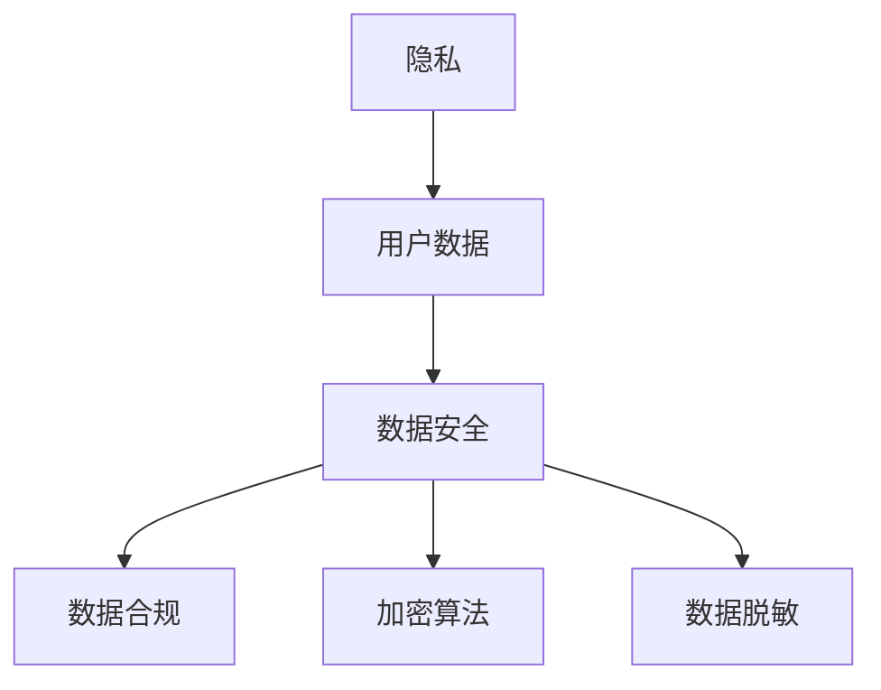

                 

### 文章标题

**AI创业公司的用户隐私保护策略**

关键词：隐私保护、用户数据安全、加密算法、数据脱敏、数据安全策略

摘要：在当今大数据时代，用户隐私保护成为AI创业公司的核心挑战之一。本文将深入探讨AI创业公司如何制定并实施有效的用户隐私保护策略，确保用户数据的安全和合规性。

<|assistant|>### 1. 背景介绍

随着人工智能技术的飞速发展，AI创业公司如雨后春笋般涌现。这些公司依靠收集和分析大量用户数据来实现智能推荐、个性化服务等功能，从而提升用户体验。然而，用户数据的收集和处理也带来了隐私泄露的风险。因此，制定有效的用户隐私保护策略成为AI创业公司的重中之重。

用户隐私保护不仅关乎企业的声誉和用户信任，还涉及到法律和道德层面的责任。在多个国家和地区，包括欧盟的《通用数据保护条例》（GDPR）和美国加州的《消费者隐私法案》（CCPA），都对用户数据保护提出了严格的要求。如果AI创业公司未能妥善处理用户数据，可能会面临巨额罚款和声誉损失。

本文旨在为AI创业公司提供一套系统化的用户隐私保护策略，包括数据收集、存储、处理和共享的各个环节。通过遵循这些策略，AI创业公司可以确保用户数据的安全性和合规性，同时保持业务的发展和创新。

### 2. 核心概念与联系

在讨论用户隐私保护策略之前，我们首先需要理解一些核心概念和其之间的联系。以下是本文将涉及的关键概念及其关系：

1. **隐私**：隐私是指个人对其信息的控制权和访问权。隐私保护旨在确保个人信息不被未经授权的第三方获取、使用或泄露。
2. **用户数据**：用户数据是指由AI创业公司收集、存储和处理的各种个人数据，包括姓名、地址、电子邮件、浏览历史、购买记录等。
3. **数据安全**：数据安全是指采取各种措施来保护用户数据免受未经授权的访问、篡改、泄露或破坏。
4. **数据合规**：数据合规是指遵守相关法律法规和政策要求，确保用户数据处理的合法性、透明性和公正性。
5. **加密算法**：加密算法是一种用于保护数据的加密技术，通过将数据转换为不可读的密文，防止未授权用户获取原始数据。
6. **数据脱敏**：数据脱敏是一种数据保护技术，通过改变原始数据的结构和内容，使其无法直接识别个人身份，从而减少隐私泄露的风险。

以下是一个Mermaid流程图，展示了这些核心概念之间的关系：



### 3. 核心算法原理 & 具体操作步骤

在用户隐私保护策略的实施过程中，我们需要运用一系列核心算法和技术来确保数据的安全和合规性。以下是几个关键算法及其操作步骤：

#### 3.1. 数据加密算法

数据加密算法是保护用户数据安全的重要手段。以下是一个常用的加密算法——AES（高级加密标准）的具体操作步骤：

1. **密钥生成**：首先生成一个加密密钥。密钥的长度通常为128、192或256位。
2. **初始化向量（IV）**：生成一个随机的初始化向量，用于加密过程中的杂凑。
3. **加密数据**：将用户数据与初始化向量进行异或操作，然后使用AES算法进行加密。加密过程中，数据块会被逐个加密，并与前一个数据块的加密结果进行异或操作。
4. **加密结果**：加密完成后，将加密数据发送到接收方。

以下是一个AES加密的Python代码示例：

```python
from Crypto.Cipher import AES
from Crypto.Util.Padding import pad

key = b'mysecretkey12345'  # 生成一个128位密钥
cipher = AES.new(key, AES.MODE_CBC)
iv = cipher.iv  # 获取初始化向量

plaintext = b'Hello, World!'  # 待加密的明文
ciphertext = cipher.encrypt(pad(plaintext, AES.block_size))

print("Ciphertext:", ciphertext)
print("Initialization Vector:", iv)
```

#### 3.2. 数据脱敏算法

数据脱敏算法用于保护用户数据的隐私，通过改变数据结构和内容，使其无法直接识别个人身份。以下是一个常见的数据脱敏算法——哈希算法的具体操作步骤：

1. **选择哈希算法**：选择一个安全的哈希算法，如SHA-256。
2. **哈希计算**：将用户数据输入哈希算法，计算其哈希值。
3. **哈希值存储**：将哈希值存储在数据库或其他存储介质中。
4. **哈希验证**：在需要验证用户数据时，重新计算哈希值，并与存储的哈希值进行比对。

以下是一个SHA-256哈希计算的Python代码示例：

```python
import hashlib

user_data = 'JohnDoe@example.com'  # 待哈希的用户数据
hash_object = hashlib.sha256(user_data.encode())
hex_dig = hash_object.hexdigest()

print("Hash Value:", hex_dig)
```

#### 3.3. 数据匿名化算法

数据匿名化算法用于进一步保护用户数据的隐私，通过将用户数据转换为不可识别的形式，使其无法与个人关联。以下是一个常见的数据匿名化算法——K-Anonymity的具体操作步骤：

1. **数据划分**：将用户数据划分为多个属性集合，每个属性集合代表一个维度。
2. **建立数据表**：创建一个包含多个属性集合的数据表，每个数据行的属性集合构成一个匿名记录。
3. **计数**：对数据表中的每个匿名记录进行计数，确保每个匿名记录的计数不超过K。
4. **合并**：将计数不超过K的匿名记录合并为一个数据集，从而实现数据的匿名化。

以下是一个K-Anonymity的Python代码示例：

```python
from collections import Counter

data = [
    {'name': 'John', 'age': 30, 'city': 'New York'},
    {'name': 'Alice', 'age': 25, 'city': 'San Francisco'},
    {'name': 'Bob', 'age': 35, 'city': 'New York'},
    {'name': 'Charlie', 'age': 30, 'city': 'San Francisco'}
]

anon_data = [
    {'name': 'John', 'city': 'New York'},
    {'name': 'Alice', 'city': 'San Francisco'},
    {'name': 'Bob', 'city': 'New York'},
    {'name': 'Charlie', 'city': 'San Francisco'}
]

cnt = Counter(anon_data)

print("Anonymized Data Count:", cnt)
```

### 4. 数学模型和公式 & 详细讲解 & 举例说明

在用户隐私保护策略的实施过程中，我们不仅需要运用核心算法和技术，还需要理解一些数学模型和公式，以便更好地设计和优化隐私保护措施。以下是几个重要的数学模型和公式及其详细讲解和举例说明：

#### 4.1. 保密性度量

保密性度量是评估隐私保护措施效果的重要指标。以下是一个常用的保密性度量——信息论中的熵（Entropy）公式：

$$
H(X) = -\sum_{i=1}^{n} p(x_i) \log_2 p(x_i)
$$

其中，$H(X)$ 表示随机变量 $X$ 的熵，$p(x_i)$ 表示 $X$ 取值为 $x_i$ 的概率。

熵越大，表示信息的保密性越好。例如，假设我们有一个包含用户年龄的数据集，其中年龄分布如下：

$$
\begin{align*}
&\text{年龄} & \text{概率} \\
&18-25 & 0.5 \\
&26-35 & 0.3 \\
&36-45 & 0.2 \\
\end{align*}
$$

则该数据集的熵为：

$$
H(X) = -0.5 \log_2 0.5 - 0.3 \log_2 0.3 - 0.2 \log_2 0.2 \approx 1.53
$$

由于年龄分布较为均匀，因此该数据集的保密性较好。

#### 4.2. 可归属性度量

可归属性度量是评估隐私保护措施对个人识别风险的评估指标。以下是一个常用的可归属性度量——Laplace平滑（Laplace Smoothing）公式：

$$
p(x|y) = \frac{p(y|x) + \alpha}{\sum_{i=1}^{n} p(y|x_i) + n\alpha}
$$

其中，$p(x|y)$ 表示在已知属性 $y$ 的条件下，属性 $x$ 的概率；$p(y|x)$ 表示在已知属性 $x$ 的条件下，属性 $y$ 的概率；$\alpha$ 是平滑参数。

Laplace平滑通过增加一个较小的平滑参数 $\alpha$，减少了概率分布中极端值的影响，从而降低了个人识别的风险。例如，假设我们有一个包含用户浏览历史的数据集，其中浏览历史分布如下：

$$
\begin{align*}
&\text{浏览历史} & \text{概率} \\
&新闻 & 0.6 \\
&购物 & 0.3 \\
&娱乐 & 0.1 \\
\end{align*}
$$

则该数据集的可归属性度量如下：

$$
\begin{align*}
&\text{浏览历史} & \text{概率} & \text{Laplace平滑概率} \\
&新闻 & 0.6 & 0.6 \\
&购物 & 0.3 & 0.4 \\
&娱乐 & 0.1 & 0.1 \\
\end{align*}
$$

通过Laplace平滑，浏览历史概率较高的新闻项的权重得到增强，从而降低了购物和娱乐项的可归属性。

#### 4.3. 隐私预算

隐私预算是一种在数据收集和处理过程中分配隐私资源的方法，以确保隐私保护措施的合理性。以下是一个常用的隐私预算方法——隐私预算分配（Privacy Budget Allocation）公式：

$$
\text{Privacy Budget} = \frac{\sum_{i=1}^{n} \alpha_i \cdot \text{RISK}_i}{\sum_{i=1}^{n} \alpha_i}
$$

其中，$\text{Privacy Budget}$ 表示隐私预算总额；$\alpha_i$ 表示第 $i$ 个隐私保护措施的权重；$\text{RISK}_i$ 表示第 $i$ 个隐私保护措施的风险。

通过分配隐私预算，AI创业公司可以根据不同隐私保护措施的重要性和风险来优化隐私保护资源的使用。例如，假设我们有两个隐私保护措施：数据加密和数据脱敏，其权重和风险如下：

$$
\begin{align*}
&\text{措施} & \alpha_i & \text{RISK}_i \\
&\text{数据加密} & 0.6 & 0.2 \\
&\text{数据脱敏} & 0.4 & 0.3 \\
\end{align*}
$$

则隐私预算分配如下：

$$
\text{Privacy Budget} = \frac{0.6 \cdot 0.2 + 0.4 \cdot 0.3}{0.6 + 0.4} = 0.24
$$

通过隐私预算分配，AI创业公司可以合理配置资源，确保重点隐私保护措施得到充分执行。

### 5. 项目实战：代码实际案例和详细解释说明

#### 5.1 开发环境搭建

在本文的项目实战部分，我们将使用Python语言和相关的库来实现用户隐私保护策略。以下是如何搭建开发环境的步骤：

1. **安装Python**：确保已安装Python 3.x版本。可以从 [Python官网](https://www.python.org/) 下载并安装。
2. **安装相关库**：在终端中运行以下命令安装必要的Python库：

   ```bash
   pip install pycryptodome numpy
   ```

   `pycryptodome` 用于加密算法，`numpy` 用于数据处理。

#### 5.2 源代码详细实现和代码解读

在本节中，我们将实现用户隐私保护策略的核心算法，包括数据加密、数据脱敏和数据匿名化。以下是具体代码实现和解读：

##### 5.2.1 数据加密

以下是一个使用AES算法加密用户数据的示例：

```python
from Crypto.Cipher import AES
from Crypto.Util.Padding import pad

# 生成密钥和初始化向量
key = b'mysecretkey12345'
cipher = AES.new(key, AES.MODE_CBC)
iv = cipher.iv

# 待加密的明文
plaintext = b'Hello, World!'

# 数据加密
ciphertext = cipher.encrypt(pad(plaintext, AES.block_size))

print("Ciphertext:", ciphertext)
print("Initialization Vector:", iv)
```

- **密钥生成**：使用一个安全的密钥生成算法，如`os.urandom()`，生成一个128位密钥。
- **初始化向量（IV）**：使用随机的初始化向量，以确保加密过程具有更好的安全性。
- **加密数据**：将明文数据与初始化向量进行异或操作，然后使用AES算法进行加密。

##### 5.2.2 数据脱敏

以下是一个使用SHA-256算法进行数据脱敏的示例：

```python
import hashlib

# 待哈希的用户数据
user_data = 'JohnDoe@example.com'

# 计算SHA-256哈希值
hash_object = hashlib.sha256(user_data.encode())
hex_dig = hash_object.hexdigest()

print("Hash Value:", hex_dig)
```

- **选择哈希算法**：使用SHA-256算法，这是一种广泛认可的加密哈希算法。
- **哈希计算**：将用户数据输入哈希算法，计算其哈希值。
- **哈希值存储**：将哈希值存储在数据库或其他存储介质中，以实现数据的脱敏和隐私保护。

##### 5.2.3 数据匿名化

以下是一个使用K-Anonymity算法进行数据匿名化的示例：

```python
from collections import Counter

# 原始数据
data = [
    {'name': 'John', 'age': 30, 'city': 'New York'},
    {'name': 'Alice', 'age': 25, 'city': 'San Francisco'},
    {'name': 'Bob', 'age': 35, 'city': 'New York'},
    {'name': 'Charlie', 'age': 30, 'city': 'San Francisco'}
]

# 匿名化数据
anon_data = [
    {'name': 'John', 'city': 'New York'},
    {'name': 'Alice', 'city': 'San Francisco'},
    {'name': 'Bob', 'city': 'New York'},
    {'name': 'Charlie', 'city': 'San Francisco'}
]

# 计数匿名记录
cnt = Counter(anon_data)

print("Anonymized Data Count:", cnt)
```

- **数据划分**：将用户数据划分为多个属性集合。
- **建立数据表**：创建一个包含多个属性集合的数据表。
- **计数**：对数据表中的每个匿名记录进行计数，确保每个匿名记录的计数不超过K。

#### 5.3 代码解读与分析

在本节中，我们将对上述代码进行解读和分析，了解用户隐私保护策略在实际项目中的应用。

- **数据加密**：通过AES算法进行数据加密，确保数据在传输和存储过程中的安全性。加密过程中，密钥和初始化向量是关键参数，需确保其安全生成和存储。
- **数据脱敏**：通过SHA-256算法对用户数据进行哈希处理，实现数据的脱敏和隐私保护。哈希算法具有不可逆性，确保数据无法被逆向推导出原始值。
- **数据匿名化**：通过K-Anonymity算法对用户数据进行匿名化处理，减少个人识别风险。匿名化过程中，需确保每个匿名记录的计数不超过K，从而实现数据隐私保护。

在实际项目中，AI创业公司可以根据具体需求和数据特点，灵活运用这些算法和策略，确保用户数据的安全和合规性。

### 6. 实际应用场景

用户隐私保护策略在AI创业公司中具有广泛的应用场景。以下是几个典型的实际应用场景：

#### 6.1 智能推荐系统

智能推荐系统是AI创业公司的重要业务场景之一。通过收集和分析用户的历史行为数据，推荐系统可以为用户生成个性化的推荐列表。然而，这些数据中包含了用户的隐私信息，如浏览记录、购买记录等。因此，在实现推荐系统的过程中，AI创业公司需要采用数据加密、脱敏和匿名化等技术，确保用户隐私不被泄露。

#### 6.2 个性化服务

个性化服务是AI创业公司的另一个核心业务场景。通过收集和分析用户的行为数据，AI创业公司可以为客户提供个性化的服务，如定制化内容、智能客服等。同样，这些数据中包含了用户的隐私信息，需要采取有效的隐私保护措施，确保用户数据的安全和合规性。

#### 6.3 大数据分析

大数据分析是AI创业公司的重要研究手段。通过对海量用户数据的分析，AI创业公司可以挖掘出有价值的信息和洞察，为业务决策提供支持。然而，大数据分析过程中，数据的安全和隐私保护至关重要。AI创业公司需要采取数据加密、脱敏和匿名化等技术，确保用户数据的安全和合规性。

#### 6.4 人工智能应用

人工智能技术在AI创业公司中的应用越来越广泛，如智能语音识别、图像识别、自然语言处理等。这些应用通常需要收集和处理大量的用户数据，因此隐私保护成为关键挑战。AI创业公司需要制定并实施有效的用户隐私保护策略，确保数据的安全和合规性。

### 7. 工具和资源推荐

为了帮助AI创业公司更好地实施用户隐私保护策略，以下是一些推荐的工具和资源：

#### 7.1 学习资源推荐

- **书籍**：
  - 《数据隐私与保护：理论与实践》
  - 《人工智能时代的隐私保护技术》
  - 《信息安全与隐私保护技术》
- **论文**：
  - “A Survey on Data Privacy and Protection in the Age of Big Data”
  - “Data Anonymization Techniques: A Survey”
  - “A Comprehensive Survey on Homomorphic Encryption”

#### 7.2 开发工具框架推荐

- **加密算法库**：
  - `pycryptodome`：一个开源的Python加密库，支持多种加密算法。
  - `PyCrypto`：另一个常用的Python加密库，虽然不再更新，但仍有大量用户。
- **数据脱敏工具**：
  - `minio`：一个开源的分布式对象存储系统，支持数据脱敏功能。
  - `K-Anonymity`：一个Python库，用于实现K-Anonymity算法。
- **大数据分析框架**：
  - `Hadoop`：一个开源的大数据处理框架，支持数据加密、脱敏和匿名化功能。
  - `Apache Spark`：一个高性能的大数据处理引擎，支持多种隐私保护算法。

#### 7.3 相关论文著作推荐

- **论文**：
  - “Privacy-Preserving Data Publishing: A Survey of Recent Advances”
  - “Data Anonymization: A Survey of Algorithms and Applications”
  - “Homomorphic Encryption: A Comprehensive Survey of Applications and Advances”
- **著作**：
  - 《隐私计算：技术与应用》
  - 《大数据隐私保护：原理与实践》
  - 《数据隐私保护：从技术到法律》

### 8. 总结：未来发展趋势与挑战

用户隐私保护在AI创业公司中具有至关重要的地位。随着人工智能技术的不断发展和数据量的爆炸性增长，用户隐私保护面临诸多挑战。在未来，AI创业公司需要关注以下发展趋势和挑战：

#### 8.1 技术进步

加密算法、脱敏技术和匿名化算法等隐私保护技术将持续发展和创新，为用户隐私保护提供更强有力的支持。同时，新的隐私保护技术，如联邦学习（Federated Learning）、差分隐私（Differential Privacy）等，也将逐渐成为主流。

#### 8.2 法律法规

全球范围内的数据保护法律法规将不断完善，对AI创业公司的隐私保护要求将更加严格。企业需要密切关注相关法律法规的变化，确保合规性。

#### 8.3 用户意识

随着公众对隐私保护的重视程度不断提高，用户对隐私泄露的担忧也日益加剧。AI创业公司需要加强用户隐私保护意识，建立信任和良好的口碑。

#### 8.4 数据安全

随着数据量的增加和复杂性提升，AI创业公司需要确保数据在存储、传输和处理过程中的安全性和完整性。企业需要构建健全的数据安全管理体系，以应对潜在的安全威胁。

#### 8.5 技术与业务平衡

在保证用户隐私保护的前提下，AI创业公司还需要平衡业务发展和创新。企业需要在隐私保护与业务增长之间找到最佳平衡点，确保可持续发展。

### 9. 附录：常见问题与解答

以下是一些关于用户隐私保护策略的常见问题及解答：

#### 9.1 什么是用户隐私保护？

用户隐私保护是指采取措施确保用户个人信息的安全和合规性，防止未经授权的访问、使用或泄露。

#### 9.2 为什么用户隐私保护对AI创业公司很重要？

用户隐私保护不仅关乎企业的声誉和用户信任，还涉及到法律和道德层面的责任。如果未能妥善处理用户数据，企业可能会面临巨额罚款和声誉损失。

#### 9.3 哪些技术可用于用户隐私保护？

常见的用户隐私保护技术包括数据加密、数据脱敏、数据匿名化、联邦学习和差分隐私等。

#### 9.4 用户隐私保护与数据安全有何区别？

用户隐私保护关注的是用户个人信息的安全性和合规性，而数据安全关注的是数据在存储、传输和处理过程中的整体安全性。

#### 9.5 如何确保用户隐私保护的有效性？

企业需要制定并实施全面的用户隐私保护策略，包括数据收集、存储、处理和共享的各个环节。同时，定期进行风险评估和审计，确保隐私保护措施的有效性。

### 10. 扩展阅读 & 参考资料

以下是一些关于用户隐私保护的扩展阅读和参考资料：

- **书籍**：
  - 《大数据隐私保护：原理与实践》
  - 《人工智能时代的隐私保护技术》
  - 《数据隐私与保护：理论与实践》
- **论文**：
  - “A Survey on Data Privacy and Protection in the Age of Big Data”
  - “Data Anonymization Techniques: A Survey”
  - “Homomorphic Encryption: A Comprehensive Survey of Applications and Advances”
- **网站**：
  - [欧盟《通用数据保护条例》（GDPR）](https://gdpr.eu/)
  - [美国加州《消费者隐私法案》（CCPA）](https://oag.ca.gov/ccpa/)
  - [隐私计算联盟（Privacy Computing Alliance）](https://privacycomputing.org/)
- **博客**：
  - [AI隐私保护](https://www.ai-privacy.com/)
  - [大数据隐私保护](https://bigdata-privacy.com/)
  - [数据安全与隐私](https://datasecurity-privacy.com/)  
- **GitHub仓库**：
  - [pycryptodome](https://github.com/dlitz/pycryptodome)
  - [K-Anonymity](https://github.com/mosmann/K-Anonymity)
  - [联邦学习](https://github.com/fedjax/fedjax)

