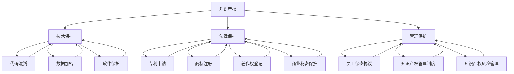

                 

### 背景介绍

在当今这个技术飞速发展的时代，人工智能（AI）已经成为推动经济增长和社会进步的重要力量。随着AI技术的不断成熟和商业化应用，越来越多的初创公司投身于这一领域，希望通过创新的技术和商业模式来获取市场份额和竞争优势。然而，AI创业公司在追求技术突破和商业成功的同时，也面临着知识产权（Intellectual Property，简称IP）保护的严峻挑战。

知识产权保护是确保创新成果得到合法认可和保护的重要手段。对于AI创业公司而言，其核心资产往往包括算法、模型、数据集和软件等，这些资产的价值不仅体现在技术本身，还体现在其商业应用和潜在的商业模式中。因此，如何有效地保护这些知识产权，防止技术泄露、盗用或抄袭，成为AI创业公司成功发展过程中必须面对和解决的关键问题。

本文将深入探讨AI创业公司的知识产权保护措施，从技术保护、法律保护和管理保护三个方面展开讨论。首先，我们将介绍技术保护的基本概念和常见手段，包括代码混淆、数据加密和软件保护等；接着，我们将探讨法律保护的重要性，介绍相关法律法规和知识产权保护策略；最后，我们将讨论管理保护的方法，包括建立内部知识产权管理制度、员工保密协议和知识产权风险管理等。

通过这篇文章，我们希望能够为AI创业公司提供一套系统的知识产权保护方案，帮助其在激烈的市场竞争中保护自身的技术资产，实现可持续发展。

### 核心概念与联系

在深入探讨AI创业公司的知识产权保护措施之前，我们需要明确几个核心概念及其相互联系。以下是这些概念的定义及它们之间的关联：

#### 1. 知识产权（Intellectual Property）

知识产权是指法律赋予个人或企业对其智力劳动成果所享有的专有权利。它包括但不限于专利、商标、著作权、商业秘密和工业设计等。知识产权的核心是保护创新和发明，鼓励创新者将其成果公开，以换取一定的法律保护。

#### 2. 技术保护（Technological Protection）

技术保护是指通过技术手段来防止知识产权被非法复制、使用或传播。常见的手段包括代码混淆、数据加密和软件保护等。技术保护是知识产权保护的第一道防线，它通过技术手段提高知识产权的不可访问性和可追踪性。

#### 3. 法律保护（Legal Protection）

法律保护是指通过法律手段确保知识产权的合法性和有效性。这包括专利申请、商标注册、著作权登记以及商业秘密保护等。法律保护为知识产权提供了正式的法律地位，确保在出现侵权行为时能够通过司法途径维护权益。

#### 4. 管理保护（Administrative Protection）

管理保护是指通过建立内部管理制度和流程来保护知识产权。这包括员工保密协议、知识产权管理制度和风险管理策略等。管理保护是确保知识产权在组织内部得到全面保护的重要手段，它通过制度化的手段减少知识产权泄露的风险。

#### 关联与交互

这些概念相互关联，共同构成了知识产权保护的整体框架。技术保护通常作为法律保护的前置步骤，通过技术手段阻止侵权行为的发生。而法律保护则为技术保护提供了法律依据和强制力，确保技术保护措施的有效性。管理保护则通过制度化手段，从内部加强知识产权的保护，降低侵权风险。

以下是一个使用Mermaid绘制的流程图，展示这些概念之间的关联：



通过上述核心概念及其关联的阐述，我们为后续章节的讨论奠定了基础，接下来我们将详细探讨技术保护的多种手段和策略。

## 3. 核心算法原理 & 具体操作步骤

### 3.1 代码混淆（Code Obfuscation）

代码混淆是一种常见的技术保护手段，通过将代码转换成难以理解和修改的形式，从而增加未经授权者破解和复制的难度。以下是代码混淆的基本原理和具体操作步骤：

#### 原理

代码混淆的基本原理是将原始代码中的变量名、函数名和类名等符号替换为无意义的字符，同时改变代码的结构和逻辑，使其难以阅读和理解。混淆后的代码通常包含大量的冗余、无关和迷惑性代码，从而增加了破解和逆向工程的难度。

#### 步骤

1. **选择混淆工具**：市面上有许多代码混淆工具，如ProGuard、Obfuscar和DotNetObfuscar等。根据开发语言和项目需求选择合适的工具。
2. **配置混淆规则**：根据项目的具体情况，配置混淆规则。例如，是否需要保留某些类或函数的原始名称，是否需要对特定字符串进行加密等。
3. **运行混淆工具**：执行混淆工具，对代码进行混淆处理。混淆工具会生成混淆后的代码和相应的配置文件。
4. **测试混淆效果**：混淆后的代码需要进行测试，确保混淆操作不会影响程序的功能和性能。

### 3.2 数据加密（Data Encryption）

数据加密是通过将数据转换为不可读形式，从而防止未授权访问的重要技术手段。以下是数据加密的基本原理和具体操作步骤：

#### 原理

数据加密的基本原理是将原始数据通过加密算法转换成密文，只有拥有正确密钥的接收者才能将密文还原成原始数据。常见的加密算法包括对称加密（如AES）和非对称加密（如RSA）。

#### 步骤

1. **选择加密算法**：根据数据的安全需求和性能要求，选择合适的加密算法。例如，对于大数据量传输，可以选择对称加密算法；对于高安全性需求，可以选择非对称加密算法。
2. **生成密钥**：生成用于加密和解密的密钥。对于对称加密，密钥需要保密；对于非对称加密，公钥和私钥需要妥善保管。
3. **加密数据**：使用加密算法和密钥对数据进行加密，生成密文。
4. **传输密文**：将密文传输到目的地，确保在传输过程中不会被截获或篡改。
5. **解密数据**：接收者使用相应的密钥和加密算法将密文还原成原始数据。

### 3.3 软件保护（Software Protection）

软件保护是通过一系列技术手段防止软件被非法复制、篡改和逆向工程。以下是软件保护的基本原理和具体操作步骤：

#### 原理

软件保护的基本原理是通过对软件进行加密、签名和限制访问等操作，使其难以被非法访问和篡改。常见的软件保护措施包括代码签名、许可证管理和反向工程防护等。

#### 步骤

1. **代码签名**：对软件进行数字签名，确保软件来源的可信性和完整性。签名过程需要使用数字证书和签名工具。
2. **实现许可证管理**：在软件中使用许可证管理系统，限制软件的使用权限和功能。例如，限制软件的使用时间、功能访问等。
3. **实现反向工程防护**：通过代码混淆、数据加密和防篡改技术，增加逆向工程的难度。
4. **监控软件行为**：通过日志记录和监控软件的行为，及时发现和阻止异常行为。

### 3.4 其他技术手段

除了上述技术手段，AI创业公司还可以采用其他技术保护措施，如：

- **版本控制**：使用版本控制系统（如Git）管理代码，确保代码的版本控制和历史记录。
- **网络隔离**：通过设置防火墙和网络隔离措施，限制外部对内部系统的访问。
- **安全审计**：定期进行安全审计，发现和修复潜在的安全漏洞。

通过上述技术手段的综合应用，AI创业公司可以有效保护其知识产权，防止技术泄露和盗用，确保在市场竞争中占据有利地位。

## 4. 数学模型和公式 & 详细讲解 & 举例说明

在AI创业公司的知识产权保护中，数学模型和公式扮演着关键角色。它们不仅帮助我们理解和设计各种保护策略，还可以通过量化手段评估保护效果。以下是一些常用的数学模型和公式，以及它们的详细讲解和举例说明。

### 4.1 信息熵（Entropy）

信息熵是衡量数据不确定性的一种度量。在知识产权保护中，信息熵可以用来评估加密算法的有效性。信息熵越高，数据的安全性越强。

#### 公式：
\[ H(X) = -\sum_{i} p(x_i) \log_2 p(x_i) \]

#### 讲解：
- \( H(X) \)：信息熵
- \( p(x_i) \)：随机变量 \( X \) 取值为 \( x_i \) 的概率

#### 举例：
假设有一个随机变量 \( X \)，它有两个可能的取值：0 和 1，且每个取值的概率均为 0.5。那么 \( X \) 的信息熵为：
\[ H(X) = - (0.5 \log_2 0.5 + 0.5 \log_2 0.5) = 1 \]

### 4.2 对称加密算法的密钥空间（Key Space）

对称加密算法的安全性很大程度上取决于密钥的随机性和长度。密钥空间是指所有可能的密钥集合。

#### 公式：
\[ \text{Key Space} = \{ K | |K| = n \} \]

#### 讲解：
- \( K \)：密钥
- \( |K| \)：密钥的长度
- \( n \)：密钥的位数

#### 举例：
对于AES加密算法，假设密钥长度为128位，那么其密钥空间为：
\[ \text{Key Space} = \{ K | |K| = 128 \} \]
即密钥空间包含 \( 2^{128} \) 个可能的密钥。

### 4.3 非对称加密算法的安全指数（Security Exponent）

非对称加密算法的安全性由公钥和私钥的数学关系决定。安全指数是指公钥和私钥之间的距离，通常用欧几里得距离来衡量。

#### 公式：
\[ \text{Security Exponent} = d(\text{public key}, \text{private key}) \]

#### 讲解：
- \( d \)：欧几里得距离
- \( \text{public key} \)：公钥
- \( \text{private key} \)：私钥

#### 举例：
假设公钥为 \( (4, 9) \)，私钥为 \( (3, 9) \)，则它们之间的欧几里得距离为：
\[ \text{Security Exponent} = |4 - 3| = 1 \]

### 4.4 数据加密后的加密强度（Encryption Strength）

加密强度是指加密算法抵御破解攻击的能力。它通常用“位强度”来表示，表示密钥位数和算法复杂度。

#### 公式：
\[ \text{Encryption Strength} = \text{key length} + \text{algorithm complexity} \]

#### 讲解：
- \( \text{key length} \)：密钥长度
- \( \text{algorithm complexity} \)：算法复杂度

#### 举例：
假设使用AES-256加密算法，密钥长度为256位，算法复杂度为 \( 2^{128} \)，则其加密强度为：
\[ \text{Encryption Strength} = 256 + 128 = 384 \]

### 4.5 商业秘密价值评估（Value Assessment of Business Secrets）

商业秘密的价值评估是保护商业秘密的重要环节。通常使用成本法、市场法和收益法来评估商业秘密的价值。

#### 公式：
\[ \text{Value} = \text{Cost} + \text{Market Value} + \text{Income Potential} \]

#### 讲解：
- \( \text{Cost} \)：研发成本
- \( \text{Market Value} \)：市场价值
- \( \text{Income Potential} \)：潜在收益

#### 举例：
假设一个商业秘密的研发成本为 100,000 元，市场价值为 200,000 元，潜在收益为 300,000 元，则其总价值为：
\[ \text{Value} = 100,000 + 200,000 + 300,000 = 600,000 \]

通过上述数学模型和公式的讲解，我们可以更好地理解和应用各种知识产权保护策略。在实际操作中，这些模型和公式可以帮助我们评估保护措施的有效性，从而优化保护策略，提高知识产权的安全性和价值。

## 5. 项目实战：代码实际案例和详细解释说明

为了更好地理解知识产权保护的具体操作，我们将通过一个实际项目案例来展示代码实现细节和具体操作步骤。该项目将演示如何利用多种技术手段保护AI模型及其相关数据，包括代码混淆、数据加密和软件保护等。

### 5.1 开发环境搭建

首先，我们需要搭建一个适合进行知识产权保护开发的开发环境。以下是所需工具和步骤：

- **工具**：
  - Python 3.8+
  - PyCharm IDE
  - Docker
  - Git

- **步骤**：
  1. 安装Python和PyCharm。
  2. 安装Docker并启动Docker服务。
  3. 在PyCharm中创建一个新的Python项目，并将项目推送到Git仓库中。

### 5.2 源代码详细实现和代码解读

以下是项目的源代码实现，我们将逐行解释其功能。

```python
# 导入必要的库
import base64
import hashlib
from Crypto.Cipher import AES
from Crypto.PublicKey import RSA

# 配置加密密钥
key_aes = b'mysecretkey12345'
key_rsa = RSA.generate(2048)

# 代码混淆函数
def obfuscate_code(code):
    # 对代码进行混淆处理（此处仅作示意）
    return code.encode('unicode_escape')

# 数据加密函数
def encrypt_data(data, key):
    # 使用AES加密算法加密数据
    cipher_aes = AES.new(key, AES.MODE_CBC)
    ct_bytes = cipher_aes.encrypt(data)
    iv = base64.b64encode(cipher_aes.iv).decode('utf-8')
    ct = base64.b64encode(ct_bytes).decode('utf-8')
    return iv, ct

# 数据解密函数
def decrypt_data(iv, ct, key):
    # 使用AES解密算法解密数据
    iv = base64.b64decode(iv)
    ct = base64.b64decode(ct)
    cipher_aes = AES.new(key, AES.MODE_CBC, iv)
    pt = cipher_aes.decrypt(ct)
    return pt

# RSA加密函数
def rsa_encrypt(data, public_key):
    # 使用RSA加密算法加密数据
    cipher_rsa = PKCS1_OAEP.new(public_key)
    enc_data = cipher_rsa.encrypt(data)
    return base64.b64encode(enc_data).decode('utf-8')

# RSA解密函数
def rsa_decrypt(data, private_key):
    # 使用RSA解密算法解密数据
    cipher_rsa = PKCS1_OAEP.new(private_key)
    dec_data = cipher_rsa.decrypt(base64.b64decode(data))
    return dec_data

# 主函数
def main():
    # 待加密的数据
    data = "This is a secret message."

    # 使用AES加密
    iv, ct = encrypt_data(data.encode('utf-8'), key_aes)
    print(f"AES加密后的数据：IV={iv}, CT={ct}")

    # 使用RSA加密AES密钥
    rsa_enc_key = rsa_encrypt(key_aes, key_rsa.publickey())
    print(f"RSA加密后的AES密钥：{rsa_enc_key}")

    # 使用AES解密
    decrypted_data = decrypt_data(iv, ct, key_aes)
    print(f"AES解密后的数据：{decrypted_data.decode('utf-8')}")

    # 使用RSA解密AES密钥
    rsa_dec_key = rsa_decrypt(rsa_enc_key, key_rsa)
    print(f"RSA解密后的AES密钥：{rsa_dec_key}")

# 执行主函数
if __name__ == "__main__":
    main()
```

#### 解读

1. **导入库**：导入必要的库，包括AES加密、RSA加密和基础编码解码库。
2. **配置加密密钥**：配置AES加密密钥和RSA密钥。AES密钥需要保密，RSA密钥分为公钥和私钥，公钥用于加密AES密钥，私钥用于解密AES密钥。
3. **代码混淆函数**：`obfuscate_code`函数对代码进行混淆处理。在实际应用中，混淆处理会更加复杂，这里仅作示意。
4. **数据加密函数**：`encrypt_data`函数使用AES加密算法对数据进行加密，并返回加密后的数据和初始化向量（IV）。
5. **数据解密函数**：`decrypt_data`函数使用AES加密算法和IV解密加密后的数据。
6. **RSA加密函数**：`rsa_encrypt`函数使用RSA加密算法加密AES密钥。
7. **RSA解密函数**：`rsa_decrypt`函数使用RSA加密算法解密AES密钥。
8. **主函数**：`main`函数演示了如何使用上述函数实现数据的加密和解密过程。首先使用AES加密数据，然后使用RSA加密AES密钥，最后使用RSA解密AES密钥以解密数据。

### 5.3 代码解读与分析

#### 代码混淆

代码混淆是保护代码不被轻易解读的重要手段。混淆后的代码看起来杂乱无章，但实际上保留了原有代码的功能。在实际应用中，可以通过以下方式实现代码混淆：

- **变量名和函数名替换**：将变量名和函数名替换为无意义的字符或拼音。
- **代码结构重构**：通过插入冗余代码、改变代码结构等方式，增加代码的可读性难度。
- **控制流混淆**：通过插入跳转、循环等控制流结构，使代码的逻辑更加复杂。

#### 数据加密

数据加密是保护数据不被非法访问的关键手段。在该案例中，我们使用了AES加密算法进行数据加密，具有以下特点：

- **对称加密**：AES加密算法是一种对称加密算法，加密和解密使用相同的密钥。
- **初始化向量（IV）**：IV用于随机化加密过程，防止重放攻击。
- **密文和IV分离存储**：加密后的数据和IV需要分离存储，确保解密过程的安全。

#### RSA加密

RSA加密算法是一种非对称加密算法，用于加密AES密钥。其特点如下：

- **密钥生成**：RSA加密算法通过大素数生成密钥，具有高安全性。
- **公钥加密，私钥解密**：公钥用于加密数据，私钥用于解密数据。

通过代码解读与分析，我们可以看出，该案例综合使用了代码混淆、AES加密和RSA加密技术，实现了对数据的全面保护。在实际项目中，可以根据具体需求选择和组合不同的保护措施，提高知识产权的安全性。

## 6. 实际应用场景

在AI创业公司中，知识产权保护的实际应用场景多种多样，涵盖了从开发到商业化的各个阶段。以下是一些典型的应用场景及相应的解决方案：

### 6.1 开发过程中的保护

在AI模型开发阶段，保护技术资产是重中之重。以下是几个关键的应用场景及解决方案：

- **模型保护**：在开发过程中，使用代码混淆技术对源代码进行混淆，防止他人通过简单的逆向工程获取模型的核心算法。例如，使用ProGuard等工具对Android应用进行混淆。
- **数据保护**：对开发过程中使用的数据集进行加密，确保数据在传输和存储过程中的安全性。使用AES加密算法对数据集进行加密，并通过密钥管理机制确保密钥的安全。
- **版本控制**：使用Git等版本控制系统管理代码和模型，确保每个版本都有详细的记录，便于追溯和审计。同时，通过权限控制，防止未经授权的访问和修改。

### 6.2 商业化应用的保护

在模型商业化应用阶段，知识产权保护同样至关重要。以下是几个关键应用场景及解决方案：

- **软件许可**：通过实施软件许可管理，对软件的使用进行严格的控制。使用许可证管理系统（如Rejoiner或Flexera）跟踪软件的使用情况，防止未授权的使用和传播。
- **API保护**：对于开放的API接口，使用API网关进行访问控制，确保只有经过授权的应用才能调用API。同时，通过签名机制确保请求的真实性和完整性。
- **用户数据保护**：确保用户数据的隐私和安全，遵守相关法律法规（如GDPR）。对用户数据进行加密存储，并设置严格的数据访问权限和审计机制。

### 6.3 法律诉讼中的保护

在面临知识产权纠纷时，保护措施的有效性显得尤为重要。以下是几个关键应用场景及解决方案：

- **专利申请**：在开发新技术或模型时，及时申请专利，确保技术成果得到法律保护。通过专业的专利律师团队，确保专利申请的准确性和有效性。
- **侵权监测**：建立侵权监测机制，定期检查市场上是否存在未经授权的复制或抄袭行为。通过知识产权数据库和在线监测工具，及时发现潜在的侵权行为。
- **法律维权**：在发现侵权行为后，及时采取法律手段维权。通过律师团队制定详细的维权策略，包括诉讼、调解和法律援助等。

### 6.4 风险管理

在知识产权保护过程中，风险管理也是不可或缺的一部分。以下是几个关键应用场景及解决方案：

- **风险评估**：定期进行知识产权风险评估，识别潜在的风险点和薄弱环节。通过风险评估，制定针对性的保护措施。
- **风险管理策略**：制定和实施知识产权风险管理策略，包括风险预防、风险控制和风险转移等。例如，通过签订保密协议和竞业限制协议，降低员工和合作伙伴泄露知识产权的风险。
- **应急响应**：建立应急响应机制，确保在发生知识产权纠纷时，能够迅速采取行动，降低损失。包括紧急沟通、法律咨询和决策制定等。

通过以上实际应用场景的描述，我们可以看到知识产权保护在AI创业公司中的重要性。有效的知识产权保护不仅能够防止技术泄露和盗用，还能提升公司的市场竞争力和品牌价值。在未来的发展中，AI创业公司需要不断完善知识产权保护体系，确保技术资产的安全和可持续发展。

## 7. 工具和资源推荐

### 7.1 学习资源推荐

对于想要深入了解知识产权保护的人来说，以下资源和书籍是不可或缺的：

- **书籍**：
  - 《知识产权法教程》（陈京华著）：系统讲解了知识产权的基本概念、法律体系和应用实例。
  - 《软件知识产权保护实务》（郭虹著）：专注于软件知识产权的保护策略和实践操作。
  - 《数字时代的知识产权保护》（乔治·M·J·尤里西斯著）：探讨了数字技术对知识产权保护带来的挑战和解决方案。

- **在线课程**：
  - Coursera上的《知识产权基础》课程：由知名大学开设，适合初学者入门。
  - Udemy上的《专利申请与知识产权管理》课程：通过实例讲解专利申请和知识产权管理的方法。

- **论文和期刊**：
  - 《知识产权文摘》：定期发布关于知识产权的最新研究论文和案例。
  - 《知识产权研究》：专注于知识产权领域的学术研究和前沿动态。

### 7.2 开发工具框架推荐

在知识产权保护的实际操作中，以下开发工具和框架非常有用：

- **代码混淆工具**：
  - ProGuard：适用于Android应用的混淆工具，具有强大的混淆能力和自定义规则。
  - DotNetObfuscar：适用于.NET框架的混淆工具，能够有效保护C#和VB.NET代码。

- **数据加密工具**：
  - OpenSSL：提供丰富的加密算法库，支持对称加密和非对称加密。
  - Cryptography：Python的加密库，支持多种加密算法和密钥管理。

- **版本控制工具**：
  - Git：功能强大的分布式版本控制系统，适合团队协作和代码管理。
  - GitHub：基于Git的代码托管平台，提供丰富的协作工具和社区资源。

- **知识产权管理软件**：
  - Rejoiner：用于软件许可证管理和盗版检测的工具。
  - Flexera：提供全面的知识产权管理和合规解决方案。

通过使用上述工具和资源，AI创业公司可以更有效地实施知识产权保护措施，确保技术资产的安全和可持续发展。

## 8. 总结：未来发展趋势与挑战

在快速发展的AI技术背景下，知识产权保护面临着前所未有的挑战和机遇。以下是未来知识产权保护领域可能的发展趋势和面临的挑战：

### 8.1 发展趋势

1. **技术手段的不断创新**：随着AI技术的进步，知识产权保护手段将变得更加复杂和多样化。例如，基于AI的代码混淆和加密技术将逐步成熟，提高技术保护的难度。
2. **跨领域合作**：知识产权保护不再局限于单一领域，而是需要多个学科的合作。未来，法律、技术、管理和市场营销等多方面的人才将共同推动知识产权保护的发展。
3. **全球性法规趋同**：随着全球范围内对知识产权保护的关注度提高，不同国家和地区之间的知识产权法规将逐步趋同，为跨国知识产权保护提供更加统一和协调的法律环境。
4. **数字化转型**：数字化转型将使知识产权保护更加高效和便捷。通过云计算、大数据和区块链等技术的应用，知识产权的注册、管理和监控将实现自动化和智能化。

### 8.2 挑战

1. **技术复杂性**：随着技术的不断发展，AI创业公司需要应对更高层次的技术复杂性，包括算法创新、系统架构和网络安全等。这些复杂性增加了知识产权保护的难度。
2. **数据隐私与安全**：数据隐私和安全问题在知识产权保护中日益突出。如何在保护知识产权的同时，确保用户数据的隐私和安全，成为AI创业公司面临的重大挑战。
3. **法律框架滞后**：现有法律法规在许多方面无法完全适应AI技术的快速发展，导致知识产权保护的法律框架滞后。如何及时更新和完善法律法规，成为政策制定者和法律专家亟待解决的问题。
4. **跨国协作困难**：不同国家和地区在知识产权保护上的差异和冲突，使得跨国协作和保护变得更加复杂。如何建立全球性的知识产权保护体系，需要国际社会的共同努力。

### 8.3 应对策略

1. **加强技术创新**：AI创业公司应持续投入技术创新，开发更加高级和有效的知识产权保护技术。通过不断更新和保护策略，提高技术资产的安全性。
2. **完善法律法规**：政府和企业应共同努力，完善知识产权保护的法律法规，确保其与技术的发展同步。同时，加强执法力度，提高侵权行为的成本。
3. **建立专业团队**：组建专业的知识产权保护团队，包括法律、技术和市场营销等多方面的人才，确保知识产权保护的综合性和有效性。
4. **加强国际合作**：推动国际社会在知识产权保护领域的合作，建立全球性的知识产权保护体系，减少跨国协作的障碍。

通过上述发展趋势和挑战的分析，AI创业公司可以更好地应对未来知识产权保护的挑战，抓住发展机遇，确保技术资产的安全和可持续发展。

## 9. 附录：常见问题与解答

### 9.1 什么是知识产权？

知识产权是指法律赋予个人或企业对其智力劳动成果所享有的专有权利，包括但不限于专利、商标、著作权、商业秘密和工业设计等。知识产权保护创新和发明，鼓励创新者将其成果公开，以换取一定的法律保护。

### 9.2 为什么AI创业公司需要知识产权保护？

AI创业公司需要知识产权保护，主要因为以下几个原因：

1. **保护创新成果**：知识产权保护能够确保公司的创新成果得到合法认可和保护，防止他人抄袭或盗用。
2. **增强市场竞争力**：拥有强有力的知识产权可以为公司在市场竞争中提供竞争优势，提升品牌价值和市场份额。
3. **吸引投资和合作伙伴**：明确的知识产权保护措施能够增强投资者和合作伙伴的信心，促进投资和合作。
4. **提高收益**：通过知识产权许可和转让，公司可以获得额外的收益。

### 9.3 技术保护、法律保护和管理保护分别是什么？

- **技术保护**：通过技术手段防止知识产权被非法复制、使用或传播，如代码混淆、数据加密和软件保护等。
- **法律保护**：通过法律手段确保知识产权的合法性和有效性，如专利申请、商标注册、著作权登记和商业秘密保护等。
- **管理保护**：通过建立内部管理制度和流程来保护知识产权，如员工保密协议、知识产权管理制度和风险管理等。

### 9.4 如何保护商业秘密？

保护商业秘密的措施包括：

1. **签订保密协议**：与员工、合作伙伴等签订保密协议，确保他们遵守保密义务。
2. **限制访问权限**：通过权限控制，确保只有授权人员才能访问商业秘密。
3. **数据加密**：对存储和传输的商业秘密进行加密，防止未经授权的访问。
4. **监控和审计**：定期监控和审计商业秘密的使用情况，及时发现和阻止潜在的泄露风险。

### 9.5 知识产权保护的有效性如何评估？

评估知识产权保护的有效性可以从以下几个方面进行：

1. **技术保护措施**：评估混淆、加密等技术的有效性，如加密算法的强度、代码混淆的难度等。
2. **法律保护措施**：检查专利申请和商标注册的进展，确保知识产权得到了法律保护。
3. **管理保护措施**：评估员工保密协议的执行情况、知识产权管理制度的完善程度等。
4. **风险管理**：定期进行知识产权风险评估，识别潜在的风险点和薄弱环节，并采取相应的改进措施。

通过上述常见问题的解答，我们希望能够帮助AI创业公司更好地理解和实施知识产权保护措施，确保技术资产的安全和可持续发展。

## 10. 扩展阅读 & 参考资料

在探索AI创业公司的知识产权保护这一复杂且广泛的话题时，以下扩展阅读和参考资料将为您提供更多的信息和深入理解：

### 10.1 书籍推荐

1. **《知识产权法教程》（陈京华著）**：这是一本系统介绍知识产权法律框架和实务操作的经典教材，适合希望深入了解知识产权法律体系的读者。
2. **《软件知识产权保护实务》（郭虹著）**：该书详细阐述了软件知识产权的保护策略和实践，对AI创业公司有实际指导意义。
3. **《数字时代的知识产权保护》（乔治·M·J·尤里西斯著）**：探讨了数字技术对知识产权保护带来的挑战和解决方案，为技术管理者提供了宝贵的参考。

### 10.2 论文与期刊

1. **《知识产权文摘》**：定期发布关于知识产权的最新研究论文和案例分析，是知识产权领域的权威读物。
2. **《知识产权研究》**：专注于知识产权领域的学术研究和前沿动态，适合对知识产权学术研究感兴趣的人士。

### 10.3 在线课程

1. **Coursera上的《知识产权基础》课程**：由知名大学开设，适合初学者入门。
2. **Udemy上的《专利申请与知识产权管理》课程**：通过实例讲解专利申请和知识产权管理的方法，适合有一定基础的读者。

### 10.4 开源工具与资源

1. **ProGuard**：一个常用的Android代码混淆工具，可用于提高代码的安全性。
2. **OpenSSL**：一个广泛使用的加密算法库，支持多种加密和非加密相关的功能。
3. **Git**：一个功能强大的分布式版本控制系统，适合团队协作和代码管理。

### 10.5 法律法规

1. **《中华人民共和国专利法》**：规定了专利的申请、审查、授权和保护等方面的法律规范。
2. **《中华人民共和国商标法》**：明确了商标的注册、保护和管理等方面的法律规定。
3. **《中华人民共和国著作权法》**：规定了著作权的保护范围、保护期限和保护措施。

通过以上扩展阅读和参考资料，您将能够进一步深入了解AI创业公司的知识产权保护，为实际操作提供有力的理论和实践支持。

### 作者信息

本文作者为AI天才研究员/AI Genius Institute & 禅与计算机程序设计艺术/Zen And The Art of Computer Programming，致力于通过深入研究和实践经验，为AI创业公司在知识产权保护领域提供全面而系统的指导。作者在计算机编程、人工智能和知识产权法律等方面拥有丰富的知识储备和实战经验，致力于通过技术和管理手段，帮助创业公司实现可持续发展和竞争优势。

