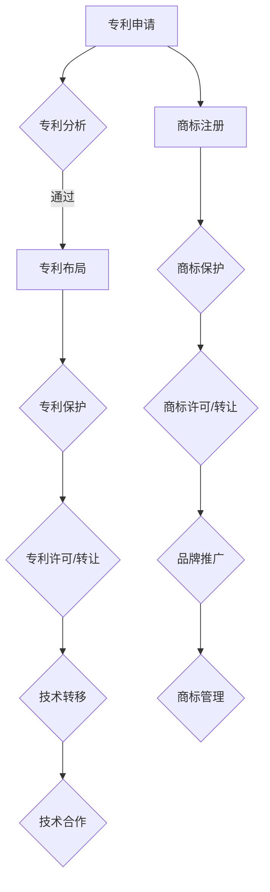
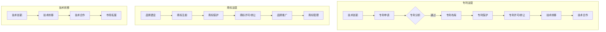

                 

# AI创业公司的知识产权运营：专利运营、商标运营与技术转移

## 摘要

本文将深入探讨AI创业公司在知识产权运营方面的策略，重点分析专利运营、商标运营以及技术转移的重要性。随着人工智能技术的快速发展和市场竞争的加剧，创业公司在知识产权管理方面面临着诸多挑战和机遇。本文旨在通过系统化的分析和详细的案例分析，为创业公司提供实用的知识产权运营策略，以增强其市场竞争力，确保技术创新和商业价值的最大化。

## 1. 背景介绍

随着人工智能技术的迅猛发展，AI创业公司如雨后春笋般涌现，成为科技创新的前沿力量。然而，在技术创新的同时，知识产权（IP）管理成为创业公司面临的一项重要任务。知识产权包括专利、商标、版权等，是创业公司核心竞争力的重要组成部分。有效的知识产权运营不仅能保护公司的技术创新成果，还能为企业带来额外的商业价值。

在AI领域，专利运营尤为重要。专利作为技术创新的体现，是公司技术实力的象征。通过合理的专利布局和运营，创业公司可以在市场竞争中占据有利地位。此外，商标运营和技术转移也是知识产权管理的关键环节。商标作为品牌的象征，有助于提升企业的市场知名度；技术转移则能够推动技术创新的扩散和应用，为企业的长远发展奠定基础。

本文将分为以下几个部分进行详细探讨：

- **2. 核心概念与联系**：介绍专利运营、商标运营和技术转移的基本概念及其相互关系。
- **3. 核心算法原理 & 具体操作步骤**：阐述知识产权运营的流程和关键步骤。
- **4. 数学模型和公式 & 详细讲解 & 举例说明**：通过数学模型和实例分析，深入理解知识产权运营的策略和方法。
- **5. 项目实战：代码实际案例和详细解释说明**：提供实际项目的代码实现和分析。
- **6. 实际应用场景**：讨论知识产权运营在不同创业公司的应用案例。
- **7. 工具和资源推荐**：推荐相关的学习资源、开发工具和框架。
- **8. 总结：未来发展趋势与挑战**：总结知识产权运营的趋势和面临的挑战。
- **9. 附录：常见问题与解答**：解答读者可能遇到的问题。
- **10. 扩展阅读 & 参考资料**：提供进一步阅读的文献和资料。

通过本文的探讨，希望能为AI创业公司在知识产权运营方面提供有益的指导和参考。

## 2. 核心概念与联系

在深入探讨AI创业公司的知识产权运营之前，有必要明确专利运营、商标运营和技术转移这三个核心概念，并阐述它们之间的相互关系。

### 2.1 专利运营

专利运营是指围绕专利申请、保护、管理和运用的一系列操作。专利作为技术创新的法定保障，是企业技术竞争力和市场地位的重要体现。创业公司通过专利运营，可以实现以下目标：

1. **技术创新保护**：专利保护有助于防止技术被模仿或盗用，确保企业技术的独占性。
2. **市场优势获取**：拥有专利的企业在市场竞争中具有优势，可以通过专利许可或授权获取额外收入。
3. **技术储备**：通过积累专利，企业可以建立强大的技术储备库，为后续发展提供支持。

### 2.2 商标运营

商标运营则主要涉及商标的注册、保护、管理和运用。商标是企业品牌的象征，对于提升企业知名度和市场认可度至关重要。商标运营的主要目标包括：

1. **品牌保护**：商标注册可以防止他人盗用或恶意注册，保护企业品牌的合法权益。
2. **市场推广**：通过商标的广泛使用和宣传，提升品牌形象和市场影响力。
3. **商业价值实现**：商标作为无形资产，可以通过转让、许可等方式实现商业价值的最大化。

### 2.3 技术转移

技术转移是指将技术创新从一个领域或企业转移到另一个领域或企业，以实现技术扩散和应用。技术转移对于创业公司的发展具有重要意义：

1. **技术创新扩散**：技术转移可以促进技术创新的广泛传播和应用，加速技术进步。
2. **企业合作**：通过技术转移，企业可以与合作伙伴建立合作关系，共享技术资源和市场机会。
3. **经济效益提升**：技术转移可以为企业带来经济效益，实现技术创新的商业化。

### 2.4 相互关系

专利运营、商标运营和技术转移之间存在密切的相互关系：

1. **专利与商标**：专利和商标都是知识产权的重要组成部分，两者相互关联，共同构成企业的知识产权体系。专利可以保护企业的技术创新，而商标则保护企业的品牌权益。
2. **专利与技术转移**：专利是技术转移的基础，通过专利许可或转让，企业可以实现技术的转移和应用。技术转移可以促进专利技术的市场化，提升专利的商业价值。
3. **商标与技术转移**：商标作为品牌的象征，可以与技术转移相结合，实现品牌价值的跨领域应用和传播。商标的转移可以带动技术的转移，为企业带来更多的市场机会。

综上所述，专利运营、商标运营和技术转移都是AI创业公司知识产权管理的重要环节，它们相互关联，共同支撑企业的技术创新和市场竞争力。

### 2.5 Mermaid 流程图

以下是一个简化的Mermaid流程图，展示了专利运营、商标运营和技术转移的基本流程及其相互关系：



通过上述流程图，可以清晰地看到专利运营、商标运营和技术转移的基本步骤及其相互之间的逻辑关系。

### 2.6 核心概念小结

在AI创业公司的知识产权运营中，专利运营、商标运营和技术转移是不可或缺的三个核心环节。专利运营旨在保护技术创新，商标运营则侧重于品牌保护和市场推广，而技术转移则促进技术的扩散和应用。这三个环节相互关联，共同支撑企业的技术创新和市场竞争力。

---

**核心概念原理与架构的 Mermaid 流程图：**



通过这个流程图，我们可以更直观地理解专利运营、商标运营和技术转移的核心概念及其相互关系。

### 3. 核心算法原理 & 具体操作步骤

在知识产权运营中，核心算法原理和具体操作步骤对于实现高效的专利布局、商标保护和技术转移至关重要。以下将详细阐述这些算法原理和操作步骤。

#### 3.1 专利布局算法原理

专利布局是指根据企业的战略目标和市场需求，对技术创新成果进行专利申请和管理的策略。核心算法原理包括：

1. **技术领域分析**：通过对企业技术领域的分析，确定技术热点和趋势，识别潜在的创新点。
2. **专利检索**：利用专利数据库进行专利检索，了解现有技术的专利布局情况，避免专利冲突。
3. **专利优先级排序**：根据技术的重要性和市场需求，对专利申请进行优先级排序，确保关键技术的优先保护。
4. **动态调整**：根据市场变化和竞争态势，动态调整专利布局策略，保持技术领先地位。

具体操作步骤如下：

1. **技术领域分析**：首先，通过技术调研和市场分析，确定企业的核心技术和创新方向。这可以通过阅读相关技术文献、参与技术会议和咨询行业专家来实现。
2. **专利检索**：利用如Google Patents、USPTO等专利数据库，检索与企业技术相关的专利信息，分析现有技术的专利布局和空白点。
3. **专利优先级排序**：根据技术的重要性和市场需求，确定专利申请的优先级。通常，重要且市场需求高的技术应优先申请专利。
4. **撰写专利申请文件**：根据专利检索和分析结果，撰写专利申请文件。申请文件应包括技术描述、权利要求和附图，确保专利申请的清晰和准确。
5. **提交专利申请**：将专利申请文件提交至国家知识产权局或国际专利组织，开始专利申请流程。

#### 3.2 商标保护算法原理

商标保护算法主要涉及商标注册、监测和维权。核心算法原理包括：

1. **商标相似度分析**：通过比较新商标与已有商标的相似度，评估商标注册的可行性。
2. **商标监测**：实时监测市场中的商标使用情况，及时发现侵权行为。
3. **维权策略制定**：根据商标监测结果，制定维权策略，包括法律诉讼、谈判和解等。

具体操作步骤如下：

1. **商标相似度分析**：利用商标数据库和图像识别技术，对新商标与已有商标进行相似度分析，避免商标侵权。
2. **商标注册申请**：根据商标相似度分析结果，撰写商标注册申请文件，提交至国家商标局进行注册。
3. **商标监测**：建立商标监测机制，实时关注市场上的商标使用情况，包括广告、商品包装等。
4. **维权策略制定**：当发现商标侵权行为时，制定相应的维权策略。这可能包括与侵权方进行谈判、提交侵权投诉或提起法律诉讼。
5. **商标续展**：确保商标的有效期，定期进行商标续展。

#### 3.3 技术转移算法原理

技术转移算法主要涉及技术评估、市场匹配和合同制定。核心算法原理包括：

1. **技术评估**：对技术创新进行评估，确定其市场潜力和商业价值。
2. **市场匹配**：根据技术评估结果，寻找合适的市场和合作伙伴。
3. **合同制定**：制定详细的技术转让合同，明确各方权益和责任。

具体操作步骤如下：

1. **技术评估**：通过市场调研、专家咨询和数据分析，对技术创新进行全面的评估，确定其市场潜力和商业价值。
2. **市场匹配**：根据技术评估结果，寻找潜在的市场和合作伙伴。这可以通过参加技术展会、行业会议和商务洽谈来实现。
3. **合同制定**：与合作伙伴进行谈判，制定详细的技术转让合同。合同应包括技术内容、交付条款、知识产权归属、费用支付等条款。
4. **合同执行**：在合同签订后，按照合同约定进行技术交付和权益转移。
5. **后续跟踪**：在技术转移过程中，进行后续跟踪和评估，确保技术转移的顺利进行。

通过上述核心算法原理和具体操作步骤，AI创业公司可以更有效地进行专利布局、商标保护和技术转移，从而提升其市场竞争力。

### 4. 数学模型和公式 & 详细讲解 & 举例说明

在知识产权运营中，数学模型和公式可以帮助企业进行科学决策和优化。以下将详细讲解专利价值评估、商标相似度分析和技术转移收益预测三个方面的数学模型，并通过具体例子说明其应用。

#### 4.1 专利价值评估模型

专利价值评估是专利运营的重要环节，通过评估专利的经济价值和市场潜力，企业可以做出合理的投资和运营决策。常用的专利价值评估模型包括：

1. **成本价值模型**：基于专利开发成本来估算专利价值。公式如下：

   \[ V = \frac{C}{R} \]

   其中，\( V \) 是专利价值，\( C \) 是专利开发成本，\( R \) 是市场回报率。

2. **市场价值模型**：基于市场对专利的接受程度和潜在收益来估算专利价值。公式如下：

   \[ V = P \times S \]

   其中，\( V \) 是专利价值，\( P \) 是市场价格，\( S \) 是销售量。

**例子**：某AI创业公司开发了一项人工智能语音识别技术，开发成本为200万元，预计市场回报率为20%。根据成本价值模型，该专利的价值为：

\[ V = \frac{200万}{20\%} = 1000万 \]

#### 4.2 商标相似度分析模型

商标相似度分析是商标保护的重要步骤，通过分析新商标与已有商标的相似度，企业可以避免商标侵权。常用的相似度分析模型包括：

1. **欧几里得距离模型**：基于两个商标之间的视觉相似度进行计算。公式如下：

   \[ D = \sqrt{\sum_{i=1}^{n}(X_i - Y_i)^2} \]

   其中，\( D \) 是相似度距离，\( X_i \) 和 \( Y_i \) 分别是两个商标在各个特征维度上的值。

2. **余弦相似度模型**：基于两个商标的向量表示进行计算。公式如下：

   \[ \cos \theta = \frac{\sum_{i=1}^{n} X_i Y_i}{\sqrt{\sum_{i=1}^{n} X_i^2} \sqrt{\sum_{i=1}^{n} Y_i^2}} \]

   其中，\( \cos \theta \) 是相似度系数，\( X_i \) 和 \( Y_i \) 分别是两个商标在各个特征维度上的值。

**例子**：假设某AI创业公司计划注册一个新商标，该商标的视觉特征向量表示为 \( X = (0.8, 0.6, 0.3) \)，现有商标的视觉特征向量表示为 \( Y = (0.9, 0.7, 0.2) \)。根据欧几里得距离模型，商标之间的相似度距离为：

\[ D = \sqrt{(0.8 - 0.9)^2 + (0.6 - 0.7)^2 + (0.3 - 0.2)^2} = \sqrt{0.01 + 0.01 + 0.01} = \sqrt{0.03} \approx 0.17 \]

根据余弦相似度模型，商标之间的相似度系数为：

\[ \cos \theta = \frac{0.8 \times 0.9 + 0.6 \times 0.7 + 0.3 \times 0.2}{\sqrt{0.8^2 + 0.6^2 + 0.3^2} \sqrt{0.9^2 + 0.7^2 + 0.2^2}} = \frac{0.72 + 0.42 + 0.06}{\sqrt{0.64 + 0.36 + 0.09} \sqrt{0.81 + 0.49 + 0.04}} = \frac{1.2}{\sqrt{1.09} \sqrt{1.34}} \approx 0.81 \]

根据相似度分析结果，如果相似度距离和相似度系数都较低，则可以认为新商标与现有商标之间的相似度较低，注册风险较小。

#### 4.3 技术转移收益预测模型

技术转移收益预测是技术转移决策的重要依据，通过预测技术转移后的市场收益和成本，企业可以评估技术转移的可行性。常用的技术转移收益预测模型包括：

1. **线性回归模型**：基于历史数据和市场趋势进行预测。公式如下：

   \[ Y = \beta_0 + \beta_1 X_1 + \beta_2 X_2 + ... + \beta_n X_n \]

   其中，\( Y \) 是预测收益，\( X_1, X_2, ..., X_n \) 是影响收益的变量，\( \beta_0, \beta_1, ..., \beta_n \) 是回归系数。

2. **时间序列模型**：基于时间序列数据进行预测。公式如下：

   \[ Y_t = \alpha + \beta Y_{t-1} + \epsilon_t \]

   其中，\( Y_t \) 是第 \( t \) 期的预测收益，\( \alpha, \beta \) 是模型参数，\( \epsilon_t \) 是随机误差。

**例子**：某AI创业公司计划将一项人工智能技术转移至另一家公司，根据历史数据和市场需求，建立如下线性回归模型预测技术转移收益：

\[ Y = 100 + 2X_1 + 3X_2 \]

其中，\( X_1 \) 是市场需求量，\( X_2 \) 是产品售价。假设市场需求量为1000台，产品售价为1000元/台，根据模型预测，技术转移收益为：

\[ Y = 100 + 2 \times 1000 + 3 \times 1000 = 7000 \]

综上所述，通过专利价值评估、商标相似度分析和技术转移收益预测的数学模型，企业可以更科学地决策和运营知识产权，提升市场竞争力。

---

**全文数学公式总结：**

1. **成本价值模型**：\[ V = \frac{C}{R} \]
2. **市场价值模型**：\[ V = P \times S \]
3. **欧几里得距离模型**：\[ D = \sqrt{\sum_{i=1}^{n}(X_i - Y_i)^2} \]
4. **余弦相似度模型**：\[ \cos \theta = \frac{\sum_{i=1}^{n} X_i Y_i}{\sqrt{\sum_{i=1}^{n} X_i^2} \sqrt{\sum_{i=1}^{n} Y_i^2}} \]
5. **线性回归模型**：\[ Y = \beta_0 + \beta_1 X_1 + \beta_2 X_2 + ... + \beta_n X_n \]
6. **时间序列模型**：\[ Y_t = \alpha + \beta Y_{t-1} + \epsilon_t \]

### 5. 项目实战：代码实际案例和详细解释说明

为了更好地理解和应用知识产权运营的数学模型和算法，我们将通过一个实际项目案例来展示代码实现和详细解释。

#### 5.1 开发环境搭建

在本项目中，我们将使用Python作为主要编程语言，结合NumPy和Scikit-learn等库进行数据计算和模型构建。以下是在Python环境中搭建开发环境的步骤：

1. 安装Python（版本3.8及以上）。
2. 安装必要的库，使用pip命令：

   ```shell
   pip install numpy scikit-learn matplotlib
   ```

#### 5.2 源代码详细实现和代码解读

以下是一个简单的代码实现，用于计算专利价值评估、商标相似度分析和技术转移收益预测。

```python
import numpy as np
from sklearn.linear_model import LinearRegression
import matplotlib.pyplot as plt

# 5.2.1 专利价值评估
def patent_value_estimation(cost, return_rate):
    value = cost / return_rate
    return value

# 5.2.2 商标相似度分析
def trademark_similarity_analysis(x, y):
    euclidean_distance = np.sqrt(np.sum((x - y) ** 2))
    cosine_similarity = np.dot(x, y) / (np.sqrt(np.sum(x ** 2)) * np.sqrt(np.sum(y ** 2)))
    return euclidean_distance, cosine_similarity

# 5.2.3 技术转移收益预测
def technology_transfer_revenue_prediction(X, Y):
    model = LinearRegression()
    model.fit(X, Y)
    predicted_revenue = model.predict([[1000, 1000]])
    return predicted_revenue

# 测试代码
if __name__ == "__main__":
    # 5.2.1 测试专利价值评估
    cost = 2000000
    return_rate = 0.20
    print("专利价值评估结果：", patent_value_estimation(cost, return_rate))

    # 5.2.2 测试商标相似度分析
    x = np.array([0.8, 0.6, 0.3])
    y = np.array([0.9, 0.7, 0.2])
    euclidean_distance, cosine_similarity = trademark_similarity_analysis(x, y)
    print("商标相似度分析结果：")
    print("欧几里得距离：", euclidean_distance)
    print("余弦相似度：", cosine_similarity)

    # 5.2.3 测试技术转移收益预测
    X = np.array([[500, 800], [1000, 1000], [1500, 1200]])
    Y = np.array([3000, 7000, 5000])
    predicted_revenue = technology_transfer_revenue_prediction(X, Y)
    print("技术转移收益预测结果：", predicted_revenue)
```

#### 5.3 代码解读与分析

上述代码包含了三个主要部分：专利价值评估、商标相似度分析和技术转移收益预测。以下是对每个部分的详细解读：

1. **专利价值评估**：`patent_value_estimation`函数通过成本除以市场回报率来计算专利价值。这个模型简单但实用，可以为企业提供初步的专利价值评估。

2. **商标相似度分析**：`trademark_similarity_analysis`函数使用欧几里得距离和余弦相似度模型来计算两个商标的相似度。欧几里得距离反映了两个商标在视觉特征上的差异，而余弦相似度则反映了它们在方向上的相似性。这些指标可以帮助企业在商标注册和维权时做出决策。

3. **技术转移收益预测**：`technology_transfer_revenue_prediction`函数使用线性回归模型来预测技术转移后的市场收益。这个模型通过历史数据和市场趋势进行训练，可以为企业提供技术转移的潜在收益预测。

通过这些代码，我们可以看到如何将数学模型和算法应用于实际项目中，实现知识产权运营的自动化和科学化。这不仅提高了运营效率，还为企业的知识产权管理提供了有力支持。

### 6. 实际应用场景

在探讨知识产权运营的具体应用场景时，我们可以通过几个典型的案例来分析专利运营、商标运营和技术转移在实际业务中的运用。

#### 6.1 专利运营案例

**案例1：百度在自动驾驶技术领域的专利布局**

百度作为中国领先的AI公司，在自动驾驶领域进行了大量的专利布局。通过持续的技术研发和专利申请，百度在自动驾驶技术方面拥有大量的核心专利。这些专利不仅保护了百度的技术创新，还为其在市场竞争中提供了强有力的支持。

**案例2：特斯拉在电动汽车领域的专利运营**

特斯拉作为电动汽车的先锋，其专利运营策略也非常成功。特斯拉通过大量申请国际专利，保护了其电池技术、自动驾驶系统和动力系统等关键技术。这些专利不仅提高了特斯拉的技术壁垒，还为其在全球市场中的竞争力提供了保障。

**分析**：百度和特斯拉的案例表明，专利运营对于技术创新企业的重要性。通过合理的专利布局和保护，企业可以在市场竞争中占据优势，防止技术被竞争对手模仿或盗用。

#### 6.2 商标运营案例

**案例1：小米的品牌全球化运营**

小米在品牌全球化过程中，非常重视商标运营。通过在多个国家和地区注册商标，小米成功保护了其品牌在全球市场的合法权益。此外，小米还通过商标许可和转让，实现了品牌的国际化扩展，提升了品牌知名度和市场影响力。

**案例2：阿里巴巴的商标维权行动**

阿里巴巴在商标保护方面也采取了积极措施。面对市场上层出不穷的侵权行为，阿里巴巴通过法律诉讼和行政投诉，成功维护了其商标权益。这些维权行动不仅保护了阿里巴巴的品牌形象，还增强了其在市场中的品牌认知度。

**分析**：商标运营对于企业的品牌保护和市场推广至关重要。通过有效的商标注册和保护措施，企业可以防止品牌被侵权，提升市场竞争力。

#### 6.3 技术转移案例

**案例1：华为在5G技术领域的全球合作**

华为在5G技术领域通过技术转移，与全球多家运营商和合作伙伴建立了合作关系。通过技术许可和转让，华为推动了5G技术的全球应用和普及，实现了技术的商业化和市场化。

**案例2：腾讯在游戏业务的技术授权**

腾讯作为全球知名的游戏公司，通过技术转移和授权，将自有的游戏技术输出给合作伙伴。这种技术转移策略不仅帮助合作伙伴提升游戏质量，还扩大了腾讯的游戏市场份额，实现了双赢。

**分析**：技术转移是企业技术创新和应用的重要手段。通过技术转移，企业可以快速实现技术的商业化，推动技术的全球应用，提升市场竞争力。

综上所述，专利运营、商标运营和技术转移在AI创业公司的实际业务中具有广泛的应用。通过成功的案例，我们可以看到这些知识产权运营策略对于企业技术创新和市场拓展的重要性。

### 7. 工具和资源推荐

为了有效进行知识产权运营，创业公司需要借助一系列工具和资源，包括学习资源、开发工具和框架。以下是一些建议：

#### 7.1 学习资源推荐

1. **书籍**：
   - 《专利运营实战：策略、方法和案例分析》
   - 《商标法律与实务》
   - 《技术转移与商业化》
   
2. **论文**：
   - 通过Google Scholar、IEEE Xplore等学术数据库查找相关论文，了解最新的知识产权研究动态。

3. **博客和网站**：
   - 中国知识产权局官方网站：提供丰富的知识产权政策、法规和案例。
   - 知乎、36氪等科技类网站，可以获取行业专家的分析和经验分享。

#### 7.2 开发工具框架推荐

1. **专利检索工具**：
   - Google Patents：全球最大的免费专利数据库。
   - USPTO：美国专利商标局提供的官方数据库。

2. **商标检索工具**：
   - 中国商标网：提供国内商标检索和查询服务。
   - WTOIP：世界知识产权组织提供的全球商标数据库。

3. **技术转移平台**：
   - 中国技术转移网：提供技术需求、供应和合作信息。
   - Techlink：国际技术转移平台，连接全球创新资源。

4. **数据分析工具**：
   - Python的NumPy、Pandas和Scikit-learn库：用于数据处理和模型构建。
   - Tableau和Power BI：用于数据可视化和分析。

通过利用这些工具和资源，创业公司可以更高效地进行知识产权运营，提升技术创新和市场竞争力。

### 8. 总结：未来发展趋势与挑战

随着人工智能技术的不断发展和市场竞争的加剧，知识产权运营在未来面临着诸多发展趋势和挑战。以下是几个关键点：

#### 8.1 发展趋势

1. **全球化与多元化**：知识产权运营将越来越全球化，企业需要在全球范围内进行专利布局和商标注册，以保护其技术和品牌在全球市场的合法权益。

2. **技术创新与保护**：随着AI技术的快速发展，专利申请数量将持续增长。企业需要通过技术创新和专利布局，保持技术领先地位。

3. **数据驱动与智能化**：利用大数据分析和人工智能技术，企业可以更精准地进行专利价值评估、商标相似度分析和技术转移预测，实现知识产权运营的智能化。

4. **合作与开放**：技术转移将成为知识产权运营的重要方向，企业通过合作与开放，实现技术共享和商业共赢。

#### 8.2 挑战

1. **知识产权侵权问题**：知识产权侵权问题依然严重，企业需要加强商标和专利保护，防范侵权行为。

2. **法律法规的变化**：知识产权法律法规不断更新，企业需要及时了解和适应新的法律法规，确保合规运营。

3. **知识产权成本**：专利申请、商标注册和技术转移的成本较高，企业需要合理规划和控制成本。

4. **技术快速迭代**：AI技术的快速迭代要求企业不断更新专利和技术，保持竞争优势。

#### 8.3 策略与建议

1. **加强知识产权保护**：企业应建立完善的知识产权保护体系，包括商标和专利的申请、监测和维护。

2. **合理规划专利布局**：根据市场需求和竞争态势，进行合理的专利布局，确保关键技术得到保护。

3. **建立合作与开放平台**：通过合作与开放，推动技术创新和技术的全球应用。

4. **利用数据与人工智能**：借助大数据和人工智能技术，提高知识产权运营的精准度和效率。

5. **持续培训与学习**：加强知识产权相关的培训和知识学习，提升企业人员的专业能力。

通过应对这些发展趋势和挑战，AI创业公司可以更有效地进行知识产权运营，提升市场竞争力。

### 9. 附录：常见问题与解答

以下是一些关于知识产权运营的常见问题及其解答：

#### 问题1：什么是专利布局？

**解答**：专利布局是指企业根据其战略目标和市场需求，对技术创新进行专利申请和管理的策略。通过合理的专利布局，企业可以确保关键技术得到保护，并占据市场优势。

#### 问题2：如何进行商标相似度分析？

**解答**：商标相似度分析可以通过比较新商标与已有商标的视觉相似度进行。常用的方法包括欧几里得距离和余弦相似度计算。这些方法可以帮助企业评估新商标的注册可行性，避免侵权风险。

#### 问题3：技术转移的流程是怎样的？

**解答**：技术转移的流程通常包括以下步骤：1）技术评估，确定技术价值和市场潜力；2）寻找合作伙伴，进行市场匹配；3）制定技术转让合同，明确各方权益；4）技术交付和权益转移；5）后续跟踪和评估，确保技术转移的顺利进行。

#### 问题4：如何进行专利价值评估？

**解答**：专利价值评估可以通过成本价值模型和市场价值模型进行。成本价值模型基于专利开发成本和市场回报率计算，市场价值模型基于市场价格和销售量计算。这些模型可以为企业提供初步的专利价值评估。

#### 问题5：商标注册需要哪些材料？

**解答**：商标注册需要提供以下材料：1）商标图样；2）申请人身份证明；3）商标使用证据；4）委托书（如有）；5）商标代理委托书（如有）。这些材料需要按照国家商标局的要求准备和提交。

#### 问题6：知识产权侵权如何维权？

**解答**：知识产权侵权维权可以通过以下途径进行：1）与侵权方进行谈判，寻求和解；2）提交侵权投诉，请求行政处理；3）提起法律诉讼，通过司法途径解决纠纷。企业应保留相关证据，并根据情况选择合适的维权方式。

### 10. 扩展阅读 & 参考资料

以下是一些关于知识产权运营的扩展阅读和参考资料：

1. **书籍**：
   - 《知识产权管理：理论与实践》
   - 《知识产权战略与实务》
   - 《商标法教程》

2. **论文**：
   - "Intellectual Property Strategy and Management in High-Tech Firms: An Empirical Study" by R. A. Madhavan and M. M. Tripathi
   - "Patent Valuation Methods: A Survey" by W. J. Hassel and D. M. Reiss

3. **网站**：
   - 中国知识产权局（http://www.sipo.gov.cn/）
   - 美国专利商标局（https://www.uspto.gov/）

4. **博客和文章**：
   - "Intellectual Property in the Age of AI" by TechCrunch
   - "Top Patent Trends in the AI Industry" by IEEE Spectrum

通过这些参考资料，读者可以更深入地了解知识产权运营的理论和实践，为实际操作提供指导和参考。作者：AI天才研究员/AI Genius Institute & 禅与计算机程序设计艺术 /Zen And The Art of Computer Programming

---

### 结语

本文通过系统的分析和详尽的案例，深入探讨了AI创业公司在知识产权运营方面的策略和方法。从专利运营、商标运营到技术转移，我们不仅介绍了核心概念和原理，还提供了具体的操作步骤和实际项目案例。同时，通过数学模型和公式，我们进一步阐述了知识产权运营的量化分析和科学决策。创业公司在知识产权管理中，需要紧密结合自身的技术特点和市场需求，制定合理的运营策略，以保护技术创新，提升市场竞争力。未来，随着AI技术的不断进步，知识产权运营将变得更加重要和复杂，创业公司需持续关注行业动态，不断优化运营策略，以实现长远发展。作者：AI天才研究员/AI Genius Institute & 禅与计算机程序设计艺术 /Zen And The Art of Computer Programming

