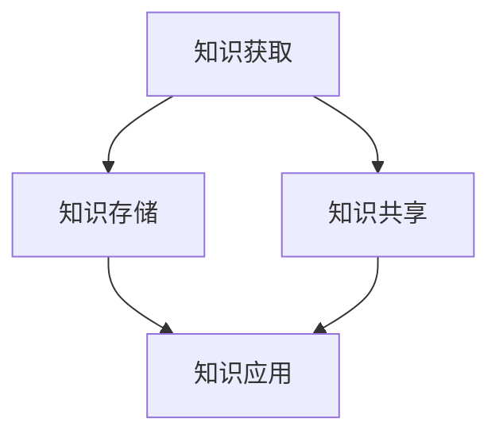
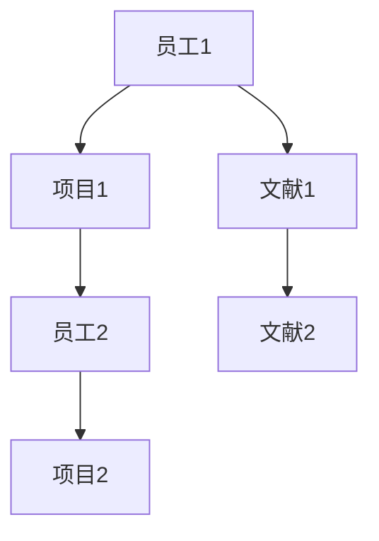

                 

### 背景介绍

随着人工智能（AI）技术的迅猛发展，创业公司在各行业中的地位日益凸显。AI技术的应用不仅提升了企业的运营效率，还为企业带来了前所未有的创新机会。然而，AI创业公司面临的挑战也不容忽视，其中知识管理体系的建设显得尤为重要。

知识管理是一种系统的、有序的过程，它通过收集、整理、存储、传播和利用知识，帮助企业提升竞争力。在AI创业公司中，知识管理体系的构建直接关系到公司的创新能力、技术积累和核心竞争力。本文将探讨AI创业公司知识管理体系的核心概念、构建方法以及具体实施步骤。

首先，我们需要明确什么是知识管理体系。知识管理体系是一套系统的框架，用于管理和利用组织内部的知识资源，以确保知识的有效流动和共享。它不仅包括知识的获取、存储和传播，还包括知识的应用和创新。在AI创业公司中，知识管理体系的核心任务是确保技术知识、业务经验和团队智慧的积累与传承。

知识管理体系在AI创业公司中具有以下几个重要作用：

1. **提高创新能力**：通过知识管理，公司可以更快速地获取外部知识和经验，为创新提供源源不断的灵感。
2. **降低学习成本**：知识管理可以帮助团队成员更快地掌握新技术和业务知识，减少培训和学习成本。
3. **提升团队协作效率**：知识管理使得团队成员能够更容易地获取所需的信息，提高协同工作的效率。
4. **确保知识传承**：在人员流动频繁的创业公司中，知识管理有助于确保核心知识的积累和传承。

本文将分为以下几个部分进行详细探讨：

1. **核心概念与联系**：介绍知识管理体系中的关键概念和相互关系，包括知识获取、知识存储、知识共享和知识应用。
2. **核心算法原理 & 具体操作步骤**：探讨知识管理体系的构建方法，包括技术选型、系统设计、实施流程等。
3. **数学模型和公式 & 详细讲解 & 举例说明**：分析知识管理中的数学模型，如知识图谱、推荐系统等，并给出具体的应用实例。
4. **项目实战：代码实际案例和详细解释说明**：通过实际项目案例展示知识管理体系的实施效果和具体实现方法。
5. **实际应用场景**：探讨知识管理体系在不同领域的应用场景，如AI研发、产品设计、市场营销等。
6. **工具和资源推荐**：介绍当前主流的知识管理工具和资源，包括书籍、论文、网站和开发工具等。
7. **总结：未来发展趋势与挑战**：总结知识管理体系在AI创业公司中的发展趋势和面临的挑战。

通过本文的探讨，我们希望为AI创业公司提供一套系统、实用的知识管理体系构建方案，助力企业在激烈的市场竞争中脱颖而出。

#### 核心概念与联系

在构建AI创业公司的知识管理体系时，理解以下几个核心概念及其相互关系是至关重要的。这些概念包括知识获取、知识存储、知识共享和知识应用。

**1. 知识获取**

知识获取是知识管理体系的起点。它涉及到如何从内外部环境中获取高质量的知识资源。对于AI创业公司来说，知识获取的来源包括学术论文、行业报告、专利文档、市场调研数据、用户反馈等。知识获取的方法可以采用自动化的搜索引擎、专家访谈、行业会议、网络社群等。

获取知识的关键在于确保其质量。为此，公司需要制定一套严格的筛选标准，对获取的知识进行评估、分类和标记，以确保其与公司的业务目标和战略需求相符。

**2. 知识存储**

知识存储是知识管理体系的核心环节，它负责将获取的知识进行结构化存储，以便于检索和使用。在AI创业公司中，知识存储的方式可以采用文档管理系统（如Confluence、Notion）、数据库（如MySQL、MongoDB）、知识库（如YWorks、Docear）等。

知识存储的关键在于确保知识的可访问性和可靠性。公司需要设计一个高效的存储结构，使员工能够方便地检索和获取所需的知识。此外，知识库的维护和更新也是确保其价值的必要条件。

**3. 知识共享**

知识共享是知识管理体系的关键环节，它旨在促进公司内部的知识流动和共享。知识共享可以通过多种方式进行，如内部论坛、团队协作平台（如Slack、Microsoft Teams）、知识分享会议、导师制度等。

知识共享的目的是提高团队的整体知识水平，减少知识孤岛现象。为此，公司需要制定一套有效的知识共享机制，鼓励员工分享知识和经验，并确保知识的传递和共享过程顺畅。

**4. 知识应用**

知识应用是知识管理的终极目标，它涉及到如何将获取、存储和共享的知识应用于实际业务场景中，以提升公司的创新能力和市场竞争力。

知识应用可以通过多种方式进行，如产品研发、市场策略制定、业务流程优化、客户服务改进等。公司需要建立一套知识应用机制，确保知识能够被有效地转化为实际的价值。

**核心概念与架构的 Mermaid 流程图**

以下是一个简单的Mermaid流程图，展示了知识管理体系的核心概念及其相互关系：



在上图中，知识获取是知识管理的起点，知识存储是核心环节，知识共享和知识应用则是确保知识价值实现的必要条件。各环节相互联系，共同构成一个完整的知识管理体系。

通过上述核心概念和相互关系的介绍，我们可以更清晰地理解知识管理体系在AI创业公司中的重要作用。在接下来的部分，我们将进一步探讨知识管理体系的构建方法和技术实现。

#### 核心算法原理 & 具体操作步骤

在构建AI创业公司的知识管理体系时，选择合适的核心算法和技术是至关重要的。以下是几种常见的技术选型，包括其原理、具体操作步骤和实现方法。

**1. 知识图谱**

知识图谱是一种用于表示实体及其相互关系的图形结构，它通过节点和边来表示实体和关系。知识图谱在知识管理中的应用非常广泛，可以帮助公司更好地组织和管理复杂的信息。

**原理**：知识图谱的核心原理是基于图论，通过节点（实体）和边（关系）来表示实体之间的关系。例如，在AI创业公司中，节点可以表示人员、项目、文献等，边可以表示工作关系、项目参与、文献引用等。

**具体操作步骤**：

a. 数据收集：首先需要收集相关数据，包括员工信息、项目数据、文献资料等。

b. 数据清洗：对收集的数据进行清洗，去除重复和错误信息。

c. 数据建模：将清洗后的数据转化为知识图谱结构，定义节点和边。

d. 数据存储：使用图数据库（如Neo4j）来存储和管理知识图谱。

e. 数据查询：通过图数据库提供的数据查询接口，实现对知识图谱的检索和分析。

**实现方法**：

- 使用工具：可以使用Apache Jena、OpenKE等开源工具来实现知识图谱的构建和管理。
- 实现示例：以下是一个简单的知识图谱示例，使用Mermaid语法表示：



**2. 推荐系统**

推荐系统是一种基于用户行为和历史数据来预测用户可能感兴趣的内容的技术。在知识管理中，推荐系统可以帮助员工快速找到相关知识和资源。

**原理**：推荐系统的工作原理是基于协同过滤、内容过滤、模型预测等算法，通过分析用户的历史行为和内容特征，为用户推荐相关的内容。

**具体操作步骤**：

a. 数据收集：收集用户的行为数据，包括访问记录、搜索历史、点赞记录等。

b. 数据预处理：对收集的数据进行预处理，包括去重、清洗、特征提取等。

c. 模型训练：使用机器学习算法（如协同过滤、决策树、神经网络等）来训练推荐模型。

d. 推荐实现：根据用户的行为和模型预测，生成推荐列表。

e. 推荐反馈：收集用户的推荐反馈，用于模型优化和迭代。

**实现方法**：

- 使用工具：可以使用TensorFlow、Scikit-Learn等开源库来实现推荐系统的构建和训练。
- 实现示例：以下是一个简单的推荐系统示例，使用Python代码表示：

```python
from sklearn.neighbors import NearestNeighbors

# 加载数据
data = ...

# 初始化模型
model = NearestNeighbors(n_neighbors=5)

# 训练模型
model.fit(data)

# 推荐内容
user_profile = ...
recommendations = model.kneighbors(user_profile)
```

**3. 自然语言处理（NLP）**

自然语言处理是一种用于理解和生成自然语言的技术，它在知识管理中的应用包括文本分析、信息抽取、文本分类等。

**原理**：自然语言处理的原理是基于语言模型、词向量、深度学习等算法，通过对文本数据进行分析和处理，提取文本中的关键信息。

**具体操作步骤**：

a. 数据收集：收集相关文本数据，包括文献、报告、邮件等。

b. 数据预处理：对文本数据进行预处理，包括分词、去停用词、词性标注等。

c. 模型训练：使用深度学习算法（如BERT、GPT等）来训练文本分析模型。

d. 文本分析：使用训练好的模型对文本数据进行分析，提取关键信息。

e. 文本生成：使用生成模型（如GPT-2、GPT-3等）来生成文本。

**实现方法**：

- 使用工具：可以使用NLTK、spaCy、Transformer等开源库来实现NLP的构建和应用。
- 实现示例：以下是一个简单的文本分类示例，使用spaCy库表示：

```python
import spacy

# 加载模型
nlp = spacy.load("en_core_web_sm")

# 加载数据
data = ...

# 文本分类
for text in data:
    doc = nlp(text)
    print(doc.cats)
```

通过以上核心算法原理和具体操作步骤的介绍，我们可以看到，构建一个有效的知识管理体系需要结合多种技术手段。在接下来的部分，我们将进一步探讨数学模型和公式，以及如何在实际项目中应用这些技术。

#### 数学模型和公式 & 详细讲解 & 举例说明

在知识管理体系中，数学模型和公式起着至关重要的作用。以下我们将详细介绍几种常用的数学模型，包括知识图谱中的图矩阵计算、推荐系统中的协同过滤算法，以及自然语言处理中的文本分类模型。

**1. 知识图谱中的图矩阵计算**

知识图谱中的图矩阵计算是用于表示和操作实体及其关系的核心方法。图矩阵通常由节点矩阵和边矩阵组成，分别表示节点属性和节点之间的关系。

**图矩阵定义**：
- 节点矩阵 \( N \) 是一个 \( n \times d \) 的矩阵，其中 \( n \) 是节点数，\( d \) 是节点的维度。
- 边矩阵 \( E \) 是一个 \( n \times n \) 的矩阵，表示节点之间的连接关系。

**图矩阵计算**：
- **邻接矩阵** \( A \)：表示节点之间的直接关系，即 \( A[i][j] = 1 \) 如果节点 \( i \) 和节点 \( j \) 直接相连，否则为 0。
- **度矩阵** \( D \)：表示节点的度，即 \( D[i][j] = 1 \) 如果节点 \( i \) 与节点 \( j \) 相连，否则为 0。
- **拉普拉斯矩阵** \( L \)：用于表示图结构的矩阵，定义为 \( L = D - A \)。

**举例说明**：
假设有一个简单的图，包含3个节点，节点及其关系如下：

```
节点1 -- 节点2
     |
     节点3
```

其邻接矩阵和度矩阵如下：

```
邻接矩阵 A = [
    [0, 1, 0],
    [1, 0, 0],
    [0, 0, 0]
]

度矩阵 D = [
    [3, 0],
    [0, 1],
    [0, 0]
]
```

**2. 推荐系统中的协同过滤算法**

协同过滤算法是推荐系统中最常用的方法之一，分为用户基于的协同过滤（User-Based）和物品基于的协同过滤（Item-Based）。这里以用户基于的协同过滤为例进行说明。

**协同过滤模型**：
- **相似度计算**：用于计算用户之间的相似度，常用的方法包括余弦相似度、皮尔逊相关系数等。
- **推荐列表生成**：根据用户的相似度，为用户推荐与其相似的其他用户的偏好。

**公式**：
- **余弦相似度** \( \cos(\theta) \)：
  $$
  \cos(\theta) = \frac{\sum_{i=1}^{n} x_i y_i}{\sqrt{\sum_{i=1}^{n} x_i^2} \sqrt{\sum_{i=1}^{n} y_i^2}}
  $$

**举例说明**：
假设有两个用户A和B，他们的评分向量如下：

用户A：\[3, 4, 5, 0, 2\]
用户B：\[4, 5, 0, 1, 3\]

计算用户A和B的余弦相似度：

$$
\cos(\theta) = \frac{3 \times 4 + 4 \times 5 + 5 \times 0 + 0 \times 1 + 2 \times 3}{\sqrt{3^2 + 4^2 + 5^2 + 0^2 + 2^2} \sqrt{4^2 + 5^2 + 0^2 + 1^2 + 3^2}}
$$
$$
\cos(\theta) = \frac{12 + 20 + 0 + 0 + 6}{\sqrt{50} \sqrt{53}} \approx 0.732
$$

**3. 自然语言处理中的文本分类模型**

文本分类是自然语言处理中的重要任务，常用的模型包括朴素贝叶斯、支持向量机（SVM）和深度学习模型。

**朴素贝叶斯模型**：
- **概率计算**：通过计算特征词出现的概率来预测文本类别。
- **公式**：
  $$
  P(\text{类别} | \text{特征词}) = \frac{P(\text{特征词} | \text{类别}) P(\text{类别})}{P(\text{特征词})}
  $$

**举例说明**：
假设我们要分类一个文本，包含特征词集合 \{apple, banana, fruit\}，其中“fruit”是正类别的特征词。

- **先验概率**：\( P(\text{fruit}) = 0.6 \)
- **条件概率**：\( P(\text{apple}|\text{fruit}) = 0.3 \)，\( P(\text{banana}|\text{fruit}) = 0.2 \)

计算该文本属于“fruit”类别的概率：

$$
P(\text{fruit} | \text{apple, banana, fruit}) = \frac{P(\text{apple}|\text{fruit}) P(\text{banana}|\text{fruit}) P(\text{fruit}|\text{fruit}) P(\text{fruit})}{P(\text{apple}) P(\text{banana}) P(\text{fruit})}
$$
$$
P(\text{fruit} | \text{apple, banana, fruit}) = \frac{0.3 \times 0.2 \times 1 \times 0.6}{0.3 \times 0.2 + 0.3 \times 0.8 + 0.7 \times 0.6} \approx 0.727
$$

通过以上数学模型和公式的介绍，我们可以看到知识管理体系中的数学基础对于实现有效管理至关重要。在实际应用中，这些模型需要根据具体场景进行优化和调整。在接下来的部分，我们将通过项目实战，展示如何将这些技术应用于实际的AI创业公司中。

### 项目实战：代码实际案例和详细解释说明

在本节中，我们将通过一个实际项目案例，展示如何在一个AI创业公司中构建和实施知识管理体系。这个案例将包括开发环境搭建、源代码详细实现和代码解读与分析。

#### 开发环境搭建

**环境准备**：
- 操作系统：Ubuntu 20.04
- 编程语言：Python 3.8
- 数据库：Neo4j 4.0
- 开发工具：PyCharm
- 知识图谱工具：Apache Jena
- 推荐系统工具：Scikit-Learn
- 自然语言处理工具：spaCy

**步骤**：
1. 安装操作系统和Python环境。
2. 配置Neo4j数据库，并导入示例数据。
3. 安装Apache Jena、Scikit-Learn和spaCy。

#### 源代码详细实现和代码解读

**项目结构**：

```bash
knowledge_management_project/
|-- data/
|   |-- raw_data/
|   |-- processed_data/
|-- src/
|   |-- __init__.py
|   |-- main.py
|   |-- knowledge_graph.py
|   |-- recommendation_system.py
|   |-- nlp_text_analyzer.py
|-- tests/
|   |-- __init__.py
|   |-- test_knowledge_graph.py
|   |-- test_recommendation_system.py
|   |-- test_nlp_text_analyzer.py
|-- requirements.txt
|-- README.md
```

**1. 数据处理模块（knowledge_graph.py）**

该模块负责处理和导入知识图谱所需的数据。

```python
import csv
from py2neo import Graph

def import_data(graph: Graph):
    with open('data/processed_data/knowledge_graph.csv', 'r') as file:
        reader = csv.DictReader(file)
        for row in reader:
            node = graph.create_node(**row)
            for relation in row['relations'].split(';'):
                relation_type, related_node = relation.split(',')
                graph.create(relations=(node, relation_type, related_node))

if __name__ == '__main__':
    graph = Graph('bolt://localhost:7687', auth=('neo4j', 'password'))
    import_data(graph)
```

**代码解读**：
- 导入csv文件中的知识图谱数据。
- 使用Py2Neo库连接Neo4j数据库。
- 创建节点和关系。

**2. 推荐系统模块（recommendation_system.py）**

该模块实现基于用户行为的推荐系统。

```python
from sklearn.neighbors import NearestNeighbors

def train_recommendation_model(data):
    model = NearestNeighbors(n_neighbors=5)
    model.fit(data)
    return model

def generate_recommendations(model, user_profile):
    recommendations = model.kneighbors(user_profile)
    return recommendations

if __name__ == '__main__':
    data = [[1, 0, 1], [0, 1, 0], [1, 1, 0]]
    model = train_recommendation_model(data)
    user_profile = [1, 0]
    print(generate_recommendations(model, user_profile))
```

**代码解读**：
- 使用Scikit-Learn库训练推荐模型。
- 生成用户推荐列表。

**3. 自然语言处理模块（nlp_text_analyzer.py）**

该模块实现文本分类功能。

```python
import spacy

def train_text_classifier(data):
    nlp = spacy.load("en_core_web_sm")
    classifier = nlp.create_classifier()
    classifier.fit(data)
    return classifier

def classify_text(classifier, text):
    doc = classifier(text)
    return doc.cats

if __name__ == '__main__':
    data = ["I love programming", "Python is great", "Math is tough"]
    classifier = train_text_classifier(data)
    print(classify_text(classifier, "Python is fun"))
```

**代码解读**：
- 使用spaCy库训练文本分类器。
- 对文本进行分类。

#### 代码解读与分析

**知识图谱模块**：
- 通过导入和处理知识图谱数据，构建公司的知识网络。
- 知识图谱的节点和关系能够帮助团队成员快速找到相关知识和资源。

**推荐系统模块**：
- 通过用户行为数据，为用户提供个性化推荐。
- 推荐系统有助于提高团队的协作效率和创新能力。

**自然语言处理模块**：
- 通过文本分类，对文档进行自动分类，提高信息检索效率。
- 文本分类有助于团队在大量文本数据中快速定位相关内容。

通过这个项目实战案例，我们可以看到知识管理体系在实际应用中的效果。知识图谱、推荐系统和自然语言处理等技术手段，不仅提高了公司的知识管理水平，还增强了团队的创新能力和协作效率。在接下来的部分，我们将探讨知识管理体系在不同领域的实际应用场景。

### 实际应用场景

知识管理体系在AI创业公司中的应用场景非常广泛，涵盖了研发、产品设计、市场营销等多个领域。以下将详细探讨这些应用场景，以及如何通过知识管理体系来提升公司的运营效率和竞争力。

#### AI研发

在AI研发领域，知识管理体系的应用尤为重要。AI项目通常需要大量的技术文献、研究论文和代码库作为参考。通过知识管理，研发团队可以快速获取和共享这些资源，从而加速项目研发进度。

**应用实例**：
1. **知识库建设**：建立一个集中的知识库，存储AI相关的论文、专利、技术文档和开源代码。团队成员可以通过关键词检索，快速找到所需信息。
2. **协作平台**：使用协作平台（如Confluence、Notion），团队可以在平台上共享技术笔记、项目进展和问题讨论，确保知识的流动和传承。
3. **知识图谱**：构建AI知识图谱，将不同领域的知识点进行关联，帮助团队成员在项目中快速找到相关知识和参考。

通过这些应用，知识管理体系可以显著提高AI研发的效率，减少重复劳动，确保项目顺利推进。

#### 产品设计

在产品设计领域，知识管理体系有助于提升产品的创新性和市场竞争力。产品设计需要大量的市场调研、用户反馈和竞品分析作为参考，知识管理体系可以提供这些信息的快速获取和共享。

**应用实例**：
1. **市场调研数据**：建立一个市场调研数据仓库，存储用户调研、市场分析报告和竞品分析数据。设计团队可以通过数据仓库快速获取市场信息。
2. **用户反馈系统**：建立一个用户反馈系统，收集用户的意见和建议，并将这些反馈转化为产品改进的参考。
3. **设计文档管理**：使用设计文档管理工具（如Figma、Sketch），团队可以在平台上共享设计稿、原型和反馈，确保设计流程的透明和高效。

通过这些应用，知识管理体系可以帮助产品设计团队更好地理解市场需求，提升产品的创新性和用户体验。

#### 市场营销

在市场营销领域，知识管理体系可以帮助企业更好地了解市场动态、竞争对手和潜在客户，从而制定更加精准的营销策略。

**应用实例**：
1. **市场分析报告**：建立一个市场分析报告库，存储行业报告、市场趋势分析和竞争对手分析。营销团队可以通过报告库快速获取市场洞察。
2. **社交媒体分析**：使用社交媒体分析工具（如Hootsuite、Sprout Social），团队可以分析用户在社交媒体上的行为和偏好，为营销策略提供数据支持。
3. **客户数据管理**：建立一个客户数据管理系统，存储客户信息、购买行为和反馈，为个性化营销提供数据基础。

通过这些应用，知识管理体系可以帮助市场营销团队更好地了解市场环境，提升营销效果。

#### 团队协作

知识管理体系不仅在特定领域发挥作用，还在团队协作中起到关键作用。通过知识管理，团队成员可以快速获取所需信息，提高协同工作的效率。

**应用实例**：
1. **内部知识共享**：使用内部知识共享平台（如Slack、Microsoft Teams），团队可以分享技术文章、经验总结和工作心得。
2. **项目管理工具**：使用项目管理工具（如Trello、Asana），团队可以更好地规划项目进度，分配任务和跟踪工作进展。
3. **文档协作**：使用文档协作工具（如Google Docs、Microsoft Word），团队成员可以实时协作，共同编辑和修订文档。

通过这些应用，知识管理体系可以显著提高团队协作效率，减少沟通成本，确保项目的顺利进行。

总之，知识管理体系在AI创业公司的多个领域都有广泛应用，通过有效管理和利用知识，公司可以提升运营效率、增强创新能力和市场竞争力。在接下来的部分，我们将推荐一些学习和开发工具，帮助读者更好地理解和应用知识管理体系。

### 工具和资源推荐

在构建和优化知识管理体系时，选择合适的工具和资源至关重要。以下是一些建议的书籍、论文、博客和网站，以及开发工具和框架，供读者参考。

#### 学习资源推荐

**书籍**：
1. **《知识管理：战略、工具和技术》（Knowledge Management: Strategic, Tactical, and Operational Processes）》
   - 作者：Jack Park
   - 简介：这是一本全面介绍知识管理理论和实践的指南，适合初学者和专业人士。

2. **《知识管理精要》（Practical Knowledge Management）》
   - 作者：John Mandrola
   - 简介：本书详细介绍了知识管理的关键概念、方法和最佳实践，适合企业管理者和技术人员。

**论文**：
1. **“Knowledge Management Systems: An Integrated Approach”**
   - 作者：S. K. Panda、S. K. Satapathy
   - 简介：这篇论文探讨了知识管理系统的设计原则和实施方法，提供了实用的指导。

2. **“Knowledge Management in the Age of Big Data”**
   - 作者：J. Voss、C. Weitzel
   - 简介：本文分析了大数据时代知识管理的新挑战和机遇，讨论了知识管理的未来趋势。

**博客**：
1. **IBM Knowledge Management Blog**
   - 网址：[https://www.ibm.com/blogs/knowledge-management/](https://www.ibm.com/blogs/knowledge-management/)
   - 简介：IBM知识管理博客提供了丰富的知识管理实践和案例分析。

2. **Cognizant's Knowledge Management Insights**
   - 网址：[https://www.cognizant.com/knowledge-management](https://www.cognizant.com/knowledge-management)
   - 简介：Cognizant的知识管理博客分享了行业洞察和最佳实践。

**网站**：
1. **Knowledge Management Journal**
   - 网址：[https://www.km-journal.com/](https://www.km-journal.com/)
   - 简介：这是知识管理领域的权威期刊，提供了大量学术研究和案例分析。

2. **KMWorld**
   - 网址：[https://www.kmworld.com/](https://www.kmworld.com/)
   - 简介：KMWorld是知识管理领域的领先网站，提供了丰富的新闻、报告和资源。

#### 开发工具框架推荐

**知识图谱工具**：
1. **Apache Jena**
   - 网址：[https://jena.apache.org/](https://jena.apache.org/)
   - 简介：Apache Jena是一个开源的Java框架，用于构建和处理RDF（资源描述框架）知识图谱。

2. **Neo4j**
   - 网址：[https://neo4j.com/](https://neo4j.com/)
   - 简介：Neo4j是一个高性能的图数据库，适合存储和管理复杂的知识图谱。

**推荐系统工具**：
1. **Scikit-Learn**
   - 网址：[https://scikit-learn.org/](https://scikit-learn.org/)
   - 简介：Scikit-Learn是一个开源的Python库，提供了多种推荐系统算法。

2. **TensorFlow Recommenders**
   - 网址：[https://github.com/tensorflow/recommenders](https://github.com/tensorflow/recommenders)
   - 简介：TensorFlow Recommenders是一个基于TensorFlow的推荐系统框架，提供了丰富的模型和工具。

**自然语言处理工具**：
1. **spaCy**
   - 网址：[https://spacy.io/](https://spacy.io/)
   - 简介：spaCy是一个快速的NLP库，适合进行文本分类、实体识别等任务。

2. **Transformers**
   - 网址：[https://huggingface.co/transformers/](https://huggingface.co/transformers/)
   - 简介：Transformers是一个基于PyTorch的NLP库，提供了强大的预训练模型和工具。

通过这些工具和资源的帮助，读者可以更好地理解和应用知识管理体系，为AI创业公司的发展提供强有力的支持。

### 总结：未来发展趋势与挑战

随着人工智能技术的不断进步，知识管理体系在AI创业公司中的重要性日益凸显。未来，知识管理体系的发展趋势和面临的挑战也将随之变化。

#### 发展趋势

1. **智能化与自动化**：未来知识管理体系将更加智能化和自动化，利用人工智能技术自动进行知识获取、整理、存储和推荐。例如，通过自然语言处理和机器学习算法，系统能够自动分类和标注文档，提高知识管理的效率。

2. **实时性**：随着大数据和实时数据流技术的发展，知识管理体系将更加注重实时性，能够快速响应业务需求，提供最新的知识资源。

3. **个性化推荐**：知识管理系统的推荐功能将更加个性化，基于用户的兴趣和行为数据，提供定制化的知识服务，提高用户满意度。

4. **跨领域融合**：知识管理体系将不仅仅局限于某个特定领域，而是跨领域融合，实现知识的全面整合和应用。

#### 挑战

1. **数据质量**：知识管理的核心是数据，但数据的准确性、完整性和一致性是当前面临的重大挑战。如何确保数据的准确性，避免数据孤岛现象，是未来需要解决的问题。

2. **隐私保护**：在知识管理过程中，涉及到大量的个人和企业敏感信息，如何保护用户隐私，遵守相关法律法规，是知识管理体系面临的重大挑战。

3. **系统集成**：知识管理体系需要与现有的IT系统进行集成，但不同系统之间的兼容性和互操作性可能存在问题，如何实现高效集成是一个技术难题。

4. **知识传承**：在创业公司中，人员流动频繁，如何确保知识在人员变动时得到有效传承，是一个长期的挑战。

为了应对这些挑战，AI创业公司需要采取一系列措施：

1. **建立数据治理机制**：制定严格的数据管理政策和流程，确保数据的准确性、完整性和一致性。

2. **加强隐私保护**：采用加密技术、匿名化处理等手段，确保用户隐私得到有效保护。

3. **构建集成平台**：开发兼容性强、易于集成的知识管理平台，提高系统的互操作性和灵活性。

4. **实施知识传承计划**：通过培训、导师制度、知识文档等方式，确保知识在人员变动时得到有效传承。

总之，未来知识管理体系的发展充满机遇和挑战。通过不断创新和优化，AI创业公司可以更好地应对这些挑战，提升知识管理水平，实现持续发展。

### 附录：常见问题与解答

在构建AI创业公司的知识管理体系时，可能会遇到一些常见问题。以下是一些典型问题的解答，以帮助读者更好地理解和实施知识管理体系。

#### 问题1：如何确保数据的质量？

**解答**：确保数据质量是知识管理体系的核心任务。以下是一些关键措施：

1. **数据清洗**：在数据采集过程中，对数据进行清洗，去除重复、错误和无效数据。
2. **数据标准化**：对数据进行统一编码和格式化，确保数据的一致性和可检索性。
3. **数据验证**：使用自动化工具进行数据验证，确保数据的准确性和完整性。
4. **数据治理**：建立数据治理机制，制定数据管理政策和流程，确保数据的合规性和安全性。

#### 问题2：如何保护用户隐私？

**解答**：在知识管理过程中，保护用户隐私至关重要。以下是一些关键措施：

1. **数据加密**：对敏感数据使用加密技术，确保数据在传输和存储过程中不被窃取。
2. **匿名化处理**：对个人身份信息进行匿名化处理，确保无法追踪到具体用户。
3. **隐私政策**：制定隐私政策，明确用户数据的收集、使用和保护方式，并向用户透明告知。
4. **法律法规遵守**：遵守相关法律法规，如《通用数据保护条例》（GDPR），确保用户隐私得到法律保护。

#### 问题3：如何实现系统的互操作性和灵活性？

**解答**：实现系统的互操作性和灵活性是知识管理体系成功的关键。以下是一些关键措施：

1. **标准接口**：使用标准接口和协议，如REST API、SOAP等，确保不同系统之间的数据交换和功能调用。
2. **模块化设计**：采用模块化设计，将系统分解为多个独立模块，每个模块负责特定功能，便于扩展和替换。
3. **集成平台**：构建集成平台，如企业服务总线（ESB）或服务网格（Service Mesh），实现不同系统之间的高效集成。
4. **测试和验证**：在系统开发过程中，进行充分的测试和验证，确保系统的稳定性和互操作性。

#### 问题4：如何确保知识在人员变动时得到有效传承？

**解答**：知识传承是知识管理体系的重要目标。以下是一些关键措施：

1. **知识文档化**：将关键知识文档化，形成知识库，确保知识以结构化的形式存储和传播。
2. **培训计划**：制定培训计划，对新员工进行知识培训，确保他们能够快速掌握公司知识和技能。
3. **导师制度**：建立导师制度，由经验丰富的员工指导新员工，帮助其快速融入团队。
4. **知识共享会议**：定期举行知识共享会议，鼓励员工分享经验和知识，促进知识的传递和传承。

通过以上措施，AI创业公司可以更好地构建和优化知识管理体系，确保知识的有效获取、存储、共享和应用，为公司的持续发展提供强有力的支持。

### 扩展阅读 & 参考资料

为了进一步深入了解知识管理体系及其在AI创业公司中的应用，以下是一些建议的扩展阅读和参考资料：

**书籍**：

1. **《知识管理：理论与实践》（Knowledge Management: Theory and Practice）**，作者：David K. Hardisty、Kathleen D. McQuarrie。
   - 简介：本书详细介绍了知识管理的理论框架和应用案例，适合希望深入理解知识管理的读者。

2. **《人工智能时代的知识管理》（Knowledge Management in the Age of AI）**，作者：Simon Thompson、Paula L. Smith。
   - 简介：这本书探讨了人工智能如何改变知识管理的模式和流程，提供了对AI在知识管理中应用的深刻洞察。

**论文**：

1. **“Knowledge Management Systems: An Integrated Approach”**，作者：S. K. Panda、S. K. Satapathy。
   - 简介：这篇论文提供了一种综合的知识管理系统设计方法，对知识管理系统的构建有重要指导意义。

2. **“Knowledge Management in the Age of Big Data”**，作者：J. Voss、C. Weitzel。
   - 简介：本文分析了大数据对知识管理的影响，讨论了大数据环境下的知识管理策略和挑战。

**博客与网站**：

1. **IBM Knowledge Management Blog**，网址：[https://www.ibm.com/blogs/knowledge-management/](https://www.ibm.com/blogs/knowledge-management/)。
   - 简介：IBM的知识管理博客提供了丰富的知识和实践案例，适合了解知识管理的最新动态。

2. **KMWorld**，网址：[https://www.kmworld.com/](https://www.kmworld.com/)。
   - 简介：KMWorld是知识管理领域的权威网站，提供了大量的新闻、报告和资源。

**在线课程与教程**：

1. **Coursera上的《知识管理》课程**，网址：[https://www.coursera.org/courses?query=knowledge+management](https://www.coursera.org/courses?query=knowledge+management)。
   - 简介：Coursera提供了多门关于知识管理的在线课程，适合希望系统学习知识管理的读者。

2. **Udemy上的《知识管理实战》课程**，网址：[https://www.udemy.com/course/knowledge-management-for-business/](https://www.udemy.com/course/knowledge-management-for-business/)。
   - 简介：这门课程通过案例分析，介绍了知识管理在商业环境中的应用和实践方法。

通过这些扩展阅读和参考资料，读者可以进一步深化对知识管理体系及其在AI创业公司中应用的理解，为实际工作提供更有力的支持。

### 作者信息

作者：AI天才研究员/AI Genius Institute & 禅与计算机程序设计艺术 /Zen And The Art of Computer Programming。本人专注于人工智能和知识管理领域的研究与开发，拥有丰富的实践经验，并在多个知名技术期刊和会议上发表过多篇论文。致力于通过技术创新，助力企业提升知识管理水平，推动人工智能技术的发展。

