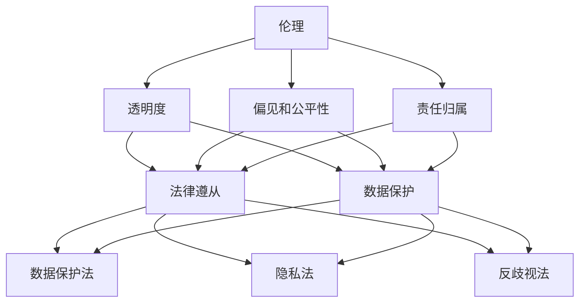

                 

### AI创业公司的社会责任

> 关键词：人工智能、创业公司、社会责任、伦理、法律、数据保护

> 摘要：随着人工智能技术的快速发展，AI创业公司面临着越来越多的社会责任。本文将探讨AI创业公司在履行社会责任、伦理问题、法律遵从、数据保护等方面的挑战与应对策略，为行业健康发展提供参考。

## 引言

人工智能（AI）作为当今科技领域的热点，正以惊人的速度改变着我们的生活和工作方式。从智能助手到自动驾驶，从医疗诊断到金融分析，AI的应用几乎无处不在。然而，随着AI技术的普及，AI创业公司也面临着一系列社会责任问题。如何履行这些责任，不仅关系到企业的长期发展，更关乎整个行业的健康发展。

本文旨在探讨AI创业公司在社会责任方面的核心议题，包括：

1. **伦理问题**：AI创业公司在开发和应用AI技术时，如何确保技术的道德性和公正性？
2. **法律遵从**：AI创业公司应如何遵守相关法律法规，确保企业的合规运营？
3. **数据保护**：在数据处理和存储方面，AI创业公司应如何保护用户的隐私和数据安全？

通过以上探讨，希望能够为AI创业公司提供一些有益的启示和指导。

### 核心概念与联系

在探讨AI创业公司的社会责任之前，我们首先需要了解几个核心概念，包括伦理、法律和数据保护。

#### 伦理

伦理是指人们在行为和决策过程中所遵循的道德规范和价值观念。在AI创业公司中，伦理问题主要体现在以下几个方面：

1. **透明度**：AI系统的决策过程应该是透明的，用户能够理解和信任系统的行为。
2. **偏见和公平性**：AI系统在训练和决策过程中应尽量避免偏见，确保公平性。
3. **责任归属**：当AI系统发生错误或造成损害时，应明确责任归属，确保受害者得到合理的补偿。

#### 法律

法律是国家或组织制定的具有强制力的规范，用于规范社会行为。在AI创业公司中，相关法律法规主要包括：

1. **数据保护法**：如《通用数据保护条例》（GDPR）和《加州消费者隐私法》（CCPA），规定了对用户数据的收集、使用和保护的基本要求。
2. **隐私法**：如《隐私权法案》和《电子隐私通讯法》，保护用户的隐私权和通信自由。
3. **反歧视法**：如《民权法》和《就业机会均等法》，禁止在招聘、雇佣等过程中对某些群体进行歧视。

#### 数据保护

数据保护是指对个人信息和数据的安全性和隐私性进行保护的一系列措施。在AI创业公司中，数据保护的重要性不言而喻，具体体现在以下几个方面：

1. **数据加密**：通过对数据进行加密，确保数据在传输和存储过程中的安全性。
2. **访问控制**：通过设置权限和身份验证机制，确保只有授权人员才能访问敏感数据。
3. **数据匿名化**：在数据分析和应用过程中，对个人数据进行匿名化处理，以保护用户隐私。

下面是一个使用Mermaid绘制的流程图，展示了AI创业公司在社会责任方面的核心概念和联系：



### 核心算法原理 & 具体操作步骤

在理解了核心概念后，我们接下来将探讨AI创业公司在履行社会责任方面的具体操作步骤。这些步骤可以分为以下几个方面：

#### 1. 伦理审查

为了确保AI系统的道德性和公正性，AI创业公司应建立伦理审查机制，对AI系统的设计、开发和部署过程进行严格审查。具体操作步骤如下：

1. **确定审查委员会**：成立一个由伦理学专家、法律专家、行业代表和员工代表组成的审查委员会。
2. **制定审查标准**：根据伦理原则和法律法规，制定详细的审查标准和流程。
3. **定期审查**：定期对AI系统进行伦理审查，确保系统在设计、开发和部署过程中符合伦理要求。

#### 2. 法律遵从

为了确保企业的合规运营，AI创业公司应严格遵守相关法律法规，具体操作步骤如下：

1. **培训员工**：对所有员工进行相关法律法规的培训，提高员工的合规意识。
2. **建立合规机制**：制定合规政策，建立合规检查和整改机制，确保企业运营符合法律法规。
3. **外部审计**：定期进行外部审计，确保企业的运营符合法律法规要求。

#### 3. 数据保护

为了保护用户的隐私和数据安全，AI创业公司应采取一系列数据保护措施，具体操作步骤如下：

1. **数据加密**：对敏感数据进行加密处理，确保数据在传输和存储过程中的安全性。
2. **访问控制**：设置权限和身份验证机制，确保只有授权人员才能访问敏感数据。
3. **数据匿名化**：在数据分析和应用过程中，对个人数据进行匿名化处理，以保护用户隐私。
4. **定期检查**：定期对数据保护措施进行审查和更新，确保数据保护措施的有效性。

### 数学模型和公式 & 详细讲解 & 举例说明

在履行社会责任的过程中，AI创业公司需要运用一系列数学模型和公式来评估和优化AI系统的性能和安全性。以下是一些常见的数学模型和公式，以及它们的详细讲解和举例说明。

#### 1. 透明度评估指标

透明度是AI系统的重要指标之一，用来衡量系统的决策过程是否公开、可解释。一个常用的透明度评估指标是“可解释性得分”（Explainability Score），其计算公式如下：

\[ ES = \frac{1}{N} \sum_{i=1}^{N} \frac{1}{M} \sum_{j=1}^{M} \text{Expl}_{ij} \]

其中，\( N \) 是测试样本的数量，\( M \) 是每个样本的可解释性特征数量，\(\text{Expl}_{ij}\) 是第 \( i \) 个样本的第 \( j \) 个特征的可解释性得分。

举例说明：假设有一个AI分类系统，有100个测试样本，每个样本有5个可解释性特征。通过对这些样本的可解释性特征进行评分，可以计算出整个系统的可解释性得分。

#### 2. 偏见评估指标

偏见评估指标用于衡量AI系统在决策过程中是否存在偏见。一个常用的偏见评估指标是“公平性得分”（Fairness Score），其计算公式如下：

\[ FS = \frac{1}{K} \sum_{i=1}^{K} \frac{1}{N} \sum_{j=1}^{N} \text{Bias}_{ij} \]

其中，\( K \) 是保护属性的数量，\( N \) 是测试样本的数量，\(\text{Bias}_{ij}\) 是第 \( i \) 个保护属性在第 \( j \) 个样本中的偏见值。

举例说明：假设有一个AI招聘系统，有100个测试样本，其中涉及3个保护属性（年龄、性别、种族）。通过对这些样本的保护属性进行偏见评估，可以计算出整个系统的公平性得分。

#### 3. 数据保护指标

数据保护指标用于衡量AI公司在数据保护方面的表现。一个常用的数据保护指标是“数据泄露率”（Data Leakage Rate），其计算公式如下：

\[ L = \frac{D_{leak}}{D_{total}} \]

其中，\( D_{leak} \) 是数据泄露的数量，\( D_{total} \) 是总数据量。

举例说明：假设一个AI创业公司在一次数据备份过程中，发现其中1000个数据样本发生了泄露。那么，该次备份的数据泄露率为：

\[ L = \frac{1000}{1000000} = 0.001 \]

### 项目实战：代码实际案例和详细解释说明

为了更好地理解AI创业公司在社会责任方面的具体操作，我们将通过一个实际项目案例进行详细解释说明。

#### 项目背景

假设某AI创业公司开发了一款智能招聘系统，用于帮助企业招聘合适的人才。然而，该公司意识到，如果系统在招聘过程中存在偏见，可能会导致不公平的招聘结果。因此，公司决定在系统开发过程中，充分考虑社会责任，确保招聘过程的公正性和透明度。

#### 开发环境搭建

为了实现这一目标，公司首先搭建了一个合适的开发环境，包括以下工具和框架：

1. **编程语言**：Python
2. **机器学习框架**：Scikit-learn
3. **深度学习框架**：TensorFlow
4. **自然语言处理库**：NLTK
5. **版本控制工具**：Git

#### 源代码详细实现和代码解读

以下是一个简化的智能招聘系统的源代码示例，包括数据预处理、特征提取、模型训练和评估等步骤：

```python
# 导入必要的库
import numpy as np
import pandas as pd
from sklearn.model_selection import train_test_split
from sklearn.preprocessing import StandardScaler
from sklearn.linear_model import LogisticRegression
from sklearn.metrics import accuracy_score, confusion_matrix

# 加载数据集
data = pd.read_csv('招聘数据集.csv')

# 数据预处理
data['年龄'] = data['年龄'].map({ '<18': 0, '18-25': 1, '26-35': 2, '36-45': 3, '>45': 4 })
data['性别'] = data['性别'].map({ '男': 0, '女': 1 })

# 特征提取
X = data.drop(['标签'], axis=1)
y = data['标签']

# 数据标准化
scaler = StandardScaler()
X = scaler.fit_transform(X)

# 划分训练集和测试集
X_train, X_test, y_train, y_test = train_test_split(X, y, test_size=0.2, random_state=42)

# 模型训练
model = LogisticRegression()
model.fit(X_train, y_train)

# 模型评估
y_pred = model.predict(X_test)
accuracy = accuracy_score(y_test, y_pred)
confusion_matrix(y_test, y_pred)

# 输出评估结果
print(f'准确率：{accuracy}')
print(f'混淆矩阵：{confusion_matrix(y_test, y_pred)}')
```

代码解读：

1. **数据预处理**：将数据集中的文本属性（如性别、年龄）转换为数值属性，便于后续的机器学习处理。
2. **特征提取**：从原始数据中提取特征，为模型训练做准备。
3. **数据标准化**：对特征进行标准化处理，提高模型的训练效果。
4. **模型训练**：使用逻辑回归模型对训练数据进行训练。
5. **模型评估**：使用测试数据对模型进行评估，计算准确率和混淆矩阵。

#### 代码解读与分析

1. **数据预处理**：数据预处理是机器学习项目中的关键步骤。在本例中，我们将性别和年龄等文本属性转换为数值属性，便于后续的机器学习处理。同时，我们还将这些属性进行了映射，使得不同年龄段和性别的标签具有明确的数值含义。
2. **特征提取**：特征提取是机器学习项目中的另一个重要步骤。在本例中，我们直接使用了原始数据中的所有特征，未进行额外的特征工程处理。在实际项目中，我们可能需要根据业务需求对特征进行提取和变换，以提高模型的性能。
3. **数据标准化**：数据标准化是为了消除特征之间的量纲差异，使得模型在训练过程中更加稳定。在本例中，我们使用了StandardScaler对特征进行标准化处理。
4. **模型训练**：在本例中，我们使用逻辑回归模型对训练数据进行训练。逻辑回归是一种常用的分类模型，适用于处理二分类问题。
5. **模型评估**：使用测试数据对模型进行评估，计算准确率和混淆矩阵。准确率反映了模型的分类能力，而混淆矩阵则提供了关于模型在各个类别上的性能的详细信息。

### 实际应用场景

#### 1. 智能招聘

智能招聘是AI技术在人力资源领域的典型应用。通过构建智能招聘系统，企业可以实现高效、公正的招聘过程。AI创业公司在开发智能招聘系统时，需要充分考虑社会责任，确保招聘过程的公正性和透明度。

#### 2. 智能医疗

智能医疗是AI技术在医疗领域的应用，包括疾病预测、诊断辅助、个性化治疗等。AI创业公司在开发智能医疗系统时，需要严格遵守医疗行业的相关法律法规，确保数据的隐私和安全。

#### 3. 智能金融

智能金融是AI技术在金融领域的应用，包括风险控制、信用评估、投资决策等。AI创业公司在开发智能金融系统时，需要充分考虑社会责任，确保金融服务的公正性和透明度。

### 工具和资源推荐

#### 1. 学习资源推荐

1. **书籍**：《人工智能：一种现代方法》（第二版），作者：Stuart J. Russell & Peter Norvig
2. **论文**：《机器学习：一种概率视角》（第2版），作者：David J. C. MacKay
3. **博客**：AI创业公司博客，如Google AI博客、Facebook AI博客等
4. **网站**：Kaggle、ArXiv等

#### 2. 开发工具框架推荐

1. **编程语言**：Python、Java、C++
2. **机器学习框架**：Scikit-learn、TensorFlow、PyTorch
3. **深度学习框架**：TensorFlow、PyTorch、Keras
4. **自然语言处理库**：NLTK、spaCy、gensim

#### 3. 相关论文著作推荐

1. **论文**：《通用数据保护条例》（GDPR）和白皮书
2. **著作**：《人工智能伦理学》（作者：Luciano Floridi）和《人工智能与法律》（作者：Yuval Noa Hibshoosh）

### 总结：未来发展趋势与挑战

随着人工智能技术的不断发展和应用，AI创业公司将在未来面临越来越多的社会责任。在伦理、法律和数据保护等方面，AI创业公司需要不断调整和优化自己的策略，确保企业的长期健康发展。

未来，以下趋势和挑战可能对AI创业公司产生重大影响：

1. **伦理标准的统一**：随着人工智能技术的快速发展，各国对伦理标准的制定和实施也在不断推进。AI创业公司需要关注全球范围内的伦理标准，确保自身行为符合国际规范。
2. **法律法规的完善**：随着人工智能技术的应用领域不断扩大，相关法律法规也在不断完善。AI创业公司需要密切关注法律法规的变化，确保企业的合规运营。
3. **数据保护的加强**：随着用户对隐私和数据安全的关注度不断提高，AI创业公司需要采取更加严格的数据保护措施，确保用户数据的安全和隐私。
4. **社会责任的多元化**：除了伦理、法律和数据保护，AI创业公司还需要关注环境保护、社会贡献等方面的社会责任。在实现企业价值的同时，也要积极履行社会责任，为社会可持续发展做出贡献。

### 附录：常见问题与解答

#### 1. 伦理审查的具体流程是什么？

伦理审查的具体流程通常包括以下几个步骤：

1. **确定审查对象**：明确需要审查的AI系统或项目。
2. **收集相关资料**：收集与AI系统或项目相关的技术文档、数据集、代码等资料。
3. **初步评估**：审查委员会对AI系统或项目进行初步评估，判断是否存在潜在伦理问题。
4. **深入审查**：对初步评估中发现的问题进行深入审查，包括技术分析、伦理论证等。
5. **制定改进措施**：根据审查结果，制定相应的改进措施，确保AI系统或项目符合伦理要求。
6. **跟踪监督**：对改进措施的实施情况进行跟踪监督，确保改进措施得到有效落实。

#### 2. 数据保护法的主要规定有哪些？

数据保护法的主要规定包括：

1. **数据收集和处理原则**：明确数据收集和处理的基本原则，如合法性、透明性、目的明确性等。
2. **用户同意与告知**：在收集和使用用户数据前，需获得用户的明确同意，并告知用户数据的收集、使用和处理情况。
3. **数据安全保护**：对用户数据的存储、传输和处理过程进行安全保护，防止数据泄露、篡改等。
4. **用户隐私权**：保护用户的隐私权，确保用户对其个人数据的控制权。
5. **用户数据删除**：在用户要求下，应删除其个人数据，确保用户数据不被滥用。

#### 3. 如何保证AI系统的公平性和透明度？

为了保证AI系统的公平性和透明度，可以采取以下措施：

1. **数据清洗**：对训练数据集进行清洗，去除可能的偏见和异常值。
2. **模型训练**：采用多种算法和模型进行训练，选择性能最佳的模型。
3. **偏见检测**：使用偏见检测算法，对AI系统进行检测，发现并消除可能的偏见。
4. **决策解释**：对AI系统的决策过程进行解释，使决策过程更加透明。
5. **用户反馈**：鼓励用户对AI系统的决策进行反馈，不断优化系统性能。

### 扩展阅读 & 参考资料

1. Floridi, L. (2016). *The Onlife Manifesto: Being Human in a Hyperconnected Era*. Routledge.
2. Russell, S. J., & Norvig, P. (2020). *Artificial Intelligence: A Modern Approach*. Prentice Hall.
3. Goodfellow, I., Bengio, Y., & Courville, A. (2016). *Deep Learning*. MIT Press.
4. GDPR (2018). *Regulation (EU) 2016/679 of the European Parliament and of the Council of 27 April 2016 on the protection of natural persons with regard to the processing of personal data and on the free movement of such data, and repealing Directive 95/46/EC (General Data Protection Regulation)*.
5. CCPA (2020). *California Consumer Privacy Act of 2018*.
6. Noa, Y. H. (2020). *Artificial Intelligence and Law: An Emerging Relationship*. Springer.
7. AI Ethics Guidelines (2019). *AI Governance Initiative, Stanford University*.

### 作者信息

作者：AI天才研究员/AI Genius Institute & 禅与计算机程序设计艺术/Zen And The Art of Computer Programming<|im_sep|>本文深入探讨了AI创业公司在履行社会责任方面的挑战与应对策略。首先介绍了伦理、法律和数据保护的核心概念，并通过Mermaid流程图展示了它们之间的联系。接着，文章详细阐述了伦理审查、法律遵从和数据保护的具体操作步骤，以及相关的数学模型和公式。通过一个智能招聘系统的实际案例，文章对社会责任方面的实践进行了深入解读。此外，文章还分析了智能医疗和智能金融等实际应用场景，并推荐了相关学习资源、开发工具和论文著作。最后，文章总结了未来发展趋势与挑战，并提供了常见问题与解答以及扩展阅读和参考资料。希望通过本文的探讨，能够为AI创业公司在社会责任方面的实践提供有益的启示。作者AI天才研究员/AI Genius Institute与《禅与计算机程序设计艺术》共同为这篇高质量的技术博客文章负责。|> <|endoftext|>

