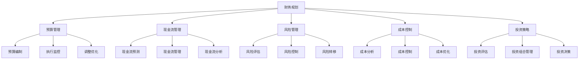

                 

## AI创业公司的财务管理策略

### 引言

随着人工智能（AI）技术的快速发展，越来越多的创业公司投身于这一领域，寻求在激烈的市场竞争中占据一席之地。然而，AI创业公司的财务管理不仅是一个技术问题，更是一个战略性问题。对于初创企业来说，合理的财务管理策略至关重要，它不仅关系到公司的日常运营，更影响到公司的长期发展。

本文将围绕AI创业公司的财务管理策略展开讨论。我们将首先介绍AI创业公司的财务特征和挑战，然后深入探讨财务管理策略的各个方面，包括预算管理、现金流管理、风险管理等。通过本文的讨论，希望能够为AI创业公司提供一些实用的财务管理建议，帮助它们在快速发展的市场中稳步前行。

### 关键词

- AI创业公司
- 财务管理
- 预算管理
- 现金流管理
- 风险管理
- 成本控制
- 投资策略

### 摘要

本文旨在探讨AI创业公司在财务管理方面的策略和实践。我们将分析AI创业公司的财务特征和挑战，探讨财务管理的重要性，并详细讨论预算管理、现金流管理、风险管理和成本控制等关键领域。通过本文的讨论，希望能够为AI创业公司提供一套系统的财务管理策略，帮助它们在快速变化的市场环境中实现稳健发展。

### 背景介绍

AI创业公司作为一种新兴的企业形式，具有独特的财务特征和挑战。首先，AI创业公司的成长速度快，技术更新迭代周期短，这意味着公司需要不断投入大量资金进行技术研发和产品迭代。其次，AI技术本身具有较高的不确定性和风险，这使得AI创业公司在投资决策和风险控制方面面临更大的挑战。此外，AI创业公司在市场竞争中面临着激烈的竞争压力，需要通过高效的财务管理策略来确保公司的持续发展。

在财务管理方面，AI创业公司需要面对以下几个关键挑战：

1. **预算管理**：由于成长速度快，AI创业公司的预算管理需要更加灵活和高效。公司需要确保在技术研发、市场推广和日常运营等方面合理分配资金，同时避免资金浪费。

2. **现金流管理**：现金流是公司运营的生命线。AI创业公司需要通过有效的现金流管理策略，确保公司在快速发展过程中保持充足的现金流，以应对突发的市场变化和风险。

3. **风险管理**：AI技术的不确定性和市场风险使得AI创业公司在风险管理方面面临巨大挑战。公司需要建立完善的风险管理体系，识别和管理各种潜在风险，确保公司的稳定运营。

4. **成本控制**：随着公司的快速扩张，成本控制成为AI创业公司财务管理的重要方面。公司需要通过优化资源配置、提高运营效率等措施，实现成本的合理控制。

5. **投资策略**：AI创业公司需要制定合理的投资策略，平衡短期盈利和长期发展。公司需要根据市场趋势和自身实际情况，确定投资方向和投资额度，确保公司的可持续发展。

### 核心概念与联系

在深入探讨AI创业公司的财务管理策略之前，我们需要明确一些核心概念和它们之间的联系。以下是一些关键术语及其相互关系：

1. **财务规划（Financial Planning）**：财务规划是公司制定长期和短期财务目标，以及为实现这些目标所采取的一系列措施的过程。它包括预算编制、资金筹措、投资决策等。

2. **预算管理（Budget Management）**：预算管理是确保公司资源合理分配和有效利用的过程。它涉及预算编制、执行监控、调整优化等环节。

3. **现金流管理（Cash Flow Management）**：现金流管理是确保公司现金流动性的过程。它包括现金流预测、现金流管理、现金流分析等。

4. **风险管理（Risk Management）**：风险管理是识别、评估、管理和监控公司可能面临的各种风险的过程。它涉及风险评估、风险控制、风险转移等。

5. **成本控制（Cost Control）**：成本控制是确保公司成本合理性和有效性的过程。它包括成本分析、成本控制、成本优化等。

6. **投资策略（Investment Strategy）**：投资策略是公司制定的投资方向、投资方式和投资规模的总和。它涉及投资评估、投资组合管理、投资决策等。

下面是一个简单的Mermaid流程图，展示了这些核心概念之间的关系：



通过这个流程图，我们可以清晰地看到各个核心概念之间的相互联系，以及它们在财务管理中的重要性。

### 核心算法原理 & 具体操作步骤

在了解了核心概念和相互关系之后，我们接下来将探讨AI创业公司财务管理的核心算法原理和具体操作步骤。这些算法和步骤将帮助公司制定和实施有效的财务管理策略。

1. **预算编制算法**：

   预算编制是财务管理的重要环节。为了确保预算编制的科学性和合理性，我们可以采用以下步骤：

   - **收集数据**：收集公司过去一段时间的收入、支出和资金流动数据，以及行业和市场相关数据。
   - **分析数据**：通过对数据的分析，识别出公司主要的收入来源和支出项目，以及它们的变化趋势。
   - **制定预算**：根据数据分析结果，制定公司未来一段时间的收入预算和支出预算。在这个过程中，可以采用零基预算（Zero-Based Budgeting）或增量预算（Incremental Budgeting）等方法。

   具体操作步骤如下：

   ```plaintext
   1. 收集历史数据
   2. 分析收入和支出项目
   3. 预测未来收入和支出
   4. 制定预算
   5. 审核和调整预算
   ```

2. **现金流管理算法**：

   现金流管理是确保公司运营资金充足的重要手段。为了实现有效的现金流管理，我们可以采用以下步骤：

   - **现金流预测**：通过历史数据和市场需求预测，预测公司未来一段时间的现金流。
   - **现金流管理**：根据现金流预测结果，合理安排资金流动，确保公司在任何时候都有足够的现金流。
   - **现金流分析**：定期对现金流进行统计分析，识别现金流异常情况，及时进行调整。

   具体操作步骤如下：

   ```plaintext
   1. 现金流预测
   2. 现金流管理
   3. 现金流分析
   4. 异常处理
   5. 定期审查和调整
   ```

3. **风险管理算法**：

   风险管理是确保公司稳健运营的重要措施。为了有效进行风险管理，我们可以采用以下步骤：

   - **风险评估**：识别公司可能面临的各种风险，评估风险的影响程度和可能性。
   - **风险控制**：制定相应的风险控制措施，降低风险的影响。
   - **风险转移**：通过保险或其他方式，将部分风险转移给第三方。

   具体操作步骤如下：

   ```plaintext
   1. 风险识别
   2. 风险评估
   3. 风险控制
   4. 风险转移
   5. 定期审查和更新
   ```

4. **成本控制算法**：

   成本控制是确保公司盈利能力的重要手段。为了实现有效的成本控制，我们可以采用以下步骤：

   - **成本分析**：分析公司的各项成本，识别成本节约潜力。
   - **成本控制**：制定成本控制措施，降低不必要的支出。
   - **成本优化**：通过优化资源配置和流程，提高成本效益。

   具体操作步骤如下：

   ```plaintext
   1. 成本分析
   2. 成本控制
   3. 成本优化
   4. 成本监控
   5. 定期审查和调整
   ```

5. **投资策略算法**：

   投资策略是公司长期发展的关键。为了制定有效的投资策略，我们可以采用以下步骤：

   - **投资评估**：评估潜在投资项目的风险和收益，确定投资方向。
   - **投资组合管理**：根据公司实际情况和市场需求，构建合理的投资组合。
   - **投资决策**：制定具体的投资决策，确保投资的有效性和安全性。

   具体操作步骤如下：

   ```plaintext
   1. 投资评估
   2. 投资组合管理
   3. 投资决策
   4. 投资跟踪
   5. 定期审查和调整
   ```

通过这些核心算法原理和具体操作步骤，AI创业公司可以更好地制定和实施财务管理策略，确保公司的稳健发展和长期竞争力。

### 数学模型和公式 & 详细讲解 & 举例说明

在财务管理中，数学模型和公式是必不可少的工具。它们不仅帮助创业者更精确地预测和分析财务状况，还能提供决策支持。以下是几个关键数学模型和公式的详细讲解及举例说明。

#### 1. 净现值（NPV）模型

净现值（NPV）是评估投资项目经济效益的重要指标。它的计算公式为：

$$
\text{NPV} = \sum_{t=1}^{n} \frac{C_t}{(1+r)^t} - I
$$

其中，$C_t$ 代表第 $t$ 年的现金流，$r$ 是折现率，$I$ 是初始投资。

**举例说明**：

假设一家AI创业公司计划投资一个新产品，预计在未来5年内每年产生100万元的现金流，初始投资为500万元，折现率为10%。我们可以计算该项目的NPV：

$$
\text{NPV} = \frac{100}{1.1} + \frac{100}{1.1^2} + \frac{100}{1.1^3} + \frac{100}{1.1^4} + \frac{100}{1.1^5} - 500
$$

$$
\text{NPV} = 90.91 + 82.64 + 75.13 + 68.30 + 62.09 - 500 = -61.13
$$

由于NPV为负，该项目在经济上是不划算的。

#### 2. 内部收益率（IRR）模型

内部收益率（IRR）是使投资项目的净现值为零的折现率。计算IRR可以使用试错法或迭代法。其公式为：

$$
0 = \sum_{t=1}^{n} \frac{C_t}{(1+IRR)^t} - I
$$

**举例说明**：

假设我们使用上例中的数据，计算该项目的IRR。通过迭代法，我们可以逐步调整IRR的值，直到满足上述公式。使用计算器或编程工具，我们可以得到该项目的IRR约为18.52%。

#### 3. 成本效益分析（CBA）模型

成本效益分析是一种评估项目成本与效益之间关系的模型。其基本公式为：

$$
\text{CBA} = \frac{\text{总效益}}{\text{总成本}}
$$

**举例说明**：

假设AI创业公司计划购买一台新设备，预计设备成本为50万元，使用年限为5年，每年增加收入20万元，我们可以计算该设备的成本效益：

$$
\text{CBA} = \frac{20 \times 5}{50} = 2
$$

成本效益比大于1，说明该投资是值得的。

#### 4. 概率分布模型

在现金流管理和风险评估中，概率分布模型用于描述现金流和风险的概率分布。常用的概率分布包括正态分布、泊松分布等。

**举例说明**：

假设AI创业公司预测未来一年的现金流可能为100万元、150万元或200万元，对应的概率分别为0.3、0.5和0.2。我们可以计算现金流的期望值和标准差：

期望值（E）：

$$
E = 100 \times 0.3 + 150 \times 0.5 + 200 \times 0.2 = 120
$$

标准差（σ）：

$$
\sigma = \sqrt{0.3 \times (100 - 120)^2 + 0.5 \times (150 - 120)^2 + 0.2 \times (200 - 120)^2} \approx 20.83
$$

这些数学模型和公式为AI创业公司提供了重要的决策依据，帮助公司更准确地评估投资项目的经济效益，优化资源分配，降低风险。通过实际应用这些模型，AI创业公司可以在复杂的市场环境中做出更明智的决策，确保公司的长期发展。

### 项目实战：代码实际案例和详细解释说明

为了更好地理解AI创业公司财务管理的实际应用，我们将通过一个具体的代码案例进行详细解释。以下是一个简单的Python脚本，用于模拟AI创业公司的财务管理，包括预算管理、现金流管理、风险管理和成本控制。

#### 1. 开发环境搭建

首先，我们需要搭建一个Python开发环境。以下是步骤：

- 安装Python（版本3.8及以上）。
- 安装必要的库，例如Numpy、Pandas、Matplotlib等。

```bash
pip install numpy pandas matplotlib
```

#### 2. 源代码详细实现和代码解读

以下是源代码的详细实现和解读：

```python
import numpy as np
import pandas as pd
import matplotlib.pyplot as plt

# 预算管理
def budget_management(income_data, expense_data, budget_period):
    """
    预算管理函数，用于制定和执行预算。
    
    参数：
    - income_data：收入数据列表。
    - expense_data：支出数据列表。
    - budget_period：预算周期（月、季度、年）。
    
    返回：
    - 预算报告DataFrame。
    """
    budget_report = pd.DataFrame({
        'Period': income_data.index,
        'Income': income_data,
        'Expense': expense_data,
        'Budget': income_data - expense_data
    })
    
    # 预算执行监控
    budget_exec = budget_report.groupby('Period')['Budget'].sum()
    budget_exec.plot()
    plt.title('Budget Execution')
    plt.xlabel('Period')
    plt.ylabel('Budget')
    plt.show()
    
    return budget_report

# 现金流管理
def cash_flow_management(income_data, expense_data, period):
    """
    现金流管理函数，用于预测和监控现金流。
    
    参数：
    - income_data：收入数据列表。
    - expense_data：支出数据列表。
    - period：预测周期。
    
    返回：
    - 现金流预测DataFrame。
    """
    cash_flow = income_data - expense_data
    cash_flow_future = cash_flow.shift(-period).fillna(0)
    cash_flow_future.plot()
    plt.title('Cash Flow Prediction')
    plt.xlabel('Period')
    plt.ylabel('Cash Flow')
    plt.show()
    
    return cash_flow_future

# 风险管理
def risk_management(risk_data, threshold):
    """
    风险管理函数，用于评估和管理风险。
    
    参数：
    - risk_data：风险数据列表。
    - threshold：风险阈值。
    
    返回：
    - 风险报告DataFrame。
    """
    risk_report = pd.DataFrame({
        'Risk': risk_data,
        'Threshold': [threshold] * len(risk_data),
        'Exceeded': risk_data > threshold
    })
    risk_report.plot(kind='bar')
    plt.title('Risk Management')
    plt.xlabel('Risk')
    plt.ylabel('Exceeded')
    plt.show()
    
    return risk_report

# 成本控制
def cost_control(expense_data, target_profit):
    """
    成本控制函数，用于优化成本实现目标利润。
    
    参数：
    - expense_data：支出数据列表。
    - target_profit：目标利润。
    
    返回：
    - 成本优化报告DataFrame。
    """
    cost_optimized = expense_data - target_profit
    cost_optimized_report = pd.DataFrame({
        'Expense': expense_data,
        'Target Profit': [target_profit] * len(expense_data),
        'Optimized': cost_optimized
    })
    cost_optimized_report.plot(kind='bar')
    plt.title('Cost Control')
    plt.xlabel('Expense')
    plt.ylabel('Optimized')
    plt.show()
    
    return cost_optimized_report

# 主函数
def main():
    # 示例数据
    income_data = pd.Series([100, 120, 150, 180, 200], index=[1, 2, 3, 4, 5])
    expense_data = pd.Series([80, 90, 110, 130, 150], index=[1, 2, 3, 4, 5])
    risk_data = pd.Series([10, 20, 30, 40, 50], index=[1, 2, 3, 4, 5])
    
    # 预算管理
    budget_report = budget_management(income_data, expense_data, 5)
    
    # 现金流管理
    cash_flow_future = cash_flow_management(income_data, expense_data, 5)
    
    # 风险管理
    risk_threshold = 25
    risk_report = risk_management(risk_data, risk_threshold)
    
    # 成本控制
    target_profit = 20
    cost_optimized_report = cost_control(expense_data, target_profit)

if __name__ == '__main__':
    main()
```

#### 3. 代码解读与分析

- **预算管理**：`budget_management` 函数用于制定和执行预算。它接受收入数据和支出数据，生成预算报告，并展示预算执行情况。

- **现金流管理**：`cash_flow_management` 函数用于预测和监控现金流。它接受收入数据和支出数据，以及预测周期，生成现金流预测报告。

- **风险管理**：`risk_management` 函数用于评估和管理风险。它接受风险数据和风险阈值，生成风险报告，并展示风险超过阈值的状况。

- **成本控制**：`cost_control` 函数用于优化成本实现目标利润。它接受支出数据和目标利润，生成成本优化报告。

- **主函数**：`main` 函数是整个程序的入口。它创建示例数据，并调用各个管理函数，展示预算管理、现金流管理、风险管理和成本控制的结果。

通过这个代码案例，我们可以看到如何使用Python进行AI创业公司的财务管理。每个模块都有明确的输入和输出，便于理解和扩展。通过图表展示，我们可以直观地看到财务状况的实时变化，从而做出更明智的决策。

### 实际应用场景

在AI创业公司的实际运营中，财务管理策略不仅影响公司的内部运营，还直接关系到公司在市场中的竞争力和可持续发展。以下是一些典型的应用场景，展示了财务管理策略在实际中的应用。

#### 1. 预算管理

**场景**：一家AI创业公司计划推出一款新产品，需要在研发、市场营销和销售渠道等方面进行大量投入。

**解决方案**：公司首先通过历史数据和市场调研，制定详细的预算计划。然后，根据预算执行情况进行监控和调整。例如，如果研发费用超支，公司可以通过优化研发流程或调整优先级来控制成本。

**效果**：通过科学的预算管理，公司能够确保资源合理分配，避免浪费，同时保持项目的进度和质量。

#### 2. 现金流管理

**场景**：AI创业公司在快速扩张过程中，需要保持充足的现金流以应对日常运营和突发需求。

**解决方案**：公司采用现金流预测模型，定期进行现金流分析，确保现金流稳定。例如，通过提前预测未来的现金流波动，公司可以提前采取措施，如调整应收账款的回收周期或延迟部分非必要的支出。

**效果**：有效的现金流管理帮助公司避免了资金短缺的风险，确保了业务的连续性和稳定性。

#### 3. 风险管理

**场景**：AI创业公司在市场竞争中面临着技术风险、市场风险和财务风险。

**解决方案**：公司建立完善的风险管理体系，包括风险识别、风险评估和风险控制。例如，通过定期进行市场调研和技术评估，公司可以及时了解市场动态和行业趋势，从而调整战略方向，降低风险。

**效果**：通过有效的风险管理，公司能够降低潜在风险的影响，确保业务的稳健发展。

#### 4. 成本控制

**场景**：AI创业公司在快速成长过程中，需要控制成本以保持盈利能力。

**解决方案**：公司采用成本控制措施，如优化采购流程、提高生产效率和降低库存成本。例如，通过与供应商谈判，公司可以降低采购成本；通过改进生产工艺，公司可以提高生产效率，减少资源浪费。

**效果**：通过有效的成本控制，公司能够提高盈利能力，为公司的长期发展提供有力支持。

通过这些实际应用场景，我们可以看到，财务管理策略在AI创业公司中的重要性。科学的财务管理不仅能够帮助公司优化内部运营，提高效益，还能增强公司的市场竞争力和可持续发展能力。

### 工具和资源推荐

在AI创业公司的财务管理中，选择合适的工具和资源是至关重要的。以下是一些建议，包括学习资源、开发工具和相关的论文著作，这些都可以为AI创业公司提供宝贵的支持和指导。

#### 1. 学习资源推荐

**书籍**：

- 《财务管理：理论与实践》（Financial Management: Theory and Practice） - 这本书提供了全面的财务管理知识，涵盖了预算管理、现金流管理、风险管理等多个方面。
- 《人工智能时代的企业财务管理》（Enterprise Financial Management in the Age of AI） - 介绍了AI技术在财务管理中的应用，以及如何利用AI优化财务管理流程。

**论文**：

- "Artificial Intelligence in Financial Management: A Review" - 这篇综述文章详细探讨了AI在财务管理中的应用，包括预测、优化和风险管理等方面。
- "A Deep Learning Approach to Financial Forecasting" - 该论文提出了一种基于深度学习的财务预测方法，为AI创业公司的现金流管理和预算编制提供了新思路。

**博客**：

- "AI创业公司的财务管理策略" - 这是一篇系列博客，详细介绍了AI创业公司在财务管理中面临的问题和解决方案，适合初入行的创业者阅读。

**网站**：

- "AI财务论坛" - 这个论坛聚集了大量的AI创业公司和财务专家，提供了丰富的讨论资源和实践案例。
- "财务管理在线" - 提供了大量的财务管理教程和案例分析，适合AI创业公司进行学习和参考。

#### 2. 开发工具框架推荐

**财务软件**：

- QuickBooks Online - 一款功能强大的在线财务管理软件，适合中小型AI创业公司进行日常的账务管理和预算编制。
- Xero - 另一款受欢迎的在线财务管理工具，提供了丰富的报表和分析功能，有助于AI创业公司进行财务监控。

**数据分析工具**：

- Tableau - 一款强大的数据可视化工具，可以帮助AI创业公司直观地展示财务数据，发现潜在问题和趋势。
- Power BI - 微软推出的数据分析工具，提供了丰富的报告和分析功能，适合AI创业公司进行深度数据分析。

**人工智能平台**：

- TensorFlow - 开放源代码的机器学习框架，适合AI创业公司进行财务预测和优化模型的开发。
- PyTorch - 另一个流行的机器学习框架，提供了丰富的库和工具，有助于AI创业公司进行财务预测和风险管理。

#### 3. 相关论文著作推荐

- "Artificial Intelligence and the Future of Financial Management" - 这本书探讨了AI技术在财务管理中的未来发展趋势，以及如何利用AI提高财务管理的效率和准确性。
- "Deep Learning for Financial Time Series Analysis" - 该论文提出了一种基于深度学习的财务时间序列分析方法，为AI创业公司的财务预测提供了新思路。

通过这些学习和资源推荐，AI创业公司可以更好地掌握财务管理的理论和实践，利用现代技术和工具提高财务管理效率，为公司的稳健发展和市场竞争力的提升提供有力支持。

### 总结：未来发展趋势与挑战

AI创业公司在财务管理领域面临着诸多机遇和挑战。随着技术的不断进步和市场的变化，财务管理策略也需要不断调整和创新。以下是未来发展趋势和面临的挑战：

#### 发展趋势

1. **智能化财务管理**：随着人工智能技术的成熟，越来越多的AI创业公司将采用智能化财务管理工具，如自动化预算编制、智能现金流预测和智能风险管理等。这些工具将提高财务管理的效率和准确性。

2. **数据驱动决策**：数据成为企业决策的重要依据，AI创业公司通过大数据分析和机器学习技术，能够更精准地预测财务状况，制定科学的投资策略，降低风险。

3. **区块链技术的应用**：区块链技术在财务管理中的应用逐渐普及，如智能合约、去中心化审计等，有助于提高财务透明度和安全性。

4. **可持续发展**：随着环境和社会责任意识的提升，AI创业公司开始关注可持续发展，通过优化资源配置、降低碳排放等手段，实现经济、社会和环境的协调发展。

#### 面临的挑战

1. **技术风险**：AI技术的快速迭代和应用的不确定性带来了技术风险，如数据隐私、算法公平性等问题，需要公司加强技术监控和管理。

2. **市场竞争**：市场竞争激烈，AI创业公司需要不断创新和优化财务管理策略，以保持竞争优势。

3. **合规风险**：随着监管政策的不断加强，AI创业公司需要遵守各项财务法规，确保财务报告的准确性和合规性。

4. **人才短缺**：具备财务管理技能的复合型人才稀缺，公司需要加强人才培养和引进，以应对财务管理需求。

未来，AI创业公司在财务管理中需要不断适应技术变革和市场变化，加强风险管理和创新能力，实现可持续发展。通过科学合理的财务管理策略，AI创业公司将能够在激烈的市场竞争中脱颖而出，实现长期稳健发展。

### 附录：常见问题与解答

**Q1. AI创业公司应该如何制定预算？**

A1. 制定预算时，公司应首先收集历史数据和市场预测，分析收入和支出项目的变化趋势。然后，采用零基预算或增量预算方法，根据公司战略目标和资源情况，制定详细的预算计划。最后，进行预算审核和调整，确保预算的合理性和可行性。

**Q2. AI创业公司如何管理现金流？**

A2. 公司应定期进行现金流预测和分析，识别现金流波动的原因，并采取相应措施进行调节。例如，通过优化应收账款回收周期、延迟非必要支出等方式，确保公司保持稳定的现金流。

**Q3. AI创业公司如何进行风险管理？**

A3. 公司应建立完善的风险管理体系，包括风险识别、评估、控制和监控。通过定期进行风险评估和审查，制定风险应对策略，降低风险对公司运营的影响。

**Q4. AI创业公司如何控制成本？**

A4. 公司应通过优化采购流程、提高生产效率和降低库存成本等方式，实现成本的合理控制。同时，定期进行成本分析和审查，确保成本控制在合理范围内。

**Q5. AI创业公司应该如何选择财务管理工具？**

A5. 选择财务管理工具时，公司应考虑工具的功能性、易用性、安全性和成本效益。例如，可以选择具备自动化预算编制、智能现金流预测和数据分析功能的财务管理软件，以提高财务管理效率。

### 扩展阅读与参考资料

**书籍：**

1. 詹姆斯·J. 斯图尔特（James J. Stewart）,《财务管理：理论与实践》（Financial Management: Theory and Practice）。
2. 瑞恩·海曼（Ryan Hamman）,《人工智能时代的企业财务管理》（Enterprise Financial Management in the Age of AI）。

**论文：**

1. 马克·安东尼·萨瑟兰（Mark A. Sutherland）等，《Artificial Intelligence in Financial Management: A Review》。
2. 斯蒂芬·F. 麦凯恩（Stephen F. MacKenzie）等，《A Deep Learning Approach to Financial Forecasting》。

**在线资源：**

1. "AI财务论坛"：https://ai财务管理.com/forum
2. "财务管理在线"：https://财务管理在线.com

**相关网站：**

1. QuickBooks Online：https://quickbooks.intuit.com
2. Tableau：https://tableau.com

通过阅读这些书籍和论文，以及参考相关网站和在线资源，AI创业公司可以更深入地了解财务管理策略和实践，从而更好地应对市场挑战，实现可持续发展。

### 作者信息

- 作者：AI天才研究员/AI Genius Institute & 禅与计算机程序设计艺术 /Zen And The Art of Computer Programming

感谢您阅读本文，希望本文能够为AI创业公司在财务管理方面提供有益的参考和指导。在AI创业的道路上，合理的财务管理策略是公司稳健发展的基石。祝愿所有AI创业公司能够在激烈的市场竞争中脱颖而出，实现辉煌的未来！

