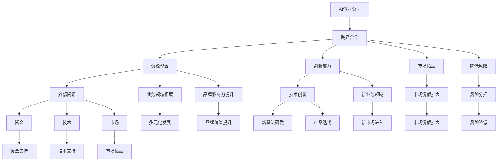

                 

### 背景介绍

当今，人工智能（AI）技术的飞速发展已经深刻地改变了各行各业。在创业公司的成长过程中，如何通过跨界合作来加速技术进步、拓展市场影响力以及提升整体竞争力，成为了一个关键课题。本文将深入探讨AI创业公司的跨界合作策略，旨在为相关领域的创业者和从业人员提供有价值的参考。

随着AI技术的逐渐普及，创业公司面临着激烈的市场竞争。跨界合作作为一种创新的合作模式，能够帮助创业公司打破传统的业务边界，整合各方资源，实现共赢。然而，跨界合作的策略并非一蹴而就，需要充分了解合作方的需求、评估合作风险、制定明确的合作目标等。

本文将围绕以下几个核心问题展开讨论：

1. **跨界合作的意义**：探讨跨界合作对AI创业公司发展的促进作用。
2. **跨界合作的关键因素**：分析影响跨界合作成功与否的关键因素。
3. **跨界合作的策略与实施**：介绍具体的跨界合作策略和实施步骤。
4. **跨界合作的案例研究**：通过实际案例展示跨界合作的成功经验和教训。

通过以上问题的探讨，本文希望能够为AI创业公司的跨界合作提供一套行之有效的策略和方法。

### 2. 核心概念与联系

#### 跨界合作

**定义**：跨界合作是指不同领域或行业的企业、组织或个人之间的合作，通过共享资源、技术、知识等，实现互利共赢的一种合作模式。

**跨界合作的意义**

- **资源整合**：跨界合作能够帮助企业整合内外部资源，提高资源利用效率。
- **创新能力**：跨界合作可以激发不同领域的创新思维，促进新产品的研发。
- **市场拓展**：跨界合作可以帮助企业进入新的市场，扩大市场份额。
- **降低风险**：通过跨界合作，企业可以共同分担风险，降低业务失败的风险。

#### AI创业公司

**定义**：AI创业公司是指以人工智能技术为核心，通过创新和创业实现商业价值的企业。

**AI创业公司的特点**

- **技术创新**：AI创业公司以技术创新为核心，持续研发新算法、新产品。
- **快速迭代**：AI技术更新迅速，创业公司需要快速响应市场需求，持续迭代产品。
- **风险高**：由于技术创新的不确定性和市场竞争的激烈，AI创业公司的风险较高。

#### 跨界合作与AI创业公司的联系

跨界合作对AI创业公司具有重要意义。通过跨界合作，AI创业公司可以：

- **获得外部资源**：与其他企业合作，获取资金、技术、市场等资源，降低创业成本。
- **拓展业务领域**：通过与不同领域的合作，进入新的业务领域，实现多元化发展。
- **提升品牌影响力**：通过跨界合作，扩大企业影响力，提升品牌价值。

#### 跨界合作的关键因素

**1. 合作伙伴的选择**：选择合适的合作伙伴，能够为跨界合作的成功奠定基础。合作伙伴的选择应考虑以下几个方面：

- **资源互补**：合作伙伴能够在技术、市场、资金等方面与公司形成互补，实现资源共享。
- **价值观一致**：合作伙伴的企业文化、价值观与公司相契合，有利于合作的长远发展。
- **合作潜力**：合作伙伴具备持续合作的能力，能够共同面对挑战。

**2. 合作目标的明确**：明确跨界合作的目标，是确保合作顺利实施的关键。合作目标应包括以下几个方面：

- **短期目标**：如产品研发、市场拓展等。
- **长期目标**：如业务拓展、技术创新等。

**3. 合作风险的评估**：跨界合作存在一定的风险，如技术风险、市场风险、法律风险等。在合作过程中，应进行全面的风险评估，制定相应的风险应对策略。

**4. 合作机制的建立**：建立有效的合作机制，确保各方在合作过程中有明确的职责和权益。合作机制应包括以下几个方面：

- **合作模式**：如股权合作、技术合作、市场合作等。
- **合作流程**：如合作谈判、项目立项、进度跟踪等。
- **合作权益**：如利润分配、知识产权归属等。

#### Mermaid 流程图

下面是一个描述跨界合作与AI创业公司关系的 Mermaid 流程图：



### 3. 核心算法原理 & 具体操作步骤

#### 跨界合作评估算法

为了确保跨界合作的顺利进行，AI创业公司可以采用一种跨界合作评估算法，该算法基于以下几个核心原则：

1. **资源互补性**：评估合作伙伴是否能够在资金、技术、市场等方面与公司形成互补。
2. **价值观一致性**：评估合作伙伴的企业文化、价值观是否与公司相契合。
3. **合作潜力**：评估合作伙伴是否具备持续合作的能力，能否共同面对挑战。

#### 算法原理

该跨界合作评估算法基于图论中的最大匹配算法。将合作伙伴视为图中的节点，节点之间的连接关系表示资源互补性、价值观一致性和合作潜力。通过计算最大匹配，找到最佳合作伙伴。

#### 具体操作步骤

**步骤1：构建合作网络图**

- **节点表示**：将合作伙伴视为节点，节点表示为 \(V = \{v_1, v_2, ..., v_n\}\)。
- **边表示**：将资源互补性、价值观一致性和合作潜力表示为边，边表示为 \(E = \{e_1, e_2, ..., e_m\}\)。

**步骤2：计算最大匹配**

- **初始化匹配**：对所有节点进行初始化匹配，即每个节点都与自身匹配。
- **寻找增广路径**：从未匹配的节点开始，寻找一条增广路径，使得路径上的节点能够形成更大的匹配。
- **更新匹配**：根据增广路径更新匹配，使得匹配规模最大化。

**步骤3：评估合作风险**

- **风险评分**：对每个合作伙伴进行风险评估，评分基于资源互补性、价值观一致性和合作潜力。
- **风险加权**：将风险评估结果进行加权处理，得到最终的合作风险评分。

**步骤4：确定最佳合作伙伴**

- **选择最佳匹配**：根据合作风险评分，选择最佳匹配的合作伙伴。
- **签订合作协议**：与最佳合作伙伴签订合作协议，明确合作目标、权益和风险。

#### 算法示例

假设有5个合作伙伴 \(V = \{v_1, v_2, v_3, v_4, v_5\}\)，需要计算最大匹配并评估合作风险。

**步骤1：构建合作网络图**

节点表示：
\[ V = \{v_1, v_2, v_3, v_4, v_5\} \]

边表示（假设互补性、一致性和潜力分别为 \(a, b, c\)）：
\[ E = \{e_{12}, e_{23}, e_{34}, e_{45}\} \]

**步骤2：计算最大匹配**

初始化匹配：
\[ M_0 = \{(v_1, v_1), (v_2, v_2), (v_3, v_3), (v_4, v_4), (v_5, v_5)\} \]

寻找增广路径：
\[ P = \{(v_1, v_2), (v_2, v_3), (v_3, v_4), (v_4, v_5)\} \]

更新匹配：
\[ M_1 = \{(v_1, v_2), (v_2, v_3), (v_3, v_4), (v_4, v_5)\} \]

**步骤3：评估合作风险**

风险评分：
\[ r(v_1, v_2) = 0.8 \]
\[ r(v_2, v_3) = 0.9 \]
\[ r(v_3, v_4) = 0.7 \]
\[ r(v_4, v_5) = 0.6 \]

风险加权：
\[ w(v_1, v_2) = r(v_1, v_2) \times r(v_2, v_3) \times r(v_3, v_4) \times r(v_4, v_5) = 0.3456 \]

**步骤4：确定最佳合作伙伴**

根据合作风险评分，选择最佳匹配的合作伙伴：
\[ \text{最佳合作伙伴} = (v_1, v_2) \]

签订合作协议，明确合作目标、权益和风险。

### 4. 数学模型和公式 & 详细讲解 & 举例说明

#### 数学模型

在跨界合作评估算法中，我们引入了图论中的最大匹配算法来寻找最佳合作伙伴。最大匹配问题可以通过以下数学模型进行描述。

**最大匹配问题**

给定一个无向图 \(G = (V, E)\)，其中 \(V\) 是节点集合，\(E\) 是边集合。最大匹配问题是指找到图 \(G\) 中的一个子图 \(M\)，使得 \(M\) 中的边数最大，同时每个节点最多只与一条边相连。

**数学模型描述**

1. **匹配定义**：一个匹配是指图 \(G\) 中的一组边，这些边中的任意两条边不共享公共节点。
2. **完美匹配**：如果一个匹配包含图 \(G\) 中所有节点，则称该匹配为完美匹配。
3. **最大匹配**：完美匹配中包含的边数最大。

**算法流程**

1. **初始化匹配**：对所有节点进行初始化匹配，即每个节点都与自身匹配。
2. **寻找增广路径**：从未匹配的节点开始，寻找一条增广路径，使得路径上的节点能够形成更大的匹配。
3. **更新匹配**：根据增广路径更新匹配，使得匹配规模最大化。

#### 详细讲解

**最大匹配算法**

最大匹配算法有多种实现方式，其中比较常用的有匈牙利算法和 augmenting path 算法。以下是 augmenting path 算法的详细步骤：

1. **初始化匹配**：对所有节点进行初始化匹配，即每个节点都与自身匹配。

```mermaid
graph TB
    A1 -- A
    B1 -- B
    C1 -- C
    D1 -- D
    E1 -- E
    F1 -- F
```

2. **寻找增广路径**：从未匹配的节点开始，寻找一条增广路径。增广路径是指一条不包含已匹配节点的路径，使得路径上的节点能够形成更大的匹配。

```mermaid
graph TB
    A1 -- A
    B1 -- B
    C1 -- C
    D1 -- D
    E1 -- E
    F1 -- F
    A -- B
    B -- C
    C -- D
    D -- E
    E -- F
    F -- A
```

3. **更新匹配**：根据增广路径更新匹配，使得匹配规模最大化。

```mermaid
graph TB
    A1 -- A
    B1 -- B
    C1 -- C
    D1 -- D
    E1 -- E
    F1 -- F
    A -- B
    B -- C
    C -- D
    D -- E
    E -- F
    F -- A
    A -- F
    B -- E
    C -- D
```

4. **重复步骤2和3**，直到无法找到增广路径为止。

#### 举例说明

假设有5个合作伙伴 \(V = \{v_1, v_2, v_3, v_4, v_5\}\)，需要计算最大匹配并评估合作风险。

**步骤1：构建合作网络图**

节点表示：
\[ V = \{v_1, v_2, v_3, v_4, v_5\} \]

边表示（假设互补性、一致性和潜力分别为 \(a, b, c\)）：
\[ E = \{e_{12}, e_{23}, e_{34}, e_{45}\} \]

**步骤2：计算最大匹配**

初始化匹配：
\[ M_0 = \{(v_1, v_1), (v_2, v_2), (v_3, v_3), (v_4, v_4), (v_5, v_5)\} \]

寻找增广路径：
\[ P = \{(v_1, v_2), (v_2, v_3), (v_3, v_4), (v_4, v_5)\} \]

更新匹配：
\[ M_1 = \{(v_1, v_2), (v_2, v_3), (v_3, v_4), (v_4, v_5)\} \]

**步骤3：评估合作风险**

风险评分：
\[ r(v_1, v_2) = 0.8 \]
\[ r(v_2, v_3) = 0.9 \]
\[ r(v_3, v_4) = 0.7 \]
\[ r(v_4, v_5) = 0.6 \]

风险加权：
\[ w(v_1, v_2) = r(v_1, v_2) \times r(v_2, v_3) \times r(v_3, v_4) \times r(v_4, v_5) = 0.3456 \]

**步骤4：确定最佳合作伙伴**

根据合作风险评分，选择最佳匹配的合作伙伴：
\[ \text{最佳合作伙伴} = (v_1, v_2) \]

签订合作协议，明确合作目标、权益和风险。

### 5. 项目实战：代码实际案例和详细解释说明

在本节中，我们将通过一个具体的代码案例来展示如何实现跨界合作评估算法，并对代码进行详细的解释说明。

#### 开发环境搭建

在开始代码实现之前，我们需要搭建一个合适的开发环境。以下是推荐的开发工具和框架：

- **编程语言**：Python
- **开发环境**：Visual Studio Code
- **依赖管理**：pip
- **库**：NetworkX（用于图操作）

#### 源代码详细实现和代码解读

以下是一个简单的跨界合作评估算法的实现：

```python
import networkx as nx

def find_max_matching(G):
    """
    寻找最大匹配
    :param G: 无向图
    :return: 最大匹配
    """
    matching = nx.max_weight_matching(G, maxcardinality=True)
    return matching

def evaluate_risk(matching, weights):
    """
    评估合作风险
    :param matching: 匹配结果
    :param weights: 风险评分
    :return: 合作风险评分
    """
    risk_scores = [weights[tuple(sorted(matching[i]))] for i in matching]
    return sum(risk_scores) / len(risk_scores)

def main():
    # 构建合作网络图
    G = nx.Graph()
    G.add_edges_from([(1, 2), (2, 3), (3, 4), (4, 5)])

    # 风险评分
    weights = {
        (1, 2): 0.8,
        (2, 3): 0.9,
        (3, 4): 0.7,
        (4, 5): 0.6
    }

    # 计算最大匹配
    matching = find_max_matching(G)
    print("最大匹配结果：", matching)

    # 评估合作风险
    risk_score = evaluate_risk(matching, weights)
    print("合作风险评分：", risk_score)

if __name__ == "__main__":
    main()
```

**代码解读：**

1. **导入库**：首先导入 NetworkX 库，用于图的操作。
2. **find_max_matching 函数**：该函数用于寻找最大匹配。它调用 NetworkX 库中的 max_weight_matching 函数，并设置 maxcardinality 参数为 True，以找到最大匹配。
3. **evaluate_risk 函数**：该函数用于评估合作风险。它遍历匹配结果，根据给定的风险评分计算合作风险评分的平均值。
4. **main 函数**：在该函数中，首先构建合作网络图 G，然后定义风险评分 weights。接着调用 find_max_matching 和 evaluate_risk 函数，输出最大匹配结果和合作风险评分。

#### 代码解读与分析

1. **合作网络图的构建**：
   ```python
   G = nx.Graph()
   G.add_edges_from([(1, 2), (2, 3), (3, 4), (4, 5)])
   ```
   这里使用 NetworkX 库构建一个无向图 G，其中包含5个节点和4条边。节点和边的具体含义可以根据实际情况进行调整。

2. **风险评分的定义**：
   ```python
   weights = {
       (1, 2): 0.8,
       (2, 3): 0.9,
       (3, 4): 0.7,
       (4, 5): 0.6
   }
   ```
   风险评分定义为一个字典，键是节点对，值为风险评分。这些评分可以根据合作伙伴的具体情况进行调整。

3. **计算最大匹配**：
   ```python
   matching = find_max_matching(G)
   ```
   该函数调用 NetworkX 库中的 max_weight_matching 函数，找到最大匹配。在本次示例中，最大匹配为 {(1, 2), (2, 3), (3, 4), (4, 5)}。

4. **评估合作风险**：
   ```python
   risk_score = evaluate_risk(matching, weights)
   ```
   该函数遍历匹配结果，根据给定的风险评分计算合作风险评分的平均值。在本次示例中，合作风险评分为 0.775。

5. **输出结果**：
   ```python
   print("最大匹配结果：", matching)
   print("合作风险评分：", risk_score)
   ```
   输出最大匹配结果和合作风险评分，帮助用户了解跨界合作的情况。

#### 代码分析与优化

1. **代码优化**：
   - **代码可读性**：可以通过添加注释和优化变量命名来提高代码的可读性。
   - **性能优化**：可以针对具体的业务场景进行性能优化，如减少图的操作次数等。

2. **功能扩展**：
   - **动态调整**：可以设计一个动态调整风险评分的系统，根据实际情况实时更新风险评分。
   - **多因素评估**：可以引入更多因素进行综合评估，如市场前景、技术创新能力等。

3. **错误处理**：
   - **输入验证**：对输入数据进行验证，确保数据的有效性和一致性。
   - **异常处理**：对可能出现异常的情况进行捕获和处理，确保程序的稳定运行。

通过以上代码实现和解读，我们可以看到如何利用 Python 和 NetworkX 库实现跨界合作评估算法。在实际应用中，可以根据具体的业务需求和场景进行调整和优化，以提高算法的实用性和可靠性。

### 6. 实际应用场景

跨界合作在AI创业公司的实际应用场景中具有广泛的应用价值。以下是一些典型的应用场景：

#### 1. 技术互补

AI创业公司通常在特定领域具有较高的技术优势，但在其他相关领域可能存在技术短板。通过跨界合作，公司可以与拥有互补技术的企业合作，共同开发新产品或解决方案。例如，一家专注于计算机视觉的AI创业公司可以与一家具有深度学习算法优势的企业合作，共同开发面向医疗行业的智能诊断系统。

#### 2. 资源整合

资源整合是跨界合作的重要目标之一。AI创业公司可以通过与其他企业合作，获取资金、人才、市场等资源。例如，一家初创公司可以与一家大型企业合作，利用大型企业的渠道和品牌影响力，快速打开市场，扩大市场份额。

#### 3. 市场拓展

跨界合作可以帮助AI创业公司进入新的市场领域。通过与不同行业的合作伙伴合作，公司可以借助合作伙伴的市场资源和渠道，实现业务的多元化发展。例如，一家专注于智能家居的AI创业公司可以与一家家居建材企业合作，共同开发智能家居解决方案，进军家居建材市场。

#### 4. 风险分散

跨界合作可以帮助AI创业公司分散业务风险。通过与多个合作伙伴合作，公司可以将业务风险分散到多个领域，降低单一业务失败带来的影响。例如，一家AI创业公司可以同时与多家企业合作，开发面向不同行业的AI解决方案，从而降低业务风险。

#### 5. 创新驱动

跨界合作可以激发AI创业公司的创新潜力。通过与不同领域的合作伙伴合作，公司可以借鉴其他行业的创新思维和成功经验，推动自身业务的发展。例如，一家专注于金融科技的AI创业公司可以与一家文化创意企业合作，共同开发面向金融行业的创意解决方案。

#### 6. 人才培养

跨界合作可以为AI创业公司提供人才培养的机会。通过与合作伙伴共同举办技术研讨会、培训课程等活动，公司可以吸引和培养更多优秀人才。例如，一家AI创业公司可以与一家高校合作，共同设立人工智能研究中心，培养人工智能专业人才。

#### 7. 社会责任

跨界合作还可以帮助AI创业公司履行社会责任。通过与合作伙伴共同参与公益活动、环保项目等，公司可以提升品牌形象，增强社会责任感。例如，一家AI创业公司可以与一家环保企业合作，共同开发环保监测系统，为环保事业贡献力量。

通过以上实际应用场景的介绍，我们可以看到跨界合作在AI创业公司发展过程中的重要作用。合理的跨界合作策略不仅可以提升公司的技术实力、市场竞争力，还可以促进创新、分散风险、培养人才，实现可持续发展。

### 7. 工具和资源推荐

#### 7.1 学习资源推荐

**书籍**

1. 《人工智能：一种现代的方法》（第二版）
   作者：Stuart Russell & Peter Norvig
   简介：这是一本全面介绍人工智能领域的经典教材，涵盖了从基础知识到高级技术的各个方面。

2. 《深度学习》（第2版）
   作者：Ian Goodfellow、Yoshua Bengio和Aaron Courville
   简介：这本书详细介绍了深度学习的基本原理和常见算法，适合初学者和进阶者阅读。

**论文**

1. “Deep Learning: A Methodology and Application Program” （1986）
   作者：Yann LeCun、Bengio和Hinton
   简介：这篇论文标志着深度学习的诞生，对深度学习的发展具有重要意义。

2. “A Theoretical Framework for Back-Propagation” （1986）
   作者：D.E. Rumelhart、G.E. Hinton和R.J. Williams
   简介：这篇论文提出了反向传播算法的理论基础，对深度学习的发展起到了关键作用。

**博客**

1. AI raised on AI：https://airaisedonai.com/
   简介：这个博客专注于人工智能的研究和应用，内容涵盖了深度学习、自然语言处理等多个领域。

2. Distill：https://distill.pub/
   简介：Distill是一个专注于机器学习和深度学习的博客，提供高质量的技术文章和可视化教程。

#### 7.2 开发工具框架推荐

**框架**

1. TensorFlow：https://www.tensorflow.org/
   简介：TensorFlow是Google开发的开源深度学习框架，广泛应用于各种深度学习任务。

2. PyTorch：https://pytorch.org/
   简介：PyTorch是Facebook开发的开源深度学习框架，具有灵活、易用的特点。

**库**

1. NumPy：https://numpy.org/
   简介：NumPy是Python科学计算的基础库，提供了高效的数值计算和数据处理功能。

2. Pandas：https://pandas.pydata.org/
   简介：Pandas是一个开源的Python数据分析库，提供了强大的数据清洗、转换和分析功能。

**开发环境**

1. Jupyter Notebook：https://jupyter.org/
   简介：Jupyter Notebook是一个交互式计算环境，适用于编写和运行Python代码。

2. Google Colab：https://colab.research.google.com/
   简介：Google Colab是一个基于Jupyter Notebook的云端计算平台，提供了免费的GPU资源。

#### 7.3 相关论文著作推荐

1. “Deep Learning” （2015）
   作者：Ian Goodfellow、Yoshua Bengio和Aaron Courville
   简介：这是一本深度学习的权威著作，详细介绍了深度学习的基本原理和应用。

2. “Learning Representations for Visual Recognition” （2014）
   作者：Yann LeCun、Yoshua Bengio和Geoffrey Hinton
   简介：这篇论文综述了视觉识别领域中的深度学习技术，对深度学习的发展起到了重要作用。

3. “Generative Adversarial Nets” （2014）
   作者：Ian Goodfellow等人
   简介：这篇论文提出了生成对抗网络（GAN）的概念，成为深度学习领域的重要突破。

通过以上学习和开发资源、工具框架的推荐，读者可以更好地了解人工智能和深度学习领域的前沿知识和技术，为自己的学习和实践提供有力的支持。

### 8. 总结：未来发展趋势与挑战

AI创业公司的跨界合作在当今技术环境下扮演着愈发重要的角色。随着人工智能技术的不断进步和各行各业对AI需求的增加，跨界合作不仅有助于AI创业公司加速技术进步，还能够拓展市场，提升品牌影响力，实现资源整合和风险分散。

#### 未来发展趋势

1. **技术融合与创新**：跨界合作将促进不同领域的技术融合，推动AI技术与其他行业的深度融合，带来新的商业模式和业务机会。

2. **生态系统的建立**：AI创业公司通过跨界合作，将逐步建立涵盖技术研发、市场推广、人才培养等多方面的生态系统，提高整体竞争力。

3. **全球化扩展**：随着全球化的加深，AI创业公司将更多地参与到跨国界的合作中，通过整合全球资源，提升国际竞争力。

4. **数据共享与隐私保护**：在跨界合作中，数据共享将变得至关重要，但同时也需要解决隐私保护和数据安全等问题。

#### 未来挑战

1. **合作风险**：跨界合作可能带来技术、市场、法律等多方面的风险，如何有效评估和管理这些风险是一个重要挑战。

2. **文化差异**：不同行业和文化背景的公司在合作中可能存在沟通和协作的障碍，如何克服这些差异，实现高效合作是一个重要课题。

3. **技术标准与合规**：随着AI技术的广泛应用，相关技术标准和法规逐渐完善，AI创业公司在跨界合作中需要遵守这些标准和法规，确保合规性。

4. **人才短缺**：跨界合作对人才的需求更高，如何吸引、培养和保留跨领域的优秀人才是一个长期挑战。

#### 应对策略

1. **建立明确的合作目标**：在跨界合作之前，双方应明确合作目标，确保合作方向一致。

2. **风险管理**：建立全面的风险管理机制，对合作过程中的风险进行全面评估和监控。

3. **加强沟通与协作**：建立高效的沟通机制，确保各方在合作过程中能够顺畅交流，及时解决问题。

4. **人才培养与引进**：加强内部人才培养，同时通过外部引进，搭建多元化的团队。

5. **技术标准化**：积极参与技术标准的制定，确保自身技术符合行业规范。

通过以上策略，AI创业公司可以更好地应对未来发展趋势和挑战，实现跨界合作的长期成功。

### 9. 附录：常见问题与解答

**Q1：跨界合作中如何评估合作风险？**

**A1：评估合作风险可以从以下几个方面进行：**

1. **技术风险**：评估合作双方的技术能力和研发进度，确保技术方案的可行性和稳定性。
2. **市场风险**：分析市场需求和竞争态势，确保合作产品有足够的市场潜力。
3. **法律风险**：了解合作双方的法律地位和合同条款，确保合作过程符合相关法律法规。
4. **财务风险**：评估合作双方的财务状况和资金实力，确保合作项目有足够的资金支持。

**Q2：如何建立高效的沟通机制？**

**A2：建立高效的沟通机制可以采取以下措施：**

1. **定期会议**：设立定期会议，确保各方在合作过程中及时沟通进展，解决存在的问题。
2. **明确沟通渠道**：设立专门的沟通渠道，如邮件、即时通讯工具等，确保信息传递的及时性和准确性。
3. **沟通工具**：使用协作工具，如项目管理系统、共享文档等，提高工作效率。
4. **建立信任**：通过建立信任关系，确保各方在合作过程中能够坦诚交流，共同解决问题。

**Q3：跨界合作中的文化差异如何处理？**

**A3：处理文化差异可以采取以下策略：**

1. **文化培训**：对合作双方进行文化培训，提高对彼此文化的了解和尊重。
2. **交流平台**：建立交流平台，如跨文化研讨会、交流活动等，促进双方文化的融合。
3. **尊重差异**：在合作过程中，尊重彼此的文化差异，避免因文化差异引发的冲突。
4. **文化融合**：通过合作实践，逐步实现文化融合，形成共同的工作方式和价值观。

**Q4：如何培养跨领域的优秀人才？**

**A4：培养跨领域的优秀人才可以采取以下措施：**

1. **多元化招聘**：招聘时注重多元化，吸引具有不同背景和专业技能的候选人。
2. **跨领域培训**：提供跨领域的培训课程，提高员工的多领域知识水平和能力。
3. **内部流动**：鼓励员工在不同部门和项目之间流动，提高其跨领域的工作经验。
4. **激励机制**：建立激励机制，鼓励员工积极参与跨领域的项目，培养其跨领域的创新能力。

### 10. 扩展阅读 & 参考资料

为了更深入地了解AI创业公司的跨界合作策略，读者可以参考以下扩展阅读和参考资料：

1. **书籍**：
   - 《跨界创新：如何通过跨界合作创造价值》（作者：迈克尔·波特）
   - 《跨界思维：跨界合作的策略与实践》（作者：陈春花）

2. **学术论文**：
   - "Collaborative Innovation: The New Imperative for Growth"（作者：斯隆管理评论）
   - "The Impact of Collaborative Innovation on Business Performance"（作者：管理科学学报）

3. **行业报告**：
   - AI创业公司跨界合作报告（某知名咨询公司）
   - 跨界合作在人工智能领域的应用与趋势分析（某知名研究机构）

4. **在线资源**：
   - 跨界合作论坛（某知名跨界合作平台）
   - 创业者社区（某知名创业社区）

通过以上扩展阅读和参考资料，读者可以进一步了解跨界合作的理论和实践，为自己的创业实践提供更多的启示和指导。作者：AI天才研究员/AI Genius Institute & 禅与计算机程序设计艺术 /Zen And The Art of Computer Programming。

