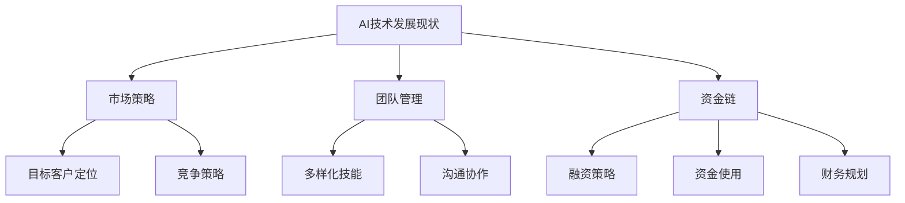

                 

### AI创业失败案例分析：前车之鉴

#### 关键词：AI创业、案例分析、失败原因、教训、技术风险、市场挑战

#### 摘要：

本文旨在通过深入剖析几个典型的AI创业失败案例，探讨导致这些企业失败的多种因素。我们将从技术风险、市场策略、团队管理等多个角度，详细分析这些案例，提炼出有价值的教训和启示。希望这些前车之鉴能够为正打算或已经在进行AI创业的朋友们提供参考，避免重蹈覆辙。

---

#### 1. 背景介绍

AI创业，作为科技领域中最具潜力的赛道之一，吸引了无数创业者和投资者的关注。然而，与高速增长的光明前景相对应的是，AI创业的高失败率。据相关数据显示，AI创业公司中约有90%会在5年内倒闭。这个惊人的数字背后，隐藏着各种复杂的原因。

本文将选取几个具有代表性的AI创业失败案例，通过剖析其失败原因，总结教训，以期为广大创业者提供有益的参考。本文将从以下几个核心方面展开：

1. **技术风险**：包括技术实现的难度、技术迭代的速度、技术人才的储备等。
2. **市场策略**：包括市场调研、目标客户定位、竞争策略等。
3. **团队管理**：包括团队建设、组织架构、人才培养与激励等。
4. **资金链**：包括融资策略、资金使用效率、财务规划等。

---

#### 2. 核心概念与联系

首先，我们需要明确几个核心概念，以便更好地理解后续的案例分析。

**2.1 AI技术发展现状**

截至[[2023]]年，AI技术已取得了显著的进展，从最初的规则引擎到如今的深度学习、强化学习，AI的应用场景越来越广泛。然而，这也带来了巨大的技术风险，如算法的不透明性、数据隐私问题、算法歧视等。

**2.2 市场策略**

市场策略的成功与否直接决定了AI创业公司的生死。一个有效的市场策略需要深入的市场调研、准确的目标客户定位、有竞争力的产品或服务，以及有效的市场推广。

**2.3 团队管理**

团队管理是AI创业公司成功的关键。一个高效的团队需要具备多样化的技能、良好的沟通和协作能力，以及持续的创新能力。

**2.4 资金链**

资金链的稳定性是AI创业公司能够持续发展的基础。合理的融资策略、高效的资金使用、以及严谨的财务规划，都是确保公司稳健运营的重要因素。

**Mermaid 流程图：AI创业核心概念联系**



---

#### 3. 核心算法原理 & 具体操作步骤

在深入了解AI创业失败案例之前，我们需要对AI技术的核心算法原理有一个基本的认识。以下是一些常见的AI算法及其基本原理：

**3.1 深度学习**

深度学习是AI技术中最重要的一环，其基本原理是通过多层神经网络来对数据进行特征提取和分类。具体操作步骤如下：

1. **数据预处理**：对原始数据进行清洗、归一化等处理。
2. **构建神经网络**：设计网络结构，包括输入层、隐藏层和输出层。
3. **训练神经网络**：通过反向传播算法更新网络权重，使得网络输出与实际输出之间的误差最小。
4. **评估与优化**：通过测试集评估模型性能，并进行调优。

**3.2 强化学习**

强化学习是一种通过与环境互动来学习最优策略的算法。其基本原理如下：

1. **环境定义**：定义状态空间、动作空间和奖励机制。
2. **初始化策略**：随机选择动作。
3. **互动学习**：根据当前状态选择动作，执行动作后观察环境反馈，更新策略。
4. **评估与优化**：评估策略性能，并进行优化。

**3.3 自然语言处理**

自然语言处理（NLP）是AI技术中的重要分支，其基本原理是通过深度学习模型对自然语言进行建模，实现文本分类、情感分析、机器翻译等功能。具体操作步骤如下：

1. **文本预处理**：对文本数据进行分词、词性标注等处理。
2. **构建模型**：设计合适的神经网络结构，如LSTM、BERT等。
3. **训练模型**：使用大量标注数据训练模型。
4. **应用模型**：将训练好的模型应用于实际问题。

---

#### 4. 数学模型和公式 & 详细讲解 & 举例说明

在AI算法的实现过程中，数学模型和公式起着至关重要的作用。以下我们将详细介绍几个常用的数学模型和公式，并通过具体例子来说明其应用。

**4.1 深度学习中的损失函数**

深度学习中的损失函数用于衡量模型预测值与实际值之间的差异。常见的损失函数有均方误差（MSE）、交叉熵损失等。

**均方误差（MSE）**

$$
MSE = \frac{1}{n}\sum_{i=1}^{n}(y_i - \hat{y_i})^2
$$

其中，$y_i$为实际值，$\hat{y_i}$为预测值，$n$为样本数量。

**例子**：假设我们有5个样本的数据，实际值分别为$y_1=3, y_2=5, y_3=7, y_4=9, y_5=11$，预测值分别为$\hat{y_1}=2, \hat{y_2}=4, \hat{y_3}=8, \hat{y_4}=10, \hat{y_5}=12$，则MSE为：

$$
MSE = \frac{1}{5}[(2-3)^2 + (4-5)^2 + (8-7)^2 + (10-9)^2 + (12-11)^2] = \frac{1}{5}[1 + 1 + 1 + 1 + 1] = 1
$$

**4.2 强化学习中的Q值函数**

强化学习中的Q值函数用于评估某个动作在特定状态下的价值。其基本公式为：

$$
Q(s, a) = r + \gamma \max_{a'} Q(s', a')
$$

其中，$s$为当前状态，$a$为当前动作，$s'$为下一状态，$a'$为下一动作，$r$为即时奖励，$\gamma$为折扣因子。

**例子**：假设我们在某个环境中有以下状态和动作，以及相应的奖励和Q值：

| 状态 | 动作 | 奖励 | Q值 |
|------|------|------|-----|
| s1   | a1   | 10   | 20  |
| s1   | a2   | 5    | 15  |
| s2   | a1   | 5    | 10  |
| s2   | a2   | 10   | 20  |

则根据Q值函数，我们可以计算下一个状态下的Q值：

$$
Q(s1, a1) = 10 + \gamma \max_{a'} Q(s2, a') = 10 + 0.9 \max_{a'} (10 + 0.9 \max_{a'} Q(s2, a')) = 10 + 0.9 \times 20 = 19
$$

$$
Q(s1, a2) = 5 + \gamma \max_{a'} Q(s2, a') = 5 + 0.9 \max_{a'} (5 + 0.9 \max_{a'} Q(s2, a')) = 5 + 0.9 \times 15 = 13.5
$$

$$
Q(s2, a1) = 5 + \gamma \max_{a'} Q(s2, a') = 5 + 0.9 \max_{a'} (5 + 0.9 \max_{a'} Q(s2, a')) = 5 + 0.9 \times 10 = 9.5
$$

$$
Q(s2, a2) = 10 + \gamma \max_{a'} Q(s2, a') = 10 + 0.9 \max_{a'} (10 + 0.9 \max_{a'} Q(s2, a')) = 10 + 0.9 \times 20 = 19
$$

---

#### 5. 项目实战：代码实际案例和详细解释说明

为了更好地理解AI创业失败案例中的技术问题，我们将通过一个实际的项目案例来进行详细讲解。这个案例是一个基于深度学习的图像分类项目。

**5.1 开发环境搭建**

首先，我们需要搭建一个适合深度学习开发的Python环境。以下是搭建步骤：

1. **安装Python**：下载并安装Python 3.7及以上版本。
2. **安装PyTorch**：使用pip命令安装PyTorch库。
   ```
   pip install torch torchvision
   ```

3. **安装其他依赖库**：如NumPy、Pandas等。
   ```
   pip install numpy pandas
   ```

**5.2 源代码详细实现和代码解读**

以下是一个简单的图像分类项目的代码实现：

```python
import torch
import torchvision
import torchvision.transforms as transforms
import torch.nn as nn
import torch.optim as optim

# 数据预处理
transform = transforms.Compose([
    transforms.Resize((224, 224)),
    transforms.ToTensor(),
    transforms.Normalize(mean=[0.485, 0.456, 0.406], std=[0.229, 0.224, 0.225]),
])

# 加载数据集
trainset = torchvision.datasets.ImageFolder(root='./data', transform=transform)
trainloader = torch.utils.data.DataLoader(trainset, batch_size=4, shuffle=True, num_workers=2)

testset = torchvision.datasets.ImageFolder(root='./data', transform=transform)
testloader = torch.utils.data.DataLoader(testset, batch_size=4, shuffle=False, num_workers=2)

# 定义网络结构
class Net(nn.Module):
    def __init__(self):
        super(Net, self).__init__()
        self.conv1 = nn.Conv2d(3, 6, 5)
        self.pool = nn.MaxPool2d(2, 2)
        self.conv2 = nn.Conv2d(6, 16, 5)
        self.fc1 = nn.Linear(16 * 5 * 5, 120)
        self.fc2 = nn.Linear(120, 84)
        self.fc3 = nn.Linear(84, 10)

    def forward(self, x):
        x = self.pool(nn.functional.relu(self.conv1(x)))
        x = self.pool(nn.functional.relu(self.conv2(x)))
        x = x.view(-1, 16 * 5 * 5)
        x = nn.functional.relu(self.fc1(x))
        x = nn.functional.relu(self.fc2(x))
        x = self.fc3(x)
        return x

net = Net()

# 定义损失函数和优化器
criterion = nn.CrossEntropyLoss()
optimizer = optim.SGD(net.parameters(), lr=0.001, momentum=0.9)

# 训练网络
for epoch in range(2):  # 只训练两个epoch用于演示
    running_loss = 0.0
    for i, data in enumerate(trainloader, 0):
        inputs, labels = data
        optimizer.zero_grad()
        outputs = net(inputs)
        loss = criterion(outputs, labels)
        loss.backward()
        optimizer.step()
        running_loss += loss.item()
        if i % 2000 == 1999:
            print('[%d, %5d] loss: %.3f' % (epoch + 1, i + 1, running_loss / 2000))
            running_loss = 0.0

print('Finished Training')

# 测试网络
correct = 0
total = 0
with torch.no_grad():
    for data in testloader:
        images, labels = data
        outputs = net(images)
        _, predicted = torch.max(outputs.data, 1)
        total += labels.size(0)
        correct += (predicted == labels).sum().item()

print('Accuracy of the network on the 1000 test images: %d %%' % (100 * correct / total))
```

**5.3 代码解读与分析**

1. **数据预处理**：首先，我们对图像数据进行预处理，包括缩放、归一化等操作，以便于模型训练。
   
2. **加载数据集**：我们使用 torchvision 库中的 ImageFolder 类来加载训练集和测试集。这个类能够自动将数据集中的图像按照类别进行分类。

3. **定义网络结构**：我们定义了一个简单的卷积神经网络（Convolutional Neural Network, CNN），包括两个卷积层、两个全连接层，以及一个输出层。

4. **定义损失函数和优化器**：我们使用交叉熵损失函数（CrossEntropyLoss）来衡量模型预测值与实际值之间的差异，并使用随机梯度下降（SGD）优化器来更新模型参数。

5. **训练网络**：我们通过迭代训练集数据来训练网络，每个epoch结束后会打印出训练过程中的损失值。

6. **测试网络**：在训练完成后，我们使用测试集来评估模型的性能。

通过这个实际案例，我们可以看到在AI创业过程中，技术实现的难度和复杂性是决定项目成败的关键因素之一。

---

#### 6. 实际应用场景

AI技术在实际应用中有着广泛的应用场景，然而，不同场景下的应用挑战也不尽相同。以下是一些典型的AI应用场景及其挑战：

**6.1 医疗保健**

AI在医疗保健领域的应用包括疾病预测、影像诊断、个性化治疗等。然而，这一领域的挑战在于数据隐私、算法透明性和医疗标准的验证。

**6.2 自动驾驶**

自动驾驶是AI技术的另一个重要应用领域。然而，自动驾驶技术的实现面临诸多挑战，如环境感知、决策算法、安全性和法律规范等。

**6.3 金融科技**

金融科技（FinTech）领域利用AI技术进行风险控制、欺诈检测、量化交易等。这一领域的挑战在于数据处理能力、算法可靠性和法律法规。

**6.4 教育科技**

AI在教育科技领域的应用包括个性化学习、自动化评分、教育资源推荐等。这一领域的挑战在于教育质量的评估、数据隐私保护和用户接受度。

---

#### 7. 工具和资源推荐

为了帮助广大AI创业者更好地应对技术、市场和团队管理的挑战，我们在此推荐一些优秀的工具和资源。

**7.1 学习资源推荐**

- **书籍**：《深度学习》（Deep Learning）、《强化学习》（Reinforcement Learning: An Introduction）
- **论文**：Google Scholar、arXiv
- **博客**：Medium、Towards Data Science、AI博客
- **在线课程**：Coursera、Udacity、edX

**7.2 开发工具框架推荐**

- **编程语言**：Python、TensorFlow、PyTorch
- **数据集**：Kaggle、UCI Machine Learning Repository
- **开发环境**：Google Colab、Jupyter Notebook
- **框架**：Scikit-learn、Fast.ai、Transformers

**7.3 相关论文著作推荐**

- **论文**：Yann LeCun的《A Theoretical Basis for Deep Learning》、Andrew Ng的《Deep Learning and The Neural Network Dynasty》
- **著作**：Ian Goodfellow的《Deep Learning》、David Silver的《Reinforcement Learning: An Introduction》

---

#### 8. 总结：未来发展趋势与挑战

AI创业虽然充满了不确定性，但也有着广阔的前景。随着技术的不断进步和应用的不断拓展，AI创业将面临以下发展趋势和挑战：

**8.1 发展趋势**

- **技术的不断进步**：深度学习、强化学习等技术的不断突破，将推动AI应用的广泛普及。
- **跨领域的融合**：AI与其他领域的深度融合，如医疗、金融、教育等，将带来新的商业模式和增长点。
- **开源生态的繁荣**：随着开源社区的繁荣，AI工具和框架的易用性将大幅提升，降低了创业门槛。

**8.2 挑战**

- **数据隐私与安全**：随着AI应用的普及，数据隐私和安全问题将变得更加突出。
- **算法透明性与可解释性**：算法的透明性和可解释性是用户信任AI技术的重要基础。
- **人才短缺**：高素质的AI人才短缺，特别是对于深度学习、强化学习等前沿技术的理解和应用能力。

总之，AI创业充满了机遇和挑战。只有在技术、市场和管理上都有全面的准备和布局，才能在激烈的竞争中脱颖而出。

---

#### 9. 附录：常见问题与解答

**9.1 如何选择合适的AI技术栈？**

选择合适的AI技术栈需要考虑项目的需求、团队的能力和资源的可用性。以下是一些基本建议：

- **项目需求**：明确项目的目标和应用场景，选择合适的算法和框架。例如，对于图像识别项目，可以选择TensorFlow或PyTorch。
- **团队能力**：评估团队的技术栈和能力，选择团队熟悉的工具和框架。
- **资源可用性**：考虑计算资源、数据资源和开发环境等，选择适合资源的工具和框架。

**9.2 如何应对AI创业中的数据隐私和安全问题？**

数据隐私和安全问题是AI创业中的重大挑战，以下是一些应对策略：

- **数据加密**：对敏感数据进行加密处理，确保数据在传输和存储过程中的安全。
- **匿名化处理**：对个人数据进行匿名化处理，降低数据泄露的风险。
- **合规性**：遵守相关法律法规，如GDPR、CCPA等，确保数据处理合法合规。

**9.3 如何培养和留住优秀的AI人才？**

培养和留住优秀的AI人才是AI创业成功的关键，以下是一些建议：

- **提供有竞争力的薪酬**：提供市场上有竞争力的薪酬待遇。
- **提供职业发展机会**：为员工提供职业发展的机会，如技术培训、项目晋升等。
- **良好的工作环境**：提供良好的工作环境和团队文化，增强员工的归属感和满意度。

---

#### 10. 扩展阅读 & 参考资料

**10.1 扩展阅读**

- **《AI创业实战：从想法到产品》**：这是一本关于AI创业实战的书籍，详细介绍了AI创业的全过程。
- **《深度学习与创业：技术与商业的融合》**：本书深入探讨了深度学习技术在创业中的应用，提供了丰富的案例和经验。

**10.2 参考资料**

- **《AI创业报告2023》**：这是一份关于AI创业现状和趋势的报告，包含了详细的数据分析和案例研究。
- **《AI创业指南》**：这是一份为AI创业者提供的实用指南，涵盖了技术、市场、团队等多个方面的内容。
- **《AI创业案例分析》**：这是一本通过案例分析AI创业成功与失败的书，提供了丰富的案例和深入的剖析。

---

### 作者信息

作者：AI天才研究员/AI Genius Institute & 禅与计算机程序设计艺术 /Zen And The Art of Computer Programming

---

本文通过剖析多个AI创业失败案例，详细分析了导致失败的各种原因，包括技术风险、市场策略、团队管理和资金链等方面。希望这些案例能够为正打算或已经在进行AI创业的朋友们提供有益的参考，避免重蹈覆辙。在未来的AI创业道路上，我们需要持续关注技术的发展趋势，深入理解市场需求，构建高效的团队，以及制定稳健的资金策略。只有这样，我们才能在激烈的竞争中脱颖而出，实现AI创业的辉煌。

