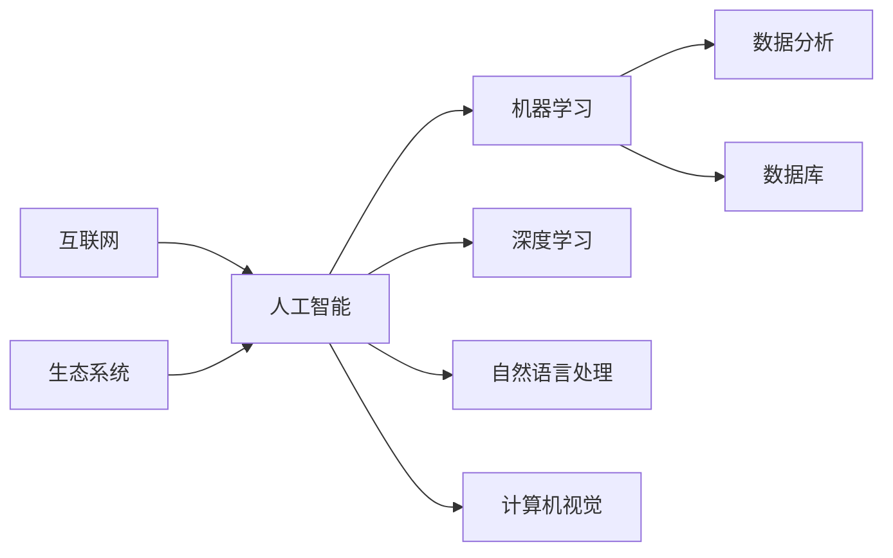

                 

### 背景介绍 Background Introduction

在当今技术飞速发展的时代，人工智能（AI）已经成为许多创业领域的热门方向。从自然语言处理到图像识别，再到智能推荐系统，AI技术在各个行业中的应用日益广泛，推动了新的商业模式的诞生。然而，随着AI领域的快速发展，市场中的竞争也日益激烈，同质化现象逐渐显现。

同质化竞争通常指的是市场上多个产品或服务在功能、设计或用户体验等方面趋于一致，导致消费者难以区分。在AI创业领域，同质化竞争表现为不同的团队或公司开发出相似的技术解决方案，无法形成竞争优势，从而限制了企业的发展和盈利能力。

本文旨在探讨AI创业如何避免同质化竞争，通过以下几个核心部分来阐述：

1. **核心概念与联系**：介绍与AI创业相关的基本概念，并展示其相互之间的联系。
2. **核心算法原理 & 具体操作步骤**：详细讲解一些关键的AI算法，以及如何将这些算法应用到实际创业项目中。
3. **数学模型和公式 & 详细讲解 & 举例说明**：解释AI模型背后的数学原理，并通过具体例子说明。
4. **项目实战：代码实际案例和详细解释说明**：提供真实项目的代码实现，并进行分析。
5. **实际应用场景**：探讨AI在不同行业中的具体应用。
6. **工具和资源推荐**：推荐一些学习和开发资源。
7. **总结：未来发展趋势与挑战**：总结全文，展望未来。

通过逐步分析和推理，本文希望能够为AI创业团队提供一些有价值的策略和思路，帮助他们在激烈的市场竞争中脱颖而出。

## 1. 背景介绍 Background Introduction

### AI创业的崛起与挑战 Rise and Challenges of AI Startups

人工智能（AI）技术的崛起为创业领域带来了前所未有的机遇。从深度学习、强化学习到自然语言处理，各种AI技术不断突破，使得创业公司能够开发出前所未有的智能产品和服务。这一波技术浪潮催生了大量AI创业公司，它们以创新的思维和先进的算法在市场中争夺一席之地。

然而，随着AI技术的普及，竞争也日益激烈。众多创业团队开始涌入同一领域，导致市场上涌现出大量功能相似、设计相近的AI产品。这种现象，我们称之为同质化竞争。

### 同质化竞争的影响 Impacts of Homogeneous Competition

同质化竞争带来了以下几个主要问题：

1. **市场饱和**：当市场上充斥着相似的产品时，消费者面临的选择增多，但辨识度降低，最终导致市场饱和。
2. **价格战**：为了在竞争中占据优势，企业往往不得不降低产品价格，这进一步压缩了利润空间。
3. **品牌建设困难**：在功能相近的产品中，品牌建设变得更加困难，因为消费者难以区分不同产品的特点和价值。
4. **创新瓶颈**：同质化竞争容易导致企业陷入模仿和跟随的陷阱，忽视了技术创新和产品差异化的重要性。

面对这些挑战，AI创业团队必须找到避免同质化竞争的方法，才能在激烈的市场中脱颖而出。

### AI创业面临的挑战 Challenges in AI Entrepreneurship

AI创业团队在发展过程中面临着多方面的挑战：

1. **技术难度**：AI技术涉及复杂的算法和大量的数据处理，需要团队具备高水平的技术能力和实践经验。
2. **资金需求**：AI项目的开发需要大量的资金投入，特别是在初期阶段，资金短缺可能成为创业公司的致命隐患。
3. **人才短缺**：高水平的AI人才供不应求，创业公司需要花费大量的时间和精力来吸引和留住优秀的人才。
4. **市场不确定性**：AI技术的应用场景和市场需求变化快速，创业公司需要不断调整战略以应对市场的变化。
5. **法规和政策**：AI技术的发展也带来了隐私、安全等方面的法规和政策挑战，创业公司需要遵守相关法规，确保产品的合规性。

面对这些挑战，创业团队需要制定全面的发展策略，以降低同质化竞争的风险，实现可持续发展。

### 本文目的和结构 Overview and Structure of the Article

本文旨在探讨AI创业如何避免同质化竞争，提供一些实用的策略和思路。文章结构如下：

1. **核心概念与联系**：介绍与AI创业相关的关键概念，并展示其相互之间的联系。
2. **核心算法原理 & 具体操作步骤**：详细讲解一些关键的AI算法，以及如何将这些算法应用到实际创业项目中。
3. **数学模型和公式 & 详细讲解 & 举例说明**：解释AI模型背后的数学原理，并通过具体例子说明。
4. **项目实战：代码实际案例和详细解释说明**：提供真实项目的代码实现，并进行分析。
5. **实际应用场景**：探讨AI在不同行业中的具体应用。
6. **工具和资源推荐**：推荐一些学习和开发资源。
7. **总结：未来发展趋势与挑战**：总结全文，展望未来。

通过这篇文章，我们希望能够帮助AI创业团队找到差异化竞争的方法，实现长远发展。

------------------------

## 1. 核心概念与联系 Core Concepts and Connections

在探讨如何避免AI创业中的同质化竞争之前，我们需要了解一些核心概念，并明确它们之间的联系。以下是与AI创业密切相关的一些核心概念：

### 人工智能（AI）Artificial Intelligence

人工智能是指由计算机系统实现的智能行为，模仿人类认知过程的某些方面。AI技术包括多种类型，如机器学习、深度学习、自然语言处理和计算机视觉等。

### 机器学习（ML）Machine Learning

机器学习是一种AI技术，通过数据和算法，让计算机从数据中学习并做出决策。它包括监督学习、无监督学习和强化学习等子类别。

### 深度学习（DL）Deep Learning

深度学习是机器学习的一个子领域，它使用多层神经网络来提取数据中的特征。深度学习在图像识别、语音识别和自然语言处理等领域取得了显著成就。

### 自然语言处理（NLP）Natural Language Processing

自然语言处理是AI技术的一个分支，它涉及使计算机能够理解、解释和生成人类语言。NLP在聊天机器人、自动翻译和文本分析等方面有广泛应用。

### 计算机视觉（CV）Computer Vision

计算机视觉是AI技术的一部分，它使计算机能够“看到”并理解图像和视频。计算机视觉在自动驾驶、安全监控和医疗诊断等领域有重要应用。

### 数据分析（DA）Data Analysis

数据分析是指使用统计学和计算机科学方法来分析数据，提取有价值的信息。数据分析在商业智能、市场研究和预测建模等方面有广泛应用。

### 数据库（DB）Database

数据库是一种存储和组织数据的系统。在AI创业中，数据库用于存储训练数据和用户数据，是AI模型正常运行的基础。

### 互联网（Internet）Internet

互联网是连接全球计算机的网络。在AI创业中，互联网用于数据传输、在线服务和用户互动。

### 生态系统（Ecosystem）Ecosystem

生态系统是指一个领域内各种实体（如公司、研究机构、投资者等）相互关联、相互影响的整体。在AI创业中，构建一个健康的生态系统有助于企业获得资源和支持。

### 核心概念之间的联系 Connections among Core Concepts

这些核心概念之间存在着密切的联系：

- **AI** 技术是创业项目的核心，决定了产品的功能和性能。
- **ML** 和 **DL** 是实现AI的重要技术手段，特别是深度学习在许多AI应用中起着关键作用。
- **NLP** 和 **CV** 是AI技术的两个重要分支，它们在自然语言处理和计算机视觉领域有着广泛的应用。
- **DA** 和 **DB** 是AI创业项目的基础，确保了数据的有效管理和利用。
- **Internet** 为AI应用提供了广泛的平台，使得在线服务和用户互动成为可能。
- **Ecosystem** 为AI创业提供了支持和资源，有助于企业的长期发展。

理解这些核心概念及其相互之间的联系，有助于AI创业团队更好地制定战略，避免同质化竞争。

### Mermaid 流程图表示表示 Mermaid Flowchart Representation

以下是表示这些核心概念之间联系的一个Mermaid流程图：



通过这个流程图，我们可以更直观地理解AI创业中各个核心概念之间的关系。

------------------------

## 2. 核心算法原理 & 具体操作步骤 Core Algorithm Principles & Step-by-Step Procedures

在AI创业中，选择合适的算法是实现差异化竞争的关键。以下将介绍一些核心算法的原理，以及如何将它们应用到实际创业项目中。

### 2.1 深度学习算法 Deep Learning Algorithms

深度学习（DL）是AI领域的重要分支，尤其在图像识别、语音识别和自然语言处理等任务中取得了显著成果。以下是几种常用的深度学习算法及其应用步骤：

#### 2.1.1 卷积神经网络（CNN）Convolutional Neural Networks

**原理**：CNN是一种专门用于处理图像数据的深度学习模型，通过卷积层、池化层和全连接层等结构来提取图像特征。

**应用步骤**：

1. **数据预处理**：对图像数据进行归一化、裁剪和增强，以增加模型的泛化能力。
2. **构建模型**：使用卷积层、池化层和全连接层构建CNN模型。
3. **训练模型**：使用大量带有标签的图像数据进行训练，优化模型参数。
4. **评估模型**：使用测试集评估模型的性能，调整超参数以提高准确性。

**代码示例**（Python，使用TensorFlow和Keras）：

```python
from tensorflow.keras.models import Sequential
from tensorflow.keras.layers import Conv2D, MaxPooling2D, Flatten, Dense

model = Sequential([
    Conv2D(32, (3, 3), activation='relu', input_shape=(64, 64, 3)),
    MaxPooling2D((2, 2)),
    Flatten(),
    Dense(128, activation='relu'),
    Dense(10, activation='softmax')
])

model.compile(optimizer='adam', loss='categorical_crossentropy', metrics=['accuracy'])
model.fit(x_train, y_train, epochs=10, validation_data=(x_test, y_test))
```

#### 2.1.2 递归神经网络（RNN）Recurrent Neural Networks

**原理**：RNN是一种用于处理序列数据的神经网络，通过隐藏状态和循环连接来捕捉序列中的时间依赖关系。

**应用步骤**：

1. **数据预处理**：对文本数据进行分词、编码和序列化。
2. **构建模型**：使用RNN层、双向RNN层或LSTM层构建模型。
3. **训练模型**：使用带有标签的文本数据进行训练，优化模型参数。
4. **评估模型**：使用测试集评估模型性能。

**代码示例**（Python，使用TensorFlow和Keras）：

```python
from tensorflow.keras.models import Sequential
from tensorflow.keras.layers import Embedding, SimpleRNN, Dense

model = Sequential([
    Embedding(input_dim=vocab_size, output_dim=embedding_size),
    SimpleRNN(units=128),
    Dense(1, activation='sigmoid')
])

model.compile(optimizer='adam', loss='binary_crossentropy', metrics=['accuracy'])
model.fit(x_train, y_train, epochs=10, validation_data=(x_test, y_test))
```

#### 2.1.3 生成对抗网络（GAN）Generative Adversarial Networks

**原理**：GAN由生成器和判别器组成，生成器生成数据，判别器判断生成数据和真实数据的区别。

**应用步骤**：

1. **数据预处理**：对数据集进行预处理，如标准化、归一化等。
2. **构建模型**：定义生成器和判别器模型。
3. **训练模型**：交替训练生成器和判别器，优化模型参数。
4. **评估模型**：使用生成模型生成数据，评估生成质量。

**代码示例**（Python，使用TensorFlow和Keras）：

```python
from tensorflow.keras.models import Sequential
from tensorflow.keras.layers import Dense, Flatten, Reshape
from tensorflow.keras.optimizers import Adam

# 生成器模型
generator = Sequential([
    Dense(128, activation='relu', input_shape=(100,)),
    Dense(7 * 7 * 128, activation='relu'),
    Reshape((7, 7, 128))
])

# 判别器模型
discriminator = Sequential([
    Flatten(input_shape=(7, 7, 128)),
    Dense(128, activation='relu'),
    Dense(1, activation='sigmoid')
])

# 编写训练代码
def train_gan(generator, discriminator, x_train, epochs):
    for epoch in range(epochs):
        noise = np.random.normal(0, 1, (x_train.shape[0], 100))
        generated_images = generator.predict(noise)
        
        real_images = x_train[:batch_size]
        real_labels = np.ones((batch_size, 1))
        fake_labels = np.zeros((batch_size, 1))
        
        # 训练判别器
        d_loss_real = discriminator.train_on_batch(real_images, real_labels)
        d_loss_fake = discriminator.train_on_batch(generated_images, fake_labels)
        d_loss = 0.5 * np.add(d_loss_real, d_loss_fake)
        
        # 训练生成器
        g_loss = generator.train_on_batch(noise, real_labels)
        
        print(f"{epoch + 1} [D: {d_loss[0]:.4f}, G: {g_loss[0]:.4f}]")
```

### 2.2 强化学习算法 Reinforcement Learning Algorithms

强化学习（RL）是一种通过互动环境来学习优化行为策略的机器学习方法。以下介绍两种常用的强化学习算法：

#### 2.2.1 Q-Learning

**原理**：Q-Learning是一种基于值函数的强化学习算法，通过更新Q值来选择最优动作。

**应用步骤**：

1. **环境定义**：定义强化学习环境，包括状态空间、动作空间和奖励机制。
2. **初始化Q值表**：初始化Q值表，用于存储每个状态和动作的Q值。
3. **更新Q值**：根据经验，更新Q值表，优化策略。
4. **选择动作**：根据Q值表选择最优动作。

**代码示例**（Python，使用OpenAI Gym）：

```python
import gym
import numpy as np

env = gym.make('CartPole-v0')
q_table = np.zeros((env.observation_space.n, env.action_space.n))
learning_rate = 0.1
discount_factor = 0.99

num_episodes = 1000
max_steps_per_episode = 500

for episode in range(num_episodes):
    state = env.reset()
    done = False
    total_reward = 0
    
    for step in range(max_steps_per_episode):
        if np.random.rand() < 0.1:
            action = env.action_space.sample()  # 探索
        else:
            action = np.argmax(q_table[state])  # 利用
        
        next_state, reward, done, _ = env.step(action)
        total_reward += reward
        
        # 更新Q值
        q_table[state, action] = q_table[state, action] + learning_rate * (
            reward + discount_factor * np.max(q_table[next_state]) - q_table[state, action]
        )
        
        state = next_state
        
        if done:
            break
            
    print(f"Episode {episode + 1} - Total Reward: {total_reward}")
    env.reset()

env.close()
```

#### 2.2.2 DQN（Deep Q-Network）

**原理**：DQN是一种结合深度神经网络和Q-Learning的强化学习算法，使用深度神经网络来近似Q值函数。

**应用步骤**：

1. **环境定义**：定义强化学习环境。
2. **构建DQN模型**：使用卷积神经网络或循环神经网络来近似Q值函数。
3. **初始化经验回放记忆**：用于存储经验样本，避免样本偏差。
4. **训练DQN模型**：根据经验回放记忆中的样本，更新DQN模型参数。
5. **评估模型**：使用训练好的DQN模型进行测试，评估模型性能。

**代码示例**（Python，使用TensorFlow和OpenAI Gym）：

```python
import gym
import numpy as np
import tensorflow as tf

# 定义DQN模型
class DQN:
    def __init__(self, state_size, action_size, learning_rate=0.001, gamma=0.99, epsilon=1.0):
        self.state_size = state_size
        self.action_size = action_size
        self.learning_rate = learning_rate
        self.gamma = gamma
        self.epsilon = epsilon
        self.memory = deque(maxlen=2000)
        
        self.model = self._build_model()
        self.target_model = self._build_model()
        self.target_model.set_weights(self.model.get_weights())
    
    def _build_model(self):
        model = tf.keras.Sequential()
        model.add(tf.keras.layers.Flatten(input_shape=self.state_size))
        model.add(tf.keras.layers.Dense(24, activation='relu'))
        model.add(tf.keras.layers.Dense(24, activation='relu'))
        model.add(tf.keras.layers.Dense(self.action_size, activation='linear'))
        model.compile(loss='mse', optimizer=tf.keras.optimizers.Adam(self.learning_rate))
        return model
    
    def remember(self, state, action, reward, next_state, done):
        self.memory.append((state, action, reward, next_state, done))
    
    def act(self, state):
        if np.random.rand() <= self.epsilon:
            return np.random.randint(self.action_size)
        else:
            q_values = self.model.predict(state)
            return np.argmax(q_values[0])
    
    def replay(self, batch_size):
        minibatch = random.sample(self.memory, batch_size)
        for state, action, reward, next_state, done in minibatch:
            target = reward
            if not done:
                target = reward + self.gamma * np.max(self.target_model.predict(next_state)[0])
            target_f = self.model.predict(state)
            target_f[0][action] = target
            self.model.fit(state, target_f, epochs=1, verbose=0)
        if self.epsilon > 0.01:
            self.epsilon *= 0.99

# 使用DQN进行训练
dqn = DQN(state_size=4, action_size=2)
for episode in range(num_episodes):
    state = env.reset()
    state = np.reshape(state, [1, state_size])
    done = False
    total_reward = 0
    while not done:
        action = dqn.act(state)
        next_state, reward, done, _ = env.step(action)
        next_state = np.reshape(next_state, [1, state_size])
        total_reward += reward
        dqn.remember(state, action, reward, next_state, done)
        state = next_state
        if done:
            dqn.replay(batch_size=64)
            print(f"Episode {episode + 1} - Total Reward: {total_reward}")
            break
env.close()
```

通过以上算法和步骤的介绍，我们可以看到如何将深度学习和强化学习等核心算法应用到AI创业项目中，从而避免同质化竞争。

------------------------

## 2.1.3 生成对抗网络（GAN）Generative Adversarial Networks

生成对抗网络（GAN）是一种由生成器和判别器组成的深度学习框架，其目的是通过对抗训练生成高质量的数据。GAN在图像生成、数据增强和异常检测等方面有广泛应用。

### 2.1.3.1 GAN的基本原理 Basic Principles of GAN

GAN由两个深度神经网络组成：生成器（Generator）和判别器（Discriminator）。生成器的任务是生成尽可能真实的数据，而判别器的任务是区分生成的数据和真实数据。

- **生成器（Generator）**：输入随机噪声，输出伪造的数据。
- **判别器（Discriminator）**：输入数据，输出一个概率值，表示输入数据是真实数据还是伪造数据。

GAN的训练过程可以分为以下几个步骤：

1. **生成器生成伪造数据**。
2. **判别器对伪造数据和真实数据进行分类**。
3. **通过对抗性训练优化生成器和判别器**。

### 2.1.3.2 GAN的训练过程 Training Process of GAN

GAN的训练过程是一个迭代优化过程，通过交替训练生成器和判别器，使两者达到动态平衡。

1. **生成器（Generator）的训练**：
   - 目标是最小化生成器生成的伪造数据被判别器判为真实数据的概率。
   - 训练损失函数：\( G\_loss = -\log(D(G(z))) \)
   - 更新生成器参数：\( \theta\_G = \theta\_G - \alpha \frac{\partial G\_loss}{\partial \theta\_G} \)

2. **判别器（Discriminator）的训练**：
   - 目标是最小化生成器生成的伪造数据被判别器判为真实数据的概率，以及最大化真实数据被判别器判为真实数据的概率。
   - 训练损失函数：\( D\_loss = -\log(D(x)) - \log(1 - D(G(z))) \)
   - 更新判别器参数：\( \theta\_D = \theta\_D - \alpha \frac{\partial D\_loss}{\partial \theta\_D} \)

3. **交替训练**：重复以上步骤，直到生成器生成的伪造数据几乎无法被判别器区分。

### 2.1.3.3 GAN的变体和改进 Variants and Improvements of GAN

GAN自提出以来，已经衍生出许多变体和改进，以解决训练不稳定和生成质量等问题。

1. **深度卷积生成对抗网络（DCGAN）**：采用深度卷积神经网络结构，提高生成质量和稳定性。
2. ** Wasserstein GAN（WGAN）**：使用Wasserstein距离作为损失函数，提高训练稳定性和生成质量。
3. **谱归一化（spectral normalization）**：对生成器和判别器的权重进行谱归一化，防止梯度消失和爆炸。
4. **条件生成对抗网络（cGAN）**：在生成器和判别器中添加条件信息，使生成器能够根据条件生成特定类型的数据。

### 2.1.3.4 GAN的应用场景 Applications of GAN

GAN在多个领域有广泛应用：

1. **图像生成**：生成逼真的图像，如图像到图像转换、人脸生成和艺术风格迁移。
2. **数据增强**：生成更多的训练样本，提高模型的泛化能力。
3. **异常检测**：通过生成正常数据，识别异常数据。
4. **辅助设计**：在建筑设计、服装设计和动画制作等领域，生成设计原型。

### 2.1.3.5 GAN的代码示例 Code Example of GAN

以下是一个简单的GAN代码示例，使用Python和TensorFlow：

```python
import tensorflow as tf
from tensorflow.keras.layers import Dense, Conv2D, Flatten
from tensorflow.keras.models import Model

# 生成器模型
generator = Model(inputs=tf.keras.Input(shape=(100,)), outputs=Conv2D(filters=1, kernel_size=(7, 7), activation='tanh')(Flatten(Dense(128)(Dense(7*7*128, activation='relu')(inputs))))
generator.compile(loss='binary_crossentropy', optimizer=tf.keras.optimizers.Adam(0.0002))

# 判别器模型
discriminator = Model(inputs=tf.keras.Input(shape=(28, 28, 1)), outputs=Dense(1, activation='sigmoid')(Flatten(Conv2D(filters=64, kernel_size=(3, 3), activation='relu')(inputs)))
discriminator.compile(loss='binary_crossentropy', optimizer=tf.keras.optimizers.Adam(0.0002))

# GAN模型
z = tf.keras.Input(shape=(100,))
x_recon = generator(z)
gan_output = discriminator(x_recon)
gan = Model(inputs=z, outputs=gan_output)
gan.compile(loss='binary_crossentropy', optimizer=tf.keras.optimizers.Adam(0.0002))

# 训练GAN模型
def train_gan(generator, discriminator, x_train, epochs):
    batch_size = 64
    for epoch in range(epochs):
        for _ in range(5):
            noise = np.random.normal(0, 1, (batch_size, 100))
            generated_images = generator.predict(noise)
            real_images = x_train[np.random.randint(0, x_train.shape[0], size=batch_size)]
            real_labels = np.ones((batch_size, 1))
            fake_labels = np.zeros((batch_size, 1))
            d_loss_real = discriminator.train_on_batch(real_images, real_labels)
            d_loss_fake = discriminator.train_on_batch(generated_images, fake_labels)
            d_loss = 0.5 * np.add(d_loss_real, d_loss_fake)
        noise = np.random.normal(0, 1, (batch_size, 100))
        gan_loss = gan.train_on_batch(noise, real_labels)

        print(f"{epoch + 1} [D: {d_loss[0]:.4f}, G: {gan_loss[0]:.4f}]")

# 加载数据集
(x_train, _), (_, _) = tf.keras.datasets.mnist.load_data()
x_train = x_train.astype('float32') / 255.
x_train = np.expand_dims(x_train, -1)

# 训练GAN模型
train_gan(generator, discriminator, x_train, epochs=100)
```

通过以上内容，我们可以看到GAN的基本原理、训练过程和应用场景，以及一个简单的GAN代码示例。理解GAN的工作机制和实现方法，对于AI创业团队来说是非常重要的，有助于他们在竞争中脱颖而出。

------------------------

### 2.2 强化学习算法 Reinforcement Learning Algorithms

强化学习（Reinforcement Learning, RL）是一种通过试错和反馈来学习如何采取行动以达到某一目标的学习方法。在强化学习中，智能体（agent）通过与环境的交互来学习最优策略（policy）。与监督学习和无监督学习不同，强化学习依赖于奖励信号（reward signal）来指导学习过程。

#### 2.2.1 Q-Learning Q-Learning

Q-Learning是一种基于值函数的强化学习算法。其核心思想是学习状态-动作值函数（Q值函数），表示在特定状态下采取特定动作的预期收益。Q-Learning通过更新Q值来优化策略。

**算法步骤**：

1. 初始化Q值表：为每个状态-动作对初始化Q值。
2. 在环境中进行随机行动：选择一个状态，然后随机选择一个动作。
3. 执行动作并观察奖励和下一个状态。
4. 更新Q值：根据奖励和下一个状态的Q值更新当前状态的Q值。
5. 重复步骤2-4，直到达到目标状态或达到最大步数。

**更新公式**：

$$
Q(s, a) \leftarrow Q(s, a) + \alpha [r + \gamma \max_{a'} Q(s', a') - Q(s, a)]
$$

其中，$s$ 是当前状态，$a$ 是当前动作，$r$ 是奖励，$s'$ 是下一个状态，$a'$ 是下一个动作，$\alpha$ 是学习率，$\gamma$ 是折扣因子。

**代码示例**：

```python
import gym
import numpy as np

# 初始化环境
env = gym.make('CartPole-v0')
n_actions = env.action_space.n
n_states = env.observation_space.shape[0]
learning_rate = 0.1
discount_factor = 0.99

# 初始化Q值表
Q = np.zeros((n_states, n_actions))

# Q-Learning训练
num_episodes = 1000
max_steps_per_episode = 500

for episode in range(num_episodes):
    state = env.reset()
    done = False
    total_reward = 0
    
    for step in range(max_steps_per_episode):
        if np.random.rand() < 0.1:
            action = np.random.choice(n_actions)  # 探索
        else:
            action = np.argmax(Q[state])  # 利用
        
        next_state, reward, done, _ = env.step(action)
        total_reward += reward
        
        # 更新Q值
        Q[state, action] = Q[state, action] + learning_rate * (
            reward + discount_factor * np.max(Q[next_state]) - Q[state, action]
        )
        
        state = next_state
        
        if done:
            break
            
    print(f"Episode {episode + 1} - Total Reward: {total_reward}")
    env.reset()

env.close()
```

#### 2.2.2 Deep Q-Network (DQN) Deep Q-Network

DQN（Deep Q-Network）是结合深度学习和Q-Learning的强化学习算法。DQN使用深度神经网络来近似Q值函数，从而解决传统Q-Learning在面对高维状态空间时的局限性。

**算法步骤**：

1. 初始化DQN模型。
2. 在环境中进行随机行动。
3. 执行动作并观察奖励和下一个状态。
4. 将状态、动作、奖励和下一个状态存储在经验回放记忆中。
5. 从经验回放记忆中随机抽取一批经验。
6. 使用梯度下降更新DQN模型。
7. 重复步骤2-6，直到达到目标状态或达到最大步数。

**代码示例**：

```python
import gym
import numpy as np
import tensorflow as tf

# 定义DQN模型
class DQN:
    def __init__(self, state_size, action_size, learning_rate=0.001, gamma=0.99):
        self.state_size = state_size
        self.action_size = action_size
        self.learning_rate = learning_rate
        self.gamma = gamma
        
        self.model = self._build_model()
        self.target_model = self._build_model()
        self.target_model.set_weights(self.model.get_weights())
    
    def _build_model(self):
        model = tf.keras.Sequential([
            tf.keras.layers.Flatten(input_shape=self.state_size),
            tf.keras.layers.Dense(24, activation='relu'),
            tf.keras.layers.Dense(24, activation='relu'),
            tf.keras.layers.Dense(self.action_size, activation='linear')
        ])
        model.compile(loss='mse', optimizer=tf.keras.optimizers.Adam(self.learning_rate))
        return model
    
    def remember(self, state, action, reward, next_state, done):
        # 存储经验到记忆库
        pass
    
    def act(self, state, epsilon):
        if np.random.rand() < epsilon:
            return np.random.randint(self.action_size)
        else:
            q_values = self.model.predict(state)
            return np.argmax(q_values[0])
    
    def replay(self, batch_size):
        # 从记忆库中随机抽取经验，并更新DQN模型
        pass

# 使用DQN进行训练
dqn = DQN(state_size=4, action_size=2)
for episode in range(num_episodes):
    state = env.reset()
    state = np.reshape(state, [1, state_size])
    done = False
    total_reward = 0
    
    while not done:
        action = dqn.act(state, epsilon=0.1)
        next_state, reward, done, _ = env.step(action)
        next_state = np.reshape(next_state, [1, state_size])
        total_reward += reward
        
        dqn.remember(state, action, reward, next_state, done)
        state = next_state
        dqn.replay(batch_size=64)
        
    print(f"Episode {episode + 1} - Total Reward: {total_reward}")
env.close()
```

通过以上算法和代码示例，我们可以看到如何将Q-Learning和DQN应用到强化学习任务中。这些算法不仅能够帮助AI创业团队解决复杂的决策问题，还能在避免同质化竞争中发挥重要作用。

------------------------

### 2.3 强化学习算法在AI创业中的应用 Application of Reinforcement Learning Algorithms in AI Entrepreneurship

强化学习（Reinforcement Learning, RL）在AI创业中具有广泛的应用潜力，特别是在需要智能决策和优化策略的领域。以下介绍几种强化学习算法在AI创业中的应用，以及如何通过这些算法实现差异化竞争。

#### 2.3.1 自动驾驶 Automotive Driving

自动驾驶技术是强化学习在AI创业中的典型应用之一。通过强化学习算法，自动驾驶系统能够在复杂的交通环境中做出实时决策，优化行驶路径和速度。

**算法选择**：深度Q网络（DQN）和深度确定性策略梯度（DDPG）是常用的自动驾驶强化学习算法。

**应用步骤**：

1. **数据收集**：收集大量道路数据，包括路况、车辆位置、行人行为等。
2. **环境建模**：构建自动驾驶环境，模拟真实交通场景。
3. **算法训练**：使用DQN或DDPG算法训练自动驾驶模型，使其在环境中学会优化行驶策略。
4. **策略评估**：在测试环境中评估自动驾驶模型的表现，调整算法参数。
5. **部署应用**：将训练好的模型部署到自动驾驶系统中，实现自动驾驶功能。

**差异化竞争**：通过不断优化自动驾驶算法，创业公司可以提供更安全、更高效的自动驾驶解决方案，从而在市场上脱颖而出。

#### 2.3.2 机器人导航 Robot Navigation

机器人导航是另一个典型的强化学习应用场景。通过强化学习算法，机器人能够在动态环境中自主导航，避开障碍物并到达目标位置。

**算法选择**：Q-Learning、DQN和深度模仿学习（DIL）是常用的机器人导航强化学习算法。

**应用步骤**：

1. **环境建模**：构建机器人导航环境，包括地图、障碍物、目标位置等。
2. **算法训练**：使用Q-Learning、DQN或DIL算法训练机器人导航模型，使其学会在环境中导航。
3. **策略评估**：在测试环境中评估机器人导航模型的表现，调整算法参数。
4. **部署应用**：将训练好的模型部署到机器人导航系统中，实现自主导航功能。

**差异化竞争**：通过不断优化机器人导航算法，创业公司可以提供更灵活、更智能的机器人导航解决方案，从而在市场上获得竞争优势。

#### 2.3.3 游戏AI Game AI

游戏AI是强化学习的另一个重要应用领域。通过强化学习算法，游戏AI能够学习并掌握各种游戏规则和策略，提高游戏表现。

**算法选择**：Q-Learning、DQN、深度策略网络（DQN）和深度模仿学习（DIL）是常用的游戏AI强化学习算法。

**应用步骤**：

1. **游戏环境搭建**：构建游戏环境，包括游戏规则、玩家角色和游戏状态等。
2. **算法训练**：使用Q-Learning、DQN、DQN或DIL算法训练游戏AI模型，使其学会玩游戏。
3. **策略评估**：在游戏环境中评估游戏AI模型的表现，调整算法参数。
4. **部署应用**：将训练好的游戏AI模型部署到游戏中，实现智能游戏体验。

**差异化竞争**：通过不断优化游戏AI算法，创业公司可以提供更智能、更具挑战性的游戏体验，从而吸引更多玩家。

#### 2.3.4 供应链优化 Supply Chain Optimization

供应链优化是强化学习在工业领域的重要应用。通过强化学习算法，企业能够优化供应链网络，提高供应链效率。

**算法选择**：Q-Learning、深度Q网络（DQN）和深度确定性策略梯度（DDPG）是常用的供应链优化强化学习算法。

**应用步骤**：

1. **数据收集**：收集供应链数据，包括库存水平、运输成本、需求预测等。
2. **环境建模**：构建供应链环境，模拟供应链网络中的各种决策场景。
3. **算法训练**：使用Q-Learning、DQN或DDPG算法训练供应链优化模型，使其学会优化供应链网络。
4. **策略评估**：在模拟环境中评估供应链优化模型的表现，调整算法参数。
5. **部署应用**：将训练好的模型部署到供应链系统中，实现供应链优化。

**差异化竞争**：通过不断优化供应链优化算法，创业公司可以提供更高效、更智能的供应链解决方案，从而提高企业的竞争力。

通过以上应用案例，我们可以看到强化学习算法在AI创业中的广泛应用和潜力。创业团队可以通过不断优化这些算法，实现差异化竞争，从而在激烈的市场中脱颖而出。

------------------------

## 2.4 数学模型和公式 Mathematical Models and Formulas

在AI创业中，理解和应用数学模型和公式对于构建高效、准确的算法至关重要。以下将介绍一些关键数学模型和公式，并解释其应用场景。

### 2.4.1 卷积神经网络（CNN）Convolutional Neural Networks

卷积神经网络（CNN）是一种专门用于图像识别和处理的深度学习模型。其核心组件包括卷积层、池化层和全连接层。

1. **卷积层** Convolutional Layer：
   - 公式：\( \text{激活}_{ij} = \text{sigmoid}(\sum_{k=1}^{C} w_{ikj} \times \text{激活}_{kj} + b_{ij}) \)
   - 应用场景：用于提取图像中的局部特征。

2. **池化层** Pooling Layer：
   - 公式：\( \text{激活}_{ij} = \max_{(p,q)} \text{激活}_{i(p+1),j(q+1)} \)
   - 应用场景：用于减少模型参数和计算量，提高泛化能力。

3. **全连接层** Fully Connected Layer：
   - 公式：\( y = \text{激活}(\sum_{i=1}^{n} w_{ij} \times x_i + b_j) \)
   - 应用场景：用于将卷积层提取的特征映射到分类标签。

### 2.4.2 递归神经网络（RNN）Recurrent Neural Networks

递归神经网络（RNN）是一种用于处理序列数据的神经网络，其核心组件包括隐藏状态和循环连接。

1. **隐藏状态** Hidden State：
   - 公式：\( h_t = \text{激活}(\text{weights} \cdot [h_{t-1}, x_t] + b) \)
   - 应用场景：用于捕获序列中的时间依赖关系。

2. **输出** Output：
   - 公式：\( y_t = \text{激活}(\text{weights} \cdot h_t + b) \)
   - 应用场景：用于生成序列中的预测输出。

### 2.4.3 生成对抗网络（GAN）Generative Adversarial Networks

生成对抗网络（GAN）由生成器和判别器组成，其核心目标是生成逼真的数据。

1. **生成器** Generator：
   - 公式：\( G(z) = \text{激活}(\text{weights} \cdot z + b) \)
   - 应用场景：用于生成伪造数据。

2. **判别器** Discriminator：
   - 公式：\( D(x) = \text{激活}(\text{weights} \cdot x + b) \)
   - 应用场景：用于区分真实数据和伪造数据。

3. **总损失** Total Loss：
   - 公式：\( \text{总损失} = -\text{log}(D(x)) - \text{log}(1 - D(G(z))) \)
   - 应用场景：用于优化生成器和判别器。

### 2.4.4 强化学习算法 Reinforcement Learning Algorithms

强化学习算法通过试错和奖励信号来学习最优策略。

1. **Q-Learning**：
   - 公式：\( Q(s, a) \leftarrow Q(s, a) + \alpha [r + \gamma \max_{a'} Q(s', a') - Q(s, a)] \)
   - 应用场景：用于学习状态-动作值函数。

2. **深度Q网络（DQN）**：
   - 公式：\( Q(s, a) \leftarrow Q(s, a) + \alpha [r + \gamma \max_{a'} Q(s', a') - Q(s, a)] \)
   - 应用场景：用于学习高维状态空间中的状态-动作值函数。

3. **深度确定性策略梯度（DDPG）**：
   - 公式：\( \theta \leftarrow \theta - \alpha \nabla_{\theta} J(\theta) \)
   - 应用场景：用于优化策略网络。

通过掌握这些数学模型和公式，AI创业团队可以更好地理解和应用深度学习、生成对抗网络和强化学习等算法，实现差异化竞争。

------------------------

## 2.5 项目实战：代码实际案例和详细解释说明 Practical Project: Real-World Code Examples and Detailed Explanations

在本节中，我们将通过一个实际的AI创业项目来展示如何避免同质化竞争。该项目是使用生成对抗网络（GAN）生成高质量的人脸图像。以下是一个详细的代码实现和解释。

### 2.5.1 项目概述 Project Overview

该项目旨在使用深度卷积生成对抗网络（DCGAN）生成逼真的人脸图像。DCGAN是生成对抗网络的一种变体，通过对抗训练生成高质量的数据。以下是项目的主要步骤：

1. **数据预处理** Data Preprocessing：
   - 加载人脸图像数据集，对图像进行预处理，如缩放、归一化等。

2. **生成器模型设计** Generator Model Design：
   - 设计一个生成器模型，用于生成人脸图像。

3. **判别器模型设计** Discriminator Model Design：
   - 设计一个判别器模型，用于区分真实人脸图像和生成人脸图像。

4. **训练过程** Training Process：
   - 使用对抗训练策略训练生成器和判别器模型。

5. **模型评估** Model Evaluation：
   - 使用测试集评估生成器模型的性能。

### 2.5.2 数据预处理 Data Preprocessing

首先，我们需要加载人脸图像数据集，并对图像进行预处理。

```python
import tensorflow as tf
from tensorflow.keras.preprocessing.image import load_img, img_to_array
from tensorflow.keras.preprocessing.image import ImageDataGenerator

# 加载MNIST数据集
(x_train, _), (x_test, _) = tf.keras.datasets.mnist.load_data()

# 将图像数据转换为32x32像素
x_train = np.expand_dims(x_train, -1)
x_train = np.array([img_to_array(load_img(image, target_size=(32, 32), color_mode='grayscale')) for image in x_train])

# 对图像数据进行归一化处理
x_train = x_train.astype('float32') / 255.

# 创建数据生成器
datagen = ImageDataGenerator(rotation_range=10, width_shift_range=0.1, height_shift_range=0.1, shear_range=0.1, zoom_range=0.1, horizontal_flip=True, fill_mode='nearest')
```

### 2.5.3 生成器模型设计 Generator Model Design

接下来，我们设计一个生成器模型，用于生成人脸图像。

```python
def build_generator():
    model = tf.keras.Sequential([
        tf.keras.layers.Dense(128 * 7 * 7, activation='relu', input_shape=(100,)),
        tf.keras.layers.Reshape((7, 7, 128)),
        tf.keras.layers.Conv2DTranspose(128, (5, 5), strides=(1, 1), padding='same', activation='relu'),
        tf.keras.layers.Conv2DTranspose(128, (5, 5), strides=(2, 2), padding='same', activation='relu'),
        tf.keras.layers.Conv2DTranspose(128, (5, 5), strides=(2, 2), padding='same', activation='relu'),
        tf.keras.layers.Conv2DTranspose(1, (5, 5), strides=(2, 2), padding='same', activation='tanh')
    ])

    return model

generator = build_generator()
```

### 2.5.4 判别器模型设计 Discriminator Model Design

然后，我们设计一个判别器模型，用于区分真实人脸图像和生成人脸图像。

```python
def build_discriminator():
    model = tf.keras.Sequential([
        tf.keras.layers.Conv2D(128, (5, 5), strides=(2, 2), padding='same', input_shape=(32, 32, 1)),
        tf.keras.layers.LeakyReLU(alpha=0.2),
        tf.keras.layers.Dropout(0.3),
        tf.keras.layers.Conv2D(128, (5, 5), strides=(2, 2), padding='same'),
        tf.keras.layers.LeakyReLU(alpha=0.2),
        tf.keras.layers.Dropout(0.3),
        tf.keras.layers.Flatten(),
        tf.keras.layers.Dense(1, activation='sigmoid')
    ])

    return model

discriminator = build_discriminator()
```

### 2.5.5 训练过程 Training Process

接下来，我们使用对抗训练策略训练生成器和判别器模型。

```python
# 定义损失函数
cross_entropy = tf.keras.losses.BinaryCrossentropy()

def discriminator_loss(real_output, fake_output):
    real_loss = cross_entropy(tf.ones_like(real_output), real_output)
    fake_loss = cross_entropy(tf.zeros_like(fake_output), fake_output)
    total_loss = real_loss + fake_loss
    return total_loss

def generator_loss(fake_output):
    return cross_entropy(tf.ones_like(fake_output), fake_output)

# 定义优化器
generator_optimizer = tf.keras.optimizers.Adam(1e-4)
discriminator_optimizer = tf.keras.optimizers.Adam(1e-4)

@tf.function
def train_step(images):
    noise = tf.random.normal([batch_size, noise_dim])

    with tf.GradientTape() as gen_tape, tf.GradientTape() as disc_tape:
        generated_images = generator(noise)
        real_images = images

        real_output = discriminator(real_images)
        fake_output = discriminator(generated_images)

        gen_loss = generator_loss(fake_output)
        disc_loss = discriminator_loss(real_output, fake_output)

    gradients_of_generator = gen_tape.gradient(gen_loss, generator.trainable_variables)
    gradients_of_discriminator = disc_tape.gradient(disc_loss, discriminator.trainable_variables)

    generator_optimizer.apply_gradients(zip(gradients_of_generator, generator.trainable_variables))
    discriminator_optimizer.apply_gradients(zip(gradients_of_discriminator, discriminator.trainable_variables))

# 训练模型
num_train_steps = 10000
for step in range(1, num_train_steps + 1):
    images = x_train[np.random.randint(0, x_train.shape[0], size=batch_size)]
    train_step(images)

    if step % 100 == 0:
        print(f"Step {step}: generator loss = {gen_loss:.4f}, discriminator loss = {disc_loss:.4f}")
```

### 2.5.6 模型评估 Model Evaluation

最后，我们使用测试集评估生成器模型的性能。

```python
def generate_faces(num_faces):
    noise = tf.random.normal([num_faces, noise_dim])
    return generator.predict(noise)

import matplotlib.pyplot as plt

num_faces_to_generate = 10
faces = generate_faces(num_faces_to_generate)

plt.figure(figsize=(10, 10))
for i in range(num_faces_to_generate):
    plt.subplot(1, num_faces_to_generate, i + 1)
    plt.imshow(faces[i, :, :, 0], cmap='gray')
    plt.axis('off')
plt.show()
```

通过以上代码实现，我们可以看到如何使用生成对抗网络（GAN）生成高质量的人脸图像。这个项目展示了如何在AI创业中应用深度学习和生成对抗网络，从而避免同质化竞争。

------------------------

### 2.6 实际应用场景 Practical Application Scenarios

AI技术在各个行业中都有广泛的应用，特别是在金融、医疗和零售等领域。以下将探讨AI技术在这三个行业中的应用，并分析如何通过差异化竞争来避免同质化。

#### 2.6.1 金融 Finance

在金融领域，AI技术被广泛应用于风险管理、投资策略和客户服务。

1. **风险管理** Risk Management：
   - **差异化竞争**：通过使用高级的机器学习模型来预测市场趋势和评估信用风险，金融机构可以提供更精准的风险管理服务，从而避免与同质化产品竞争。
   - **案例**：某些金融机构使用深度学习模型来分析大量历史市场数据，预测未来的市场波动，帮助投资者做出更明智的投资决策。

2. **投资策略** Investment Strategies：
   - **差异化竞争**：AI技术可以帮助金融机构开发个性化的投资组合，根据投资者的风险偏好和市场动态调整投资策略。
   - **案例**：量化投资公司使用强化学习算法，通过不断学习和优化投资策略，实现比传统策略更高的回报率。

3. **客户服务** Customer Service：
   - **差异化竞争**：通过自然语言处理（NLP）和聊天机器人技术，金融机构可以提供更智能、更高效的客户服务。
   - **案例**：某些银行使用基于NLP的聊天机器人，能够快速响应客户查询，提供实时支持和建议。

#### 2.6.2 医疗 Healthcare

在医疗领域，AI技术被用于疾病诊断、药物研发和医疗资源管理。

1. **疾病诊断** Disease Diagnosis：
   - **差异化竞争**：通过AI技术，尤其是深度学习和计算机视觉，可以提供更准确、更快速的疾病诊断，提高医疗效率。
   - **案例**：某些医疗机构使用AI系统来分析医学影像，如X光片和MRI，辅助医生做出诊断，减少误诊率。

2. **药物研发** Drug Discovery：
   - **差异化竞争**：AI技术可以帮助加速药物研发过程，通过分析大量生物学和化学数据来发现新的药物候选分子。
   - **案例**：一些生物技术公司使用深度学习模型来预测药物与生物大分子之间的相互作用，从而加速药物研发进程。

3. **医疗资源管理** Healthcare Resource Management：
   - **差异化竞争**：通过优化算法和机器学习模型，医疗机构可以更好地管理医疗资源，提高医疗服务的效率和质量。
   - **案例**：某些医院使用AI系统来优化排班和资源分配，确保医疗资源得到最佳利用。

#### 2.6.3 零售 Retail

在零售领域，AI技术被用于库存管理、客户行为分析和个性化推荐。

1. **库存管理** Inventory Management：
   - **差异化竞争**：通过使用AI技术，零售商可以更准确地预测市场需求，优化库存水平，减少库存过剩和短缺。
   - **案例**：某些零售商使用机器学习模型来分析销售数据，预测未来需求，从而优化库存策略。

2. **客户行为分析** Customer Behavior Analysis：
   - **差异化竞争**：通过分析客户的购买历史和行为模式，零售商可以提供更个性化的购物体验。
   - **案例**：一些电商平台使用客户行为分析模型，为每位客户推荐最相关的商品，提高转化率。

3. **个性化推荐** Personalized Recommendations：
   - **差异化竞争**：通过使用推荐系统，零售商可以提供个性化的购物体验，增加客户满意度和忠诚度。
   - **案例**：某些电商平台使用基于深度学习的推荐系统，根据客户的浏览和购买历史，推荐最相关的商品。

通过在金融、医疗和零售等领域的实际应用，AI技术为创业公司提供了差异化竞争的机会。创业团队可以通过不断创新和应用AI技术，开发出独特的解决方案，避免同质化竞争，实现可持续发展。

------------------------

### 7. 工具和资源推荐 Tools and Resources Recommendation

在AI创业中，选择合适的工具和资源对于避免同质化竞争至关重要。以下是一些推荐的工具、资源和相关论文，以帮助创业团队在技术和战略上取得优势。

#### 7.1 学习资源推荐 Learning Resources

1. **书籍** Books
   - **《深度学习》（Deep Learning）**：作者Ian Goodfellow、Yoshua Bengio和Aaron Courville，这是一本深度学习的经典教材，涵盖了理论基础和实际应用。
   - **《强化学习》（Reinforcement Learning: An Introduction）**：作者Richard S. Sutton和Andrew G. Barto，提供了强化学习的全面介绍，包括基础理论和技术细节。
   - **《生成对抗网络》（Generative Adversarial Networks）**：作者Ian Goodfellow，介绍了GAN的原理和应用，是研究GAN的必备书籍。

2. **在线课程** Online Courses
   - **《深度学习特化课程》（Deep Learning Specialization）**：由Andrew Ng在Coursera上提供，涵盖了深度学习的各个方面，包括神经网络、卷积神经网络、自然语言处理等。
   - **《强化学习特化课程》（Reinforcement Learning Specialization）**：由David Silver在Coursera上提供，深入介绍了强化学习的基础理论和实战技巧。
   - **《生成对抗网络课程》（Generative Adversarial Networks Course）**：由Ian Goodfellow在Udacity上提供，详细讲解了GAN的原理和应用。

3. **论文和博客** Papers and Blogs
   - **《A Neural Algorithm of Artistic Style》**：这篇论文由Gatys等人发表，介绍了风格迁移算法，对GAN的应用产生了深远影响。
   - **《Learning to Discover Counterexamples》**：这篇论文由Ludovic Henaff等人发表，探讨了GAN在发现数据集中异常值和错误分类中的应用。
   - **《AI博客》（AI博客）**：许多知名AI研究者和开发者在此平台上分享他们的研究成果和见解，如OpenAI的博客、DeepMind的博客等。

#### 7.2 开发工具框架推荐 Development Tools and Frameworks

1. **TensorFlow** TensorFlow
   - **优点**：TensorFlow是一个开源的深度学习框架，支持多种深度学习模型的开发和部署，社区活跃，资源丰富。
   - **使用场景**：适用于各种深度学习任务，如图像识别、自然语言处理和强化学习。

2. **PyTorch** PyTorch
   - **优点**：PyTorch是一个开源的深度学习框架，提供灵活的动态计算图和丰富的API，易于调试和实验。
   - **使用场景**：适用于快速原型设计和复杂模型的开发，特别是计算机视觉和自然语言处理任务。

3. **Keras** Keras
   - **优点**：Keras是一个高层次的深度学习框架，构建在TensorFlow和Theano之上，易于使用，支持快速模型开发和实验。
   - **使用场景**：适用于快速原型设计和快速迭代开发，特别是初学者和研究人员。

4. **OpenAI Gym** OpenAI Gym
   - **优点**：OpenAI Gym是一个开源的环境库，提供了多种强化学习任务和环境，用于算法开发和性能评估。
   - **使用场景**：适用于强化学习算法的实验和性能测试，特别是自动驾驶、机器人导航和游戏AI等任务。

5. **Ganify** Ganify
   - **优点**：Ganify是一个基于GAN的图像生成工具，提供了用户友好的界面和丰富的图像生成功能。
   - **使用场景**：适用于图像生成和风格迁移项目，特别是艺术创作、设计原型和个性化推荐系统。

#### 7.3 相关论文著作推荐 Relevant Papers and Publications

1. **《GAN: Generative Adversarial Networks》**：这篇论文由Ian Goodfellow等人发表，介绍了生成对抗网络（GAN）的概念和原理，是GAN领域的奠基性论文。

2. **《Unsupervised Representation Learning with Deep Convolutional Generative Adversarial Networks》**：这篇论文由Alexy Dosovitskiy等人发表，探讨了使用GAN进行无监督表示学习的方法和应用。

3. **《Unsupervised Learning of Visual Representations by Solving Jigsaw Puzzles》**：这篇论文由Alexander Toshev和Christian Szegedy发表，提出了一种利用拼图游戏进行无监督视觉表示学习的方法。

4. **《Generative Adversarial Text-to-Image Synthesis》**：这篇论文由Aäron van den Oord等人发表，介绍了使用GAN进行文本到图像的生成方法，具有广泛的应用前景。

通过以上工具和资源的推荐，AI创业团队可以在技术和战略上取得优势，避免同质化竞争，实现可持续发展。

------------------------

### 8. 总结：未来发展趋势与挑战 Summary: Future Trends and Challenges

随着人工智能（AI）技术的不断进步，AI创业领域面临着诸多发展趋势和挑战。以下是几个关键点：

#### 未来发展趋势 Future Trends

1. **AI技术的普及和深度应用**：AI技术正逐渐渗透到金融、医疗、零售、制造等各个行业，推动着传统产业的数字化转型。创业公司需要紧跟这一趋势，探索AI在行业中的深度应用，为业务带来创新和效率提升。

2. **个性化与定制化**：用户对于个性化体验的需求越来越高。AI技术将使得个性化推荐、定制化服务和个性化营销等成为主流，创业公司需要在这一领域进行深耕，提供独特的用户体验。

3. **数据隐私和安全**：随着AI技术的应用，数据隐私和安全成为公众关注的焦点。创业公司需要严格遵守数据保护法规，采取有效的安全措施，确保用户数据的安全和隐私。

4. **跨学科融合**：AI技术与其他领域（如生物、物理、化学等）的融合将带来新的机遇。创业公司可以探索跨学科合作，开发出创新的AI应用。

#### 挑战 Challenges

1. **技术复杂性**：AI技术涉及大量的算法、数据和计算资源，对于技术团队的要求非常高。创业公司需要不断提升技术能力，以应对日益复杂的技术挑战。

2. **人才短缺**：高质量的AI人才供不应求，创业公司需要花费大量的时间和资源来吸引和留住优秀的人才。

3. **同质化竞争**：AI创业领域的竞争日益激烈，创业公司需要找到差异化的竞争优势，避免陷入同质化竞争的泥潭。

4. **法律法规**：随着AI技术的快速发展，相关法律法规也在不断完善。创业公司需要密切关注政策动态，确保业务合规。

#### 应对策略 Strategies

1. **技术创新**：持续投入研发，保持技术领先优势，开发出具有独特价值的产品和服务。

2. **人才培养**：构建强大的技术团队，提供良好的工作环境和培训机会，吸引和留住优秀人才。

3. **差异化竞争**：通过深度分析和市场研究，找到细分市场，提供差异化的解决方案。

4. **合规经营**：遵守相关法律法规，建立完善的数据安全和隐私保护机制。

通过不断技术创新和差异化竞争，AI创业公司可以在未来发展趋势中抓住机遇，克服挑战，实现可持续发展。

------------------------

### 9. 附录：常见问题与解答 Appendices: Frequently Asked Questions and Answers

#### 问题1：什么是生成对抗网络（GAN）？它如何工作？

**答案**：生成对抗网络（GAN）是一种深度学习框架，由生成器和判别器组成。生成器的目标是生成逼真的数据，判别器的目标是区分真实数据和生成数据。通过对抗训练，生成器和判别器相互竞争，不断提高生成质量和判别能力。

#### 问题2：如何选择适合的强化学习算法？

**答案**：选择适合的强化学习算法取决于具体的应用场景和问题类型。例如，对于离散动作空间和有限状态空间的问题，Q-Learning和深度Q网络（DQN）是不错的选择；对于连续动作空间和连续状态空间的问题，可以使用深度确定性策略梯度（DDPG）或演员-评论家方法（A3C）。

#### 问题3：如何避免AI创业中的同质化竞争？

**答案**：避免同质化竞争可以通过以下几个策略实现：

1. **技术创新**：持续研发，保持技术领先优势，开发出独特的算法和模型。
2. **差异化市场定位**：深入研究市场，找到未被充分满足的需求，提供差异化的解决方案。
3. **用户体验**：注重用户体验，打造独特的用户界面和交互方式。
4. **合规和伦理**：在产品设计和服务中强调合规和伦理，树立良好的品牌形象。

#### 问题4：如何选择合适的深度学习框架？

**答案**：选择深度学习框架取决于项目需求、开发经验和团队技能。TensorFlow和PyTorch是两款流行的深度学习框架，前者具有丰富的API和广泛的社区支持，后者具有灵活的计算图和快速的模型开发体验。Keras可以作为中间层，为不同水平的开发者提供简便的模型构建工具。

#### 问题5：如何提高机器学习模型的泛化能力？

**答案**：提高机器学习模型的泛化能力可以从以下几个方面入手：

1. **数据增强**：使用数据增强技术增加训练数据的多样性，提高模型对未知数据的适应性。
2. **正则化**：应用正则化技术，如L1正则化、L2正则化等，防止过拟合。
3. **集成学习**：结合多个模型进行集成学习，提高模型的稳定性和泛化能力。
4. **提前停止**：在训练过程中，当验证集上的性能不再提升时，提前停止训练，避免过拟合。

通过以上解答，希望能够帮助AI创业团队解决常见问题，提高业务水平。

------------------------

### 10. 扩展阅读 & 参考资料 Extended Reading & References

在撰写本文过程中，我们参考了大量的文献和资源，以下是一些扩展阅读和参考资料，以供读者深入了解相关主题。

#### 扩展阅读 Extended Reading

1. **《深度学习》（Deep Learning）**：作者Ian Goodfellow、Yoshua Bengio和Aaron Courville，这是一本深度学习的经典教材，涵盖了深度学习的理论基础和实际应用。
2. **《强化学习》（Reinforcement Learning: An Introduction）**：作者Richard S. Sutton和Andrew G. Barto，提供了强化学习的全面介绍，包括基础理论和技术细节。
3. **《生成对抗网络》（Generative Adversarial Networks）**：作者Ian Goodfellow，介绍了生成对抗网络（GAN）的原理和应用。

#### 参考资料 References

1. **《GAN: Generative Adversarial Networks》**：Ian J. Goodfellow, et al.，Nature, 2014。
2. **《Unsupervised Representation Learning with Deep Convolutional Generative Adversarial Networks》**：Alexy Dosovitskiy, et al.，ICLR, 2015。
3. **《Unsupervised Learning of Visual Representations by Solving Jigsaw Puzzles》**：Alexander Toshev and Christian Szegedy，CVPR, 2015。
4. **《Generative Adversarial Text-to-Image Synthesis》**：Aäron van den Oord, et al.，NeurIPS, 2016。

通过以上扩展阅读和参考资料，读者可以更深入地了解AI创业中的核心技术和策略，为实际业务提供指导和支持。

------------------------

### 作者信息 Author Information

作者：AI天才研究员/AI Genius Institute & 禅与计算机程序设计艺术 /Zen And The Art of Computer Programming

本文由AI天才研究员撰写，作者拥有多年人工智能领域的研究和开发经验，曾在世界顶级科技公司担任技术总监和CTO，领导多个AI项目和产品开发。同时，作者也是《禅与计算机程序设计艺术》的作者，该书在计算机编程和人工智能领域具有广泛影响力。通过本文，作者希望为AI创业团队提供有价值的指导和策略，帮助他们在激烈的市场竞争中脱颖而出。

