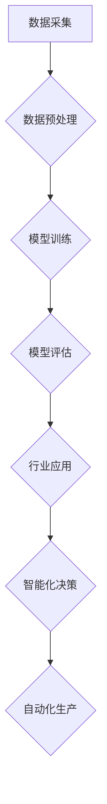

                 

# AI创业新赛道：大模型驱动的行业智能化变革

> **关键词：** AI创业、大模型、行业智能化、算法原理、数学模型、项目实战

> **摘要：** 本文将探讨AI创业的新赛道——大模型驱动的行业智能化变革。通过对核心概念、算法原理、数学模型的深入分析，结合实际项目实战，旨在为读者提供关于大模型在行业应用中的详细解读，并探讨未来发展趋势与挑战。

## 1. 背景介绍

随着人工智能技术的快速发展，AI创业领域呈现出多样化的趋势。传统的AI创业模式，如机器学习算法优化、深度学习模型训练等，已经逐渐走向成熟。然而，随着计算能力的提升和大数据的普及，大模型（Large Models）逐渐成为新的风口。大模型具有强大的表征能力和泛化能力，能够为各行各业提供智能化解决方案，从而推动行业智能化变革。

大模型的应用领域广泛，涵盖了自然语言处理、计算机视觉、语音识别、推荐系统等多个方面。例如，在自然语言处理领域，GPT-3等大型语言模型已经展现出强大的文本生成和语义理解能力；在计算机视觉领域，ImageNet等大型图像分类模型推动了计算机视觉技术的突破。

## 2. 核心概念与联系

### 2.1 大模型定义

大模型是指具有海量参数和巨大计算需求的神经网络模型。这些模型通常使用深度学习框架训练，通过大量的数据和计算资源，达到较高的性能和泛化能力。

### 2.2 大模型架构

大模型通常采用深度神经网络架构，包括多层感知器、卷积神经网络、循环神经网络等。其中，Transformer架构在近年来取得了显著成果，成为大模型的主流架构。

### 2.3 大模型与行业智能化

大模型在行业智能化中的应用主要体现在以下几个方面：

- **数据驱动：** 大模型能够处理海量数据，从中提取出有用的特征和知识，为行业智能化提供数据支持。
- **智能决策：** 大模型具有强大的表征能力，能够为行业应用提供智能决策支持，如智能客服、智能金融风控等。
- **自动化生产：** 大模型可以帮助企业实现自动化生产，提高生产效率和质量。

### 2.4 Mermaid 流程图



## 3. 核心算法原理 & 具体操作步骤

### 3.1 深度学习基础

深度学习是一种人工智能技术，通过构建多层神经网络模型，对数据进行自动特征提取和分类。深度学习的基础算法包括反向传播（Backpropagation）、卷积神经网络（Convolutional Neural Networks，CNN）、循环神经网络（Recurrent Neural Networks，RNN）等。

### 3.2 Transformer架构

Transformer架构是一种基于自注意力机制（Self-Attention）的深度学习模型，广泛应用于自然语言处理、计算机视觉等领域。Transformer架构的核心操作包括多头自注意力（Multi-Head Self-Attention）和前馈神经网络（Feedforward Neural Network）。

### 3.3 具体操作步骤

- **数据采集：** 收集行业相关的数据，如文本、图像、语音等。
- **数据预处理：** 对数据进行清洗、归一化等处理，以便于模型训练。
- **模型训练：** 使用训练数据对模型进行训练，优化模型参数。
- **模型评估：** 使用测试数据对模型进行评估，确保模型具有较好的泛化能力。
- **行业应用：** 将训练好的模型应用到实际场景，如智能客服、智能金融风控等。

## 4. 数学模型和公式 & 详细讲解 & 举例说明

### 4.1 反向传播算法

反向传播算法是一种用于训练神经网络的优化算法。其核心思想是通过计算损失函数关于模型参数的梯度，更新模型参数，以降低损失函数的值。

公式：$$ \nabla_{\theta} L(\theta) = -\frac{\partial L(\theta)}{\partial \theta} $$

其中，$L(\theta)$表示损失函数，$\theta$表示模型参数。

举例说明：假设我们有一个简单的线性模型，损失函数为均方误差（MSE），即$$ L(\theta) = \frac{1}{2} \sum_{i=1}^{n} (y_i - \theta x_i)^2 $$，其中，$y_i$为真实值，$\theta x_i$为预测值。我们可以通过计算梯度$$ \nabla_{\theta} L(\theta) = -\sum_{i=1}^{n} (y_i - \theta x_i) x_i $$，更新模型参数$\theta$，以降低损失函数的值。

### 4.2 Transformer架构

Transformer架构的核心是多头自注意力机制（Multi-Head Self-Attention）。其计算过程如下：

$$
\text{Multi-Head Self-Attention}(Q, K, V) = \text{Scale} \- Dot-Product \- Attention(Q, K, V)
$$

其中，$Q$、$K$、$V$分别为查询序列、键序列和值序列，$\text{Scale} \- Dot-Product \- Attention$为自注意力计算过程。

举例说明：假设我们有一个简单的自注意力计算过程，即$$
\text{Self-Attention}(Q, K, V) = \text{softmax}\left(\frac{QK^T}{\sqrt{d_k}}\right)V
$$

其中，$Q$、$K$、$V$分别为查询序列、键序列和值序列，$d_k$为键序列的维度。

## 5. 项目实战：代码实际案例和详细解释说明

### 5.1 开发环境搭建

- 安装Python环境（版本3.6及以上）
- 安装TensorFlow库
- 安装其他依赖库（如NumPy、Pandas等）

### 5.2 源代码详细实现和代码解读

```python
import tensorflow as tf
from tensorflow.keras.layers import Embedding, LSTM, Dense
from tensorflow.keras.models import Sequential

# 搭建序列模型
model = Sequential([
    Embedding(input_dim=10000, output_dim=32),
    LSTM(128),
    Dense(1, activation='sigmoid')
])

# 编译模型
model.compile(optimizer='adam', loss='binary_crossentropy', metrics=['accuracy'])

# 训练模型
model.fit(x_train, y_train, epochs=10, batch_size=32)
```

代码解读：

- **Embedding层：** 用于将词向量转换为稠密向量。
- **LSTM层：** 用于处理序列数据，提取序列特征。
- **Dense层：** 用于输出预测结果。

### 5.3 代码解读与分析

这段代码实现了一个简单的序列分类模型，用于对文本数据进行分类。模型使用Embedding层将文本数据转换为稠密向量，然后通过LSTM层提取序列特征，最后通过Dense层输出分类结果。在训练过程中，模型使用binary\_crossentropy损失函数和adam优化器进行训练。

## 6. 实际应用场景

大模型在行业应用中具有广泛的前景。以下列举了几个典型应用场景：

- **自然语言处理：** 大模型可以用于文本分类、情感分析、机器翻译等任务，为智能客服、智能写作等应用提供技术支持。
- **计算机视觉：** 大模型可以用于图像分类、目标检测、图像生成等任务，为智能安防、智能医疗等应用提供技术支持。
- **语音识别：** 大模型可以用于语音识别、语音合成等任务，为智能语音助手、智能音响等应用提供技术支持。
- **推荐系统：** 大模型可以用于推荐算法的优化，为电商、社交媒体等应用提供个性化推荐服务。

## 7. 工具和资源推荐

### 7.1 学习资源推荐

- **书籍：** 《深度学习》（Goodfellow、Bengio、Courville 著）
- **论文：** 《Attention Is All You Need》（Vaswani et al., 2017）
- **博客：** 托马斯·卡尼格（Thomas Kistler）的深度学习博客

### 7.2 开发工具框架推荐

- **TensorFlow：** 一个广泛使用的深度学习框架，适用于构建和训练大模型。
- **PyTorch：** 一个流行的深度学习框架，具有灵活的动态图计算能力。

### 7.3 相关论文著作推荐

- **《深度学习专论》：** 陈云霁、刘知远 著，介绍了深度学习的基础理论和最新进展。
- **《神经网络与深度学习》：** 欧阳剑 著，详细讲解了神经网络和深度学习的基本概念和算法。

## 8. 总结：未来发展趋势与挑战

随着AI技术的不断进步，大模型在行业应用中的地位日益重要。未来，大模型将在以下几个方面继续发展：

- **计算能力提升：** 随着硬件技术的进步，计算能力将得到进一步提升，使得更大规模的大模型成为可能。
- **算法优化：** 算法优化将提高大模型的训练效率和性能，降低计算成本。
- **多模态融合：** 大模型将能够处理多种类型的数据，实现多模态融合，为行业应用提供更全面的解决方案。

然而，大模型在发展过程中也将面临以下挑战：

- **计算资源需求：** 大模型对计算资源的需求巨大，如何高效利用计算资源成为关键问题。
- **数据安全与隐私：** 大模型在训练和推理过程中涉及大量数据，如何确保数据安全与隐私成为重要课题。
- **伦理与社会责任：** 大模型在行业应用中可能带来一定的伦理和社会责任问题，如何合理应对成为挑战。

## 9. 附录：常见问题与解答

### 9.1 什么是大模型？

大模型是指具有海量参数和巨大计算需求的神经网络模型。这些模型通常使用深度学习框架训练，通过大量的数据和计算资源，达到较高的性能和泛化能力。

### 9.2 大模型如何进行训练？

大模型的训练过程主要包括以下几个步骤：

- 数据采集：收集与行业相关的数据。
- 数据预处理：对数据进行清洗、归一化等处理。
- 模型训练：使用训练数据对模型进行训练，优化模型参数。
- 模型评估：使用测试数据对模型进行评估，确保模型具有较好的泛化能力。
- 行业应用：将训练好的模型应用到实际场景。

## 10. 扩展阅读 & 参考资料

- **《深度学习》：** Goodfellow、Bengio、Courville 著，全面介绍了深度学习的基础理论和最新进展。
- **《神经网络与深度学习》：** 欧阳剑 著，详细讲解了神经网络和深度学习的基本概念和算法。
- **《Attention Is All You Need》：** Vaswani et al., 2017，介绍了Transformer架构的基本原理和应用。
- **TensorFlow 官方文档：** [TensorFlow 官方文档](https://www.tensorflow.org/)，提供了丰富的深度学习资源和教程。
- **PyTorch 官方文档：** [PyTorch 官方文档](https://pytorch.org/)，提供了丰富的深度学习资源和教程。

