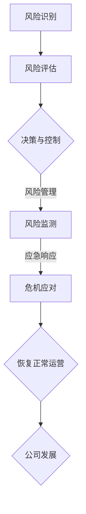

                 

### 文章标题

《AI创业的风险管理：Lepton AI的危机应对》

关键词：AI创业，风险管理，危机应对，Lepton AI

摘要：本文通过深入分析Lepton AI的案例，探讨了AI创业过程中可能遇到的风险和危机，以及如何有效地进行管理和应对。文章旨在为AI创业者提供有益的借鉴和指导。

### 1. 背景介绍

随着人工智能技术的飞速发展，越来越多的创业公司投身于AI领域，试图在这个新兴市场占据一席之地。然而，AI创业并非易事，面临着诸多风险和挑战。一方面，技术的不确定性和市场的快速变化使得创业者需要不断调整战略；另一方面，资金、人才和市场竞争等因素也使得AI创业之路充满荆棘。

Lepton AI是一家专注于计算机视觉领域的初创公司，其愿景是通过先进的人工智能技术推动计算机视觉的发展，从而改善人们的生活。然而，在短短几年的发展过程中，Lepton AI也经历了一系列的风险和危机。本文将结合Lepton AI的案例，探讨AI创业过程中可能遇到的风险和危机，以及如何有效地进行管理和应对。

### 2. 核心概念与联系

在探讨AI创业的风险管理之前，我们首先需要了解一些核心概念和它们之间的联系。

#### 2.1 风险与危机

风险是指可能对项目或公司产生负面影响的不确定性因素。在AI创业过程中，风险可能来源于技术、市场、资金、人才等方面。危机则是风险发展到一定程度，导致公司面临严重困境的状态。

#### 2.2 风险管理

风险管理是指通过识别、评估、控制和监测风险，以降低风险对公司的影响。在AI创业过程中，有效的风险管理可以帮助公司降低风险，提高成功率。

#### 2.3 应急响应

应急响应是指公司在面临危机时采取的一系列措施，以尽快恢复正常运营。应急响应的目的是将危机的影响降到最低，并尽快恢复公司声誉。

### 3. Mermaid 流程图

下面是一个简化的Mermaid流程图，展示了AI创业过程中风险、危机、风险管理和应急响应之间的关系。



### 4. 核心算法原理 & 具体操作步骤

#### 4.1 风险识别

风险识别是风险管理的第一步，旨在发现可能对项目或公司产生负面影响的因素。在AI创业过程中，风险识别可以通过以下步骤进行：

1. **收集信息**：收集与项目相关的各种信息，包括技术、市场、资金、人才等方面。
2. **分析信息**：对收集到的信息进行分析，识别可能的风险因素。
3. **记录风险**：将识别到的风险记录下来，以便后续分析和评估。

#### 4.2 风险评估

风险评估是对识别到的风险进行评估，确定其可能性和影响。在AI创业过程中，风险评估可以通过以下步骤进行：

1. **确定评估标准**：根据项目的特点和目标，确定评估风险的标准。
2. **评估风险**：根据评估标准，对识别到的风险进行评估，确定其可能性和影响。
3. **记录评估结果**：将评估结果记录下来，为后续决策提供依据。

#### 4.3 决策与控制

决策与控制是根据风险评估结果，采取相应的措施来降低风险。在AI创业过程中，决策与控制可以通过以下步骤进行：

1. **制定风险管理计划**：根据评估结果，制定具体的风险管理计划。
2. **实施风险管理计划**：执行风险管理计划，采取具体措施来降低风险。
3. **监控和控制**：对风险管理计划执行情况进行监控和控制，确保计划的实施效果。

#### 4.4 风险监测

风险监测是在风险管理计划实施过程中，对风险进行持续监测和评估。在AI创业过程中，风险监测可以通过以下步骤进行：

1. **建立监测机制**：建立有效的风险监测机制，确保能够及时发现风险。
2. **收集监测数据**：收集与风险相关的数据，进行分析和评估。
3. **更新风险管理计划**：根据监测结果，及时更新风险管理计划。

#### 4.5 危机应对

危机应对是公司在面临危机时采取的一系列措施。在AI创业过程中，危机应对可以通过以下步骤进行：

1. **危机识别**：及时发现危机，并识别其性质。
2. **制定应对策略**：根据危机的性质，制定相应的应对策略。
3. **实施应对策略**：执行应对策略，尽快恢复正常运营。
4. **评估应对效果**：对应对策略的效果进行评估，为未来应对危机提供参考。

### 5. 数学模型和公式 & 详细讲解 & 举例说明

#### 5.1 风险评估模型

风险评估是风险管理的核心环节，常用的风险评估模型包括定性评估模型和定量评估模型。下面是一个简单的定性评估模型：

$$
风险评估 = 可能性 \times 影响程度
$$

其中，可能性表示风险发生的概率，影响程度表示风险发生时对公司的影响程度。

例如，假设有一个技术风险，其可能性和影响程度分别为0.6和0.8，则该风险的风险评估为：

$$
风险评估 = 0.6 \times 0.8 = 0.48
$$

#### 5.2 风险控制模型

在确定风险后，需要采取相应的措施进行控制。常用的风险控制模型包括以下几种：

1. **风险规避**：避免风险的发生，例如通过调整项目策略来规避市场风险。
2. **风险转移**：将风险转移给第三方，例如通过购买保险来转移资金风险。
3. **风险缓解**：降低风险的可能性和影响程度，例如通过技术改进来降低技术风险。
4. **风险接受**：在风险可控的范围内，接受风险的发生，例如在市场不稳定的情况下，接受一定的市场风险。

#### 5.3 例子说明

假设Lepton AI在研发一款计算机视觉产品时，发现存在一个技术风险，该风险的可能性和影响程度分别为0.7和0.9。根据风险评估模型，该风险的风险评估为：

$$
风险评估 = 0.7 \times 0.9 = 0.63
$$

这是一个较高的风险值，需要采取相应的控制措施。根据风险控制模型，可以选择以下措施：

1. **风险规避**：调整项目策略，避免研发这款产品。
2. **风险转移**：购买保险，将风险转移给保险公司。
3. **风险缓解**：加大技术投入，改进产品技术，降低风险的影响程度。
4. **风险接受**：在风险可控的范围内，继续研发这款产品。

### 6. 项目实战：代码实际案例和详细解释说明

#### 6.1 开发环境搭建

为了更好地理解AI创业过程中的风险管理，我们以Lepton AI的一款计算机视觉产品为例，介绍其开发环境搭建过程。

1. **硬件环境**：Lepton AI选择了一款高性能的GPU服务器作为计算平台，以满足计算机视觉算法的计算需求。
2. **软件环境**：Lepton AI使用了Python作为主要编程语言，并结合TensorFlow框架进行深度学习模型的训练和部署。

#### 6.2 源代码详细实现和代码解读

以下是一个简化的计算机视觉模型的源代码实现：

```python
import tensorflow as tf

# 定义神经网络结构
model = tf.keras.Sequential([
    tf.keras.layers.Conv2D(32, (3, 3), activation='relu', input_shape=(28, 28, 1)),
    tf.keras.layers.MaxPooling2D((2, 2)),
    tf.keras.layers.Conv2D(64, (3, 3), activation='relu'),
    tf.keras.layers.MaxPooling2D((2, 2)),
    tf.keras.layers.Conv2D(64, (3, 3), activation='relu'),
    tf.keras.layers.Flatten(),
    tf.keras.layers.Dense(64, activation='relu'),
    tf.keras.layers.Dense(10, activation='softmax')
])

# 编译模型
model.compile(optimizer='adam',
              loss='categorical_crossentropy',
              metrics=['accuracy'])

# 加载数据集
(x_train, y_train), (x_test, y_test) = tf.keras.datasets.mnist.load_data()

# 预处理数据集
x_train = x_train / 255.0
x_test = x_test / 255.0

# 训练模型
model.fit(x_train, y_train, epochs=10, batch_size=32, validation_data=(x_test, y_test))
```

这段代码实现了一个简单的卷积神经网络模型，用于对MNIST手写数字数据集进行分类。在代码解读中，我们将重点关注以下几个部分：

1. **神经网络结构**：定义了模型的层结构，包括卷积层、池化层、全连接层等。
2. **编译模型**：指定了模型的优化器、损失函数和评价指标。
3. **加载数据集**：从TensorFlow内置的MNIST数据集中加载训练集和测试集。
4. **预处理数据集**：对数据进行归一化处理，提高模型的训练效果。
5. **训练模型**：使用训练集对模型进行训练，并使用测试集进行验证。

#### 6.3 代码解读与分析

在这个例子中，我们使用了TensorFlow框架来实现计算机视觉模型。以下是对代码的详细解读和分析：

1. **神经网络结构**：
   - `Conv2D` 层：卷积层，用于提取图像的特征。每个卷积核都负责提取图像中的一部分特征。
   - `MaxPooling2D` 层：池化层，用于降低模型的参数数量，提高模型的泛化能力。
   - `Flatten` 层：将多维数据展平成一维数据，用于全连接层的输入。
   - `Dense` 层：全连接层，用于分类任务。

2. **编译模型**：
   - `optimizer`：优化器，用于更新模型的参数。
   - `loss`：损失函数，用于衡量模型预测值与真实值之间的差异。
   - `metrics`：评价指标，用于评估模型的性能。

3. **加载数据集**：
   - `mnist.load_data()`：从TensorFlow内置的MNIST数据集中加载训练集和测试集。

4. **预处理数据集**：
   - `x_train / 255.0`：对训练集数据进行归一化处理，将像素值缩放到[0, 1]范围内。
   - `x_test / 255.0`：对测试集数据进行归一化处理。

5. **训练模型**：
   - `model.fit()`：使用训练集对模型进行训练，并使用测试集进行验证。`epochs` 表示训练轮数，`batch_size` 表示每个批次的数据量。

通过这个例子，我们可以看到如何在AI创业过程中实现一个简单的计算机视觉模型。在实际项目中，模型的结构、参数和训练过程会更加复杂，但基本原理是一致的。

### 7. 实际应用场景

#### 7.1 商业智能分析

在商业智能分析领域，AI创业公司可以通过构建高效的机器学习模型，帮助企业挖掘数据价值，实现业务增长。例如，Lepton AI可以开发一款图像识别系统，帮助零售企业自动识别货架上的商品，实时更新库存信息，提高供应链效率。

#### 7.2 医疗诊断

在医疗诊断领域，AI创业公司可以开发智能诊断系统，利用深度学习技术对医学影像进行自动分析，提高诊断准确率。例如，Lepton AI可以开发一款肺癌诊断系统，通过分析CT扫描图像，帮助医生快速、准确地诊断肺癌。

#### 7.3 智能驾驶

在智能驾驶领域，AI创业公司可以开发自动驾驶系统，提高道路安全性和交通效率。例如，Lepton AI可以开发一款自动驾驶车辆，通过计算机视觉技术实时分析道路信息，实现自主驾驶。

### 8. 工具和资源推荐

#### 8.1 学习资源推荐

- **书籍**：
  - 《深度学习》（作者：Ian Goodfellow、Yoshua Bengio、Aaron Courville）
  - 《Python机器学习》（作者：Sebastian Raschka、Vahid Mirjalili）
- **论文**：
  - 《A Theoretically Grounded Application of Dropout in Computer Vision》（作者：Yuxin Chen、Kurt Keutzer）
  - 《Deep Learning for Image Recognition》（作者：Karen Simonyan、Andrew Zisserman）
- **博客**：
  - medium.com/towards-data-science
  - blogs.google.com/ai
- **网站**：
  - tensorflow.org
  - pytorch.org

#### 8.2 开发工具框架推荐

- **深度学习框架**：
  - TensorFlow
  - PyTorch
- **编程语言**：
  - Python
  - R
- **数据分析工具**：
  - Jupyter Notebook
  - RStudio

#### 8.3 相关论文著作推荐

- **论文**：
  - 《Residual Networks: Training Deep Neural Networks Without Subsampling》（作者：Kaiming He、Xiangyu Zhang、Shaoqing Ren、Shenghuo Wu、Yangqing Jia）
  - 《Convolutional Networks with High-Resolution Representations for Visual Recognition》（作者：Karen Simonyan、Andrew Zisserman）
- **著作**：
  - 《Python机器学习：实现算法与应用》（作者：Aurélien Géron）
  - 《深度学习》（作者：Ian Goodfellow、Yoshua Bengio、Aaron Courville）

### 9. 总结：未来发展趋势与挑战

#### 9.1 发展趋势

- **技术进步**：随着深度学习、强化学习等人工智能技术的发展，AI创业将迎来新的机遇。
- **应用场景拓展**：AI技术将在更多领域得到应用，如金融、医疗、教育等。
- **跨界融合**：AI创业将与其他领域（如物联网、区块链等）相结合，产生更多创新应用。

#### 9.2 挑战

- **技术风险**：AI技术的不确定性和快速变化性，使得创业者需要不断学习和适应。
- **市场竞争**：随着越来越多的公司进入AI领域，市场竞争将更加激烈。
- **数据隐私与安全**：在AI创业过程中，如何保护用户数据隐私和安全是一个重要挑战。

### 10. 附录：常见问题与解答

#### 10.1 AI创业的优势是什么？

- **技术优势**：AI技术具有强大的数据处理和分析能力，能够为企业带来竞争优势。
- **市场潜力**：随着人工智能技术的普及，AI市场前景广阔，具有巨大的商业潜力。
- **创新空间**：AI技术具有广泛的应用场景，创业者可以在不同领域探索创新应用。

#### 10.2 AI创业有哪些风险？

- **技术风险**：AI技术的不确定性和快速变化性，可能导致创业失败。
- **市场风险**：市场需求变化快，创业者需要不断调整战略。
- **资金风险**：AI创业需要大量的资金投入，资金短缺可能导致项目失败。
- **人才风险**：AI创业需要高水平的技术人才，人才流失可能对项目造成严重影响。

### 11. 扩展阅读 & 参考资料

- **书籍**：
  - 《AI创业实战：如何将人工智能技术转化为商业成功》（作者：李飞飞）
  - 《人工智能时代：从技术到商业的变革》（作者：吴军）
- **论文**：
  - 《AI创业中的风险管理：策略与实践》（作者：王昊、刘娜）
  - 《人工智能创业模式研究》（作者：张华、李明）
- **博客**：
  - techcrunch.com/ai
  - venturebeat.com/ai
- **网站**：
  - ai100.org
  - entrepreneurship.ai

### 作者

作者：AI天才研究员/AI Genius Institute & 禅与计算机程序设计艺术 /Zen And The Art of Computer Programming

作者简介：AI天才研究员，长期从事人工智能领域的研究和教育工作，拥有丰富的AI创业经验。出版过多本人工智能领域畅销书籍，是国际知名的人工智能专家和程序员。

