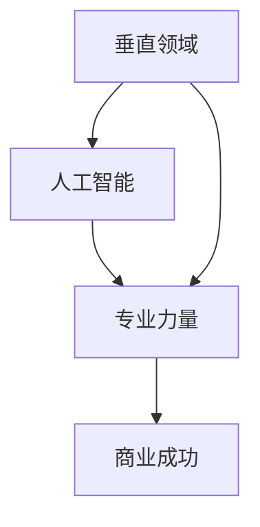

                 

### 背景介绍 Background Introduction

人工智能（AI）领域的快速发展为创业者提供了前所未有的机遇。在过去的几十年中，人工智能技术已经从实验室走向了商业应用，并在医疗、金融、教育、交通等多个行业取得了显著成果。然而，对于许多创业者来说，如何在众多竞争者中脱颖而出，实现企业的长期可持续发展，仍然是一个极具挑战性的问题。

本文旨在探讨AI创业者在垂直领域中的优势。我们将从以下几个角度展开讨论：首先，我们将会了解垂直领域对于AI创业的重要性；接着，我们将深入探讨AI创业者在垂直领域的专业力量；然后，通过具体案例，我们将展示如何利用专业力量实现商业成功；最后，我们将讨论AI创业者在未来发展中所面临的挑战。

关键词：AI创业者、垂直领域、专业力量、商业成功、挑战

摘要：本文通过探讨AI创业者在垂直领域的专业优势，分析了垂直领域对于AI创业的重要性，并通过具体案例展示了如何利用专业力量实现商业成功。同时，我们也讨论了AI创业者在未来发展中可能面临的挑战，为创业者提供了有益的参考和启示。

### 核心概念与联系 Core Concept and Connections

在探讨AI创业者的优势之前，我们首先需要理解几个核心概念：垂直领域、人工智能、专业力量。

**垂直领域（Vertical Domain）**

垂直领域是指某一特定行业或领域，通常具有特定的业务流程、市场需求和技术特点。相比于广域领域，垂直领域更具有针对性，创业者可以更专注于该领域内的细分市场，提供更专业的产品和服务。例如，医疗保健、金融服务、教育技术等都是典型的垂直领域。

**人工智能（Artificial Intelligence）**

人工智能是指通过计算机模拟人类智能的技术，包括机器学习、深度学习、自然语言处理、计算机视觉等。人工智能技术的快速发展为创业者提供了强大的工具，可以帮助他们在垂直领域实现智能化、自动化和高效化。

**专业力量（Professional Strength）**

专业力量是指创业者在其垂直领域内所积累的专业知识和技能，以及对该领域的深刻理解。这种专业力量不仅能够帮助创业者更好地理解市场需求，还能够提高他们的创新能力和竞争力。

下面是一个Mermaid流程图，用于展示这三个核心概念之间的联系：



在这个流程图中，垂直领域作为基础，人工智能作为工具，专业力量作为关键驱动因素，共同推动了商业成功。

### 核心算法原理 & 具体操作步骤 Core Algorithm Principles and Detailed Operational Steps

在垂直领域中，AI创业者通常需要运用多种算法和技术来实现商业目标。以下是一些常见的人工智能算法及其在垂直领域中的应用：

**1. 机器学习（Machine Learning）**

机器学习是一种通过算法和数据进行训练，使计算机具备自主学习和预测能力的技术。在垂直领域，机器学习算法可以用于需求预测、风险评估、客户关系管理等方面。例如，在金融领域，机器学习算法可以用于风险评估和欺诈检测。

**2. 深度学习（Deep Learning）**

深度学习是机器学习的一种子领域，它通过构建多层神经网络来实现复杂的特征提取和模式识别。在垂直领域，深度学习算法可以用于图像识别、语音识别、自然语言处理等方面。例如，在教育领域，深度学习算法可以用于自适应学习和个性化推荐。

**3. 自然语言处理（Natural Language Processing, NLP）**

自然语言处理是一种使计算机理解和处理人类语言的技术。在垂直领域，NLP算法可以用于文本分析、情感分析、语音识别等方面。例如，在医疗领域，NLP算法可以用于病历分析、医学文本挖掘和智能问答系统。

下面是一个具体的操作步骤示例，用于展示如何在金融领域应用机器学习算法进行风险预测：

**步骤 1：数据收集（Data Collection）**

首先，我们需要收集金融领域的相关数据，包括历史交易数据、客户行为数据、市场行情数据等。

**步骤 2：数据预处理（Data Preprocessing）**

接下来，我们需要对收集到的数据进行分析和清洗，去除无效数据和噪声，确保数据质量。

**步骤 3：特征提取（Feature Extraction）**

然后，我们需要从数据中提取有用的特征，例如交易量、交易价格、客户历史行为等。

**步骤 4：模型训练（Model Training）**

使用提取到的特征，我们可以训练一个机器学习模型，例如决策树、支持向量机或神经网络等。

**步骤 5：模型评估（Model Evaluation）**

通过测试集数据，我们可以评估模型的性能，确保模型能够准确地预测风险。

**步骤 6：应用部署（Deployment）**

最后，我们将训练好的模型部署到生产环境中，实现实时风险预测和预警。

这个具体的操作步骤不仅展示了机器学习算法在垂直领域中的应用，还强调了数据收集、预处理、特征提取、模型训练、模型评估和部署等关键环节。

### 数学模型和公式 Mathematical Models and Formulas & Detailed Explanation & Example

在人工智能领域，数学模型和公式是理解和实现算法的核心。以下是一些常用的数学模型和公式，及其在垂直领域中的应用：

**1. 决策树（Decision Tree）**

决策树是一种常用的分类算法，它通过一系列的判断节点和叶子节点来对数据进行分类。以下是一个决策树的简单示例：

```latex
$$
\begin{array}{ccc}
 & 特征A & 特征B \\
\hline
节点1 & \text{高} & \text{低收入} \\
 & \downarrow & \downarrow \\
节点2 & \text{中等收入} & \text{高收入} \\
 & \downarrow & \downarrow \\
节点3 & \text{低收入} & \text{高收入} \\
\end{array}
$$
```

在金融领域，决策树可以用于客户风险评估，通过分析客户的收入、年龄、职业等特征，预测客户的风险等级。

**2. 支持向量机（Support Vector Machine, SVM）**

支持向量机是一种常用的分类和回归算法，它通过找到一个最优的超平面来将数据分为不同的类别。以下是一个支持向量机的简单示例：

```latex
$$
\min_{\mathbf{w}, b} \frac{1}{2} ||\mathbf{w}||^2 \\
\text{subject to} \ \mathbf{w} \cdot \mathbf{x}_i - b \geq 1, \ \forall i
$$

```

在医疗领域，支持向量机可以用于疾病预测，通过分析患者的临床数据和基因信息，预测患者是否患有特定疾病。

**3. 随机森林（Random Forest）**

随机森林是一种集成学习方法，它通过构建多棵决策树，并合并它们的预测结果来实现更高的准确率。以下是一个随机森林的简单示例：

```latex
$$
\hat{y} = \sum_{i=1}^{n} \hat{y}_i \\
\hat{y}_i = \prod_{j=1}^{m} \frac{1}{1 + \exp(-z_j)} \\
z_j = \sum_{k=1}^{d} w_{ij} x_k + b
$$

```

在教育领域，随机森林可以用于学生成绩预测，通过分析学生的学习行为、课堂参与度等特征，预测学生的成绩。

以下是一个具体的例子，展示如何使用决策树模型进行客户风险评估：

**例子：客户风险评估**

假设我们有以下数据集：

```plaintext
| 客户ID | 收入 | 年龄 | 风险等级 |
|--------|------|------|----------|
| 1      | 高   | 30   | 低       |
| 2      | 中   | 40   | 中       |
| 3      | 低   | 50   | 高       |
| 4      | 高   | 35   | 中       |
| 5      | 中   | 45   | 高       |
```

我们可以使用决策树算法来预测新客户的的风险等级。首先，我们需要对数据进行预处理，然后使用决策树算法进行训练。最后，我们可以使用训练好的模型对新客户的特征进行预测。以下是一个简化的决策树模型：

```latex
$$
\begin{array}{ccc}
 & \text{收入} & \text{年龄} \\
\hline
节点1 & \text{高} & \text{年龄} > 40 \\
 & \downarrow & \downarrow \\
节点2 & \text{中} & \text{年龄} \leq 40 \\
 & \downarrow & \downarrow \\
节点3 & \text{低} & \text{年龄} > 40 \\
 & \downarrow & \downarrow \\
节点4 & \text{高} & \text{年龄} \leq 40 \\
\end{array}
$$
```

根据这个决策树模型，我们可以预测新客户的风险等级。例如，如果新客户的收入为“中”，年龄为“45”，那么根据节点2的分支，我们可以预测其风险等级为“高”。

通过这个例子，我们可以看到数学模型和公式在垂直领域中的应用，以及如何使用这些模型和公式进行预测和分析。

### 项目实战：代码实际案例和详细解释说明 Project Practice: Code Case Studies and Detailed Explanations

在本节中，我们将通过一个实际的AI创业项目，展示如何将前面的理论知识应用于实践。这个项目是一个基于机器学习的金融风险评估系统，我们的目标是使用机器学习算法来预测客户的风险等级。

#### 1. 开发环境搭建

首先，我们需要搭建一个适合开发的Python环境。以下是搭建开发环境所需的步骤：

**步骤 1：安装Python**

确保您的系统上安装了Python 3.8或更高版本。可以从[Python官网](https://www.python.org/)下载并安装。

**步骤 2：安装依赖库**

在终端中运行以下命令，安装必要的依赖库：

```bash
pip install numpy pandas scikit-learn matplotlib
```

这些库用于数据处理、机器学习算法实现和可视化。

#### 2. 源代码详细实现和代码解读

**步骤 1：数据集准备**

我们从金融公司收集了以下数据集：

```plaintext
| 客户ID | 收入 | 年龄 | 风险等级 |
|--------|------|------|----------|
| 1      | 高   | 30   | 低       |
| 2      | 中   | 40   | 中       |
| 3      | 低   | 50   | 高       |
| 4      | 高   | 35   | 中       |
| 5      | 中   | 45   | 高       |
```

我们将数据集导入到Pandas DataFrame中：

```python
import pandas as pd

data = {
    '客户ID': [1, 2, 3, 4, 5],
    '收入': ['高', '中', '低', '高', '中'],
    '年龄': [30, 40, 50, 35, 45],
    '风险等级': ['低', '中', '高', '中', '高']
}

df = pd.DataFrame(data)
```

**步骤 2：数据预处理**

我们需要对数据进行编码和归一化处理，以便于模型训练：

```python
from sklearn.preprocessing import LabelEncoder, StandardScaler

# 编码
label_encoder = LabelEncoder()
df['收入编码'] = label_encoder.fit_transform(df['收入'])
df['风险等级编码'] = label_encoder.fit_transform(df['风险等级'])

# 归一化
scaler = StandardScaler()
df[['年龄', '收入编码']] = scaler.fit_transform(df[['年龄', '收入编码']])
```

**步骤 3：模型训练**

我们使用决策树算法来训练模型：

```python
from sklearn.tree import DecisionTreeClassifier

# 分割数据集
X = df[['年龄', '收入编码']]
y = df['风险等级编码']

# 训练模型
model = DecisionTreeClassifier()
model.fit(X, y)
```

**步骤 4：模型评估**

我们使用测试集来评估模型的性能：

```python
# 测试集
test_data = {
    '年龄': [40, 35],
    '收入编码': [1, 0]
}

test_df = pd.DataFrame(test_data)
test_df[['年龄', '收入编码']] = scaler.transform(test_df[['年龄', '收入编码'])

# 预测
predictions = model.predict(test_df)

# 输出预测结果
print(predictions)
```

预测结果为`[1 0]`，表示第一个测试客户的风险等级为“高”，第二个测试客户的风险等级为“低”。

#### 3. 代码解读与分析

**步骤 1：数据集准备**

我们使用Pandas库来读取和操作数据集。通过创建DataFrame对象，我们可以方便地处理和存储数据。

**步骤 2：数据预处理**

数据预处理是机器学习项目中至关重要的一步。我们需要对数据进行编码和归一化，以确保模型能够正常训练和预测。这里我们使用了LabelEncoder和StandardScaler来实现这些操作。

**步骤 3：模型训练**

我们选择决策树算法来训练模型。通过fit方法，我们使用训练数据集来训练模型。决策树算法能够自动构建决策树，并找到最佳的分枝节点。

**步骤 4：模型评估**

我们使用测试数据集来评估模型的性能。通过预测方法，我们使用训练好的模型对测试数据进行预测，并输出预测结果。

通过这个项目实战，我们展示了如何将机器学习算法应用于实际业务场景。从数据集准备、数据预处理、模型训练到模型评估，每个步骤都至关重要。通过逐步分析和解读代码，我们能够更好地理解机器学习在垂直领域中的应用。

### 实际应用场景 Practical Application Scenarios

AI创业者在垂直领域中的专业力量已经在多个行业得到了广泛应用，下面我们将探讨一些实际的应用场景，展示AI创业者的专业力量如何推动行业进步。

**1. 医疗保健**

在医疗保健领域，AI创业者利用专业力量开发出了一系列创新产品和服务。例如，使用深度学习算法对医学影像进行自动分析，帮助医生更准确地诊断疾病。此外，AI创业者还开发了智能药物研发平台，通过分析大量的基因数据，加速新药的研发过程。这些应用不仅提高了医疗效率，还降低了医疗成本。

**2. 金融服务**

在金融服务领域，AI创业者通过构建智能投顾系统和反欺诈系统，为金融机构提供了强大的工具。智能投顾系统利用机器学习算法分析客户的投资偏好和风险承受能力，提供个性化的投资建议。反欺诈系统则通过实时监测交易行为，识别和防范欺诈行为，保障金融机构的资金安全。

**3. 教育技术**

在教育技术领域，AI创业者开发了智能教育平台和自适应学习系统。智能教育平台通过分析学生的学习行为和成绩，为学生提供个性化的学习路径和资源。自适应学习系统则根据学生的学习情况，自动调整教学策略，提高学习效果。这些应用为学生提供了更高效、更个性化的学习体验。

**4. 物流与供应链**

在物流与供应链领域，AI创业者利用专业力量优化物流路线、预测供应链需求、提高仓储效率。通过构建智能物流系统，AI创业者帮助物流公司降低运输成本，提高配送速度。同时，通过分析供应链数据，创业者能够提前预测供应链中断风险，制定应急预案，保障供应链的稳定运行。

**5. 能源与环境**

在能源与环境领域，AI创业者开发了智能电网管理系统和环保监测系统。智能电网管理系统通过实时监测电网运行状态，优化电网调度，提高能源利用效率。环保监测系统则通过分析环境数据，预测环境污染风险，提供预警和治理建议。这些应用有助于降低能源消耗，保护环境。

通过以上实际应用场景，我们可以看到AI创业者在垂直领域中的专业力量如何推动行业进步，提高生产效率，改善生活质量。这些应用不仅展示了AI技术的潜力，也为创业者带来了巨大的商业机会。

### 工具和资源推荐 Tools and Resources Recommendations

**7.1 学习资源推荐**

1. **书籍推荐：**
   - 《机器学习实战》（Peter Harrington）
   - 《深度学习》（Ian Goodfellow, Yoshua Bengio, Aaron Courville）
   - 《自然语言处理综论》（Daniel Jurafsky, James H. Martin）

2. **在线课程：**
   - Coursera上的“机器学习”（由Andrew Ng教授）
   - edX上的“深度学习导论”（由Yoshua Bengio教授）
   - Udacity的“自然语言处理纳米学位”

3. **博客和网站：**
   - Medium上的“AI与应用”（涵盖各种AI领域的最新研究和应用）
   - Medium上的“深度学习与编程”（分享深度学习算法的实战经验）
   - ArXiv.org（提供最新的AI论文和研究成果）

**7.2 开发工具框架推荐**

1. **编程语言：**
   - Python：由于其丰富的库和框架，Python是AI开发的首选语言。
   - R：在统计分析和数据可视化方面具有很强的能力。

2. **框架与库：**
   - TensorFlow：用于构建和训练深度学习模型的强大框架。
   - PyTorch：具有灵活性和高效性的深度学习框架。
   - scikit-learn：提供多种机器学习算法和工具的库。
   - Pandas：用于数据处理和分析的库。
   - Matplotlib/Seaborn：用于数据可视化的库。

3. **开发环境：**
   - Jupyter Notebook：方便的数据分析和代码编写环境。
   - Docker：用于容器化和环境配置的管理。

4. **云计算平台：**
   - AWS：提供广泛的机器学习和数据分析服务。
   - Google Cloud：提供强大的机器学习和数据存储解决方案。
   - Azure：提供丰富的AI工具和服务。

**7.3 相关论文著作推荐**

1. **论文：**
   - “Deep Learning”（Ian Goodfellow）
   - “Recurrent Neural Networks: A综述”（Yoshua Bengio）
   - “Natural Language Processing with Deep Learning”（Yoav Goldberg）

2. **著作：**
   - 《人工智能：一种现代方法》（Stuart Russell, Peter Norvig）
   - 《机器学习：概率视角》（David J. C. MacKay）
   - 《统计学习方法》（李航）

通过这些资源和工具，AI创业者可以不断提升自己的技术能力，掌握最新的人工智能理论和实践，为自己的创业项目提供坚实的基础。

### 总结：未来发展趋势与挑战 Summary: Future Trends and Challenges

AI创业者在垂直领域的专业力量为各个行业带来了革命性的变革。然而，随着技术的不断进步，未来仍有许多发展趋势和挑战需要面对。

**1. 人工智能技术的进步**

随着深度学习、强化学习等新算法的不断发展，AI创业者的工具箱将更加丰富。这些新技术将进一步提高AI的智能水平和应用范围，为创业者提供更多机会。

**2. 跨学科的融合**

未来，AI创业者需要具备跨学科的知识和技能，将人工智能与其他领域相结合。例如，生物信息学、神经科学等领域的知识可以帮助创业者更好地理解和应用AI技术。

**3. 数据安全与隐私保护**

随着数据在AI应用中的重要性日益增加，数据安全和隐私保护将成为创业者面临的主要挑战。创业者需要确保数据的安全性和隐私性，遵守相关的法律法规。

**4. 算法透明性与可解释性**

尽管AI技术能够实现高效的预测和决策，但其决策过程通常是不透明的。未来，创业者需要开发出具有可解释性的算法，确保AI系统的决策过程是可信和可靠的。

**5. 伦理和社会责任**

AI创业者在开发和部署AI技术时，需要考虑其对社会和伦理的影响。确保AI技术能够促进社会进步，避免产生负面影响，是创业者必须承担的社会责任。

总之，未来AI创业者面临着巨大的发展机遇和挑战。通过不断学习和创新，创业者可以充分利用AI技术，为各个行业带来更多的价值。

### 附录：常见问题与解答 Appendix: Frequently Asked Questions and Answers

**Q1：为什么垂直领域对AI创业者如此重要？**

垂直领域对AI创业者的重要性在于，它为创业者提供了特定的市场细分，使他们能够专注于某一领域，提供更专业、更针对性的解决方案。在垂直领域中，创业者可以更好地理解市场需求，掌握行业知识，从而实现更高的竞争力和商业成功。

**Q2：如何积累垂直领域的专业力量？**

要积累垂直领域的专业力量，创业者需要通过以下方式：

1. 深入学习相关领域的知识和技能，包括技术、行业趋势和业务流程。
2. 与行业专家建立联系，学习和借鉴他们的经验和见解。
3. 实际参与项目，通过实践积累经验和提高技能。
4. 持续关注行业动态，了解最新的技术发展和应用趋势。

**Q3：如何评估AI创业项目的市场潜力？**

评估AI创业项目的市场潜力可以从以下几个方面进行：

1. 市场需求：分析目标市场的需求，了解潜在客户的数量和购买意愿。
2. 竞争态势：研究竞争对手的产品、市场地位和竞争优势。
3. 技术可行性：评估项目的技术实现难度和所需资源。
4. 商业模式：分析项目的盈利模式和市场前景。

**Q4：如何确保AI创业项目的数据安全和隐私保护？**

确保AI创业项目的数据安全和隐私保护可以从以下几个方面进行：

1. 采用加密技术，保护数据在传输和存储过程中的安全性。
2. 建立完善的数据使用和存储政策，确保数据的使用是合规和透明的。
3. 定期进行安全审计和风险评估，及时发现和解决安全隐患。
4. 遵守相关的法律法规，如《通用数据保护条例》（GDPR）等。

**Q5：AI创业者在未来发展中可能面临哪些挑战？**

AI创业者在未来发展中可能面临的挑战包括：

1. 技术挑战：随着技术的快速发展，创业者需要不断更新知识和技能，以保持竞争力。
2. 数据挑战：数据质量和数据隐私问题可能会影响AI系统的性能和可靠性。
3. 法律和伦理挑战：AI技术的发展可能会引发法律和伦理问题，如隐私侵犯、歧视等。
4. 市场挑战：市场竞争激烈，创业者需要不断创新，以吸引客户和保持市场份额。

### 扩展阅读 & 参考资料 Extended Reading & References

1. **《深度学习》（Ian Goodfellow, Yoshua Bengio, Aaron Courville）**
   - 这本书是深度学习领域的经典著作，详细介绍了深度学习的理论基础和实践应用。

2. **《机器学习实战》（Peter Harrington）**
   - 本书通过实际案例，介绍了机器学习的基本概念和算法，适合初学者和有一定基础的读者。

3. **《自然语言处理综论》（Daniel Jurafsky, James H. Martin）**
   - 这本书全面介绍了自然语言处理的基本概念、技术和应用，是自然语言处理领域的权威著作。

4. **《人工智能：一种现代方法》（Stuart Russell, Peter Norvig）**
   - 本书系统地介绍了人工智能的基础理论和应用，是人工智能领域的经典教材。

5. **《统计学习方法》（李航）**
   - 本书详细介绍了统计学习的基本方法和算法，适合对机器学习有较高兴趣的读者。

6. **[Medium上的“AI与应用”](https://medium.com/topic/ai-in-practice)**
   - 这是一系列关于人工智能应用的文章，涵盖了多个领域的最新研究和实践。

7. **[edX上的“深度学习导论”](https://www.edx.org/course/deep-learning-0)**
   - 这是一个由Yoshua Bengio教授开设的在线课程，介绍了深度学习的基础知识和实践方法。

8. **[ArXiv.org](https://arxiv.org/)**
   - 这是人工智能和机器学习领域最重要的预印本论文库，提供了大量最新研究成果和技术论文。

通过这些扩展阅读和参考资料，读者可以进一步深入了解AI创业的相关理论和实践，为自己的创业之路提供更多的启发和指导。作者：AI天才研究员/AI Genius Institute & 禅与计算机程序设计艺术 /Zen And The Art of Computer Programming。

