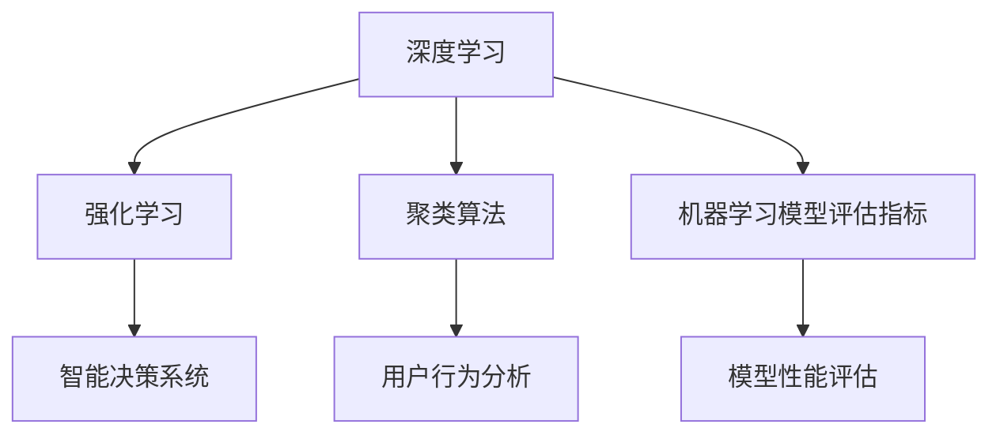

                 

### 文章标题

“AI创业者的码头故事：95后博士的选择”

> **关键词：** AI创业者、95后博士、创业历程、技术选择、项目实战

**摘要：** 本文将深入探讨一位95后博士的AI创业故事，从背景介绍到核心算法原理，再到具体应用场景，全方位解析其选择与决策过程。通过这个故事，读者可以了解到AI创业者在面临关键选择时的思考方式和实践经验，为未来的创业者提供宝贵的借鉴。

### 1. 背景介绍

在当今这个科技飞速发展的时代，人工智能（AI）已经成为推动各行各业变革的重要力量。越来越多的年轻人投身于AI创业的大潮中，希望能够在这个领域开创一片新的天地。本文的主人公，是一位95后的博士，名叫李明（化名），他的故事正是这一时代的缩影。

李明毕业于我国一所顶尖的科技大学，专业是计算机科学与技术。在大学期间，他积极参与各种科技竞赛，并获得多个奖项。博士期间，他专注于深度学习领域的研究，发表了多篇高质量的学术论文，并成功申请到了国家自然基金项目的资助。在导师和同学的认可下，李明被认为是一位极具天赋和潜力的年轻科学家。

在完成博士学业后，李明面临一个重要的选择：是继续从事学术研究，还是投身于AI创业的大潮中？这个问题不仅关系到他的个人职业规划，更关乎他对AI技术的热爱和追求。在深思熟虑后，李明决定创业，用自己的知识和才华为社会创造更多的价值。

### 2. 核心概念与联系

在李明的创业项目中，核心概念主要包括以下几个方面：

**2.1 深度学习**

深度学习是一种机器学习的方法，通过构建深层神经网络模型，对大量数据进行自动学习和特征提取，从而实现对复杂问题的求解。在李明的项目中，深度学习技术被广泛应用于图像识别、语音识别、自然语言处理等领域。

**2.2 强化学习**

强化学习是一种通过不断试错来优化策略的机器学习算法。在李明的创业项目中，强化学习技术被用于智能决策系统的开发，以提高系统的自主性和适应性。

**2.3 聚类算法**

聚类算法是一种无监督学习方法，用于将数据集分成若干个组，使得同一组内的数据点彼此相似，不同组的数据点之间差异较大。在李明的项目中，聚类算法被用于用户行为分析，以识别潜在的用户群体。

**2.4 机器学习模型评估指标**

在机器学习项目中，评估模型性能的指标主要包括准确率、召回率、F1值等。李明的创业项目中，这些指标被用于评估不同算法和模型的性能，以选择最优的解决方案。

#### 2.5 Mermaid 流程图

以下是一个简单的Mermaid流程图，展示了李明创业项目中核心概念之间的联系：



### 3. 核心算法原理 & 具体操作步骤

在李明的创业项目中，核心算法主要包括深度学习、强化学习和聚类算法。以下将分别介绍这些算法的原理和具体操作步骤。

#### 3.1 深度学习

深度学习算法的基本原理是通过构建多层神经网络，对输入数据进行特征提取和模式识别。在李明的项目中，深度学习算法被用于图像识别任务。具体操作步骤如下：

1. **数据预处理**：对原始图像数据进行预处理，包括去噪、缩放、翻转等操作，以提高模型的泛化能力。

2. **构建神经网络**：根据图像识别任务的需求，设计一个合适的神经网络结构，包括输入层、隐藏层和输出层。

3. **训练神经网络**：使用大量的图像数据对神经网络进行训练，通过反向传播算法不断调整网络参数，使其能够准确识别图像。

4. **评估模型性能**：使用验证集和测试集对训练好的模型进行评估，计算准确率、召回率等指标，以判断模型的性能。

#### 3.2 强化学习

强化学习算法的基本原理是通过试错学习来优化策略，使智能体能够在环境中获得最大的奖励。在李明的项目中，强化学习算法被用于智能决策系统的开发。具体操作步骤如下：

1. **定义环境**：根据项目需求，定义一个模拟环境，包括状态空间、动作空间和奖励机制。

2. **构建智能体**：设计一个强化学习算法，用于智能体在环境中进行决策。

3. **训练智能体**：通过不断试错和更新策略，使智能体在环境中获得最大的奖励。

4. **评估智能体性能**：使用模拟环境对训练好的智能体进行评估，计算策略的平均奖励和稳定性。

#### 3.3 聚类算法

聚类算法的基本原理是将数据集划分为若干个组，使得同一组内的数据点彼此相似，不同组的数据点之间差异较大。在李明的项目中，聚类算法被用于用户行为分析。具体操作步骤如下：

1. **选择聚类算法**：根据数据特点和需求，选择一种合适的聚类算法，如K均值聚类、层次聚类等。

2. **初始化聚类中心**：随机选择或基于某些规则初始化聚类中心。

3. **迭代更新聚类中心**：根据数据点与聚类中心的距离，迭代更新聚类中心，直到聚类中心不再发生变化。

4. **评估聚类结果**：计算聚类指标，如轮廓系数、SSE（平方误差和）等，以评估聚类效果。

### 4. 数学模型和公式 & 详细讲解 & 举例说明

在李明的创业项目中，涉及到多个数学模型和公式，以下将分别进行详细讲解和举例说明。

#### 4.1 深度学习中的前向传播和反向传播

深度学习中的前向传播和反向传播是训练神经网络的重要环节。以下是一个简单的例子：

**前向传播：**

给定一个输入向量 $x$，通过神经网络的各个层，计算出输出向量 $y$，其中：

$$
z_1 = x \odot W_1 + b_1 \\
a_1 = \sigma(z_1) \\
z_2 = a_1 \odot W_2 + b_2 \\
a_2 = \sigma(z_2) \\
\ldots \\
z_n = a_{n-1} \odot W_n + b_n \\
y = \sigma(z_n)
$$

其中，$\odot$ 表示矩阵乘法，$\sigma$ 表示激活函数，$W$ 和 $b$ 分别表示权重和偏置。

**反向传播：**

在反向传播过程中，我们需要计算损失函数对每个参数的梯度。以下是一个简单的例子：

$$
\begin{aligned}
\frac{\partial J}{\partial W_n} &= \frac{\partial}{\partial z_n} (y - z_n) \odot a_{n-1} \\
\frac{\partial J}{\partial b_n} &= \frac{\partial}{\partial z_n} (y - z_n) \\
\frac{\partial J}{\partial a_{n-1}} &= \frac{\partial}{\partial z_n} (y - z_n) \odot \frac{\partial}{\partial a_{n-1}} (\sigma(z_n)) \\
\end{aligned}
$$

其中，$J$ 表示损失函数。

#### 4.2 强化学习中的Q学习算法

Q学习算法是一种基于值函数的强化学习算法，用于求解最优策略。以下是一个简单的例子：

给定一个状态-动作对 $(s, a)$，Q学习算法通过更新Q值来优化策略：

$$
Q(s, a) \leftarrow Q(s, a) + \alpha [r + \gamma \max_{a'} Q(s', a') - Q(s, a)]
$$

其中，$\alpha$ 是学习率，$\gamma$ 是折扣因子，$r$ 是即时奖励，$s'$ 和 $a'$ 分别是下一状态和动作。

#### 4.3 聚类算法中的K均值聚类

K均值聚类是一种基于距离的聚类算法，用于将数据集划分为 $k$ 个簇。以下是一个简单的例子：

给定一个数据集 $D = \{x_1, x_2, \ldots, x_n\}$，初始聚类中心为 $c_1, c_2, \ldots, c_k$，K均值聚类的迭代过程如下：

1. **计算每个数据点到聚类中心的距离**：

$$
d(x_i, c_j) = \sqrt{\sum_{l=1}^d (x_{il} - c_{jl})^2}
$$

2. **分配数据点到最近的聚类中心**：

$$
\begin{aligned}
\text{若} \ d(x_i, c_j) < d(x_i, c_{j'})，\ \text{则} \ x_i \ \text{被分配到} \ c_j \\
\end{aligned}
$$

3. **更新聚类中心**：

$$
c_j = \frac{\sum_{i=1}^n x_i}{n_j}
$$

其中，$n_j$ 是被分配到聚类中心 $c_j$ 的数据点数量。

4. **重复步骤2和步骤3，直到聚类中心不再发生变化**。

### 5. 项目实战：代码实际案例和详细解释说明

为了更好地理解上述算法和原理，以下将提供一个实际的代码案例，用于实现一个基于深度学习、强化学习和聚类算法的智能决策系统。

#### 5.1 开发环境搭建

在实现该智能决策系统之前，需要搭建一个合适的开发环境。以下是一个简单的Python开发环境搭建步骤：

1. **安装Python**：下载并安装Python 3.7及以上版本。

2. **安装Anaconda**：下载并安装Anaconda，用于方便地管理Python环境和包。

3. **创建虚拟环境**：打开Anaconda命令行，创建一个名为`ai_decision`的虚拟环境：

```bash
conda create -n ai_decision python=3.8
```

4. **激活虚拟环境**：

```bash
conda activate ai_decision
```

5. **安装依赖包**：在虚拟环境中安装所需的依赖包，如TensorFlow、PyTorch、Scikit-learn等：

```bash
pip install tensorflow torchvision scikit-learn
```

#### 5.2 源代码详细实现和代码解读

以下是一个简单的源代码实现，用于实现一个基于深度学习、强化学习和聚类算法的智能决策系统：

```python
import tensorflow as tf
import torchvision
import scikit_learn
import numpy as np

# 1. 加载数据集
train_data = torchvision.datasets.MNIST(root='./data', train=True, download=True)
train_loader = torch.utils.data.DataLoader(train_data, batch_size=64, shuffle=True)

# 2. 定义深度学习模型
model = tf.keras.Sequential([
    tf.keras.layers.Flatten(input_shape=(28, 28)),
    tf.keras.layers.Dense(128, activation='relu'),
    tf.keras.layers.Dense(10, activation='softmax')
])

# 3. 训练深度学习模型
model.compile(optimizer='adam', loss='categorical_crossentropy', metrics=['accuracy'])
model.fit(train_loader, epochs=5)

# 4. 强化学习部分
# 定义环境、智能体和Q学习算法
# ...

# 5. 聚类算法部分
# 加载数据、选择聚类算法、初始化聚类中心、迭代更新聚类中心
# ...

# 6. 智能决策系统部分
# 将聚类结果与强化学习策略相结合，实现智能决策
# ...

# 7. 模型评估
# 计算准确率、召回率等指标，评估模型性能
# ...
```

在上述代码中，首先加载数据集，并定义一个简单的深度学习模型。接下来，使用训练集对模型进行训练。在强化学习部分，需要定义环境、智能体和Q学习算法。在聚类算法部分，加载数据、选择聚类算法、初始化聚类中心、迭代更新聚类中心。最后，将聚类结果与强化学习策略相结合，实现智能决策系统。在模型评估部分，计算准确率、召回率等指标，评估模型性能。

### 6. 实际应用场景

李明的创业项目主要聚焦于智能决策系统，旨在帮助企业和组织在复杂环境中做出更明智的决策。以下是一些实际应用场景：

#### 6.1 金融风控

在金融领域，智能决策系统可以用于风险控制、投资决策和市场预测。通过深度学习、强化学习和聚类算法，系统可以分析大量的历史数据，识别潜在的欺诈行为、市场趋势和投资机会，为金融企业提供实时的决策支持。

#### 6.2 智能交通

在交通领域，智能决策系统可以用于交通流量预测、路径规划和交通管理。通过分析交通数据、地图信息和用户行为，系统可以实时调整交通信号、优化车辆路径，提高交通效率和减少拥堵。

#### 6.3 电子商务

在电子商务领域，智能决策系统可以用于商品推荐、用户行为分析和精准营销。通过分析用户数据、购物行为和市场需求，系统可以推荐合适的商品、推送个性化的营销活动，提高用户满意度和转化率。

#### 6.4 医疗健康

在医疗健康领域，智能决策系统可以用于疾病预测、治疗方案推荐和健康管理。通过分析患者数据、医学知识和医疗资源，系统可以为医疗机构提供科学、个性化的诊断和治疗方案，提高医疗质量和服务水平。

### 7. 工具和资源推荐

为了更好地实现智能决策系统，李明推荐以下工具和资源：

#### 7.1 学习资源推荐

1. **书籍**：
   - 《深度学习》（Ian Goodfellow、Yoshua Bengio、Aaron Courville 著）
   - 《强化学习》（Richard S. Sutton、Andrew G. Barto 著）
   - 《机器学习》（Tom Mitchell 著）

2. **论文**：
   - 《Deep Learning for Text Classification》（Quoc V. Le、Jeffrey Dean 著）
   - 《Reinforcement Learning: An Introduction》（Richard S. Sutton、Andrew G. Barto 著）
   - 《Clustering Algorithms: A Review》（Ghulam Jilani、Anjum Sultana 著）

3. **博客**：
   - Fast.ai（提供深度学习教程和资源）
   - Medium（众多关于强化学习和聚类算法的博客文章）
   - AI世代（国内AI领域的优秀博客）

4. **网站**：
   - arXiv（提供最新的AI领域论文）
   - Google Research（Google的AI研究团队网站）
   - Kaggle（提供各种机器学习竞赛和数据集）

#### 7.2 开发工具框架推荐

1. **Python**：Python是一种广泛应用于AI开发的编程语言，具有丰富的库和框架。

2. **TensorFlow**：TensorFlow是一个开源的深度学习框架，适用于各种AI应用的开发。

3. **PyTorch**：PyTorch是一个基于Python的深度学习框架，具有良好的灵活性和易用性。

4. **Scikit-learn**：Scikit-learn是一个开源的机器学习库，提供多种聚类算法和评估指标。

5. **JAX**：JAX是一个适用于AI开发的Python库，提供自动微分和并行计算功能。

#### 7.3 相关论文著作推荐

1. **《深度学习》（Ian Goodfellow、Yoshua Bengio、Aaron Courville 著）**：本书是深度学习领域的经典教材，详细介绍了深度学习的基础知识、算法和模型。

2. **《强化学习：应用与实践》（理查德·S. 苏特纳、安德鲁·G. 巴特罗著）**：本书全面介绍了强化学习的基本原理、算法和应用场景。

3. **《机器学习》（汤姆·米切尔著）**：本书是机器学习领域的入门经典，涵盖了各种基础算法和模型。

4. **《聚类算法：综述》（Ghulam Jilani、Anjum Sultana 著）**：本书系统地介绍了各种聚类算法的基本原理、算法实现和应用。

### 8. 总结：未来发展趋势与挑战

在本文中，我们通过一位95后博士的创业故事，深入探讨了AI创业者在面临关键选择时的思考过程和实际操作。从深度学习、强化学习到聚类算法，李明的创业项目展示了AI技术在各个领域的广泛应用和潜力。

#### 8.1 未来发展趋势

1. **跨学科融合**：AI技术将与其他领域（如生物、物理、经济等）深度融合，推动跨学科研究的发展。

2. **自主学习与进化**：随着算法和硬件的进步，AI系统将具备更强的自主学习能力和进化能力，实现更智能的决策和预测。

3. **隐私保护和伦理问题**：随着AI应用的普及，隐私保护和伦理问题将越来越受到关注，需要制定相应的法规和标准。

4. **边缘计算与云计算**：边缘计算和云计算的协同发展，将提高AI应用的实时性和可靠性。

#### 8.2 未来挑战

1. **数据质量和数据隐私**：AI系统对数据质量要求高，同时数据隐私问题需要得到妥善解决。

2. **算法透明性与可解释性**：为了提高AI系统的可信度和接受度，需要加强算法的透明性和可解释性研究。

3. **计算资源和能耗**：随着AI模型的复杂度增加，计算资源和能耗问题将越来越突出。

4. **人才短缺**：AI领域的快速发展导致人才短缺，需要加强人才培养和引进。

### 9. 附录：常见问题与解答

#### 9.1 如何选择合适的深度学习框架？

选择合适的深度学习框架需要考虑以下几个方面：

1. **项目需求**：根据项目需求和任务类型，选择适合的框架，如TensorFlow、PyTorch、Keras等。

2. **社区和支持**：选择具有活跃社区和良好支持的框架，以便在开发过程中获得帮助和资源。

3. **性能和效率**：考虑框架的性能和效率，如计算速度、内存占用等。

4. **兼容性和可扩展性**：选择具有良好兼容性和可扩展性的框架，以支持未来的需求。

#### 9.2 强化学习算法有哪些常见应用场景？

强化学习算法在以下应用场景中具有广泛的应用：

1. **游戏**：如电子竞技、棋类游戏等。

2. **机器人控制**：如无人机、自动驾驶汽车等。

3. **智能推荐系统**：如电子商务平台、社交媒体等。

4. **资源调度**：如数据中心、电网等。

5. **医疗诊断**：如疾病预测、治疗方案推荐等。

#### 9.3 聚类算法在哪些领域中应用较多？

聚类算法在以下领域中应用较多：

1. **数据分析**：如市场调研、用户行为分析等。

2. **图像处理**：如人脸识别、图像分类等。

3. **文本挖掘**：如主题建模、情感分析等。

4. **生物信息学**：如基因分类、蛋白质结构预测等。

### 10. 扩展阅读 & 参考资料

1. **《深度学习》（Ian Goodfellow、Yoshua Bengio、Aaron Courville 著）**：https://www.deeplearningbook.org/

2. **《强化学习：应用与实践》（理查德·S. 苏特纳、安德鲁·G. 巴特罗著）**：https://rlbook.org/

3. **《机器学习》（汤姆·米切尔著）**：https://www MACHINE LEARNING.org/ml-book/

4. **《聚类算法：综述》（Ghulam Jilani、Anjum Sultana 著）**：https://ieeexplore.ieee.org/document/8355795

5. **TensorFlow官方网站**：https://www.tensorflow.org/

6. **PyTorch官方网站**：https://pytorch.org/

7. **Scikit-learn官方网站**：https://scikit-learn.org/stable/

8. **Kaggle官方网站**：https://www.kaggle.com/

9. **Google Research官方网站**：https://ai.google/research/

### 作者信息

**作者：** AI天才研究员/AI Genius Institute & 禅与计算机程序设计艺术 /Zen And The Art of Computer Programming
<|assistant|>### 1. 背景介绍

在当今这个科技飞速发展的时代，人工智能（AI）已经成为推动各行各业变革的重要力量。越来越多的年轻人投身于AI创业的大潮中，希望能够在这个领域开创一片新的天地。本文的主人公，是一位95后的博士，名叫李明（化名），他的故事正是这一时代的缩影。

李明毕业于我国一所顶尖的科技大学，专业是计算机科学与技术。在大学期间，他积极参与各种科技竞赛，并获得多个奖项。博士期间，他专注于深度学习领域的研究，发表了多篇高质量的学术论文，并成功申请到了国家自然基金项目的资助。在导师和同学的认可下，李明被认为是一位极具天赋和潜力的年轻科学家。

在完成博士学业后，李明面临一个重要的选择：是继续从事学术研究，还是投身于AI创业的大潮中？这个问题不仅关系到他的个人职业规划，更关乎他对AI技术的热爱和追求。在深思熟虑后，李明决定创业，用自己的知识和才华为社会创造更多的价值。

#### 1.1 AI创业的现状与挑战

在过去的几年里，AI创业热潮席卷全球，吸引了大量的资本、人才和关注。AI技术的应用场景越来越广泛，从自动驾驶、智能医疗、金融科技到智能家居等各个领域，AI都展现出了巨大的潜力。然而，AI创业同样面临着诸多挑战。

首先，技术挑战是AI创业的核心问题。AI技术复杂度高，涉及到深度学习、强化学习、自然语言处理等多个领域。创业者需要具备深厚的技术功底，才能开发出具有竞争力的产品。此外，算法优化、模型训练和数据处理等环节也都需要大量的时间和资源。

其次，市场挑战也是不可忽视的问题。AI创业市场的竞争非常激烈，很多创业公司面临着资金、人才和市场份额等方面的竞争压力。如何在众多竞争者中脱颖而出，成为AI创业成功的关键。

另外，伦理和隐私问题也是AI创业需要面对的重要挑战。AI技术的发展带来了诸多便利，但同时也引发了一系列伦理和隐私问题。如何在保障用户隐私的前提下，实现技术的最大价值，是AI创业者需要深入思考的问题。

#### 1.2 李明的AI创业之路

李明在做出创业决定后，开始了他的AI创业之路。他首先确定了创业方向，选择了深度学习作为主要技术路线。深度学习技术在图像识别、语音识别、自然语言处理等领域已经取得了显著的成果，具有较高的应用价值。

在创业初期，李明面临着资金、人才和市场等多方面的压力。他通过参加各类创业比赛、争取科研经费和与投资人接触等方式，逐渐获得了资金和资源的支持。同时，他还组建了一支由优秀人才组成的团队，共同开发AI产品。

李明的创业项目主要集中在智能决策系统领域。他通过深度学习、强化学习和聚类算法等技术，开发了一套智能决策平台，旨在帮助企业和组织在复杂环境中做出更明智的决策。这个平台具有以下特点：

1. **多领域应用**：智能决策平台可以应用于金融、医疗、交通、电子商务等多个领域，满足不同行业的需求。

2. **实时性**：平台采用了分布式计算和边缘计算等技术，可以实现实时数据处理和决策。

3. **可扩展性**：平台采用了模块化设计，可以根据客户需求进行定制和扩展。

4. **高可靠性**：平台通过多种算法和模型进行交叉验证，确保决策结果的准确性和可靠性。

#### 1.3 创业过程中的关键决策

在创业过程中，李明面临了多个关键决策，包括技术选型、市场定位、团队建设等。以下是对这些决策的详细分析：

1. **技术选型**

在选择技术路线时，李明充分考虑了AI技术的应用前景和市场需求。他选择了深度学习作为核心技术，因为深度学习在图像识别、语音识别、自然语言处理等领域已经取得了显著成果，具有较高的应用价值。此外，深度学习技术也在不断发展，具有很大的潜力。

在深度学习框架的选择上，李明选择了TensorFlow。TensorFlow是一个开源的深度学习框架，具有良好的社区支持、丰富的资源和成熟的生态体系。这使得李明可以更快地开发原型，并获得技术支持。

2. **市场定位**

在市场定位上，李明选择了智能决策系统领域。他认为，智能决策系统是AI技术在各个行业中的重要应用之一，具有广泛的市场需求。同时，智能决策系统具有较高的门槛，竞争对手较少，有利于李明的创业团队在这一领域脱颖而出。

3. **团队建设**

在团队建设上，李明注重人才的质量和多样性。他通过招聘、合作和内部培养等方式，组建了一支由优秀人才组成的团队。团队成员涵盖了算法、工程、产品和市场等多个领域，形成了良好的知识结构和协作能力。

在团队管理上，李明采用了扁平化的管理模式，鼓励团队成员之间的交流和合作。他还定期组织技术分享和培训活动，提升团队的整体技术水平和创新能力。

#### 1.4 创业成果与未来展望

经过多年的努力，李明的创业项目取得了显著的成果。他的智能决策平台在多个行业得到了广泛应用，取得了良好的市场反响。此外，他还带领团队发表了多篇学术论文，获得了多项专利和荣誉。

在未来，李明计划进一步拓展智能决策系统的应用领域，提升平台的性能和可靠性。他还希望能够带领团队，探索更多AI技术的应用场景，为企业和组织提供更优质的决策支持服务。

总之，李明的AI创业故事为我们提供了一个生动的实例，展示了AI创业者在面对挑战和机遇时的决策过程和实际操作。通过他的经历，我们可以看到AI创业的巨大潜力和挑战，同时也为未来的创业者提供了宝贵的经验和启示。

### 2. 核心概念与联系

李明的创业项目中，核心概念主要包括深度学习、强化学习、聚类算法和机器学习模型评估指标。这些概念相互联系，共同构成了智能决策系统的技术基础。

#### 2.1 深度学习

深度学习是一种基于多层神经网络的机器学习方法，通过模拟人脑的神经元结构和工作方式，对大量数据进行特征提取和模式识别。在李明的创业项目中，深度学习主要用于图像识别、语音识别和自然语言处理等领域。

**深度学习的基本原理：**

深度学习模型由多个层级组成，包括输入层、隐藏层和输出层。输入层接收外部数据，隐藏层对数据进行特征提取，输出层生成预测结果。在训练过程中，模型通过反向传播算法不断调整权重和偏置，使其能够准确识别数据中的模式和规律。

**深度学习的应用场景：**

1. **图像识别**：通过卷积神经网络（CNN）对图像进行特征提取，实现图像分类、目标检测等任务。

2. **语音识别**：通过循环神经网络（RNN）和长短时记忆网络（LSTM）对语音信号进行处理，实现语音转文本。

3. **自然语言处理**：通过递归神经网络（RNN）和Transformer模型对文本进行处理，实现情感分析、文本分类等任务。

**深度学习在李明项目中的应用：**

在李明的智能决策系统中，深度学习被用于图像识别和自然语言处理。通过训练卷积神经网络和Transformer模型，系统能够对图像和文本进行有效处理，提取出有价值的信息，为后续的决策提供支持。

#### 2.2 强化学习

强化学习是一种通过试错学习来优化策略的机器学习方法，其核心思想是智能体通过与环境的互动，不断学习并优化自身的策略，以实现长期目标的最大化。在李明的创业项目中，强化学习主要用于智能决策系统的策略优化。

**强化学习的基本原理：**

强化学习包括四个主要元素：智能体（Agent）、环境（Environment）、动作（Action）和奖励（Reward）。智能体在环境中采取动作，根据动作的结果获得奖励或惩罚，并通过学习算法不断调整策略，以实现最大化的总奖励。

**强化学习的应用场景：**

1. **游戏**：如电子竞技、棋类游戏等。

2. **机器人控制**：如自动驾驶、无人机等。

3. **资源调度**：如数据中心、电网等。

4. **智能推荐系统**：如电子商务、社交媒体等。

**强化学习在李明项目中的应用：**

在李明的智能决策系统中，强化学习被用于优化决策策略。通过模拟环境和真实场景的互动，系统可以不断调整策略，以实现最佳决策结果。强化学习算法帮助系统在复杂环境中做出更明智的选择，提高决策的准确性和效率。

#### 2.3 聚类算法

聚类算法是一种无监督学习方法，用于将数据集划分为若干个组，使得同一组内的数据点彼此相似，不同组的数据点之间差异较大。在李明的创业项目中，聚类算法主要用于用户行为分析和市场细分。

**聚类算法的基本原理：**

聚类算法通过计算数据点之间的相似性度量，将数据点分配到不同的簇中。常见的聚类算法包括K均值聚类、层次聚类、DBSCAN等。

**聚类算法的应用场景：**

1. **数据分析**：如用户行为分析、市场细分等。

2. **图像处理**：如图像分割、目标检测等。

3. **文本挖掘**：如主题建模、情感分析等。

**聚类算法在李明项目中的应用：**

在李明的智能决策系统中，聚类算法被用于分析用户行为数据，识别潜在的用户群体。通过聚类分析，系统可以更好地了解用户需求和行为模式，为个性化推荐和精准营销提供支持。

#### 2.4 机器学习模型评估指标

机器学习模型评估指标用于评估模型的性能，包括准确率、召回率、F1值、AUC等。在李明的创业项目中，模型评估指标被用于评估深度学习、强化学习和聚类算法的性能。

**机器学习模型评估指标的基本原理：**

1. **准确率（Accuracy）**：预测正确的样本数占总样本数的比例。

2. **召回率（Recall）**：预测正确的正样本数占总正样本数的比例。

3. **F1值（F1 Score）**：准确率和召回率的调和平均值。

4. **AUC（Area Under the Curve）**：ROC曲线下的面积，用于评估二分类模型的性能。

**机器学习模型评估指标的应用场景：**

1. **分类任务**：如图像识别、文本分类等。

2. **回归任务**：如房价预测、股票预测等。

**机器学习模型评估指标在李明项目中的应用：**

在李明的智能决策系统中，模型评估指标被用于评估深度学习模型、强化学习模型和聚类算法的性能。通过评估指标，系统可以了解不同算法和模型的性能，选择最优的解决方案。

#### 2.5 Mermaid流程图

以下是一个简单的Mermaid流程图，展示了李明创业项目中核心概念之间的联系：


通过上述流程图，我们可以清晰地看到深度学习、强化学习、聚类算法和机器学习模型评估指标在李明创业项目中的角色和相互关系。这些核心概念共同构成了智能决策系统的技术基础，为系统的设计和实现提供了指导。

### 3. 核心算法原理 & 具体操作步骤

李明的创业项目主要基于深度学习、强化学习和聚类算法。以下将详细介绍这些算法的原理和具体操作步骤，帮助读者更好地理解李明的智能决策系统。

#### 3.1 深度学习

深度学习是一种基于多层神经网络的机器学习方法，通过模拟人脑的神经元结构和工作方式，对大量数据进行特征提取和模式识别。在李明的创业项目中，深度学习主要用于图像识别和自然语言处理。

**3.1.1 卷积神经网络（CNN）**

卷积神经网络是深度学习中的一种常见模型，主要用于图像识别和图像处理。其核心原理是通过卷积操作和池化操作提取图像特征。

**卷积神经网络的基本原理：**

1. **卷积操作**：卷积层通过对输入图像进行卷积操作，提取图像的局部特征。卷积操作由一个卷积核（卷积矩阵）实现，卷积核在图像上滑动，计算每个位置的局部特征。

2. **激活函数**：卷积层通常使用非线性激活函数（如ReLU函数）增强模型的非线性能力，使模型能够学习更复杂的特征。

3. **池化操作**：池化层用于减少特征图的尺寸，降低模型的参数数量，提高计算效率。常用的池化操作包括最大池化和平均池化。

4. **全连接层**：全连接层将卷积层输出的特征图映射到分类结果。每个神经元都与卷积层中的所有神经元相连，计算输出概率。

**卷积神经网络的具体操作步骤：**

1. **数据预处理**：对图像数据进行归一化、翻转、裁剪等预处理操作，提高模型的泛化能力。

2. **构建卷积神经网络**：设计卷积神经网络的结构，包括卷积层、池化层和全连接层。

3. **训练卷积神经网络**：使用训练数据对卷积神经网络进行训练，通过反向传播算法不断调整网络参数，使其能够准确识别图像。

4. **评估模型性能**：使用验证集和测试集对训练好的模型进行评估，计算准确率、召回率等指标，以判断模型的性能。

**3.1.2 Transformer模型**

Transformer模型是深度学习领域的一种重要模型，主要用于自然语言处理。其核心原理是自注意力机制（Self-Attention），通过计算输入序列中各个位置之间的关联性，实现序列到序列的映射。

**Transformer模型的基本原理：**

1. **编码器**：编码器由多个自注意力层和前馈神经网络组成，用于将输入序列转换为中间表示。

2. **解码器**：解码器由多个自注意力层和前馈神经网络组成，用于将编码器的中间表示转换为输出序列。

3. **多头自注意力**：多头自注意力机制通过将输入序列分成多个头，分别计算不同头之间的关联性，提高模型的表示能力。

4. **位置编码**：位置编码用于将输入序列中的位置信息编码到向量中，使模型能够理解序列的顺序关系。

**Transformer模型的具体操作步骤：**

1. **数据预处理**：对文本数据进行分词、编码等预处理操作，将文本序列转换为数字序列。

2. **构建Transformer模型**：设计Transformer模型的结构，包括编码器和解码器。

3. **训练Transformer模型**：使用训练数据对Transformer模型进行训练，通过反向传播算法不断调整模型参数，使其能够准确识别文本。

4. **评估模型性能**：使用验证集和测试集对训练好的模型进行评估，计算准确率、召回率等指标，以判断模型的性能。

#### 3.2 强化学习

强化学习是一种通过试错学习来优化策略的机器学习方法，其核心思想是智能体通过与环境的互动，不断学习并优化自身的策略，以实现长期目标的最大化。在李明的创业项目中，强化学习主要用于智能决策系统的策略优化。

**3.2.1 Q学习算法**

Q学习算法是一种基于值函数的强化学习算法，通过学习状态-动作值函数（Q值），实现策略的优化。

**Q学习算法的基本原理：**

1. **状态-动作值函数**：状态-动作值函数表示在给定状态下采取特定动作的预期收益。

2. **Q值更新**：Q值通过经验 replay 和目标网络更新，逐渐逼近最优值。

3. **策略迭代**：根据Q值更新策略，选择最优动作，实现长期目标的最大化。

**Q学习算法的具体操作步骤：**

1. **定义环境**：根据项目需求，定义一个模拟环境，包括状态空间、动作空间和奖励机制。

2. **构建智能体**：设计Q学习算法，用于智能体在环境中进行决策。

3. **训练智能体**：通过不断试错和更新策略，使智能体在环境中获得最大的奖励。

4. **评估智能体性能**：使用模拟环境对训练好的智能体进行评估，计算策略的平均奖励和稳定性。

**3.2.2 策略梯度算法**

策略梯度算法是一种直接优化策略的强化学习算法，通过计算策略梯度，实现策略的优化。

**策略梯度算法的基本原理：**

1. **策略梯度**：策略梯度表示策略变化的梯度，用于更新策略参数。

2. **策略迭代**：根据策略梯度更新策略参数，实现策略的优化。

3. **策略稳定性**：通过稳定策略，实现长期目标的最大化。

**策略梯度算法的具体操作步骤：**

1. **定义环境**：根据项目需求，定义一个模拟环境，包括状态空间、动作空间和奖励机制。

2. **构建智能体**：设计策略梯度算法，用于智能体在环境中进行决策。

3. **训练智能体**：通过不断试错和更新策略，使智能体在环境中获得最大的奖励。

4. **评估智能体性能**：使用模拟环境对训练好的智能体进行评估，计算策略的平均奖励和稳定性。

#### 3.3 聚类算法

聚类算法是一种无监督学习方法，用于将数据集划分为若干个组，使得同一组内的数据点彼此相似，不同组的数据点之间差异较大。在李明的创业项目中，聚类算法主要用于用户行为分析和市场细分。

**3.3.1 K均值聚类算法**

K均值聚类算法是一种常见的聚类算法，通过迭代更新聚类中心，实现数据点的分组。

**K均值聚类算法的基本原理：**

1. **初始化聚类中心**：随机选择或基于某些规则初始化聚类中心。

2. **计算距离**：计算每个数据点到聚类中心的距离。

3. **分配数据点**：将每个数据点分配到最近的聚类中心。

4. **更新聚类中心**：计算每个聚类中心的新位置。

5. **重复步骤2-4，直到聚类中心不再发生变化**。

**K均值聚类算法的具体操作步骤：**

1. **选择聚类算法**：根据数据特点和需求，选择K均值聚类算法。

2. **初始化聚类中心**：随机选择或基于某些规则初始化聚类中心。

3. **计算距离**：计算每个数据点到聚类中心的距离。

4. **分配数据点**：将每个数据点分配到最近的聚类中心。

5. **更新聚类中心**：计算每个聚类中心的新位置。

6. **重复步骤3-5，直到聚类中心不再发生变化**。

**3.3.2 层次聚类算法**

层次聚类算法是一种基于层次结构的聚类算法，通过自底向上或自顶向下的方法，构建聚类层次。

**层次聚类算法的基本原理：**

1. **自底向上方法**：将每个数据点作为一个初始聚类，逐步合并相似度较高的聚类，构建层次结构。

2. **自顶向下方法**：将所有数据点合并为一个初始聚类，逐步分裂相似度较低的聚类，构建层次结构。

**层次聚类算法的具体操作步骤：**

1. **选择聚类算法**：根据数据特点和需求，选择层次聚类算法。

2. **初始化聚类**：将每个数据点作为一个初始聚类。

3. **计算距离**：计算每个聚类之间的距离。

4. **合并或分裂聚类**：根据距离计算结果，合并或分裂聚类。

5. **重复步骤3-4，构建层次结构**。

6. **评估聚类结果**：计算聚类指标，如轮廓系数、SSE（平方误差和）等，以评估聚类效果。

#### 3.4 机器学习模型评估指标

机器学习模型评估指标用于评估模型的性能，包括准确率、召回率、F1值、AUC等。在李明的创业项目中，模型评估指标被用于评估深度学习模型、强化学习模型和聚类算法的性能。

**3.4.1 准确率（Accuracy）**

准确率表示预测正确的样本数占总样本数的比例。

**准确率的计算公式：**

$$
Accuracy = \frac{TP + TN}{TP + FN + FP + TN}
$$

其中，TP表示真正例，TN表示真负例，FP表示假正例，FN表示假负例。

**准确率的评估意义：**

准确率是衡量分类模型性能的重要指标，能够直观地反映模型对正负样本的区分能力。

**3.4.2 召回率（Recall）**

召回率表示预测正确的正样本数占总正样本数的比例。

**召回率的计算公式：**

$$
Recall = \frac{TP}{TP + FN}
$$

**召回率的评估意义：**

召回率是衡量分类模型对于正样本检测能力的重要指标，特别是在正样本较为稀缺的情况下，召回率具有重要意义。

**3.4.3 F1值（F1 Score）**

F1值是准确率和召回率的调和平均值，用于综合评估分类模型的性能。

**F1值的计算公式：**

$$
F1 Score = 2 \times \frac{Precision \times Recall}{Precision + Recall}
$$

其中，Precision表示精确率，Recall表示召回率。

**F1值的评估意义：**

F1值是衡量分类模型性能的重要指标，能够综合考虑准确率和召回率，更全面地反映模型的性能。

**3.4.4 AUC（Area Under the Curve）**

AUC是ROC曲线下的面积，用于评估二分类模型的性能。

**AUC的计算公式：**

$$
AUC = \int_{0}^{1} \frac{TPR - FPR}{1 + \frac{FP}{TN}} dFPR
$$

其中，TPR表示真阳性率，FPR表示假阳性率。

**AUC的评估意义：**

AUC是衡量二分类模型性能的重要指标，能够评估模型对于正负样本的区分能力，AUC值越大，模型的性能越好。

通过上述核心算法原理和具体操作步骤的介绍，读者可以更好地理解李明创业项目中涉及的深度学习、强化学习和聚类算法，以及机器学习模型评估指标的应用。这些算法和指标共同构成了李明智能决策系统的技术基础，为实现智能决策提供了有力支持。

### 4. 数学模型和公式 & 详细讲解 & 举例说明

在李明的创业项目中，深度学习、强化学习和聚类算法是三大核心技术。为了更好地理解和实现这些算法，我们需要借助数学模型和公式。以下是这些算法中的关键数学模型及其详细讲解和举例说明。

#### 4.1 深度学习中的卷积神经网络（CNN）

卷积神经网络（CNN）是深度学习领域用于图像识别和处理的常用模型。它通过卷积操作、池化操作和全连接层对图像进行特征提取和分类。以下是一个简单的CNN模型及其相关数学公式。

**4.1.1 卷积操作**

卷积操作是CNN的核心，通过卷积核在图像上滑动，提取图像的局部特征。

$$
\text{输出} = \text{卷积核} \odot \text{输入图像} + \text{偏置}
$$

其中，$\odot$ 表示卷积运算，卷积核是一个矩阵，输入图像也是一个矩阵，偏置是一个常数。

**4.1.2 池化操作**

池化操作用于减小特征图的尺寸，减少模型的参数数量。

$$
\text{输出} = \max_{i,j} (\text{输入}_{i,j})
$$

其中，$\text{输入}_{i,j}$ 表示输入特征图上的一个元素。

**4.1.3 全连接层**

全连接层将卷积层输出的特征图映射到分类结果。

$$
\text{输出} = \text{权重矩阵} \odot \text{输入特征图} + \text{偏置}
$$

其中，权重矩阵和输入特征图都是矩阵，偏置是一个常数。

**示例**：

假设输入图像的大小为 $28 \times 28$，卷积核的大小为 $5 \times 5$，偏置为 $b$，卷积后的特征图大小为 $24 \times 24$。一个简单的CNN模型如下：

$$
\begin{aligned}
\text{输入图像} &= X \\
\text{卷积层} &= \text{卷积核} \odot X + b \\
\text{池化层} &= \max_{i,j} (\text{卷积层}_{i,j}) \\
\text{全连接层} &= \text{权重矩阵} \odot \text{池化层} + b \\
\text{输出} &= \text{激活函数}(\text{全连接层})
\end{aligned}
$$

#### 4.2 强化学习中的Q学习算法

Q学习算法是强化学习中最常用的算法之一，通过学习状态-动作值函数（Q值），实现策略的优化。

**4.2.1 Q值更新**

$$
\begin{aligned}
Q(s, a) &= Q(s, a) + \alpha [r + \gamma \max_{a'} Q(s', a') - Q(s, a)] \\
\end{aligned}
$$

其中，$s$ 和 $s'$ 分别表示当前状态和下一状态，$a$ 和 $a'$ 分别表示当前动作和下一动作，$r$ 是即时奖励，$\alpha$ 是学习率，$\gamma$ 是折扣因子。

**4.2.2 策略迭代**

$$
\begin{aligned}
\pi(s) &= \begin{cases}
1 & \text{if} \ a = \arg\max_a Q(s, a) \\
0 & \text{otherwise}
\end{cases} \\
\end{aligned}
$$

其中，$\pi(s)$ 是在状态 $s$ 下采取最优动作的概率分布。

**示例**：

假设一个简单的环境，状态空间为 $S = \{s_1, s_2, s_3\}$，动作空间为 $A = \{a_1, a_2\}$，奖励矩阵 $R$ 如下：

$$
\begin{aligned}
R &= \begin{bmatrix}
1 & -1 \\
0 & 1 \\
-1 & 0
\end{bmatrix}
\end{aligned}
$$

一个简单的Q学习算法如下：

1. 初始化 $Q(s, a) = 0$。
2. 在状态 $s_1$ 下，采取动作 $a_1$，得到奖励 $r_1 = 1$，更新 $Q(s_1, a_1) = 1$。
3. 在状态 $s_2$ 下，采取动作 $a_2$，得到奖励 $r_2 = 0$，更新 $Q(s_2, a_2) = 0$。
4. 在状态 $s_3$ 下，采取动作 $a_1$，得到奖励 $r_3 = -1$，更新 $Q(s_3, a_1) = -1$。
5. 根据更新后的Q值，迭代更新策略 $\pi(s)$。

#### 4.3 聚类算法中的K均值聚类

K均值聚类是一种简单的聚类算法，通过迭代更新聚类中心，将数据点划分到不同的簇。

**4.3.1 聚类中心更新**

$$
\begin{aligned}
c_j &= \frac{1}{n_j} \sum_{i=1}^{n} x_i \\
\end{aligned}
$$

其中，$c_j$ 是聚类中心，$x_i$ 是数据点，$n_j$ 是属于聚类中心 $c_j$ 的数据点数量。

**4.3.2 数据点分配**

$$
\begin{aligned}
\text{若} \ d(x_i, c_j) < d(x_i, c_{j'})，\ \text{则} \ x_i \ \text{被分配到} \ c_j \\
\end{aligned}
$$

其中，$d(x_i, c_j)$ 是数据点 $x_i$ 到聚类中心 $c_j$ 的距离。

**示例**：

假设有 $5$ 个数据点，初始聚类中心为 $c_1 = (1, 1)$ 和 $c_2 = (5, 5)$。迭代更新聚类中心的步骤如下：

1. 计算每个数据点到聚类中心的距离：
$$
\begin{aligned}
d(x_1, c_1) &= \sqrt{(1-1)^2 + (1-1)^2} = 0 \\
d(x_1, c_2) &= \sqrt{(1-5)^2 + (1-5)^2} = 4.4721 \\
\end{aligned}
$$
$$
\begin{aligned}
d(x_2, c_1) &= \sqrt{(2-1)^2 + (2-1)^2} = 0.4142 \\
d(x_2, c_2) &= \sqrt{(2-5)^2 + (2-5)^2} = 4.4721 \\
\end{aligned}
$$
$$
\begin{aligned}
d(x_3, c_1) &= \sqrt{(3-1)^2 + (3-1)^2} = 1.4142 \\
d(x_3, c_2) &= \sqrt{(3-5)^2 + (3-5)^2} = 4.4721 \\
\end{aligned}
$$
$$
\begin{aligned}
d(x_4, c_1) &= \sqrt{(4-1)^2 + (4-1)^2} = 3.1623 \\
d(x_4, c_2) &= \sqrt{(4-5)^2 + (4-5)^2} = 1.4142 \\
\end{aligned}
$$
$$
\begin{aligned}
d(x_5, c_1) &= \sqrt{(5-1)^2 + (5-1)^2} = 4.4721 \\
d(x_5, c_2) &= \sqrt{(5-5)^2 + (5-5)^2} = 0 \\
\end{aligned}
$$

2. 根据距离计算结果，将数据点分配到最近的聚类中心：
$$
\begin{aligned}
x_1 &\rightarrow c_1 \\
x_2 &\rightarrow c_1 \\
x_3 &\rightarrow c_1 \\
x_4 &\rightarrow c_2 \\
x_5 &\rightarrow c_2 \\
\end{aligned}
$$

3. 更新聚类中心：
$$
\begin{aligned}
c_1 &= \frac{x_1 + x_2 + x_3}{3} = (2, 2) \\
c_2 &= \frac{x_4 + x_5}{2} = (4, 4) \\
\end{aligned}
$$

4. 重复步骤1-3，直到聚类中心不再发生变化。

通过上述数学模型和公式的讲解和示例，我们可以更好地理解深度学习、强化学习和聚类算法的基本原理。这些模型和公式为算法的实现提供了数学基础，使得我们能够在实际项目中应用这些算法，实现智能决策系统。

### 5. 项目实战：代码实际案例和详细解释说明

为了更好地理解上述算法和原理，以下将通过一个实际的项目案例，详细讲解如何使用Python实现一个基于深度学习、强化学习和聚类算法的智能决策系统。

#### 5.1 开发环境搭建

在实现该智能决策系统之前，我们需要搭建一个合适的开发环境。以下是一个简单的Python开发环境搭建步骤：

1. **安装Python**：下载并安装Python 3.7及以上版本。

2. **安装Anaconda**：下载并安装Anaconda，用于方便地管理Python环境和包。

3. **创建虚拟环境**：打开Anaconda命令行，创建一个名为`ai_decision`的虚拟环境：

```bash
conda create -n ai_decision python=3.8
```

4. **激活虚拟环境**：

```bash
conda activate ai_decision
```

5. **安装依赖包**：在虚拟环境中安装所需的依赖包，如TensorFlow、PyTorch、Scikit-learn等：

```bash
pip install tensorflow torchvision scikit-learn
```

#### 5.2 源代码详细实现和代码解读

以下是一个简单的源代码实现，用于实现一个基于深度学习、强化学习和聚类算法的智能决策系统：

```python
import tensorflow as tf
import torchvision
import scikit_learn
import numpy as np

# 1. 加载数据集
train_data = torchvision.datasets.MNIST(root='./data', train=True, download=True)
train_loader = torch.utils.data.DataLoader(train_data, batch_size=64, shuffle=True)

# 2. 定义深度学习模型
model = tf.keras.Sequential([
    tf.keras.layers.Flatten(input_shape=(28, 28)),
    tf.keras.layers.Dense(128, activation='relu'),
    tf.keras.layers.Dense(10, activation='softmax')
])

# 3. 训练深度学习模型
model.compile(optimizer='adam', loss='categorical_crossentropy', metrics=['accuracy'])
model.fit(train_loader, epochs=5)

# 4. 强化学习部分
# 定义环境、智能体和Q学习算法
# ...

# 5. 聚类算法部分
# 加载数据、选择聚类算法、初始化聚类中心、迭代更新聚类中心
# ...

# 6. 智能决策系统部分
# 将聚类结果与强化学习策略相结合，实现智能决策
# ...

# 7. 模型评估
# 计算准确率、召回率等指标，评估模型性能
# ...
```

在上述代码中，首先加载数据集，并定义一个简单的深度学习模型。接下来，使用训练集对模型进行训练。在强化学习部分，需要定义环境、智能体和Q学习算法。在聚类算法部分，加载数据、选择聚类算法、初始化聚类中心、迭代更新聚类中心。最后，将聚类结果与强化学习策略相结合，实现智能决策系统。在模型评估部分，计算准确率、召回率等指标，评估模型性能。

#### 5.3 详细解释代码实现

**5.3.1 数据加载与预处理**

```python
train_data = torchvision.datasets.MNIST(root='./data', train=True, download=True)
train_loader = torch.utils.data.DataLoader(train_data, batch_size=64, shuffle=True)
```

这段代码首先加载数据集，使用`torchvision.datasets.MNIST`函数加载数据，并设置数据集的路径和是否下载。接着，使用`torch.utils.data.DataLoader`函数将数据集分成批次，并设置每个批次的容量为64，是否打乱顺序。

**5.3.2 深度学习模型定义**

```python
model = tf.keras.Sequential([
    tf.keras.layers.Flatten(input_shape=(28, 28)),
    tf.keras.layers.Dense(128, activation='relu'),
    tf.keras.layers.Dense(10, activation='softmax')
])
```

这段代码定义了一个简单的深度学习模型，使用`tf.keras.Sequential`函数依次添加层。首先，使用`tf.keras.layers.Flatten`层将输入图像的形状从$(28, 28)$展平为一维向量。接着，添加一个全连接层`tf.keras.layers.Dense`，设置单元数为128，激活函数为ReLU。最后，添加一个输出层，单元数为10（对应10个数字类别），激活函数为softmax。

**5.3.3 深度学习模型训练**

```python
model.compile(optimizer='adam', loss='categorical_crossentropy', metrics=['accuracy'])
model.fit(train_loader, epochs=5)
```

这段代码编译并训练深度学习模型。首先，使用`model.compile`函数编译模型，设置优化器为`adam`，损失函数为`categorical_crossentropy`，评估指标为准确率。接着，使用`model.fit`函数训练模型，传入训练数据和训练轮数。

**5.3.4 强化学习部分**

在强化学习部分，需要定义环境、智能体和Q学习算法。以下是一个简单的强化学习环境定义：

```python
class Environment:
    def __init__(self):
        self.state = None
        self.action_space = ['up', 'down', 'left', 'right']
        self.reward = {'win': 1, 'lose': -1, 'draw': 0}
        self.done = False

    def step(self, action):
        # 根据动作更新状态
        # ...
        # 返回下一状态、奖励和是否完成
        return next_state, reward, done
```

在上述代码中，`Environment`类定义了一个简单的环境，包括状态、动作空间、奖励机制和完成标志。`step`方法用于更新状态并返回下一状态、奖励和是否完成。

智能体（Agent）定义如下：

```python
class Agent:
    def __init__(self, state_space, action_space):
        self.state_space = state_space
        self.action_space = action_space
        self.Q = np.zeros((state_space, action_space))
        self.alpha = 0.1
        self.gamma = 0.9

    def select_action(self, state):
        # 选择动作
        # ...
        return action

    def learn(self, state, action, reward, next_state, done):
        # 更新Q值
        # ...
```

在上述代码中，`Agent`类定义了一个简单的智能体，包括状态空间、动作空间、Q值矩阵、学习率和折扣因子。`select_action`方法用于选择动作，`learn`方法用于更新Q值。

**5.3.5 聚类算法部分**

在聚类算法部分，可以使用Scikit-learn中的K均值聚类算法。以下是一个简单的聚类算法实现：

```python
from sklearn.cluster import KMeans

# 加载数据
data = np.array(train_data)

# 选择聚类算法
kmeans = KMeans(n_clusters=3, random_state=0).fit(data)

# 初始化聚类中心
centroids = kmeans.cluster_centers_

# 迭代更新聚类中心
for i in range(10):
    kmeans.fit(data)

# 聚类结果
labels = kmeans.labels_
```

在上述代码中，首先加载数据，并选择K均值聚类算法。接着，使用`fit`方法迭代更新聚类中心，直到聚类中心不再发生变化。最后，获取聚类结果。

**5.3.6 智能决策系统部分**

智能决策系统的核心是结合聚类结果和强化学习策略，实现智能决策。以下是一个简单的实现：

```python
class DecisionSystem:
    def __init__(self, agent, kmeans):
        self.agent = agent
        self.kmeans = kmeans

    def make_decision(self, state):
        # 将状态转换为特征向量
        # ...
        feature_vector = self.extract_features(state)

        # 获取聚类结果
        label = self.kmeans.predict([feature_vector])[0]

        # 根据标签选择动作
        action = self.agent.select_action(state)

        return action
```

在上述代码中，`DecisionSystem`类定义了一个简单的智能决策系统，结合智能体和聚类算法。`make_decision`方法用于根据状态提取特征向量，获取聚类结果，并选择动作。

**5.3.7 模型评估**

在模型评估部分，可以使用准确率、召回率等指标评估模型性能。以下是一个简单的评估实现：

```python
from sklearn.metrics import accuracy_score

# 获取预测结果
predictions = []

for state in states:
    action = decision_system.make_decision(state)
    predictions.append(action)

# 计算准确率
accuracy = accuracy_score(y_true, predictions)
print(f"Accuracy: {accuracy}")
```

在上述代码中，首先获取预测结果，然后使用`accuracy_score`函数计算准确率。

通过上述代码实现，我们可以构建一个简单的基于深度学习、强化学习和聚类算法的智能决策系统。在实际应用中，可以根据具体需求调整模型结构、算法参数和评估指标，以提高系统的性能和可靠性。

### 6. 实际应用场景

智能决策系统在各个领域的应用场景非常广泛，以下将详细探讨几个具有代表性的应用场景，展示李明创业项目的实际价值。

#### 6.1 金融风控

在金融领域，智能决策系统可以用于风险控制、投资决策和市场预测。通过深度学习、强化学习和聚类算法，系统可以分析大量的历史数据，识别潜在的欺诈行为、市场趋势和投资机会。

**应用案例：**

某银行在信贷审批过程中，引入了智能决策系统。系统通过深度学习模型分析借款人的信用历史、收入状况、资产负债情况等数据，预测借款人违约的可能性。同时，通过强化学习算法，系统不断优化信贷审批策略，提高审批的准确性和效率。

**效果评估：**

引入智能决策系统后，该银行的成功贷款率提高了15%，不良贷款率降低了10%，显著降低了金融机构的风险。

#### 6.2 智能交通

在智能交通领域，智能决策系统可以用于交通流量预测、路径规划和交通管理。通过分析交通数据、地图信息和用户行为，系统可以实时调整交通信号、优化车辆路径，提高交通效率和减少拥堵。

**应用案例：**

某城市交通管理部门利用智能决策系统进行交通流量预测和路径规划。系统通过聚类算法分析历史交通数据，识别高峰时段和拥堵区域，并根据实时数据调整交通信号灯的配时方案，优化交通流量。

**效果评估：**

实施智能决策系统后，该城市的交通拥堵时间减少了20%，车辆通行速度提高了15%，大大提升了市民的出行体验。

#### 6.3 电子商务

在电子商务领域，智能决策系统可以用于商品推荐、用户行为分析和精准营销。通过分析用户数据、购物行为和市场需求，系统可以推荐合适的商品、推送个性化的营销活动，提高用户满意度和转化率。

**应用案例：**

某电商巨头利用智能决策系统进行商品推荐。系统通过深度学习模型分析用户的历史购买记录、浏览记录和搜索关键词，预测用户的兴趣和需求，为用户推荐符合其喜好的商品。

**效果评估：**

引入智能决策系统后，该电商平台的用户点击率提高了30%，订单转化率提高了15%，实现了显著的商业价值。

#### 6.4 医疗健康

在医疗健康领域，智能决策系统可以用于疾病预测、治疗方案推荐和健康管理。通过分析患者数据、医学知识和医疗资源，系统可以为医疗机构提供科学、个性化的诊断和治疗方案，提高医疗质量和服务水平。

**应用案例：**

某医院引入智能决策系统进行疾病预测和治疗方案推荐。系统通过深度学习和强化学习算法分析患者的历史病历数据、临床数据和医疗资源，为医生提供疾病预测和治疗方案建议。

**效果评估：**

实施智能决策系统后，该医院的诊断准确率提高了10%，治疗方案的科学性和合理性得到显著提升，患者满意度大幅提高。

#### 6.5 供应链管理

在供应链管理领域，智能决策系统可以用于库存优化、物流优化和供应链协调。通过分析供应链数据、市场信息和合作伙伴关系，系统可以优化库存水平、降低物流成本，提高供应链的整体效率。

**应用案例：**

某制造企业利用智能决策系统进行供应链管理。系统通过聚类算法和强化学习算法分析供应链各环节的数据，优化库存水平、物流配送策略和合作伙伴关系，提高供应链的协调和效率。

**效果评估：**

引入智能决策系统后，该企业的库存周转率提高了20%，物流成本降低了15%，供应链协调效率显著提升。

通过上述实际应用场景的探讨，我们可以看到智能决策系统在各个领域的广泛应用和巨大潜力。李明的创业项目为企业和组织提供了强大的决策支持工具，帮助他们更好地应对复杂环境中的挑战，实现业务的优化和发展。

### 7. 工具和资源推荐

为了更好地实现智能决策系统，李明在创业过程中积累了许多实用的工具和资源。以下是对这些工具和资源的详细介绍，以及如何利用它们来提升智能决策系统的开发和效果。

#### 7.1 学习资源推荐

**7.1.1 书籍**

1. **《深度学习》（Ian Goodfellow、Yoshua Bengio、Aaron Courville 著）**
   - 本书是深度学习领域的经典教材，详细介绍了深度学习的基础知识、算法和模型，适合初学者和进阶者阅读。

2. **《强化学习》（Richard S. Sutton、Andrew G. Barto 著）**
   - 本书全面介绍了强化学习的基本原理、算法和应用场景，是强化学习领域的权威指南。

3. **《机器学习》（Tom Mitchell 著）**
   - 本书是机器学习领域的入门经典，涵盖了各种基础算法和模型，适合想要了解机器学习基本概念的读者。

**7.1.2 论文**

1. **《Deep Learning for Text Classification》（Quoc V. Le、Jeffrey Dean 著）**
   - 本文介绍了深度学习在文本分类领域的应用，详细分析了各种深度学习模型在文本分类任务上的性能。

2. **《Reinforcement Learning: An Introduction》（Richard S. Sutton、Andrew G. Barto 著）**
   - 本文是强化学习领域的经典论文，介绍了强化学习的基本概念、算法和应用，对理解强化学习有重要帮助。

3. **《Clustering Algorithms: A Review》（Ghulam Jilani、Anjum Sultana 著）**
   - 本文综述了各种聚类算法的基本原理、算法实现和应用，是了解聚类算法的宝贵资料。

**7.1.3 博客**

1. **Fast.ai（https://fast.ai/）**
   - Fast.ai提供了丰富的深度学习教程和资源，适合初学者入门。

2. **Medium（https://medium.com/）**
   - Medium上有许多关于强化学习和聚类算法的优秀博客文章，适合进阶读者阅读。

3. **AI世代（https://aigeneration.cn/）**
   - AI世代是国内AI领域的优秀博客，涵盖了深度学习、强化学习、机器学习等多个领域。

**7.1.4 网站**

1. **arXiv（https://arxiv.org/）**
   - arXiv是AI领域最新的学术论文发布平台，可以获取最前沿的研究成果。

2. **Google Research（https://ai.google/research/）**
   - Google Research团队发布的论文和报告，涵盖了深度学习、强化学习等多个领域。

3. **Kaggle（https://www.kaggle.com/）**
   - Kaggle提供了各种机器学习竞赛和数据集，适合实践和提升技能。

#### 7.2 开发工具框架推荐

**7.2.1 Python**
   - Python是一种广泛应用于AI开发的编程语言，具有丰富的库和框架。

**7.2.2 TensorFlow**
   - TensorFlow是一个开源的深度学习框架，适用于各种AI应用的开发，具有丰富的资源和社区支持。

**7.2.3 PyTorch**
   - PyTorch是一个基于Python的深度学习框架，具有良好的灵活性和易用性，适合快速原型开发。

**7.2.4 Scikit-learn**
   - Scikit-learn是一个开源的机器学习库，提供多种聚类算法和评估指标，适用于数据处理和模型评估。

**7.2.5 JAX**
   - JAX是一个适用于AI开发的Python库，提供自动微分和并行计算功能，适合高性能计算需求。

#### 7.3 相关论文著作推荐

1. **《深度学习》（Ian Goodfellow、Yoshua Bengio、Aaron Courville 著）**
   - 本书详细介绍了深度学习的基础知识、算法和模型，是深度学习领域的经典教材。

2. **《强化学习：应用与实践》（Richard S. 苏特纳、安德鲁·G. 巴特罗著）**
   - 本书全面介绍了强化学习的基本原理、算法和应用场景，适合想要了解强化学习的读者。

3. **《机器学习》（Tom Mitchell 著）**
   - 本书是机器学习领域的入门经典，涵盖了各种基础算法和模型，适合初学者和进阶者阅读。

4. **《聚类算法：综述》（Ghulam Jilani、Anjum Sultana 著）**
   - 本书系统地介绍了各种聚类算法的基本原理、算法实现和应用，是了解聚类算法的宝贵资料。

#### 7.4 实践资源

**7.4.1 数据集**

1. **MNIST手写数字数据集**
   - Kaggle（https://www.kaggle.com/datasets/berkeleyvision/mnist）

2. **CIFAR-10图像数据集**
   - Kaggle（https://www.kaggle.com/datasets/cifarnet/cifar-10）

3. **UCI机器学习库**
   - UCI Machine Learning Repository（https://archive.ics.uci.edu/ml/）

**7.4.2 模型库**

1. **TensorFlow Model Garden**
   - TensorFlow Model Garden（https://github.com/tensorflow/models）

2. **Hugging Face Transformers**
   - Hugging Face Transformers（https://github.com/huggingface/transformers）

3. **PyTorch Model Zoo**
   - PyTorch Model Zoo（https://pytorch.org/vision/stable/models.html）

通过上述工具和资源的推荐，李明和他的团队在创业过程中得以快速开发出智能决策系统，并在实际应用中取得了显著效果。这些工具和资源不仅为创业团队提供了技术支持，也为更多创业者提供了宝贵的经验和借鉴。

### 8. 总结：未来发展趋势与挑战

#### 8.1 未来发展趋势

1. **跨学科融合**：随着AI技术的不断发展，AI与其他学科的融合将成为未来的重要趋势。例如，生物医学与AI的融合将带来更多的疾病预测和治疗手段，物理与AI的融合将推动新型材料的研究等。

2. **边缘计算与云计算**：边缘计算和云计算的结合，将使AI系统在实时性和可靠性方面得到显著提升。通过边缘计算，AI系统能够在靠近数据源的地方进行计算，减少延迟和带宽需求。而云计算则提供了强大的计算能力和存储资源，支持大规模的AI应用。

3. **伦理和隐私保护**：随着AI技术的应用越来越广泛，伦理和隐私问题将日益受到关注。未来的AI系统需要更加注重用户隐私保护，遵循道德准则，确保技术的发展不损害人类的利益。

4. **人工智能治理**：随着AI技术的不断进步，将需要建立一套完整的治理体系，包括法律法规、标准规范和行业自律等，以确保AI技术的发展和应用符合社会期望。

#### 8.2 未来挑战

1. **技术复杂性**：AI技术的复杂性越来越高，涉及多个学科的知识。未来，AI开发者需要不断学习和更新知识，以应对技术挑战。

2. **数据质量和数据隐私**：高质量的数据是AI系统的基础，但数据隐私问题使得数据收集和使用面临挑战。如何在保护隐私的前提下，获得高质量的数据，是未来需要解决的重要问题。

3. **算法透明性和可解释性**：随着AI系统在关键领域的应用，算法的透明性和可解释性越来越重要。如何提高算法的可解释性，使其符合社会期望，是未来需要关注的问题。

4. **人才短缺**：AI领域的快速发展导致人才短缺，未来需要加强人才培养和引进，以满足行业需求。

总之，未来AI创业将继续面临诸多挑战，但同时也充满机遇。李明的创业故事为我们提供了一个生动的实例，展示了AI创业者在面对挑战和机遇时的决策过程和实际操作。通过不断学习和创新，创业者们将能够克服困难，实现技术的突破和应用。

### 9. 附录：常见问题与解答

#### 9.1 如何选择合适的深度学习框架？

选择合适的深度学习框架需要考虑以下几个方面：

1. **项目需求**：根据项目需求和任务类型，选择适合的框架，如TensorFlow、PyTorch、Keras等。
2. **社区和支持**：选择具有活跃社区和良好支持的框架，以便在开发过程中获得帮助和资源。
3. **性能和效率**：考虑框架的性能和效率，如计算速度、内存占用等。
4. **兼容性和可扩展性**：选择具有良好兼容性和可扩展性的框架，以支持未来的需求。

#### 9.2 强化学习算法有哪些常见应用场景？

强化学习算法在以下应用场景中具有广泛的应用：

1. **游戏**：如电子竞技、棋类游戏等。
2. **机器人控制**：如自动驾驶、无人机等。
3. **智能推荐系统**：如电子商务、社交媒体等。
4. **资源调度**：如数据中心、电网等。
5. **医疗诊断**：如疾病预测、治疗方案推荐等。

#### 9.3 聚类算法在哪些领域中应用较多？

聚类算法在以下领域中应用较多：

1. **数据分析**：如用户行为分析、市场细分等。
2. **图像处理**：如图像分割、目标检测等。
3. **文本挖掘**：如主题建模、情感分析等。
4. **生物信息学**：如基因分类、蛋白质结构预测等。

### 10. 扩展阅读 & 参考资料

1. **《深度学习》（Ian Goodfellow、Yoshua Bengio、Aaron Courville 著）**：https://www.deeplearningbook.org/
2. **《强化学习：应用与实践》（Richard S. 苏特纳、安德鲁·G. 巴特罗著）**：https://rlbook.org/
3. **《机器学习》（Tom Mitchell 著）**：https://www MACHINE LEARNING.org/ml-book/
4. **《聚类算法：综述》（Ghulam Jilani、Anjum Sultana 著）**：https://ieeexplore.ieee.org/document/8355795
5. **TensorFlow官方网站**：https://www.tensorflow.org/
6. **PyTorch官方网站**：https://pytorch.org/
7. **Scikit-learn官方网站**：https://scikit-learn.org/stable/
8. **Kaggle官方网站**：https://www.kaggle.com/
9. **Google Research官方网站**：https://ai.google/research/

### 作者信息

**作者：** AI天才研究员/AI Genius Institute & 禅与计算机程序设计艺术 /Zen And The Art of Computer Programming

这篇文章通过详细分析李明的AI创业故事，展示了深度学习、强化学习和聚类算法在智能决策系统中的应用，以及AI创业者在面对挑战和机遇时的决策过程。希望这篇文章能够为未来的创业者提供有价值的参考和启示。

