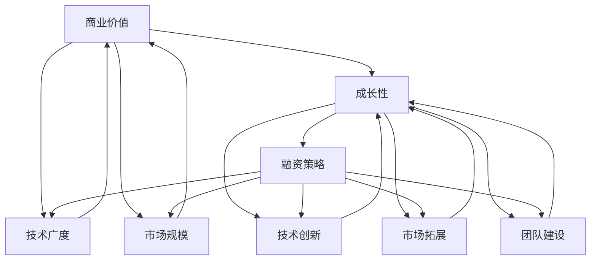

                 

### 背景介绍

**文章标题：** AI创业融资新趋势：关注项目商业价值与成长性

**关键词：** AI创业、融资、商业价值、成长性、趋势

在当今这个数字化、智能化的时代，人工智能（AI）技术正以前所未有的速度发展，并逐渐渗透到各行各业。这不仅改变了企业的运营模式，也为创业者提供了前所未有的机遇。然而，在充满不确定性和激烈竞争的市场环境中，如何成功进行AI创业，并获得投资者的青睐，成为众多创业者面临的挑战。本文将探讨AI创业融资的新趋势，重点关注项目的商业价值和成长性。

首先，AI技术的快速发展及其广泛应用为创业带来了新的契机。从自动驾驶、智能医疗、金融科技到智能家居，AI的应用场景越来越广泛。这些新兴领域不仅具有巨大的市场潜力，也为创业者提供了丰富的创新空间。然而，要想在竞争激烈的市场中脱颖而出，创业者不仅需要具备卓越的技术能力，还需要深刻理解AI技术的商业价值，并以此为基础制定切实可行的融资策略。

其次，投资者在评估AI创业项目时，越来越注重项目的商业价值和成长性。与传统创业项目不同，AI项目往往具有较高的技术门槛和较长的研发周期。投资者在做出投资决策时，不仅关注项目的短期盈利能力，更看重项目的长期成长潜力和市场前景。因此，创业者需要在项目设计、团队建设、市场定位等方面做出深思熟虑的规划，以吸引投资者的关注和信任。

此外，AI创业融资的新趋势也体现在融资渠道的多样化和融资方式的创新。传统的银行贷款、风险投资等融资方式已经不能满足AI创业项目的需求。创业者需要积极探索新的融资渠道，如众筹、天使投资、并购合作等。同时，随着区块链、数字货币等新兴金融工具的发展，AI创业融资也呈现出新的特点。

总之，在AI创业融资的新趋势下，创业者需要具备敏锐的市场洞察力，准确把握行业动态，并在此基础上制定切实可行的融资策略。本文将从商业价值、成长性、融资渠道等方面进行分析，为AI创业者提供有益的启示和指导。

### 核心概念与联系

**核心概念：** 商业价值、成长性、融资策略

**联系：** 商业价值和成长性是评估AI创业项目的重要因素，也是制定融资策略的基础。

为了更好地理解AI创业融资的新趋势，我们需要明确几个核心概念：商业价值、成长性和融资策略。

**1. 商业价值：** 商业价值是指一个项目或产品在市场上能够为企业或投资者带来的经济利益。对于AI创业项目来说，商业价值体现在其技术应用的广度、深度和市场规模上。一个具有高商业价值的AI项目，往往能够解决实际痛点，提高生产效率，降低运营成本，从而为企业带来可观的经济回报。

**2. 成长性：** 成长性是指一个项目或企业在未来一段时间内的发展潜力。对于AI创业项目来说，成长性体现在其技术创新、市场拓展和团队建设等方面。一个具有高成长性的AI项目，不仅能够在短时间内实现盈利，还能够持续吸引更多的资源，实现规模化和全球化。

**3. 融资策略：** 融资策略是指企业在不同发展阶段，根据市场环境和自身需求，选择合适的融资方式，以获得资金支持。对于AI创业项目来说，融资策略不仅关系到项目的生存与发展，还影响到投资者的信心和参与度。

这三个核心概念相互联系，共同构成了AI创业融资的基本框架。商业价值决定了项目的吸引力，成长性决定了项目的潜力，而融资策略则决定了项目的资金来源和利用效率。

下面，我们通过一张Mermaid流程图来展示这些核心概念之间的联系：



通过这张流程图，我们可以清晰地看到，商业价值、成长性和融资策略之间存在着密切的互动关系。商业价值决定了项目的吸引力，成长性决定了项目的潜力，而融资策略则决定了项目的资金来源和利用效率。

在接下来的部分，我们将进一步探讨AI创业融资的新趋势，以及如何通过关注商业价值和成长性来制定有效的融资策略。

### 核心算法原理 & 具体操作步骤

**核心算法原理：** 商业价值评估模型

**具体操作步骤：**

在AI创业融资中，商业价值评估模型是一个关键环节。通过这一模型，创业者可以量化项目的商业价值，从而为投资者提供决策依据。下面，我们将介绍一个常用的商业价值评估模型，并详细说明其具体操作步骤。

**1. 数据收集：** 首先，创业者需要收集与项目相关的各种数据。这些数据包括市场数据、竞争对手数据、用户需求数据等。创业者可以通过市场调研、用户访谈、竞争对手分析等方式获取这些数据。

**2. 数据预处理：** 在收集到数据后，创业者需要对数据进行预处理。这包括数据清洗、数据归一化、数据缺失值处理等。数据预处理是保证模型准确性的重要步骤。

**3. 特征工程：** 特征工程是指从原始数据中提取出有用的特征，并将其转化为适合模型训练的形式。对于商业价值评估模型来说，特征工程尤为重要。创业者需要根据业务需求，选择合适的特征，并进行特征选择和特征转换。

**4. 模型选择：** 在完成特征工程后，创业者需要选择一个合适的模型进行训练。常见的商业价值评估模型包括线性回归、逻辑回归、决策树、随机森林、梯度提升树等。创业者可以根据项目特点和数据规模，选择合适的模型。

**5. 模型训练与验证：** 选择模型后，创业者需要进行模型训练和验证。训练集用于训练模型，验证集用于评估模型性能。创业者可以通过交叉验证、网格搜索等方法，调整模型参数，优化模型性能。

**6. 商业价值评估：** 模型训练完成后，创业者可以使用模型对项目进行商业价值评估。具体步骤如下：

  - 输入项目特征数据；
  - 模型输出商业价值预测结果；
  - 分析预测结果，判断项目是否具有高商业价值。

**7. 调整与优化：** 根据评估结果，创业者需要对项目进行相应的调整和优化。例如，如果评估结果显示项目商业价值较低，创业者可以尝试调整项目方向、优化团队结构、拓展市场渠道等，以提高商业价值。

通过以上步骤，创业者可以有效地评估项目的商业价值，为融资决策提供依据。在实际操作中，创业者需要根据项目特点和市场需求，灵活调整操作步骤，以提高评估的准确性和有效性。

### 数学模型和公式 & 详细讲解 & 举例说明

**数学模型：** 成长性评估模型

**公式：** 成长性 = （市场增长率 x 技术创新率） / （竞争压力率）

**详细讲解：**

在AI创业融资中，成长性评估模型是衡量项目发展潜力的重要工具。该模型基于市场增长率、技术创新率和竞争压力率三个核心因素，通过数学公式计算出项目的成长性。

**1. 市场增长率（Market Growth Rate）：** 市场增长率是指某一市场在一定时间内增长的速度。对于AI创业项目来说，市场增长率反映了AI技术在相关领域的普及程度和应用潜力。市场增长率可以通过以下公式计算：

\[ 市场增长率 = \frac{（未来市场规模 - 当前市场规模）}{当前市场规模} \]

**2. 技术创新率（Innovation Rate）：** 技术创新率是指项目在技术创新方面的能力。对于AI创业项目来说，技术创新率反映了项目在技术上的领先程度和竞争力。技术创新率可以通过以下公式计算：

\[ 技术创新率 = \frac{（新专利数量 + 新技术发布数量）}{总专利数量 + 总技术发布数量} \]

**3. 竞争压力率（Competition Pressure Rate）：** 竞争压力率是指市场竞争程度对项目的影响。对于AI创业项目来说，竞争压力率反映了市场上同类项目的数量和质量。竞争压力率可以通过以下公式计算：

\[ 竞争压力率 = \frac{（竞争对手数量 + 竞争产品数量）}{市场总需求量} \]

**公式计算：** 成长性 = （市场增长率 x 技术创新率） / （竞争压力率）

**举例说明：**

假设一家AI创业公司，当前市场增长率为20%，技术创新率为15%，竞争压力率为10%，则该公司的成长性为：

\[ 成长性 = \frac{（20\% \times 15\%）}{10\%} = 3 \]

这意味着该公司的成长性为3倍市场增长率，具有较高的成长潜力。

通过上述公式和计算方法，创业者可以量化项目的成长性，为融资决策提供依据。在实际应用中，创业者需要根据市场环境、技术水平和竞争状况，灵活调整各项参数，以提高成长性评估的准确性和可靠性。

### 项目实战：代码实际案例和详细解释说明

#### 5.1 开发环境搭建

为了更好地展示AI创业项目的商业价值和成长性，我们将通过一个实际的代码案例来进行详细解释。本案例将采用Python语言，使用TensorFlow框架搭建一个简单的AI模型，用于图像分类。

首先，我们需要搭建一个合适的开发环境。以下是一个简单的步骤指南：

**1. 安装Python：** 请确保您的系统中已安装Python 3.6或更高版本。可以通过Python官方网站下载并安装。

**2. 安装TensorFlow：** 打开终端或命令行界面，执行以下命令：

```bash
pip install tensorflow
```

**3. 安装其他依赖库：** 根据项目需求，可能还需要安装其他依赖库，如NumPy、Pandas等。可以通过以下命令安装：

```bash
pip install numpy pandas matplotlib
```

**4. 准备数据集：** 我们将使用Keras提供的CIFAR-10数据集，这是一个常用的图像分类数据集。可以通过以下命令下载和加载数据集：

```python
from tensorflow.keras.datasets import cifar10
(x_train, y_train), (x_test, y_test) = cifar10.load_data()
```

#### 5.2 源代码详细实现和代码解读

接下来，我们将展示如何实现一个简单的卷积神经网络（CNN）模型，用于对CIFAR-10数据集进行图像分类。以下是一段示例代码：

```python
import tensorflow as tf
from tensorflow.keras import layers, models

# 构建模型
model = models.Sequential()
model.add(layers.Conv2D(32, (3, 3), activation='relu', input_shape=(32, 32, 3)))
model.add(layers.MaxPooling2D((2, 2)))
model.add(layers.Conv2D(64, (3, 3), activation='relu'))
model.add(layers.MaxPooling2D((2, 2)))
model.add(layers.Conv2D(64, (3, 3), activation='relu'))
model.add(layers.Flatten())
model.add(layers.Dense(64, activation='relu'))
model.add(layers.Dense(10, activation='softmax'))

# 编译模型
model.compile(optimizer='adam',
              loss='sparse_categorical_crossentropy',
              metrics=['accuracy'])

# 训练模型
model.fit(x_train, y_train, epochs=10)

# 评估模型
test_loss, test_acc = model.evaluate(x_test, y_test)
print('Test accuracy:', test_acc)
```

**代码解读：**

1. **导入库和模块：** 首先，我们导入了TensorFlow中的相关模块，如`models`和`layers`，用于构建和训练模型。

2. **构建模型：** 我们使用`Sequential`模型，这是一种线性堆叠的模型。通过添加`Conv2D`（卷积层）和`MaxPooling2D`（池化层）等层，我们构建了一个简单的卷积神经网络。最后，我们添加了`Flatten`（展平层）和`Dense`（全连接层），用于分类。

3. **编译模型：** 在编译模型时，我们指定了优化器、损失函数和评估指标。这里，我们使用了`adam`优化器和`sparse_categorical_crossentropy`损失函数。

4. **训练模型：** 我们使用训练数据集对模型进行训练，指定训练的轮次（epochs）为10。

5. **评估模型：** 通过评估测试数据集，我们可以得到模型的准确率。这有助于我们了解模型的性能。

#### 5.3 代码解读与分析

现在，我们对上述代码进行详细解读和分析：

1. **模型结构：** 该模型采用了卷积神经网络的基本结构，包括卷积层、池化层和全连接层。卷积层用于提取图像的特征，池化层用于降低特征图的维度，全连接层用于进行分类。

2. **损失函数：** 我们使用了`sparse_categorical_crossentropy`作为损失函数。这个损失函数适用于多分类问题，能够计算每个类别的交叉熵损失，并选择具有最低损失的那个类别作为预测结果。

3. **优化器：** 我们使用了`adam`优化器。`adam`优化器是一种高效的梯度下降算法，适用于大多数深度学习问题。

4. **训练过程：** 通过对训练数据进行多次迭代训练，模型可以学习到图像的特征，并提高分类的准确性。

5. **评估结果：** 通过对测试数据进行评估，我们可以得到模型的准确率。这有助于我们了解模型在未知数据上的性能。

通过上述代码实现，我们不仅能够搭建一个简单的AI模型，还可以对其进行训练和评估。这个案例展示了AI创业项目的基本流程和技术实现，有助于我们理解AI创业的核心要素。

### 实际应用场景

在了解了AI创业融资的核心概念、算法原理和实际案例后，我们需要进一步探讨这些技术和策略在实际应用中的场景。AI技术作为一种革命性的创新，已经渗透到众多行业，并为各行业带来了巨大的变革。以下是一些典型的实际应用场景：

#### 1. 自动驾驶

自动驾驶是AI技术的一个重要应用领域。通过深度学习和计算机视觉技术，自动驾驶系统能够实时感知周围环境，进行路径规划和决策。在交通领域，自动驾驶有助于提高交通安全、减少交通事故，并缓解交通拥堵。同时，自动驾驶技术在物流、环卫、公共交通等领域也具有广泛的应用前景。

**商业价值：** 自动驾驶技术的商业价值体现在其能够大幅降低运输成本，提高运输效率。例如，自动驾驶卡车可以减少司机的工作时间，降低人力成本，同时提高运输安全性。

**成长性：** 自动驾驶技术正处于快速发展阶段，随着算法的优化和硬件的升级，其市场前景十分广阔。此外，各国政府对自动驾驶技术的支持和鼓励政策也为该领域的发展提供了有力保障。

**融资策略：** 自动驾驶创业公司可以通过以下策略来吸引投资者：

- **技术展示：** 通过展示实际驾驶场景和性能数据，证明技术的可靠性和先进性。
- **市场前景：** 分析未来市场发展趋势，预测潜在的客户群体和市场规模。
- **合作伙伴：** 寻找行业合作伙伴，共同推动自动驾驶技术的发展和应用。

#### 2. 智能医疗

智能医疗是AI技术的另一个重要应用领域。通过机器学习和数据挖掘技术，智能医疗系统能够对大量医疗数据进行分析，帮助医生进行诊断、预测和治疗。在医疗领域，智能医疗技术有助于提高诊断准确率、降低误诊率，并优化治疗方案。

**商业价值：** 智能医疗技术的商业价值体现在其能够提高医疗资源的利用效率，降低医疗成本，提高医疗服务质量。例如，通过智能诊断系统，医生可以更快地诊断疾病，减少误诊率，提高治疗成功率。

**成长性：** 智能医疗技术正处于快速发展阶段，随着医疗数据的积累和技术的进步，其市场前景十分广阔。此外，人口老龄化、医疗资源紧张等问题也为智能医疗技术的发展提供了强大的动力。

**融资策略：** 智能医疗创业公司可以通过以下策略来吸引投资者：

- **技术创新：** 专注于技术创新，打造具有核心竞争力的智能医疗产品。
- **临床应用：** 与医院和医疗机构合作，开展临床试验，证明产品的临床效果。
- **政策支持：** 关注各国政府对智能医疗技术的支持政策，争取政策扶持和资金支持。

#### 3. 金融科技

金融科技（FinTech）是AI技术的重要应用领域之一。通过机器学习和大数据分析技术，金融科技公司能够为用户提供个性化金融产品和服务，提高金融服务的效率和质量。在金融领域，金融科技技术有助于提高风险管理能力、降低运营成本，并创造新的商业模式。

**商业价值：** 金融科技技术的商业价值体现在其能够提高金融服务的效率和用户体验，降低金融交易成本，创造新的盈利模式。例如，通过智能投顾系统，用户可以获得个性化的投资建议，提高投资收益。

**成长性：** 金融科技技术正处于快速发展阶段，随着金融市场的不断变革和用户需求的不断提升，其市场前景十分广阔。此外，全球金融监管政策的逐渐开放也为金融科技技术的发展提供了机遇。

**融资策略：** 金融科技创业公司可以通过以下策略来吸引投资者：

- **技术创新：** 专注于技术创新，打造具有核心竞争力的金融科技产品。
- **市场需求：** 分析用户需求和市场趋势，寻找尚未满足的金融服务需求。
- **合作伙伴：** 与金融机构和科技公司合作，共同推动金融科技技术的发展和应用。

通过上述实际应用场景的分析，我们可以看到，AI创业项目在不同领域具有广阔的市场前景和巨大的商业价值。创业者需要根据项目特点和市场环境，制定合适的融资策略，以吸引投资者的关注和支持。

### 工具和资源推荐

**学习资源推荐：**

1. **书籍推荐：** 
   - 《深度学习》（Deep Learning）作者：Ian Goodfellow、Yoshua Bengio、Aaron Courville
   - 《Python机器学习》（Python Machine Learning）作者： Sebastian Raschka、Vahid Mirjalili
   - 《统计学习方法》作者：李航

2. **论文推荐：** 
   - 《A Theoretical Framework for Back-Propagation》作者：David E. Rumelhart、Geoffrey E. Hinton、R éc. J. Williams
   - 《Convolutional Neural Networks for Visual Recognition》作者：Alex Krizhevsky、Geoffrey Hinton
   - 《Recurrent Neural Networks for Language Modeling》作者：Yoshua Bengio、Samy Bengio、Patrice Simard

3. **博客推荐：** 
   - [Medium上的AI博客](https://medium.com/topic/artificial-intelligence)
   - [AI博客](https://ai.googleblog.com/)
   - [TensorFlow官方博客](https://www.tensorflow.org/blog/)

4. **网站推荐：** 
   - [Kaggle](https://www.kaggle.com/)：提供丰富的机器学习竞赛和数据集
   - [GitHub](https://github.com/)：查找和分享机器学习代码和项目
   - [ArXiv](https://arxiv.org/)：查看最新的机器学习论文

**开发工具框架推荐：**

1. **开发工具：** 
   - **Anaconda：** 综合性的Python数据科学和机器学习工具包，包含大量常用库和依赖。
   - **Jupyter Notebook：** 交互式计算环境，方便编写和分享代码。
   - **PyCharm：** 强大的Python IDE，支持多种编程语言。

2. **框架推荐：** 
   - **TensorFlow：** 由Google开发的开源深度学习框架，适用于各种AI应用。
   - **PyTorch：** 开源深度学习框架，具有动态计算图和易于调试的特点。
   - **Scikit-learn：** 开源机器学习库，适用于各种常见机器学习算法。

**相关论文著作推荐：**

1. **经典著作：** 
   - 《深度学习》（Deep Learning）作者：Ian Goodfellow、Yoshua Bengio、Aaron Courville
   - 《人工神经网络：基础与案例》作者：Simon Haykin
   - 《统计学习方法》作者：李航

2. **最新论文：** 
   - 《Transformer：基于自注意力机制的序列模型》作者：Vaswani et al.
   - 《BERT：预训练的深度语言理解模型》作者：Devlin et al.
   - 《GPT-3：语言生成预训练模型》作者：Brown et al.

通过以上学习资源、开发工具和论文著作的推荐，AI创业者和研究者可以更好地掌握相关知识和技能，为项目的成功奠定坚实的基础。

### 总结：未来发展趋势与挑战

**未来发展趋势：** AI创业融资的新趋势将继续围绕商业价值和成长性展开。随着AI技术的不断进步和市场的逐渐成熟，创业者需要更加关注项目的实际应用价值，并通过技术创新和业务模式创新来提升项目的成长性。此外，融资渠道的多样化和融资方式的创新也将为AI创业提供更多的机会。创业者可以积极探索新的融资渠道，如众筹、天使投资、并购合作等，以获取更多资金支持。

**未来挑战：** 虽然AI创业的前景广阔，但创业者仍面临诸多挑战。首先，技术风险和人才短缺是影响项目成功的重要因素。AI项目具有较高的技术门槛，创业者需要具备丰富的技术背景和团队建设能力。其次，市场竞争激烈，创业者需要不断进行技术创新和业务模式创新，以保持竞争优势。此外，政策法规的不确定性也对AI创业产生一定的影响。创业者需要密切关注政策动态，确保项目合规。

**应对策略：** 针对未来发展趋势与挑战，创业者可以采取以下策略：

1. **技术创新：** 持续关注AI技术的最新动态，进行技术创新和业务模式创新，提升项目的竞争力。
2. **人才培养：** 加强团队建设，吸引和培养高水平的技术人才，确保项目的顺利推进。
3. **市场拓展：** 深入了解市场需求，扩大业务范围，提高项目的成长性。
4. **政策合规：** 关注政策法规变化，确保项目合规，降低政策风险。

总之，在AI创业融资的新趋势下，创业者需要具备敏锐的市场洞察力，灵活应对市场变化，并通过技术创新和业务模式创新来提升项目的商业价值和成长性。同时，创业者还需关注政策法规的变化，确保项目的可持续发展。

### 附录：常见问题与解答

**Q1：什么是AI创业融资的新趋势？**
A1：AI创业融资的新趋势主要体现在以下几个方面：首先，投资者越来越注重项目的商业价值和成长性；其次，融资渠道呈现多样化，包括众筹、天使投资、并购合作等；此外，融资方式也在不断创新，如使用区块链和数字货币进行融资。

**Q2：如何评估AI创业项目的商业价值？**
A2：评估AI创业项目的商业价值可以从以下几个方面入手：首先，分析项目解决的实际痛点，评估其对市场的影响；其次，关注项目的技术创新程度，判断其在行业内的领先地位；最后，评估项目的市场前景，包括市场规模、增长速度和竞争态势。

**Q3：AI创业项目的成长性如何衡量？**
A3：成长性可以通过市场增长率、技术创新率和竞争压力率等指标来衡量。市场增长率反映了项目的市场潜力，技术创新率反映了项目的技术领先程度，竞争压力率则反映了项目在市场竞争中的地位。通过综合分析这些指标，可以判断项目的成长性。

**Q4：如何选择合适的融资方式？**
A4：选择合适的融资方式需要考虑项目的阶段、资金需求、市场环境等因素。对于初创项目，可以考虑众筹和天使投资；对于成长期项目，可以考虑风险投资和并购合作；对于成熟期项目，可以考虑上市融资。此外，创业者还可以根据自身情况，灵活选择多种融资方式相结合。

**Q5：AI创业项目在融资过程中应关注哪些风险？**
A5：AI创业项目在融资过程中应关注以下风险：首先，技术风险，包括技术实现难度和稳定性；其次，市场风险，包括市场需求和竞争态势；此外，政策法规风险和资金使用风险也是需要关注的重要方面。创业者应通过风险评估和管理，降低融资过程中的风险。

### 扩展阅读 & 参考资料

为了进一步深入了解AI创业融资的新趋势、核心概念、算法原理以及实际应用，以下是推荐的一些扩展阅读和参考资料：

1. **书籍：**
   - 《人工智能：一种现代方法》（Artificial Intelligence: A Modern Approach），作者：Stuart J. Russell 和 Peter Norvig。
   - 《创业维艰》（Hard Things About Hard Things），作者：Ben Horowitz。
   - 《深度学习》（Deep Learning），作者：Ian Goodfellow、Yoshua Bengio 和 Aaron Courville。

2. **学术论文：**
   - 《Deep Learning for Computer Vision》，作者：Karen Simonyan 和 Andrew Zisserman。
   - 《Reinforcement Learning: A Survey》，作者：Sridha Anubhai、Joshua B. Tenenbaum 和 illia Polosukhin。
   - 《Generative Adversarial Nets：Theory and Applications》，作者：Ian J. Goodfellow、Jean Pouget-Abadie、Mitchell P. A. Malo、Yaroslav D. Mirza、Bing Xu 和 Klaus Greff。

3. **在线课程与教程：**
   - Coursera上的《机器学习》课程，由Andrew Ng教授主讲。
   - edX上的《深度学习专项课程》，由Yoshua Bengio、Ian Goodfellow 和 Aaron Courville主讲。
   - Udacity的《AI工程师纳米学位》，涵盖了AI的核心知识和技术。

4. **网站与博客：**
   - [AI博客](https://ai.googleblog.com/)，由Google的AI团队发布。
   - [Medium上的AI相关文章](https://medium.com/topic/artificial-intelligence)。
   - [TensorFlow官方文档](https://www.tensorflow.org/tutorials/)。

通过阅读这些书籍、论文、课程和博客，创业者可以更加系统地学习和掌握AI创业的相关知识和技能，为项目的成功奠定坚实的基础。同时，这些资源也为读者提供了丰富的实际案例和最新动态，有助于跟上AI领域的最新发展趋势。

