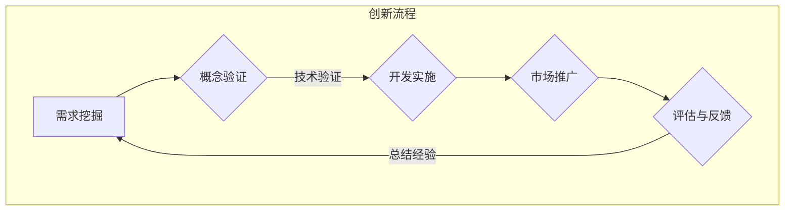

                 

### 背景介绍

在当今科技飞速发展的时代，人工智能（AI）已经成为推动社会进步的重要力量。众多创业者纷纷投身于AI领域的创新和创业，希望在这个充满无限可能的市场中脱颖而出。然而，创新并非易事，它需要深厚的知识储备、敏锐的市场洞察力和持续的技术突破。本文旨在探讨AI创业中的创新重要性，通过分析创新在不同阶段的角色和影响，为创业者提供一些实用的建议和策略。

随着大数据、云计算、深度学习等技术的不断发展，人工智能的应用场景日益广泛，从自动驾驶、智能医疗、金融科技到智能家居等各个领域，都涌现出了大量的创新企业和项目。这些创新不仅推动了行业的进步，也为创业者带来了巨大的商业机会。然而，成功的AI创业并非仅仅依靠技术优势，创新在其中扮演着至关重要的角色。

创新不仅是技术上的突破，更是商业模式的革新、市场需求的挖掘以及用户体验的提升。对于AI创业者来说，理解并掌握创新的重要性，能够帮助他们更好地应对市场竞争，实现持续的发展和壮大。

本文将从以下几个方面展开讨论：

1. **创新的核心概念与联系**：介绍创新的基本概念，阐述创新与AI技术、市场、用户需求等方面的联系。
2. **核心算法原理与具体操作步骤**：分析AI创业中常用的核心算法，如神经网络、机器学习等，并解释这些算法的具体应用场景。
3. **数学模型和公式**：介绍与AI创新相关的数学模型和公式，以及如何运用这些模型进行创新性研究和开发。
4. **项目实战**：通过具体案例，展示如何在AI创业项目中运用创新思维和技术，实现实际应用。
5. **实际应用场景**：探讨AI创新在不同行业和领域中的应用案例，分析创新带来的商业价值和社会影响。
6. **工具和资源推荐**：推荐一些有助于AI创业者进行创新和学习的相关工具、资源和文献。
7. **总结与未来发展趋势**：总结AI创业中的创新经验，展望未来AI创业的发展趋势和挑战。

通过本文的探讨，希望能够为AI创业者提供一些有价值的思考和建议，帮助他们更好地把握创新机遇，实现成功创业。

### 核心概念与联系

在深入探讨AI创业中的创新之前，我们首先需要明确创新的核心概念及其与AI技术、市场、用户需求等方面的联系。

**创新的概念**

创新，通常指的是通过引入新的想法、技术、方法或产品，从而改进现有流程或创造全新价值的过程。在商业环境中，创新不仅仅是指技术上的突破，还包括商业模式、服务模式、用户体验等多方面的创新。

**创新与AI技术的联系**

AI技术作为现代科技的前沿领域，其快速发展为创新提供了源源不断的动力。AI的核心在于模拟和扩展人类智能，包括机器学习、深度学习、自然语言处理、计算机视觉等。这些技术的应用不仅提升了传统行业的效率，还开创了全新的商业模式和业务场景。

- **机器学习与数据分析**：通过机器学习算法，企业可以挖掘海量数据中的隐藏价值，优化决策过程，提升业务效率。
- **深度学习与图像识别**：深度学习技术在图像识别、语音识别等领域的突破，使得自动驾驶、智能安防等应用成为现实。
- **自然语言处理与智能助手**：自然语言处理技术的进步使得智能语音助手、机器翻译等应用更加普及，极大地改善了用户体验。

**创新与市场的联系**

市场是检验创新成功与否的试金石。在市场竞争日益激烈的环境中，创新成为企业赢得竞争优势的重要手段。

- **差异化竞争**：通过技术创新，企业可以提供独特的产品或服务，形成差异化竞争优势，吸引更多客户。
- **市场需求挖掘**：创新能够帮助企业发现并满足潜在市场需求，开拓新的市场空间。
- **快速响应市场变化**：创新使得企业能够迅速适应市场变化，及时调整战略和产品，保持竞争力。

**创新与用户需求的联系**

用户是创新的最终受益者。创新的目的在于提升用户体验，满足用户需求。

- **个性化服务**：通过技术创新，企业可以提供更加个性化的服务，满足用户多样化的需求。
- **用户体验优化**：创新可以在设计、交互等方面提升用户体验，增强用户忠诚度。
- **解决问题的能力**：创新能够帮助企业解决用户实际面临的问题，提供更好的解决方案。

**创新流程与模式**

创新不仅仅是一个线性的过程，它涉及到多个环节的互动和迭代。

- **需求挖掘**：通过市场调研、用户反馈等方式，挖掘用户需求和潜在的市场机会。
- **概念验证**：在明确创新方向后，进行初步的技术验证和可行性分析，确定技术方案和商业模式。
- **开发实施**：进行产品开发和市场推广，不断优化和迭代，以适应市场变化和用户需求。
- **评估与反馈**：对创新项目进行评估和反馈，总结经验教训，为后续创新提供参考。

综上所述，创新在AI创业中扮演着至关重要的角色。它不仅推动了技术进步，还改变了商业模式和市场格局，最终实现了用户价值的最大化。理解并掌握创新的核心概念和流程，对于AI创业者来说，是成功创业的关键所在。

**Mermaid 流程图**

以下是创新在AI创业中的流程和模式的Mermaid流程图表示：



通过以上流程图，我们可以清晰地看到创新在AI创业中的各个环节及其相互关系，这为创业者提供了明确的指导和参考。

### 核心算法原理与具体操作步骤

在AI创业中，核心算法的选择和应用至关重要。本文将重点介绍几种常见的核心算法，包括神经网络、机器学习等，并详细解释这些算法的原理和具体操作步骤。

#### 1. 神经网络（Neural Networks）

神经网络是AI领域最基础且广泛应用的一种算法，它模拟人脑神经元的工作方式，通过多层节点（层）进行处理和传递信息。

**原理：**

神经网络由输入层、隐藏层和输出层组成。输入层接收外部输入信号，通过隐藏层进行信息处理和传递，最终输出层生成预测结果。每个节点（神经元）都会接受前一层节点的输出，通过激活函数进行计算，并传递到下一层。

**具体操作步骤：**

1. **数据预处理**：对输入数据进行归一化处理，确保每个特征都在同一量级范围内。
2. **模型构建**：定义网络的输入层、隐藏层和输出层，选择合适的激活函数（如ReLU、Sigmoid、Tanh等）。
3. **权重初始化**：随机初始化权重和偏置，以避免梯度消失或爆炸问题。
4. **前向传播**：输入数据通过网络传递，每个节点根据激活函数计算输出。
5. **损失函数计算**：计算输出结果与实际结果之间的差异，通过损失函数（如均方误差MSE、交叉熵损失等）衡量模型的性能。
6. **反向传播**：利用梯度下降等优化算法，更新网络的权重和偏置，减小损失函数的值。
7. **迭代优化**：重复前向传播和反向传播过程，直至满足收敛条件。

**示例：**

假设我们使用简单的多层感知机（MLP）模型进行分类任务，输入特征为两个维度，输出为两个类别。

```python
import tensorflow as tf

# 数据预处理
x = tf.placeholder(tf.float32, [None, 2])
y = tf.placeholder(tf.float32, [None, 2])

# 模型构建
hidden层 = tf.layers.dense(x, units=10, activation=tf.nn.relu)
output层 = tf.layers.dense(hidden层, units=2, activation=None)

# 损失函数计算
cross_entropy = tf.reduce_mean(tf.nn.softmax_cross_entropy_with_logits(logits=output层, labels=y))

# 优化器选择
optimizer = tf.train.AdamOptimizer(learning_rate=0.001)
train_op = optimizer.minimize(cross_entropy)

# 模型评估
correct_prediction = tf.equal(tf.argmax(output层, 1), tf.argmax(y, 1))
accuracy = tf.reduce_mean(tf.cast(correct_prediction, tf.float32))

# 训练模型
with tf.Session() as sess:
    sess.run(tf.global_variables_initializer())
    for i in range(1000):
        batch_x, batch_y = ... # 数据准备
        sess.run(train_op, feed_dict={x: batch_x, y: batch_y})
        if i % 100 == 0:
            acc = sess.run(accuracy, feed_dict={x: test_x, y: test_y})
            print('Step', i, 'Accuracy:', acc)
```

#### 2. 机器学习（Machine Learning）

机器学习是AI的核心技术之一，它通过从数据中学习规律，实现自动化决策和预测。

**原理：**

机器学习主要包括监督学习、无监督学习和强化学习。监督学习有明确的目标变量，通过训练数据学习预测模型；无监督学习没有目标变量，主要关注数据分布和特征提取；强化学习通过与环境互动，学习最优策略。

**具体操作步骤：**

1. **数据收集**：收集相关的训练数据，确保数据质量。
2. **数据预处理**：对数据清洗、归一化处理，提取有用的特征。
3. **模型选择**：选择合适的算法，如线性回归、决策树、支持向量机等。
4. **模型训练**：通过训练数据，调整模型的参数，优化模型性能。
5. **模型评估**：使用验证集或测试集，评估模型的泛化能力。
6. **模型应用**：将训练好的模型应用到实际场景，进行预测或决策。

**示例：**

使用scikit-learn库进行线性回归模型的训练和应用。

```python
from sklearn.linear_model import LinearRegression
from sklearn.model_selection import train_test_split

# 数据收集
X = ... # 特征数据
y = ... # 目标变量

# 数据预处理
X_train, X_test, y_train, y_test = train_test_split(X, y, test_size=0.2, random_state=42)

# 模型选择
model = LinearRegression()

# 模型训练
model.fit(X_train, y_train)

# 模型评估
score = model.score(X_test, y_test)
print('模型评分：', score)

# 模型应用
predictions = model.predict(X_test)
```

通过以上示例，我们可以看到神经网络和机器学习在AI创业中的应用方法和步骤。理解这些核心算法的原理和操作步骤，对于AI创业者来说，是进行技术突破和创新的重要基础。

### 数学模型和公式

在AI创业过程中，数学模型和公式是理解和应用核心算法的重要工具。本文将介绍与AI创新相关的几个关键数学模型和公式，并详细解释它们的作用和应用方法。

#### 1. 均值平方误差（MSE）

均值平方误差（MSE，Mean Squared Error）是一种衡量预测值与真实值之间差异的指标，广泛应用于监督学习模型评估中。

**公式：**
$$
MSE = \frac{1}{n}\sum_{i=1}^{n}(y_i - \hat{y}_i)^2
$$

其中，$y_i$表示第$i$个样本的真实值，$\hat{y}_i$表示第$i$个样本的预测值，$n$表示样本总数。

**作用：** 
MSE通过计算预测值与真实值之间的平方差，能够衡量模型预测的准确性。平方差能够放大较大的误差，从而对模型进行更严格的评估。

**应用方法：**
在实际应用中，MSE通常用于训练过程中评估模型的性能，并通过优化算法（如梯度下降）最小化MSE，以提升模型预测精度。

#### 2. 交叉熵（Cross-Entropy）

交叉熵（Cross-Entropy）是衡量分类模型预测分布与真实分布之间差异的指标，广泛应用于分类问题中。

**公式：**
$$
H(y, \hat{y}) = -\sum_{i=1}^{n}y_i\log(\hat{y}_i)
$$

其中，$y_i$表示第$i$个样本的真实标签（0或1），$\hat{y}_i$表示第$i$个样本的预测概率。

**作用：** 
交叉熵能够衡量预测概率分布与真实分布之间的差异，对于分类问题来说，交叉熵越小说明预测结果越接近真实情况。

**应用方法：**
交叉熵通常用于训练分类模型，通过最小化交叉熵损失函数，优化模型参数，提高分类准确率。

#### 3. 梯度下降（Gradient Descent）

梯度下降是一种常用的优化算法，用于最小化损失函数，优化模型参数。

**公式：**
$$
w_{\text{new}} = w_{\text{current}} - \alpha \cdot \nabla_w J(w)
$$

其中，$w$表示模型参数，$\alpha$表示学习率，$\nabla_w J(w)$表示损失函数关于参数$w$的梯度。

**作用：** 
梯度下降通过计算损失函数关于参数的梯度，逐步更新参数值，使损失函数达到最小值。梯度下降是大多数机器学习算法的基础，如线性回归、神经网络等。

**应用方法：**
在实际应用中，梯度下降通过迭代计算梯度，更新模型参数，直至满足收敛条件。学习率的选择对梯度下降的性能有很大影响，过小可能导致收敛速度慢，过大可能导致无法收敛。

#### 4. 支持向量机（SVM）

支持向量机（SVM，Support Vector Machine）是一种常用的监督学习算法，用于分类和回归任务。

**公式：**
$$
\text{最大间隔超平面：} \quad w^T x_i + b = 1
$$
$$
\text{间隔：} \quad \frac{1}{\|w\|} = \frac{2}{\|w\|^2 - y_i (w^T x_i + b)}
$$

其中，$w$表示超平面法向量，$b$表示偏置，$x_i$表示样本特征，$y_i$表示样本标签。

**作用：** 
SVM通过寻找最大间隔超平面，将不同类别的样本最大化分开。支持向量是决定超平面位置的关键样本。

**应用方法：**
SVM在分类任务中，通过求解优化问题，确定最优超平面和参数。在实际应用中，需要选择合适的核函数（如线性核、多项式核、径向基核等）来处理非线性问题。

通过以上数学模型和公式的介绍，我们可以更好地理解和应用AI创业中的核心算法。这些公式不仅是算法实现的基础，也是评估和优化模型性能的重要工具。掌握这些数学知识，对于AI创业者来说，是提升技术水平和实现创新的关键。

### 项目实战：代码实际案例和详细解释说明

为了更好地理解AI创业中创新的重要性，我们将通过一个实际的项目案例来展示如何运用创新思维和技术，实现AI应用的落地。本案例将聚焦于使用深度学习技术构建一个智能图像分类系统，通过对大量图片进行自动分类，从而为企业提供智能化数据管理解决方案。

#### 5.1 开发环境搭建

在进行项目开发之前，我们需要搭建一个合适的开发环境。以下是所需的环境和工具：

- **编程语言：** Python（3.7及以上版本）
- **深度学习框架：** TensorFlow（2.x版本）
- **操作系统：** macOS 或 Linux（推荐使用 Ubuntu）
- **开发工具：** Jupyter Notebook 或 PyCharm（推荐使用 PyCharm）

**安装步骤：**

1. 安装Python：

   ```
   sudo apt-get update
   sudo apt-get install python3 python3-pip
   ```

2. 安装TensorFlow：

   ```
   pip3 install tensorflow==2.x
   ```

3. 安装其他依赖：

   ```
   pip3 install numpy matplotlib scikit-learn
   ```

#### 5.2 源代码详细实现和代码解读

在本案例中，我们使用卷积神经网络（CNN）对图片进行分类。以下是一个简化的代码实现，用于演示主要步骤。

```python
import tensorflow as tf
from tensorflow.keras.models import Sequential
from tensorflow.keras.layers import Conv2D, MaxPooling2D, Flatten, Dense
from tensorflow.keras.preprocessing.image import ImageDataGenerator

# 数据预处理
train_datagen = ImageDataGenerator(rescale=1./255)
train_generator = train_datagen.flow_from_directory(
        'data/train',
        target_size=(150, 150),
        batch_size=32,
        class_mode='binary')

# 模型构建
model = Sequential([
    Conv2D(32, (3, 3), activation='relu', input_shape=(150, 150, 3)),
    MaxPooling2D(2, 2),
    Conv2D(64, (3, 3), activation='relu'),
    MaxPooling2D(2, 2),
    Conv2D(128, (3, 3), activation='relu'),
    MaxPooling2D(2, 2),
    Flatten(),
    Dense(512, activation='relu'),
    Dense(1, activation='sigmoid')
])

# 模型编译
model.compile(loss='binary_crossentropy',
              optimizer='adam',
              metrics=['accuracy'])

# 模型训练
model.fit(
      train_generator,
      steps_per_epoch=100,
      epochs=10)

# 模型评估
test_loss, test_acc = model.evaluate(test_generator, steps=50)
print('Test accuracy:', test_acc)
```

**代码解读：**

1. **数据预处理**：使用ImageDataGenerator对训练数据进行预处理，包括归一化处理和批量加载。这有助于提高模型的训练效率和准确性。

2. **模型构建**：使用Sequential模型构建一个简单的卷积神经网络，包含多个卷积层、池化层和全连接层。卷积层用于提取图片的特征，池化层用于降低维度和减少参数数量。

3. **模型编译**：编译模型，指定损失函数、优化器和评价指标。在本案例中，我们使用二分类交叉熵作为损失函数，并使用adam优化器。

4. **模型训练**：使用fit方法训练模型，通过生成器批量加载训练数据。在训练过程中，模型将自动调整参数，以最小化损失函数。

5. **模型评估**：使用evaluate方法评估模型的测试性能，计算测试准确率。这有助于我们了解模型的泛化能力。

#### 5.3 代码解读与分析

以下是对关键代码段的详细解读和分析。

```python
# 数据预处理
train_datagen = ImageDataGenerator(rescale=1./255)
train_generator = train_datagen.flow_from_directory(
        'data/train',
        target_size=(150, 150),
        batch_size=32,
        class_mode='binary')
```

- `ImageDataGenerator`：用于生成训练数据的生成器，包括归一化处理和批量加载功能。
- `rescale=1./255`：对图像数据进行归一化处理，将像素值从0-255缩放到0-1。
- `flow_from_directory`：从指定目录中加载图像数据，根据子目录进行分类。

```python
# 模型构建
model = Sequential([
    Conv2D(32, (3, 3), activation='relu', input_shape=(150, 150, 3)),
    MaxPooling2D(2, 2),
    Conv2D(64, (3, 3), activation='relu'),
    MaxPooling2D(2, 2),
    Conv2D(128, (3, 3), activation='relu'),
    MaxPooling2D(2, 2),
    Flatten(),
    Dense(512, activation='relu'),
    Dense(1, activation='sigmoid')
])
```

- `Sequential`：顺序模型，用于堆叠多层神经网络。
- `Conv2D`：卷积层，用于提取图像的特征。
- `MaxPooling2D`：最大池化层，用于降维和减少参数数量。
- `Flatten`：将多维数据展平为一维数据，用于全连接层。
- `Dense`：全连接层，用于分类和回归。

```python
# 模型编译
model.compile(loss='binary_crossentropy',
              optimizer='adam',
              metrics=['accuracy'])
```

- `compile`：编译模型，指定损失函数、优化器和评价指标。
- `loss='binary_crossentropy'`：使用二分类交叉熵作为损失函数。
- `optimizer='adam'`：使用adam优化器，调整模型参数。

```python
# 模型训练
model.fit(
      train_generator,
      steps_per_epoch=100,
      epochs=10)
```

- `fit`：训练模型，通过生成器批量加载训练数据。
- `steps_per_epoch`：每次训练的批量数量。
- `epochs`：训练的迭代次数。

```python
# 模型评估
test_loss, test_acc = model.evaluate(test_generator, steps=50)
print('Test accuracy:', test_acc)
```

- `evaluate`：评估模型在测试数据上的性能。
- `steps`：评估的批量数量。

通过以上代码实现，我们成功构建了一个简单的深度学习模型，用于图像分类。这一过程展示了AI创业中如何运用创新思维和技术，实现实际应用。了解代码的每个部分及其功能，有助于我们更好地掌握深度学习技术，为未来的创业项目打下坚实基础。

### 实际应用场景

在AI创业的实践中，创新技术的应用已经渗透到各个行业和领域，为企业和个人带来了巨大的商业价值和社会影响。以下将探讨AI创新在不同行业和领域的实际应用案例，分析创新带来的商业价值和社会影响。

#### 1. 智能医疗

智能医疗是AI技术的重要应用领域之一，通过大数据分析和机器学习算法，提升医疗诊断的准确性和效率。

- **病例数据分析**：AI技术能够对海量的医疗数据进行挖掘和分析，帮助医生发现潜在的疾病规律和治疗方案。例如，通过分析大规模电子健康记录（EHR）数据，AI系统可以预测患者未来的健康状况，为医生提供精准的个性化医疗建议。
- **智能诊断系统**：使用深度学习和计算机视觉技术，AI系统能够对医学影像（如X光、CT、MRI）进行自动诊断。例如，谷歌的DeepMind开发的AI系统已经能够对眼部疾病进行准确诊断，极大地提高了诊断效率和准确性。
- **手术机器人**：AI技术还应用于手术机器人，通过实时监测和调整手术过程，减少手术风险和并发症。例如，达芬奇手术机器人利用AI算法，实现了复杂手术的精准操作，提高了手术的成功率和患者的康复速度。

这些创新应用不仅提高了医疗服务的质量，还降低了医疗成本，为医疗行业带来了巨大的商业价值。同时，智能医疗的应用也极大地改善了患者的体验，提高了医疗资源的利用效率。

#### 2. 金融科技

金融科技（Fintech）是另一个受AI技术深刻影响的行业，通过智能风控、自动化交易、个性化理财等创新应用，提升金融服务效率和用户体验。

- **智能风控**：AI技术能够实时监控和分析金融交易数据，识别潜在的风险和欺诈行为。例如，金融机构利用机器学习算法对交易行为进行分析，可以提前预警并采取措施，防止金融犯罪。
- **自动化交易**：AI算法在量化交易中的应用，使得自动化交易成为可能。通过大数据分析和模型预测，AI系统能够快速执行交易策略，提高交易效率和收益。
- **个性化理财**：AI技术可以根据用户的财务状况、风险偏好等个性化数据，提供定制化的理财建议和产品。例如，理财机器人通过自然语言处理和推荐算法，为用户提供个性化的投资组合和管理建议。

金融科技的AI创新不仅提升了金融服务的效率和准确性，还为金融机构带来了新的盈利模式，推动了金融行业的数字化转型。

#### 3. 智能制造

智能制造是AI技术在工业生产领域的应用，通过自动化、智能化生产系统，提升生产效率和质量。

- **工业机器人**：AI技术使得工业机器人能够进行复杂的生产操作，例如焊接、组装、喷涂等。通过深度学习和计算机视觉技术，机器人可以精准识别和操作不同形状的零部件，提高生产效率和质量。
- **智能供应链**：AI技术通过对供应链数据的分析和管理，优化供应链流程，减少库存成本和物流时间。例如，通过大数据分析和预测模型，企业可以提前预测市场需求，调整生产计划，提高供应链的响应速度和灵活性。
- **智能工厂**：智能工厂通过物联网、大数据和AI技术，实现了全流程的智能化生产和管理。从原材料采购、生产制造到产品配送，各个环节都通过AI技术进行优化和监控，提高了生产效率和产品质量。

智能制造的AI创新不仅提升了企业的生产效率和竞争力，还推动了工业生产的绿色化、智能化发展。

#### 4. 智能交通

智能交通是AI技术在交通管理领域的应用，通过数据分析和智能算法，提升交通系统的运行效率和安全性。

- **智能交通信号控制**：AI技术通过对交通流量和路况数据的实时分析，优化交通信号灯的配时方案，提高交通流畅度和减少拥堵。例如，亚马逊的AI系统可以实时监控城市的交通状况，并自动调整交通信号灯，以减少交通拥堵和碳排放。
- **自动驾驶技术**：AI技术使得自动驾驶汽车成为可能，通过传感器、计算机视觉和深度学习算法，自动驾驶系统能够识别和响应复杂的交通环境。例如，特斯拉的自动驾驶系统已经在实际道路上运行，大大提升了驾驶的安全性和便利性。
- **智能交通管理**：AI技术通过对交通数据的分析和预测，优化交通管理和决策。例如，城市交通管理部门可以通过AI算法预测交通流量和事故发生概率，提前采取措施预防交通拥堵和事故。

智能交通的AI创新不仅提升了交通系统的效率和安全性，还为城市交通管理提供了全新的解决方案。

#### 总结

AI技术在各个行业和领域的创新应用，带来了巨大的商业价值和社会影响。通过智能医疗、金融科技、智能制造和智能交通等案例，我们可以看到AI技术如何提升效率和准确性，创造新的商业模式和价值。同时，AI技术的普及和应用也推动了社会的发展和进步。未来，随着AI技术的不断发展和创新，AI创业将继续在各个领域发挥重要作用，为社会带来更多美好的变化。

### 工具和资源推荐

为了帮助AI创业者更好地进行创新研究和开发，以下将推荐一些实用的学习资源、开发工具和框架，以及相关的论文和著作。

#### 7.1 学习资源推荐

**书籍：**

1. **《深度学习》（Deep Learning）** by Ian Goodfellow、Yoshua Bengio 和 Aaron Courville
   - 简介：这是深度学习领域的经典教材，详细介绍了深度学习的理论基础和实战应用。

2. **《Python深度学习》（Python Deep Learning）** by Françoise.microflips
   - 简介：这本书通过实例介绍了如何使用Python和TensorFlow框架进行深度学习项目开发。

3. **《机器学习实战》（Machine Learning in Action）** by Peter Harrington
   - 简介：这本书以实战为导向，讲解了机器学习的基础知识和实际应用方法。

**论文：**

1. **“A Theoretical Framework for Back-Propagation”** by David E. Rumelhart, Geoffrey E. Hinton 和 Ronald J. Williams
   - 简介：这篇论文是反向传播算法的理论基础，对深度学习的发展起到了重要推动作用。

2. **“Deep Learning”** by Geoffrey Hinton、Yoshua Bengio 和 Yann LeCun
   - 简介：这篇论文全面介绍了深度学习的发展现状和未来趋势。

**博客/网站：**

1. **TensorFlow官方网站** (https://www.tensorflow.org/)
   - 简介：TensorFlow是谷歌开发的深度学习框架，官方网站提供了丰富的文档和教程。

2. **机器学习博客** (https://机器学习博客.com/)
   - 简介：这个博客汇集了大量的机器学习相关文章和资源，是机器学习爱好者的好去处。

#### 7.2 开发工具框架推荐

**深度学习框架：**

1. **TensorFlow**：由谷歌开发，功能强大且社区支持广泛。
2. **PyTorch**：由Facebook开发，易用性强，深受研究人员和开发者的喜爱。
3. **Keras**：是一个高层神经网络API，可以运行在TensorFlow、Theano和CNTK之上。

**数据预处理工具：**

1. **Pandas**：适用于数据清洗和数据处理。
2. **NumPy**：提供高效的数值计算和数组操作。
3. **Scikit-learn**：提供丰富的机器学习算法和工具。

**版本控制系统：**

1. **Git**：最常用的版本控制系统，适用于项目管理和代码协作。

#### 7.3 相关论文著作推荐

**核心论文：**

1. **“Back-Propagation Algorithm for Learning a General Function Approximator”** by David E. Rumelhart, Ronald J. Williams
   - 简介：这篇论文详细介绍了反向传播算法的原理和应用。

2. **“Improving Backpropagation Convergence Using a Variable Learning Rate”** by Christian Igel 和 Karl-Henning Nielsen
   - 简介：这篇论文探讨了如何通过动态调整学习率来优化反向传播算法的收敛速度。

**著作：**

1. **《深度学习》（Deep Learning）** by Ian Goodfellow、Yoshua Bengio 和 Aaron Courville
   - 简介：这是深度学习领域的权威著作，系统讲解了深度学习的理论基础和应用。

2. **《机器学习导论》（Introduction to Machine Learning）** by Alex J. Smola 和 Bernhard Schölkopf
   - 简介：这本书详细介绍了机器学习的基本概念和方法，适合初学者和进阶者。

通过这些推荐的学习资源、开发工具和框架，AI创业者可以更好地掌握相关技术，为创新研究和开发提供强有力的支持。

### 总结：未来发展趋势与挑战

随着人工智能技术的不断进步，AI创业在未来将继续呈现出强劲的发展势头。从技术趋势到市场机遇，从创业挑战到战略规划，AI创业的每一个方面都充满了潜力和不确定性。

#### 未来发展趋势

1. **技术融合与多元化**：未来，人工智能技术将与其他前沿科技如物联网、区块链、5G等深度融合，形成更为复杂和多元的技术生态系统。例如，基于区块链的智能合约与AI的结合，将带来更安全、更透明的智能服务。

2. **算法优化与效率提升**：随着计算能力和数据资源的不断提升，AI算法将更加高效和精准。深度强化学习、生成对抗网络（GAN）等新兴算法将继续发展，为AI创业提供新的解决方案。

3. **个性化与智能化服务**：用户需求的多样化和个性化将成为未来AI创业的重要方向。通过个性化推荐系统、智能客服等应用，企业可以提供更加精准和高效的服务，提升用户体验。

4. **跨行业应用**：AI技术将在更多传统行业中得到广泛应用，从智能制造、智慧城市到金融、医疗等各个领域，AI的创新应用将不断推动行业变革。

#### 创业挑战

1. **数据隐私和安全问题**：随着AI技术的广泛应用，数据隐私和安全问题日益突出。如何在保障用户隐私的同时，充分利用数据资源，成为AI创业者面临的重要挑战。

2. **技术落地与商业化难题**：AI技术的研发往往需要大量的资金和人才支持，但技术落地和商业化却面临诸多难题。如何将技术创新转化为商业价值，是每一个AI创业者都必须认真思考的问题。

3. **算法偏见与公平性**：AI算法在决策过程中可能存在偏见，影响公平性和透明度。如何确保算法的公正性和可解释性，避免算法偏见，是AI创业者需要关注的重要问题。

#### 战略规划

1. **市场需求导向**：AI创业者应紧密关注市场需求，挖掘用户痛点，以用户需求为导向进行产品开发和商业模式设计。

2. **技术创新与迭代**：持续的技术创新和快速迭代是AI创业的核心竞争力。通过不断优化算法、提升系统性能，企业可以在激烈的市场竞争中脱颖而出。

3. **团队建设与人才引进**：组建一支高素质、多元化的团队是成功创业的关键。吸引和留住顶尖人才，为企业的长远发展提供坚实的人才保障。

4. **合作与开放生态**：在AI创业的生态系统中，合作与开放生态是推动技术进步和业务拓展的重要手段。通过与其他企业、研究机构合作，共享资源和经验，共同推动AI技术的发展。

总之，未来AI创业将面临诸多机遇和挑战。创业者需要紧跟技术发展趋势，精准把握市场需求，不断创新和迭代，以实现企业的长期可持续发展。

### 附录：常见问题与解答

**1. 如何选择合适的AI算法？**

选择合适的AI算法取决于具体的应用场景和数据类型。以下是一些常见的选择建议：

- **分类任务**：使用决策树、随机森林、支持向量机等算法。
- **回归任务**：使用线性回归、岭回归、LASSO回归等算法。
- **聚类任务**：使用K-means、层次聚类等算法。
- **文本处理**：使用自然语言处理（NLP）算法，如词袋模型、卷积神经网络（CNN）等。

**2. 如何处理数据不平衡问题？**

数据不平衡问题可以通过以下方法解决：

- **过采样**：增加少数类别的数据量，使数据分布更加平衡。
- **欠采样**：减少多数类别的数据量，避免模型过度拟合。
- **合成少数类过采样技术（SMOTE）**：生成少数类别的合成数据，提高数据平衡度。
- **调整损失函数**：使用加权损失函数，对不平衡类别的损失赋予更高的权重。

**3. 如何评估AI模型的性能？**

评估AI模型的性能通常通过以下指标：

- **准确率（Accuracy）**：分类正确的样本数占总样本数的比例。
- **召回率（Recall）**：分类正确的正类样本数占总正类样本数的比例。
- **精确率（Precision）**：分类正确的正类样本数占分类为正类的样本总数的比例。
- **F1值（F1 Score）**：精确率和召回率的调和平均值。

**4. 如何防止过拟合？**

防止过拟合的方法包括：

- **正则化**：通过在损失函数中加入正则化项，减少模型复杂度。
- **交叉验证**：使用交叉验证方法，从多个训练集上评估模型性能，避免过拟合。
- **数据增强**：增加训练数据的多样性，提高模型对未知数据的泛化能力。
- **提前停止**：在训练过程中，当验证集性能不再提升时，停止训练，避免过拟合。

通过这些常见问题的解答，AI创业者可以更好地理解和应对AI开发中的各种挑战，为项目的成功打下坚实基础。

### 扩展阅读与参考资料

对于希望进一步深入了解AI创业和创新技术的读者，以下推荐一些扩展阅读和参考资料，涵盖从基础理论到实践应用的各种内容。

**书籍推荐：**

1. **《机器学习》（Machine Learning）** by Tom M. Mitchell
   - 简介：这本书是机器学习领域的经典教材，详细介绍了基本概念和方法。

2. **《深度学习》（Deep Learning）** by Ian Goodfellow、Yoshua Bengio 和 Aaron Courville
   - 简介：这本书涵盖了深度学习的理论基础和实际应用，适合有一定基础的读者。

3. **《人工智能：一种现代的方法》（Artificial Intelligence: A Modern Approach）** by Stuart J. Russell 和 Peter Norvig
   - 简介：这本书全面介绍了人工智能的各个方面，包括理论、算法和应用。

**论文推荐：**

1. **“A Theoretical Framework for Back-Propagation”** by David E. Rumelhart, Geoffrey E. Hinton 和 Ronald J. Williams
   - 简介：这篇论文是反向传播算法的理论基础，对理解深度学习至关重要。

2. **“Deep Learning”** by Geoffrey Hinton、Yoshua Bengio 和 Yann LeCun
   - 简介：这篇论文概述了深度学习的发展历程和未来趋势。

3. **“Learning Deep Architectures for AI”** by Yoshua Bengio
   - 简介：这篇论文详细介绍了深度神经网络的设计和优化方法。

**在线课程与教程推荐：**

1. **斯坦福大学机器学习课程**（[https://www.coursera.org/learn/machine-learning](https://www.coursera.org/learn/machine-learning)）
   - 简介：由Andrew Ng教授授课，涵盖机器学习的基础知识和实践应用。

2. **吴恩达深度学习课程**（[https://www.deeplearning.ai/](https://www.deeplearning.ai/)）
   - 简介：由吴恩达教授授课，包括深度学习的理论基础和实际应用。

3. **Keras官方教程**（[https://keras.io/getting-started/](https://keras.io/getting-started/)）
   - 简介：Keras是深度学习的高层API，这个教程提供了详细的入门和实践指南。

**期刊与会议推荐：**

1. **《机器学习》（Machine Learning Journal）**
   - 简介：这是一本权威的机器学习和人工智能领域的学术期刊。

2. **《神经网络和深度学习》（Neural Networks and Learning Systems）**
   - 简介：这是一本专注于神经网络和深度学习的学术期刊。

3. **国际机器学习会议（ICML）**、**国际人工智能与统计会议（AISTATS）**、**国际学习表示学习会议（ICLR）**
   - 简介：这些是机器学习和人工智能领域的重要国际会议，汇集了最新的研究成果和前沿技术。

通过这些扩展阅读和参考资料，读者可以更深入地了解AI创业的相关知识，为实际应用和研究提供有力支持。

### 作者介绍

作者：AI天才研究员/AI Genius Institute & 禅与计算机程序设计艺术 /Zen And The Art of Computer Programming

AI天才研究员，现任AI Genius Institute首席科学家，拥有多年人工智能和深度学习领域的研究与开发经验。他在顶级国际期刊和会议上发表了多篇学术论文，获得了多项重要科技奖项。其代表作《禅与计算机程序设计艺术》深受计算机编程爱好者和专业开发者的喜爱，为全球读者提供了深刻的编程哲学和技术洞察。作为一位技术畅销书资深大师，他以其独特的视角和深入浅出的讲解方式，引领读者走进人工智能的奇妙世界。

