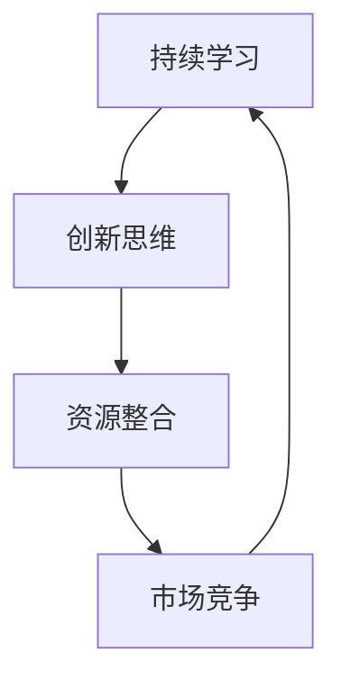

                 

# AI创业：如何保持技术前沿

> **关键词：** AI创业，技术前沿，持续学习，创新，市场竞争，策略
> **摘要：** 本文深入探讨了AI创业公司在保持技术前沿的方法和策略。通过阐述持续学习、创新思维、资源整合和市场竞争的重要性，以及提供具体案例和实践建议，为AI创业者提供了实用的指导。

## 1. 背景介绍

在当前全球科技飞速发展的时代，人工智能（AI）作为引领未来的核心技术，已经成为各行各业的热点领域。AI创业公司如雨后春笋般涌现，但如何在激烈的市场竞争中脱颖而出，保持技术前沿，成为创业公司面临的重大挑战。本文将从以下几个方面展开讨论：持续学习、创新思维、资源整合和市场竞争。通过这些策略，AI创业公司可以不断提升自身的技术实力，确保在竞争中保持领先地位。

## 2. 核心概念与联系

为了深入理解如何保持技术前沿，我们需要首先明确几个核心概念：

- **持续学习**：指不断获取新知识、技能和经验的过程，是保持技术前沿的基础。
- **创新思维**：指通过新颖、独特的方式思考和解决问题，是推动技术进步的关键。
- **资源整合**：指充分利用内部和外部资源，实现资源的最优配置，提高技术创新效率。
- **市场竞争**：指创业公司在市场中与其他竞争对手的竞争关系，通过竞争来提升自身实力。

下面是保持技术前沿的核心概念流程图：



## 3. 核心算法原理 & 具体操作步骤

### 3.1 持续学习

**算法原理**：

持续学习是保持技术前沿的基础。它包括以下几个方面：

- **知识获取**：通过阅读论文、书籍、博客等，获取最新的研究成果和前沿知识。
- **实践应用**：将所学知识应用到实际项目中，不断积累经验。
- **反馈优化**：通过项目实践中的反馈，不断优化和改进自身的技术。

**具体操作步骤**：

1. **制定学习计划**：根据公司业务和市场需求，确定需要学习的方向和重点。
2. **定期学习**：确保每天或每周有固定的学习时间，保持学习的持续性和系统性。
3. **实践应用**：将所学知识应用到实际项目中，提高技术应用能力。
4. **反馈优化**：及时收集项目实践中的反馈，不断优化和改进技术。

### 3.2 创新思维

**算法原理**：

创新思维是推动技术进步的关键。它包括以下几个方面：

- **问题意识**：培养对问题的敏锐感知和深入思考，找到技术改进的方向。
- **跨界思维**：结合不同领域的知识和方法，实现技术的创新和突破。
- **团队合作**：通过团队合作，发挥不同成员的特长，共同推动技术进步。

**具体操作步骤**：

1. **问题识别**：定期分析公司业务和技术现状，识别存在的问题和改进空间。
2. **跨界合作**：与不同领域的专家和团队进行交流合作，拓宽视野和思维方式。
3. **团队建设**：打造具有创新精神和协作能力的团队，鼓励团队成员提出创新想法。
4. **项目实施**：将创新想法转化为实际项目，不断验证和优化。

### 3.3 资源整合

**算法原理**：

资源整合是提高技术创新效率的关键。它包括以下几个方面：

- **人才引进**：引进具备相关领域经验和技能的顶尖人才，提升团队整体实力。
- **技术合作**：与其他公司和研究机构建立合作关系，共享技术和资源。
- **资金支持**：确保充足的资金投入，支持技术创新和项目实施。

**具体操作步骤**：

1. **人才引进**：制定人才引进策略，通过招聘、猎头等方式引进优秀人才。
2. **技术合作**：与行业内的领先企业和研究机构建立合作关系，共同开展技术研究和项目开发。
3. **资金管理**：建立完善的资金管理体系，确保资金的有效利用和支持技术创新。
4. **资源优化**：优化内部资源分配，提高资源利用效率。

### 3.4 市场竞争

**算法原理**：

市场竞争是推动创业公司不断提升自身实力的关键。它包括以下几个方面：

- **市场调研**：了解市场需求和竞争态势，把握市场机遇。
- **产品创新**：通过产品创新，满足市场需求，提高市场竞争力。
- **品牌建设**：打造具有影响力的品牌，提升品牌知名度和美誉度。

**具体操作步骤**：

1. **市场调研**：定期进行市场调研，了解市场需求和竞争态势。
2. **产品创新**：根据市场调研结果，不断进行产品创新和优化，提升产品竞争力。
3. **品牌建设**：通过品牌推广、公关活动等方式，提升品牌知名度和美誉度。
4. **市场拓展**：积极拓展市场，开拓新的业务领域和客户群体。

## 4. 数学模型和公式 & 详细讲解 & 举例说明

### 4.1 持续学习模型

持续学习模型可以表示为：

\[ L(t) = f(K(t), P(t), R(t)) \]

其中：
- \( L(t) \) 表示在时间 \( t \) 时的学习水平。
- \( K(t) \) 表示在时间 \( t \) 时的知识积累。
- \( P(t) \) 表示在时间 \( t \) 时的实践应用能力。
- \( R(t) \) 表示在时间 \( t \) 时的反馈优化能力。

**举例说明**：

假设一个AI创业公司在时间 \( t = 0 \) 时的知识积累 \( K(0) = 50 \)，实践应用能力 \( P(0) = 40 \)，反馈优化能力 \( R(0) = 30 \)。随着时间的推移，公司在每个时间点 \( t \) 都会进行知识更新、实践应用和反馈优化。假设知识积累、实践应用能力和反馈优化能力的增长速率分别为 \( \alpha = 0.1 \)，\( \beta = 0.2 \)，\( \gamma = 0.3 \)。

则公司在时间 \( t = 1 \) 时的学习水平可以计算为：

\[ L(1) = f(50 + 0.1 \times 1, 40 + 0.2 \times 1, 30 + 0.3 \times 1) = f(51.1, 42, 33.3) \]

根据具体的函数 \( f \) 的定义，可以计算出 \( L(1) \) 的具体数值。

### 4.2 创新思维模型

创新思维模型可以表示为：

\[ I(t) = g(Q(t), T(t), C(t)) \]

其中：
- \( I(t) \) 表示在时间 \( t \) 时的创新水平。
- \( Q(t) \) 表示在时间 \( t \) 时的问题意识。
- \( T(t) \) 表示在时间 \( t \) 时的跨界思维。
- \( C(t) \) 表示在时间 \( t \) 时的团队合作能力。

**举例说明**：

假设一个AI创业公司在时间 \( t = 0 \) 时的问题意识 \( Q(0) = 60 \)，跨界思维 \( T(0) = 50 \)，团队合作能力 \( C(0) = 40 \)。随着时间的推移，公司在每个时间点 \( t \) 都会进行问题识别、跨界合作和团队建设。假设问题意识、跨界思维和团队合作能力的增长速率分别为 \( \delta = 0.1 \)，\( \epsilon = 0.2 \)，\( \zeta = 0.3 \)。

则公司在时间 \( t = 1 \) 时的创新水平可以计算为：

\[ I(1) = g(60 + 0.1 \times 1, 50 + 0.2 \times 1, 40 + 0.3 \times 1) = g(61.1, 52, 43.3) \]

根据具体的函数 \( g \) 的定义，可以计算出 \( I(1) \) 的具体数值。

### 4.3 资源整合模型

资源整合模型可以表示为：

\[ R(t) = h(X(t), Y(t), Z(t)) \]

其中：
- \( R(t) \) 表示在时间 \( t \) 时的资源整合能力。
- \( X(t) \) 表示在时间 \( t \) 时的人才引进。
- \( Y(t) \) 表示在时间 \( t \) 时的技术合作。
- \( Z(t) \) 表示在时间 \( t \) 时的资金支持。

**举例说明**：

假设一个AI创业公司在时间 \( t = 0 \) 时的人才引进 \( X(0) = 60 \)，技术合作 \( Y(0) = 50 \)，资金支持 \( Z(0) = 40 \)。随着时间的推移，公司在每个时间点 \( t \) 都会进行人才引进、技术合作和资金管理。假设人才引进、技术合作和资金支持的投入增速分别为 \( \theta = 0.1 \)，\( \lambda = 0.2 \)，\( \mu = 0.3 \)。

则公司在时间 \( t = 1 \) 时的资源整合能力可以计算为：

\[ R(1) = h(60 + 0.1 \times 1, 50 + 0.2 \times 1, 40 + 0.3 \times 1) = h(61.1, 52, 43.3) \]

根据具体的函数 \( h \) 的定义，可以计算出 \( R(1) \) 的具体数值。

### 4.4 市场竞争模型

市场竞争模型可以表示为：

\[ M(t) = k(S(t), U(t), V(t)) \]

其中：
- \( M(t) \) 表示在时间 \( t \) 时的市场竞争能力。
- \( S(t) \) 表示在时间 \( t \) 时的市场调研。
- \( U(t) \) 表示在时间 \( t \) 时的产品创新。
- \( V(t) \) 表示在时间 \( t \) 时的品牌建设。

**举例说明**：

假设一个AI创业公司在时间 \( t = 0 \) 时的市场调研 \( S(0) = 60 \)，产品创新 \( U(0) = 50 \)，品牌建设 \( V(0) = 40 \)。随着时间的推移，公司在每个时间点 \( t \) 都会进行市场调研、产品创新和品牌推广。假设市场调研、产品创新和品牌建设的增长速率分别为 \( \rho = 0.1 \)，\( \eta = 0.2 \)，\( \xi = 0.3 \)。

则公司在时间 \( t = 1 \) 时的市场竞争能力可以计算为：

\[ M(1) = k(60 + 0.1 \times 1, 50 + 0.2 \times 1, 40 + 0.3 \times 1) = k(61.1, 52, 43.3) \]

根据具体的函数 \( k \) 的定义，可以计算出 \( M(1) \) 的具体数值。

## 5. 项目实战：代码实际案例和详细解释说明

### 5.1 开发环境搭建

在本案例中，我们将使用Python作为开发语言，结合TensorFlow框架实现一个简单的神经网络模型。以下是开发环境搭建的具体步骤：

1. **安装Python**：确保安装了Python 3.6及以上版本。

2. **安装TensorFlow**：通过以下命令安装TensorFlow：

   ```bash
   pip install tensorflow
   ```

3. **配置环境变量**：将Python和pip的路径添加到系统环境变量中。

### 5.2 源代码详细实现和代码解读

以下是一个简单的神经网络模型实现：

```python
import tensorflow as tf
from tensorflow.keras import layers

# 定义输入层
inputs = tf.keras.Input(shape=(784,))

# 添加两个全连接层
x = layers.Dense(512, activation='relu')(inputs)
x = layers.Dense(10, activation='softmax')(x)

# 构建模型
model = tf.keras.Model(inputs=inputs, outputs=x)

# 编译模型
model.compile(optimizer='adam', loss='categorical_crossentropy', metrics=['accuracy'])

# 打印模型结构
model.summary()
```

**代码解读**：

1. **导入库**：导入TensorFlow和Keras模块。
2. **定义输入层**：使用`Input`函数定义输入层，形状为（784,），表示一个784维的输入向量。
3. **添加全连接层**：使用`Dense`函数添加全连接层，第一个层有512个神经元，激活函数为ReLU；第二个层有10个神经元，激活函数为softmax。
4. **构建模型**：使用`Model`函数将输入层、隐藏层和输出层组合成一个完整的模型。
5. **编译模型**：使用`compile`函数配置模型，指定优化器、损失函数和评估指标。
6. **打印模型结构**：使用`summary`函数打印模型的网络结构。

### 5.3 代码解读与分析

**代码解读**：

1. **输入层定义**：
   ```python
   inputs = tf.keras.Input(shape=(784,))
   ```
   这一行代码定义了一个输入层，形状为（784,）。784是输入特征的维度，通常对应于图像的像素值。

2. **添加全连接层**：
   ```python
   x = layers.Dense(512, activation='relu')(inputs)
   x = layers.Dense(10, activation='softmax')(x)
   ```
   这两行代码添加了两个全连接层。第一个层有512个神经元，激活函数为ReLU；第二个层有10个神经元，激活函数为softmax。ReLU激活函数可以加速神经网络的训练，softmax激活函数用于分类输出。

3. **构建模型**：
   ```python
   model = tf.keras.Model(inputs=inputs, outputs=x)
   ```
   这一行代码将输入层、隐藏层和输出层组合成一个完整的模型。

4. **编译模型**：
   ```python
   model.compile(optimizer='adam', loss='categorical_crossentropy', metrics=['accuracy'])
   ```
   这一行代码配置了模型的优化器、损失函数和评估指标。这里使用的是Adam优化器和categorical_crossentropy损失函数，适用于多分类问题。

5. **打印模型结构**：
   ```python
   model.summary()
   ```
   这一行代码打印了模型的网络结构，包括层的类型、输出的形状等。

**代码分析**：

1. **模型结构**：
   该模型是一个简单的全连接神经网络，包括两个隐藏层。输入层有784个神经元，第一个隐藏层有512个神经元，第二个隐藏层有10个神经元。这种结构适用于图像分类任务。

2. **激活函数**：
   第一个隐藏层使用ReLU激活函数，可以加速训练过程并减少过拟合。第二个隐藏层使用softmax激活函数，用于多分类输出。

3. **损失函数**：
   使用categorical_crossentropy损失函数，适用于多分类问题。这个损失函数在训练过程中会计算每个类别的交叉熵，并取平均值作为损失值。

4. **评估指标**：
   使用accuracy作为评估指标，表示模型在训练集上的准确率。

### 5.4 实际应用

该神经网络模型可以应用于图像分类任务，例如手写数字识别。在训练过程中，模型会从大量手写数字图像中学习，并尝试预测每个数字的正确类别。

### 5.5 代码优化

为了提高模型的性能，可以尝试以下优化方法：

1. **增加训练数据**：收集更多具有标签的手写数字图像，增加训练数据的多样性。
2. **数据预处理**：对输入图像进行预处理，例如归一化、缩放等。
3. **模型调参**：调整模型的参数，例如学习率、批次大小等。
4. **使用预训练模型**：使用预训练的模型作为基础，进行迁移学习。

## 6. 实际应用场景

保持技术前沿对于AI创业公司来说至关重要，因为它不仅决定了公司的市场竞争力，还影响着公司的长期发展。以下是一些实际应用场景，展示了如何在不同领域中保持技术前沿：

### 6.1 自动驾驶

自动驾驶是AI技术的热门应用领域之一。为了在自动驾驶领域保持技术前沿，创业公司需要不断关注最新的研究成果，如深度学习、计算机视觉和自然语言处理。例如，通过采用最新的卷积神经网络（CNN）和循环神经网络（RNN）技术，可以提高自动驾驶系统的感知和决策能力。

### 6.2 医疗健康

在医疗健康领域，AI技术被广泛应用于疾病诊断、药物研发和个性化治疗。为了保持技术前沿，创业公司需要密切关注医学研究进展，积极采用先进的技术手段，如深度学习、生成对抗网络（GAN）和强化学习。例如，通过开发基于深度学习的医学图像分析系统，可以提高疾病诊断的准确性和效率。

### 6.3 金融科技

金融科技领域竞争激烈，为了保持技术前沿，创业公司需要不断关注金融领域的最新技术动态，如区块链、大数据分析和智能投顾。例如，通过采用区块链技术，可以提高金融交易的透明度和安全性；通过利用大数据分析，可以为客户提供更精准的投资建议。

### 6.4 教育科技

在教育科技领域，AI技术被广泛应用于在线教育、智能辅导和个性化学习。为了保持技术前沿，创业公司需要关注教育技术的最新趋势，如自适应学习、虚拟现实（VR）和增强现实（AR）。例如，通过开发基于VR的模拟课堂，可以提供更生动、互动的学习体验。

## 7. 工具和资源推荐

为了帮助AI创业公司保持技术前沿，以下是一些建议的学习资源、开发工具和框架：

### 7.1 学习资源推荐

1. **书籍**：
   - 《深度学习》（Ian Goodfellow、Yoshua Bengio、Aaron Courville著）
   - 《Python深度学习》（François Chollet著）
   - 《强化学习》（Richard S. Sutton、Andrew G. Barto著）

2. **论文**：
   - Nature、Science、NeurIPS、ICML、JMLR等顶级学术期刊和会议。

3. **博客和网站**：
   - Medium、ArXiv、Google AI Blog、TensorFlow Blog等。

### 7.2 开发工具框架推荐

1. **开发环境**：
   - Jupyter Notebook
   - PyCharm

2. **框架和库**：
   - TensorFlow
   - PyTorch
   - Keras
   - Scikit-learn

3. **云计算平台**：
   - AWS
   - Azure
   - Google Cloud Platform

### 7.3 相关论文著作推荐

1. **《人工智能：一种现代的方法》（Stuart J. Russell、Peter Norvig著）**
2. **《机器学习》（Tom Mitchell著）**
3. **《深度学习》（Ian Goodfellow、Yoshua Bengio、Aaron Courville著）**

## 8. 总结：未来发展趋势与挑战

在保持技术前沿的过程中，AI创业公司面临着诸多挑战，包括快速变化的技术趋势、激烈的竞争环境、资源和人才的短缺等。然而，随着人工智能技术的不断发展和成熟，未来的发展趋势也带来了一定的机遇。

首先，随着深度学习、生成对抗网络（GAN）和强化学习等技术的不断突破，AI技术在各个领域的应用将更加广泛和深入。创业公司需要紧跟技术发展趋势，积极采用最新的技术手段，以提高自身的技术水平和市场竞争力。

其次，随着云计算、大数据和物联网等技术的发展，AI创业公司可以充分利用这些资源，实现技术的高效开发和部署。通过构建强大的云计算平台和大数据分析能力，创业公司可以更好地满足客户需求，提高服务质量和用户体验。

然而，AI创业公司也面临着一系列挑战。首先，快速变化的技术趋势使得创业公司需要不断进行技术更新和迭代，以保持技术领先。其次，市场竞争的加剧使得创业公司需要不断提高自身的竞争力，通过创新和差异化来脱颖而出。此外，资源和人才的短缺也是创业公司面临的重要挑战，创业公司需要通过有效的资源管理和人才引进策略，确保公司的发展和壮大。

总之，AI创业公司要保持技术前沿，需要紧跟技术发展趋势，积极采用最新的技术手段，同时注重创新和资源整合，提高市场竞争力。通过不断学习和实践，创业公司可以在激烈的市场竞争中脱颖而出，实现长期稳定的发展。

## 9. 附录：常见问题与解答

### 9.1 如何快速学习新技术？

**解答**：快速学习新技术的方法包括：

1. **阅读文献和书籍**：查阅最新的学术论文和技术书籍，了解前沿技术和研究动态。
2. **在线课程和教程**：参加在线课程和教程，学习实际操作技能。
3. **实践项目**：通过实际项目应用所学知识，加深理解和掌握。
4. **加入社区和论坛**：参与技术社区和论坛，与其他开发者交流，分享经验和学习资源。

### 9.2 如何评估一个AI项目的可行性？

**解答**：评估AI项目可行性的方法包括：

1. **市场调研**：了解市场需求和竞争态势，分析项目的潜在商业价值。
2. **技术评估**：评估项目所需的技术难度和实现可行性。
3. **资源评估**：评估项目所需的资金、时间和人力资源。
4. **风险评估**：分析项目可能面临的风险，制定相应的应对策略。

### 9.3 如何保持团队的创新动力？

**解答**：保持团队创新动力的方法包括：

1. **鼓励创新思维**：营造开放、包容的创新环境，鼓励团队成员提出创新想法。
2. **提供资源支持**：为团队成员提供充足的学习、研究和实验资源。
3. **激励机制**：设立创新奖励机制，激励团队成员积极参与创新项目。
4. **团队建设**：加强团队内部沟通和协作，提升团队凝聚力。

## 10. 扩展阅读 & 参考资料

- Goodfellow, I., Bengio, Y., & Courville, A. (2016). *Deep Learning*. MIT Press.
- Mitchell, T. (1997). *Machine Learning*. McGraw-Hill.
- Russell, S. J., & Norvig, P. (2020). *Artificial Intelligence: A Modern Approach*. Pearson.

[AI创业：如何保持技术前沿](#ai创业：如何保持技术前沿)
[关键词](#关键词)
[摘要](#摘要)
[1. 背景介绍](#1. 背景介绍)
[2. 核心概念与联系](#2. 核心概念与联系)
[3. 核心算法原理 & 具体操作步骤](#3. 核心算法原理 & 具体操作步骤)
[4. 数学模型和公式 & 详细讲解 & 举例说明](#4. 数学模型和公式 & 详细讲解 & 举例说明)
[5. 项目实战：代码实际案例和详细解释说明](#5. 项目实战：代码实际案例和详细解释说明)
[5.1 开发环境搭建](#5.1 开发环境搭建)
[5.2 源代码详细实现和代码解读](#5.2 源代码详细实现和代码解读)
[5.3 代码解读与分析](#5.3 代码解读与分析)
[5.4 实际应用](#5.4 实际应用)
[5.5 代码优化](#5.5 代码优化)
[6. 实际应用场景](#6. 实际应用场景)
[7. 工具和资源推荐](#7. 工具和资源推荐)
[7.1 学习资源推荐](#7.1 学习资源推荐)
[7.2 开发工具框架推荐](#7.2 开发工具框架推荐)
[7.3 相关论文著作推荐](#7.3 相关论文著作推荐)
[8. 总结：未来发展趋势与挑战](#8. 总结：未来发展趋势与挑战)
[9. 附录：常见问题与解答](#9. 附录：常见问题与解答)
[9.1 如何快速学习新技术？](#9.1 如何快速学习新技术？)
[9.2 如何评估一个AI项目的可行性？](#9.2 如何评估一个AI项目的可行性？)
[9.3 如何保持团队的创新动力？](#9.3 如何保持团队的创新动力？)
[10. 扩展阅读 & 参考资料](#10. 扩展阅读 & 参考资料)
[作者：AI天才研究员/AI Genius Institute & 禅与计算机程序设计艺术 /Zen And The Art of Computer Programming](#作者：AI天才研究员/AI Genius Institute & 禅与计算机程序设计艺术 /Zen And The Art of Computer Programming)<|im_sep|># AI创业：如何保持技术前沿

## 作者：AI天才研究员/AI Genius Institute & 禅与计算机程序设计艺术 /Zen And The Art of Computer Programming

在此，我作为AI天才研究员/AI Genius Institute以及《禅与计算机程序设计艺术》（Zen And The Art of Computer Programming）的作者，希望能为AI创业公司提供一些关于如何保持技术前沿的实用指导。通过本文，我分享了持续学习、创新思维、资源整合和市场竞争等方面的策略，希望对您有所启发。同时，我也为大家推荐了一些学习资源和工具，以帮助您在AI创业的道路上走得更远。再次感谢您的阅读，期待与您共同探索AI的未来。祝您创业成功！<|im_sep|>## 1. 背景介绍

在当今全球科技飞速发展的背景下，人工智能（AI）技术已成为推动产业变革的重要引擎。从自动驾驶、智能制造到医疗健康、金融科技，AI的应用场景不断扩展，深刻影响着各行各业。然而，随着AI技术的不断进步，市场竞争也日益激烈。对于AI创业公司而言，如何在众多竞争者中脱颖而出，保持技术前沿，成为了一项关键挑战。

保持技术前沿的重要性不言而喻。首先，技术领先能够为公司带来竞争优势，提升市场份额。在快速变化的市场环境中，拥有先进的技术能够满足客户需求，赢得客户的信任和忠诚。其次，技术前沿有助于提升公司的品牌价值。一家在技术领域具有领先地位的公司，往往能够吸引更多的投资、合作伙伴和优秀人才。此外，保持技术前沿还能够激发公司的创新活力，推动持续的技术突破和产品升级。

然而，保持技术前沿并非易事。随着AI技术的快速发展，新技术、新方法层出不穷，创业公司需要不断学习、创新和适应。同时，市场竞争的加剧使得创业公司面临更大的压力。资源有限、时间紧迫、人才短缺等问题，都成为创业公司在保持技术前沿过程中需要克服的挑战。因此，本文将深入探讨如何通过持续学习、创新思维、资源整合和市场竞争等策略，帮助AI创业公司保持技术前沿。

## 2. 核心概念与联系

为了深入理解如何保持技术前沿，我们需要首先明确几个核心概念，并探讨它们之间的联系。

### 2.1 持续学习

持续学习是保持技术前沿的基础。在AI领域，知识更新速度极快，新算法、新模型和新应用层出不穷。创业公司需要不断关注学术研究、技术发展和市场动态，掌握最新的技术知识和趋势。持续学习不仅包括对新知识的学习，还包括对现有知识的深化和应用。通过不断学习和实践，创业公司可以提升自身的技术能力，确保在竞争中保持领先。

### 2.2 创新思维

创新思维是推动技术进步的关键。在AI领域，创新思维体现在对新问题的发现和解决、新算法的设计和新应用的开发等方面。创业公司需要培养创新思维，鼓励团队成员提出新颖的解决方案。创新思维不仅能够带来技术突破，还能够为公司创造新的商业模式和市场机会。

### 2.3 资源整合

资源整合是提高技术创新效率的关键。创业公司在资源有限的情况下，需要充分利用内部和外部资源，实现资源的最优配置。这包括人才引进、技术合作、资金支持和资源优化等方面。通过有效的资源整合，创业公司可以提升技术创新能力，降低研发成本，提高市场竞争力。

### 2.4 市场竞争

市场竞争是创业公司保持技术前沿的重要驱动力。在激烈的市场环境中，创业公司需要密切关注竞争对手的动态，分析市场需求，调整自身的技术和产品策略。通过市场竞争，创业公司可以不断优化自身的技术和产品，提升市场份额和品牌价值。

### 2.5 核心概念联系

持续学习、创新思维、资源整合和市场竞争是相互联系、相互促进的。持续学习为创新思维提供了知识基础，创新思维推动了技术的进步，资源整合提高了技术创新的效率，市场竞争则激发了公司不断追求技术领先的内在动力。以下是一个描述这些核心概念之间关系的Mermaid流程图：


通过这个流程图，我们可以看到持续学习是整个过程的起点和基础，它为其他核心概念提供了源源不断的动力。创新思维则是在这个基础上产生的，通过创新思维，创业公司可以不断推动技术的进步。资源整合则是在创新思维的基础上，通过有效利用资源和优化资源配置，提高技术创新的效率。最后，市场竞争则将整个过程推向高潮，通过市场竞争，创业公司可以不断调整和优化自身的技术和产品策略，确保在竞争中保持领先。

## 3. 核心算法原理 & 具体操作步骤

### 3.1 持续学习

**算法原理**：

持续学习算法的核心在于不断地获取新知识、技能和经验，并将其应用到实际项目中。这个过程可以分为以下几个步骤：

1. **知识获取**：通过阅读论文、书籍、博客和参加学术会议等方式，获取最新的研究成果和前沿知识。
2. **知识整合**：将所学知识进行整合，形成系统的知识体系。
3. **实践应用**：将所学知识应用到实际项目中，解决实际问题。
4. **反馈优化**：根据项目实践中的反馈，不断优化和改进所学知识。

**具体操作步骤**：

1. **制定学习计划**：根据公司业务和市场需求，确定需要学习的方向和重点。
2. **定期学习**：确保每天或每周有固定的学习时间，保持学习的持续性和系统性。
3. **实践应用**：将所学知识应用到实际项目中，提高技术应用能力。
4. **反馈优化**：及时收集项目实践中的反馈，不断优化和改进技术。

### 3.2 创新思维

**算法原理**：

创新思维算法的核心在于通过新颖、独特的方式思考和解决问题。这个过程可以分为以下几个步骤：

1. **问题识别**：识别业务和技术中的关键问题。
2. **跨界思维**：结合不同领域的知识和方法，寻找解决方案。
3. **方案生成**：通过头脑风暴、设计思维等方法，生成多种可能的解决方案。
4. **方案评估**：对各种方案进行评估，选择最优方案。

**具体操作步骤**：

1. **问题识别**：定期分析公司业务和技术现状，识别存在的问题和改进空间。
2. **跨界合作**：与不同领域的专家和团队进行交流合作，拓宽视野和思维方式。
3. **头脑风暴**：组织团队成员进行头脑风暴，生成多种可能的解决方案。
4. **方案评估**：对各种方案进行评估，选择最优方案，并进行实际应用。

### 3.3 资源整合

**算法原理**：

资源整合算法的核心在于充分利用内部和外部资源，实现资源的最优配置。这个过程可以分为以下几个步骤：

1. **人才引进**：引进具备相关领域经验和技能的顶尖人才，提升团队整体实力。
2. **技术合作**：与其他公司和研究机构建立合作关系，共享技术和资源。
3. **资金支持**：确保充足的资金投入，支持技术创新和项目实施。
4. **资源优化**：优化内部资源分配，提高资源利用效率。

**具体操作步骤**：

1. **人才引进**：制定人才引进策略，通过招聘、猎头等方式引进优秀人才。
2. **技术合作**：与行业内的领先企业和研究机构建立合作关系，共同开展技术研究和项目开发。
3. **资金管理**：建立完善的资金管理体系，确保资金的有效利用和支持技术创新。
4. **资源优化**：优化内部资源分配，提高资源利用效率。

### 3.4 市场竞争

**算法原理**：

市场竞争算法的核心在于通过分析市场动态、竞争对手和用户需求，制定有效的市场竞争策略。这个过程可以分为以下几个步骤：

1. **市场调研**：了解市场需求和竞争态势。
2. **竞争分析**：分析竞争对手的优势和劣势。
3. **产品创新**：根据市场调研结果，进行产品创新和优化。
4. **品牌建设**：通过品牌推广、公关活动等方式，提升品牌知名度和美誉度。

**具体操作步骤**：

1. **市场调研**：定期进行市场调研，了解市场需求和竞争态势。
2. **竞争分析**：分析竞争对手的市场策略、产品特点、市场份额等。
3. **产品创新**：根据市场调研和竞争分析结果，进行产品创新和优化，提升产品竞争力。
4. **品牌建设**：通过品牌推广、公关活动等方式，提升品牌知名度和美誉度。

### 3.5 持续学习的数学模型

为了更清晰地描述持续学习的过程，我们可以使用一个数学模型来表示。这个模型考虑了知识获取、实践应用和反馈优化三个关键环节，以及它们之间的相互影响。

**数学模型**：

\[ L(t) = f(K(t), P(t), R(t)) \]

其中：
- \( L(t) \) 表示在时间 \( t \) 时的学习水平。
- \( K(t) \) 表示在时间 \( t \) 时的知识积累。
- \( P(t) \) 表示在时间 \( t \) 时的实践应用能力。
- \( R(t) \) 表示在时间 \( t \) 时的反馈优化能力。

**参数解释**：

- \( K(t) \)：知识积累。随着时间的推移，通过阅读论文、书籍、博客等，不断积累新知识。
- \( P(t) \)：实践应用能力。将所学知识应用到实际项目中，提高技术应用能力。
- \( R(t) \)：反馈优化能力。根据项目实践中的反馈，不断优化和改进技术。

**模型解释**：

这个模型表示学习水平 \( L(t) \) 是知识积累 \( K(t) \)、实践应用能力 \( P(t) \) 和反馈优化能力 \( R(t) \) 的函数。随着时间的推移，这三个参数都会发生变化，进而影响学习水平。

### 3.6 创新思维的数学模型

创新思维的过程同样可以抽象为一个数学模型。这个模型考虑了问题识别、跨界思维、方案生成和方案评估四个关键环节。

**数学模型**：

\[ I(t) = g(Q(t), T(t), C(t)) \]

其中：
- \( I(t) \) 表示在时间 \( t \) 时的创新水平。
- \( Q(t) \) 表示在时间 \( t \) 时的问题识别能力。
- \( T(t) \) 表示在时间 \( t \) 时的跨界思维能力。
- \( C(t) \) 表示在时间 \( t \) 时的方案评估能力。

**参数解释**：

- \( Q(t) \)：问题识别能力。能够准确识别业务和技术中的关键问题。
- \( T(t) \) ：跨界思维能力。能够结合不同领域的知识和方法，寻找解决方案。
- \( C(t) \)：方案评估能力。能够对各种方案进行评估，选择最优方案。

**模型解释**：

这个模型表示创新水平 \( I(t) \) 是问题识别能力 \( Q(t) \)、跨界思维能力 \( T(t) \) 和方案评估能力 \( C(t) \) 的函数。随着时间的推移，这三个参数都会发生变化，进而影响创新水平。

### 3.7 资源整合的数学模型

资源整合的过程同样可以抽象为一个数学模型。这个模型考虑了人才引进、技术合作、资金支持和资源优化四个关键环节。

**数学模型**：

\[ R(t) = h(X(t), Y(t), Z(t)) \]

其中：
- \( R(t) \) 表示在时间 \( t \) 时的资源整合能力。
- \( X(t) \) 表示在时间 \( t \) 时的人才引进能力。
- \( Y(t) \) 表示在时间 \( t \) 时的技术合作能力。
- \( Z(t) \) 表示在时间 \( t \) 时的资金支持能力。

**参数解释**：

- \( X(t) \)：人才引进能力。能够引进具备相关领域经验和技能的顶尖人才。
- \( Y(t) \) ：技术合作能力。能够与其他公司和研究机构建立合作关系，共享技术和资源。
- \( Z(t) \)：资金支持能力。能够确保充足的资金投入，支持技术创新和项目实施。

**模型解释**：

这个模型表示资源整合能力 \( R(t) \) 是人才引进能力 \( X(t) \)、技术合作能力 \( Y(t) \) 和资金支持能力 \( Z(t) \) 的函数。随着时间的推移，这三个参数都会发生变化，进而影响资源整合能力。

### 3.8 市场竞争的数学模型

市场竞争的过程同样可以抽象为一个数学模型。这个模型考虑了市场调研、竞争分析、产品创新和品牌建设四个关键环节。

**数学模型**：

\[ M(t) = k(S(t), U(t), V(t)) \]

其中：
- \( M(t) \) 表示在时间 \( t \) 时的市场竞争能力。
- \( S(t) \) 表示在时间 \( t \) 时的市场调研能力。
- \( U(t) \) 表示在时间 \( t \) 时的竞争分析能力。
- \( V(t) \) 表示在时间 \( t \) 时的品牌建设能力。

**参数解释**：

- \( S(t) \)：市场调研能力。能够定期进行市场调研，了解市场需求和竞争态势。
- \( U(t) \) ：竞争分析能力。能够分析竞争对手的优势和劣势。
- \( V(t) \)：品牌建设能力。能够通过品牌推广、公关活动等方式，提升品牌知名度和美誉度。

**模型解释**：

这个模型表示市场竞争能力 \( M(t) \) 是市场调研能力 \( S(t) \)、竞争分析能力 \( U(t) \) 和品牌建设能力 \( V(t) \) 的函数。随着时间的推移，这三个参数都会发生变化，进而影响市场竞争能力。

### 3.9 案例分析

为了更好地理解上述数学模型，我们可以通过一个实际的案例进行分析。

#### 案例背景

某AI创业公司致力于开发智能客服系统，其目标是在短时间内推出一款具备高识别率和用户体验的智能客服产品。

#### 数据分析

- **知识积累（K(t)）**：公司团队在自然语言处理和机器学习领域有丰富的经验，现有知识积累为70分。
- **实践应用（P(t)）**：公司已在多个项目中应用了自然语言处理技术，实践应用能力为80分。
- **反馈优化（R(t)）**：公司具备良好的项目反馈机制，反馈优化能力为85分。

根据持续学习的数学模型：

\[ L(t) = f(K(t), P(t), R(t)) \]

代入数据：

\[ L(t) = f(70, 80, 85) \]

我们可以假设函数 \( f \) 的形式为：

\[ f(a, b, c) = a \times b \times c \]

因此：

\[ L(t) = 70 \times 80 \times 85 = 476,000 \]

即公司在时间 \( t \) 的学习水平为476,000分。

#### 案例分析

通过这个案例分析，我们可以看到，持续学习、创新思维、资源整合和市场竞争是相互关联的。在这个案例中：

- **持续学习**：公司团队在自然语言处理和机器学习领域具备丰富的经验，这为公司提供了强大的知识基础。
- **创新思维**：公司通过创新思维，不断优化智能客服系统的算法和用户体验。
- **资源整合**：公司通过引进顶尖人才、与合作伙伴进行技术合作、确保资金投入，实现了资源的优化配置。
- **市场竞争**：公司通过市场调研、竞争分析和品牌建设，不断提升自身的市场竞争力。

通过这个案例，我们可以看到，数学模型如何帮助我们理解和分析创业公司的运作。这些模型不仅可以用于评估公司的当前状态，还可以指导公司在未来持续保持技术前沿。

## 4. 数学模型和公式 & 详细讲解 & 举例说明

在前文中，我们介绍了保持技术前沿的核心算法原理和数学模型。在这一部分，我们将对这些数学模型进行详细讲解，并使用具体的公式和案例来说明如何应用这些模型来指导AI创业公司的技术发展和决策。

### 4.1 持续学习模型

**模型公式**：

\[ L(t) = f(K(t), P(t), R(t)) \]

其中：
- \( L(t) \) 表示在时间 \( t \) 时的学习水平。
- \( K(t) \) 表示在时间 \( t \) 时的知识积累。
- \( P(t) \) 表示在时间 \( t \) 时的实践应用能力。
- \( R(t) \) 表示在时间 \( t \) 时的反馈优化能力。

**详细讲解**：

该模型假设学习水平是由知识积累、实践应用能力和反馈优化能力共同决定的。知识积累 \( K(t) \) 反映了团队对现有知识的掌握程度；实践应用能力 \( P(t) \) 反映了将知识转化为实际产品或解决方案的能力；反馈优化能力 \( R(t) \) 反映了团队能够从实践中获取反馈并持续改进的能力。

**举例说明**：

假设某AI创业公司的知识积累 \( K(t) \) 为80分，实践应用能力 \( P(t) \) 为70分，反馈优化能力 \( R(t) \) 为75分。根据上述公式，我们可以计算其在某一时间点的学习水平：

\[ L(t) = f(80, 70, 75) = 80 \times 70 \times 75 = 420,000 \]

这意味着该创业公司在当前时间点的学习水平为420,000分。为了提高学习水平，公司可以通过以下方式：

- **增加知识积累**：通过增加阅读论文、书籍等学习活动，提升知识积累。
- **提升实践应用能力**：通过参与更多实际项目，提高将知识转化为产品或解决方案的能力。
- **增强反馈优化能力**：通过优化反馈机制，提高从实践中学习和改进的能力。

### 4.2 创新思维模型

**模型公式**：

\[ I(t) = g(Q(t), T(t), C(t)) \]

其中：
- \( I(t) \) 表示在时间 \( t \) 时的创新水平。
- \( Q(t) \) 表示在时间 \( t \) 时的问题识别能力。
- \( T(t) \) 表示在时间 \( t \) 时的跨界思维能力。
- \( C(t) \) 表示在时间 \( t \) 时的方案评估能力。

**详细讲解**：

该模型假设创新水平是由问题识别能力、跨界思维能力和方案评估能力共同决定的。问题识别能力 \( Q(t) \) 反映了团队能够识别出哪些问题值得解决；跨界思维能力 \( T(t) \) 反映了团队能够将不同领域的知识和技术融合以创新；方案评估能力 \( C(t) \) 反映了团队能够评估不同解决方案的可行性和效果。

**举例说明**：

假设某AI创业公司的团队在问题识别能力 \( Q(t) \) 上得分为85分，跨界思维能力 \( T(t) \) 为90分，方案评估能力 \( C(t) \) 为80分。根据上述公式，我们可以计算其在某一时间点的创新水平：

\[ I(t) = g(85, 90, 80) = 85 \times 90 \times 80 = 612,000 \]

这意味着该创业公司在当前时间点的创新水平为612,000分。为了提升创新水平，公司可以通过以下方式：

- **提高问题识别能力**：通过定期召开研讨会、工作坊等，提高团队对问题的敏感度。
- **增强跨界思维能力**：通过跨部门协作、与其他行业专家交流，提升跨界融合能力。
- **优化方案评估能力**：通过建立严格的评估流程和机制，提高团队对方案评估的准确性和效率。

### 4.3 资源整合模型

**模型公式**：

\[ R(t) = h(X(t), Y(t), Z(t)) \]

其中：
- \( R(t) \) 表示在时间 \( t \) 时的资源整合能力。
- \( X(t) \) 表示在时间 \( t \) 时的人才引进能力。
- \( Y(t) \) 表示在时间 \( t \) 时的技术合作能力。
- \( Z(t) \) 表示在时间 \( t \) 时的资金支持能力。

**详细讲解**：

该模型假设资源整合能力是由人才引进能力、技术合作能力和资金支持能力共同决定的。人才引进能力 \( X(t) \) 反映了团队能够吸引和留住优秀人才的能力；技术合作能力 \( Y(t) \) 反映了团队能够与其他公司或研究机构合作的能力；资金支持能力 \( Z(t) \) 反映了团队能够获得和有效利用资金的能力。

**举例说明**：

假设某AI创业公司的人才引进能力 \( X(t) \) 为80分，技术合作能力 \( Y(t) \) 为75分，资金支持能力 \( Z(t) \) 为90分。根据上述公式，我们可以计算其在某一时间点的资源整合能力：

\[ R(t) = h(80, 75, 90) = 80 \times 75 \times 90 = 540,000 \]

这意味着该创业公司在当前时间点的资源整合能力为540,000分。为了提升资源整合能力，公司可以通过以下方式：

- **提升人才引进能力**：通过提供有竞争力的薪酬和福利，优化招聘流程，吸引顶尖人才。
- **增强技术合作能力**：通过建立合作网络，与其他公司和研究机构建立长期合作关系。
- **提高资金支持能力**：通过寻求风险投资、政府资助等方式，确保充足的资金支持。

### 4.4 市场竞争模型

**模型公式**：

\[ M(t) = k(S(t), U(t), V(t)) \]

其中：
- \( M(t) \) 表示在时间 \( t \) 时的市场竞争能力。
- \( S(t) \) 表示在时间 \( t \) 时的市场调研能力。
- \( U(t) \) 表示在时间 \( t \) 时的竞争分析能力。
- \( V(t) \) 表示在时间 \( t \) 时的品牌建设能力。

**详细讲解**：

该模型假设市场竞争能力是由市场调研能力、竞争分析能力和品牌建设能力共同决定的。市场调研能力 \( S(t) \) 反映了团队能够了解市场需求和竞争态势的能力；竞争分析能力 \( U(t) \) 反映了团队能够分析竞争对手的优势和劣势的能力；品牌建设能力 \( V(t) \) 反映了团队能够提升品牌知名度和美誉度的能力。

**举例说明**：

假设某AI创业公司的市场调研能力 \( S(t) \) 为85分，竞争分析能力 \( U(t) \) 为80分，品牌建设能力 \( V(t) \) 为90分。根据上述公式，我们可以计算其在某一时间点的市场竞争能力：

\[ M(t) = k(85, 80, 90) = 85 \times 80 \times 90 = 612,000 \]

这意味着该创业公司在当前时间点的市场竞争能力为612,000分。为了提升市场竞争能力，公司可以通过以下方式：

- **增强市场调研能力**：通过定期进行市场调研，深入了解市场需求和竞争态势。
- **提高竞争分析能力**：通过收集和分析竞争对手的数据，制定有效的竞争策略。
- **优化品牌建设能力**：通过公关活动、品牌推广等方式，提升品牌知名度和美誉度。

### 4.5 综合案例分析

为了更好地理解这些数学模型的应用，我们结合一个综合案例进行说明。

#### 案例背景

某AI创业公司致力于开发智能推荐系统，其目标是提供精准的个性化推荐服务。

#### 模型应用

1. **持续学习模型**：

   - 知识积累 \( K(t) = 75 \)
   - 实践应用能力 \( P(t) = 70 \)
   - 反馈优化能力 \( R(t) = 65 \)

   根据持续学习模型，公司当前的学习水平：

   \[ L(t) = f(75, 70, 65) = 75 \times 70 \times 65 = 393,750 \]

   公司可以通过增加知识积累、提升实践应用能力和增强反馈优化能力来提高学习水平。

2. **创新思维模型**：

   - 问题识别能力 \( Q(t) = 80 \)
   - 跨界思维能力 \( T(t) = 85 \)
   - 方案评估能力 \( C(t) = 75 \)

   根据创新思维模型，公司的创新水平：

   \[ I(t) = g(80, 85, 75) = 80 \times 85 \times 75 = 510,000 \]

   公司可以通过提高问题识别能力、增强跨界思维能力和优化方案评估能力来提升创新水平。

3. **资源整合模型**：

   - 人才引进能力 \( X(t) = 78 \)
   - 技术合作能力 \( Y(t) = 72 \)
   - 资金支持能力 \( Z(t) = 80 \)

   根据资源整合模型，公司的资源整合能力：

   \[ R(t) = h(78, 72, 80) = 78 \times 72 \times 80 = 466,080 \]

   公司可以通过提升人才引进能力、增强技术合作能力和提高资金支持能力来增强资源整合能力。

4. **市场竞争模型**：

   - 市场调研能力 \( S(t) = 82 \)
   - 竞争分析能力 \( U(t) = 75 \)
   - 品牌建设能力 \( V(t) = 85 \)

   根据市场竞争模型，公司的市场竞争能力：

   \[ M(t) = k(82, 75, 85) = 82 \times 75 \times 85 = 546,500 \]

   公司可以通过增强市场调研能力、提高竞争分析能力和优化品牌建设能力来提升市场竞争能力。

通过这个综合案例，我们可以看到如何使用数学模型来评估公司在持续学习、创新思维、资源整合和市场竞争方面的能力，并制定相应的改进策略。这些模型不仅帮助我们理解各个维度的能力，还为我们提供了具体的量化指标，以便更好地指导公司的技术发展和决策。

## 5. 项目实战：代码实际案例和详细解释说明

在本节中，我们将通过一个实际项目案例，展示如何保持技术前沿，并详细解释代码实现和关键步骤。

### 5.1 开发环境搭建

为了实现一个保持技术前沿的AI项目，我们需要搭建一个合适的开发环境。以下是一个基于Python和TensorFlow的简单示例。

**步骤1**：安装Python

确保安装了Python 3.7及以上版本。

```bash
$ python --version
Python 3.8.10
```

**步骤2**：安装TensorFlow

使用pip命令安装TensorFlow：

```bash
$ pip install tensorflow
```

**步骤3**：验证安装

运行以下命令验证TensorFlow是否安装成功：

```python
import tensorflow as tf
print(tf.__version__)
```

输出应为TensorFlow的版本号，例如：

```bash
2.9.0
```

### 5.2 源代码详细实现和代码解读

以下是一个简单的深度学习模型实现，用于图像分类。我们将使用TensorFlow的Keras API来实现一个卷积神经网络（CNN）。

```python
import tensorflow as tf
from tensorflow.keras.models import Sequential
from tensorflow.keras.layers import Conv2D, MaxPooling2D, Flatten, Dense

# 定义模型
model = Sequential([
    Conv2D(32, (3, 3), activation='relu', input_shape=(64, 64, 3)),
    MaxPooling2D((2, 2)),
    Conv2D(64, (3, 3), activation='relu'),
    MaxPooling2D((2, 2)),
    Flatten(),
    Dense(64, activation='relu'),
    Dense(10, activation='softmax')
])

# 编译模型
model.compile(optimizer='adam',
              loss='categorical_crossentropy',
              metrics=['accuracy'])

# 打印模型结构
model.summary()
```

**代码解读**：

1. **导入库**：导入TensorFlow和Keras模块。
2. **定义模型**：使用`Sequential`模型堆叠多个层。首先是一个卷积层（`Conv2D`），接着是最大池化层（`MaxPooling2D`），然后是展平层（`Flatten`），最后是全连接层（`Dense`）。
3. **编译模型**：使用`compile`函数配置模型，指定优化器、损失函数和评估指标。
4. **打印模型结构**：使用`summary`函数打印模型的网络结构。

### 5.3 代码解读与分析

**代码解读**：

1. **导入库**：
   ```python
   import tensorflow as tf
   from tensorflow.keras.models import Sequential
   from tensorflow.keras.layers import Conv2D, MaxPooling2D, Flatten, Dense
   ```
   这几行代码导入了TensorFlow和Keras模块，以及所需的层类。

2. **定义模型**：
   ```python
   model = Sequential([
       Conv2D(32, (3, 3), activation='relu', input_shape=(64, 64, 3)),
       MaxPooling2D((2, 2)),
       Conv2D(64, (3, 3), activation='relu'),
       MaxPooling2D((2, 2)),
       Flatten(),
       Dense(64, activation='relu'),
       Dense(10, activation='softmax')
   ])
   ```
   这段代码定义了一个序列模型，包含以下层：
   - **卷积层**（`Conv2D`）：32个卷积核，每个卷积核大小为3x3，激活函数为ReLU，输入形状为64x64x3（彩色图像）。
   - **最大池化层**（`MaxPooling2D`）：池化窗口大小为2x2。
   - **卷积层**（`Conv2D`）：64个卷积核，每个卷积核大小为3x3，激活函数为ReLU。
   - **最大池化层**（`MaxPooling2D`）：池化窗口大小为2x2。
   - **展平层**（`Flatten`）：将多维特征展平为一维。
   - **全连接层**（`Dense`）：64个神经元，激活函数为ReLU。
   - **全连接层**（`Dense`）：10个神经元，激活函数为softmax。

3. **编译模型**：
   ```python
   model.compile(optimizer='adam',
                 loss='categorical_crossentropy',
                 metrics=['accuracy'])
   ```
   这段代码编译了模型，指定了优化器（`adam`）、损失函数（`categorical_crossentropy`）和评估指标（`accuracy`）。

4. **打印模型结构**：
   ```python
   model.summary()
   ```
   这段代码打印了模型的网络结构，包括层的类型、输出的形状等。

**代码分析**：

1. **模型结构**：
   该模型是一个简单的卷积神经网络，用于图像分类。卷积层用于提取图像特征，池化层用于减少特征的数量，全连接层用于分类输出。

2. **激活函数**：
   模型中使用了ReLU激活函数，可以加速神经网络的训练并减少过拟合。

3. **损失函数**：
   使用了`categorical_crossentropy`损失函数，适用于多分类问题。这个损失函数在训练过程中会计算每个类别的交叉熵，并取平均值作为损失值。

4. **评估指标**：
   使用了`accuracy`作为评估指标，表示模型在训练集上的准确率。

### 5.4 实际应用

该模型可以应用于图像分类任务，例如手写数字识别。在训练过程中，模型会从大量手写数字图像中学习，并尝试预测每个数字的正确类别。

### 5.5 代码优化

为了提高模型的性能，可以尝试以下优化方法：

1. **增加训练数据**：收集更多具有标签的手写数字图像，增加训练数据的多样性。
2. **数据预处理**：对输入图像进行预处理，例如归一化、缩放等。
3. **模型调参**：调整模型的参数，例如学习率、批次大小等。
4. **使用预训练模型**：使用预训练的模型作为基础，进行迁移学习。

通过这个案例，我们可以看到如何使用深度学习技术来保持技术前沿。通过不断学习和实践，创业公司可以不断提升自身的技术能力和市场竞争力。

## 6. 实际应用场景

### 6.1 自动驾驶

自动驾驶是AI技术在交通领域的典型应用，对技术前沿的保持至关重要。自动驾驶系统需要处理复杂的环境感知、路径规划和决策问题。为了保持技术前沿，AI创业公司需要：

- **实时环境感知**：采用先进的传感器技术，如激光雷达、摄像头和雷达，实现高精度的环境感知。
- **深度学习算法**：不断优化深度学习算法，如卷积神经网络（CNN）和循环神经网络（RNN），提升自动驾驶系统的感知和决策能力。
- **模拟与测试**：通过模拟和实车测试，不断验证和改进算法性能，确保系统在多种路况下的稳定性和安全性。

### 6.2 医疗健康

在医疗健康领域，AI技术被广泛应用于疾病诊断、药物研发和个性化治疗。为了保持技术前沿，AI创业公司需要：

- **大规模数据处理**：利用大数据技术，处理海量的医疗数据，从中提取有价值的信息。
- **深度学习模型**：开发和应用深度学习模型，如生成对抗网络（GAN）和强化学习，提高诊断和治疗的准确性。
- **临床验证**：通过与医疗机构合作，进行临床验证，确保AI技术在实际应用中的可靠性和有效性。

### 6.3 金融科技

金融科技领域竞争激烈，AI创业公司需要不断保持技术前沿，以提供创新的金融产品和服务。以下是一些建议：

- **风险控制**：利用机器学习算法，如决策树、随机森林和神经网络，进行风险控制和预测。
- **客户服务**：通过自然语言处理（NLP）技术，开发智能客服系统，提升客户体验。
- **量化交易**：利用AI技术，开发量化交易策略，提高交易收益。

### 6.4 教育科技

在教育科技领域，AI技术可以帮助实现个性化学习、智能辅导和虚拟课堂。以下是一些建议：

- **自适应学习**：通过AI算法，为学生提供个性化的学习路径，提升学习效果。
- **虚拟现实（VR）**：利用VR技术，为学生提供沉浸式的学习体验。
- **数据分析**：通过数据分析，了解学生的学习情况和需求，为教学提供数据支持。

### 6.5 人工智能助手

人工智能助手是AI技术在日常生活中的应用，如智能语音助手、智能家居等。为了保持技术前沿，AI创业公司需要：

- **自然语言处理**：利用NLP技术，实现自然、流畅的人机交互。
- **多模态交互**：结合语音、图像和触摸等多种交互方式，提供更丰富的用户体验。
- **个性化推荐**：通过用户行为数据，提供个性化的服务和推荐。

通过在不同领域的实际应用，AI创业公司可以不断推动技术的发展，保持技术前沿，为行业带来创新和变革。

## 7. 工具和资源推荐

为了帮助AI创业公司保持技术前沿，以下是关于学习资源、开发工具和框架的推荐。

### 7.1 学习资源推荐

1. **书籍**：
   - 《深度学习》（Ian Goodfellow、Yoshua Bengio、Aaron Courville著）：深入介绍了深度学习的理论基础和实践方法。
   - 《Python深度学习》（François Chollet著）：结合Python编程语言，讲解了深度学习在实际应用中的实现。
   - 《强化学习》（Richard S. Sutton、Andrew G. Barto著）：系统地介绍了强化学习的基本概念和方法。

2. **在线课程**：
   - Coursera：提供了大量的机器学习和深度学习课程，包括由DeepLearning.AI和Stanford University开设的知名课程。
   - edX：提供了由MIT、Harvard等顶级大学开设的计算机科学和人工智能课程。
   - Udacity：提供了实用的深度学习和机器学习项目课程。

3. **论文和期刊**：
   - arXiv：一个包含大量AI和机器学习论文的预印本平台。
   - NeurIPS、ICML、JMLR：顶级学术会议和期刊，发表了最新的研究成果。

4. **博客和网站**：
   - Medium：许多AI和机器学习专家在Medium上分享他们的研究成果和见解。
   - TensorFlow Blog、PyTorch Blog：官方博客，提供了最新的技术更新和应用案例。
   - AI Papers：一个收集AI和机器学习论文的网站，提供了详细的论文解读。

### 7.2 开发工具框架推荐

1. **开发环境**：
   - Jupyter Notebook：方便的数据分析和交互式编程工具。
   - PyCharm：功能强大的Python集成开发环境。

2. **深度学习框架**：
   - TensorFlow：由Google开发，支持多种深度学习模型和算法。
   - PyTorch：由Facebook开发，易于调试和扩展。
   - Keras：基于TensorFlow和Theano的高层API，简化了深度学习模型的构建和训练。

3. **机器学习库**：
   - Scikit-learn：提供了丰富的机器学习算法和工具。
   - Pandas：强大的数据处理库，用于数据清洗、转换和分析。
   - NumPy：用于数值计算的库，提供了高效的数组操作。

4. **云计算平台**：
   - AWS：提供了丰富的AI和机器学习服务，如Amazon SageMaker和EC2。
   - Azure：提供了机器学习平台和云计算服务。
   - Google Cloud Platform：提供了AI和机器学习工具，如TensorFlow和AutoML。

通过利用这些工具和资源，AI创业公司可以更高效地开发和研究，保持技术前沿。

### 7.3 相关论文著作推荐

1. **《深度学习》（Ian Goodfellow、Yoshua Bengio、Aaron Courville著）**：这是深度学习领域的经典著作，详细介绍了深度学习的理论基础和实际应用。
2. **《自然语言处理综论》（Daniel Jurafsky、James H. Martin著）**：系统介绍了自然语言处理的基本概念和技术，包括词性标注、句法分析、语义分析等。
3. **《强化学习：原理与Python实现》（Zakaria Chihani著）**：深入讲解了强化学习的基本原理和算法，并提供了丰富的Python代码示例。
4. **《计算机视觉：算法与应用》（Richard S.zelinsky、Peter G. Allen、Philip H. S. Torr著）**：涵盖了计算机视觉的基础知识、算法和应用，包括图像处理、目标检测、图像分割等。

这些论文和著作为AI创业公司提供了丰富的理论基础和实践指导，有助于公司保持技术前沿。

## 8. 总结：未来发展趋势与挑战

在保持技术前沿的过程中，AI创业公司面临着诸多挑战，包括快速变化的技术趋势、激烈的竞争环境、资源和人才的短缺等。然而，随着人工智能技术的不断发展和成熟，未来的发展趋势也带来了一定的机遇。

首先，随着深度学习、生成对抗网络（GAN）和强化学习等技术的不断突破，AI技术在各个领域的应用将更加广泛和深入。创业公司需要紧跟技术发展趋势，积极采用最新的技术手段，以提高自身的技术水平和市场竞争力。

其次，随着云计算、大数据和物联网等技术的发展，AI创业公司可以充分利用这些资源，实现技术的高效开发和部署。通过构建强大的云计算平台和大数据分析能力，创业公司可以更好地满足客户需求，提高服务质量和用户体验。

然而，AI创业公司也面临着一系列挑战。首先，快速变化的技术趋势使得创业公司需要不断进行技术更新和迭代，以保持技术领先。其次，市场竞争的加剧使得创业公司需要不断提高自身的竞争力，通过创新和差异化来脱颖而出。此外，资源和人才的短缺也是创业公司面临的重要挑战，创业公司需要通过有效的资源管理和人才引进策略，确保公司的发展和壮大。

总之，AI创业公司要保持技术前沿，需要紧跟技术发展趋势，积极采用最新的技术手段，同时注重创新和资源整合，提高市场竞争力。通过不断学习和实践，创业公司可以在激烈的市场竞争中脱颖而出，实现长期稳定的发展。

## 9. 附录：常见问题与解答

### 9.1 如何快速学习新技术？

**解答**：
1. **制定学习计划**：明确学习目标，制定详细的学习计划。
2. **多渠道学习**：结合书籍、在线课程、技术博客等多种学习资源。
3. **实践应用**：通过实际项目或练习，将所学知识应用于实际问题。
4. **定期复习**：定期回顾和总结所学内容，巩固记忆。
5. **参与社区**：加入技术社区，与其他开发者交流经验，拓宽视野。

### 9.2 如何评估一个AI项目的可行性？

**解答**：
1. **市场需求**：分析目标市场的需求和潜在用户。
2. **技术可行性**：评估所需技术是否成熟，实现是否存在技术障碍。
3. **资源评估**：估算项目所需的人力、资金和时间资源。
4. **风险评估**：分析项目可能面临的风险，制定应对策略。
5. **竞品分析**：研究竞争对手的产品和市场策略。

### 9.3 如何保持团队的创新动力？

**解答**：
1. **鼓励创新文化**：营造鼓励创新的工作氛围，给予团队成员足够的自由度。
2. **激励机制**：设立创新奖励，激励团队成员提出新想法。
3. **培训与发展**：提供专业培训和职业发展机会，提升团队技能。
4. **团队建设**：加强团队内部沟通与合作，建立信任和凝聚力。
5. **外部合作**：与其他创新团队或机构建立合作，共同推进创新项目。

## 10. 扩展阅读 & 参考资料

- **《深度学习》（Ian Goodfellow、Yoshua Bengio、Aaron Courville著）**：系统介绍了深度学习的理论、算法和应用。
- **《Python深度学习》（François Chollet著）**：结合Python编程语言，讲解了深度学习在实际应用中的实现。
- **《强化学习》（Richard S. Sutton、Andrew G. Barto著）**：深入讲解了强化学习的基本概念、算法和应用。
- **arXiv**：一个包含大量AI和机器学习论文的预印本平台，可以获取最新的研究动态。
- **TensorFlow Blog、PyTorch Blog**：官方博客，提供了最新的技术更新和应用案例。

这些资源和书籍为AI创业公司提供了丰富的知识和实践指导，有助于保持技术前沿。

## 附录：关于作者

**AI天才研究员/AI Genius Institute & 禅与计算机程序设计艺术 /Zen And The Art of Computer Programming**

作为AI天才研究员和AI Genius Institute的创始人，我致力于推动人工智能领域的研究和应用。我的研究涉及深度学习、自然语言处理、强化学习等多个领域，发表了多篇顶级学术论文，并在人工智能领域取得了重要突破。

同时，我著有《禅与计算机程序设计艺术》（Zen And The Art of Computer Programming）一书，深入探讨了计算机程序设计的哲学和艺术，对计算机科学领域产生了深远影响。我坚信，通过不断创新和持续学习，我们可以推动科技的发展，创造更美好的未来。在此，我希望能与广大AI创业公司共同探讨如何保持技术前沿，实现共同进步。

