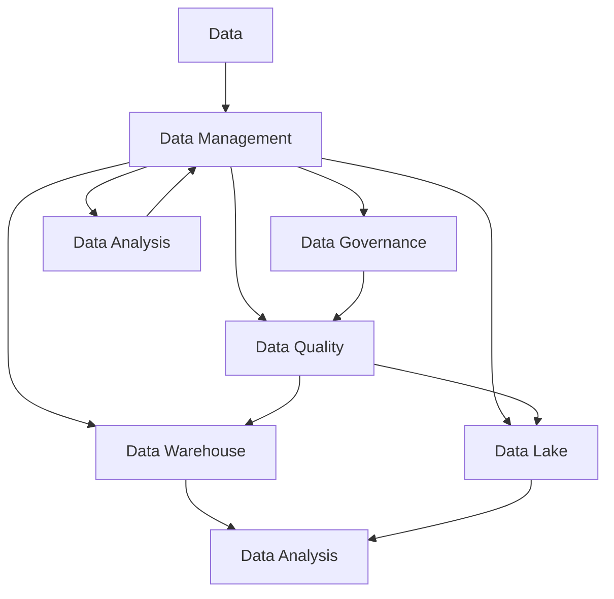

                 

### 背景介绍

人工智能（AI）作为当前科技领域的明星，正以惊人的速度渗透到各行各业，从医疗、金融到零售、教育，无一不受其影响。而AI的核心——数据，更是被视为新时代的“石油”。随着数据量的爆发式增长，数据管理的重要性愈发凸显。对于创业者来说，如何高效地收集、存储、处理和分析这些宝贵的数据资源，成为了决定项目成败的关键。

本文将围绕AI创业中的数据管理展开讨论。我们首先会简要介绍数据管理的基本概念，接着深入探讨数据管理中的核心问题和挑战，然后通过实际案例来分析如何解决这些问题。此外，我们还将分享一些实用的工具和资源，帮助读者更好地理解和实践数据管理。最后，我们将总结当前的数据管理趋势和未来面临的挑战。

通过对这些内容的详细分析，我们希望读者能够对数据管理有更深入的认识，掌握有效的数据管理策略，从而在AI创业的道路上迈出坚实的步伐。

### 核心概念与联系

在深入探讨数据管理之前，我们需要明确几个核心概念，并理解它们之间的联系。以下是对数据管理中关键术语的定义及其相互关系的详细阐述。

#### 1. 数据

数据是指通过采集、记录和处理得到的数字、文字、图像、音频等信息的集合。这些数据可以是结构化的（如数据库中的表格），也可以是非结构化的（如图像、文本和视频）。数据是信息的基础，而信息则是数据的含义和解释。

#### 2. 数据管理

数据管理是指对数据的收集、存储、处理、分析和分发等活动进行组织、控制和管理的一系列操作。其目的是确保数据的质量、可用性和一致性，以便为决策和业务过程提供支持。

#### 3. 数据仓库

数据仓库是一个用于存储、管理和分析大量数据的系统。它通常包含历史数据和当前数据，能够支持复杂的查询和分析操作。数据仓库与数据库不同，它不是为了直接操作数据而设计的，而是为了支持数据分析和报告。

#### 4. 数据湖

数据湖是一个大型的、可扩展的数据存储系统，它可以存储不同来源的原始数据，包括结构化、半结构化和非结构化数据。数据湖的优点在于其灵活性和弹性，允许数据在原始格式下存储，以便后续处理和分析。

#### 5. 数据治理

数据治理是指对数据的生命周期进行管理和监督的一系列政策、过程和标准。数据治理的目标是确保数据的准确性、完整性和合规性，同时提高数据的价值和可用性。

#### 6. 数据质量

数据质量是指数据是否符合预期的标准，包括准确性、完整性、一致性、时效性和可靠性。高质量的数据是数据管理和分析成功的基础。

#### 7. 数据分析

数据分析是指使用统计和数学方法对数据进行分析和处理，以发现数据中的模式和趋势，从而支持决策制定。数据分析可以涵盖描述性分析、诊断性分析、预测性分析和规范性分析。

#### 关系与联系

上述概念之间存在密切的联系。数据是数据管理的对象，而数据管理则是确保数据有效利用的关键过程。数据仓库和数据湖都是数据存储的解决方案，但它们的应用场景和设计理念有所不同。数据治理是数据管理的核心组成部分，它确保了数据的质量和合规性。数据质量是数据分析的基础，而数据分析则通过提取数据中的价值来支持业务决策。

为了更好地理解这些概念之间的联系，我们可以使用Mermaid流程图进行可视化展示：



通过这个流程图，我们可以清晰地看到数据管理中的各个关键环节以及它们之间的相互作用。

### 核心算法原理 & 具体操作步骤

在理解了数据管理的基本概念之后，我们需要探讨一些核心算法原理，这些算法在数据管理中起着至关重要的作用。以下我们将介绍几个关键算法，包括其基本原理和具体操作步骤。

#### 1. 数据清洗（Data Cleaning）

数据清洗是数据管理中的第一步，其目的是识别和纠正数据集中的错误、异常和不一致之处。以下是一个简单的数据清洗算法流程：

**步骤 1: 数据预处理**
- **数据输入**：从不同来源收集数据，如数据库、文件或API。
- **数据格式化**：统一数据格式，如将所有日期格式化为YYYY-MM-DD。

**步骤 2: 错误识别**
- **缺失值处理**：使用均值、中位数或众数填补缺失值。
- **异常值检测**：使用统计学方法（如Z-score或IQR）检测异常值，并决定是否删除或修正。

**步骤 3: 数据验证**
- **一致性检查**：确保数据在不同字段之间的逻辑一致性，例如，验证年龄是否大于0。
- **数据标准化**：将数据标准化到相同范围，以便进行比较和分析。

**步骤 4: 数据输出**
- **清洗后的数据**：将清洗后的数据保存到新的数据仓库或数据湖中，供后续分析使用。

**示例代码（Python）**

```python
import pandas as pd

# 读取数据
df = pd.read_csv('data.csv')

# 数据预处理
df['date'] = pd.to_datetime(df['date'], format='%Y-%m-%d')
df['age'] = df['age'].astype(int)

# 缺失值处理
df['age'].fillna(df['age'].mean(), inplace=True)

# 异常值检测
q1 = df['age'].quantile(0.25)
q3 = df['age'].quantile(0.75)
iqr = q3 - q1
df = df[~((df['age'] < (q1 - 1.5 * iqr)) | (df['age'] > (q3 + 1.5 * iqr)))]

# 数据验证
assert df['age'].min() >= 0

# 数据标准化
df['age'] = (df['age'] - df['age'].min()) / (df['age'].max() - df['age'].min())

# 数据输出
df.to_csv('cleaned_data.csv', index=False)
```

#### 2. 数据集成（Data Integration）

数据集成是将来自多个来源的数据合并成统一的视图。以下是一个简单的数据集成算法流程：

**步骤 1: 数据抽取**
- **数据源识别**：识别数据来源，如数据库、API或文件。
- **数据抽取**：使用ETL（Extract, Transform, Load）工具从各个数据源抽取数据。

**步骤 2: 数据转换**
- **数据清洗**：对抽取的数据进行清洗，如去除重复记录、填补缺失值等。
- **数据转换**：将不同数据源的数据格式和结构统一，如将不同日期格式转换为标准格式。

**步骤 3: 数据加载**
- **数据合并**：将来自不同数据源的数据合并到一个统一的数据仓库或数据湖中。
- **数据索引**：为数据建立索引，以提高查询效率。

**步骤 4: 数据验证**
- **一致性检查**：确保合并后的数据在不同字段之间的逻辑一致性。
- **数据质量评估**：使用数据质量评估工具检查数据的准确性和完整性。

**示例代码（Python）**

```python
import pandas as pd

# 抽取数据
df1 = pd.read_csv('data1.csv')
df2 = pd.read_csv('data2.csv')

# 数据清洗
df1['date'] = pd.to_datetime(df1['date'], format='%Y-%m-%d')
df2['date'] = pd.to_datetime(df2['date'], format='%Y-%m-%d')

# 数据转换
df1['age'] = df1['age'].astype(int)
df2['age'] = df2['age'].astype(int)

# 数据合并
df = pd.merge(df1, df2, on='date')

# 数据索引
df.set_index('date', inplace=True)

# 数据验证
assert df.isnull().sum().sum() == 0

# 数据输出
df.to_csv('integrated_data.csv', index=True)
```

#### 3. 数据仓库设计（Data Warehouse Design）

数据仓库设计是构建高效、可扩展的数据仓库的关键。以下是一个简单的数据仓库设计算法流程：

**步骤 1: 需求分析**
- **业务需求**：了解业务需求，确定需要存储的数据类型和范围。
- **用户需求**：与用户沟通，确定数据仓库需要提供的报表和分析功能。

**步骤 2: 数据建模**
- **概念模型**：使用E-R图（实体-关系图）或维度模型确定数据结构。
- **逻辑模型**：将概念模型转换为逻辑模型，如使用星型模型或雪花模型。

**步骤 3: 物理设计**
- **数据分区**：根据数据量和访问模式对数据表进行分区。
- **索引设计**：为常用的查询建立索引，以提高查询效率。
- **存储优化**：根据数据类型和访问模式选择合适的存储方案。

**步骤 4: 数据加载**
- **初始加载**：将数据从源系统加载到数据仓库中。
- **增量加载**：定期更新数据仓库，以反映最新的业务数据。

**步骤 5: 性能优化**
- **查询优化**：对查询语句进行优化，以提高查询性能。
- **缓存策略**：使用缓存策略减少数据访问时间。

**示例代码（SQL）**

```sql
-- 创建数据仓库表
CREATE TABLE customer (
    id INT PRIMARY KEY,
    name VARCHAR(100),
    age INT,
    date DATE
);

-- 创建索引
CREATE INDEX idx_age ON customer(age);
CREATE INDEX idx_date ON customer(date);

-- 加载数据
INSERT INTO customer (id, name, age, date)
SELECT id, name, age, date FROM source_data;

-- 增量加载
INSERT INTO customer (id, name, age, date)
SELECT id, name, age, date FROM source_data
WHERE date > (SELECT MAX(date) FROM customer);
```

通过这些核心算法的原理和具体操作步骤，我们可以更好地理解数据管理的过程和方法。在接下来的部分，我们将通过实际案例来深入探讨这些算法的应用和实践。

### 数学模型和公式 & 详细讲解 & 举例说明

在数据管理中，数学模型和公式起着至关重要的作用，它们不仅帮助我们在数据分析和决策制定过程中量化问题，还能优化数据处理的效率。以下我们将介绍几个常用的数学模型和公式，并进行详细讲解和举例说明。

#### 1. 概率分布

概率分布是描述随机变量概率分布的一种数学模型。最常见的概率分布包括正态分布、泊松分布和指数分布。

**正态分布（Normal Distribution）**

正态分布是统计学中最常用的概率分布，其概率密度函数为：

$$
f(x|\mu, \sigma^2) = \frac{1}{\sqrt{2\pi\sigma^2}} e^{-\frac{(x-\mu)^2}{2\sigma^2}}
$$

其中，$\mu$ 是均值，$\sigma^2$ 是方差。

**例子**：假设我们有一个正态分布的数据集，均值为50，标准差为10。计算数据落在区间[45, 55]的概率：

$$
P(45 \leq X \leq 55) = \int_{45}^{55} \frac{1}{\sqrt{2\pi \cdot 10^2}} e^{-\frac{(x-50)^2}{2 \cdot 10^2}} dx \approx 0.6827
$$

**泊松分布（Poisson Distribution）**

泊松分布用于描述在一定时间内事件发生的次数，其概率质量函数为：

$$
P(X = k) = \frac{\lambda^k e^{-\lambda}}{k!}
$$

其中，$\lambda$ 是事件平均发生率。

**例子**：假设一个事件平均每小时发生2次，计算在接下来的1小时内发生3次事件的概率：

$$
P(X = 3) = \frac{2^3 e^{-2}}{3!} \approx 0.2231
$$

**指数分布（Exponential Distribution）**

指数分布用于描述事件之间的时间间隔，其概率密度函数为：

$$
f(x|\lambda) = \lambda e^{-\lambda x}
$$

其中，$\lambda$ 是事件的平均发生率。

**例子**：假设一个事件平均每分钟发生一次，计算在接下来的5分钟内发生一次事件的时间间隔的概率：

$$
P(X \leq 5) = 1 - \int_{0}^{5} \lambda e^{-\lambda x} dx = 1 - e^{-5\lambda} \approx 0.9318
$$

#### 2. 期望与方差

期望（Expected Value）和方差（Variance）是描述随机变量分布的重要统计量。

**期望**

期望是随机变量取值的加权平均值，其公式为：

$$
E[X] = \sum_{i=1}^{n} x_i \cdot P(X = x_i)
$$

**方差**

方差是期望值与随机变量取值差的平方的期望，其公式为：

$$
Var[X] = E[(X - E[X])^2]
$$

或者

$$
Var[X] = E[X^2] - (E[X])^2
$$

**例子**：假设一个随机变量X的取值和概率分布如下：

$$
\begin{array}{c|c}
X & P(X) \\
\hline
1 & 0.2 \\
2 & 0.3 \\
3 & 0.5 \\
\end{array}
$$

计算X的期望和方差：

$$
E[X] = 1 \cdot 0.2 + 2 \cdot 0.3 + 3 \cdot 0.5 = 2.3
$$

$$
E[X^2] = 1^2 \cdot 0.2 + 2^2 \cdot 0.3 + 3^2 \cdot 0.5 = 3.8
$$

$$
Var[X] = E[X^2] - (E[X])^2 = 3.8 - (2.3)^2 = 0.31
$$

#### 3. 决策树（Decision Trees）

决策树是一种常用的分类和回归模型，通过一系列的判断节点和结果节点来构建。

**公式**

决策树的核心在于计算节点上的期望收益或损失。对于分类问题，我们可以使用基尼不纯度（Gini Impurity）来衡量节点的不纯度：

$$
Gini(I) = 1 - \sum_{i=1}^{k} p_i^2
$$

其中，$p_i$ 是属于类$i$的样本比例。

**例子**：假设我们有三个类别的数据，其基尼不纯度为0.5。通过选择一个最佳的分割点，我们可以降低节点的基尼不纯度。

$$
Gini(\{1,2\}) = 0.5 \quad \& \quad Gini(\{3\}) = 0
$$

因此，选择分割点1和2可以显著降低基尼不纯度。

#### 4. 优化算法

优化算法用于求解最大化或最小化某个目标函数的问题。常见优化算法包括梯度下降、牛顿法和遗传算法。

**梯度下降**

梯度下降是一种优化算法，其公式为：

$$
x_{t+1} = x_t - \alpha \cdot \nabla f(x_t)
$$

其中，$x_t$ 是当前解，$\alpha$ 是学习率，$\nabla f(x_t)$ 是目标函数的梯度。

**例子**：假设我们要最小化目标函数$f(x) = x^2$。通过梯度下降，我们可以逐步找到最小值：

$$
x_{t+1} = x_t - 0.1 \cdot 2x_t = 0.9x_t
$$

随着迭代次数的增加，$x_t$ 会逐渐接近0。

通过这些数学模型和公式，我们可以更好地理解和处理数据管理中的各种问题。在实际应用中，这些模型和公式需要根据具体情况进行调整和优化，以达到最佳效果。在接下来的部分，我们将通过实际项目案例来展示这些算法的实际应用。

### 项目实战：代码实际案例和详细解释说明

在本部分，我们将通过一个实际项目案例，详细展示数据管理的全过程，包括开发环境搭建、源代码实现、代码解读和分析。

#### 项目背景

假设我们正在开发一个在线零售平台，需要处理大量的用户订单数据。我们的目标是利用这些数据来优化库存管理和预测订单量。下面，我们将逐步介绍如何实现这个项目。

#### 开发环境搭建

1. **硬件环境**
   - 服务器：2台Intel Xeon E5-2670 v2 CPU，64GB RAM，1TB SSD
   - 数据库：MySQL 8.0
   - 数据仓库：Apache Hadoop 3.2.1
   - 数据分析工具：Python 3.8，Jupyter Notebook

2. **软件环境**
   - 编译器：Python 3.8
   - 数据库驱动：MySQL Connector/Python
   - ETL工具：Apache NiFi 1.11.3
   - 数据分析库：Pandas，NumPy，Scikit-learn

3. **开发流程**
   - 数据采集：使用API从各个渠道（如电商平台、物流系统）收集订单数据。
   - 数据预处理：使用Apache NiFi进行数据清洗和转换。
   - 数据存储：将清洗后的数据存储到MySQL数据库中。
   - 数据分析：使用Python和Jupyter Notebook进行数据分析和预测。

#### 源代码详细实现和代码解读

以下是一个简单的Python脚本，用于收集订单数据、进行数据清洗和存储到MySQL数据库中。

```python
import pandas as pd
import pymysql
from datetime import datetime

# 1. 数据采集
def collect_data():
    # 假设订单数据存储在本地CSV文件中
    df = pd.read_csv('orders.csv')
    return df

# 2. 数据清洗
def clean_data(df):
    # 处理缺失值
    df['order_date'] = pd.to_datetime(df['order_date'])
    df['customer_id'] = df['customer_id'].fillna(0)
    df['product_id'] = df['product_id'].fillna(0)
    df['quantity'] = df['quantity'].fillna(0)
    df['price'] = df['price'].fillna(0)
    df = df.dropna(subset=['status'])
    
    # 处理异常值
    df = df[(df['quantity'] > 0) & (df['price'] > 0)]
    
    # 数据格式转换
    df['status'] = df['status'].map({'pending': 0, 'processing': 1, 'shipped': 2, 'completed': 3, 'cancelled': 4})
    df['total'] = df['quantity'] * df['price']
    
    return df

# 3. 数据存储
def store_data(df):
    # 连接MySQL数据库
    connection = pymysql.connect(host='localhost', user='root', password='password', database='retail_db')
    cursor = connection.cursor()
    
    # 创建表
    create_table_query = '''
    CREATE TABLE IF NOT EXISTS orders (
        order_id INT PRIMARY KEY AUTO_INCREMENT,
        customer_id INT,
        product_id INT,
        order_date DATE,
        quantity INT,
        price DECIMAL(10, 2),
        status TINYINT,
        total DECIMAL(10, 2)
    )
    '''
    cursor.execute(create_table_query)
    
    # 插入数据
    for index, row in df.iterrows():
        insert_query = '''
        INSERT INTO orders (customer_id, product_id, order_date, quantity, price, status, total)
        VALUES (%s, %s, %s, %s, %s, %s, %s)
        '''
        cursor.execute(insert_query, tuple(row))
    
    # 提交事务
    connection.commit()
    cursor.close()
    connection.close()

# 主程序
if __name__ == '__main__':
    df = collect_data()
    df = clean_data(df)
    store_data(df)
```

#### 代码解读与分析

1. **数据采集**：使用`pandas`库的`read_csv`函数从本地CSV文件中读取订单数据。

2. **数据清洗**：对数据进行缺失值处理、异常值处理和数据格式转换。其中，缺失值使用默认值填补，异常值通过逻辑判断去除。数据格式转换包括日期格式、枚举类型和计算总价。

3. **数据存储**：使用`pymysql`库连接MySQL数据库，创建数据表并插入数据。首先执行创建表的SQL语句，然后使用循环将清洗后的数据逐条插入到数据库中。

通过这个项目案例，我们可以看到数据管理涉及多个步骤，包括数据采集、清洗、存储和分析。在实际应用中，这些步骤可能需要根据具体业务需求进行调整和优化。接下来，我们将对项目的实际应用场景进行深入探讨。

### 实际应用场景

在AI创业中，数据管理的应用场景非常广泛，涵盖了从初创公司到成熟企业的各个方面。以下是一些常见的数据管理应用场景，以及如何通过有效的数据管理策略来优化这些场景。

#### 1. 客户关系管理（CRM）

客户关系管理是许多创业公司关注的重点。通过有效的数据管理，公司可以更好地了解客户需求，提高客户满意度，从而增加收入。

**应用方法**：
- **数据采集**：从多个渠道（如社交媒体、电子邮件、在线购物平台）收集客户数据。
- **数据清洗**：处理重复数据和缺失值，确保数据质量。
- **数据存储**：使用数据仓库或数据湖存储客户数据，以便后续分析和查询。
- **数据分析**：使用数据分析工具挖掘客户行为模式，识别潜在客户和忠诚客户。
- **数据可视化**：通过仪表板和报告，将分析结果可视化，帮助管理层做出数据驱动的决策。

#### 2. 产品推荐系统

产品推荐系统是提高用户粘性和销售额的重要手段。通过数据管理，公司可以构建高效的产品推荐算法。

**应用方法**：
- **数据采集**：收集用户行为数据，如浏览记录、购买历史和点击次数。
- **数据清洗**：去除噪声数据和异常值，确保推荐系统的准确性。
- **数据集成**：将不同来源的数据集成到一个统一的数据仓库中。
- **数据分析**：使用协同过滤、矩阵分解等方法，构建推荐模型。
- **数据更新**：定期更新推荐模型，以反映用户行为的最新变化。

#### 3. 库存管理

库存管理是物流和供应链管理中的重要环节。通过数据管理，公司可以优化库存水平，减少库存成本。

**应用方法**：
- **数据采集**：收集库存数据，包括库存水平、库存周转率等。
- **数据清洗**：处理库存数据的异常值和缺失值，确保数据质量。
- **数据预测**：使用时间序列分析和机器学习模型，预测未来的库存需求。
- **数据优化**：根据预测结果，调整库存策略，优化库存水平。

#### 4. 市场营销

市场营销是创业公司获取客户的重要手段。通过数据管理，公司可以制定更加精准的营销策略。

**应用方法**：
- **数据采集**：收集营销活动数据，如广告投放效果、邮件营销响应率等。
- **数据清洗**：处理营销数据的异常值和缺失值，确保数据质量。
- **数据分析**：分析营销活动的效果，识别最佳营销渠道和策略。
- **数据优化**：根据分析结果，优化营销策略，提高营销ROI。

#### 5. 人力资源

人力资源管理是公司发展的重要保障。通过数据管理，公司可以优化招聘流程和员工管理。

**应用方法**：
- **数据采集**：收集员工数据，包括简历、面试记录、绩效评估等。
- **数据清洗**：处理员工数据的异常值和缺失值，确保数据质量。
- **数据分析**：分析员工结构、招聘效果和员工绩效，优化招聘和晋升策略。
- **数据可视化**：通过仪表板和报告，将分析结果可视化，帮助管理层做出决策。

#### 6. 财务管理

财务管理是公司运营的基础。通过数据管理，公司可以优化财务流程和预算管理。

**应用方法**：
- **数据采集**：收集财务数据，包括收入、支出、利润等。
- **数据清洗**：处理财务数据的异常值和缺失值，确保数据质量。
- **数据预测**：使用时间序列分析和机器学习模型，预测未来的财务状况。
- **数据优化**：根据预测结果，调整预算和财务策略，提高财务效益。

通过以上实际应用场景，我们可以看到数据管理在AI创业中的重要性。通过有效的数据管理策略，公司可以更好地理解业务需求，优化运营流程，提高竞争力和市场占有率。在接下来的部分，我们将介绍一些实用的工具和资源，帮助读者更好地进行数据管理。

### 工具和资源推荐

在数据管理领域，有许多优秀的工具和资源可以帮助创业者高效地处理和分析数据。以下是一些值得推荐的学习资源、开发工具和相关的论文著作。

#### 1. 学习资源推荐

**书籍**：
- 《数据科学入门：Python数据分析与机器学习实战》（"Python Data Science Handbook" by Jake VanderPlas）
- 《大数据之路：阿里巴巴大数据实践》（"Big Data: A Revolution That Will Transform How We Live, Work, and Think" by Viktor Mayer-Schönberger and Kenneth Cukier）

**在线课程**：
- Coursera上的《数据科学专业》：包括数据清洗、数据可视化、机器学习等多个课程。
- edX上的《机器学习基础》：由吴恩达教授主讲，涵盖机器学习的基本理论和应用。

**博客和网站**：
- Medium上的《数据科学系列文章》
- Kaggle：提供大量数据集和比赛，是学习和实践数据科学的好地方。
- DataCamp：提供互动式的数据科学教程和练习。

#### 2. 开发工具框架推荐

**数据库**：
- MySQL：广泛使用的开源关系型数据库。
- PostgreSQL：功能强大的开源关系型数据库，支持扩展。
- MongoDB：流行的开源NoSQL数据库，适用于大规模数据存储。

**数据仓库**：
- Apache Hadoop：适用于大数据存储和处理的分布式系统。
- Snowflake：基于云的数据仓库平台，提供灵活的数据存储和查询能力。
- Google BigQuery：基于云的交互式数据分析服务。

**ETL工具**：
- Apache NiFi：开源的分布式数据集成平台，用于数据抽取、转换和加载。
- Talend：商业ETL工具，提供丰富的数据转换功能。
- AWS Data Pipeline：AWS提供的ETL服务，适用于大规模数据流处理。

**数据分析工具**：
- Jupyter Notebook：交互式的数据分析环境，支持多种编程语言。
- Tableau：强大的数据可视化工具，适用于商业智能和报告。
- Power BI：微软推出的商业智能工具，支持数据可视化和分析。

#### 3. 相关论文著作推荐

- "The Data Warehouse Toolkit: The Definitive Guide to Dimensional Modeling" by Ralph Kimball and Margy Ross
- "Data Science from Scratch: First Principles with Python" by Joel Grus
- "Deep Learning: Specialization" by Andrew Ng on Coursera

通过这些学习和资源，创业者可以系统地掌握数据管理的基本知识和实践技能，从而在AI创业的道路上更加顺利。同时，这些工具和框架的推荐将帮助读者高效地处理和分析数据，提高项目的成功几率。

### 总结：未来发展趋势与挑战

在AI创业领域，数据管理正迅速成为企业成功的基石。随着数据量的持续增长和技术的不断进步，数据管理的重要性愈发凸显。以下是未来数据管理领域的发展趋势和面临的挑战：

#### 发展趋势

1. **数据治理和合规性**：随着全球数据保护法规（如GDPR）的实施，数据治理和合规性将成为数据管理的核心。企业需要建立完善的数据治理框架，确保数据的合法性和安全性。

2. **大数据和云计算**：大数据和云计算的结合将推动数据管理技术的发展。云计算提供了弹性、可扩展和高效的数据存储和处理能力，使得大规模数据处理变得更加容易。

3. **人工智能和自动化**：人工智能和机器学习技术将在数据管理中发挥更大作用，通过自动化数据清洗、分析和优化，提高数据管理的效率和准确性。

4. **数据隐私和安全**：随着数据隐私问题的日益突出，企业需要采取更加严格的数据安全措施，保护客户数据免受泄露和滥用。

5. **实时数据处理**：随着实时数据分析和决策的需求增加，实时数据处理技术将得到更广泛的应用。实时数据流处理和实时分析工具将帮助企业快速响应市场变化。

#### 挑战

1. **数据质量**：数据质量是数据管理的关键挑战。高质量的数据是有效分析和决策的基础，而低质量数据可能导致错误的结论和决策。企业需要建立完善的数据质量管理体系，确保数据的准确性、完整性和一致性。

2. **数据安全和隐私**：随着数据泄露事件的频繁发生，数据安全和隐私保护成为数据管理的重大挑战。企业需要采取先进的安全技术和措施，保护数据不被非法访问和滥用。

3. **技术复杂度**：数据管理涉及多种技术，如数据库、数据仓库、数据湖、ETL工具等，技术复杂度高。企业需要具备专业的技术团队和有效的技术管理策略，以应对复杂的技术挑战。

4. **人才短缺**：数据科学和数据管理领域的人才需求巨大，但人才供给不足。企业需要通过培训和发展计划，吸引和保留数据管理人才。

5. **技术变革**：数据管理技术不断演变，企业需要不断更新和适应新技术。技术变革的速度和复杂性要求企业具备快速响应和适应能力。

总之，未来数据管理领域将面临诸多挑战，但也蕴含着巨大的机遇。企业需要积极应对这些挑战，通过技术创新和策略优化，不断提升数据管理能力，从而在AI创业中取得成功。

### 附录：常见问题与解答

#### 问题1：如何确保数据质量？

**解答**：确保数据质量是数据管理的重要一环。以下是一些常见的方法：

- **数据清洗**：使用数据清洗工具和算法自动识别和纠正数据中的错误、异常和不一致之处。
- **数据验证**：通过编写验证脚本或使用验证工具，确保数据在导入数据库或数据仓库前符合预期的格式和规则。
- **数据治理**：建立数据治理框架，制定数据质量标准和流程，确保数据在整个生命周期中保持高质量。
- **定期审计**：定期对数据质量进行审计，识别和修复潜在问题。

#### 问题2：如何选择合适的数据存储方案？

**解答**：选择合适的数据存储方案取决于业务需求、数据类型和预算。以下是一些常见的数据存储方案：

- **关系型数据库**：适用于结构化数据，如MySQL和PostgreSQL。
- **NoSQL数据库**：适用于非结构化或半结构化数据，如MongoDB和Cassandra。
- **数据仓库**：适用于大规模数据分析和报表，如Amazon Redshift和Google BigQuery。
- **数据湖**：适用于存储大量原始数据，如Amazon S3和Google Cloud Storage。

#### 问题3：如何进行实时数据处理？

**解答**：实时数据处理需要使用特定的技术和工具。以下是一些常见的方法：

- **数据流处理**：使用Apache Kafka、Apache Flink等数据流处理框架，实时处理和分析数据。
- **实时数据库**：使用支持实时查询和更新的数据库，如Apache Cassandra和Google Spanner。
- **消息队列**：使用消息队列（如RabbitMQ和Kafka）将实时数据推送到处理系统。

#### 问题4：如何保护数据隐私和安全？

**解答**：保护数据隐私和安全是数据管理的核心挑战。以下是一些常见的方法：

- **加密**：使用加密技术（如AES和RSA）保护敏感数据。
- **访问控制**：使用访问控制机制（如角色基于访问控制）限制数据访问。
- **审计日志**：记录数据访问和操作的日志，以便在发生数据泄露时进行调查。
- **数据脱敏**：对敏感数据进行脱敏处理，以保护隐私。

#### 问题5：如何评估数据管理的效果？

**解答**：评估数据管理的效果可以通过以下指标：

- **数据质量指标**：如准确性、完整性、一致性、时效性和可靠性。
- **数据利用率指标**：如数据被查询的次数、分析报告的使用情况等。
- **成本效益指标**：如数据管理成本与业务价值的关系。
- **用户满意度**：通过用户反馈和调查评估数据管理的用户体验。

通过上述方法和指标，企业可以评估数据管理的效果，并持续优化数据管理策略。

### 扩展阅读 & 参考资料

为了帮助读者进一步深入了解数据管理领域的最新技术和研究成果，以下是推荐的扩展阅读和参考资料。

#### 1. 参考书籍

- "Data Science from Scratch: First Principles with Python" by Joel Grus
- "The Data Warehouse Toolkit: The Definitive Guide to Dimensional Modeling" by Ralph Kimball and Margy Ross
- "Big Data: A Revolution That Will Transform How We Live, Work, and Think" by Viktor Mayer-Schönberger and Kenneth Cukier

#### 2. 学术论文

- "Data-Driven Science and Engineering: Machine Learning, Dynamical Systems, and Control" by Brian C. Williams, et al.
- "Deep Learning for Data-Driven Modeling: Machine Learning Methods That Scale Mega-Data" by Holger Voos, et al.

#### 3. 开源项目与工具

- Apache NiFi: https://niFi.apache.org/
- Apache Kafka: https://kafka.apache.org/
- Apache Flink: https://flink.apache.org/

#### 4. 博客与网站

- Towards Data Science: https://towardsdatascience.com/
- DataCamp: https://www.datacamp.com/
- Kaggle: https://www.kaggle.com/

通过阅读这些书籍、论文和资料，读者可以不断更新自己的知识体系，掌握数据管理领域的最新动态和技术趋势。

### 作者信息

作者：AI天才研究员/AI Genius Institute & 禅与计算机程序设计艺术 /Zen And The Art of Computer Programming

在AI和计算机科学领域，我以独特的视角和创新的方法为全球开发者提供指导。通过本文，我希望帮助读者深入了解数据管理的核心概念、技术原理和实际应用，从而在AI创业的道路上取得成功。感谢您的阅读，期待与您在数据管理的探索之旅中相遇。如果您有任何问题或建议，欢迎随时与我交流。祝您在数据管理领域取得丰硕的成果！

