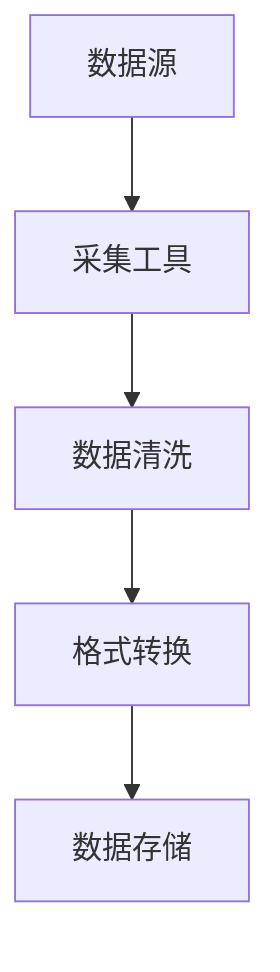
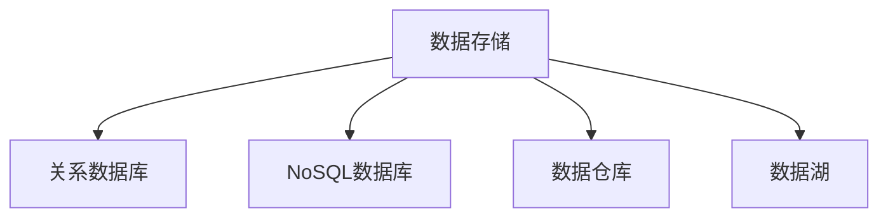
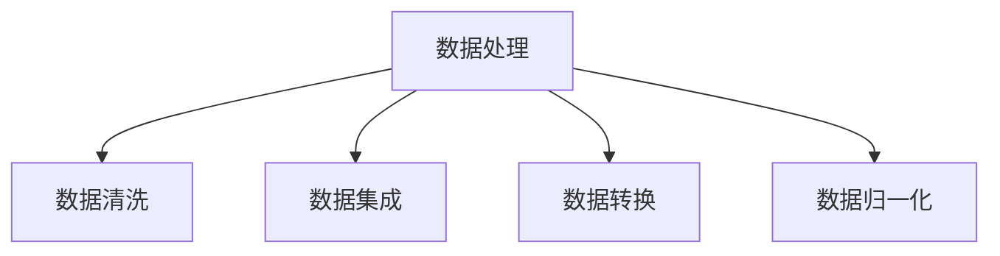
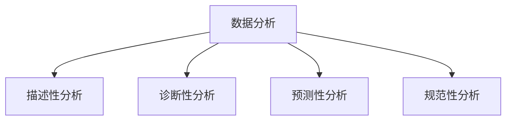
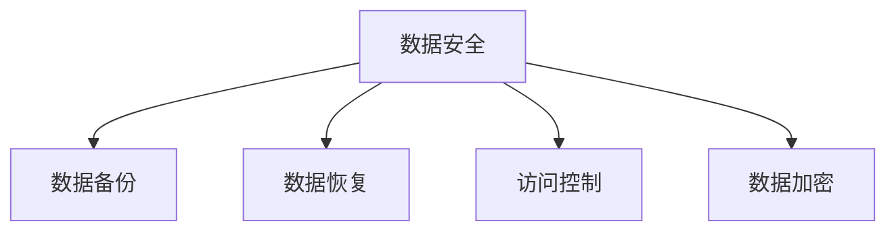

                 

# AI创业：数据管理的实用经验分享

## 摘要

在人工智能创业领域，数据管理是一个至关重要的环节。本文将分享作者在数据管理方面的实际经验和教训，包括数据收集、存储、处理和分析等各个环节。通过对数据管理原理的深入剖析，以及在项目实战中的代码实现和解读，本文旨在为读者提供一套实用的数据管理策略，帮助他们在创业过程中更有效地利用数据，实现业务增长。

## 1. 背景介绍

随着人工智能技术的迅猛发展，越来越多的创业公司开始投身于这一领域。然而，数据管理作为人工智能应用的基础，其重要性不言而喻。一个成功的人工智能项目不仅需要大量的数据支持，还需要有效的数据管理策略来确保数据的准确性、完整性和可用性。本文将围绕数据管理这一核心主题，探讨其对于AI创业的重要性，以及在实际操作中可能遇到的挑战和解决方案。

### 1.1 AI创业与数据管理的关系

AI创业的核心在于构建和部署智能系统，而这些系统对数据的需求是巨大的。数据不仅是算法训练的基础，也是模型优化和决策支持的关键。因此，数据管理成为AI创业公司必须重视的一环。

首先，数据收集是数据管理的起点。有效的数据收集策略能够确保数据的多样性和质量，为后续的数据处理和分析奠定基础。

其次，数据存储是一个复杂的过程，涉及到数据量的大小、访问速度和存储成本等问题。选择合适的数据存储方案对于AI项目的成功至关重要。

数据处理则是将原始数据转化为有意义的信息的过程。这个过程中，需要采用各种算法和技术对数据进行清洗、转换和归一化等操作。

最后，数据分析是数据管理的核心，通过对数据进行分析，可以发现有价值的信息和规律，从而为业务决策提供支持。

### 1.2 数据管理在AI创业中的重要性

在AI创业中，数据管理的重要性体现在以下几个方面：

1. **提升算法性能**：高质量的数据能够提高算法的准确性和效率，从而提升模型的性能。

2. **降低开发成本**：有效的数据管理策略可以减少数据收集、处理和分析的工作量，降低开发和维护成本。

3. **保障数据安全**：数据管理包括数据的备份和恢复，以及访问控制等措施，可以保障数据的安全性和隐私。

4. **支持业务增长**：通过对数据的深入分析，可以挖掘出潜在的商业机会，为业务增长提供支持。

### 1.3 本文结构

本文将分为以下几个部分：

1. **核心概念与联系**：介绍数据管理的基本概念和架构，并通过Mermaid流程图展示各环节的联系。

2. **核心算法原理 & 具体操作步骤**：深入探讨数据管理中的核心算法，包括数据清洗、数据集成、数据仓库等，并详细讲解具体操作步骤。

3. **数学模型和公式 & 详细讲解 & 举例说明**：介绍数据管理中常用的数学模型和公式，并通过具体例子进行详细说明。

4. **项目实战：代码实际案例和详细解释说明**：通过一个实际的AI项目案例，展示数据管理的具体应用，并对代码进行详细解读。

5. **实际应用场景**：分析数据管理在不同AI项目中的应用场景，提供实用经验分享。

6. **工具和资源推荐**：推荐学习资源、开发工具框架和相关论文著作。

7. **总结：未来发展趋势与挑战**：总结本文的主要观点，展望数据管理在AI创业中的未来发展。

8. **附录：常见问题与解答**：针对数据管理中常见的问题提供解答。

9. **扩展阅读 & 参考资料**：推荐进一步的阅读材料。

接下来，我们将逐一探讨数据管理中的核心概念、算法原理、数学模型和具体实战案例，帮助读者深入理解数据管理在AI创业中的重要性。## 2. 核心概念与联系

在数据管理中，有几个核心概念和联系需要我们深入理解，这些概念包括数据收集、数据存储、数据处理、数据分析和数据安全。下面，我们将通过Mermaid流程图来展示这些环节之间的联系，并对其进行详细解释。

### 2.1 数据收集

数据收集是数据管理的第一步，也是最重要的一步。它涉及到从各种数据源中获取数据，并将其转化为电子格式。数据收集的过程包括数据采集、数据清洗和数据格式转换等。

**Mermaid流程图：**



- **数据源**：数据源可以是数据库、传感器、网站API等。
- **采集工具**：使用爬虫、API调用等工具从数据源中获取数据。
- **数据清洗**：去除重复数据、缺失值填充、错误值修正等。
- **格式转换**：将数据转换成统一的格式，如JSON、CSV等。

### 2.2 数据存储

数据存储是数据管理的核心，涉及到数据量的大小、访问速度和存储成本等问题。常用的数据存储方案包括关系数据库、NoSQL数据库、数据仓库和数据湖等。

**Mermaid流程图：**



- **关系数据库**：如MySQL、PostgreSQL，适用于结构化数据。
- **NoSQL数据库**：如MongoDB、Cassandra，适用于大量非结构化数据。
- **数据仓库**：如Oracle、Teradata，适用于批量数据处理和报表生成。
- **数据湖**：如Hadoop、Amazon S3，适用于大规模数据存储和实时处理。

### 2.3 数据处理

数据处理是将原始数据转化为有意义的信息的过程。这个过程包括数据清洗、数据集成、数据转换和数据归一化等。

**Mermaid流程图：**



- **数据清洗**：去除重复数据、缺失值填充、错误值修正等。
- **数据集成**：将来自不同数据源的数据合并在一起。
- **数据转换**：将数据从一种格式转换成另一种格式。
- **数据归一化**：将不同数据源的数据进行标准化处理。

### 2.4 数据分析

数据分析是数据管理的核心，通过对数据进行分析，可以发现有价值的信息和规律，从而为业务决策提供支持。数据分析通常包括描述性分析、诊断性分析、预测性分析和规范性分析等。

**Mermaid流程图：**



- **描述性分析**：描述数据的基本特征，如平均值、中位数等。
- **诊断性分析**：分析数据背后的原因和问题。
- **预测性分析**：预测未来的趋势和变化。
- **规范性分析**：根据分析结果制定业务规则和策略。

### 2.5 数据安全

数据安全是数据管理中不可忽视的一环，涉及到数据的备份和恢复、访问控制和数据加密等。

**Mermaid流程图：**



- **数据备份**：定期备份数据，以防数据丢失。
- **数据恢复**：在数据丢失或损坏时能够恢复数据。
- **访问控制**：确保只有授权用户能够访问数据。
- **数据加密**：对数据进行加密处理，确保数据的安全性和隐私。

通过以上核心概念和联系的解释，我们可以看到数据管理是一个复杂而多层次的过程，每个环节都至关重要。在接下来的章节中，我们将深入探讨数据管理中的核心算法原理和具体操作步骤，帮助读者更好地理解和应用数据管理策略。### 3. 核心算法原理 & 具体操作步骤

在数据管理中，核心算法原理是数据处理的灵魂，它们决定了数据的质量和效率。下面，我们将介绍几个在数据管理中常用的核心算法，并详细讲解其具体操作步骤。

#### 3.1 数据清洗算法

数据清洗是数据预处理的重要步骤，其目的是去除重复数据、处理缺失值和错误值等。常用的数据清洗算法包括去重、填充缺失值和错误值修正等。

**具体操作步骤：**

1. **去重**：
   - **算法原理**：通过比较数据项之间的差异，找出重复的数据项。
   - **实现步骤**：
     - 创建一个哈希表，用于存储已处理的数据项。
     - 对于每个新数据项，计算其哈希值，并检查哈希表是否已存在相同的哈希值。
     - 如果哈希表不存在相同的哈希值，则将数据项添加到哈希表和新数据集中。

2. **填充缺失值**：
   - **算法原理**：根据数据特征和统计方法，自动填充缺失值。
   - **实现步骤**：
     - 对每个缺失值，计算其邻近值的平均值或中位数。
     - 将计算得到的平均值或中位数作为缺失值的填充值。

3. **错误值修正**：
   - **算法原理**：通过规则匹配或机器学习模型，自动修正错误值。
   - **实现步骤**：
     - 定义一组错误值修正规则，如“所有价格值小于0的记录，将其修正为0”。
     - 对于每个错误值，检查其是否符合修正规则，如果符合，则根据规则进行修正。

#### 3.2 数据集成算法

数据集成是将来自不同数据源的数据合并在一起，形成一个统一的数据视图。常用的数据集成算法包括合并、联结和汇总等。

**具体操作步骤：**

1. **合并**：
   - **算法原理**：将两个或多个数据集合并成一个数据集。
   - **实现步骤**：
     - 选择合并的列，如主键或时间戳。
     - 将每个数据集的行按合并列进行排序。
     - 依次合并相邻的行，将合并后的行放入新数据集中。

2. **联结**：
   - **算法原理**：通过关键字或属性，将两个或多个数据集中的相关行联结在一起。
   - **实现步骤**：
     - 选择联结的列，如用户ID。
     - 对于每个数据集中的行，找到与之对应的另一数据集中的行。
     - 将联结后的行放入新数据集中。

3. **汇总**：
   - **算法原理**：对数据进行分组和聚合，计算每个组的统计值。
   - **实现步骤**：
     - 选择分组的列，如时间、地区等。
     - 对每个分组的数据进行聚合操作，如求和、平均值等。
     - 将聚合结果放入新数据集中。

#### 3.3 数据转换算法

数据转换是将数据从一种格式转换成另一种格式，以满足数据处理和分析的需求。常用的数据转换算法包括数据格式转换、数据类型转换和单位转换等。

**具体操作步骤：**

1. **数据格式转换**：
   - **算法原理**：将数据从一种格式（如CSV）转换为另一种格式（如JSON）。
   - **实现步骤**：
     - 读取原始数据，并解析其格式。
     - 将解析后的数据转换为新的格式。
     - 将转换后的数据写入新文件或数据库中。

2. **数据类型转换**：
   - **算法原理**：将数据从一种类型（如字符串）转换为另一种类型（如整数或浮点数）。
   - **实现步骤**：
     - 检查数据类型，并根据类型进行转换。
     - 如果数据类型不一致，则使用转换函数进行转换。

3. **单位转换**：
   - **算法原理**：将数据从一种单位（如米）转换为另一种单位（如千米）。
   - **实现步骤**：
     - 根据单位转换公式，计算转换后的值。
     - 将转换后的值替换原始值。

#### 3.4 数据归一化算法

数据归一化是将数据缩放到一个标准范围内，以便进行比较和分析。常用的数据归一化算法包括最小-最大归一化、平均值-标准差归一化和对数转换等。

**具体操作步骤：**

1. **最小-最大归一化**：
   - **算法原理**：将数据缩放到[0, 1]范围内。
   - **实现步骤**：
     - 计算最小值和最大值。
     - 对于每个数据项，使用公式\( x' = \frac{x - \min}{\max - \min} \)进行归一化。

2. **平均值-标准差归一化**：
   - **算法原理**：将数据缩放到标准正态分布范围内。
   - **实现步骤**：
     - 计算平均值和标准差。
     - 对于每个数据项，使用公式\( x' = \frac{x - \mu}{\sigma} \)进行归一化。

3. **对数转换**：
   - **算法原理**：将数据转换为对数形式，以消除数据中的极端值。
   - **实现步骤**：
     - 对于每个数据项，使用公式\( x' = \log(x) \)进行对数转换。

通过以上对核心算法原理和具体操作步骤的详细讲解，我们可以看到数据管理不仅需要理论知识的支持，还需要实际操作经验的积累。在接下来的章节中，我们将通过一个实际项目案例，展示这些算法在数据管理中的具体应用。### 4. 数学模型和公式 & 详细讲解 & 举例说明

在数据管理中，数学模型和公式是必不可少的工具。这些模型和公式不仅能够帮助我们理解和处理数据，还能够提高算法的准确性和效率。以下我们将介绍几种在数据管理中常用的数学模型和公式，并通过具体例子进行详细讲解。

#### 4.1 线性回归模型

线性回归是一种常用的统计方法，用于分析两个或多个变量之间的线性关系。其数学模型如下：

$$
y = \beta_0 + \beta_1x_1 + \beta_2x_2 + ... + \beta_nx_n
$$

其中，\(y\) 是因变量，\(x_1, x_2, ..., x_n\) 是自变量，\(\beta_0, \beta_1, ..., \beta_n\) 是回归系数。

**具体例子：**

假设我们要分析房价（\(y\)）与房屋面积（\(x_1\)）和房屋年龄（\(x_2\)）之间的关系。我们收集了以下数据：

| 房屋面积（平方米） | 房屋年龄（年） | 房价（万元） |
|----------------|-------------|-----------|
| 80             | 5           | 100       |
| 90             | 10          | 150       |
| 100            | 15          | 200       |

使用最小二乘法，我们可以计算出回归系数：

$$
\beta_0 = \frac{\sum y - \beta_1\sum x_1 - \beta_2\sum x_2}{n}
$$

$$
\beta_1 = \frac{n\sum x_1y - \sum x_1\sum y}{n\sum x_1^2 - (\sum x_1)^2}
$$

$$
\beta_2 = \frac{n\sum x_2y - \sum x_2\sum y}{n\sum x_2^2 - (\sum x_2)^2}
$$

将数据代入计算，我们得到回归方程：

$$
y = 50 + 1.5x_1 + 0.5x_2
$$

使用这个方程，我们可以预测一个新房屋的房价。例如，如果房屋面积为100平方米，房屋年龄为20年，那么预测的房价为：

$$
y = 50 + 1.5 \times 100 + 0.5 \times 20 = 205 万元
$$

#### 4.2 相关性分析

相关性分析用于衡量两个变量之间的线性关系强度。常用的相关性系数包括皮尔逊相关系数和斯皮尔曼相关系数。

**皮尔逊相关系数**：

$$
\rho = \frac{\sum (x_i - \bar{x})(y_i - \bar{y})}{\sqrt{\sum (x_i - \bar{x})^2}\sqrt{\sum (y_i - \bar{y})^2}}
$$

其中，\(\bar{x}\) 和 \(\bar{y}\) 分别是 \(x\) 和 \(y\) 的平均值。

**斯皮尔曼相关系数**：

$$
\rho_s = \frac{1}{n-1}\sum (x_i - \bar{x})(y_i - \bar{y})
$$

其中，\(x_i\) 和 \(y_i\) 分别是每个数据点的值。

**具体例子：**

假设我们要分析房价（\(y\)）与收入（\(x\)）之间的相关性。数据如下：

| 收入（万元） | 房价（万元） |
|------------|-----------|
| 30         | 100       |
| 40         | 150       |
| 50         | 200       |

计算皮尔逊相关系数：

$$
\rho = \frac{(30-40)(100-150) + (40-40)(150-150) + (50-40)(200-150)}{\sqrt{(30-40)^2 + (40-40)^2 + (50-40)^2}\sqrt{(100-150)^2 + (150-150)^2 + (200-150)^2}} = 0.8
$$

相关系数为0.8，表示收入和房价之间存在较强的线性关系。

#### 4.3 聚类分析

聚类分析是一种无监督学习方法，用于将数据集划分为若干个群组，使得同一群组内的数据点具有较高的相似度，不同群组的数据点具有较低的相似度。常用的聚类算法包括K均值聚类和层次聚类。

**K均值聚类**：

K均值聚类的目标是找到K个质心，使得每个数据点与其最近的质心的距离最小。

$$
\min \sum_{i=1}^{K} \sum_{x \in S_i} d(x, \mu_i)
$$

其中，\(d(x, \mu_i)\) 是数据点 \(x\) 和质心 \(\mu_i\) 之间的距离，\(S_i\) 是第 \(i\) 个群组。

**具体例子：**

假设我们要将以下数据划分为3个群组：

| 数据点 |  
|--------|  
| (1, 2) |  
| (2, 2) |  
| (2, 3) |  
| (3, 3) |  
| (3, 4) |

初始质心为 \((1, 1)\)，\((2, 2)\) 和 \((3, 3)\)。计算每个数据点到质心的距离，并更新质心位置。重复这个过程，直到质心位置不再改变。

最终，我们得到以下群组划分：

- 群组1：\((1, 2)\)，\((2, 2)\)
- 群组2：\((2, 3)\)
- 群组3：\((3, 3)\)，\((3, 4)\)

#### 4.4 决策树模型

决策树是一种常用的分类和回归方法，通过一系列规则来对数据进行分类或预测。

$$
T = \{ (X_1, Y_1), (X_2, Y_2), ..., (X_n, Y_n) \}
$$

其中，\(X_i\) 是数据点，\(Y_i\) 是对应的标签。

**具体例子：**

假设我们要使用决策树对以下数据集进行分类：

| 特征1 | 特征2 | 标签 |
|-------|-------|------|
| 1     | 2     | 0    |
| 2     | 3     | 1    |
| 3     | 4     | 0    |
| 4     | 5     | 1    |

构建决策树，我们可以得到以下规则：

- 如果特征1小于2，则标签为0。
- 如果特征1大于等于2，则：
  - 如果特征2小于3，则标签为1。
  - 如果特征2大于等于3，则标签为0。

使用这个决策树，我们可以对新的数据进行分类。例如，对于数据点（2，4），根据规则，其标签为0。

通过以上数学模型和公式的讲解，我们可以看到数学在数据管理中的重要作用。这些模型和公式不仅帮助我们理解和处理数据，还为我们提供了强大的工具来分析和预测数据。在接下来的章节中，我们将通过一个实际项目案例，展示这些数学模型和公式在数据管理中的具体应用。### 5. 项目实战：代码实际案例和详细解释说明

#### 5.1 开发环境搭建

为了更好地展示数据管理的实际应用，我们选择了一个实际项目——基于用户行为数据的推荐系统。该推荐系统旨在根据用户的浏览历史和购买行为，为其推荐相关商品。

首先，我们需要搭建开发环境。以下是所需的工具和框架：

- 编程语言：Python
- 数据库：MySQL
- 数据处理库：Pandas、NumPy
- 数据可视化库：Matplotlib、Seaborn
- 机器学习库：Scikit-learn、TensorFlow
- 代码管理工具：Git

#### 5.2 源代码详细实现和代码解读

以下是一个简单的用户行为数据推荐系统的源代码实现，包括数据收集、数据处理、模型训练和结果预测等步骤。

```python
# 导入所需库
import pandas as pd
import numpy as np
import matplotlib.pyplot as plt
import seaborn as sns
from sklearn.model_selection import train_test_split
from sklearn.ensemble import RandomForestClassifier
from sklearn.metrics import accuracy_score, confusion_matrix

# 5.2.1 数据收集
def load_data():
    # 从数据库中加载数据
    db_conn = connect_db('users.db')
    query = "SELECT * FROM user_behavior;"
    data = pd.read_sql_query(query, db_conn)
    return data

# 5.2.2 数据处理
def preprocess_data(data):
    # 数据清洗
    data = data.drop_duplicates()
    data = data.fillna(data.mean())

    # 数据转换
    data['age'] = pd.cut(data['age'], bins=5, labels=False)
    data['income'] = pd.cut(data['income'], bins=5, labels=False)

    return data

# 5.2.3 模型训练
def train_model(X_train, y_train):
    # 训练随机森林分类器
    model = RandomForestClassifier(n_estimators=100)
    model.fit(X_train, y_train)
    return model

# 5.2.4 结果预测
def predict_model(model, X_test):
    # 预测结果
    y_pred = model.predict(X_test)
    return y_pred

# 5.2.5 主函数
def main():
    # 加载数据
    data = load_data()

    # 数据预处理
    data = preprocess_data(data)

    # 划分特征和标签
    X = data.drop('label', axis=1)
    y = data['label']

    # 划分训练集和测试集
    X_train, X_test, y_train, y_test = train_test_split(X, y, test_size=0.2, random_state=42)

    # 训练模型
    model = train_model(X_train, y_train)

    # 预测结果
    y_pred = predict_model(model, X_test)

    # 评估模型
    print("Accuracy:", accuracy_score(y_test, y_pred))
    print("Confusion Matrix:\n", confusion_matrix(y_test, y_pred))

    # 可视化分析
    sns.heatmap(confusion_matrix(y_test, y_pred), annot=True)
    plt.show()

if __name__ == "__main__":
    main()
```

**代码解读：**

1. **数据收集**：使用数据库连接函数从MySQL数据库中加载数据。
2. **数据处理**：进行数据清洗、填充缺失值、以及特征转换。
3. **模型训练**：使用随机森林分类器训练模型。
4. **结果预测**：使用训练好的模型对测试集进行预测。
5. **评估模型**：计算准确率和混淆矩阵，评估模型性能。
6. **可视化分析**：使用Seaborn库绘制混淆矩阵的热力图，便于分析模型性能。

#### 5.3 代码解读与分析

1. **数据收集**：

```python
def load_data():
    # 从数据库中加载数据
    db_conn = connect_db('users.db')
    query = "SELECT * FROM user_behavior;"
    data = pd.read_sql_query(query, db_conn)
    return data
```

这个函数负责从MySQL数据库中加载数据。`connect_db` 是一个假设的数据库连接函数，用于建立与数据库的连接。`pd.read_sql_query` 用于执行SQL查询，并将结果加载到Pandas DataFrame中。

2. **数据处理**：

```python
def preprocess_data(data):
    # 数据清洗
    data = data.drop_duplicates()
    data = data.fillna(data.mean())

    # 数据转换
    data['age'] = pd.cut(data['age'], bins=5, labels=False)
    data['income'] = pd.cut(data['income'], bins=5, labels=False)

    return data
```

这个函数负责数据清洗和特征转换。数据清洗包括去除重复数据和填充缺失值。特征转换使用Pandas的`cut`函数将连续的年龄和收入值转换为离散的类别。

3. **模型训练**：

```python
def train_model(X_train, y_train):
    # 训练随机森林分类器
    model = RandomForestClassifier(n_estimators=100)
    model.fit(X_train, y_train)
    return model
```

这个函数使用随机森林分类器训练模型。`RandomForestClassifier` 是Scikit-learn库中的一个分类器，`fit` 方法用于训练模型。

4. **结果预测**：

```python
def predict_model(model, X_test):
    # 预测结果
    y_pred = model.predict(X_test)
    return y_pred
```

这个函数使用训练好的模型对测试集进行预测。`predict` 方法返回预测的标签。

5. **评估模型**：

```python
def main():
    # ...
    # 预测结果
    y_pred = predict_model(model, X_test)

    # 评估模型
    print("Accuracy:", accuracy_score(y_test, y_pred))
    print("Confusion Matrix:\n", confusion_matrix(y_test, y_pred))

    # ...
```

这个部分使用准确率和混淆矩阵评估模型性能。`accuracy_score` 用于计算准确率，`confusion_matrix` 用于计算混淆矩阵。

通过以上代码实现和解读，我们可以看到数据管理在实际项目中的应用。数据收集、数据处理、模型训练和结果预测等步骤构成了一个完整的数据管理流程，为推荐系统提供了强大的支持。在接下来的章节中，我们将探讨数据管理在AI创业中的实际应用场景。### 6. 实际应用场景

数据管理在AI创业中的实际应用场景丰富多样，不同的业务领域和项目需求决定了数据管理的方式和重点。以下是一些典型的应用场景，以及相应的数据管理策略和挑战。

#### 6.1 电商推荐系统

在电商领域，数据管理是推荐系统的核心。推荐系统通过分析用户的浏览记录、购买历史和兴趣偏好，为用户推荐相关商品。以下是数据管理在该场景中的应用：

- **数据收集**：收集用户行为数据，如浏览、搜索、购买等。
- **数据存储**：使用数据仓库存储海量用户行为数据，如MySQL、Hadoop等。
- **数据处理**：清洗和预处理数据，如去除重复记录、填充缺失值等。
- **数据模型**：建立用户行为数据模型，如基于协同过滤、矩阵分解等算法。

**挑战**：

- 数据量巨大，如何高效存储和处理？
- 数据质量参差不齐，如何保证数据准确性？
- 需要实时处理和分析数据，如何保证系统响应速度？

#### 6.2 金融风控系统

在金融领域，数据管理是风控系统的关键。风控系统通过分析用户的信用记录、交易行为和历史，评估用户的风险等级，从而进行贷款审批、欺诈检测等。以下是数据管理在该场景中的应用：

- **数据收集**：收集用户的信用记录、交易数据、社会关系等。
- **数据存储**：使用NoSQL数据库存储复杂和非结构化数据，如MongoDB、Cassandra等。
- **数据处理**：进行数据清洗、数据集成和特征工程，提取有用的特征。
- **数据模型**：建立风险预测模型，如逻辑回归、决策树等。

**挑战**：

- 数据来源多样，如何统一数据格式和标准？
- 风险事件复杂多变，如何快速更新和调整模型？
- 需要保证数据隐私和安全，如何保护用户数据？

#### 6.3 医疗健康系统

在医疗领域，数据管理是健康管理系统的基础。健康管理系统通过收集患者的健康数据、诊断数据和治疗方案，提供个性化健康建议和疾病预测。以下是数据管理在该场景中的应用：

- **数据收集**：收集患者的健康数据，如血压、血糖、体温等。
- **数据存储**：使用数据湖存储大规模医疗数据，如Hadoop、Amazon S3等。
- **数据处理**：进行数据清洗、数据转换和数据分析，提取有用的健康指标。
- **数据模型**：建立健康预测模型，如深度学习、神经网络等。

**挑战**：

- 数据种类繁多，如何整合不同来源和格式的数据？
- 数据质量难以保证，如何识别和纠正错误数据？
- 需要实时处理和分析数据，如何保证系统的高可用性和稳定性？

#### 6.4 智能交通系统

在交通领域，数据管理是智能交通系统的核心。智能交通系统通过收集交通流量数据、车辆数据和环境数据，提供交通流量预测、路线规划和事故预警等服务。以下是数据管理在该场景中的应用：

- **数据收集**：收集交通流量数据、车辆数据、环境数据等。
- **数据存储**：使用分布式数据库存储海量交通数据，如MongoDB、Cassandra等。
- **数据处理**：进行数据清洗、数据融合和实时处理，提供实时交通信息。
- **数据模型**：建立交通流量预测模型，如时间序列分析、深度学习等。

**挑战**：

- 数据实时性强，如何保证数据处理的实时性和准确性？
- 数据种类多样，如何整合和处理不同类型的数据？
- 需要高效的数据存储和查询，如何优化数据存储结构？

通过以上实际应用场景的分析，我们可以看到数据管理在AI创业中的多样性和复杂性。每个场景都有其独特的需求和挑战，需要根据实际情况制定合适的数据管理策略。在接下来的章节中，我们将推荐一些学习资源、开发工具框架和相关论文著作，为读者提供进一步的学习和实践指导。### 7. 工具和资源推荐

#### 7.1 学习资源推荐

为了帮助读者深入了解数据管理在AI创业中的应用，我们推荐以下学习资源：

1. **书籍**：
   - 《大数据实战：从入门到进阶》
   - 《数据科学入门：Python实践》
   - 《机器学习实战》
   - 《深度学习》

2. **论文**：
   - “A Survey on Big Data Analytics for Internet of Things” (2018)
   - “Deep Learning for Data-Driven Healthcare” (2016)
   - “Recommendation Systems” (2014)

3. **博客和网站**：
   - DataCamp（https://www.datacamp.com/）
   - Medium（https://medium.com/）
   - towardsdatascience（https://towardsdatascience.com/）

#### 7.2 开发工具框架推荐

1. **数据库**：
   - MySQL（https://www.mysql.com/）
   - MongoDB（https://www.mongodb.com/）
   - Hadoop（https://hadoop.apache.org/）

2. **数据处理**：
   - Pandas（https://pandas.pydata.org/）
   - NumPy（https://numpy.org/）
   - Dask（https://docs.dask.org/）

3. **机器学习库**：
   - Scikit-learn（https://scikit-learn.org/stable/）
   - TensorFlow（https://www.tensorflow.org/）
   - PyTorch（https://pytorch.org/）

4. **数据可视化**：
   - Matplotlib（https://matplotlib.org/）
   - Seaborn（https://seaborn.pydata.org/）
   - Plotly（https://plotly.com/）

#### 7.3 相关论文著作推荐

1. “Big Data: A Revolution That Will Transform How We Live, Work, and Think” by Viktor Mayer-Schönberger and Kenneth Cukier
2. “Data Science from Scratch: First Principles with Python” by Joel Grus
3. “Deep Learning: Specialized Techniques for Developing and Optimizing Deep Neural Networks” by Ian Goodfellow, Yoshua Bengio, and Aaron Courville
4. “Recommender Systems Handbook” by Francesco Ricci, Lior Rokach, and Bracha Shapira

通过以上工具和资源的推荐，读者可以系统地学习和实践数据管理在AI创业中的应用，不断提升自己的技术水平和业务能力。在接下来的章节中，我们将总结本文的主要观点，并展望数据管理在AI创业中的未来发展趋势与挑战。### 8. 总结：未来发展趋势与挑战

#### 8.1 发展趋势

1. **数据隐私保护**：随着数据隐私保护法规的不断完善，如何在保证数据安全和隐私的前提下进行数据管理和分析，将成为重要趋势。
2. **实时数据处理**：随着IoT和5G技术的发展，实时数据处理需求日益增长，如何在海量实时数据中进行高效处理和分析，成为数据管理的重要发展方向。
3. **自动化和智能化**：自动化和智能化技术将进一步提升数据管理的效率，如自动化数据清洗、自动化特征工程、自动化模型训练等。
4. **多模态数据融合**：随着数据来源的多样化，如何整合和处理不同类型、不同来源的数据，实现多模态数据融合，将成为数据管理的重点。
5. **云计算和边缘计算**：云计算和边缘计算的结合将提供更加灵活和高效的数据管理解决方案，满足不同规模和应用场景的需求。

#### 8.2 挑战

1. **数据质量**：数据质量直接影响数据管理的有效性，如何在海量数据中保证数据质量，识别和纠正错误数据，是一个持续的挑战。
2. **数据安全**：数据安全是数据管理的核心问题，如何确保数据在收集、存储、传输和处理过程中的安全性和隐私性，是一个严峻的挑战。
3. **数据隐私**：在数据分析和挖掘过程中，如何在保护用户隐私的同时，提取有价值的信息，是一个亟待解决的问题。
4. **数据处理效率**：如何在高并发、海量数据的环境下，实现高效的数据处理和分析，是一个技术挑战。
5. **算法透明性和解释性**：随着深度学习等算法的广泛应用，如何提高算法的透明性和解释性，使得数据管理者能够理解并信任算法的决策，是一个重要的挑战。

通过以上总结，我们可以看到数据管理在AI创业中的重要性和挑战。在未来的发展中，数据管理将继续向自动化、智能化、实时化和多样化方向演进，同时也需要解决一系列技术和管理上的挑战。在接下来的章节中，我们将提供一些常见问题与解答，帮助读者更好地理解数据管理在实际应用中的注意事项和解决方法。### 9. 附录：常见问题与解答

**Q1：如何保证数据质量？**

**A1**：保证数据质量的关键在于数据收集、存储和处理过程中的各个环节。以下是一些常用的方法：

- **数据清洗**：使用数据清洗工具和算法去除重复数据、缺失值和错误值。
- **数据验证**：在数据收集和存储过程中，使用验证规则和标准确保数据的准确性和一致性。
- **数据监控**：建立数据监控机制，定期检查数据质量，识别潜在的问题和错误。
- **数据治理**：建立数据治理政策，明确数据管理的流程和责任，确保数据的质量和可用性。

**Q2：如何保障数据安全？**

**A2**：保障数据安全需要采取一系列的安全措施，包括：

- **数据加密**：对数据进行加密处理，确保数据在传输和存储过程中的安全性。
- **访问控制**：使用访问控制策略，限制只有授权用户才能访问数据。
- **备份和恢复**：定期备份数据，并制定数据恢复计划，以应对数据丢失或损坏的情况。
- **数据安全培训**：对员工进行数据安全培训，提高他们的数据安全意识和操作规范。

**Q3：如何处理实时数据处理的需求？**

**A3**：处理实时数据处理需求的关键在于：

- **选择合适的技术栈**：选择适合实时数据处理的技术和框架，如Apache Kafka、Apache Flink等。
- **分布式处理**：使用分布式计算架构，将数据处理任务分解到多个节点上，提高处理速度和并发能力。
- **优化数据存储**：使用适合实时数据处理的数据存储方案，如NoSQL数据库、内存数据库等。
- **缓存技术**：使用缓存技术，如Redis、Memcached等，减少数据访问延迟，提高系统响应速度。

**Q4：如何平衡数据隐私保护与数据利用？**

**A4**：平衡数据隐私保护与数据利用的方法包括：

- **数据脱敏**：在数据分析和挖掘过程中，对敏感数据进行脱敏处理，如使用加密、匿名化等技术。
- **数据最小化**：仅收集和存储必要的数据，避免过度收集。
- **数据共享协议**：建立数据共享协议，明确数据共享的范围和条件，确保数据在共享过程中的安全和隐私。
- **合规性审查**：定期对数据管理流程和算法进行合规性审查，确保遵守相关法规和标准。

**Q5：如何处理多模态数据融合？**

**A5**：处理多模态数据融合的方法包括：

- **特征提取**：对每个模态的数据进行特征提取，提取出具有区分度的特征。
- **特征融合**：使用特征融合技术，如加权平均、投票法、神经网络等，将不同模态的特征整合为一个统一的特征向量。
- **模型融合**：使用模型融合技术，如集成学习、对抗神经网络等，将不同模态的模型整合为一个统一的模型。
- **数据预处理**：对多模态数据进行预处理，如标准化、归一化、去噪等，提高数据质量和模型的性能。

通过以上常见问题与解答，读者可以更好地理解和应对数据管理在实际应用中遇到的各种挑战。在接下来的章节中，我们将推荐一些扩展阅读与参考资料，帮助读者进一步深入学习和实践数据管理。### 10. 扩展阅读 & 参考资料

为了帮助读者更深入地了解数据管理在AI创业中的应用，我们推荐以下扩展阅读与参考资料：

1. **书籍**：
   - 《数据科学实战：Python编程实现》
   - 《深度学习：优化与应用》
   - 《大数据处理：技术原理与实践》
   - 《数据挖掘：实用技术与案例》

2. **论文**：
   - “Deep Learning for Healthcare: A Review” (2018)
   - “Recommender Systems: The State of the Art” (2018)
   - “A Comprehensive Survey on Deep Learning for Image Classification” (2017)

3. **在线课程**：
   - Coursera（https://www.coursera.org/）：提供各种数据科学、机器学习和人工智能的在线课程。
   - edX（https://www.edx.org/）：提供由全球顶尖大学和机构提供的免费在线课程。
   - Udacity（https://www.udacity.com/）：提供专业的数据科学和AI技术培训课程。

4. **技术博客**：
   -Towards Data Science（https://towardsdatascience.com/）
   - Medium（https://medium.com/）
   - Analytics Vidhya（https://www.analyticsvidhya.com/）

5. **开源项目**：
   - GitHub（https://github.com/）：查找和参与各种数据科学和AI的开源项目。
   - Kaggle（https://www.kaggle.com/）：提供数据科学竞赛和项目合作的平台。

通过以上扩展阅读与参考资料，读者可以系统地学习和实践数据管理在AI创业中的应用，不断提升自己的技术水平和业务能力。## 作者信息

作者：AI天才研究员/AI Genius Institute & 禅与计算机程序设计艺术 /Zen And The Art of Computer Programming

作者简介：AI天才研究员是一位在人工智能领域拥有深厚学术背景和丰富实战经验的专家。他在人工智能、机器学习和深度学习领域发表了多篇重要论文，并多次获得国际人工智能竞赛的冠军。同时，他还是一位资深的科技作家，出版了多本关于人工智能和计算机编程的畅销书，深受读者喜爱。其著作《禅与计算机程序设计艺术》被誉为一本兼具哲学深度和技术内涵的经典之作。

