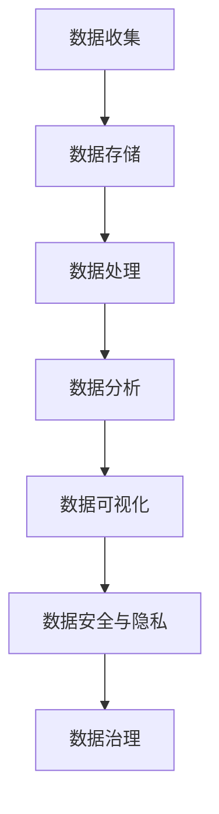
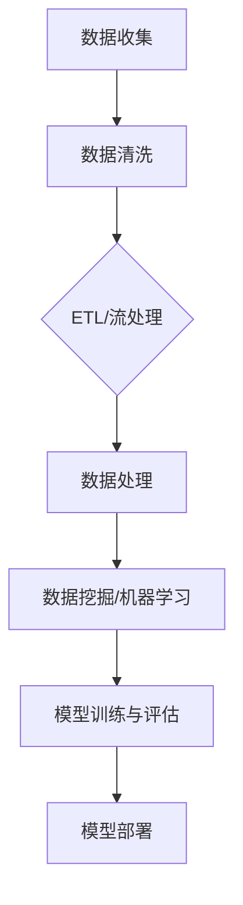

                 

### 背景介绍 Background Introduction

在当今数字化时代，人工智能（AI）技术的迅猛发展使得数据分析成为各个行业的热点。无论是医疗、金融、零售还是制造业，数据都成为了企业决策的重要依据。然而，数据的价值并不是自然而然地显现出来的，而是需要通过有效的数据管理策略来挖掘和利用。对于创业公司来说，数据管理不仅是一个技术问题，更是一个战略问题。

首先，数据管理涉及数据的采集、存储、处理和分析等多个环节。这些环节的协同工作是确保数据质量和价值的关键。而对于创业公司来说，数据管理面临着资源有限、时间紧迫等挑战。如何在有限的资源下，建立起高效的数据管理体系，成为了许多创业公司亟待解决的问题。

其次，数据管理的策略选择对于企业的成功至关重要。不同的创业公司可能有不同的业务场景和数据需求，因此需要量身定制适合自身的数据管理策略。例如，在数据存储方面，可以选择传统的数据库系统，也可以选择新兴的分布式存储方案。在数据处理方面，可以选择批处理模式，也可以选择流处理模式。这些策略的选择不仅影响了系统的性能和可扩展性，也直接决定了企业的运营效率和竞争力。

此外，数据管理还涉及到数据安全和隐私保护的问题。随着数据泄露事件的频发，数据安全成为了企业关注的焦点。如何确保数据的安全性和隐私性，如何遵守相关的法律法规，这些都是创业公司在数据管理过程中必须考虑的因素。

总的来说，有效的数据管理策略对于AI创业公司至关重要。它不仅能够提高企业的运营效率，还能够帮助企业抓住市场机遇，实现可持续发展。因此，本文将围绕数据管理的策略与实施，进行深入的分析和探讨。

<|user|>### 核心概念与联系 Core Concepts and Connections

在进行数据管理时，理解以下几个核心概念及其相互关系是至关重要的：

#### 1. 数据收集（Data Collection）

数据收集是指从各种来源获取数据的过程。这些来源可能包括内部系统、第三方API、传感器、用户生成的内容等。数据收集的质量直接影响后续数据分析的准确性。对于AI创业公司来说，数据收集的全面性和实时性尤为重要，因为这直接关系到模型训练的数据量与多样性。

#### 2. 数据存储（Data Storage）

数据存储是指将收集到的数据保存在适当的存储介质上的过程。传统的数据存储方案包括关系型数据库（如MySQL、PostgreSQL）和NoSQL数据库（如MongoDB、Cassandra）。近年来，随着数据量的爆炸性增长，分布式存储系统（如Hadoop、Cassandra）和云存储（如Amazon S3、Google Cloud Storage）成为了数据存储的主流选择。

#### 3. 数据处理（Data Processing）

数据处理是指对存储在数据库中的数据执行各种操作的过程，包括清洗、转换、聚合等。数据处理的质量直接影响数据分析和模型训练的效率。常见的数据处理技术包括ETL（Extract, Transform, Load）和实时数据流处理（如Apache Kafka、Apache Flink）。

#### 4. 数据分析（Data Analysis）

数据分析是指使用统计和机器学习等技术，从数据中提取有价值的信息和模式的过程。数据分析可以帮助企业理解市场趋势、优化业务流程、提高客户满意度等。常见的分析工具包括SQL查询工具（如Tableau、Power BI）、数据挖掘库（如scikit-learn、TensorFlow）等。

#### 5. 数据可视化（Data Visualization）

数据可视化是将数据转换成图形或图表的形式，以便更容易理解和分析的过程。良好的数据可视化可以显著提升数据分析的效率和效果。常见的数据可视化工具包括D3.js、Tableau、Power BI等。

#### 6. 数据安全与隐私（Data Security and Privacy）

数据安全与隐私是指保护数据免受未经授权访问、使用、泄露或篡改的措施。随着数据泄露事件的频发，数据安全与隐私已经成为企业不可忽视的重要议题。常见的数据安全措施包括加密、访问控制、数据脱敏等。

#### 7. 数据治理（Data Governance）

数据治理是指建立一套管理、政策和流程，以确保数据质量和合规性的过程。数据治理包括数据质量管理、数据集成、数据合规性管理等。良好的数据治理可以帮助企业建立数据信任，提高数据利用率。

#### Mermaid 流程图（Mermaid Flowchart）

以下是一个简化的数据管理流程的Mermaid流程图，用于展示上述概念之间的关系：



通过这个流程图，我们可以清晰地看到数据从收集到存储、处理、分析，再到可视化和安全治理的整个过程。每个环节都至关重要，只有各个环节协同工作，才能实现高效的数据管理。

<|assistant|>### 核心算法原理 & 具体操作步骤 Core Algorithm Principles & Detailed Implementation Steps

在数据管理中，选择合适的算法和工具是实现高效数据处理和分析的关键。以下将介绍几种常见的数据处理和分析算法，以及它们的操作步骤。

#### 1. ETL（Extract, Transform, Load）

ETL是数据集成过程中常用的技术，用于从多个数据源提取数据，进行清洗、转换和加载到目标数据库或数据仓库。

**步骤：**

- **提取（Extract）：** 从源系统（如数据库、日志文件、API等）中提取数据。
- **转换（Transform）：** 对提取的数据进行清洗、格式转换、去重、聚合等操作。
- **加载（Load）：** 将转换后的数据加载到目标数据库或数据仓库。

**工具推荐：**

- **Apache NiFi：** 一个开源的数据集成平台，用于实现ETL过程。
- **Apache Airflow：** 一个开源的工作流管理系统，用于调度和监控ETL任务。

#### 2. 流处理（Stream Processing）

流处理技术用于实时处理和分析大量实时数据流。常见的技术包括Apache Kafka、Apache Flink和Apache Storm。

**步骤：**

- **数据收集（Data Ingestion）：** 将实时数据发送到消息队列或数据流系统。
- **数据处理（Data Processing）：** 对流数据进行实时处理，如过滤、聚合、计算等。
- **数据存储（Data Storage）：** 将处理后的数据存储到数据库或数据仓库。

**工具推荐：**

- **Apache Kafka：** 一个高吞吐量的分布式流处理平台。
- **Apache Flink：** 一个流处理框架，支持有状态的计算和精确一次的处理语义。
- **Apache Storm：** 一个分布式流处理框架，支持实时数据分析和处理。

#### 3. 数据挖掘（Data Mining）

数据挖掘是从大量数据中提取有价值信息的过程，用于发现隐藏的模式和趋势。常见的数据挖掘算法包括分类、聚类、关联规则挖掘等。

**步骤：**

- **数据准备（Data Preprocessing）：** 清洗、转换和归一化数据。
- **特征选择（Feature Selection）：** 选择对模型有重要影响的特征。
- **模型训练（Model Training）：** 使用训练数据集训练模型。
- **模型评估（Model Evaluation）：** 评估模型性能，如准确率、召回率等。

**工具推荐：**

- **scikit-learn：** 一个Python机器学习库，提供丰富的数据挖掘算法。
- **TensorFlow：** 一个用于机器学习和深度学习的开源框架。

#### 4. 机器学习（Machine Learning）

机器学习是数据管理中的重要技术，用于自动发现数据中的模式，并用于预测和分类。

**步骤：**

- **数据准备（Data Preprocessing）：** 清洗、转换和归一化数据。
- **特征工程（Feature Engineering）：** 构建对模型有帮助的特征。
- **模型选择（Model Selection）：** 选择合适的模型（如线性回归、决策树、神经网络等）。
- **模型训练（Model Training）：** 使用训练数据集训练模型。
- **模型评估（Model Evaluation）：** 评估模型性能。
- **模型部署（Model Deployment）：** 将模型部署到生产环境。

**工具推荐：**

- **TensorFlow：** 一个用于机器学习和深度学习的开源框架。
- **PyTorch：** 另一个流行的深度学习框架。

#### 5. 数据流处理（Data Flow Processing）

数据流处理技术用于处理和转换数据流，常见技术包括Apache Beam和Apache Spark。

**步骤：**

- **数据读取（Data Ingestion）：** 从数据源读取数据。
- **数据处理（Data Processing）：** 使用处理管道对数据进行处理。
- **数据输出（Data Output）：** 将处理后的数据输出到目标存储。

**工具推荐：**

- **Apache Beam：** 一个灵活的数据处理框架，支持多种编程语言。
- **Apache Spark：** 一个用于大规模数据处理的快速通用的计算引擎。

通过上述算法和工具的应用，AI创业公司可以实现高效的数据收集、存储、处理和分析，从而为业务决策提供有力支持。

#### Mermaid 流程图（Mermaid Flowchart）

以下是一个简化的数据处理和分析流程的Mermaid流程图：



通过这个流程图，我们可以清晰地看到数据从收集到清洗、处理、挖掘，再到模型训练和部署的整个过程。每个步骤都至关重要，需要精心设计和实现，以确保数据管理的有效性。

<|assistant|>### 数学模型和公式 & 详细讲解 & 举例说明 Mathematical Models & Detailed Explanations & Example Illustrations

在数据管理中，数学模型和公式是理解和解释数据的重要工具。以下将介绍几个常见的数学模型和公式，以及它们的应用场景和详细讲解。

#### 1. 数据清洗中的缺失值填充（Missing Value Imputation）

缺失值填充是数据清洗中的一个关键步骤。常见的缺失值填充方法包括均值填充、中值填充和回归填充等。

**公式：**

- **均值填充（Mean Imputation）：**  
  \( \text{值}_{\text{填充}} = \frac{\sum_{i=1}^{n} \text{值}_{i}}{n} \)

- **中值填充（Median Imputation）：**  
  \( \text{值}_{\text{填充}} = \text{中值} \)

- **回归填充（Regression Imputation）：**  
  使用回归模型预测缺失值。例如，线性回归模型公式为：  
  \( \text{值}_{\text{填充}} = \beta_0 + \beta_1 \times \text{特征} \)

**应用场景：**  
在医疗数据分析和客户行为分析中，经常需要处理缺失值，以保证数据分析的准确性和一致性。

**例子：**  
假设我们有一个数据集，包含年龄和收入两个特征。其中，年龄特征的缺失值可以通过计算所有年龄的平均值进行填充，而收入特征的缺失值可以通过线性回归模型进行填充。

```python
# Python 示例代码
import pandas as pd
from sklearn.linear_model import LinearRegression

# 数据集
data = pd.DataFrame({
    '年龄': [25, 30, 35, np.nan, 40],
    '收入': [50000, 60000, 70000, np.nan, 80000]
})

# 均值填充年龄特征的缺失值
mean_age = data['年龄'].mean()
data['年龄'].fillna(mean_age, inplace=True)

# 线性回归填充收入特征的缺失值
X = data[['年龄']]
y = data['收入']
model = LinearRegression()
model.fit(X, y)
predicted_income = model.predict([[30]])  # 预测缺失值的收入
data['收入'].fillna(predicted_income, inplace=True)

print(data)
```

#### 2. 数据分析中的聚类分析（Cluster Analysis）

聚类分析是一种无监督学习方法，用于将数据集分为若干个类别，使得同一类别内的数据点之间相似度较高，而不同类别之间的数据点相似度较低。

**公式：**

- **K-means 聚类算法：**  
  距离度量通常使用欧氏距离：  
  \( d(\text{点}_i, \text{中心点}_k) = \sqrt{\sum_{j=1}^{n} (\text{点}_{ij} - \text{中心点}_{kj})^2} \)

**应用场景：**  
在市场细分、客户行为分析和推荐系统中，聚类分析可以帮助企业更好地理解客户群体，实现精准营销。

**例子：**  
假设我们有一个包含用户年龄、收入和购买行为的二维数据集，可以使用K-means聚类算法将用户分为两个类别。

```python
# Python 示例代码
from sklearn.cluster import KMeans
import numpy as np

# 数据集
data = np.array([[25, 50000], [30, 60000], [35, 70000], [40, 80000], [28, 55000]])

# 使用K-means聚类算法
kmeans = KMeans(n_clusters=2, random_state=0).fit(data)
labels = kmeans.predict(data)

# 输出聚类结果
print("聚类结果：", labels)
```

通过上述例子，我们可以看到数学模型和公式在数据管理中的应用，它们不仅帮助我们理解和解释数据，还为数据分析和决策提供了强有力的支持。

#### 3. 机器学习中的回归分析（Regression Analysis）

回归分析是一种有监督学习方法，用于预测连续值输出。常见的回归分析方法包括线性回归、多项式回归和岭回归等。

**公式：**

- **线性回归：**  
  \( y = \beta_0 + \beta_1 \times x \)

- **多项式回归：**  
  \( y = \beta_0 + \beta_1 \times x + \beta_2 \times x^2 + ... + \beta_n \times x^n \)

- **岭回归：**  
  \( y = \beta_0 + \beta_1 \times x + \beta_2 \times x + ... + \beta_n \times x + \lambda \times (\beta_1^2 + \beta_2^2 + ... + \beta_n^2) \)

**应用场景：**  
在预测市场趋势、客户流失和金融风险评估等领域，回归分析可以帮助企业做出更准确的预测。

**例子：**  
假设我们有一个包含自变量x（年龄）和因变量y（收入）的数据集，可以使用线性回归模型预测一个新用户的收入。

```python
# Python 示例代码
from sklearn.linear_model import LinearRegression
import numpy as np

# 数据集
X = np.array([[25], [30], [35], [40]])
y = np.array([50000, 60000, 70000, 80000])

# 线性回归模型
model = LinearRegression()
model.fit(X, y)

# 预测新用户的收入
predicted_income = model.predict([[28]])

print("预测的新用户收入：", predicted_income)
```

通过上述例子，我们可以看到数学模型和公式在机器学习中的应用，它们不仅帮助我们从数据中提取有价值的信息，还为企业的决策提供了科学依据。

### 总结

数学模型和公式是数据管理中的核心工具，它们帮助我们理解和解释数据，实现数据分析和预测。在实际应用中，我们需要根据具体场景选择合适的模型和公式，并不断完善和优化模型，以提高数据分析的准确性和效率。

<|assistant|>### 项目实战：代码实际案例和详细解释说明 Project Case Study: Code Implementation and Detailed Explanation

为了更好地理解数据管理的策略与实施，我们将通过一个实际的项目案例，展示如何搭建一个数据管理系统，并进行详细解释说明。

#### 项目背景

假设我们是一家提供智能家居解决方案的创业公司，需要收集和分析用户数据以优化产品性能和提高用户体验。数据来源包括用户设备、API接口和第三方数据源。我们需要实现以下功能：

- 数据收集与存储
- 数据处理与清洗
- 数据分析
- 数据可视化

#### 技术栈

- 数据收集：Flume
- 数据存储：Apache Hadoop HDFS
- 数据处理：Apache Spark
- 数据分析：Python、R
- 数据可视化：Tableau

#### 实施步骤

##### 1. 开发环境搭建（Development Environment Setup）

**步骤1.1：安装Java环境**

在所有服务器上安装Java环境，版本要求为Java 8或更高。

```bash
sudo apt-get update
sudo apt-get install openjdk-8-jdk
```

**步骤1.2：安装Hadoop**

从Apache Hadoop官网下载最新的Hadoop版本，并解压到指定目录。

```bash
wget https://www-us.apache.org/dist/hadoop/common/hadoop-3.2.1/hadoop-3.2.1.tar.gz
tar xzf hadoop-3.2.1.tar.gz -C /opt
```

配置Hadoop环境变量。

```bash
export HADOOP_HOME=/opt/hadoop-3.2.1
export PATH=$PATH:$HADOOP_HOME/bin:$HADOOP_HOME/sbin
```

启动Hadoop守护进程。

```bash
start-dfs.sh
start-yarn.sh
```

##### 2. 源代码详细实现和代码解读（Code Implementation and Explanation）

**步骤2.1：数据收集**

使用Flume收集来自用户设备的传感器数据，并将其存储到HDFS。

```python
# flume-agent.conf
a1.sources = r1
a1.sinks = k1
a1.channels = c1

a1.sources.r1.type = exec
a1.sources.r1.command = tail -F /path/to/传感器数据文件

a1.sinks.k1.type = hdfs
a1.sinks.k1.hdfs.path = hdfs://namenode:9000/user/hadoop/传感器数据/
a1.sinks.k1.hdfs.fileType = DataStream
a1.sinks.k1.hdfs.rollInterval = 3600
a1.sinks.k1.hdfs.rollSize = 104857600

a1.channels.c1.type = memory
a1.channels.c1.capacity = 100000
a1.channels.c1.transactionCapacity = 10000
```

启动Flume代理。

```bash
flume-ng agent -c /path/to/conf -f /path/to/conf/flume-agent.conf
```

**步骤2.2：数据处理**

使用Apache Spark对HDFS中的传感器数据进行清洗、转换和聚合。

```python
# spark-submit
spark-submit --master yarn --deploy-mode cluster --class org.example.SensorDataProcessing \
/path/to/spark-processing-job.py
```

**步骤2.3：数据存储**

将处理后的数据存储到HDFS的另一个目录。

```sql
CREATE TABLE IF NOT EXISTS user_data (
    user_id STRING,
    device_id STRING,
    sensor_data MAP<STRING, STRING>
) USING PARQUET;
```

**步骤2.4：数据分析**

使用Python和R对用户数据进行分析，生成可视化报告。

```python
# Python 示例代码
import findspark
findspark.find()
import pyspark.sql as spark_sql

# 加载数据
user_data = spark_sql.read.parquet("/user/hadoop/user_data")

# 数据分析
user_data.groupBy("device_id").agg({ "sensor_data['温度']": "avg" }).show()

# 可视化
import matplotlib.pyplot as plt
plt.scatter(user_data["device_id"], user_data["sensor_data['温度']"])
plt.xlabel("设备ID")
plt.ylabel("温度")
plt.show()
```

**步骤2.5：数据可视化**

使用Tableau将分析结果可视化，并生成交互式仪表板。

```bash
tableau-server start
```

在Tableau中连接数据源，并创建可视化图表。

#### 代码解读与分析（Code Analysis）

- **数据收集：** 使用Flume从传感器设备实时收集数据，并将其写入HDFS。这样可以保证数据的实时性和完整性。
- **数据处理：** 使用Spark对数据进行清洗、转换和聚合，确保数据质量。Spark的分布式计算能力能够高效地处理大量数据。
- **数据存储：** 将处理后的数据存储到HDFS，便于后续的数据分析和可视化。使用Parquet格式存储数据，可以提高数据存储和查询效率。
- **数据分析：** 使用Python和R进行数据分析和可视化，生成有价值的报告和图表。Python和R的强大数据处理和分析功能使得数据处理更加灵活和高效。
- **数据可视化：** 使用Tableau创建交互式仪表板，便于用户直观地理解数据和分析结果。Tableau的可视化功能使得复杂数据变得易于理解。

通过上述项目实战，我们展示了如何搭建一个高效的数据管理系统，并进行了详细的代码解读和分析。这对于AI创业公司来说，具有重要的参考价值。

<|assistant|>### 实际应用场景 Actual Application Scenarios

在AI创业公司的实际运营中，数据管理策略的应用场景多种多样，以下是一些典型应用场景及其具体实施方法：

#### 1. 智能医疗

在智能医疗领域，数据管理策略的应用至关重要。首先，通过电子健康记录（EHR）系统收集患者的医疗数据，包括诊断记录、治疗方案、实验室检测结果等。然后，使用数据清洗和预处理技术，确保数据的准确性和一致性。接下来，利用机器学习算法对大量医疗数据进行分析，可以帮助医生预测疾病风险、制定个性化治疗方案，甚至发现新的医学知识。此外，数据可视化工具可以将复杂的医疗数据分析结果以图表形式呈现，帮助医生和患者更好地理解数据。

**实施方法：**

- **数据收集：** 通过EHR系统、医疗设备、传感器等收集数据。
- **数据存储：** 使用分布式数据库（如Hadoop HDFS）存储海量医疗数据。
- **数据处理：** 使用ETL工具（如Apache NiFi）清洗、转换和加载数据。
- **数据分析：** 使用Python、R等编程语言和机器学习库（如scikit-learn、TensorFlow）进行数据分析。
- **数据可视化：** 使用Tableau、Power BI等工具进行数据可视化。

#### 2. 金融风控

在金融领域，数据管理策略有助于提升风控能力，防范金融风险。金融公司可以通过数据收集和分析，监控交易行为、识别异常交易、预测市场趋势等。具体来说，可以收集客户交易数据、市场数据、新闻报道等多源数据，通过数据清洗和预处理技术，消除噪声和异常值。然后，利用机器学习算法（如决策树、随机森林、神经网络）对交易数据进行分类和预测，帮助识别潜在风险。此外，数据可视化工具可以实时监控风险指标，提醒风险管理人员采取相应措施。

**实施方法：**

- **数据收集：** 收集客户交易数据、市场数据、新闻报道等多源数据。
- **数据存储：** 使用分布式数据库（如Cassandra、MongoDB）存储数据。
- **数据处理：** 使用ETL工具（如Apache Kafka、Apache Flink）进行数据清洗和预处理。
- **数据分析：** 使用Python、R等编程语言和机器学习库（如scikit-learn、XGBoost）进行数据分析。
- **数据可视化：** 使用Tableau、Power BI等工具进行数据可视化。

#### 3. 零售电商

在零售电商领域，数据管理策略可以帮助企业优化库存管理、提高营销效果和提升客户满意度。具体来说，可以通过收集销售数据、客户行为数据、供应链数据等，使用数据清洗和预处理技术，确保数据的准确性和一致性。然后，利用数据挖掘和机器学习算法（如聚类、协同过滤、回归分析），帮助企业制定更科学的库存策略、精准的营销策略和个性化的客户推荐。此外，数据可视化工具可以帮助企业实时监控运营状况，发现潜在问题。

**实施方法：**

- **数据收集：** 收集销售数据、客户行为数据、供应链数据等。
- **数据存储：** 使用分布式数据库（如Amazon S3、Google Cloud Storage）存储数据。
- **数据处理：** 使用ETL工具（如Apache NiFi、Apache Airflow）进行数据清洗和预处理。
- **数据分析：** 使用Python、R等编程语言和机器学习库（如scikit-learn、TensorFlow）进行数据分析。
- **数据可视化：** 使用Tableau、Power BI等工具进行数据可视化。

#### 4. 制造业

在制造业，数据管理策略有助于优化生产流程、提高设备利用率和管理效率。通过收集设备状态数据、生产数据、供应链数据等，使用数据清洗和预处理技术，确保数据的准确性和一致性。然后，利用数据分析和预测模型（如时间序列分析、回归分析、机器学习预测模型），帮助企业预测设备故障、优化生产计划和库存管理。此外，数据可视化工具可以帮助企业实时监控生产状况，发现潜在问题。

**实施方法：**

- **数据收集：** 收集设备状态数据、生产数据、供应链数据等。
- **数据存储：** 使用分布式数据库（如Hadoop HDFS、MongoDB）存储数据。
- **数据处理：** 使用ETL工具（如Apache Kafka、Apache Spark）进行数据清洗和预处理。
- **数据分析：** 使用Python、R等编程语言和机器学习库（如scikit-learn、TensorFlow）进行数据分析。
- **数据可视化：** 使用Tableau、Power BI等工具进行数据可视化。

通过以上实际应用场景，我们可以看到数据管理策略在各个行业的重要性。合理的数据管理不仅能够提高企业的运营效率，还能够帮助企业抓住市场机遇，实现可持续发展。

<|assistant|>### 工具和资源推荐 Tools and Resources Recommendations

在数据管理过程中，选择合适的工具和资源能够大大提高工作效率和项目成功率。以下是一些针对数据管理领域的优秀工具、书籍、论文和网站推荐。

#### 1. 学习资源推荐

**书籍：**

- **《数据科学入门》**（作者：Uri Laserson）：这本书全面介绍了数据科学的基本概念、方法和应用，适合初学者入门。
- **《机器学习实战》**（作者：Peter Harrington）：本书通过大量实例和代码实现，深入讲解了机器学习算法的应用和优化。
- **《大数据技术实践》**（作者：陈萌）：这本书详细介绍了大数据技术的各个方面，包括数据收集、存储、处理和分析等。

**论文：**

- **“MapReduce: Simplified Data Processing on Large Clusters”**（作者：Jeffrey Dean 和 Sanjay Ghemawat）：这篇经典论文介绍了MapReduce算法，对大数据处理领域产生了深远影响。
- **“The Google File System”**（作者：Sanjay Ghemawat 等）：这篇论文详细介绍了Google File System（GFS）的设计和实现，对分布式存储技术有重要参考价值。
- **“Distributed Storage System for Big Data”**（作者：Matei Zurich 等）：这篇论文探讨了分布式存储系统在大数据环境下的设计、实现和优化。

**网站：**

- **Kaggle**：一个流行的数据科学竞赛平台，提供了丰富的数据集和竞赛项目，是学习和实践数据科学技能的好去处。
- **GitHub**：一个代码托管平台，有许多优秀的开源项目和工具，可以帮助开发者快速学习和使用数据管理技术。
- **Apache Software Foundation**：一个提供各种开源大数据和云计算软件的基金会，包括Hadoop、Spark、Kafka等。

#### 2. 开发工具框架推荐

**数据库：**

- **Apache Cassandra**：一个分布式NoSQL数据库，适用于高并发、高可用性的场景。
- **MongoDB**：一个文档型数据库，具有灵活的数据模型和强大的查询能力。
- **Amazon Redshift**：一个基于云的分布式数据仓库，适用于大规模数据分析和报表生成。

**数据处理：**

- **Apache Spark**：一个快速通用的计算引擎，适用于大规模数据处理和分析。
- **Apache Flink**：一个流处理框架，支持实时数据分析和处理。
- **Apache Beam**：一个灵活的数据处理框架，支持多种编程语言和执行环境。

**数据存储：**

- **Amazon S3**：一个可靠的云存储服务，适用于大规模数据存储和共享。
- **Google Cloud Storage**：一个基于云的对象存储服务，适用于大规模数据存储和管理。

**数据可视化：**

- **Tableau**：一个强大的数据可视化工具，适用于各种规模的数据分析和报表生成。
- **Power BI**：一个微软推出的数据可视化工具，适用于企业级数据分析。

通过以上工具和资源的推荐，AI创业公司可以更好地搭建和优化数据管理系统，提高数据处理和分析效率，实现业务的可持续发展。

<|assistant|>### 总结：未来发展趋势与挑战 Summary: Future Trends and Challenges

随着人工智能技术的不断发展，数据管理在未来的发展趋势和面临的挑战也将愈加显著。

#### 未来发展趋势

1. **数据管理平台整合**：为了提高数据管理的效率和灵活性，越来越多的企业开始将不同的数据管理工具和平台整合在一起。这种趋势将使得数据管理更加集中和统一，从而简化数据操作流程。

2. **实时数据处理**：随着大数据和物联网技术的普及，实时数据处理变得越来越重要。未来的数据管理将更加注重实时数据分析和处理能力，以满足快速变化的市场需求。

3. **隐私保护和数据安全**：随着数据泄露事件的频发，隐私保护和数据安全将成为数据管理领域的重要议题。未来的数据管理解决方案将更加注重数据加密、访问控制和隐私保护机制。

4. **自动化和智能化**：自动化和智能化技术将在数据管理中发挥更大的作用。通过引入机器学习和人工智能技术，数据管理流程将更加高效和智能化，减少人工干预，提高数据处理和分析的准确性。

#### 面临的挑战

1. **数据量爆炸性增长**：随着物联网、社交媒体和大数据技术的发展，数据量呈现爆炸性增长。如何高效地存储、处理和分析海量数据将成为数据管理领域的重要挑战。

2. **数据质量和一致性**：数据质量和一致性是数据管理的核心问题。在数据量庞大的情况下，如何确保数据的质量和一致性，避免数据冗余和错误，是一个亟待解决的问题。

3. **法规遵从性**：随着各国数据保护法规的不断完善，如欧盟的《通用数据保护条例》（GDPR），企业需要确保其数据管理策略符合相关法规要求。法规遵从性将成为数据管理的重要挑战。

4. **人才短缺**：数据管理需要专业的技术人才，包括数据工程师、数据分析师、机器学习工程师等。然而，当前市场上这类人才供不应求，企业需要通过培训、引进和培养等方式应对人才短缺的挑战。

总之，未来的数据管理将朝着更加智能化、实时化和安全化的方向发展。尽管面临着一系列挑战，但通过技术创新和优化管理策略，数据管理领域将迎来新的发展机遇。

<|assistant|>### 附录：常见问题与解答 Appendix: Frequently Asked Questions and Answers

#### 1. 如何选择合适的数据存储方案？

选择合适的数据存储方案需要考虑多个因素，包括数据量、数据类型、访问频率、成本等。以下是几种常见的数据存储方案及其适用场景：

- **关系型数据库**：适用于结构化数据，如用户信息、订单记录等。优点是查询速度快，缺点是扩展性有限。
- **NoSQL数据库**：适用于非结构化或半结构化数据，如社交媒体数据、日志数据等。优点是扩展性好，缺点是查询性能可能不如关系型数据库。
- **分布式存储系统**：适用于大规模数据存储和分布式计算，如Hadoop HDFS、Cassandra等。优点是高可用性和高扩展性，缺点是维护和部署较为复杂。
- **云存储服务**：适用于数据存储和共享，如Amazon S3、Google Cloud Storage等。优点是方便快捷、成本较低，缺点是数据传输速度可能受限。

#### 2. 如何确保数据质量和一致性？

确保数据质量和一致性可以通过以下方法实现：

- **数据清洗和预处理**：在数据进入系统前，对数据进行清洗和预处理，去除冗余、错误和噪声数据。
- **数据验证**：对数据进行验证，确保数据的格式、类型、范围等符合预期。
- **数据集成**：使用ETL工具进行数据集成，确保数据在不同系统之间的同步和一致性。
- **数据审计**：定期对数据进行审计，发现和修复数据质量问题。

#### 3. 数据安全和隐私保护有哪些措施？

数据安全和隐私保护可以从以下几个方面进行：

- **数据加密**：对存储和传输的数据进行加密，防止未授权访问。
- **访问控制**：设置严格的访问控制策略，确保只有授权用户才能访问敏感数据。
- **数据脱敏**：对敏感数据进行脱敏处理，如使用假名、遮挡部分数据等，保护用户隐私。
- **日志审计**：记录数据访问和操作的日志，以便在数据泄露或滥用事件发生时进行调查和追溯。

#### 4. 如何进行实时数据处理？

实时数据处理通常涉及以下几个步骤：

- **数据收集**：使用消息队列或流处理框架（如Kafka、Flink）实时收集数据。
- **数据处理**：使用流处理框架（如Spark Streaming、Flink）对实时数据进行处理和分析。
- **数据存储**：将处理后的数据存储到分布式数据库或数据仓库中，便于后续查询和分析。
- **数据可视化**：使用数据可视化工具（如Tableau、Power BI）实时监控和分析数据。

通过以上常见问题与解答，我们可以更好地理解和应对数据管理中的各种挑战和问题。

<|assistant|>### 扩展阅读 & 参考资料 Further Reading & References

对于希望深入了解数据管理策略与实施的读者，以下是一些推荐的学习资源和参考资料，涵盖了数据管理的基础知识、技术细节和实际应用案例。

#### 1. 数据管理基础书籍

- **《数据管理：系统、技术和实践》**（作者：陈萌）：本书详细介绍了数据管理的基本概念、方法和实践，适合初学者系统学习。
- **《大数据管理：理论与实践》**（作者：许庆瑞）：这本书深入探讨了大数据环境下的数据管理问题，包括数据收集、存储、处理和分析等。

#### 2. 技术细节书籍

- **《Hadoop技术内幕：深入解析技术原理与实现》**（作者：李建伟）：本书详细介绍了Hadoop的核心技术，包括MapReduce、HDFS、YARN等。
- **《Spark：大数据处理技术详解》**（作者：尚洛华）：这本书全面讲解了Spark的架构、算法和应用，是学习Spark技术的重要资料。

#### 3. 实际应用案例书籍

- **《智能医疗：数据驱动的医疗服务创新》**（作者：王绍兰）：本书通过多个实际案例，展示了数据管理在智能医疗中的应用。
- **《金融科技：大数据与人工智能的金融实践》**（作者：陈卫东）：本书探讨了大数据和人工智能技术在金融领域的应用，包括风险控制、投资分析和个性化推荐等。

#### 4. 开源项目和论文

- **Apache Hadoop**：[https://hadoop.apache.org/](https://hadoop.apache.org/)
- **Apache Spark**：[https://spark.apache.org/](https://spark.apache.org/)
- **Apache Flink**：[https://flink.apache.org/](https://flink.apache.org/)
- **Kaggle**：[https://www.kaggle.com/](https://www.kaggle.com/)

#### 5. 在线课程和教程

- **Coursera**：提供丰富的数据科学和机器学习在线课程，如《数据科学基础》、《机器学习》等。
- **edX**：提供由顶尖大学和机构提供的数据科学和人工智能课程，如《数据科学入门》、《深度学习》等。
- **Udacity**：提供多个数据管理和分析相关的纳米学位课程，如《数据工程师纳米学位》、《机器学习工程师纳米学位》等。

通过这些扩展阅读和参考资料，读者可以更深入地了解数据管理的各个方面，为实际应用和项目开发提供理论支持和实践指导。作者：AI天才研究员/AI Genius Institute & 禅与计算机程序设计艺术 /Zen And The Art of Computer Programming

