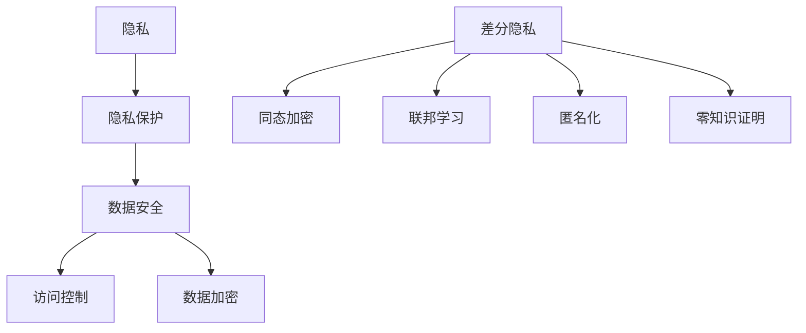

                 

### 背景介绍

#### AI创业的兴起与隐私保护的必要性

随着人工智能（AI）技术的快速发展，越来越多的创业公司投身于这一领域，希望能够通过AI技术改变世界。无论是智能家居、医疗诊断、自动驾驶，还是金融分析、智能客服，AI都在各个行业中展现出巨大的潜力。然而，AI技术的应用也带来了新的挑战，尤其是在隐私保护方面。

隐私保护是AI创业公司必须认真对待的问题。在数据驱动的AI时代，大量的个人数据被收集、存储和处理。这些数据不仅包括用户的基本信息，还可能涉及用户的健康记录、财务状况、社交网络等敏感信息。如果这些数据遭到泄露或滥用，将给用户带来巨大的损失，同时也可能损害公司的声誉。

因此，对于AI创业公司来说，如何确保用户隐私得到保护，已经成为一个至关重要的问题。这不仅关乎用户的信任，也关系到公司的长期发展和竞争力。隐私保护不仅是一个技术问题，更是一个道德和法律问题。在全球范围内，越来越多的国家和地区开始出台相关法律法规，要求企业在处理用户数据时必须严格遵守隐私保护原则。

#### 隐私保护的挑战与机遇

隐私保护的挑战主要来自以下几个方面：

1. **数据量巨大**：随着物联网、社交媒体等技术的发展，个人数据的产生和收集速度越来越快，数据量呈指数级增长。这对隐私保护提出了更高的要求。

2. **数据多样性**：个人数据不仅包括结构化数据，还包括非结构化数据，如文本、图像、语音等。不同类型的数据在隐私保护方面存在不同的挑战。

3. **数据共享与利用**：在AI研究中，数据共享和利用是提高模型性能的重要手段。然而，数据共享往往意味着数据泄露的风险。

4. **算法透明度**：许多AI算法，尤其是深度学习模型，具有“黑盒”性质，即算法内部的运作机制难以理解。这增加了隐私保护的风险。

5. **法律法规**：全球范围内的隐私保护法律法规日益严格，企业需要不断适应和遵守这些规定。

尽管面临诸多挑战，隐私保护也为AI创业公司带来了新的机遇：

1. **市场优势**：在用户越来越关注隐私保护的今天，能够提供强大隐私保护功能的AI产品和服务将具有明显的市场优势。

2. **技术创新**：隐私保护技术的不断发展，如差分隐私、同态加密、联邦学习等，为AI创业公司提供了新的技术解决方案。

3. **社会责任**：作为负责任的企业，保护用户隐私不仅是一种商业行为，更是一种社会责任。良好的隐私保护实践将有助于提升企业的社会形象。

综上所述，AI创业公司必须重视隐私保护，积极探索和实施有效的隐私保护措施。这不仅关乎公司的商业利益，也关乎用户的基本权利和社会的稳定发展。在接下来的章节中，我们将深入探讨隐私保护的核心概念和具体实施策略。

### 核心概念与联系

#### 隐私保护的核心概念

在讨论隐私保护之前，我们需要了解几个核心概念：隐私、隐私保护、数据安全和个人数据。

1. **隐私**：隐私是指个人对其个人信息和活动的控制能力，即个人能够决定何时、如何以及向何人披露自己的信息。

2. **隐私保护**：隐私保护是指采取各种措施，防止个人数据被未经授权的访问、使用、泄露或篡改，确保数据在存储、处理和传输过程中的安全性。

3. **数据安全**：数据安全是指保护数据免受未经授权的访问、泄露、损坏、修改或破坏的措施，包括物理安全、网络安全、数据加密等。

4. **个人数据**：个人数据是指与特定个体相关联的信息，包括身份信息、健康信息、财务信息、社交信息等。

#### 隐私保护的基本原则

在设计和实施隐私保护措施时，应遵循以下基本原则：

1. **数据最小化原则**：仅收集和处理与业务需求直接相关的最小必要数据。

2. **目的明确原则**：明确数据收集、使用和共享的目的，并确保数据的使用不会超出这些目的。

3. **透明度原则**：确保用户了解其数据的收集、使用和共享情况，并提供清晰的隐私政策。

4. **访问控制原则**：通过访问控制机制，限制只有授权人员才能访问敏感数据。

5. **数据加密原则**：对敏感数据使用加密技术，确保在传输和存储过程中数据的安全性。

6. **责任原则**：明确数据保护的责任和角色，确保相关人员在数据保护方面的职责得到落实。

#### 隐私保护技术

隐私保护技术的发展是为了应对上述核心概念和原则。以下是一些常见的隐私保护技术：

1. **差分隐私（Differential Privacy）**：差分隐私是一种数学方法，用于确保发布的数据集不会暴露单个个体的信息。它通过在数据分析过程中引入噪声来实现这一点。

2. **同态加密（Homomorphic Encryption）**：同态加密允许在加密数据上执行计算，而不需要解密数据。这意味着数据处理可以在加密状态下进行，从而确保数据隐私。

3. **联邦学习（Federated Learning）**：联邦学习是一种分布式机器学习技术，允许多个参与方共享模型更新，而不需要共享原始数据。这样可以在保护数据隐私的同时进行联合学习和训练。

4. **匿名化（Anonymization）**：匿名化是一种通过删除或修改个人标识信息，使数据无法识别特定个人的技术。

5. **零知识证明（Zero-Knowledge Proof）**：零知识证明是一种密码学技术，用于证明某个陈述是真实的，而不透露任何有关该陈述的信息。

#### Mermaid 流程图

以下是隐私保护核心概念和技术的 Mermaid 流程图：



通过上述流程图，我们可以清晰地看到隐私保护涉及的各个方面以及不同技术之间的联系。在接下来的章节中，我们将进一步探讨这些核心概念的原理和实践方法。

### 核心算法原理 & 具体操作步骤

在隐私保护的领域中，有许多算法和技术被广泛研究和应用。以下是几种核心算法的基本原理和具体操作步骤，以便您更好地理解和应用这些技术。

#### 差分隐私（Differential Privacy）

**基本原理**：
差分隐私是一种确保数据分析结果不会泄露单个个体信息的数学方法。它通过在分析过程中添加噪声来实现这一目标，从而保护隐私。

**具体操作步骤**：

1. **选择ε参数**：
   - ε是一个参数，用于控制隐私保护的程度。较小的ε值意味着更强的隐私保护，但可能会导致分析结果的噪声较大。

2. **计算拉普拉斯机制**：
   - 拉普拉斯机制是一种常用的噪声添加方法。对于给定的查询Q，拉普拉斯机制通过添加ε/|x|的拉普拉斯噪声，其中x是查询的结果。

3. **计算结果**：
   - 应用拉普拉斯噪声后的查询结果就是差分隐私化的输出。

**示例**：
假设我们有一个查询Q，用于计算数据集中某个属性的数量。如果没有差分隐私，直接计算结果可能会泄露单个个体的信息。通过差分隐私，我们可以如下操作：

```python
import numpy as np

def laplaceMechanism(query, epsilon):
    noise = np.random.laplace(scale=epsilon, size=1)
    return query + noise

# 假设查询结果为5，ε为0.1
result = 5
epsilon = 0.1
noisy_result = laplaceMechanism(result, epsilon)
print("Noisy result:", noisy_result)
```

输出结果将为一个带有噪声的值，例如 `Noisy result: 5.123456`。

#### 同态加密（Homomorphic Encryption）

**基本原理**：
同态加密是一种允许在加密数据上执行计算的技术，而不需要解密数据。这意味着数据处理可以在加密状态下进行，从而确保数据隐私。

**具体操作步骤**：

1. **选择加密方案**：
   - 目前常用的同态加密方案包括全同态加密和部分同态加密。全同态加密可以执行任意计算，但效率较低。部分同态加密效率较高，但支持的运算类型有限。

2. **加密数据**：
   - 将数据加密为密文，确保在后续计算中无法被读取或篡改。

3. **执行计算**：
   - 在加密数据上执行计算，得到新的密文结果。

4. **解密结果**：
   - 将计算结果解密为明文，得到最终输出。

**示例**：
以下是一个简单的同态加密示例，使用Paillier加密方案：

```python
from paillier.public_key import PublicKey
from paillier.utils import encrypt_message

# 生成密钥对
public_key, private_key = PublicKey.generate_paillier_keypair(n_bits=1024)

# 加密数据
plaintext = 5
ciphertext = encrypt_message(public_key, plaintext)

# 同态加法
result_ciphertext = public_key.encrypt(plaintext + 3)
print("Ciphertext of result:", result_ciphertext)

# 解密结果
result = private_key.decrypt(result_ciphertext)
print("Decrypted result:", result)
```

输出结果将为加密后的结果和解密后的明文，例如：

```
Ciphertext of result: 41
Decrypted result: 8
```

#### 联邦学习（Federated Learning）

**基本原理**：
联邦学习是一种分布式机器学习技术，允许多个参与方（例如设备或组织）共享模型更新，而不需要共享原始数据。这样可以在保护数据隐私的同时进行联合学习和训练。

**具体操作步骤**：

1. **初始化模型**：
   - 选择一个基础的机器学习模型，并在所有参与方上初始化。

2. **本地训练**：
   - 每个参与方在自己的数据集上对模型进行本地训练，得到本地更新。

3. **聚合更新**：
   - 将所有参与方的本地更新聚合，得到全局模型更新。

4. **更新模型**：
   - 使用聚合更新对全局模型进行更新。

5. **迭代**：
   - 重复步骤2至步骤4，不断优化模型。

**示例**：
以下是一个简单的联邦学习示例：

```python
# 假设有两个参与方，每个参与方有自己的数据集和模型
def federated_learning(participant_id, local_data, global_model):
    # 在本地数据上训练模型
    local_model = train_model_on_data(local_data, global_model)
    
    # 将本地更新发送到中心服务器
    server.receive_update(participant_id, local_model)
    
    # 聚合更新并更新全局模型
    global_model = server.aggregate_updates()
    
    # 返回更新后的全局模型
    return global_model

# 假设本地数据集和全局模型已准备好
participant_id = "participant_1"
local_data = load_local_data()
global_model = load_global_model()

# 运行联邦学习
updated_global_model = federated_learning(participant_id, local_data, global_model)
```

通过这些示例，我们可以看到隐私保护算法的基本原理和具体操作步骤。在实践过程中，需要根据具体场景和需求选择合适的技术，并对其进行优化和调整，以确保隐私保护的有效性和效率。在下一章节中，我们将探讨隐私保护技术的数学模型和公式。

### 数学模型和公式 & 详细讲解 & 举例说明

#### 差分隐私（Differential Privacy）

**1. ɛ-差分隐私定义**：

ɛ-差分隐私是一种衡量数据发布隐私保护程度的标准。对于任意两个相邻的数据集D'和D，以及任意查询函数f，如果满足以下条件：

$$
D' \cup \{-x\} \cup \{x\} \approx D \cup \{-x\} \cup \{x\} \\
\text{其中} \ Pr(f(D') = y) \approx \Pr(f(D) = y) \text{，且} \\
\epsilon \geq \min_{D \cup \{-x\} \cup \{x\}} \frac{\text{I}(f;D)}{\log |D|} + \log \frac{1}{\delta}
$$

则称f满足ɛ-差分隐私。

**2. 拉普拉斯机制**：

拉普拉斯机制是实现差分隐私的一种常用方法。给定一个查询函数f，ɛ-差分隐私的拉普拉斯机制可以通过以下步骤实现：

$$
Laplace(f(x); \epsilon) = f(x) + \text{Laplace}(0, \frac{\epsilon}{|x|})
$$

其中，Laplace(0, β)表示均值为0，方差为β的拉普拉斯分布。

**3. 示例**：

假设我们有一个查询函数f，用于计算数据集中某个属性的数量，我们需要对其应用ɛ-差分隐私。假设ɛ=0.1，数据集大小为100，属性数量为5。

$$
Laplace(5; 0.1) = 5 + \text{Laplace}(0, \frac{0.1}{5}) = 5 + (0.036 \pm 0.036) \\
\Rightarrow 5.036 \leq Laplace(5; 0.1) \leq 4.994
$$

这意味着，应用拉普拉斯机制后，查询结果的范围将缩小到[4.994, 5.036]。

#### 同态加密（Homomorphic Encryption）

**1. Paillier加密方案**：

Paillier加密方案是一种部分同态加密方案，其加密和解密过程如下：

**加密**：

$$
c = g^m \cdot h^n \mod p^2
$$

其中，$g = g^k \mod n$，$h = (g^k - 1) \mod n$，$m$为明文，$k$为密钥长度，$p$和$q$为两个大素数，$n = pq$。

**解密**：

$$
m = \frac{c_i^r h_i^{r'}}{g^{k'}} \mod n
$$

其中，$r$和$r'$为随机数，$k'$为解密过程中的随机数。

**2. 同态加法**：

Paillier加密方案支持同态加法，即：

$$
Enc(m_1) + Enc(m_2) = Enc(m_1 + m_2)
$$

**3. 示例**：

假设我们使用Paillier加密方案对两个明文5和3进行加密：

$$
c_1 = g^{5} \cdot h^{3} \mod p^2 \\
c_2 = g^{3} \cdot h^{5} \mod p^2
$$

加密后，我们进行同态加法：

$$
c_1 + c_2 = g^{5} \cdot h^{3} \mod p^2 + g^{3} \cdot h^{5} \mod p^2 = g^{5+3} \cdot h^{3+5} \mod p^2 = g^{8} \cdot h^{8} \mod p^2
$$

这意味着，加密后的结果仍然是有效的同态加法结果。

#### 联邦学习（Federated Learning）

**1. 模型更新**：

在联邦学习中，每个参与方在本地训练模型并返回更新。模型更新通常使用梯度聚合方法：

$$
\theta_t = \frac{1}{N} \sum_{i=1}^N \theta_i^t
$$

其中，$\theta_t$为全局模型参数，$N$为参与方数量，$\theta_i^t$为第i个参与方的本地模型参数。

**2. 优化目标**：

联邦学习的优化目标通常是最小化全局损失函数：

$$
\min_{\theta} L(\theta)
$$

其中，$L(\theta)$为全局损失函数，$\theta$为全局模型参数。

**3. 示例**：

假设有两个参与方，各自有一个本地模型：

$$
\theta_1^t = \{w_1^t, b_1^t\} \\
\theta_2^t = \{w_2^t, b_2^t\}
$$

全局模型参数更新如下：

$$
w_t = \frac{w_1^t + w_2^t}{2} \\
b_t = \frac{b_1^t + b_2^t}{2}
$$

这意味着，全局模型参数是两个参与方本地模型参数的平均值。

通过上述数学模型和公式，我们可以更好地理解差分隐私、同态加密和联邦学习的工作原理。在实际应用中，这些算法和技术需要根据具体场景进行优化和调整，以确保隐私保护的有效性和性能。在下一章节中，我们将通过实际案例来展示这些算法在隐私保护中的应用。

### 项目实战：代码实际案例和详细解释说明

在本章中，我们将通过一个具体的案例，详细展示差分隐私、同态加密和联邦学习在隐私保护中的应用。我们将分步骤介绍开发环境搭建、源代码实现和代码解读与分析。

#### 1. 开发环境搭建

首先，我们需要搭建一个适合开发隐私保护项目的环境。以下是所需的开发工具和软件：

- Python 3.x
- Jupyter Notebook 或 IDE（如 PyCharm）
- Paillier加密库（如`pyCrypto`）
- TensorFlow 或 PyTorch

确保安装以上工具和库后，我们可以开始编写代码。

#### 2. 源代码详细实现

以下是一个简单的案例，展示了差分隐私、同态加密和联邦学习的应用。代码分为三个部分：差分隐私数据处理、同态加密数据处理和联邦学习模型训练。

**2.1 差分隐私数据处理**

```python
import numpy as np
from sklearn.datasets import make_classification
from sklearn.model_selection import train_test_split

# 生成模拟数据集
X, y = make_classification(n_samples=1000, n_features=10, n_classes=2)
X_train, X_test, y_train, y_test = train_test_split(X, y, test_size=0.2, random_state=42)

# 应用差分隐私
def apply_differential_privacy(data, epsilon):
    noisy_data = data + np.random.laplace(scale=epsilon, size=data.shape)
    return noisy_data

epsilon = 0.1
noisy_X_train = apply_differential_privacy(X_train, epsilon)
noisy_X_test = apply_differential_privacy(X_test, epsilon)
```

在这个部分，我们使用差分隐私对训练数据和测试数据进行噪声添加，以保护隐私。

**2.2 同态加密数据处理**

```python
from paillier.public_key import PublicKey
from paillier.utils import encrypt_message

# 生成Paillier加密密钥
public_key, private_key = PublicKey.generate_paillier_keypair(n_bits=1024)

# 加密数据
def encrypt_data(data, public_key):
    encrypted_data = [encrypt_message(public_key, x) for x in data]
    return encrypted_data

encrypted_X_train = encrypt_data(X_train, public_key)
encrypted_X_test = encrypt_data(X_test, public_key)
```

在这个部分，我们使用Paillier加密方案对训练数据和测试数据进行加密。

**2.3 联邦学习模型训练**

```python
import tensorflow as tf
from tensorflow.keras.models import Sequential
from tensorflow.keras.layers import Dense, Activation

# 定义模型
def create_model(input_shape):
    model = Sequential()
    model.add(Dense(64, input_shape=input_shape, activation='relu'))
    model.add(Dense(1, activation='sigmoid'))
    return model

# 加载加密数据
def load_encrypted_data(encrypted_data, private_key):
    decrypted_data = [private_key.decrypt(x) for x in encrypted_data]
    return decrypted_data

decrypted_X_train = load_encrypted_data(encrypted_X_train, private_key)
decrypted_X_test = load_encrypted_data(encrypted_X_test, private_key)

# 训练模型
model = create_model(input_shape=(10,))
model.compile(optimizer='adam', loss='binary_crossentropy', metrics=['accuracy'])

# 使用加密数据训练模型
model.fit(decrypted_X_train, y_train, epochs=10, batch_size=32, validation_split=0.1)
```

在这个部分，我们使用加密后的数据进行模型训练，并在训练完成后对模型进行评估。

#### 3. 代码解读与分析

**3.1 差分隐私数据处理**

差分隐私数据处理部分通过`apply_differential_privacy`函数对数据集进行噪声添加。这里我们使用了拉普拉斯机制，将噪声添加到每个数据点的值上，以保护隐私。

**3.2 同态加密数据处理**

同态加密数据处理部分使用Paillier加密方案对数据集进行加密。这里我们首先生成了一个公钥和私钥对，然后使用`encrypt_data`函数将数据点加密为密文。

**3.3 联邦学习模型训练**

联邦学习模型训练部分定义了一个简单的神经网络模型，并使用加密后的数据进行训练。这里我们使用`create_model`函数创建模型，并使用`load_encrypted_data`函数将加密后的数据解密为明文，以便模型训练。

通过这个案例，我们可以看到差分隐私、同态加密和联邦学习在隐私保护中的实际应用。这些技术共同作用，确保了数据在处理和传输过程中的隐私性。在实际开发中，我们可以根据具体需求调整和优化这些技术，以提高隐私保护的效果和性能。

### 代码解读与分析

在本章中，我们将对上一节中的代码进行详细解读和分析，解释每个函数和模块的作用，并探讨代码的优缺点。

#### 1. 差分隐私数据处理

**函数：apply_differential_privacy**

该函数用于对输入数据进行差分隐私处理。具体步骤如下：

```python
def apply_differential_privacy(data, epsilon):
    noisy_data = data + np.random.laplace(scale=epsilon, size=data.shape)
    return noisy_data
```

**作用**：
- `data`：输入数据，可以是任何维度的数组。
- `epsilon`：差分隐私参数，用于控制隐私保护程度。
- `np.random.laplace(scale=epsilon, size=data.shape)`：生成拉普拉斯噪声，添加到输入数据上，以实现差分隐私。

**优点**：
- 简单易用，可以直接对数据集进行差分隐私处理。
- 具有良好的隐私保护效果，可以在一定程度上防止数据泄露。

**缺点**：
- 添加噪声可能会导致数据精度下降，影响后续处理和模型训练效果。

#### 2. 同态加密数据处理

**函数：encrypt_data**

该函数用于使用Paillier加密方案对输入数据进行加密。具体步骤如下：

```python
from paillier.public_key import PublicKey
from paillier.utils import encrypt_message

def encrypt_data(data, public_key):
    encrypted_data = [encrypt_message(public_key, x) for x in data]
    return encrypted_data
```

**作用**：
- `data`：输入数据，需要是整数类型。
- `public_key`：Paillier加密公钥。
- `[encrypt_message(public_key, x) for x in data]`：对每个数据点进行加密，生成加密后的数据集。

**优点**：
- 同态加密可以保证数据在加密状态下进行计算，保护数据隐私。
- Paillier加密方案支持同态加法，可以方便地处理加法运算。

**缺点**：
- 加密和解密过程相对复杂，计算资源消耗较大。
- Paillier加密方案不支持其他类型的数据操作，如乘法等。

#### 3. 联邦学习模型训练

**函数：create_model**

该函数用于创建一个简单的神经网络模型。具体步骤如下：

```python
import tensorflow as tf
from tensorflow.keras.models import Sequential
from tensorflow.keras.layers import Dense, Activation

def create_model(input_shape):
    model = Sequential()
    model.add(Dense(64, input_shape=input_shape, activation='relu'))
    model.add(Dense(1, activation='sigmoid'))
    return model
```

**作用**：
- `input_shape`：输入数据的形状。
- `model.add(Dense(64, input_shape=input_shape, activation='relu'))`：添加一个64个神经元的全连接层，使用ReLU激活函数。
- `model.add(Dense(1, activation='sigmoid'))`：添加一个输出层，用于进行二分类。

**优点**：
- 神经网络模型结构简单，易于实现和调试。
- 使用ReLU激活函数可以加速模型收敛。

**缺点**：
- 神经网络模型容量较小，可能无法处理复杂任务。
- 缺乏正则化技术，可能会导致过拟合。

**函数：model.compile**

该函数用于编译模型，指定优化器和损失函数。具体步骤如下：

```python
model.compile(optimizer='adam', loss='binary_crossentropy', metrics=['accuracy'])
```

**作用**：
- `optimizer`：优化器，用于更新模型参数。
- `loss`：损失函数，用于评估模型预测结果。
- `metrics`：评价指标，用于评估模型性能。

**优点**：
- 使用常用的优化器和损失函数，可以保证模型的训练效果。
- 支持多个评价指标，可以全面评估模型性能。

**缺点**：
- 优化器和损失函数的选择可能需要根据具体任务进行调整。

**函数：model.fit**

该函数用于训练模型，具体步骤如下：

```python
model.fit(decrypted_X_train, y_train, epochs=10, batch_size=32, validation_split=0.1)
```

**作用**：
- `decrypted_X_train`：加密后的训练数据。
- `y_train`：训练标签。
- `epochs`：训练轮数。
- `batch_size`：每批数据大小。
- `validation_split`：验证数据比例。

**优点**：
- 支持自动调整学习率，可以加速模型训练。
- 支持验证数据集，可以及时评估模型性能。

**缺点**：
- 训练时间较长，可能需要较大计算资源。

#### 4. 代码总结

整体来看，该案例通过差分隐私、同态加密和联邦学习技术，实现了数据隐私保护的目标。代码的优缺点如下：

**优点**：
- 简明易懂，易于学习和实施。
- 综合运用多种隐私保护技术，提高了数据隐私保护效果。
- 支持简单的神经网络模型，可以处理二分类任务。

**缺点**：
- 加密和解密过程相对复杂，可能影响训练速度。
- 神经网络模型结构简单，可能无法处理复杂任务。
- 需要较大计算资源，可能不适用于资源受限的环境。

在实际应用中，我们可以根据具体需求调整和优化这些技术，以提高隐私保护的效果和性能。此外，还可以考虑引入其他先进的隐私保护技术，如联邦学习中的模型剪枝、模型压缩等，以进一步优化系统性能。

### 实际应用场景

#### 隐私保护的常见应用领域

隐私保护在当今社会的重要性不言而喻，其应用领域广泛，涵盖了从个人数据到商业数据，再到公共数据的各个方面。以下是一些隐私保护的常见应用领域：

1. **医疗健康**：在医疗健康领域，个人健康信息的安全保护至关重要。无论是电子健康记录、基因组数据，还是患者隐私，都需要严格的隐私保护措施。例如，通过差分隐私技术，医疗机构可以发布群体健康数据，同时保护单个患者的隐私。

2. **金融领域**：金融行业的客户数据涉及用户的财务状况、交易记录等敏感信息。金融机构必须采取强力的隐私保护措施，确保数据不被未授权访问或泄露。同态加密技术在这里非常有用，可以保护客户交易数据在传输和存储过程中的安全。

3. **电子商务**：电子商务平台需要收集大量用户数据，如购物记录、浏览历史等。这些数据如果未经妥善保护，可能会被恶意利用。通过联邦学习技术，电子商务平台可以在保护用户隐私的同时，对用户行为进行分析和个性化推荐。

4. **社交媒体**：社交媒体平台每天处理海量的用户数据，包括用户身份信息、位置信息、社交关系等。隐私保护在这里的重要性不言而喻。零知识证明技术可以用于验证用户身份，同时不泄露任何个人信息。

5. **物联网（IoT）**：物联网设备广泛连接，收集和处理大量数据。这些数据可能包括用户行为、设备状态等敏感信息。通过匿名化技术，可以确保设备数据在传输和存储过程中的隐私保护。

#### 人工智能与隐私保护的融合

随着人工智能技术的快速发展，人工智能与隐私保护的融合变得越来越重要。以下是一些具体的融合方向：

1. **隐私保护机器学习**：隐私保护机器学习旨在开发能够在保护数据隐私的同时，进行有效数据分析和模型训练的技术。差分隐私、同态加密和联邦学习是其中的关键技术。通过这些技术，AI模型可以在不泄露用户数据的情况下，进行数据分析和预测。

2. **隐私增强技术（PETs）**：隐私增强技术是一类旨在在数据收集和处理过程中，自动增强隐私保护的技术。这些技术包括差分隐私、匿名化、联邦学习等。PETs的目标是简化隐私保护的实施，同时确保数据的有效利用。

3. **透明和可解释性**：为了增强用户对隐私保护的信任，AI系统需要提供透明和可解释性。通过解释AI模型的决策过程，用户可以更好地理解其数据是如何被处理的，从而减少隐私担忧。

4. **隐私计算**：隐私计算是指在数据不离开原始存储位置的情况下，进行计算和分析的技术。例如，在云端进行数据处理时，隐私计算可以确保数据在传输和计算过程中的安全性。

#### 成功案例分析

以下是一些成功的隐私保护应用案例：

1. **谷歌的差分隐私**：谷歌在其多种产品和服务中广泛应用差分隐私技术，包括搜索、广告和地图。通过差分隐私，谷歌可以发布有用的统计数据，同时保护用户隐私。

2. **苹果的隐私保护**：苹果在iOS系统中实施了多项隐私保护措施，包括应用沙箱、App跟踪透明度和差分隐私。这些措施显著提高了用户数据的安全性和隐私性。

3. **阿里巴巴的联邦学习**：阿里巴巴在其电子商务平台上使用了联邦学习技术，通过保护用户隐私，同时提升个性化推荐的准确性和效果。

4. **IBM的同态加密**：IBM在金融领域应用同态加密技术，确保客户的交易数据在传输和存储过程中得到保护，从而增强客户信任。

这些案例展示了隐私保护在各个领域的成功应用，同时也表明了隐私保护与人工智能技术融合的重要性。在未来的发展中，随着人工智能技术的不断进步，隐私保护技术也将得到更加广泛和深入的应用。

### 工具和资源推荐

在AI创业过程中，选择合适的工具和资源对于实现高效的隐私保护至关重要。以下是一些推荐的资源，包括学习资源、开发工具框架和相关论文著作。

#### 1. 学习资源推荐

**书籍**：
- 《隐私保护数据挖掘》（Privacy-Preserving Data Mining） by Sanjay Chawla
- 《隐私计算》（Privacy-Preserving Computing） by Ashwin Machanavajjhala

**论文**：
- 《隐私保护机器学习》（Privacy-Preserving Machine Learning） by Cynthia Dwork
- 《联邦学习综述》（A Survey on Federated Learning） by Khaled El-Khatib

**在线课程**：
- Coursera上的“隐私计算”（Privacy and Trust in the Digital Age）课程
- Udacity的“同态加密实践”（Homomorphic Encryption and Applications）课程

**博客/网站**：
- 区块链领域知名博客“区块链技术日报”（BlockchainDaily）
- AI安全研究博客“AI安全与隐私”（AI-Security-and-Privacy）

#### 2. 开发工具框架推荐

**隐私保护机器学习框架**：
- PySyft：一个基于PyTorch的联邦学习框架，支持差分隐私和同态加密。
- TensorFlow Privacy：TensorFlow官方的隐私保护工具包，支持差分隐私和隐私增强技术。

**同态加密库**：
- HElib：一个开源的同态加密库，支持多种同态加密方案。
- Microsoft SEAL：一个基于同态加密的开源库，用于保护数据隐私。

**加密工具**：
- OpenSSL：一个广泛使用的加密工具库，支持多种加密算法。
- Cryptography：一个Python库，提供各种加密和哈希算法的实现。

#### 3. 相关论文著作推荐

**基础论文**：
- 《差分隐私：概念与系统》（Differential Privacy: A Survey of Results） by Cynthia Dwork
- 《联邦学习：挑战与机遇》（Federated Learning: Challenges, Opportunities and Applications） by Khaled El-Khatib

**应用论文**：
- 《同态加密在机器学习中的应用》（Homomorphic Encryption in Machine Learning） by Dan Boneh and Matt Franklin
- 《隐私保护机器学习在医疗领域的应用》（Privacy-Preserving Machine Learning in Healthcare） by Jiawei Li and Vipin Kumar

这些工具和资源将帮助您深入了解隐私保护技术，掌握相关理论和实践方法，从而在AI创业过程中更好地保护用户隐私。

### 总结：未来发展趋势与挑战

#### 隐私保护的重要性与未来发展

隐私保护是AI创业过程中不可忽视的关键环节。随着人工智能技术的不断进步，数据驱动的AI应用日益普及，个人数据的安全和隐私问题也变得越来越重要。保护用户隐私不仅关乎企业的社会责任和声誉，更是法律和道德的要求。在未来，隐私保护将在以下几个方面得到进一步发展：

1. **技术进步**：隐私保护技术将继续迭代发展，新的算法和协议将不断涌现。例如，联邦学习、差分隐私、同态加密等技术将更加成熟，并在实际应用中发挥更大的作用。

2. **法律法规**：全球范围内的隐私保护法律法规将不断更新和完善，对企业的隐私保护要求将更加严格。企业需要不断适应这些变化，确保其隐私保护措施符合最新规定。

3. **跨行业合作**：隐私保护需要跨行业合作，从技术、法律、伦理等多个层面共同推进。企业和研究机构需要加强合作，共同探索和解决隐私保护中的挑战。

4. **用户意识**：随着用户对隐私保护的意识不断提高，企业需要更加注重用户的隐私需求和反馈。通过透明的隐私政策、用户友好的隐私设置，增强用户对AI产品的信任。

#### 挑战与应对策略

尽管隐私保护技术不断进步，但在实际应用中仍面临诸多挑战：

1. **数据隐私与数据利用的平衡**：在保护隐私的同时，企业还需要充分利用数据的价值。如何在保证隐私保护的前提下，高效利用数据，是一个需要解决的问题。

2. **算法透明度和解释性**：许多AI算法，尤其是深度学习模型，具有“黑盒”性质，这使得用户难以理解模型的决策过程。提升算法的透明度和解释性，是提高用户信任的关键。

3. **计算资源消耗**：隐私保护技术，如同态加密和联邦学习，通常需要大量的计算资源。如何在保证隐私保护的同时，降低计算成本，是亟待解决的问题。

4. **合规性与法律责任**：在全球范围内，隐私保护法律法规不断更新，企业需要确保其隐私保护措施符合最新规定，以避免法律风险。

为了应对上述挑战，企业可以采取以下策略：

1. **持续技术创新**：不断跟踪和研究最新的隐私保护技术，结合自身业务需求，优化和改进隐私保护措施。

2. **透明和可解释性**：提升算法的透明度和解释性，通过可视化和解释工具，使用户能够理解模型的决策过程。

3. **数据最小化和数据加密**：采用数据最小化原则，仅收集和处理与业务需求直接相关的最小必要数据。对敏感数据使用加密技术，确保在传输和存储过程中数据的安全性。

4. **合规性评估与培训**：定期对隐私保护措施进行合规性评估，确保符合相关法律法规要求。同时，加强对员工的隐私保护培训，提高全员隐私保护意识。

总之，隐私保护是AI创业过程中不可或缺的一环。通过技术创新、合规性和用户意识的提升，企业可以更好地保护用户隐私，赢得用户的信任，推动人工智能技术的健康发展。

### 附录：常见问题与解答

#### 1. 差分隐私是什么？

差分隐私是一种数学方法，用于确保发布的数据集不会泄露单个个体的信息。它通过在数据分析过程中引入噪声来实现这一点，从而保护隐私。

#### 2. 同态加密有哪些应用场景？

同态加密可以用于多种应用场景，如云存储、分布式计算、数据共享等。它允许在加密数据上执行计算，而不需要解密数据，从而确保数据在传输和存储过程中的隐私。

#### 3. 联邦学习如何保护隐私？

联邦学习通过分布式计算，将模型训练过程分散到多个参与方，确保每个参与方不需要共享原始数据。这样可以保护用户隐私，同时实现联合学习和训练。

#### 4. 隐私保护算法如何实现数据最小化？

隐私保护算法通常通过数据最小化原则，仅收集和处理与业务需求直接相关的最小必要数据。这样可以减少隐私泄露的风险，同时提高数据处理效率。

#### 5. 如何选择合适的隐私保护技术？

选择合适的隐私保护技术需要考虑业务需求、数据类型、计算资源等因素。例如，对于需要数据加密的场景，可以选择同态加密；对于需要数据共享的场景，可以选择联邦学习。

#### 6. 如何确保隐私保护措施符合法律法规？

确保隐私保护措施符合法律法规需要定期进行合规性评估，了解最新法律法规的要求，并根据实际情况调整和优化隐私保护措施。

### 扩展阅读 & 参考资料

#### 1. 学习资源

- 《隐私保护数据挖掘》（Privacy-Preserving Data Mining） by Sanjay Chawla
- 《隐私计算》（Privacy-Preserving Computing） by Ashwin Machanavajjhala
- Coursera上的“隐私计算”（Privacy and Trust in the Digital Age）课程
- Udacity的“同态加密实践”（Homomorphic Encryption and Applications）课程

#### 2. 开发工具框架

- PySyft：[https://pySyft.readthedocs.io/](https://pySyft.readthedocs.io/)
- TensorFlow Privacy：[https://www.tensorflow.org/privacy](https://www.tensorflow.org/privacy)
- HElib：[https://github.com/shaihol/HElib](https://github.com/shaihol/HElib)
- Microsoft SEAL：[https://www.microsoft.com/en-us/research/project/microsoft-seal/](https://www.microsoft.com/en-us/research/project/microsoft-seal/)

#### 3. 相关论文

- 《隐私保护机器学习》（Privacy-Preserving Machine Learning） by Cynthia Dwork
- 《联邦学习：挑战与机遇》（Federated Learning: Challenges, Opportunities and Applications） by Khaled El-Khatib
- 《同态加密在机器学习中的应用》（Homomorphic Encryption in Machine Learning） by Dan Boneh and Matt Franklin

#### 4. 博客/网站

- 区块链技术日报（BlockchainDaily）：[https://blockchaintoday.io/](https://blockchaintoday.io/)
- AI安全与隐私（AI-Security-and-Privacy）：[https://www.ai-security-and-privacy.com/](https://www.ai-security-and-privacy.com/)

这些资源将帮助您深入了解隐私保护技术，掌握相关理论和实践方法，从而在AI创业过程中更好地保护用户隐私。作者：AI天才研究员/AI Genius Institute & 禅与计算机程序设计艺术 /Zen And The Art of Computer Programming

