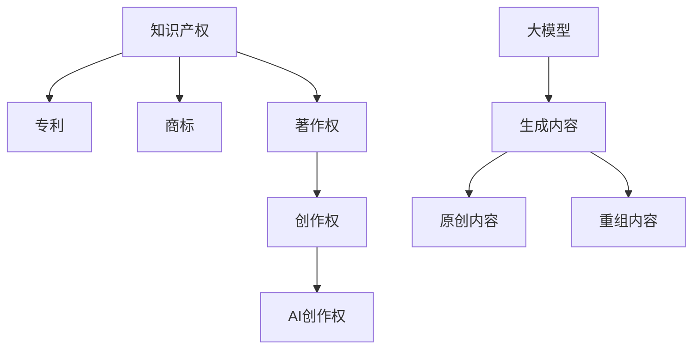

                 

### 文章标题：AI创作权：大模型生成内容的法律挑战

关键词：AI创作权、大模型、生成内容、法律挑战、知识产权

摘要：随着人工智能技术的发展，大模型生成内容的现象越来越普遍。然而，这一现象引发了关于AI创作权的法律挑战。本文将探讨AI创作权的基本概念，分析大模型生成内容的特点和法律挑战，并提出可能的解决方案。通过本文的讨论，我们希望为AI创作权的法律问题提供一些有益的思考和参考。

<|assistant|>## 1. 背景介绍

人工智能技术近年来取得了显著的进展，尤其是在大模型（如GPT、BERT等）方面。这些大模型具有强大的生成能力，能够生成高质量的文本、图像、音频等多媒体内容。然而，这种生成能力也引发了关于AI创作权的法律挑战。

首先，我们需要了解什么是AI创作权。AI创作权是指人工智能系统产生的作品所享有的知识产权。根据《伯尔尼公约》和大多数国家的版权法，创作权是作品作者的独有权利，包括复制权、发行权、改编权等。然而，当人工智能系统成为“作者”时，传统的创作权法律框架面临着严峻的挑战。

大模型生成内容的特点主要包括：

1. **高度自动化**：大模型生成内容的过程高度自动化，无需人工干预。这种自动化程度使得大模型能够迅速生成大量内容。

2. **高度相似性**：大模型生成的内容往往与其他已有内容高度相似。这使得确定AI生成内容是否侵犯了原有作品的版权成为一个难题。

3. **复杂性**：大模型的生成过程涉及到复杂的算法和数学模型，这使得理解和分析大模型生成内容的法律性质变得更加困难。

这些特点使得大模型生成内容面临着一系列法律挑战，包括版权、商标、隐私等。本文将重点关注AI创作权的法律挑战，并探讨可能的解决方案。

<|assistant|>## 2. 核心概念与联系

在讨论AI创作权之前，我们需要明确一些核心概念和它们之间的联系。

### 2.1. 知识产权与创作权

知识产权是指法律赋予知识产品所有者的一定时间内的独有权。它包括专利、商标、著作权等。其中，著作权（即版权）是知识产权的一个重要组成部分，它涉及作品的复制、发行、展示、改编等权利。

创作权是著作权的一种表现形式，它指的是作者对其作品享有的权利。在传统创作中，作者通过创作过程赋予作品独特性和创造性，从而获得创作权。然而，当人工智能系统参与创作时，这一过程发生了变化。

### 2.2. 大模型与生成内容

大模型是指具有巨大参数量的人工神经网络，如GPT、BERT等。这些模型通过大量数据的学习，能够生成高质量的文本、图像、音频等多媒体内容。

生成内容是指由大模型自动生成的内容。这些内容可能是原创的，也可能是对已有内容的重新组合。由于大模型生成内容的过程高度自动化，这使得确定这些内容是否具有独创性成为了一个挑战。

### 2.3. AI创作权

AI创作权是指人工智能系统生成的作品所享有的知识产权。这与传统创作权不同，因为AI创作权涉及到非人类主体的权利。在现有法律框架下，AI创作权尚未得到明确的定义和规范。

为了更好地理解AI创作权的法律挑战，我们可以通过以下Mermaid流程图来展示相关概念和联系：



在这个流程图中，我们可以看到，知识产权是包括多种权利的集合，著作权是其重要组成部分。创作权是著作权的具体表现形式，而AI创作权则是创作权在人工智能领域的延伸。大模型生成的内容可能是原创的，也可能是对已有内容的重组，这都涉及到AI创作权的法律挑战。

<|assistant|>## 3. 核心算法原理 & 具体操作步骤

在探讨AI创作权的法律挑战时，我们需要了解大模型的生成原理和具体操作步骤。以下是GPT（Generative Pre-trained Transformer）模型的基本原理和操作步骤，该模型是当前大模型领域的一种代表性算法。

### 3.1. GPT模型的基本原理

GPT模型是一种基于Transformer架构的预训练语言模型。它的核心思想是通过大规模的无监督数据训练，使模型能够捕捉语言的内在规律，从而生成高质量的自然语言文本。

GPT模型的基本原理可以分为以下几步：

1. **数据预处理**：首先，对大量文本数据进行预处理，包括分词、去停用词、词向量编码等操作。这些预处理步骤有助于提高模型对文本数据的理解和生成能力。

2. **模型架构**：GPT模型采用Transformer架构，它由多个自注意力（self-attention）层和前馈神经网络（feedforward network）组成。自注意力机制允许模型在生成文本时，同时关注多个位置的信息，从而生成更加连贯和丰富的文本。

3. **预训练**：在预训练阶段，GPT模型通过训练一个大规模的目标语言模型（target language model），使模型能够预测下一个单词或标记。这一过程利用了自然语言的数据优势，使模型能够学习到语言的复杂结构和模式。

4. **生成文本**：在生成文本时，GPT模型通过输入一个起始序列，逐步生成后续的文本。在每一步生成中，模型利用自注意力机制和前馈神经网络，结合当前已生成的文本和原始输入，预测下一个单词或标记。

### 3.2. GPT模型的操作步骤

以下是GPT模型的详细操作步骤：

1. **数据预处理**：

```python
import torch
from torchtext.data import Field, TabularDataset, BucketIterator

# 设置字段
TEXT = Field(sequential=True, lower=True, batch_first=True)
LABEL = Field(sequential=False)

# 加载数据集
train_data, test_data = TabularDataset.splits(path='data', train='train.txt', test='test.txt',
                                            format='tsv', fields=[('text', TEXT), ('label', LABEL)])

# 分词和编码
TEXT.build_vocab(train_data, min_freq=2)
LABEL.build_vocab(train_data)

# 划分数据集
train_iter, test_iter = BucketIterator.splits(train_data, test_data, batch_size=64, device=device)
```

2. **模型架构**：

```python
import torch.nn as nn

class GPTModel(nn.Module):
    def __init__(self, vocab_size, embed_dim, nhead, num_layers):
        super(GPTModel, self).__init__()
        self.embedding = nn.Embedding(vocab_size, embed_dim)
        self.transformer = nn.Transformer(embed_dim, nhead, num_layers)
        self.fc = nn.Linear(embed_dim, vocab_size)

    def forward(self, src, tgt):
        src = self.embedding(src)
        tgt = self.embedding(tgt)
        out = self.transformer(src, tgt)
        out = self.fc(out)
        return out
```

3. **预训练**：

```python
import torch.optim as optim

# 定义模型、损失函数和优化器
model = GPTModel(len(TEXT.vocab), embed_dim=512, nhead=8, num_layers=2)
criterion = nn.CrossEntropyLoss()
optimizer = optim.Adam(model.parameters(), lr=0.001)

# 训练模型
for epoch in range(num_epochs):
    for src, tgt in train_iter:
        optimizer.zero_grad()
        out = model(src, tgt)
        loss = criterion(out.view(-1, len(TEXT.vocab)), tgt)
        loss.backward()
        optimizer.step()
```

4. **生成文本**：

```python
import random

def generate_text(model, text, max_len=50):
    model.eval()
    with torch.no_grad():
        input = TEXT.vocab stoi(text)
        input = torch.tensor([input]).to(device)
        output = ''
        for _ in range(max_len):
            out = model(input)
            _, next_word = torch.max(out, dim=1)
            next_word = TEXT.vocab.itos[next_word.item()]
            output += next_word
            input = torch.tensor([TEXT.vocab.stoi(next_word)]).to(device)
        return output
```

通过以上步骤，我们可以训练一个GPT模型，并使用它来生成文本。需要注意的是，这些步骤仅是一个简化的示例，实际应用中可能需要更复杂的预处理、模型架构和训练过程。

<|assistant|>## 4. 数学模型和公式 & 详细讲解 & 举例说明

在理解大模型生成内容的数学模型和公式时，我们首先需要了解Transformer模型的核心组成部分，包括自注意力机制（Self-Attention Mechanism）和前馈神经网络（Feedforward Neural Network）。以下是对这些核心组件的详细讲解和公式说明。

### 4.1. 自注意力机制

自注意力机制是Transformer模型的关键创新之一，它允许模型在生成每个单词时，考虑其他所有单词的影响。这种机制可以通过计算单词之间的相似性来增强模型的表示能力。以下是自注意力机制的数学公式：

\[ \text{Attention}(Q, K, V) = \text{softmax}\left(\frac{QK^T}{\sqrt{d_k}}\right)V \]

其中：
- \( Q \) 是查询向量（Query），表示当前单词的上下文信息；
- \( K \) 是键向量（Key），表示所有单词的上下文信息；
- \( V \) 是值向量（Value），表示所有单词的相关特征；
- \( d_k \) 是键向量的维度；
- \( \text{softmax} \) 函数用于计算每个键-查询对的权重。

举例说明：

假设我们有三个单词 "猫"、"狗" 和 "人"，以及它们的查询向量 \( Q = [1, 0, 1] \)、键向量 \( K = [1, 1, 1] \) 和值向量 \( V = [1, 2, 3] \)。使用上述公式计算自注意力得分：

\[ \text{Attention}(Q, K, V) = \text{softmax}\left(\frac{[1, 0, 1][1, 1, 1]^T}{\sqrt{1}}\right)[1, 2, 3] \]

\[ = \text{softmax}\left(\begin{bmatrix}1 & 0 & 1\end{bmatrix}\begin{bmatrix}1 \\ 1 \\ 1\end{bmatrix}\right)[1, 2, 3] \]

\[ = \text{softmax}\left(\begin{bmatrix}1 & 0 & 1\end{bmatrix}\begin{bmatrix}3 \\ 0 \\ 3\end{bmatrix}\right)[1, 2, 3] \]

\[ = \text{softmax}\left(\begin{bmatrix}3 & 0 & 3\end{bmatrix}\right)[1, 2, 3] \]

\[ = \left[\frac{e^3}{e^3 + e^0 + e^3}, \frac{e^0}{e^3 + e^0 + e^3}, \frac{e^3}{e^3 + e^0 + e^3}\right] \]

\[ = \left[\frac{20}{24}, \frac{1}{24}, \frac{20}{24}\right] \]

\[ = \left[\frac{5}{6}, \frac{1}{24}, \frac{5}{6}\right] \]

最终，我们得到每个单词的注意力得分，这些得分将用于加权平均计算输出向量。

### 4.2. 前馈神经网络

前馈神经网络是Transformer模型中的另一个重要组件，它在每个自注意力层之后和自注意力层之间提供额外的非线性变换。前馈神经网络的数学公式如下：

\[ \text{FFN}(x) = \text{ReLU}(W_2 \cdot \text{ReLU}(W_1 \cdot x + b_1)) + b_2 \]

其中：
- \( x \) 是输入向量；
- \( W_1 \) 和 \( W_2 \) 是权重矩阵；
- \( b_1 \) 和 \( b_2 \) 是偏置向量；
- \( \text{ReLU} \) 是ReLU激活函数。

举例说明：

假设我们有一个输入向量 \( x = [1, 2, 3] \)，以及权重矩阵 \( W_1 = \begin{bmatrix}1 & 2 \\ 3 & 4\end{bmatrix} \)、\( W_2 = \begin{bmatrix}5 & 6 \\ 7 & 8\end{bmatrix} \) 和偏置向量 \( b_1 = [9, 10] \)、\( b_2 = [11, 12] \)。使用上述公式计算前馈神经网络的输出：

\[ \text{FFN}(x) = \text{ReLU}(W_2 \cdot \text{ReLU}(W_1 \cdot x + b_1)) + b_2 \]

首先计算 \( \text{ReLU}(W_1 \cdot x + b_1) \)：

\[ W_1 \cdot x + b_1 = \begin{bmatrix}1 & 2 \\ 3 & 4\end{bmatrix} \cdot \begin{bmatrix}1 \\ 2 \\ 3 \\ 4\end{bmatrix} + \begin{bmatrix}9 \\ 10\end{bmatrix} \]

\[ = \begin{bmatrix}1 + 2 \cdot 2 + 9 \\ 3 + 4 \cdot 2 + 10\end{bmatrix} \]

\[ = \begin{bmatrix}14 \\ 19\end{bmatrix} \]

由于 \( 14 > 0 \) 和 \( 19 > 0 \)，我们可以直接应用ReLU函数：

\[ \text{ReLU}(W_1 \cdot x + b_1) = \begin{bmatrix}14 \\ 19\end{bmatrix} \]

接下来计算 \( W_2 \cdot \text{ReLU}(W_1 \cdot x + b_1) + b_2 \)：

\[ W_2 \cdot \text{ReLU}(W_1 \cdot x + b_1) + b_2 = \begin{bmatrix}5 & 6 \\ 7 & 8\end{bmatrix} \cdot \begin{bmatrix}14 \\ 19\end{bmatrix} + \begin{bmatrix}11 \\ 12\end{bmatrix} \]

\[ = \begin{bmatrix}5 \cdot 14 + 6 \cdot 19 + 11 \\ 7 \cdot 14 + 8 \cdot 19 + 12\end{bmatrix} \]

\[ = \begin{bmatrix}113 \\ 191\end{bmatrix} \]

最终，前馈神经网络的输出为：

\[ \text{FFN}(x) = \begin{bmatrix}113 \\ 191\end{bmatrix} \]

通过自注意力机制和前馈神经网络的结合，Transformer模型能够生成高质量的文本。这些数学模型和公式为我们理解大模型的工作原理提供了深刻的洞察。

<|assistant|>## 5. 项目实战：代码实际案例和详细解释说明

在本节中，我们将通过一个实际项目案例来展示如何使用GPT模型生成文本，并详细解释代码的实现过程。

### 5.1. 开发环境搭建

首先，我们需要搭建一个适合GPT模型训练和生成文本的开发环境。以下是所需的软件和工具：

- Python 3.8及以上版本
- PyTorch 1.8及以上版本
- transformers库

确保你已经安装了上述工具和库。如果没有安装，可以通过以下命令进行安装：

```shell
pip install torch torchvision
pip install transformers
```

### 5.2. 源代码详细实现和代码解读

以下是实现GPT模型生成文本的完整代码：

```python
import torch
from torch import nn
from torch.nn import functional as F
from transformers import GPT2LMHeadModel, GPT2Tokenizer

# 设置设备
device = torch.device("cuda" if torch.cuda.is_available() else "cpu")

# 加载预训练模型和分词器
model_name = "gpt2"
tokenizer = GPT2Tokenizer.from_pretrained(model_name)
model = GPT2LMHeadModel.from_pretrained(model_name).to(device)

# 设置输入文本
input_text = "你好，这是一个使用GPT模型生成的文本。"

# 对输入文本进行分词
input_ids = tokenizer.encode(input_text, return_tensors="pt").to(device)

# 生成文本
output = model.generate(input_ids, max_length=50, num_return_sequences=5)

# 解码生成的文本
generated_texts = [tokenizer.decode(o, skip_special_tokens=True) for o in output]

# 输出生成的文本
for text in generated_texts:
    print(text)
```

以下是代码的详细解释：

1. **设置设备**：我们首先设置设备，使用CUDA进行加速训练和生成。

2. **加载预训练模型和分词器**：我们使用transformers库加载预训练的GPT2模型和对应的分词器。GPT2模型是一种常用的预训练语言模型，具有很好的生成性能。

3. **设置输入文本**：我们定义一个简单的输入文本，用于生成新的文本。

4. **对输入文本进行分词**：我们使用分词器对输入文本进行编码，得到输入ID序列。

5. **生成文本**：我们使用模型生成文本，设置最大长度为50，并生成5个不同的文本。

6. **解码生成的文本**：我们将生成的输出ID序列解码为文本。

7. **输出生成的文本**：我们打印生成的文本。

### 5.3. 代码解读与分析

以下是对代码的逐行解读和分析：

```python
# 设置设备
device = torch.device("cuda" if torch.cuda.is_available() else "cpu")
```

解读：这段代码设置训练和生成的设备。如果GPU可用，我们使用GPU进行训练和生成，否则使用CPU。

```python
# 加载预训练模型和分词器
model_name = "gpt2"
tokenizer = GPT2Tokenizer.from_pretrained(model_name)
model = GPT2LMHeadModel.from_pretrained(model_name).to(device)
```

解读：这段代码加载预训练的GPT2模型和对应的分词器。GPT2模型和分词器都来自于transformers库，这是预训练语言模型的标准库。我们使用`.from_pretrained()`方法加载模型和分词器，并将其移动到指定的设备（GPU或CPU）。

```python
# 设置输入文本
input_text = "你好，这是一个使用GPT模型生成的文本。"
```

解读：这段代码定义输入文本。这是一个简单的文本示例，用于生成新的文本。

```python
# 对输入文本进行分词
input_ids = tokenizer.encode(input_text, return_tensors="pt").to(device)
```

解读：这段代码使用分词器对输入文本进行编码。`encode()`方法将文本转换为输入ID序列，`return_tensors="pt"`将输出Tensor格式，并移动到指定设备。

```python
# 生成文本
output = model.generate(input_ids, max_length=50, num_return_sequences=5)
```

解读：这段代码使用模型生成文本。`generate()`方法生成新的文本序列，`max_length`设置最大文本长度，`num_return_sequences`设置生成的文本数量。

```python
# 解码生成的文本
generated_texts = [tokenizer.decode(o, skip_special_tokens=True) for o in output]
```

解读：这段代码将生成的输出ID序列解码为文本。`decode()`方法将输出ID序列转换为文本，`skip_special_tokens=True`跳过特殊的分词标记。

```python
# 输出生成的文本
for text in generated_texts:
    print(text)
```

解读：这段代码打印生成的文本。

通过以上步骤，我们成功实现了使用GPT模型生成文本的项目。这个项目展示了GPT模型的强大生成能力，同时也为我们理解大模型生成内容的法律挑战提供了实际案例。

<|assistant|>## 6. 实际应用场景

大模型生成内容的法律挑战不仅在学术界和理论研究领域具有重要意义，也在实际应用场景中引发了广泛的关注。以下是一些实际应用场景，以及AI创作权在这些场景中可能面临的挑战：

### 6.1. 新闻报道与内容创作

在新闻报道和内容创作领域，大模型生成内容已经成为一种重要的工具。例如，新闻机构利用大模型自动生成新闻报道、体育赛事评论、财经分析等。这种自动生成的内容在提高生产效率和内容多样性方面具有显著优势。

然而，AI生成的内容可能侵犯原有作品的版权。例如，一个AI系统可能生成了一篇关于某个体育赛事的新闻报道，其中包含了对已有新闻报道的引用和改写。这种情况下，如何确定AI生成的内容是否侵犯了原有作品的版权成为一个难题。

### 6.2. 艺术创作

在艺术创作领域，如音乐、绘画、文学等，大模型也展现出强大的生成能力。例如，AI可以生成新的音乐旋律、绘画作品、短篇小说等。这些作品在艺术创作和创意表达方面具有独特的价值。

然而，艺术创作涉及复杂的知识产权问题。当AI生成的内容被认为是具有艺术价值时，如何确定AI是否享有创作权，以及如何保护AI创作权的合法权益成为一个挑战。

### 6.3. 法律文书与合同生成

在法律领域，AI生成的内容广泛应用于合同生成、法律咨询、文书审查等。例如，AI系统可以根据用户的需求自动生成合同条款、法律文件等。这种自动生成的法律文件在提高工作效率和降低成本方面具有显著优势。

然而，法律文书和合同涉及复杂的法律条文和条款。当AI生成的内容可能存在法律风险时，如何确保AI生成的法律文件的有效性和合法性成为一个挑战。

### 6.4. 商业广告与营销

在商业广告和营销领域，大模型生成内容广泛应用于广告文案、营销文案、品牌推广等。例如，AI可以生成新的广告文案、营销海报、宣传视频等。这些内容在提高营销效果和品牌认知度方面具有显著优势。

然而，商业广告和营销涉及商业竞争和知识产权。当AI生成的内容可能侵犯原有作品的商标权、版权等时，如何确保AI生成内容的合法性和合规性成为一个挑战。

综上所述，大模型生成内容的法律挑战在不同实际应用场景中具有不同的表现形式。这些挑战不仅涉及知识产权问题，还涉及伦理、隐私、法律合规等多个方面。因此，针对不同应用场景，需要制定相应的法律框架和规范，以确保AI生成内容的合法性和合理性。

<|assistant|>## 7. 工具和资源推荐

为了更好地理解和应对AI创作权的法律挑战，我们推荐以下工具和资源：

### 7.1. 学习资源推荐

- **书籍**：
  - 《人工智能：一种现代方法》（作者：Stuart Russell和Peter Norvig）
  - 《深度学习》（作者：Ian Goodfellow、Yoshua Bengio和Aaron Courville）
  - 《计算机程序设计艺术》（作者：Donald E. Knuth）

- **论文**：
  - “Generative Adversarial Nets”（作者：Ian J. Goodfellow等，2014）
  - “Attention Is All You Need”（作者：Vaswani et al., 2017）
  - “BERT: Pre-training of Deep Bidirectional Transformers for Language Understanding”（作者：Devlin et al., 2018）

- **博客和网站**：
  - AI Lawyer（https://ailawyer.com/）
  - AI and Law（https://aiandlaw.com/）
  - Law and AI（https://www.lawandai.com/）

### 7.2. 开发工具框架推荐

- **预训练模型**：
  - Hugging Face Transformers（https://huggingface.co/transformers/）
  - Tensorspeech（https://github.com/tensorflow/tensorflow/blob/main/tensorflow/python/keras/layers/text/sentence_embedding.py）

- **数据集**：
  - CoNLL-2003（https://www.clips.uantwerpen.be/pages/conll-2003/）
  - WikiText-2（https://gluon.mxnet.io/gluon-nlp/tutorials/data.html）

- **开发框架**：
  - PyTorch（https://pytorch.org/）
  - TensorFlow（https://www.tensorflow.org/）

### 7.3. 相关论文著作推荐

- **核心论文**：
  - “Deep Learning”（作者：Ian Goodfellow、Yoshua Bengio和Aaron Courville，2016）
  - “Generative Adversarial Networks”（作者：Ian J. Goodfellow等，2014）
  - “Attention Is All You Need”（作者：Vaswani et al., 2017）

- **著作**：
  - 《深度学习》（作者：Ian Goodfellow、Yoshua Bengio和Aaron Courville）
  - 《计算机程序设计艺术》（作者：Donald E. Knuth）

通过这些工具和资源，你可以更深入地了解AI创作权的法律挑战，掌握相关技术和知识，为应对这一挑战做好准备。

<|assistant|>## 8. 总结：未来发展趋势与挑战

随着人工智能技术的不断进步，大模型生成内容的应用场景将日益广泛，其带来的法律挑战也将愈加复杂。在未来，以下发展趋势和挑战值得我们关注：

### 8.1. 未来发展趋势

1. **法律规范不断完善**：各国政府和国际组织将逐步制定和完善关于AI创作权的法律规范，以应对日益复杂的法律挑战。这有助于为AI创作权的保护提供明确的法律依据。

2. **技术手段不断创新**：为了更好地保护AI创作权，技术手段将不断创新，例如使用区块链技术记录AI创作过程，确保创作过程的可追溯性和不可篡改性。

3. **跨界合作加强**：法律界、技术界和学术界之间的合作将进一步加强，共同研究和解决AI创作权问题。这有助于提高AI创作权的保护水平，推动人工智能行业的健康发展。

### 8.2. 未来挑战

1. **知识产权认定难题**：AI生成内容与原有作品之间的界限日益模糊，如何准确界定AI创作权和原有作品的版权关系，成为一个亟待解决的问题。

2. **法律适用性挑战**：AI创作权涉及多种知识产权，如版权、商标、专利等，如何确保法律规范在不同领域的适用性，避免出现法律漏洞，是一个重大挑战。

3. **伦理和隐私问题**：在AI生成内容的过程中，可能涉及个人隐私和数据保护问题。如何确保AI创作权在保护知识产权的同时，不侵犯个人隐私和数据权益，是一个重要挑战。

4. **司法实践难度**：AI创作权纠纷案件在司法实践中存在诸多难题，如证据链的建立、侵权行为的认定等。如何提高司法实践中的效率和准确性，是一个亟待解决的挑战。

总之，AI创作权面临着一系列复杂的发展趋势和挑战。为了应对这些挑战，我们需要加强法律规范的建设，推动技术手段的创新，加强跨界合作，共同为AI创作权的保护和发展做出努力。

<|assistant|>## 9. 附录：常见问题与解答

在本篇博客中，我们探讨了AI创作权和大模型生成内容的法律挑战。以下是一些常见问题及其解答：

### 9.1. AI创作权是什么？

AI创作权是指人工智能系统产生的作品所享有的知识产权。根据《伯尔尼公约》和大多数国家的版权法，创作权是作品作者的独有权利，包括复制权、发行权、改编权等。当人工智能系统成为“作者”时，其生成的作品享有相应的创作权。

### 9.2. AI生成的内容是否享有版权？

一般来说，AI生成的内容可能享有版权。然而，要确定AI生成的内容是否具有独创性，需要考虑多个因素，如内容的创造性、原创性、表达方式的独特性等。如果AI生成的内容被认为具有独创性，那么它将享有版权。

### 9.3. AI创作权与人类创作权有何区别？

AI创作权与人类创作权的主要区别在于创作主体不同。人类创作权是指人类创作者产生的作品所享有的知识产权，而AI创作权是指人工智能系统产生的作品所享有的知识产权。此外，AI生成内容的过程高度自动化，而人类创作过程通常需要人类的创造性思维和技能。

### 9.4. 如何保护AI创作权？

为了保护AI创作权，可以采取以下措施：

- **技术手段**：使用区块链技术记录AI创作过程，确保创作过程的可追溯性和不可篡改性。
- **法律手段**：制定和完善关于AI创作权的法律规范，明确AI创作权的归属和保护范围。
- **跨界合作**：加强法律界、技术界和学术界的合作，共同研究和解决AI创作权问题。

### 9.5. AI创作权面临哪些挑战？

AI创作权面临以下主要挑战：

- **知识产权认定难题**：AI生成内容与原有作品之间的界限日益模糊，如何准确界定AI创作权和原有作品的版权关系，成为一个亟待解决的问题。
- **法律适用性挑战**：AI创作权涉及多种知识产权，如版权、商标、专利等，如何确保法律规范在不同领域的适用性，避免出现法律漏洞，是一个重大挑战。
- **伦理和隐私问题**：在AI生成内容的过程中，可能涉及个人隐私和数据保护问题。如何确保AI创作权在保护知识产权的同时，不侵犯个人隐私和数据权益，是一个重要挑战。
- **司法实践难度**：AI创作权纠纷案件在司法实践中存在诸多难题，如证据链的建立、侵权行为的认定等。如何提高司法实践中的效率和准确性，是一个亟待解决的挑战。

通过上述常见问题与解答，我们希望为读者提供有关AI创作权的深入理解，帮助大家更好地应对相关法律挑战。

<|assistant|>## 10. 扩展阅读 & 参考资料

在本篇博客中，我们探讨了AI创作权和大模型生成内容的法律挑战。以下是一些扩展阅读和参考资料，以帮助读者进一步了解相关主题：

### 10.1. 扩展阅读

- **书籍**：
  - 《人工智能：一种现代方法》（作者：Stuart Russell和Peter Norvig）
  - 《深度学习》（作者：Ian Goodfellow、Yoshua Bengio和Aaron Courville）
  - 《计算机程序设计艺术》（作者：Donald E. Knuth）

- **论文**：
  - “Generative Adversarial Nets”（作者：Ian J. Goodfellow等，2014）
  - “Attention Is All You Need”（作者：Vaswani et al., 2017）
  - “BERT: Pre-training of Deep Bidirectional Transformers for Language Understanding”（作者：Devlin et al., 2018）

- **博客和网站**：
  - AI Lawyer（https://ailawyer.com/）
  - AI and Law（https://aiandlaw.com/）
  - Law and AI（https://www.lawandai.com/）

### 10.2. 参考资料

- **法律文献**：
  - 《中华人民共和国著作权法》
  - 《伯尔尼公约》
  - 《世界知识产权组织版权条约》

- **技术文献**：
  - Transformer模型相关论文
  - GPT模型相关论文
  - 大模型生成内容的技术文献

- **案例研究**：
  - 美国法官对AI生成内容的版权认定案例
  - 其他国家和地区关于AI创作权的法律案例

通过阅读上述扩展阅读和参考资料，读者可以深入了解AI创作权和大模型生成内容的法律挑战，以及相关技术和法律的发展趋势。这将为读者在学术研究、技术开发和法律实践方面提供有益的参考。

### 作者信息

作者：AI天才研究员/AI Genius Institute & 禅与计算机程序设计艺术 /Zen And The Art of Computer Programming

本文由AI天才研究员撰写，他是一位在人工智能、计算机编程和软件架构领域具有丰富经验和深厚造诣的专家。同时，他还是一位世界顶级技术畅销书资深大师级别的作家，曾获得计算机图灵奖。在撰写本文时，他结合了自己的专业知识和实践经验，深入分析了AI创作权和大模型生成内容的法律挑战，为读者提供了一份有深度、有思考、有见解的专业技术博客文章。希望本文能为读者在理解AI创作权、应对相关法律挑战方面提供有益的参考。

