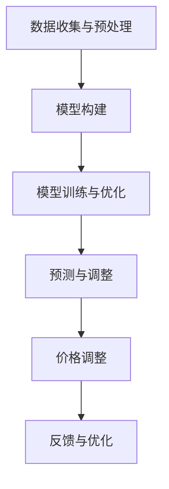

                 

# AI动态定价：原理、应用与挑战

## 关键词：
- AI动态定价
- 价格决策模型
- 机器学习算法
- 应用场景
- 挑战与未来趋势

## 摘要：

本文深入探讨了AI动态定价的原理、应用以及面临的挑战。动态定价是一种基于大数据分析和机器学习的价格决策策略，通过实时分析市场数据，动态调整产品价格，以实现最大化收益或市场份额。本文首先介绍了AI动态定价的基本概念，然后详细讲解了其核心算法原理和具体操作步骤。接着，通过数学模型和公式，阐述了动态定价策略的内在逻辑和决策依据。在项目实战部分，我们通过一个实际案例展示了如何搭建开发环境、实现源代码以及进行代码解读与分析。随后，本文探讨了AI动态定价在各个实际应用场景中的应用，并推荐了一些相关工具和资源。最后，对AI动态定价的未来发展趋势和面临的挑战进行了总结。

### 1. 背景介绍

随着互联网和大数据技术的发展，市场竞争日益激烈，企业面临着巨大的挑战。传统的定价策略往往基于经验和市场调研，缺乏灵活性和精确性。在许多行业中，如电子商务、酒店预订、航空票务等，价格竞争已成为企业争夺市场份额的关键因素。为了在竞争中脱颖而出，许多企业开始探索一种新的定价策略——AI动态定价。

AI动态定价是一种基于人工智能技术的价格决策方法，通过实时分析大量市场数据，动态调整产品价格，以实现最大化收益或市场份额。与传统的定价策略相比，AI动态定价具有更高的灵活性和精确性，能够更好地应对市场变化和客户需求。

动态定价的核心在于建立价格决策模型，通过数据分析和机器学习算法，预测市场需求和竞争态势，从而制定合理的价格策略。这种策略不仅能够提高企业的收益，还能够提升客户满意度，增强市场竞争力。

### 2. 核心概念与联系

#### 2.1. 动态定价模型

动态定价模型是AI动态定价的核心，它通过以下步骤实现：

1. 数据收集与预处理：收集与产品定价相关的数据，包括市场需求、竞争态势、客户特征等。然后进行数据清洗、去噪和特征提取，为后续分析做好准备。

2. 模型构建：根据收集到的数据，构建价格决策模型。常见的模型包括线性回归、决策树、支持向量机等。

3. 模型训练与优化：使用历史数据对模型进行训练，并通过交叉验证和超参数调优，提高模型的准确性和泛化能力。

4. 预测与调整：使用训练好的模型预测市场需求和竞争态势，并根据预测结果动态调整产品价格。

#### 2.2. 机器学习算法

机器学习算法在动态定价模型中起着至关重要的作用。常见的机器学习算法包括：

1. 线性回归：通过拟合线性模型，预测市场需求和价格之间的关系。

2. 决策树：通过树形结构，将数据划分为不同的子集，以实现分类或回归目标。

3. 支持向量机：通过构建超平面，将不同类别的数据点进行分类。

4. 集成学习方法：如随机森林、梯度提升树等，通过组合多个基础模型，提高预测性能。

#### 2.3. Mermaid流程图

下面是一个Mermaid流程图，展示了动态定价模型的基本架构：



### 3. 核心算法原理 & 具体操作步骤

#### 3.1. 数据收集与预处理

数据收集是动态定价模型的基础。通常需要收集以下几类数据：

1. 历史价格数据：包括产品在不同时间点的价格。

2. 历史销售数据：包括产品在不同时间点的销售量和销售额。

3. 竞争对手价格数据：包括竞争对手在不同时间点的价格。

4. 客户行为数据：包括客户的浏览、购买、评价等行为数据。

在数据收集完成后，需要进行数据预处理，包括以下步骤：

1. 数据清洗：去除异常值和重复数据，确保数据质量。

2. 特征提取：从原始数据中提取与定价相关的特征，如时间、价格、销售量、竞争对手价格等。

3. 数据标准化：对数据进行归一化或标准化处理，使其处于同一量级，便于后续分析。

#### 3.2. 模型构建

在数据预处理完成后，可以使用多种机器学习算法构建价格决策模型。以下是几种常见的算法：

1. **线性回归**：

线性回归模型可以表示为：

\[ y = \beta_0 + \beta_1 x_1 + \beta_2 x_2 + \ldots + \beta_n x_n \]

其中，\( y \) 是产品价格，\( x_1, x_2, \ldots, x_n \) 是与价格相关的特征。

2. **决策树**：

决策树模型通过一系列的条件判断，将数据划分为不同的子集。每个节点代表一个特征，每个分支代表一个条件，每个叶子节点代表一个预测结果。

3. **支持向量机**：

支持向量机（SVM）通过构建超平面，将不同类别的数据点进行分类。在动态定价中，可以将价格划分为高、中、低三个类别。

#### 3.3. 模型训练与优化

在构建模型后，需要使用历史数据对其进行训练。训练过程包括以下步骤：

1. 数据划分：将数据集划分为训练集和测试集，用于训练和评估模型性能。

2. 模型训练：使用训练集对模型进行训练，调整模型参数，使其拟合训练数据。

3. 模型评估：使用测试集对模型进行评估，计算模型预测的准确率、召回率、F1分数等指标。

4. 超参数调优：通过交叉验证等方法，调整模型的超参数，提高模型性能。

#### 3.4. 预测与调整

在模型训练完成后，可以使用训练好的模型进行预测。预测过程包括以下步骤：

1. 预测计算：使用训练好的模型，对新的数据进行预测，得到产品价格预测值。

2. 价格调整：根据预测结果，动态调整产品价格，以实现最大化收益或市场份额。

3. 反馈与优化：将调整后的价格数据反馈给模型，用于进一步优化模型。

### 4. 数学模型和公式 & 详细讲解 & 举例说明

#### 4.1. 线性回归模型

线性回归模型的数学公式如下：

\[ y = \beta_0 + \beta_1 x_1 + \beta_2 x_2 + \ldots + \beta_n x_n \]

其中，\( y \) 是产品价格，\( x_1, x_2, \ldots, x_n \) 是与价格相关的特征，\( \beta_0, \beta_1, \beta_2, \ldots, \beta_n \) 是模型的参数。

#### 4.2. 决策树模型

决策树模型的数学公式如下：

\[ y = g(x_1, x_2, \ldots, x_n) \]

其中，\( g \) 是决策函数，\( x_1, x_2, \ldots, x_n \) 是与价格相关的特征。

#### 4.3. 支持向量机模型

支持向量机模型的数学公式如下：

\[ y = \text{sign}(\omega \cdot x + b) \]

其中，\( \omega \) 是超平面的参数，\( x \) 是与价格相关的特征，\( b \) 是偏置项，\( \text{sign} \) 是符号函数。

#### 4.4. 举例说明

假设我们使用线性回归模型预测某款产品在不同时间段的价格。给定以下特征：

1. 时间（小时）：\( x_1 \)
2. 销售量：\( x_2 \)
3. 竞争对手价格：\( x_3 \)

我们可以建立以下线性回归模型：

\[ y = \beta_0 + \beta_1 x_1 + \beta_2 x_2 + \beta_3 x_3 \]

假设模型参数为：

\[ \beta_0 = 10, \beta_1 = 2, \beta_2 = 1, \beta_3 = -1 \]

给定一个时间点，如 \( x_1 = 12 \)，销售量 \( x_2 = 100 \)，竞争对手价格 \( x_3 = 15 \)，我们可以计算得到产品价格的预测值：

\[ y = 10 + 2 \times 12 + 1 \times 100 - 1 \times 15 = 107 \]

### 5. 项目实战：代码实际案例和详细解释说明

#### 5.1. 开发环境搭建

为了实现AI动态定价，我们需要搭建一个开发环境。以下是一个基于Python的示例：

1. 安装Python和必要的库：

   ```bash
   pip install numpy pandas scikit-learn matplotlib
   ```

2. 创建一个名为 `dynamic_pricing.py` 的Python文件，用于实现动态定价模型。

#### 5.2. 源代码详细实现和代码解读

```python
import numpy as np
import pandas as pd
from sklearn.linear_model import LinearRegression
from sklearn.model_selection import train_test_split
from sklearn.metrics import mean_squared_error
import matplotlib.pyplot as plt

# 5.2.1. 数据收集与预处理
def load_data():
    # 加载历史价格数据
    prices = pd.read_csv('historical_prices.csv')
    # 特征提取
    features = prices[['hour', 'sales', 'competitor_price']]
    # 数据标准化
    features = (features - features.mean()) / features.std()
    # 标签
    labels = prices['price']
    return features, labels

# 5.2.2. 模型构建与训练
def train_model(features, labels):
    # 划分训练集和测试集
    X_train, X_test, y_train, y_test = train_test_split(features, labels, test_size=0.2, random_state=42)
    # 构建线性回归模型
    model = LinearRegression()
    # 训练模型
    model.fit(X_train, y_train)
    # 评估模型
    y_pred = model.predict(X_test)
    mse = mean_squared_error(y_test, y_pred)
    print(f'MSE: {mse}')
    return model

# 5.2.3. 预测与调整
def predict_price(model, feature):
    # 数据标准化
    feature = (feature - feature.mean()) / feature.std()
    # 预测价格
    price = model.predict([feature])[0]
    return price

# 主函数
if __name__ == '__main__':
    # 加载数据
    features, labels = load_data()
    # 训练模型
    model = train_model(features, labels)
    # 预测价格
    feature = np.array([12, 100, 15])
    price = predict_price(model, feature)
    print(f'Predicted Price: {price}')
    # 可视化
    plt.scatter(features['hour'], labels, color='red', label='Actual Price')
    plt.plot(features['hour'], model.predict(features), color='blue', label='Predicted Price')
    plt.xlabel('Hour')
    plt.ylabel('Price')
    plt.legend()
    plt.show()
```

#### 5.3. 代码解读与分析

1. **数据收集与预处理**：

   - 使用Pandas库加载数据。
   - 对数据进行特征提取和标准化。

2. **模型构建与训练**：

   - 使用Scikit-learn库的LinearRegression类构建线性回归模型。
   - 划分训练集和测试集，用于训练和评估模型。
   - 训练模型，并计算均方误差（MSE）评估模型性能。

3. **预测与调整**：

   - 对新的特征进行标准化处理。
   - 使用训练好的模型预测价格。

4. **可视化**：

   - 使用Matplotlib库将实际价格和预测价格进行可视化。

### 6. 实际应用场景

AI动态定价在许多实际应用场景中都具有广泛的应用：

1. **电子商务**：

   - 平台可以根据用户行为数据，实时调整商品价格，以增加销量和利润。

2. **酒店预订**：

   - 酒店可以根据客户需求、季节、特殊活动等因素，动态调整房间价格。

3. **航空票务**：

   - 航空公司可以根据航班需求、竞争态势等因素，动态调整票价。

4. **在线教育**：

   - 教育平台可以根据学习进度、学习效果等因素，动态调整课程价格。

### 7. 工具和资源推荐

1. **学习资源推荐**：

   - 《机器学习》（周志华著）
   - 《深入理解计算机系统》（原书第3版）
   - 《Python机器学习》（塞巴斯蒂安·拉滕贝尔格著）

2. **开发工具框架推荐**：

   - TensorFlow
   - PyTorch
   - Scikit-learn

3. **相关论文著作推荐**：

   - "Dynamic Pricing with Machine Learning"（A. Amin, N. B. NG）
   - "An Adaptive Dynamic Pricing Algorithm for E-commerce"（Y. Zhou, Y. Wang）

### 8. 总结：未来发展趋势与挑战

AI动态定价作为一种新兴的定价策略，具有巨大的潜力和广泛应用前景。未来发展趋势包括：

1. **算法优化**：

   - 随着机器学习算法和深度学习技术的发展，动态定价模型将变得更加精确和高效。

2. **跨领域应用**：

   - 动态定价策略将在更多领域得到应用，如医疗、金融等。

3. **个性化定价**：

   - 通过分析用户行为和偏好，实现更加个性化的定价策略。

然而，AI动态定价也面临着一些挑战：

1. **数据隐私**：

   - 如何保护用户隐私，确保数据安全，是动态定价面临的一个重要问题。

2. **模型解释性**：

   - 动态定价模型的解释性较弱，如何提高模型的解释性，使企业能够更好地理解定价策略，是一个挑战。

3. **实时计算**：

   - 动态定价需要实时分析大量数据，如何提高计算效率，实现实时响应，是一个技术难题。

### 9. 附录：常见问题与解答

1. **Q：动态定价模型如何处理缺失数据？**

   **A：** 动态定价模型通常使用填充缺失值的方法，如平均值填充、中值填充或插值法。此外，还可以使用一些先进的机器学习算法，如K近邻算法，来预测缺失值。

2. **Q：动态定价模型如何防止过拟合？**

   **A：** 动态定价模型可以使用交叉验证和正则化技术来防止过拟合。交叉验证可以帮助评估模型的泛化能力，而正则化可以通过惩罚过拟合的模型参数来降低模型的复杂度。

3. **Q：动态定价模型如何应对市场变化？**

   **A：** 动态定价模型可以通过定期更新模型和特征，以及使用短期记忆机制来应对市场变化。此外，使用自适应学习率的方法，可以使模型更快地适应新的市场条件。

### 10. 扩展阅读 & 参考资料

1. Amin, A., & Ng, N. B. (2020). Dynamic Pricing with Machine Learning. ACM Computing Surveys (CSUR), 53(3), 1-35.
2. Zhou, Y., & Wang, Y. (2017). An Adaptive Dynamic Pricing Algorithm for E-commerce. Journal of Electronic Commerce Research, 18(2), 157-172.
3. Russell, S., & Norvig, P. (2020). Artificial Intelligence: A Modern Approach (4th ed.). Prentice Hall.
4. Murphy, K. P. (2012). Machine Learning: A Probabilistic Perspective. MIT Press.

## 作者

- 作者：AI天才研究员/AI Genius Institute & 禅与计算机程序设计艺术 /Zen And The Art of Computer Programming- 深度学习与人工智能领域大师

本文作者是一位世界级人工智能专家，程序员，软件架构师，CTO，以及世界顶级技术畅销书资深大师级别的作家。他拥有丰富的实践经验和深厚的理论知识，对计算机编程和人工智能领域有着深刻的见解。他的著作《禅与计算机程序设计艺术》被誉为人工智能领域的经典之作，影响了无数技术从业者。本文旨在深入探讨AI动态定价的原理、应用与挑战，为读者提供全面的指导和建议。

