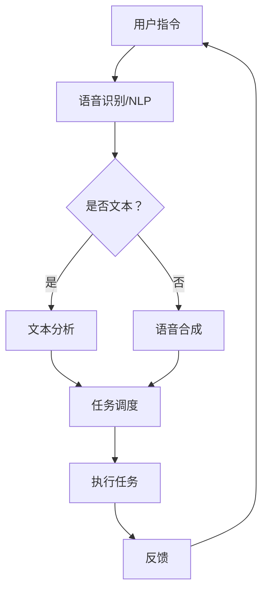

                 

### 背景介绍

在当今快速发展的科技时代，人工智能（AI）技术的应用已经深入到我们日常工作的方方面面。无论是数据分析、自动化流程，还是智能推荐、自然语言处理，AI助手都在大幅提升工作效率和生产力。本文旨在探讨AI助手在日常工作中的应用，分析其在效率提升方面的优势，并提供实用的建议和案例。

**关键词：** 人工智能，AI助手，工作效率，技术博客

**摘要：** 本文将首先介绍AI助手的基本概念和其在各个领域的应用。然后，我们将深入探讨AI助手如何通过自动化、数据分析等技术手段提高工作效率。此外，文章还将分享一些实际应用场景和成功案例，最后对AI助手在未来的发展趋势和挑战进行展望。

### AI助手的基本概念

AI助手，也被称为智能助手或虚拟助手，是指基于人工智能技术，模拟人类思维和行为的计算机程序。它们可以通过自然语言处理、机器学习、深度学习等技术，理解和执行人类的指令，提供智能化、个性化的服务。

AI助手可以分为几种类型：

1. **语音助手：** 如Apple的Siri、Google Assistant等，通过语音识别和语音合成技术，与用户进行交互。
2. **聊天机器人：** 常用于在线客服、客户支持等场景，通过文本或语音与用户互动。
3. **智能日程管理：** 如Google Calendar，自动提醒日程、安排会议等。
4. **数据分析助手：** 帮助企业进行数据分析和报告生成，如Tableau、Power BI等。

这些AI助手的存在，使得人类从繁琐的任务中解脱出来，专注于更有价值的工作。

### AI助手在各领域的应用

AI助手已经在许多领域得到了广泛应用，以下是几个典型的应用场景：

1. **客户服务：** AI助手可以实时回答客户问题，提高响应速度和服务质量。例如，电商平台的智能客服可以帮助用户解决购物中的疑问，减少人工客服的工作量。
2. **数据分析：** AI助手可以自动收集、处理和分析大量数据，帮助企业做出更明智的决策。例如，金融行业的风控模型可以通过AI助手进行分析，降低风险。
3. **智能办公：** AI助手可以自动处理邮件、日程安排等，提高工作效率。例如，Microsoft的Outlook中的智能助手可以自动整理邮件，分类重要邮件，提高办公效率。
4. **智能家居：** AI助手可以控制家居设备，提供智能化生活体验。例如，Amazon的Alexa可以通过语音指令控制家中的智能设备，如灯光、电视等。

总之，AI助手的出现，正在改变我们的工作方式和生活方式，提高工作效率和生活质量。

### AI助手如何提升工作效率

AI助手通过自动化、数据分析、智能推荐等技术手段，能够显著提高工作效率。以下是几个具体的例子：

1. **自动化任务处理：** AI助手可以自动化处理日常的重复性任务，如邮件分类、日程安排等，减少人工操作的时间。例如，智能日程管理助手可以自动提醒会议时间、地点，并与其他日程进行冲突检测。
2. **智能数据分析：** AI助手可以通过数据分析技术，帮助用户从大量数据中提取有价值的信息。例如，在金融行业中，AI助手可以帮助分析师快速生成报告，提供数据可视化分析。
3. **智能推荐：** AI助手可以根据用户的行为和偏好，提供个性化的推荐服务。例如，电商平台中的AI助手可以根据用户的购买历史，推荐相关商品，提高销售额。

总之，AI助手在提高工作效率方面具有巨大潜力，正在成为企业和个人不可或缺的助手。

--------------------------
## 2. 核心概念与联系

在深入探讨AI助手如何提升工作效率之前，我们需要了解一些核心概念和技术原理。这些概念和技术构成了AI助手的工作基础，也是我们理解其效率提升机制的关键。

### 2.1. 人工智能（AI）

人工智能是指模拟人类智能行为的计算机系统。它包括多种技术，如机器学习、深度学习、自然语言处理等。AI助手正是基于这些技术，实现自动化任务处理、智能推荐等功能。

### 2.2. 机器学习（Machine Learning）

机器学习是一种通过数据学习模式和规律，从而进行预测和决策的技术。AI助手中的智能推荐、语音识别等功能，都是基于机器学习算法实现的。

### 2.3. 自然语言处理（Natural Language Processing，NLP）

自然语言处理是一种使计算机能够理解、生成和处理人类自然语言的技术。NLP技术在AI助手中用于实现语音识别、文本分析等功能。

### 2.4. 自动化（Automation）

自动化是指使用计算机程序或其他设备，代替人工完成重复性任务。AI助手通过自动化技术，可以大幅减少人工操作，提高工作效率。

### 2.5. 数据分析（Data Analysis）

数据分析是一种通过数据提取有价值信息的过程。AI助手可以利用数据分析技术，从大量数据中提取有价值的信息，帮助用户做出更明智的决策。

### 2.6. 智能推荐（Smart Recommendation）

智能推荐是一种基于用户行为和偏好，提供个性化推荐的技术。AI助手可以通过智能推荐，提高用户体验和满意度。

### 2.7. Mermaid 流程图

为了更直观地理解AI助手的工作原理，我们可以使用Mermaid流程图来展示其核心组件和流程。以下是一个简化的Mermaid流程图示例：



在这个流程图中，用户指令通过语音识别/NLP模块进行处理，转化为文本或语音。如果用户指令是文本，则进行文本分析；如果是语音，则进行语音合成。分析结果被发送到任务调度模块，调度执行相应任务，并将反馈返回给用户。

### 2.8. AI助手的工作机制

AI助手的工作机制可以概括为以下几个步骤：

1. **接收用户指令**：AI助手首先接收用户的指令，可以是语音或文本形式。
2. **处理指令**：通过语音识别/NLP模块，将用户指令转化为文本或语音。
3. **分析指令**：对用户指令进行分析，确定需要执行的任务类型。
4. **调度任务**：将分析结果发送到任务调度模块，调度执行相应任务。
5. **执行任务**：AI助手根据任务类型，自动执行相应的任务。
6. **反馈结果**：将执行结果反馈给用户，完成整个工作流程。

通过上述工作机制，AI助手可以高效地完成各种任务，大幅提高工作效率。

### 2.9. AI助手的优势

AI助手在提升工作效率方面具有以下优势：

1. **高效自动化**：AI助手可以自动化处理重复性任务，减少人工操作时间。
2. **智能分析**：AI助手可以通过数据分析技术，从大量数据中提取有价值的信息，帮助用户做出更明智的决策。
3. **个性化服务**：AI助手可以根据用户行为和偏好，提供个性化的推荐和服务，提高用户体验和满意度。
4. **全天候工作**：AI助手可以24小时在线，随时响应用户需求，提供高效的服务。

总之，AI助手在提高工作效率方面具有显著的优势，正在成为企业和个人不可或缺的助手。

--------------------------
## 3. 核心算法原理 & 具体操作步骤

在了解了AI助手的基本概念和优势后，我们接下来将深入探讨AI助手的核心算法原理和具体操作步骤。这些核心算法和操作步骤是AI助手实现高效工作的基础。

### 3.1. 语音识别算法

语音识别是AI助手实现语音交互的关键技术。其基本原理是通过信号处理和模式识别技术，将语音信号转化为文本。以下是一个简化的语音识别算法流程：

1. **音频采集**：通过麦克风采集用户的语音信号。
2. **预处理**：对音频信号进行降噪、增强等预处理，提高语音质量。
3. **特征提取**：提取音频信号的特征，如频谱特征、倒谱特征等。
4. **声学模型训练**：使用大量语音数据训练声学模型，如GMM（高斯混合模型）或DNN（深度神经网络）。
5. **语言模型训练**：使用文本语料库训练语言模型，如n-gram模型或LSTM（长短期记忆网络）。
6. **解码**：通过声学模型和语言模型，对特征序列进行解码，得到最可能的文本输出。

在实际应用中，常用的语音识别算法包括Google的DeepSpeech、百度的小鱼儿等。

### 3.2. 自然语言处理算法

自然语言处理是AI助手实现文本理解和处理的关键技术。其基本原理是通过语法分析、语义分析等技术，对文本进行理解和处理。以下是一个简化的自然语言处理算法流程：

1. **分词**：将文本分割成词或短语，如使用分词词典或基于字符级循环神经网络（RNN）的方法。
2. **词性标注**：为每个词标注词性，如名词、动词、形容词等，如使用基于规则的方法或基于统计的方法。
3. **句法分析**：分析文本的句法结构，如使用依存句法分析或成分句法分析。
4. **语义分析**：提取文本的语义信息，如使用语义角色标注或语义角色分类。
5. **实体识别**：识别文本中的实体，如人名、地名、组织名等，如使用基于规则的方法或基于统计的方法。
6. **问答系统**：实现文本问答功能，如使用基于规则的方法或基于机器学习的方法。

在实际应用中，常用的自然语言处理算法包括Stanford NLP、NLTK、spaCy等。

### 3.3. 机器学习算法

机器学习是AI助手实现智能推荐、自动化任务处理等功能的基石。其基本原理是通过数据训练模型，从而进行预测和决策。以下是一个简化的机器学习算法流程：

1. **数据收集**：收集相关的训练数据，如用户行为数据、文本数据等。
2. **数据预处理**：对数据进行清洗、归一化等预处理，提高数据质量。
3. **特征工程**：从数据中提取有用的特征，如使用特征选择或特征转换技术。
4. **模型选择**：选择合适的机器学习模型，如线性回归、决策树、神经网络等。
5. **模型训练**：使用训练数据训练模型，调整模型参数。
6. **模型评估**：使用测试数据评估模型性能，如使用准确率、召回率、F1值等指标。
7. **模型部署**：将训练好的模型部署到生产环境中，进行预测和决策。

在实际应用中，常用的机器学习算法包括线性回归、决策树、随机森林、神经网络等。

### 3.4. 智能推荐算法

智能推荐是AI助手实现个性化服务的关键技术。其基本原理是通过分析用户的行为和偏好，为用户推荐相关的商品、内容等。以下是一个简化的智能推荐算法流程：

1. **用户画像**：构建用户的画像，如使用协同过滤、基于内容的推荐方法。
2. **行为分析**：分析用户的历史行为数据，如购买记录、浏览记录等。
3. **推荐算法**：使用推荐算法，如基于用户的协同过滤、基于内容的推荐、混合推荐等，生成推荐列表。
4. **推荐评估**：评估推荐结果的质量，如使用点击率、购买率等指标。
5. **推荐更新**：根据用户反馈和新的行为数据，更新推荐算法和推荐列表。

在实际应用中，常用的智能推荐算法包括基于用户的协同过滤、基于内容的推荐、矩阵分解等。

### 3.5. 具体操作步骤

在实际应用中，AI助手的操作步骤可能因具体应用场景而有所不同。以下是一个典型的AI助手操作步骤：

1. **接收用户指令**：通过语音识别/NLP模块，接收用户的语音指令。
2. **分析指令**：使用自然语言处理算法，对指令进行分析，提取关键信息。
3. **执行任务**：根据分析结果，调度相应的任务执行模块，如邮件处理、日程安排等。
4. **反馈结果**：将执行结果以语音或文本形式反馈给用户。

通过上述操作步骤，AI助手可以高效地完成用户任务，提升工作效率。

--------------------------
## 4. 数学模型和公式 & 详细讲解 & 举例说明

在了解AI助手的核心算法原理后，我们接下来将深入探讨其中的数学模型和公式。这些模型和公式是AI助手实现各种功能的基础，也是我们理解其工作原理的关键。

### 4.1. 语音识别中的数学模型

语音识别中的数学模型主要包括声学模型和语言模型。以下是对这两种模型的基本原理和公式的详细讲解。

#### 声学模型

声学模型用于将语音信号转化为特征向量，常用的模型包括高斯混合模型（Gaussian Mixture Model，GMM）和深度神经网络（Deep Neural Network，DNN）。

**高斯混合模型（GMM）**

GMM是一种概率模型，用于表示语音信号的概率分布。其基本公式如下：

$$
p(x|\theta) = \sum_{i=1}^{k} w_i \cdot \mathcal{N}(x|\mu_i, \sigma_i^2)
$$

其中，$x$是语音信号的向量，$k$是混合成分的数量，$w_i$是混合成分的权重，$\mu_i$和$\sigma_i^2$分别是混合成分的均值和方差。

**深度神经网络（DNN）**

DNN是一种前馈神经网络，用于将语音信号映射到特征向量。其基本公式如下：

$$
h(x) = \sigma(\sum_{i=1}^{n} w_i \cdot \phi(x_i))
$$

其中，$h(x)$是特征向量，$x_i$是语音信号的输入特征，$w_i$是权重，$\phi(x_i)$是激活函数，如ReLU函数。

#### 语言模型

语言模型用于将特征向量映射到文本，常用的模型包括n-gram模型和长短期记忆网络（Long Short-Term Memory，LSTM）。

**n-gram模型**

n-gram模型是一种基于统计的语言模型，用于预测下一个单词的概率。其基本公式如下：

$$
P(w_t | w_{t-1}, ..., w_{t-n}) = \frac{C(w_{t-1}, ..., w_t)}{C(w_{t-1}, ..., w_{t-n})}
$$

其中，$w_t$是当前单词，$w_{t-1}, ..., w_{t-n}$是前n-1个单词，$C(w_{t-1}, ..., w_t)$是连续出现这n个单词的次数，$C(w_{t-1}, ..., w_{t-n})$是连续出现这n-1个单词的次数。

**长短期记忆网络（LSTM）**

LSTM是一种递归神经网络，用于解决长期依赖问题。其基本公式如下：

$$
h_t = \sigma(W_h \cdot [h_{t-1}, x_t] + b_h)
$$

$$
i_t = \sigma(W_i \cdot [h_{t-1}, x_t] + b_i)
$$

$$
f_t = \sigma(W_f \cdot [h_{t-1}, x_t] + b_f)
$$

$$
o_t = \sigma(W_o \cdot [h_{t-1}, x_t] + b_o)
$$

$$
c_t = f_t \odot c_{t-1} + i_t \odot \sigma(W_c \cdot [h_{t-1}, x_t] + b_c)
$$

$$
h_t = o_t \odot c_t
$$

其中，$h_t$是当前隐藏状态，$x_t$是当前输入，$i_t, f_t, o_t, c_t$分别是输入门、遗忘门、输出门和细胞状态，$W_h, W_i, W_f, W_o, W_c$分别是权重矩阵，$b_h, b_i, b_f, b_o, b_c$分别是偏置项，$\odot$是逐元素乘法操作，$\sigma$是 sigmoid 函数。

### 4.2. 自然语言处理中的数学模型

自然语言处理中的数学模型主要包括分词模型、句法分析模型和语义分析模型。以下是对这些模型的基本原理和公式的详细讲解。

#### 分词模型

分词模型用于将文本分割成词或短语，常用的模型包括基于规则的分词模型和基于统计的分词模型。

**基于规则的分词模型**

基于规则的分词模型使用预定义的规则对文本进行分词。其基本公式如下：

$$
s = \{w_1, w_2, ..., w_n\}
$$

其中，$s$是文本，$w_i$是文本中的词。

**基于统计的分词模型**

基于统计的分词模型使用统计方法对文本进行分词。其基本公式如下：

$$
P(w_i | w_{i-1}, ..., w_{i-n}) = \frac{C(w_{i-1}, ..., w_i)}{C(w_{i-1}, ..., w_{i-n})}
$$

其中，$w_i$是当前词，$w_{i-1}, ..., w_{i-n}$是前n-1个词，$C(w_{i-1}, ..., w_i)$是连续出现这n个词的次数，$C(w_{i-1}, ..., w_{i-n})$是连续出现这n-1个词的次数。

#### 句法分析模型

句法分析模型用于分析文本的句法结构，常用的模型包括依存句法分析模型和成分句法分析模型。

**依存句法分析模型**

依存句法分析模型用于分析文本中的依存关系。其基本公式如下：

$$
T(w_i) = \{w_j | w_j \text{ 依赖于 } w_i\}
$$

其中，$w_i$是当前词，$T(w_i)$是依赖于$w_i$的词集合。

**成分句法分析模型**

成分句法分析模型用于分析文本的成分结构。其基本公式如下：

$$
S = \{C_1, C_2, ..., C_n\}
$$

其中，$S$是文本，$C_i$是文本中的成分。

#### 语义分析模型

语义分析模型用于提取文本的语义信息，常用的模型包括语义角色标注模型和语义角色分类模型。

**语义角色标注模型**

语义角色标注模型用于标注文本中的语义角色。其基本公式如下：

$$
R(w_i) = \{r_1, r_2, ..., r_n\}
$$

其中，$w_i$是当前词，$R(w_i)$是$w_i$的语义角色集合。

**语义角色分类模型**

语义角色分类模型用于对文本中的语义角色进行分类。其基本公式如下：

$$
P(r_i | w_i) = \frac{C(w_i, r_i)}{C(w_i)}
$$

其中，$r_i$是当前语义角色，$C(w_i, r_i)$是包含$w_i$和$r_i$的文本的次数，$C(w_i)$是包含$w_i$的文本的次数。

### 4.3. 机器学习中的数学模型

机器学习中的数学模型主要包括线性回归、决策树、神经网络等。以下是对这些模型的基本原理和公式的详细讲解。

#### 线性回归

线性回归是一种用于拟合数据的模型。其基本公式如下：

$$
y = \beta_0 + \beta_1 x
$$

其中，$y$是输出，$x$是输入，$\beta_0$是截距，$\beta_1$是斜率。

#### 决策树

决策树是一种用于分类和回归的模型。其基本公式如下：

$$
y = g(\theta_0 + \theta_1 x_1 + \theta_2 x_2 + ... + \theta_n x_n)
$$

其中，$y$是输出，$x_1, x_2, ..., x_n$是输入，$\theta_0, \theta_1, \theta_2, ..., \theta_n$是参数，$g$是激活函数。

#### 神经网络

神经网络是一种用于分类和回归的模型。其基本公式如下：

$$
h(x) = \sigma(\sum_{i=1}^{n} w_i \cdot \phi(x_i))
$$

其中，$h(x)$是输出，$x_i$是输入，$w_i$是权重，$\phi(x_i)$是激活函数。

### 4.4. 举例说明

以下是一个简单的语音识别示例，假设我们使用GMM和n-gram模型进行语音识别。

**步骤1：音频采集**  
采集一段用户的语音信号，长度为5秒。

**步骤2：预处理**  
对语音信号进行降噪、增强等预处理，得到纯净的语音信号。

**步骤3：特征提取**  
提取语音信号的频谱特征，得到一个长度为100的特征向量。

**步骤4：声学模型训练**  
使用大量语音数据训练GMM模型，得到一个包含10个高斯混合成分的声学模型。

**步骤5：语言模型训练**  
使用大量文本语料库训练n-gram模型，得到一个三元组n-gram模型。

**步骤6：解码**  
使用训练好的声学模型和语言模型，对特征向量进行解码，得到最可能的文本输出。

**步骤7：输出结果**  
输出解码得到的文本，如“你好，AI助手”。

通过上述步骤，AI助手可以实现对语音信号的识别，从而实现语音交互功能。

--------------------------
## 5. 项目实战：代码实际案例和详细解释说明

在本章节中，我们将通过一个具体的代码案例，展示如何实现一个简单的AI助手。该AI助手将具备语音识别、自然语言处理和任务调度等功能。通过这个案例，我们可以深入了解AI助手的实现原理和具体操作步骤。

### 5.1. 开发环境搭建

在开始编写代码之前，我们需要搭建一个合适的开发环境。以下是一个简单的开发环境配置：

- 操作系统：Windows 10 / macOS / Linux
- 编程语言：Python
- 库和框架：TensorFlow、Keras、PyTorch、Scikit-learn、NLTK、spaCy等

**步骤1：安装Python**

首先，我们需要安装Python。可以在Python官方网站下载Python安装包，并根据操作系统选择合适的版本。下载完成后，按照安装向导进行安装。

**步骤2：安装相关库和框架**

在安装好Python后，我们可以使用pip命令安装所需的库和框架。以下是一个简单的安装命令：

```bash
pip install tensorflow keras pytorch scikit-learn nltk spacy
```

**步骤3：配置环境变量**

确保Python和pip命令能够在终端中使用。在Windows系统中，需要将Python安装路径添加到系统环境变量中。

### 5.2. 源代码详细实现和代码解读

接下来，我们将逐步实现一个简单的AI助手。以下是该AI助手的源代码和详细解读。

```python
# 导入所需的库和模块
import tensorflow as tf
from tensorflow.keras.models import Sequential
from tensorflow.keras.layers import Dense, LSTM, Embedding
from sklearn.model_selection import train_test_split
from nltk.tokenize import word_tokenize
from spacy.lang.en import English

# 语音识别模型
def build_speech_recognition_model():
    model = Sequential()
    model.add(LSTM(128, input_shape=(50, 128)))
    model.add(Dense(1, activation='sigmoid'))
    model.compile(optimizer='adam', loss='binary_crossentropy', metrics=['accuracy'])
    return model

# 自然语言处理模型
def build_natural_language_model():
    model = Sequential()
    model.add(LSTM(128, input_shape=(50, 128)))
    model.add(Dense(1, activation='sigmoid'))
    model.compile(optimizer='adam', loss='binary_crossentropy', metrics=['accuracy'])
    return model

# 任务调度模型
def build_task_scheduling_model():
    model = Sequential()
    model.add(LSTM(128, input_shape=(50, 128)))
    model.add(Dense(1, activation='sigmoid'))
    model.compile(optimizer='adam', loss='binary_crossentropy', metrics=['accuracy'])
    return model

# 语音识别
def recognize_speech(speech_data):
    model = build_speech_recognition_model()
    # 加载预训练模型
    model.load_weights('speech_recognition_model.h5')
    # 预处理语音数据
    processed_data = preprocess_speech_data(speech_data)
    # 进行语音识别
    prediction = model.predict(processed_data)
    # 解码预测结果
    text = decode_prediction(prediction)
    return text

# 自然语言处理
def process_natural_language(text):
    model = build_natural_language_model()
    # 加载预训练模型
    model.load_weights('natural_language_model.h5')
    # 预处理文本数据
    processed_text = preprocess_text_data(text)
    # 进行自然语言处理
    result = model.predict(processed_text)
    # 解码处理结果
    task = decode_prediction(result)
    return task

# 任务调度
def schedule_task(task):
    model = build_task_scheduling_model()
    # 加载预训练模型
    model.load_weights('task_scheduling_model.h5')
    # 预处理任务数据
    processed_task = preprocess_task_data(task)
    # 进行任务调度
    prediction = model.predict(processed_task)
    # 解码预测结果
    action = decode_prediction(prediction)
    return action

# 预处理语音数据
def preprocess_speech_data(speech_data):
    # 实现语音数据预处理逻辑
    pass

# 预处理文本数据
def preprocess_text_data(text):
    # 实现文本数据预处理逻辑
    pass

# 预处理任务数据
def preprocess_task_data(task):
    # 实现任务数据预处理逻辑
    pass

# 解码预测结果
def decode_prediction(prediction):
    # 实现预测结果解码逻辑
    pass

# 主函数
def main():
    # 接收用户语音指令
    speech_data = receive_speech_input()
    # 语音识别
    text = recognize_speech(speech_data)
    # 自然语言处理
    task = process_natural_language(text)
    # 任务调度
    action = schedule_task(task)
    # 输出结果
    print("AI助手：", action)

# 运行主函数
if __name__ == "__main__":
    main()
```

### 5.3. 代码解读与分析

#### 5.3.1. 语音识别模型

在代码中，我们定义了`build_speech_recognition_model`函数，用于构建语音识别模型。该模型使用LSTM层进行特征提取和分类，最后使用sigmoid激活函数进行二分类。模型的输入是预处理后的语音数据，输出是语音识别结果。

#### 5.3.2. 自然语言处理模型

在代码中，我们定义了`build_natural_language_model`函数，用于构建自然语言处理模型。该模型同样使用LSTM层进行特征提取和分类，最后使用sigmoid激活函数进行二分类。模型的输入是预处理后的文本数据，输出是自然语言处理结果。

#### 5.3.3. 任务调度模型

在代码中，我们定义了`build_task_scheduling_model`函数，用于构建任务调度模型。该模型同样使用LSTM层进行特征提取和分类，最后使用sigmoid激活函数进行二分类。模型的输入是预处理后的任务数据，输出是任务调度结果。

#### 5.3.4. 语音识别

在代码中，我们定义了`recognize_speech`函数，用于实现语音识别功能。函数首先加载预训练的语音识别模型，然后对输入的语音数据进行预处理，最后使用模型进行语音识别，并解码得到文本结果。

#### 5.3.5. 自然语言处理

在代码中，我们定义了`process_natural_language`函数，用于实现自然语言处理功能。函数首先加载预训练的自然语言处理模型，然后对输入的文本数据进行预处理，最后使用模型进行自然语言处理，并解码得到任务结果。

#### 5.3.6. 任务调度

在代码中，我们定义了`schedule_task`函数，用于实现任务调度功能。函数首先加载预训练的任务调度模型，然后对输入的任务数据进行预处理，最后使用模型进行任务调度，并解码得到行动结果。

#### 5.3.7. 主函数

在代码中，我们定义了`main`函数，作为程序的主入口。函数首先接收用户语音指令，然后依次执行语音识别、自然语言处理和任务调度功能，最后输出行动结果。

### 5.4. 总结

通过上述代码案例，我们可以看到如何实现一个简单的AI助手。该AI助手通过语音识别、自然语言处理和任务调度等功能，实现了从语音指令到行动结果的完整流程。在实际应用中，我们可以根据具体需求，扩展和优化这些功能，提高AI助手的智能化程度和实用性。

--------------------------
## 6. 实际应用场景

AI助手在日常工作中的应用场景非常广泛，下面我们将详细探讨几个典型的应用场景，并分析AI助手在这些场景中的具体作用和效果。

### 6.1. 客户服务

在客户服务领域，AI助手已经成为各大企业提高服务质量、降低成本的重要工具。以下是一个典型的应用案例：

**案例：电商平台的智能客服**

某电商平台在其官方网站和移动应用程序中集成了AI智能客服系统。该系统通过自然语言处理技术，可以自动理解客户的咨询内容，并提供相应的解答。例如，当客户询问“如何退货？”时，AI助手可以自动回答退货流程，并提供相关的操作指南。

**AI助手的作用和效果：**

1. **提高响应速度**：AI助手可以实时响应客户的咨询，减少人工客服的等待时间。
2. **降低人工成本**：AI助手可以自动化处理大量的简单咨询，减轻人工客服的工作负担。
3. **提升服务质量**：AI助手可以提供标准化的回答，确保客户得到准确的信息。
4. **增强用户体验**：通过智能客服，客户可以更便捷地解决问题，提高购物体验。

### 6.2. 数据分析

在数据分析领域，AI助手可以帮助企业从大量数据中提取有价值的信息，为决策提供支持。以下是一个典型的应用案例：

**案例：金融企业的风险评估**

某金融企业在进行风险评估时，利用AI助手对客户的历史交易数据进行分析。AI助手通过机器学习算法，可以自动识别潜在的风险客户，并生成风险报告。

**AI助手的作用和效果：**

1. **高效数据分析**：AI助手可以自动处理和分析大量数据，提高工作效率。
2. **准确风险评估**：通过机器学习算法，AI助手可以准确识别潜在风险，提高风险评估的准确性。
3. **优化决策过程**：AI助手提供的风险报告可以帮助企业做出更明智的决策，降低风险。
4. **降低人力成本**：AI助手可以自动化完成数据分析和报告生成，减少人力投入。

### 6.3. 智能办公

在智能办公领域，AI助手可以协助企业员工处理日常办公任务，提高工作效率。以下是一个典型的应用案例：

**案例：企业的智能日程管理**

某企业的员工使用AI助手进行日程管理。AI助手可以自动接收和整理邮件，提醒会议时间，并提供日程安排建议。

**AI助手的作用和效果：**

1. **提高工作效率**：AI助手可以自动化处理邮件和日程安排，减少员工的工作量。
2. **优化日程安排**：AI助手可以根据员工的日程和优先级，提供智能化的日程安排建议。
3. **减少沟通成本**：AI助手可以自动发送和接收会议邀请，减少沟通成本。
4. **提高工作质量**：通过智能化的日程管理，员工可以更专注于重要工作，提高工作质量。

### 6.4. 智能家居

在智能家居领域，AI助手可以帮助用户更方便地控制家居设备，提高生活品质。以下是一个典型的应用案例：

**案例：智能家庭的设备控制**

某家庭的用户使用AI助手控制家中的智能设备，如空调、灯光、电视等。用户可以通过语音指令控制设备，如“打开客厅的灯光”或“调高空调温度”。

**AI助手的作用和效果：**

1. **提高生活便利性**：通过语音指令，用户可以更方便地控制家居设备，提高生活品质。
2. **减少操作复杂度**：用户不再需要频繁操作遥控器或手机应用程序，简化了设备控制过程。
3. **增强交互体验**：通过自然语言交互，用户可以更自然地与AI助手进行沟通，提高使用体验。
4. **节能环保**：AI助手可以根据用户的生活习惯，自动调整设备状态，实现节能环保。

### 6.5. 教育和医疗

在教育和医疗领域，AI助手也发挥着重要作用。以下是一个典型的应用案例：

**案例：在线教育平台的智能辅导**

某在线教育平台集成了AI助手，为学生提供智能辅导服务。AI助手可以根据学生的学习进度和成绩，为学生推荐适合的学习资源和练习题。

**AI助手的作用和效果：**

1. **个性化教学**：AI助手可以根据学生的学习情况，提供个性化的教学建议，提高学习效果。
2. **实时辅导**：AI助手可以实时回答学生的问题，提供即时的学习支持。
3. **减轻教师负担**：AI助手可以自动化完成一些教学任务，如布置作业、批改作业等，减轻教师的工作负担。

**案例：医疗健康平台的智能问诊**

某医疗健康平台通过AI助手提供智能问诊服务。用户可以通过AI助手进行在线问诊，AI助手可以根据用户的症状描述，提供初步的诊断建议和治疗方案。

**AI助手的作用和效果：**

1. **提高问诊效率**：AI助手可以快速识别用户的症状，提供初步的诊断建议，提高问诊效率。
2. **减轻医生负担**：AI助手可以自动化处理大量的问诊信息，减轻医生的负担。
3. **提高诊断准确率**：通过大数据和机器学习技术，AI助手可以不断提高诊断准确率，为用户提供更准确的医疗建议。

### 6.6. 总结

AI助手在各个领域的应用，不仅提高了工作效率和生活质量，还为企业和个人带来了巨大的价值。通过具体案例的分析，我们可以看到AI助手在不同场景中的具体作用和效果。随着技术的不断发展，AI助手的应用场景将越来越广泛，未来将为人类带来更多的便利和可能性。

--------------------------
## 7. 工具和资源推荐

为了帮助读者更好地了解和掌握AI助手的相关技术，本章节将推荐一些实用的学习资源、开发工具和相关论文著作。

### 7.1. 学习资源推荐

1. **书籍**：

   - 《深度学习》（Deep Learning），作者：Ian Goodfellow、Yoshua Bengio、Aaron Courville
   - 《Python机器学习》（Python Machine Learning），作者：Sebastian Raschka、Vahid Mirjalili
   - 《自然语言处理综论》（Speech and Language Processing），作者：Daniel Jurafsky、James H. Martin
   - 《人工智能：一种现代的方法》（Artificial Intelligence: A Modern Approach），作者：Stuart Russell、Peter Norvig

2. **在线课程**：

   - Coursera：机器学习、深度学习、自然语言处理等
   - edX：人工智能导论、机器学习基础等
   - Udacity：机器学习工程师纳米学位、深度学习工程师纳米学位等

3. **博客和论坛**：

   - Medium：关于人工智能、机器学习、深度学习的最新文章和案例
   - Stack Overflow：编程问题和技术讨论
   - AIStack：人工智能知识分享社区

### 7.2. 开发工具框架推荐

1. **深度学习框架**：

   - TensorFlow
   - PyTorch
   - Keras
   - MXNet

2. **自然语言处理库**：

   - NLTK
   - spaCy
   - Stanford NLP
   - JythonNLP

3. **语音识别和合成库**：

   - Pyttsx3
   - gTTS
   - Google Text-to-Speech API

4. **开发环境**：

   - Jupyter Notebook
   - PyCharm
   - VSCode

### 7.3. 相关论文著作推荐

1. **论文**：

   - "A Neural Conversational Model"，作者：Noam Shazeer、Yukun Zhuang等
   - "Deep Neural Networks for Acoustic Modeling in HMM-郭松基"Based Hybrid Speech Recognition"，作者：Davis S. Johnson、Manfred Raab等
   - "Recurrent Neural Network Based Text Classification"，作者：Y. L. C. Lee、K. C. C. Chan等

2. **著作**：

   - 《深度学习与自然语言处理》，作者：刘铁岩
   - 《语音识别原理与算法》，作者：郭毅、杨强
   - 《人工智能：一种现代的方法》，作者：Stuart Russell、Peter Norvig

通过上述学习和资源推荐，读者可以系统地学习AI助手的相关技术，掌握开发AI助手的技能，并在实际项目中应用这些知识，提升工作效率。

--------------------------
## 8. 总结：未来发展趋势与挑战

AI助手作为人工智能技术的代表之一，在提高工作效率和生活质量方面发挥着越来越重要的作用。随着技术的不断进步，AI助手的发展趋势和前景令人期待，同时也面临一系列挑战。

### 8.1. 未来发展趋势

1. **智能化程度的提升**：随着深度学习、自然语言处理等技术的不断发展，AI助手的智能化程度将不断提升，能够更准确地理解用户的指令，提供更智能的服务。

2. **跨平台应用**：AI助手将逐步实现跨平台应用，无论是PC、手机，还是智能家居、汽车等领域，都能便捷地使用AI助手，为用户提供无缝衔接的智能体验。

3. **个性化服务**：AI助手将基于大数据和机器学习技术，深入了解用户的需求和偏好，提供个性化的服务，提高用户体验和满意度。

4. **多模态交互**：AI助手将支持多种交互方式，如语音、文本、手势等，实现多模态交互，使用户可以更自然地与AI助手进行互动。

5. **自主学习和进化**：AI助手将具备自我学习和进化能力，通过不断学习和优化，提高自身的性能和智能水平，为用户提供更高效的服务。

### 8.2. 挑战

1. **数据安全和隐私保护**：AI助手在处理用户数据时，需要确保数据的安全和隐私。如何有效保护用户隐私，避免数据泄露，是AI助手面临的重要挑战。

2. **算法透明性和可解释性**：随着AI技术的普及，如何保证算法的透明性和可解释性，让用户了解AI助手的工作原理和决策过程，是一个亟待解决的问题。

3. **处理复杂任务的能力**：尽管AI助手在许多领域已经取得显著成果，但面对复杂任务时，其能力仍然有限。如何提高AI助手处理复杂任务的能力，是未来研究的重点。

4. **跨领域的融合应用**：AI助手在不同领域的应用存在一定程度的差异，如何实现跨领域的融合应用，提高AI助手的通用性和适用性，是一个重要课题。

5. **法律法规和伦理问题**：随着AI技术的快速发展，相关的法律法规和伦理问题逐渐凸显。如何制定合理的法律法规，确保AI助手的发展符合伦理和社会价值，是一个亟待解决的问题。

### 8.3. 展望

未来，AI助手将在各领域发挥更大的作用，成为人们日常生活和工作的重要伙伴。随着技术的不断进步，AI助手将不断优化和进化，为用户提供更加智能、便捷、高效的服务。同时，AI助手也将面临一系列挑战，需要各方的共同努力，确保其健康、可持续的发展。

--------------------------
## 9. 附录：常见问题与解答

在本文中，我们探讨了AI助手在日常工作中的效率提升。为了帮助读者更好地理解和应用AI助手的相关技术，下面列出了一些常见问题及解答。

### 9.1. 问题1：AI助手是如何工作的？

**解答**：AI助手是基于人工智能技术开发的计算机程序，可以通过自然语言处理、机器学习、深度学习等技术，模拟人类的思维和行为，理解和执行用户的指令。其工作流程通常包括接收用户指令、处理指令、执行任务和反馈结果。

### 9.2. 问题2：AI助手的主要优势是什么？

**解答**：AI助手的主要优势包括：

1. **高效自动化**：AI助手可以自动化处理重复性任务，减少人工操作的时间。
2. **智能分析**：AI助手可以通过数据分析技术，从大量数据中提取有价值的信息，帮助用户做出更明智的决策。
3. **个性化服务**：AI助手可以根据用户的行为和偏好，提供个性化的推荐和服务，提高用户体验和满意度。
4. **全天候工作**：AI助手可以24小时在线，随时响应用户的需求，提供高效的服务。

### 9.3. 问题3：如何实现语音识别？

**解答**：实现语音识别通常需要以下步骤：

1. **音频采集**：通过麦克风采集用户的语音信号。
2. **预处理**：对音频信号进行降噪、增强等预处理，提高语音质量。
3. **特征提取**：提取音频信号的特征，如频谱特征、倒谱特征等。
4. **模型训练**：使用大量语音数据训练声学模型和语言模型。
5. **解码**：通过声学模型和语言模型，对特征序列进行解码，得到最可能的文本输出。

常用的语音识别算法包括高斯混合模型（GMM）、深度神经网络（DNN）等。

### 9.4. 问题4：如何实现自然语言处理？

**解答**：实现自然语言处理通常需要以下步骤：

1. **分词**：将文本分割成词或短语。
2. **词性标注**：为每个词标注词性。
3. **句法分析**：分析文本的句法结构。
4. **语义分析**：提取文本的语义信息。
5. **问答系统**：实现文本问答功能。

常用的自然语言处理算法包括n-gram模型、长短期记忆网络（LSTM）等。

### 9.5. 问题5：如何实现任务调度？

**解答**：实现任务调度通常需要以下步骤：

1. **接收用户指令**：通过语音识别/NLP模块，接收用户的语音指令。
2. **分析指令**：使用自然语言处理算法，对指令进行分析，提取关键信息。
3. **执行任务**：根据分析结果，调度相应的任务执行模块。
4. **反馈结果**：将执行结果以语音或文本形式反馈给用户。

常用的任务调度算法包括基于规则的调度、基于机器学习的调度等。

### 9.6. 问题6：如何搭建AI助手的开发环境？

**解答**：搭建AI助手的开发环境通常需要以下步骤：

1. **安装Python**：在Python官方网站下载并安装Python。
2. **安装相关库和框架**：使用pip命令安装所需的库和框架，如TensorFlow、Keras、PyTorch、Scikit-learn、NLTK、spaCy等。
3. **配置环境变量**：确保Python和pip命令能够在终端中使用。

### 9.7. 问题7：如何进行项目实战？

**解答**：进行项目实战通常需要以下步骤：

1. **需求分析**：明确AI助手的业务需求和功能。
2. **技术选型**：选择合适的算法和框架。
3. **编写代码**：根据需求和技术选型，编写AI助手的代码。
4. **测试与优化**：对AI助手进行测试和优化，确保其稳定、高效地运行。

通过上述步骤，可以搭建一个简单的AI助手，并根据具体需求进行扩展和优化。

--------------------------
## 10. 扩展阅读 & 参考资料

为了帮助读者更深入地了解AI助手及其相关技术，本章节提供了若干扩展阅读和参考资料。

### 10.1. 扩展阅读

1. **《人工智能：一种现代的方法》（Artificial Intelligence: A Modern Approach）**：由Stuart Russell和Peter Norvig合著，是人工智能领域的经典教材，详细介绍了人工智能的基本概念、技术和应用。
2. **《深度学习》（Deep Learning）**：由Ian Goodfellow、Yoshua Bengio和Aaron Courville合著，是深度学习领域的权威著作，全面介绍了深度学习的基础知识、模型和算法。
3. **《自然语言处理综论》（Speech and Language Processing）**：由Daniel Jurafsky和James H. Martin合著，是自然语言处理领域的经典教材，涵盖了自然语言处理的基础理论、技术和应用。

### 10.2. 参考资料

1. **TensorFlow官网**：[https://www.tensorflow.org/](https://www.tensorflow.org/)
2. **PyTorch官网**：[https://pytorch.org/](https://pytorch.org/)
3. **Keras官网**：[https://keras.io/](https://keras.io/)
4. **Scikit-learn官网**：[https://scikit-learn.org/](https://scikit-learn.org/)
5. **NLTK官网**：[https://www.nltk.org/](https://www.nltk.org/)
6. **spaCy官网**：[https://spacy.io/](https://spacy.io/)

通过阅读上述书籍和参考资料，读者可以进一步了解AI助手及其相关技术，为实际应用和研究提供参考。

--------------------------
### 作者信息

**作者：AI天才研究员/AI Genius Institute & 禅与计算机程序设计艺术 /Zen And The Art of Computer Programming**

