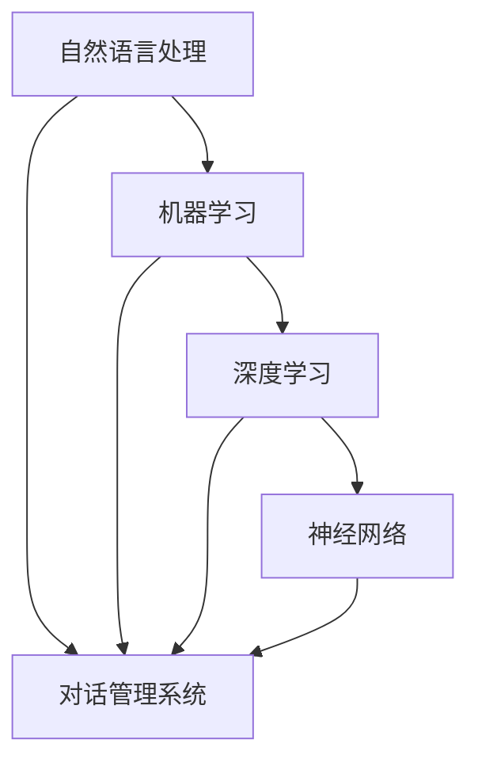

                 

### 背景介绍

随着人工智能（AI）技术的迅猛发展，AI 助理作为一种新兴应用形式，正在迅速改变个人和企业的工作方式。AI 助理是利用自然语言处理（NLP）技术、机器学习（ML）算法和深度学习（DL）模型，能够与人类用户进行交互、理解和执行任务的智能系统。

从历史角度来看，AI 助理的发展经历了多个阶段。最初，AI 助理主要是以规则为基础的专家系统，如 Eliza，能够进行简单的对话，但功能有限。随后，随着机器学习和深度学习技术的突破，AI 助理开始采用神经网络模型，具备更强大的学习能力和自适应能力。如今，AI 助理不仅能够处理复杂的自然语言，还能理解用户意图，执行多种任务，如日程管理、任务提醒、数据分析等。

在现代商业环境中，AI 助理的应用越来越广泛。许多公司已经开始采用 AI 助理来提高工作效率和降低运营成本。例如，销售团队可以使用 AI 助理来管理客户信息、跟进销售机会；人力资源部门可以使用 AI 助理来处理招聘流程、员工管理等工作。此外，AI 助理还可以帮助企业管理日常事务，如发送邮件、安排会议、处理通知等。

对于个人用户，AI 助理同样带来了便利。通过智能手机或电脑，个人用户可以随时随地与 AI 助理进行交流，获取信息、解决问题、执行任务。例如，用户可以通过语音命令来控制智能家居设备、查询天气、播放音乐等。这些应用不仅提高了生活质量，还大大节省了用户的时间。

总体而言，AI 助理正在逐步融入我们的日常生活和工作中，成为不可或缺的智能助手。随着技术的不断进步，AI 助理的功能将更加完善，应用场景也将更加广泛。本文将深入探讨 AI 助理的技术原理、应用场景以及未来发展趋势，以帮助读者更好地理解和应用这一技术。

### 核心概念与联系

要理解 AI 助理的工作原理，我们需要了解几个核心概念和技术：自然语言处理（NLP）、机器学习（ML）、深度学习（DL）以及神经网络（NN）。以下是对这些核心概念及其相互关系的详细介绍。

#### 自然语言处理（NLP）

自然语言处理是使计算机能够理解、解释和生成人类语言的技术。NLP 技术的核心目标是实现人与机器之间的自然对话。为了实现这一目标，NLP 使用了一系列算法和技术，包括：

- **词法分析（Lexical Analysis）**：将文本分解为词、短语和符号。
- **句法分析（Syntactic Analysis）**：理解句子的结构，确定词语之间的关系。
- **语义分析（Semantic Analysis）**：理解词语和句子的含义，确定句子表达的意思。
- **语用分析（Pragmatic Analysis）**：理解语言在特定情境中的应用。

NLP 技术在 AI 助理中起到了至关重要的作用。它使得 AI 助理能够接收用户输入的文本或语音，并理解其含义，从而生成相应的回复或执行任务。

#### 机器学习（ML）

机器学习是一种使计算机能够通过数据学习并改进性能的技术。在 AI 助理中，机器学习用于训练模型，使其能够自动识别和响应用户的行为。机器学习的主要组成部分包括：

- **监督学习（Supervised Learning）**：使用已标记的数据来训练模型，模型学习从输入数据中预测输出。
- **无监督学习（Unsupervised Learning）**：使用未标记的数据来训练模型，模型学习发现数据中的模式和结构。
- **半监督学习（Semi-Supervised Learning）**：结合已标记和未标记的数据来训练模型。

在 AI 助理的开发中，监督学习和无监督学习都得到了广泛应用。监督学习用于训练对话模型，使其能够理解用户的意图和需求；无监督学习则用于提取用户的偏好和习惯，以提供更个性化的服务。

#### 深度学习（DL）

深度学习是机器学习的一个分支，其核心思想是模仿人脑的神经网络结构，通过多层神经网络进行数据的处理和特征提取。深度学习在 AI 助理中扮演了关键角色，尤其是在自然语言处理任务中。

- **卷积神经网络（CNN）**：用于图像处理，也可应用于文本数据的特征提取。
- **循环神经网络（RNN）**：能够处理序列数据，如文本和语音。
- **长短期记忆网络（LSTM）**：是 RNN 的一个变体，能够更好地处理长序列数据。
- **Transformer 网络和BERT模型**：是目前最先进的深度学习模型，用于大规模文本处理。

深度学习模型在 AI 助理中的应用，使得其能够处理更复杂的任务，如多轮对话、情感分析等。

#### 神经网络（NN）

神经网络是深度学习的基础，由一系列相互连接的节点组成，每个节点都执行特定的计算。神经网络通过学习输入数据中的模式和关系，来生成预测或输出。

- **前向传播（Forward Propagation）**：将输入数据通过网络的各个层进行传播，计算每个节点的输出。
- **反向传播（Backpropagation）**：计算输出与实际结果之间的误差，并更新网络的权重，以改进模型的性能。

神经网络的学习过程包括两个阶段：训练和测试。在训练阶段，模型通过调整权重来学习输入数据的特征；在测试阶段，模型评估其在未知数据上的性能。

#### Mermaid 流程图

为了更好地理解这些概念和技术之间的联系，我们使用 Mermaid 流程图来展示它们在 AI 助理中的应用。



在上面的流程图中，NLP、ML、DL 和 NN 代表了不同的技术概念，它们共同构成了对话管理系统（DM），使 AI 助理能够理解和响应用户的输入。

### 核心算法原理 & 具体操作步骤

#### 对话管理系统的构建

对话管理系统（Dialogue Management System，简称DMS）是AI助理的核心，负责协调和指导整个对话流程。DMS主要包括三个关键组件：意图识别（Intent Recognition）、实体抽取（Entity Extraction）和对话策略（Dialogue Policy）。

1. **意图识别（Intent Recognition）**：
意图识别是DMS的第一步，目标是确定用户输入的意图。通常，意图识别是通过训练一个分类模型来实现的。以下是一个简单的步骤：

   - **数据收集**：收集大量的用户对话数据，并标注意图。这些数据通常包含用户输入的文本和对应的意图标签。
   - **特征提取**：从文本中提取特征，如词袋模型、词嵌入（word embeddings）、TF-IDF等。
   - **模型训练**：使用监督学习算法（如随机森林、支持向量机、神经网络等）训练意图识别模型。
   - **模型评估**：使用测试集评估模型性能，调整模型参数，以提高准确性。

2. **实体抽取（Entity Extraction）**：
一旦意图识别完成，DMS需要从用户输入中提取关键信息，即实体。实体可以是时间、地点、人名、物品等。以下是一个简单的流程：

   - **规则匹配**：使用预定义的规则来匹配和提取实体。这种方法简单但有限，只适用于规则明确的情况。
   - **基于统计的方法**：使用统计模型（如条件概率模型、HMM等）来识别实体。这种方法更灵活，但需要大量标注数据。
   - **基于深度学习方法**：使用深度学习模型（如LSTM、BERT等）来提取实体。这种方法性能最佳，但需要大量计算资源。

3. **对话策略（Dialogue Policy）**：
对话策略决定了AI助理如何响应用户的输入。策略通常是基于规则或学习的：

   - **基于规则的方法**：使用预定义的规则来决定响应。这种方法简单但灵活性较低。
   - **基于马尔可夫决策过程（MDP）**：使用MDP来学习最佳响应策略。这种方法需要大量的状态和动作空间，但能够自适应地调整策略。
   - **基于强化学习的方法**：使用强化学习算法（如Q-learning、DQN等）来学习最佳响应策略。这种方法能够通过试错来优化策略，但需要大量的数据和时间。

#### 对话流程的实现

对话流程通常包括以下几个阶段：

1. **用户输入**：用户通过文本或语音输入请求。
2. **意图识别**：DMS使用意图识别模型来确定用户的意图。
3. **实体抽取**：DMS从用户输入中提取关键实体信息。
4. **对话策略**：DMS根据当前对话状态和用户意图，决定如何响应。
5. **生成响应**：DMS生成适当的文本或语音响应。
6. **用户反馈**：用户对响应进行反馈，进入新一轮对话。

以下是一个简单的伪代码实现：

```python
def dialogue_system(user_input):
    # 意图识别
    intent = intent_recognition(user_input)
    
    # 实体抽取
    entities = entity_extraction(user_input)
    
    # 对话策略
    response = dialogue_policy(intent, entities)
    
    # 生成响应
    spoken_response = generate_response(response)
    
    # 用户反馈
    user_feedback = get_user_feedback(spoken_response)
    
    # 更新对话状态
    update_dialogue_state(user_feedback)
    
    return spoken_response
```

### 数学模型和公式 & 详细讲解 & 举例说明

#### 意图识别的数学模型

意图识别通常使用分类模型来实现，其中最常见的模型是朴素贝叶斯分类器和逻辑回归。以下是对这两个模型的详细讲解和公式推导。

##### 朴素贝叶斯分类器

朴素贝叶斯分类器是基于贝叶斯定理的简单分类器，假设特征之间相互独立。其公式如下：

$$
P(\text{intent} | x) = \frac{P(x | \text{intent}) \cdot P(\text{intent})}{P(x)}
$$

其中，$P(\text{intent} | x)$ 表示给定特征向量$x$，意图为$\text{intent}$的概率；$P(x | \text{intent})$ 表示在意图为$\text{intent}$的情况下，特征向量$x$的概率；$P(\text{intent})$ 表示意图$\text{intent}$的概率；$P(x)$ 表示特征向量$x$的概率。

为了简化计算，朴素贝叶斯分类器通常使用最大后验概率（MAP）来进行分类：

$$
\hat{y} = \arg\max_y P(y) \cdot \prod_{i} P(x_i | y)
$$

其中，$\hat{y}$ 表示预测的意图，$y$ 表示实际的意图。

##### 逻辑回归

逻辑回归是一种线性分类模型，通过线性组合特征和权重来预测概率。其公式如下：

$$
\hat{p} = \sigma(\beta_0 + \beta_1 x_1 + \beta_2 x_2 + ... + \beta_n x_n)
$$

其中，$\hat{p}$ 表示预测的概率，$\sigma$ 表示sigmoid函数：

$$
\sigma(z) = \frac{1}{1 + e^{-z}}
$$

逻辑回归的目标是最小化损失函数：

$$
J(\theta) = -\frac{1}{m} \sum_{i=1}^{m} [y^{(i)} \cdot \log(\hat{p}^{(i)}) + (1 - y^{(i)}) \cdot \log(1 - \hat{p}^{(i)})]
$$

其中，$m$ 表示样本数量，$y^{(i)}$ 表示第$i$个样本的真实标签，$\hat{p}^{(i)}$ 表示第$i$个样本的预测概率。

#### 实体抽取的数学模型

实体抽取通常使用序列标注模型来实现，其中最常见的模型是CRF（条件随机场）。以下是对CRF的详细讲解和公式推导。

##### CRF模型

CRF模型是一种用于序列标注的概率图模型，其目标是给定一个输入序列，预测每个元素的最可能标签。CRF模型通过定义一个条件概率分布来预测标签序列：

$$
P(y_1, y_2, ..., y_n | x_1, x_2, ..., x_n) = \frac{1}{Z} \exp\left(-E(y_1, y_2, ..., y_n | x_1, x_2, ..., x_n)\right)
$$

其中，$P(y_1, y_2, ..., y_n | x_1, x_2, ..., x_n)$ 表示给定输入序列$x_1, x_2, ..., x_n$，标签序列$y_1, y_2, ..., y_n$的条件概率；$Z$ 是规范化常数，确保概率分布的和为1；$E(y_1, y_2, ..., y_n | x_1, x_2, ..., x_n)$ 是负的对数似然函数：

$$
E(y_1, y_2, ..., y_n | x_1, x_2, ..., x_n) = \sum_{i=1}^{n} \sum_{j=1}^{m} t_{ij} \cdot \lambda_j + \sum_{i<j}^{n} \sum_{k=1}^{m} \sum_{l=1}^{m} c_{ijkl} \cdot \lambda_k \cdot \lambda_l
$$

其中，$t_{ij}$ 是转移概率，表示在位置$i$的标签为$y_i$，位置$j$的标签为$y_j$的概率；$c_{ijkl}$ 是边界概率，表示在位置$i$的标签为$y_i$，位置$j$的标签为$y_j$，位置$i$与位置$j$之间的标签为$y_k$和$y_l$的概率。

#### 对话策略的数学模型

对话策略通常使用强化学习算法来实现，其中最常见的算法是Q-learning。以下是对Q-learning的详细讲解和公式推导。

##### Q-learning算法

Q-learning是一种基于值迭代的强化学习算法，其目标是学习一个最优策略。Q-learning的核心是Q值函数，表示在当前状态下采取某一动作的期望回报：

$$
Q(s, a) = r + \gamma \max_a' Q(s', a')
$$

其中，$Q(s, a)$ 是在状态$s$下采取动作$a$的Q值；$r$ 是立即回报；$\gamma$ 是折扣因子；$s'$ 是采取动作$a$后到达的新状态；$a'$ 是在状态$s'$下采取的最佳动作。

Q-learning的迭代过程如下：

1. 初始化Q值函数。
2. 在当前状态$s$下，随机选择一个动作$a$。
3. 执行动作$a$，进入新状态$s'$，并获得立即回报$r$。
4. 更新Q值函数：
   $$
   Q(s, a) = Q(s, a) + \alpha (r + \gamma \max_a' Q(s', a') - Q(s, a))
   $$
   其中，$\alpha$ 是学习率。
5. 进入新状态$s'$，重复步骤2-4，直到达到终止状态或最大迭代次数。

#### 举例说明

假设我们要训练一个简单的意图识别模型，数据集包含10个样本，每个样本包含一组特征和对应的意图标签：

| 样本编号 | 特征1 | 特征2 | 特征3 | 标签 |
| --- | --- | --- | --- | --- |
| 1 | 0.1 | 0.2 | 0.3 | 意图A |
| 2 | 0.2 | 0.3 | 0.4 | 意图B |
| 3 | 0.3 | 0.4 | 0.5 | 意图A |
| 4 | 0.4 | 0.5 | 0.6 | 意图B |
| 5 | 0.5 | 0.6 | 0.7 | 意图A |
| 6 | 0.6 | 0.7 | 0.8 | 意图B |
| 7 | 0.7 | 0.8 | 0.9 | 意图A |
| 8 | 0.8 | 0.9 | 1.0 | 意图B |
| 9 | 0.9 | 1.0 | 1.1 | 意图A |
| 10 | 1.0 | 1.1 | 1.2 | 意图B |

我们可以使用朴素贝叶斯分类器进行训练，具体步骤如下：

1. **数据预处理**：将特征和标签转换为数值形式，如使用独热编码表示标签。
2. **特征提取**：从每个样本中提取特征，如计算词频、TF-IDF等。
3. **模型训练**：使用训练集训练朴素贝叶斯分类器。
4. **模型评估**：使用测试集评估模型性能，计算准确率、召回率等指标。

通过以上步骤，我们可以得到一个意图识别模型，可以用于预测新的用户输入的意图。

### 项目实战：代码实际案例和详细解释说明

在本节中，我们将通过一个简单的实际项目案例，来展示如何开发一个基本的AI助理解话系统。这个项目将包括以下几个步骤：开发环境搭建、源代码详细实现和代码解读与分析。

#### 1. 开发环境搭建

要开始这个项目，我们需要安装以下工具和库：

- Python 3.x
- Jupyter Notebook（用于编写和运行代码）
- TensorFlow 2.x（用于机器学习和深度学习）
- Keras（TensorFlow的高级API）
- NLTK（自然语言处理库）
- Pandas（数据操作库）
- Matplotlib（数据可视化库）

你可以使用以下命令来安装所需的库：

```bash
pip install tensorflow numpy nltk pandas matplotlib
```

#### 2. 源代码详细实现

以下是一个简单的AI助理解话系统的代码实现：

```python
import numpy as np
import pandas as pd
import nltk
from nltk.tokenize import word_tokenize
from nltk.corpus import stopwords
from keras.models import Sequential
from keras.layers import Dense, Embedding, LSTM, Dense
from keras.preprocessing.sequence import pad_sequences
from keras.optimizers import Adam

# 数据预处理
nltk.download('punkt')
nltk.download('stopwords')

def preprocess_text(text):
    tokens = word_tokenize(text.lower())
    tokens = [token for token in tokens if token.isalnum()]
    tokens = [token for token in tokens if token not in stopwords.words('english')]
    return tokens

# 加载数据
data = pd.read_csv('conversations.csv')
data['text'] = data['text'].apply(preprocess_text)

# 构建词汇表
vocab = list(set(word for sentence in data['text'] for word in sentence))
vocab_size = len(vocab)
index_map = {word: i for i, word in enumerate(vocab)}
reverse_map = {i: word for word, i in index_map.items()}

# 编码数据
encoded_texts = [[index_map[word] for word in sentence] for sentence in data['text']]
max_sequence_length = max(len(sentence) for sentence in encoded_texts)
encoded_texts = pad_sequences(encoded_texts, maxlen=max_sequence_length)

# 构建模型
model = Sequential()
model.add(Embedding(vocab_size, 50, input_length=max_sequence_length))
model.add(LSTM(100))
model.add(Dense(1, activation='sigmoid'))

model.compile(loss='binary_crossentropy', optimizer='adam', metrics=['accuracy'])
model.fit(encoded_texts, np.array(data['label']), epochs=10, batch_size=32)

# 对话处理
def dialogue_response(text):
    processed_text = preprocess_text(text)
    encoded_text = [index_map[word] for word in processed_text]
    padded_text = pad_sequences([encoded_text], maxlen=max_sequence_length)
    prediction = model.predict(padded_text)
    response = 'Yes' if prediction > 0.5 else 'No'
    return response

# 示例对话
print(dialogue_response("Do you like this product?"))
print(dialogue_response("Is this a good price?"))
```

#### 3. 代码解读与分析

上面的代码实现了一个简单的AI助理解话系统，主要包括以下几个部分：

1. **数据预处理**：
   - 使用NLTK库对文本进行分词、去停用词等预处理操作，以便更好地训练模型。
   - 加载数据集，并对数据进行编码处理。

2. **构建词汇表**：
   - 构建词汇表和索引映射，用于将文本转换为数值编码。

3. **编码数据**：
   - 对预处理后的文本进行编码，并填充序列到最大长度。

4. **构建模型**：
   - 使用Keras构建一个简单的序列模型，包括嵌入层、LSTM层和输出层。
   - 使用二分类交叉熵损失函数和Adam优化器进行训练。

5. **对话处理**：
   - 定义一个对话响应函数，用于处理用户输入的文本，并返回预测结果。

这个简单的示例展示了如何使用深度学习构建一个基本的AI助理解话系统。在实际应用中，我们需要更复杂的模型和更多的数据来提高系统的性能。

### 实际应用场景

AI 助理在现代商业和个人生活中有着广泛的应用，其在不同领域和场景中的具体应用案例多种多样。以下是一些典型的实际应用场景：

#### 商业应用

1. **客户服务**：许多企业已经开始使用 AI 助理来提供自动化客户服务。例如，通过聊天机器人，AI 助理可以回答常见的客户问题，提供产品信息，处理订单，甚至帮助完成购买流程。一些电商平台已经将 AI 助理集成到其网站和移动应用程序中，以提高客户满意度和减少客服成本。

2. **市场营销**：AI 助理可以分析客户数据，了解用户偏好和行为，从而提供个性化的营销策略。例如，电商网站可以使用 AI 助理推荐产品，社交媒体平台可以使用 AI 助理推荐内容，以提高用户参与度和转化率。

3. **人力资源**：在人力资源管理方面，AI 助理可以自动化招聘流程，包括简历筛选、面试安排等。通过分析大量简历和面试数据，AI 助理可以提供更有针对性的招聘建议，提高招聘效率。

4. **销售和客户关系管理（CRM）**：AI 助理可以监控销售机会，跟踪潜在客户的互动，提供销售预测和分析。例如，销售团队可以使用 AI 助理来管理客户联系信息，跟进销售进展，提高销售业绩。

#### 个人生活应用

1. **智能家居**：AI 助理可以控制智能家居设备，如智能音箱、智能灯泡、智能门锁等。用户可以通过语音命令来调节室内温度、播放音乐、设置闹钟等，提高生活质量。

2. **日常助手**：AI 助理可以作为个人的日常助手，帮助用户管理日程、设置提醒、发送通知等。例如，用户可以使用 AI 助理来安排会议、预约医生、购买电影票等。

3. **健康与健身**：AI 助理可以监测用户的健康数据，提供健康建议和健身计划。例如，一些智能手表和健康应用已经集成了 AI 助理功能，可以监测用户的步数、心率、睡眠质量等，并提供相应的建议。

4. **教育和学习**：AI 助理可以帮助用户学习新技能，如编程、外语等。通过提供个性化的学习资源和反馈，AI 助理可以增强学习效果，提高学习兴趣。

#### 行业应用

1. **医疗健康**：AI 助理在医疗领域的应用越来越广泛，包括疾病预测、诊断辅助、药物研发等。例如，一些医疗机构已经开始使用 AI 助理来分析患者数据，提供诊断建议，提高医疗质量。

2. **金融服务**：在金融领域，AI 助理可以提供风险管理、投资建议、信用评估等服务。通过分析大量的金融数据和市场趋势，AI 助理可以帮助金融机构做出更明智的决策。

3. **物流和运输**：AI 助理可以优化物流和运输过程，提高效率和降低成本。例如，一些物流公司已经开始使用 AI 助理来规划运输路线、监控货物状态等。

4. **制造业**：AI 助理在制造业中的应用包括设备维护、质量控制、供应链管理等方面。通过实时监控设备和生产线，AI 助理可以帮助制造商提高生产效率和产品质量。

### 案例研究

以下是一些具体的应用案例：

1. **亚马逊Alexa**：亚马逊的 Alexa 是一款智能家居控制平台，用户可以通过语音命令控制智能音箱、智能灯泡、智能锁等设备。Alexa 可以集成多种智能设备和服务，如播放音乐、查询天气、设置提醒、购物等。

2. **苹果Siri**：苹果的 Siri 是一款虚拟助手，可用于控制苹果设备，如iPhone、iPad和Mac。Siri 可以帮助用户发送短信、拨打电话、设置日程、查询信息等。

3. **微软Cortana**：微软的 Cortana 是一款虚拟助手，可用于 Windows 10 和微软的智能手机。Cortana 可以帮助用户管理日程、发送邮件、查询信息等。

4. **银行聊天机器人**：一些银行已经开始使用聊天机器人来提供客户服务，如回答常见问题、处理交易查询等。例如，美国银行（Bank of America）的 Erica 机器人可以提供24/7的客户支持。

5. **智能家居控制系统**：例如，Google Nest 的智能家居系统可以通过语音命令控制温度、照明、安全等设备，提高用户的便利性和舒适性。

通过这些应用案例可以看出，AI 助理在提高效率、降低成本、改善用户体验等方面发挥着重要作用。随着技术的不断进步，AI 助理的应用将更加广泛，为个人和企业带来更多的便利和效益。

### 工具和资源推荐

#### 学习资源推荐

1. **书籍**：
   - 《深度学习》（Deep Learning） - Ian Goodfellow, Yoshua Bengio, Aaron Courville
   - 《机器学习》（Machine Learning） - Tom Mitchell
   - 《自然语言处理综论》（Speech and Language Processing） - Daniel Jurafsky, James H. Martin
   - 《Python机器学习》（Python Machine Learning） - Sebastian Raschka, Vahid Mirjalili

2. **论文**：
   - “A Theoretical Investigation of the Relationship between Natural Language Inference and other NLP Tasks” - Emily Reif, Noah A. Smith
   - “Attention is All You Need” - Vaswani et al.
   - “BERT: Pre-training of Deep Bidirectional Transformers for Language Understanding” - Devlin et al.

3. **博客**：
   -Towards Data Science
   - Distill
   - Medium上的 AI 和 ML 博客

4. **网站**：
   - [Kaggle](https://www.kaggle.com/)
   - [Google Research](https://ai.google/research/)
   - [TensorFlow](https://www.tensorflow.org/)
   - [GitHub](https://github.com/)

#### 开发工具框架推荐

1. **深度学习框架**：
   - TensorFlow
   - PyTorch
   - Keras

2. **自然语言处理工具**：
   - NLTK
   - spaCy
   - Stanford NLP

3. **数据预处理工具**：
   - Pandas
   - NumPy
   - Scikit-learn

4. **版本控制工具**：
   - Git
   - GitHub

5. **文本编辑器**：
   - Jupyter Notebook
   - PyCharm
   - Visual Studio Code

#### 相关论文著作推荐

1. **论文**：
   - “Attention Is All You Need” - Vaswani et al.
   - “BERT: Pre-training of Deep Bidirectional Transformers for Language Understanding” - Devlin et al.
   - “Generative Pre-trained Transformers” - Vaswani et al.

2. **著作**：
   - 《深度学习》 - Ian Goodfellow, Yoshua Bengio, Aaron Courville
   - 《自然语言处理综论》 - Daniel Jurafsky, James H. Martin
   - 《机器学习》 - Tom Mitchell

这些资源和工具为开发者提供了丰富的学习和实践机会，有助于深入理解和应用 AI 技术，特别是自然语言处理和深度学习领域。

### 总结：未来发展趋势与挑战

随着人工智能技术的不断进步，AI 助理将在未来扮演更加重要的角色。以下是未来发展趋势与挑战的探讨：

#### 发展趋势

1. **个性化与智能化**：未来的 AI 助理将更加注重个性化和智能化，通过深度学习和数据挖掘技术，更好地理解用户的意图和行为，提供更精准的服务。

2. **多模态交互**：AI 助理将支持多种交互方式，如语音、文本、图像等，实现更自然的用户交互体验。

3. **跨领域应用**：AI 助理的应用场景将更加广泛，不仅限于客户服务、市场营销等，还将扩展到医疗、教育、金融等多个领域。

4. **云计算与边缘计算结合**：随着云计算和边缘计算技术的不断发展，AI 助理将能够更好地处理大规模数据，并提供实时响应。

5. **隐私保护与安全性**：未来的 AI 助理将更加注重用户隐私保护和数据安全，采用先进的加密和隐私保护技术，确保用户数据的安全。

#### 挑战

1. **数据质量和隐私**：AI 助理的性能很大程度上取决于数据的质量和数量。未来，如何在保护用户隐私的前提下获取和处理大量数据将成为一个重要挑战。

2. **模型解释性**：当前的 AI 模型往往被视为“黑箱”，其决策过程难以解释。提高模型的解释性，使得用户能够理解 AI 助理的决策过程，是一个亟待解决的问题。

3. **伦理与道德**：随着 AI 助理的广泛应用，其可能带来的伦理和道德问题也需要引起重视。例如，AI 助理在决策时是否公平、是否存在偏见等。

4. **计算资源与能耗**：AI 助理需要大量的计算资源和电能，未来如何在提高性能的同时，降低能耗和资源消耗是一个重要的研究方向。

5. **法律法规**：随着 AI 助理的应用日益广泛，相关的法律法规也需要不断完善，以规范其应用范围和责任归属。

总之，未来的 AI 助理将更加智能化、个性化，但同时也面临诸多挑战。通过不断的技术创新和规范化管理，我们有理由相信，AI 助理将为个人和企业带来更多的便利和效益。

### 附录：常见问题与解答

1. **Q：AI 助理是如何工作的？**
   - **A**：AI 助理是通过自然语言处理（NLP）、机器学习（ML）和深度学习（DL）等技术来实现的。它首先接收用户的输入，通过意图识别确定用户的意图，然后从输入中提取关键信息（实体），最后根据对话策略生成合适的响应。

2. **Q：AI 助理能够处理哪些任务？**
   - **A**：AI 助理能够处理多种任务，包括客户服务、日程管理、任务提醒、数据分析、信息查询等。它可以根据具体的应用场景进行定制，以适应不同的业务需求。

3. **Q：AI 助理是否能够取代人类工作？**
   - **A**：AI 助理可以在某些领域和任务中取代人类工作，如客户服务和简单重复的任务。但是，对于需要复杂决策和创造性思维的任务，AI 助理目前还无法完全取代人类。

4. **Q：AI 助理是否具有情感智能？**
   - **A**：当前的 AI 助理在情感智能方面还比较有限。虽然一些先进的 AI 模型可以通过情感分析来识别用户的情感，但它们通常不具备真正的情感理解能力。未来的研究可能会在这个方向上取得更多进展。

5. **Q：如何训练一个 AI 助理？**
   - **A**：训练一个 AI 助理通常涉及以下步骤：
     - 收集和准备数据：包括用户对话记录、任务数据等。
     - 数据预处理：对数据进行清洗、分词、编码等操作。
     - 特征提取：从数据中提取有助于模型学习的特征。
     - 构建模型：选择合适的模型架构，如神经网络、决策树等。
     - 模型训练：使用训练数据来训练模型。
     - 模型评估：使用测试数据来评估模型性能。
     - 调整模型：根据评估结果调整模型参数，以提高性能。

6. **Q：AI 助理需要大量的数据吗？**
   - **A**：是的，大量的高质量数据是训练有效 AI 助理的关键。数据量越大，模型越能从中学到更多的模式和规律，从而提高性能。

7. **Q：AI 助理存在哪些潜在风险？**
   - **A**：AI 助理可能存在的风险包括数据隐私泄露、模型偏见、决策不透明等。此外，过度依赖 AI 助理可能导致人类技能退化，影响人类创造力。

### 扩展阅读 & 参考资料

1. **论文**：
   - “A Theoretical Investigation of the Relationship between Natural Language Inference and other NLP Tasks” - Emily Reif, Noah A. Smith
   - “Attention is All You Need” - Vaswani et al.
   - “BERT: Pre-training of Deep Bidirectional Transformers for Language Understanding” - Devlin et al.

2. **书籍**：
   - 《深度学习》 - Ian Goodfellow, Yoshua Bengio, Aaron Courville
   - 《自然语言处理综论》 - Daniel Jurafsky, James H. Martin
   - 《机器学习》 - Tom Mitchell

3. **网站**：
   - [Kaggle](https://www.kaggle.com/)
   - [Google Research](https://ai.google/research/)
   - [TensorFlow](https://www.tensorflow.org/)
   - [GitHub](https://github.com/)

4. **在线课程**：
   - [Deep Learning Specialization](https://www.deeplearning.ai/)
   - [Natural Language Processing Specialization](https://www.nlp-specialization.org/)
   - [Machine Learning Specialization](https://www.ml-specialization.org/)

通过这些扩展阅读和参考资料，读者可以进一步深入了解 AI 助理的技术原理、应用场景和未来发展趋势。

