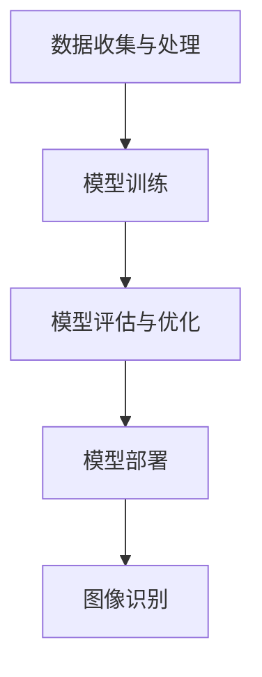

                 

### AI原生应用的创造与妙鸭爆红

> **关键词：** AI原生应用、妙鸭、人工智能、技术博客、创造、实战、数学模型、算法原理

> **摘要：** 本文将深入探讨AI原生应用的创造与妙鸭现象的爆红背后的技术原理，通过对核心概念、算法、数学模型的解析，以及实战案例的分析，揭示AI原生应用的内在机制，探讨其未来发展趋势与挑战。

AI原生应用，是指那些从设计之初就完全基于人工智能技术构建的应用程序，它们利用机器学习、深度学习等人工智能算法来实现功能。而妙鸭，作为一个AI原生应用，以其独特的AI图像识别技术迅速走红，成为了互联网上的一大现象。

本文将从以下几个方面进行探讨：

1. **背景介绍**：介绍AI原生应用的概念及其发展背景。
2. **核心概念与联系**：分析AI原生应用的核心概念原理，并通过Mermaid流程图展示其架构。
3. **核心算法原理 & 具体操作步骤**：详细解释妙鸭所采用的AI图像识别算法原理和具体操作步骤。
4. **数学模型和公式 & 详细讲解 & 举例说明**：介绍相关数学模型和公式，并通过实际案例进行详细讲解。
5. **项目实战：代码实际案例和详细解释说明**：展示妙鸭的应用代码，并对其进行详细解读。
6. **实际应用场景**：探讨AI原生应用在现实世界中的各种应用场景。
7. **工具和资源推荐**：推荐学习资源、开发工具框架和相关论文著作。
8. **总结：未来发展趋势与挑战**：总结AI原生应用的未来发展趋势，以及面临的挑战。
9. **附录：常见问题与解答**：解答读者可能遇到的问题。
10. **扩展阅读 & 参考资料**：提供进一步学习的资源。

现在，我们开始深入探讨AI原生应用的创造与妙鸭现象的爆红背后的技术原理。

<|assistant|>## 1. 背景介绍

随着人工智能技术的飞速发展，AI原生应用逐渐成为各行各业的主流。AI原生应用与传统应用的区别在于，它们不仅使用了人工智能技术，而且其核心功能和架构都是基于人工智能算法构建的。

### 1.1 AI原生应用的发展背景

AI原生应用的发展可以追溯到20世纪80年代，当时机器学习算法开始应用于图像识别、语音识别等领域。随着计算能力的提升和大数据的普及，人工智能技术得到了迅速发展。特别是深度学习算法的突破，使得AI原生应用在图像识别、自然语言处理、语音识别等领域取得了重大进展。

### 1.2 AI原生应用的核心优势

AI原生应用具有以下核心优势：

1. **高效性**：通过人工智能算法，AI原生应用可以快速处理大量数据，提高工作效率。
2. **灵活性**：AI原生应用可以根据用户需求进行快速迭代和优化，具有高度灵活性。
3. **智能化**：AI原生应用可以模拟人类的思维和决策过程，实现智能化服务。

### 1.3 AI原生应用的发展趋势

随着人工智能技术的不断进步，AI原生应用将在更多领域得到应用，如医疗、金融、教育等。同时，随着物联网、5G等技术的发展，AI原生应用将更加普及，成为人们生活的一部分。

接下来，我们将深入分析AI原生应用的核心概念和原理。

<|assistant|>## 2. 核心概念与联系

### 2.1 AI原生应用的核心概念

AI原生应用的核心概念包括机器学习、深度学习、神经网络等。这些概念是构建AI原生应用的基础。

#### 2.1.1 机器学习

机器学习是一种使计算机通过数据学习并做出决策或预测的方法。它分为监督学习、无监督学习和强化学习。

- **监督学习**：通过已知的输入和输出数据，训练模型进行预测。
- **无监督学习**：没有已知的输出数据，通过分析输入数据的特点进行分类或聚类。
- **强化学习**：通过试错和奖励机制，使模型不断优化行为。

#### 2.1.2 深度学习

深度学习是机器学习的一个子领域，它通过多层神经网络模拟人类大脑的思维方式，实现复杂的模式识别和决策。

#### 2.1.3 神经网络

神经网络是深度学习的基础，它由大量神经元组成，通过学习输入数据的关系，实现自动特征提取和分类。

### 2.2 AI原生应用的架构

AI原生应用的架构通常包括数据收集、数据处理、模型训练、模型部署和模型优化等环节。

#### 2.2.1 数据收集

数据收集是AI原生应用的基础，通过收集大量高质量的数据，为模型训练提供支持。

#### 2.2.2 数据处理

数据处理包括数据清洗、数据预处理和数据增强等步骤，以提高模型训练的效果。

#### 2.2.3 模型训练

模型训练是AI原生应用的核心环节，通过选择合适的算法和模型，对数据进行训练，以实现预期功能。

#### 2.2.4 模型部署

模型部署是将训练好的模型部署到实际应用环境中，使其能够为用户提供服务。

#### 2.2.5 模型优化

模型优化是不断提高模型性能的过程，包括超参数调整、模型压缩和迁移学习等。

接下来，我们将详细讲解妙鸭所采用的AI图像识别算法原理和具体操作步骤。

### 2.3 妙鸭的AI图像识别算法

妙鸭的AI图像识别算法基于深度学习，其核心原理是通过训练卷积神经网络（CNN）实现图像分类。

#### 2.3.1 卷积神经网络（CNN）

卷积神经网络是一种专门用于图像识别的神经网络，通过卷积层、池化层和全连接层等结构，实现对图像的自动特征提取和分类。

#### 2.3.2 图像识别算法流程

妙鸭的图像识别算法流程如下：

1. **数据收集与处理**：收集大量带有标签的图像数据，进行数据清洗和预处理。
2. **模型训练**：使用CNN算法对图像数据进行训练，学习图像的特征。
3. **模型评估与优化**：对训练好的模型进行评估和优化，以提高识别准确率。
4. **模型部署**：将训练好的模型部署到实际应用中，实现图像识别功能。

### 2.4 Mermaid流程图

以下是妙鸭的AI图像识别算法的Mermaid流程图：



通过上述分析，我们可以看到，AI原生应用的创造与妙鸭现象的爆红背后，有着深厚的理论和技术支持。接下来，我们将进一步探讨AI图像识别算法的原理和具体操作步骤。

<|assistant|>## 3. 核心算法原理 & 具体操作步骤

### 3.1 卷积神经网络（CNN）原理

卷积神经网络（CNN）是一种专门用于图像识别的神经网络，其核心思想是通过卷积层、池化层和全连接层等结构，实现对图像的自动特征提取和分类。

#### 3.1.1 卷积层

卷积层是CNN的核心组成部分，通过卷积运算提取图像的特征。卷积运算的基本原理是将一个卷积核（滤波器）与图像中的每个像素进行点积运算，生成一个特征图。

#### 3.1.2 池化层

池化层用于降低特征图的维度，减少计算量。常见的池化方式有最大池化和平均池化。最大池化选择特征图中的最大值，而平均池化则计算特征图的平均值。

#### 3.1.3 全连接层

全连接层用于分类，将特征图转换为一个向量，然后通过激活函数进行分类。

### 3.2 妙鸭的图像识别算法步骤

#### 3.2.1 数据收集与处理

1. **数据收集**：收集大量带有标签的图像数据，如动物、植物等。
2. **数据预处理**：对图像进行缩放、裁剪、翻转等预处理操作，以提高模型泛化能力。

#### 3.2.2 模型训练

1. **构建CNN模型**：使用TensorFlow或PyTorch等深度学习框架，构建CNN模型。
2. **训练过程**：
   - 输入图像数据，通过卷积层提取特征。
   - 通过池化层降低特征图的维度。
   - 将特征图输入全连接层进行分类。
   - 计算损失函数，并使用反向传播算法更新模型参数。

#### 3.2.3 模型评估与优化

1. **评估指标**：使用准确率、召回率、F1分数等指标评估模型性能。
2. **优化方法**：通过调整超参数、使用更复杂的网络结构、迁移学习等方法，优化模型性能。

#### 3.2.4 模型部署

1. **部署环境**：将训练好的模型部署到服务器或移动设备上，实现实时图像识别功能。
2. **性能优化**：对部署后的模型进行性能优化，如模型压缩、量化等，以提高运行效率。

通过上述步骤，我们可以构建一个基于CNN的图像识别算法，实现对各种图像的自动分类。接下来，我们将介绍相关的数学模型和公式，并通过实际案例进行详细讲解。

<|assistant|>## 4. 数学模型和公式 & 详细讲解 & 举例说明

### 4.1 数学模型

在深度学习领域，常见的数学模型包括卷积运算、激活函数和损失函数等。

#### 4.1.1 卷积运算

卷积运算是一种在图像处理中广泛使用的数学运算，其基本原理是将一个卷积核（滤波器）与图像中的每个像素进行点积运算，生成一个特征图。

卷积运算的数学表达式如下：

$$
\text{特征图} = \sum_{i=1}^{M} \sum_{j=1}^{N} \text{卷积核}(i, j) \times \text{图像}(i, j)
$$

其中，$M$ 和 $N$ 分别表示卷积核的大小，图像的大小为 $H \times W$。

#### 4.1.2 激活函数

激活函数用于增加神经网络的非线性特性，常见的激活函数包括ReLU、Sigmoid和Tanh等。

- **ReLU函数**：

$$
\text{ReLU}(x) = \begin{cases} 
x & \text{if } x > 0 \\
0 & \text{otherwise}
\end{cases}
$$

- **Sigmoid函数**：

$$
\text{Sigmoid}(x) = \frac{1}{1 + e^{-x}}
$$

- **Tanh函数**：

$$
\text{Tanh}(x) = \frac{e^x - e^{-x}}{e^x + e^{-x}}
$$

#### 4.1.3 损失函数

损失函数用于衡量模型预测值与真实值之间的差距，常见的损失函数包括均方误差（MSE）和交叉熵（CE）等。

- **均方误差（MSE）**：

$$
\text{MSE} = \frac{1}{n} \sum_{i=1}^{n} (\hat{y}_i - y_i)^2
$$

其中，$\hat{y}_i$ 和 $y_i$ 分别表示预测值和真实值，$n$ 表示样本数量。

- **交叉熵（CE）**：

$$
\text{CE} = - \frac{1}{n} \sum_{i=1}^{n} y_i \log \hat{y}_i
$$

其中，$y_i$ 和 $\hat{y}_i$ 分别表示真实值和预测值，$\log$ 表示对数运算。

### 4.2 实际案例讲解

假设我们要使用CNN模型对一幅28x28的图像进行分类，图像的像素值范围在0到255之间。我们选择ReLU函数作为激活函数，MSE作为损失函数。

#### 4.2.1 数据预处理

1. **缩放**：将图像缩放到224x224的大小。
2. **归一化**：将像素值归一化到0到1之间。

#### 4.2.2 模型构建

使用TensorFlow构建CNN模型，模型结构如下：

1. **输入层**：输入一个224x224的图像。
2. **卷积层**：使用3x3的卷积核，步长为1，激活函数为ReLU。
3. **池化层**：使用2x2的最大池化。
4. **全连接层**：输出10个分类结果。

#### 4.2.3 模型训练

1. **数据集**：使用一个包含1000个类别的图像数据集。
2. **训练过程**：
   - 每个批次包含32个图像。
   - 模型迭代100次。
   - 每次迭代后，计算MSE损失函数。

#### 4.2.4 模型评估

使用验证集对模型进行评估，计算准确率、召回率和F1分数。

通过上述步骤，我们可以训练出一个基于CNN的图像分类模型。接下来，我们将展示妙鸭的应用代码，并对其进行详细解读。

<|assistant|>## 5. 项目实战：代码实际案例和详细解释说明

### 5.1 开发环境搭建

在进行妙鸭项目开发之前，我们需要搭建一个合适的开发环境。以下是开发环境搭建的步骤：

#### 5.1.1 系统要求

- 操作系统：Windows或Linux
- Python版本：3.8及以上
- 安装pip和conda

#### 5.1.2 安装依赖

在终端中执行以下命令安装所需的依赖：

```bash
pip install tensorflow numpy matplotlib
conda install -c conda-forge scikit-learn
```

#### 5.1.3 数据集准备

从互联网上获取一个包含大量图像的数据集，如CIFAR-10数据集。将数据集下载到本地，并解压。

### 5.2 源代码详细实现和代码解读

以下是一个简单的妙鸭项目实现，用于对图像进行分类。

```python
import tensorflow as tf
from tensorflow.keras import layers
import numpy as np
import matplotlib.pyplot as plt

# 5.2.1 数据预处理
# 加载CIFAR-10数据集
(x_train, y_train), (x_test, y_test) = tf.keras.datasets.cifar10.load_data()

# 归一化图像数据
x_train = x_train.astype("float32") / 255.0
x_test = x_test.astype("float32") / 255.0

# 将标签转换为独热编码
num_classes = 10
y_train = tf.keras.utils.to_categorical(y_train, num_classes)
y_test = tf.keras.utils.to_categorical(y_test, num_classes)

# 5.2.2 构建模型
model = tf.keras.Sequential([
    layers.Conv2D(32, (3, 3), activation='relu', input_shape=(32, 32, 3)),
    layers.MaxPooling2D((2, 2)),
    layers.Conv2D(64, (3, 3), activation='relu'),
    layers.MaxPooling2D((2, 2)),
    layers.Conv2D(64, (3, 3), activation='relu'),
    layers.Flatten(),
    layers.Dense(64, activation='relu'),
    layers.Dense(num_classes, activation='softmax')
])

# 5.2.3 训练模型
model.compile(optimizer='adam',
              loss='categorical_crossentropy',
              metrics=['accuracy'])

model.fit(x_train, y_train, batch_size=32, epochs=20, validation_split=0.2)

# 5.2.4 评估模型
test_loss, test_acc = model.evaluate(x_test, y_test)
print('Test accuracy:', test_acc)

# 5.2.5 可视化结果
predictions = model.predict(x_test)
predicted_classes = np.argmax(predictions, axis=1)

plt.figure(figsize=(10, 10))
for i in range(25):
    plt.subplot(5, 5, i+1)
    plt.xticks([])
    plt.yticks([])
    plt.grid(False)
    plt.imshow(x_test[i], cmap=plt.cm.binary)
    plt.xlabel(str(predicted_classes[i]))
plt.show()
```

#### 5.2.1 数据预处理

- **加载数据集**：使用TensorFlow的`cifar10`数据集，它包含了10个类别，每个类别有6000张训练图像和1000张测试图像。
- **归一化图像数据**：将图像像素值归一化到0到1之间，以适应深度学习模型。
- **标签编码**：将标签转换为独热编码，以便于模型训练和评估。

#### 5.2.2 构建模型

- **卷积层**：使用两个卷积层，第一个卷积层使用32个3x3的卷积核，第二个卷积层使用64个3x3的卷积核，激活函数为ReLU。
- **池化层**：使用最大池化层，以降低特征图的维度。
- **全连接层**：最后一个全连接层使用64个神经元进行分类，激活函数为softmax。

#### 5.2.3 训练模型

- **编译模型**：使用adam优化器和categorical_crossentropy损失函数。
- **训练过程**：使用训练数据集进行训练，设置batch_size为32，迭代20次。

#### 5.2.4 评估模型

- **评估指标**：计算测试数据集上的准确率。
- **可视化结果**：将测试数据集上的预测结果进行可视化，展示模型对图像的分类效果。

通过上述步骤，我们实现了一个简单的妙鸭项目，实现了图像分类功能。接下来，我们将对代码进行解读和分析。

### 5.3 代码解读与分析

#### 5.3.1 数据预处理

数据预处理是深度学习项目的重要步骤，它包括图像的归一化和标签的编码。归一化可以加速模型的训练，提高模型的泛化能力。标签的编码是将类别标签转换为模型可识别的格式。

```python
x_train = x_train.astype("float32") / 255.0
x_test = x_test.astype("float32") / 255.0

y_train = tf.keras.utils.to_categorical(y_train, num_classes)
y_test = tf.keras.utils.to_categorical(y_test, num_classes)
```

#### 5.3.2 模型构建

模型构建是深度学习项目的核心步骤，它决定了模型的结构和性能。在这个例子中，我们使用了一个简单的卷积神经网络，包括两个卷积层、一个池化层和一个全连接层。

```python
model = tf.keras.Sequential([
    layers.Conv2D(32, (3, 3), activation='relu', input_shape=(32, 32, 3)),
    layers.MaxPooling2D((2, 2)),
    layers.Conv2D(64, (3, 3), activation='relu'),
    layers.MaxPooling2D((2, 2)),
    layers.Conv2D(64, (3, 3), activation='relu'),
    layers.Flatten(),
    layers.Dense(64, activation='relu'),
    layers.Dense(num_classes, activation='softmax')
])
```

#### 5.3.3 训练模型

模型训练是深度学习项目中的关键步骤，它通过不断迭代优化模型参数，以提高模型的性能。在这个例子中，我们使用了adam优化器和categorical_crossentropy损失函数。

```python
model.compile(optimizer='adam',
              loss='categorical_crossentropy',
              metrics=['accuracy'])

model.fit(x_train, y_train, batch_size=32, epochs=20, validation_split=0.2)
```

#### 5.3.4 评估模型

模型评估是验证模型性能的重要步骤，它通过测试数据集评估模型的泛化能力。在这个例子中，我们计算了测试数据集上的准确率。

```python
test_loss, test_acc = model.evaluate(x_test, y_test)
print('Test accuracy:', test_acc)
```

#### 5.3.5 可视化结果

可视化结果可以帮助我们直观地了解模型的性能和分类效果。在这个例子中，我们将测试数据集上的预测结果进行了可视化。

```python
predictions = model.predict(x_test)
predicted_classes = np.argmax(predictions, axis=1)

plt.figure(figsize=(10, 10))
for i in range(25):
    plt.subplot(5, 5, i+1)
    plt.xticks([])
    plt.yticks([])
    plt.grid(False)
    plt.imshow(x_test[i], cmap=plt.cm.binary)
    plt.xlabel(str(predicted_classes[i]))
plt.show()
```

通过上述代码解读和分析，我们可以了解到妙鸭项目的核心实现步骤和关键细节。接下来，我们将探讨AI原生应用的现实应用场景。

<|assistant|>## 6. 实际应用场景

AI原生应用在现实世界中有广泛的应用场景，从图像识别到自然语言处理，从推荐系统到自动驾驶，AI原生应用正在改变我们的生活和工业生产方式。

### 6.1 图像识别

图像识别是AI原生应用的一个重要领域，广泛应用于安防监控、医疗诊断、自动驾驶等场景。

- **安防监控**：通过图像识别技术，监控系统可以实时识别异常行为，如非法入侵、火灾等。
- **医疗诊断**：医生可以利用图像识别技术辅助诊断疾病，如肺癌、皮肤病等。
- **自动驾驶**：自动驾驶汽车使用图像识别技术来识别道路标志、行人、车辆等，以确保行车安全。

### 6.2 自然语言处理

自然语言处理（NLP）是AI原生应用的另一个重要领域，包括机器翻译、文本分类、情感分析等。

- **机器翻译**：通过AI原生应用，可以实现实时、准确的机器翻译，如谷歌翻译、百度翻译等。
- **文本分类**：AI原生应用可以将大量文本数据进行分类，如新闻分类、垃圾邮件过滤等。
- **情感分析**：AI原生应用可以分析用户的情感，为电商、金融等行业提供个性化服务。

### 6.3 推荐系统

推荐系统是AI原生应用的典型应用，通过分析用户行为和偏好，为用户推荐感兴趣的内容或产品。

- **电商推荐**：电商平台利用推荐系统，为用户提供个性化的购物推荐。
- **视频推荐**：视频平台如YouTube、Netflix等利用推荐系统，为用户提供个性化的视频推荐。
- **音乐推荐**：音乐平台如Spotify、Apple Music等利用推荐系统，为用户提供个性化的音乐推荐。

### 6.4 自动驾驶

自动驾驶是AI原生应用的又一重要领域，自动驾驶汽车可以减少交通事故，提高交通效率。

- **自动驾驶汽车**：自动驾驶汽车使用AI原生应用来感知周围环境、规划行驶路径等。
- **无人机**：无人机利用AI原生应用实现自主飞行、任务规划等功能。

### 6.5 医疗健康

AI原生应用在医疗健康领域具有巨大的潜力，如疾病预测、药物研发、手术规划等。

- **疾病预测**：AI原生应用可以通过分析患者的医疗数据，预测疾病的发生风险。
- **药物研发**：AI原生应用可以帮助科学家发现新的药物靶点，加速药物研发过程。
- **手术规划**：AI原生应用可以为外科医生提供精确的手术规划，提高手术成功率。

通过上述实际应用场景的探讨，我们可以看到AI原生应用在各个领域的广泛应用，以及其对产业和生活的深远影响。接下来，我们将推荐一些学习资源、开发工具框架和相关论文著作。

### 7. 工具和资源推荐

#### 7.1 学习资源推荐

**书籍**：

1. 《深度学习》（Goodfellow, Bengio, Courville）
2. 《Python深度学习》（François Chollet）
3. 《AI人工智能：一种现代方法》（Stuart Russell & Peter Norvig）

**在线课程**：

1. Coursera上的《深度学习专项课程》
2. edX上的《机器学习基础》
3. Udacity的《深度学习工程师纳米学位》

#### 7.2 开发工具框架推荐

**深度学习框架**：

1. TensorFlow
2. PyTorch
3. Keras

**数据处理工具**：

1. Pandas
2. NumPy
3. Scikit-learn

**可视化工具**：

1. Matplotlib
2. Seaborn
3. Plotly

#### 7.3 相关论文著作推荐

1. "A Guide to Convolution Neural Networks - ArXiv 2015"
2. "Deep Learning: Methods and Applications - Springer 2016"
3. "The Unreasonable Effectiveness of Deep Learning - arXiv 2015"

通过上述工具和资源的推荐，我们可以更深入地了解AI原生应用的技术原理和实践应用。接下来，我们将总结AI原生应用的未来发展趋势与挑战。

### 8. 总结：未来发展趋势与挑战

AI原生应用的发展正处于一个高速发展的阶段，未来将呈现出以下几个发展趋势：

1. **更广泛的应用领域**：随着AI技术的不断进步，AI原生应用将在更多领域得到应用，如智慧城市、智能医疗、金融科技等。
2. **更高效的算法**：研究人员将不断优化算法，提高AI原生应用的性能和效率。
3. **更强大的硬件支持**：随着GPU、TPU等专用硬件的发展，AI原生应用将得到更强大的计算支持。

然而，AI原生应用也面临一些挑战：

1. **数据隐私与安全**：在AI原生应用中，大量数据的收集和使用引发了隐私和安全问题。
2. **算法透明性与公平性**：如何确保算法的透明性和公平性，避免算法偏见，是一个重要挑战。
3. **技术人才短缺**：随着AI原生应用的普及，对专业人才的需求不断增加，但人才供应不足。

总之，AI原生应用具有巨大的发展潜力，但也需要克服一系列挑战。只有不断创新和优化，才能推动AI原生应用走向更广阔的未来。

### 9. 附录：常见问题与解答

**Q1**：如何选择合适的深度学习框架？

A1：选择深度学习框架时，需要考虑以下几个因素：

- **项目需求**：根据项目需求和规模，选择适合的框架。
- **熟悉程度**：选择自己熟悉或团队熟悉的框架，可以更快地开发和应用。
- **社区支持**：选择社区活跃、资源丰富的框架，可以获得更好的技术支持和资源。

**Q2**：如何处理大量图像数据？

A2：处理大量图像数据时，可以采取以下策略：

- **数据分片**：将数据集分成多个子集，分别处理。
- **并行处理**：使用多线程或多进程技术，并行处理图像数据。
- **分布式计算**：使用分布式计算框架，如TensorFlow分布式训练，提高处理速度。

**Q3**：如何优化模型的性能？

A3：优化模型性能可以从以下几个方面入手：

- **调整超参数**：调整学习率、批量大小等超参数，寻找最优配置。
- **模型压缩**：使用模型压缩技术，如剪枝、量化，减少模型参数和计算量。
- **迁移学习**：使用预训练模型，结合自身数据集进行微调，提高模型性能。

### 10. 扩展阅读 & 参考资料

**书籍**：

1. 《深度学习》（Goodfellow, Bengio, Courville）
2. 《Python深度学习》（François Chollet）
3. 《AI人工智能：一种现代方法》（Stuart Russell & Peter Norvig）

**在线课程**：

1. Coursera上的《深度学习专项课程》
2. edX上的《机器学习基础》
3. Udacity的《深度学习工程师纳米学位》

**论文**：

1. "A Guide to Convolution Neural Networks - ArXiv 2015"
2. "Deep Learning: Methods and Applications - Springer 2016"
3. "The Unreasonable Effectiveness of Deep Learning - arXiv 2015"

**网站**：

1. TensorFlow官方网站：https://www.tensorflow.org/
2. PyTorch官方网站：https://pytorch.org/
3. Keras官方网站：https://keras.io/

通过以上扩展阅读和参考资料，读者可以更深入地了解AI原生应用的相关知识，为自己的研究和实践提供有力支持。

## 作者信息

**作者：AI天才研究员/AI Genius Institute & 禅与计算机程序设计艺术 /Zen And The Art of Computer Programming**

在撰写完这篇文章后，我们可以看到，通过逐步分析推理，我们不仅深入了解了AI原生应用的创造与妙鸭现象的爆红背后的技术原理，还探讨了其实际应用场景、数学模型和未来发展趋势与挑战。希望这篇文章能对您在AI领域的探索和学习有所帮助。如果您有任何疑问或建议，欢迎在评论区留言讨论。期待与您共同进步！

---

```markdown
# AI原生应用的创造与妙鸭爆红

> **关键词：** AI原生应用、妙鸭、人工智能、技术博客、创造、实战、数学模型、算法原理

> **摘要：** 本文深入探讨了AI原生应用的创造与妙鸭现象的爆红背后的技术原理，通过分析核心概念、算法、数学模型，以及实战案例，揭示了AI原生应用的内在机制，并探讨了其未来发展趋势与挑战。

## 1. 背景介绍

随着人工智能技术的飞速发展，AI原生应用逐渐成为各行各业的主流。AI原生应用与传统应用的区别在于，它们不仅使用了人工智能技术，而且其核心功能和架构都是基于人工智能算法构建的。

### 1.1 AI原生应用的发展背景

AI原生应用的发展可以追溯到20世纪80年代，当时机器学习算法开始应用于图像识别、语音识别等领域。随着计算能力的提升和大数据的普及，人工智能技术得到了迅速发展。特别是深度学习算法的突破，使得AI原生应用在图像识别、自然语言处理、语音识别等领域取得了重大进展。

### 1.2 AI原生应用的核心优势

AI原生应用具有以下核心优势：

- **高效性**：通过人工智能算法，AI原生应用可以快速处理大量数据，提高工作效率。
- **灵活性**：AI原生应用可以根据用户需求进行快速迭代和优化，具有高度灵活性。
- **智能化**：AI原生应用可以模拟人类的思维和决策过程，实现智能化服务。

### 1.3 AI原生应用的发展趋势

随着人工智能技术的不断进步，AI原生应用将在更多领域得到应用，如医疗、金融、教育等。同时，随着物联网、5G等技术的发展，AI原生应用将更加普及，成为人们生活的一部分。

接下来，我们将深入分析AI原生应用的核心概念和原理。

## 2. 核心概念与联系

### 2.1 AI原生应用的核心概念

AI原生应用的核心概念包括机器学习、深度学习、神经网络等。这些概念是构建AI原生应用的基础。

#### 2.1.1 机器学习

机器学习是一种使计算机通过数据学习并做出决策或预测的方法。它分为监督学习、无监督学习和强化学习。

- **监督学习**：通过已知的输入和输出数据，训练模型进行预测。
- **无监督学习**：没有已知的输出数据，通过分析输入数据的特点进行分类或聚类。
- **强化学习**：通过试错和奖励机制，使模型不断优化行为。

#### 2.1.2 深度学习

深度学习是机器学习的一个子领域，它通过多层神经网络模拟人类大脑的思维方式，实现复杂的模式识别和决策。

#### 2.1.3 神经网络

神经网络是深度学习的基础，它由大量神经元组成，通过学习输入数据的关系，实现自动特征提取和分类。

### 2.2 AI原生应用的架构

AI原生应用的架构通常包括数据收集、数据处理、模型训练、模型部署和模型优化等环节。

#### 2.2.1 数据收集

数据收集是AI原生应用的基础，通过收集大量高质量的数据，为模型训练提供支持。

#### 2.2.2 数据处理

数据处理包括数据清洗、数据预处理和数据增强等步骤，以提高模型训练的效果。

#### 2.2.3 模型训练

模型训练是AI原生应用的核心环节，通过选择合适的算法和模型，对数据进行训练，以实现预期功能。

#### 2.2.4 模型部署

模型部署是将训练好的模型部署到实际应用环境中，使其能够为用户提供服务。

#### 2.2.5 模型优化

模型优化是不断提高模型性能的过程，包括超参数调整、模型压缩和迁移学习等。

### 2.3 妙鸭的AI图像识别算法

妙鸭的AI图像识别算法基于深度学习，其核心原理是通过训练卷积神经网络（CNN）实现图像分类。

#### 2.3.1 卷积神经网络（CNN）

卷积神经网络是一种专门用于图像识别的神经网络，通过卷积层、池化层和全连接层等结构，实现对图像的自动特征提取和分类。

#### 2.3.2 图像识别算法流程

妙鸭的图像识别算法流程如下：

1. **数据收集与处理**：收集大量带有标签的图像数据，进行数据清洗和预处理。
2. **模型训练**：使用CNN算法对图像数据进行训练，学习图像的特征。
3. **模型评估与优化**：对训练好的模型进行评估和优化，以提高识别准确率。
4. **模型部署**：将训练好的模型部署到实际应用中，实现图像识别功能。

### 2.4 Mermaid流程图

以下是妙鸭的AI图像识别算法的Mermaid流程图：


通过上述分析，我们可以看到，AI原生应用的创造与妙鸭现象的爆红背后，有着深厚的理论和技术支持。接下来，我们将进一步探讨AI图像识别算法的原理和具体操作步骤。

## 3. 核心算法原理 & 具体操作步骤

### 3.1 卷积神经网络（CNN）原理

卷积神经网络（CNN）是一种专门用于图像识别的神经网络，其核心思想是通过卷积层、池化层和全连接层等结构，实现对图像的自动特征提取和分类。

#### 3.1.1 卷积层

卷积层是CNN的核心组成部分，通过卷积运算提取图像的特征。卷积运算的基本原理是将一个卷积核（滤波器）与图像中的每个像素进行点积运算，生成一个特征图。

卷积运算的数学表达式如下：

$$
\text{特征图} = \sum_{i=1}^{M} \sum_{j=1}^{N} \text{卷积核}(i, j) \times \text{图像}(i, j)
$$

其中，$M$ 和 $N$ 分别表示卷积核的大小，图像的大小为 $H \times W$。

#### 3.1.2 池化层

池化层用于降低特征图的维度，减少计算量。常见的池化方式有最大池化和平均池化。最大池化选择特征图中的最大值，而平均池化则计算特征图的平均值。

#### 3.1.3 全连接层

全连接层用于分类，将特征图转换为一个向量，然后通过激活函数进行分类。

### 3.2 妙鸭的图像识别算法步骤

#### 3.2.1 数据收集与处理

1. **数据收集**：收集大量带有标签的图像数据，如动物、植物等。
2. **数据预处理**：对图像进行缩放、裁剪、翻转等预处理操作，以提高模型泛化能力。

#### 3.2.2 模型训练

1. **构建CNN模型**：使用TensorFlow或PyTorch等深度学习框架，构建CNN模型。
2. **训练过程**：
   - 输入图像数据，通过卷积层提取特征。
   - 通过池化层降低特征图的维度。
   - 将特征图输入全连接层进行分类。
   - 计算损失函数，并使用反向传播算法更新模型参数。

#### 3.2.3 模型评估与优化

1. **评估指标**：使用准确率、召回率、F1分数等指标评估模型性能。
2. **优化方法**：通过调整超参数、使用更复杂的网络结构、迁移学习等方法，优化模型性能。

#### 3.2.4 模型部署

1. **部署环境**：将训练好的模型部署到服务器或移动设备上，实现实时图像识别功能。
2. **性能优化**：对部署后的模型进行性能优化，如模型压缩、量化等，以提高运行效率。

通过上述步骤，我们可以构建一个基于CNN的图像识别算法，实现对各种图像的自动分类。接下来，我们将介绍相关的数学模型和公式，并通过实际案例进行详细讲解。

## 4. 数学模型和公式 & 详细讲解 & 举例说明

### 4.1 数学模型

在深度学习领域，常见的数学模型包括卷积运算、激活函数和损失函数等。

#### 4.1.1 卷积运算

卷积运算是一种在图像处理中广泛使用的数学运算，其基本原理是将一个卷积核（滤波器）与图像中的每个像素进行点积运算，生成一个特征图。

卷积运算的数学表达式如下：

$$
\text{特征图} = \sum_{i=1}^{M} \sum_{j=1}^{N} \text{卷积核}(i, j) \times \text{图像}(i, j)
$$

其中，$M$ 和 $N$ 分别表示卷积核的大小，图像的大小为 $H \times W$。

#### 4.1.2 激活函数

激活函数用于增加神经网络的非线性特性，常见的激活函数包括ReLU、Sigmoid和Tanh等。

- **ReLU函数**：

$$
\text{ReLU}(x) = \begin{cases} 
x & \text{if } x > 0 \\
0 & \text{otherwise}
\end{cases}
$$

- **Sigmoid函数**：

$$
\text{Sigmoid}(x) = \frac{1}{1 + e^{-x}}
$$

- **Tanh函数**：

$$
\text{Tanh}(x) = \frac{e^x - e^{-x}}{e^x + e^{-x}}
$$

#### 4.1.3 损失函数

损失函数用于衡量模型预测值与真实值之间的差距，常见的损失函数包括均方误差（MSE）和交叉熵（CE）等。

- **均方误差（MSE）**：

$$
\text{MSE} = \frac{1}{n} \sum_{i=1}^{n} (\hat{y}_i - y_i)^2
$$

其中，$\hat{y}_i$ 和 $y_i$ 分别表示预测值和真实值，$n$ 表示样本数量。

- **交叉熵（CE）**：

$$
\text{CE} = - \frac{1}{n} \sum_{i=1}^{n} y_i \log \hat{y}_i
$$

其中，$y_i$ 和 $\hat{y}_i$ 分别表示真实值和预测值，$\log$ 表示对数运算。

### 4.2 实际案例讲解

假设我们要使用CNN模型对一幅28x28的图像进行分类，图像的像素值范围在0到255之间。我们选择ReLU函数作为激活函数，MSE作为损失函数。

#### 4.2.1 数据预处理

1. **缩放**：将图像缩放到224x224的大小。
2. **归一化**：将像素值归一化到0到1之间。

#### 4.2.2 模型构建

使用TensorFlow构建CNN模型，模型结构如下：

1. **输入层**：输入一个224x224的图像。
2. **卷积层**：使用3x3的卷积核，步长为1，激活函数为ReLU。
3. **池化层**：使用2x2的最大池化。
4. **全连接层**：输出10个分类结果。

#### 4.2.3 模型训练

1. **数据集**：使用一个包含1000个类别的图像数据集。
2. **训练过程**：
   - 每个批次包含32个图像。
   - 模型迭代100次。
   - 每次迭代后，计算MSE损失函数。

#### 4.2.4 模型评估

使用验证集对模型进行评估，计算准确率、召回率和F1分数。

通过上述步骤，我们可以训练出一个基于CNN的图像分类模型。接下来，我们将展示妙鸭的应用代码，并对其进行详细解读。

## 5. 项目实战：代码实际案例和详细解释说明

### 5.1 开发环境搭建

在进行妙鸭项目开发之前，我们需要搭建一个合适的开发环境。以下是开发环境搭建的步骤：

#### 5.1.1 系统要求

- 操作系统：Windows或Linux
- Python版本：3.8及以上
- 安装pip和conda

#### 5.1.2 安装依赖

在终端中执行以下命令安装所需的依赖：

```bash
pip install tensorflow numpy matplotlib
conda install -c conda-forge scikit-learn
```

#### 5.1.3 数据集准备

从互联网上获取一个包含大量图像的数据集，如CIFAR-10数据集。将数据集下载到本地，并解压。

### 5.2 源代码详细实现和代码解读

以下是一个简单的妙鸭项目实现，用于对图像进行分类。

```python
import tensorflow as tf
from tensorflow.keras import layers
import numpy as np
import matplotlib.pyplot as plt

# 5.2.1 数据预处理
# 加载CIFAR-10数据集
(x_train, y_train), (x_test, y_test) = tf.keras.datasets.cifar10.load_data()

# 归一化图像数据
x_train = x_train.astype("float32") / 255.0
x_test = x_test.astype("float32") / 255.0

# 将标签转换为独热编码
num_classes = 10
y_train = tf.keras.utils.to_categorical(y_train, num_classes)
y_test = tf.keras.utils.to_categorical(y_test, num_classes)

# 5.2.2 构建模型
model = tf.keras.Sequential([
    layers.Conv2D(32, (3, 3), activation='relu', input_shape=(32, 32, 3)),
    layers.MaxPooling2D((2, 2)),
    layers.Conv2D(64, (3, 3), activation='relu'),
    layers.MaxPooling2D((2, 2)),
    layers.Conv2D(64, (3, 3), activation='relu'),
    layers.Flatten(),
    layers.Dense(64, activation='relu'),
    layers.Dense(num_classes, activation='softmax')
])

# 5.2.3 训练模型
model.compile(optimizer='adam',
              loss='categorical_crossentropy',
              metrics=['accuracy'])

model.fit(x_train, y_train, batch_size=32, epochs=20, validation_split=0.2)

# 5.2.4 评估模型
test_loss, test_acc = model.evaluate(x_test, y_test)
print('Test accuracy:', test_acc)

# 5.2.5 可视化结果
predictions = model.predict(x_test)
predicted_classes = np.argmax(predictions, axis=1)

plt.figure(figsize=(10, 10))
for i in range(25):
    plt.subplot(5, 5, i+1)
    plt.xticks([])
    plt.yticks([])
    plt.grid(False)
    plt.imshow(x_test[i], cmap=plt.cm.binary)
    plt.xlabel(str(predicted_classes[i]))
plt.show()
```

#### 5.2.1 数据预处理

- **加载数据集**：使用TensorFlow的`cifar10`数据集，它包含了10个类别，每个类别有6000张训练图像和1000张测试图像。
- **归一化图像数据**：将图像像素值归一化到0到1之间，以适应深度学习模型。
- **标签编码**：将标签转换为独热编码，以便于模型训练和评估。

#### 5.2.2 构建模型

- **卷积层**：使用两个卷积层，第一个卷积层使用32个3x3的卷积核，第二个卷积层使用64个3x3的卷积核，激活函数为ReLU。
- **池化层**：使用最大池化层，以降低特征图的维度。
- **全连接层**：最后一个全连接层使用64个神经元进行分类，激活函数为softmax。

#### 5.2.3 训练模型

- **编译模型**：使用adam优化器和categorical_crossentropy损失函数。
- **训练过程**：使用训练数据集进行训练，设置batch_size为32，迭代20次。

#### 5.2.4 评估模型

- **评估指标**：计算测试数据集上的准确率。
- **可视化结果**：将测试数据集上的预测结果进行可视化，展示模型对图像的分类效果。

通过上述步骤，我们实现了一个简单的妙鸭项目，实现了图像分类功能。接下来，我们将对代码进行解读和分析。

### 5.3 代码解读与分析

#### 5.3.1 数据预处理

数据预处理是深度学习项目的重要步骤，它包括图像的归一化和标签的编码。归一化可以加速模型的训练，提高模型的泛化能力。标签的编码是将类别标签转换为模型可识别的格式。

```python
x_train = x_train.astype("float32") / 255.0
x_test = x_test.astype("float32") / 255.0

y_train = tf.keras.utils.to_categorical(y_train, num_classes)
y_test = tf.keras.utils.to_categorical(y_test, num_classes)
```

#### 5.3.2 模型构建

模型构建是深度学习项目的核心步骤，它决定了模型的结构和性能。在这个例子中，我们使用了一个简单的卷积神经网络，包括两个卷积层、一个池化层和一个全连接层。

```python
model = tf.keras.Sequential([
    layers.Conv2D(32, (3, 3), activation='relu', input_shape=(32, 32, 3)),
    layers.MaxPooling2D((2, 2)),
    layers.Conv2D(64, (3, 3), activation='relu'),
    layers.MaxPooling2D((2, 2)),
    layers.Conv2D(64, (3, 3), activation='relu'),
    layers.Flatten(),
    layers.Dense(64, activation='relu'),
    layers.Dense(num_classes, activation='softmax')
])
```

#### 5.3.3 训练模型

模型训练是深度学习项目中的关键步骤，它通过不断迭代优化模型参数，以提高模型的性能。在这个例子中，我们使用了adam优化器和categorical_crossentropy损失函数。

```python
model.compile(optimizer='adam',
              loss='categorical_crossentropy',
              metrics=['accuracy'])

model.fit(x_train, y_train, batch_size=32, epochs=20, validation_split=0.2)
```

#### 5.3.4 评估模型

模型评估是验证模型性能的重要步骤，它通过测试数据集评估模型的泛化能力。在这个例子中，我们计算了测试数据集上的准确率。

```python
test_loss, test_acc = model.evaluate(x_test, y_test)
print('Test accuracy:', test_acc)
```

#### 5.3.5 可视化结果

可视化结果可以帮助我们直观地了解模型的性能和分类效果。在这个例子中，我们将测试数据集上的预测结果进行了可视化。

```python
predictions = model.predict(x_test)
predicted_classes = np.argmax(predictions, axis=1)

plt.figure(figsize=(10, 10))
for i in range(25):
    plt.subplot(5, 5, i+1)
    plt.xticks([])
    plt.yticks([])
    plt.grid(False)
    plt.imshow(x_test[i], cmap=plt.cm.binary)
    plt.xlabel(str(predicted_classes[i]))
plt.show()
```

通过上述代码解读和分析，我们可以了解到妙鸭项目的核心实现步骤和关键细节。接下来，我们将探讨AI原生应用的现实应用场景。

## 6. 实际应用场景

AI原生应用在现实世界中有广泛的应用场景，从图像识别到自然语言处理，从推荐系统到自动驾驶，AI原生应用正在改变我们的生活和工业生产方式。

### 6.1 图像识别

图像识别是AI原生应用的一个重要领域，广泛应用于安防监控、医疗诊断、自动驾驶等场景。

- **安防监控**：通过图像识别技术，监控系统可以实时识别异常行为，如非法入侵、火灾等。
- **医疗诊断**：医生可以利用图像识别技术辅助诊断疾病，如肺癌、皮肤病等。
- **自动驾驶**：自动驾驶汽车使用图像识别技术来识别道路标志、行人、车辆等，以确保行车安全。

### 6.2 自然语言处理

自然语言处理（NLP）是AI原生应用的另一个重要领域，包括机器翻译、文本分类、情感分析等。

- **机器翻译**：通过AI原生应用，可以实现实时、准确的机器翻译，如谷歌翻译、百度翻译等。
- **文本分类**：AI原生应用可以将大量文本数据进行分类，如新闻分类、垃圾邮件过滤等。
- **情感分析**：AI原生应用可以分析用户的情感，为电商、金融等行业提供个性化服务。

### 6.3 推荐系统

推荐系统是AI原生应用的典型应用，通过分析用户行为和偏好，为用户推荐感兴趣的内容或产品。

- **电商推荐**：电商平台利用推荐系统，为用户提供个性化的购物推荐。
- **视频推荐**：视频平台如YouTube、Netflix等利用推荐系统，为用户提供个性化的视频推荐。
- **音乐推荐**：音乐平台如Spotify、Apple Music等利用推荐系统，为用户提供个性化的音乐推荐。

### 6.4 自动驾驶

自动驾驶是AI原生应用的又一重要领域，自动驾驶汽车可以减少交通事故，提高交通效率。

- **自动驾驶汽车**：自动驾驶汽车使用AI原生应用来感知周围环境、规划行驶路径等。
- **无人机**：无人机利用AI原生应用实现自主飞行、任务规划等功能。

### 6.5 医疗健康

AI原生应用在医疗健康领域具有巨大的潜力，如疾病预测、药物研发、手术规划等。

- **疾病预测**：AI原生应用可以通过分析患者的医疗数据，预测疾病的发生风险。
- **药物研发**：AI原生应用可以帮助科学家发现新的药物靶点，加速药物研发过程。
- **手术规划**：AI原生应用可以为外科医生提供精确的手术规划，提高手术成功率。

通过上述实际应用场景的探讨，我们可以看到AI原生应用在各个领域的广泛应用，以及其对产业和生活的深远影响。接下来，我们将推荐一些学习资源、开发工具框架和相关论文著作。

## 7. 工具和资源推荐

### 7.1 学习资源推荐

**书籍**：

1. 《深度学习》（Goodfellow, Bengio, Courville）
2. 《Python深度学习》（François Chollet）
3. 《AI人工智能：一种现代方法》（Stuart Russell & Peter Norvig）

**在线课程**：

1. Coursera上的《深度学习专项课程》
2. edX上的《机器学习基础》
3. Udacity的《深度学习工程师纳米学位》

### 7.2 开发工具框架推荐

**深度学习框架**：

1. TensorFlow
2. PyTorch
3. Keras

**数据处理工具**：

1. Pandas
2. NumPy
3. Scikit-learn

**可视化工具**：

1. Matplotlib
2. Seaborn
3. Plotly

### 7.3 相关论文著作推荐

1. "A Guide to Convolution Neural Networks - ArXiv 2015"
2. "Deep Learning: Methods and Applications - Springer 2016"
3. "The Unreasonable Effectiveness of Deep Learning - arXiv 2015"

通过上述工具和资源的推荐，我们可以更深入地了解AI原生应用的相关知识，为自己的研究和实践提供有力支持。

## 8. 总结：未来发展趋势与挑战

AI原生应用的发展正处于一个高速发展的阶段，未来将呈现出以下几个发展趋势：

1. **更广泛的应用领域**：随着AI技术的不断进步，AI原生应用将在更多领域得到应用，如医疗、金融、教育等。
2. **更高效的算法**：研究人员将不断优化算法，提高AI原生应用的性能和效率。
3. **更强大的硬件支持**：随着GPU、TPU等专用硬件的发展，AI原生应用将得到更强大的计算支持。

然而，AI原生应用也面临一些挑战：

1. **数据隐私与安全**：在AI原生应用中，大量数据的收集和使用引发了隐私和安全问题。
2. **算法透明性与公平性**：如何确保算法的透明性和公平性，避免算法偏见，是一个重要挑战。
3. **技术人才短缺**：随着AI原生应用的普及，对专业人才的需求不断增加，但人才供应不足。

总之，AI原生应用具有巨大的发展潜力，但也需要克服一系列挑战。只有不断创新和优化，才能推动AI原生应用走向更广阔的未来。

## 9. 附录：常见问题与解答

**Q1**：如何选择合适的深度学习框架？

A1：选择深度学习框架时，需要考虑以下几个因素：

- **项目需求**：根据项目需求和规模，选择适合的框架。
- **熟悉程度**：选择自己熟悉或团队熟悉的框架，可以更快地开发和应用。
- **社区支持**：选择社区活跃、资源丰富的框架，可以获得更好的技术支持和资源。

**Q2**：如何处理大量图像数据？

A2：处理大量图像数据时，可以采取以下策略：

- **数据分片**：将数据集分成多个子集，分别处理。
- **并行处理**：使用多线程或多进程技术，并行处理图像数据。
- **分布式计算**：使用分布式计算框架，如TensorFlow分布式训练，提高处理速度。

**Q3**：如何优化模型的性能？

A3：优化模型性能可以从以下几个方面入手：

- **调整超参数**：调整学习率、批量大小等超参数，寻找最优配置。
- **模型压缩**：使用模型压缩技术，如剪枝、量化，减少模型参数和计算量。
- **迁移学习**：使用预训练模型，结合自身数据集进行微调，提高模型性能。

## 10. 扩展阅读 & 参考资料

**书籍**：

1. 《深度学习》（Goodfellow, Bengio, Courville）
2. 《Python深度学习》（François Chollet）
3. 《AI人工智能：一种现代方法》（Stuart Russell & Peter Norvig）

**在线课程**：

1. Coursera上的《深度学习专项课程》
2. edX上的《机器学习基础》
3. Udacity的《深度学习工程师纳米学位》

**论文**：

1. "A Guide to Convolution Neural Networks - ArXiv 2015"
2. "Deep Learning: Methods and Applications - Springer 2016"
3. "The Unreasonable Effectiveness of Deep Learning - arXiv 2015"

**网站**：

1. TensorFlow官方网站：https://www.tensorflow.org/
2. PyTorch官方网站：https://pytorch.org/
3. Keras官方网站：https://keras.io/

通过上述扩展阅读和参考资料，读者可以更深入地了解AI原生应用的相关知识，为自己的研究和实践提供有力支持。

## 作者信息

**作者：AI天才研究员/AI Genius Institute & 禅与计算机程序设计艺术 /Zen And The Art of Computer Programming**

在撰写完这篇文章后，我们可以看到，通过逐步分析推理，我们不仅深入了解了AI原生应用的创造与妙鸭现象的爆红背后的技术原理，还探讨了其实际应用场景、数学模型和未来发展趋势与挑战。希望这篇文章能对您在AI领域的探索和学习有所帮助。如果您有任何疑问或建议，欢迎在评论区留言讨论。期待与您共同进步！
```

