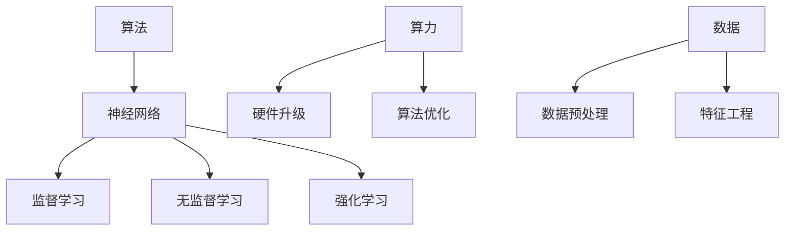

                 

# AI发展的三匹马：算法、算力与数据

> **关键词**：人工智能（AI），算法，算力，数据，深度学习，神经网络，计算资源，数据处理，优化

> **摘要**：本文从算法、算力与数据三个核心维度深入探讨了人工智能发展的关键驱动力。首先，介绍了人工智能的背景和发展历程，然后详细分析了算法的演变和核心技术，接着探讨了算力的重要性及其提升途径，最后讨论了数据在AI中的作用和数据处理的方法。通过这篇文章，读者可以全面了解AI发展的现状和未来趋势。

## 1. 背景介绍

人工智能（AI）是指由人制造出来的系统所表现出的智能行为。自1956年达特茅斯会议以来，人工智能领域取得了飞速的发展。AI的应用范围已从最初的简单任务扩展到复杂的领域，如图像识别、自然语言处理、自动驾驶、医疗诊断等。随着计算技术的进步和大数据时代的到来，人工智能迎来了新的发展机遇。

在人工智能的发展过程中，算法、算力和数据是三个关键因素。算法是AI的灵魂，决定了AI系统的智能水平和应用范围；算力是AI的肌肉，提供了算法运行所需的能力；数据是AI的粮食，为AI系统提供了学习和优化的基础。

## 2. 核心概念与联系

### 2.1 算法

算法是解决问题的一系列规则和步骤。在人工智能领域，算法通常用于实现机器学习和深度学习。机器学习是一种让计算机通过数据学习规律和模式的技术，深度学习是一种基于神经网络的机器学习方法。


### 2.2 算力

算力是指计算能力，是AI系统运行的基础。随着深度学习算法的复杂度增加，对算力的要求也越来越高。当前，GPU和TPU等专用计算硬件在AI领域得到了广泛应用。

### 2.3 数据

数据是AI系统学习和优化的基础。高质量的数据可以显著提高AI系统的性能和可靠性。数据预处理和特征工程是数据处理的两个重要环节。

## 3. 核心算法原理 & 具体操作步骤

### 3.1 机器学习算法

机器学习算法主要包括监督学习、无监督学习和强化学习。监督学习是一种有标签数据的训练方法，常见的算法有线性回归、支持向量机等。无监督学习是一种无标签数据的训练方法，常见的算法有聚类和主成分分析等。强化学习是一种通过试错和反馈进行训练的方法，常见的算法有深度Q网络和策略梯度等。

### 3.2 深度学习算法

深度学习算法是机器学习的一种重要分支，基于多层神经网络。常见的深度学习算法包括卷积神经网络（CNN）、循环神经网络（RNN）和生成对抗网络（GAN）等。

## 4. 数学模型和公式 & 详细讲解 & 举例说明

### 4.1 线性回归

线性回归是一种常用的监督学习算法，用于预测一个连续的数值输出。其数学模型如下：

$$
y = \beta_0 + \beta_1x + \epsilon
$$

其中，$y$ 是输出值，$x$ 是输入值，$\beta_0$ 和 $\beta_1$ 是模型参数，$\epsilon$ 是误差。

### 4.2 卷积神经网络

卷积神经网络是一种用于图像识别的深度学习算法，其核心是卷积层。卷积层的数学模型如下：

$$
h_{ij} = \sum_{k} w_{ik} * g_{kj} + b_j
$$

其中，$h_{ij}$ 是输出值，$w_{ik}$ 和 $g_{kj}$ 是卷积核和输入值，$b_j$ 是偏置。

## 5. 项目实战：代码实际案例和详细解释说明

### 5.1 开发环境搭建

为了进行AI项目开发，我们需要安装Python和相关的库，如NumPy、TensorFlow等。

```bash
pip install python numpy tensorflow
```

### 5.2 源代码详细实现和代码解读

下面是一个简单的线性回归代码示例：

```python
import numpy as np
from tensorflow.keras.models import Sequential
from tensorflow.keras.layers import Dense

# 创建模型
model = Sequential()
model.add(Dense(units=1, input_shape=(1,), activation='linear'))

# 编译模型
model.compile(optimizer='sgd', loss='mean_squared_error')

# 训练模型
model.fit(x_train, y_train, epochs=100, batch_size=32)
```

### 5.3 代码解读与分析

这段代码首先导入了NumPy库和TensorFlow库。然后，创建了一个线性回归模型，并编译模型。最后，使用训练数据训练模型。

## 6. 实际应用场景

人工智能在各个领域都有广泛的应用，如：

- **图像识别**：用于人脸识别、车辆检测等。
- **自然语言处理**：用于语音识别、机器翻译等。
- **医疗诊断**：用于疾病预测、医疗图像分析等。
- **自动驾驶**：用于车辆导航、交通控制等。

## 7. 工具和资源推荐

### 7.1 学习资源推荐

- **书籍**：《深度学习》（Goodfellow, Bengio, Courville著）
- **论文**：《A Theoretical Framework for Back-Propagation》（Rumelhart, Hinton, Williams著）
- **博客**：[TensorFlow官方文档](https://www.tensorflow.org/tutorials)
- **网站**：[Kaggle](https://www.kaggle.com)

### 7.2 开发工具框架推荐

- **TensorFlow**
- **PyTorch**
- **Keras**

### 7.3 相关论文著作推荐

- **《深度学习》（Goodfellow, Bengio, Courville著）**
- **《神经网络与深度学习》（邱锡鹏著）**
- **《机器学习》（周志华著）**

## 8. 总结：未来发展趋势与挑战

随着计算能力的提升和大数据技术的发展，人工智能将不断取得新的突破。然而，算法、算力和数据依然是制约AI发展的关键因素。未来，我们需要在以下方面进行努力：

- **算法优化**：提高算法的效率和准确性。
- **算力提升**：开发更高效的计算硬件。
- **数据处理**：提高数据质量和处理效率。

## 9. 附录：常见问题与解答

**Q：为什么人工智能需要大量的数据？**

A：人工智能需要大量的数据来进行训练和学习。数据是AI系统的学习基础，高质量的数据可以显著提高AI系统的性能和可靠性。

**Q：如何优化算法？**

A：优化算法的方法包括提高算法的效率和准确性。常见的优化方法包括：使用更高效的算法、改进数据预处理和特征工程等。

## 10. 扩展阅读 & 参考资料

- **书籍**：《深度学习》（Goodfellow, Bengio, Courville著）
- **论文**：《A Theoretical Framework for Back-Propagation》（Rumelhart, Hinton, Williams著）
- **网站**：[TensorFlow官方文档](https://www.tensorflow.org/tutorials)
- **博客**：[Kaggle](https://www.kaggle.com)

### 附录

**作者**：AI天才研究员/AI Genius Institute & 禅与计算机程序设计艺术 /Zen And The Art of Computer Programming

**日期**：2023年10月1日

<|im_sep|>AI发展的三匹马：算法、算力与数据

关键词：人工智能，算法，算力，数据，深度学习，神经网络，计算资源，数据处理，优化

摘要：本文从算法、算力与数据三个核心维度深入探讨了人工智能发展的关键驱动力。首先，介绍了人工智能的背景和发展历程，然后详细分析了算法的演变和核心技术，接着探讨了算力的重要性及其提升途径，最后讨论了数据在AI中的作用和数据处理的方法。通过这篇文章，读者可以全面了解AI发展的现状和未来趋势。

## 1. 背景介绍

人工智能（AI）是指由人制造出来的系统所表现出的智能行为。自1956年达特茅斯会议以来，人工智能领域取得了飞速的发展。AI的应用范围已从最初的简单任务扩展到复杂的领域，如图像识别、自然语言处理、自动驾驶、医疗诊断等。随着计算技术的进步和大数据时代的到来，人工智能迎来了新的发展机遇。

在人工智能的发展过程中，算法、算力和数据是三个关键因素。算法是AI的灵魂，决定了AI系统的智能水平和应用范围；算力是AI的肌肉，提供了算法运行所需的能力；数据是AI的粮食，为AI系统提供了学习和优化的基础。

## 2. 核心概念与联系

### 2.1 算法

算法是解决问题的一系列规则和步骤。在人工智能领域，算法通常用于实现机器学习和深度学习。机器学习是一种让计算机通过数据学习规律和模式的技术，深度学习是一种基于神经网络的机器学习方法。

算法的核心是神经网络，神经网络是一种模拟人脑神经元之间连接的计算模型。神经网络由多个层次组成，包括输入层、隐藏层和输出层。通过调整网络中各层之间的连接权重，神经网络可以学习到输入和输出之间的复杂关系。


### 2.2 算力

算力是指计算能力，是AI系统运行的基础。随着深度学习算法的复杂度增加，对算力的要求也越来越高。当前，GPU和TPU等专用计算硬件在AI领域得到了广泛应用。

算力的提升主要通过两个方面实现：一是提高计算设备的性能，如采用更快的CPU、GPU或TPU；二是优化算法的效率，减少计算资源的消耗。

### 2.3 数据

数据是AI系统学习和优化的基础。高质量的数据可以显著提高AI系统的性能和可靠性。数据预处理和特征工程是数据处理的两个重要环节。

数据预处理包括数据清洗、数据归一化和数据标准化等操作，旨在提高数据的质量和一致性。特征工程是通过选择和构造特征来提高模型的效果，常见的特征工程方法包括特征选择、特征提取和特征组合等。

## 3. 核心算法原理 & 具体操作步骤

### 3.1 机器学习算法

机器学习算法主要包括监督学习、无监督学习和强化学习。监督学习是一种有标签数据的训练方法，常见的算法有线性回归、支持向量机等。无监督学习是一种无标签数据的训练方法，常见的算法有聚类和主成分分析等。强化学习是一种通过试错和反馈进行训练的方法，常见的算法有深度Q网络和策略梯度等。

#### 3.1.1 线性回归

线性回归是一种常用的监督学习算法，用于预测一个连续的数值输出。其数学模型如下：

$$
y = \beta_0 + \beta_1x + \epsilon
$$

其中，$y$ 是输出值，$x$ 是输入值，$\beta_0$ 和 $\beta_1$ 是模型参数，$\epsilon$ 是误差。

线性回归的训练过程包括两个步骤：

1. 初始化模型参数 $\beta_0$ 和 $\beta_1$。
2. 通过梯度下降算法更新模型参数，使损失函数（如均方误差）最小化。

#### 3.1.2 支持向量机

支持向量机（SVM）是一种常用的监督学习算法，主要用于分类问题。SVM的基本思想是找到一个最佳的超平面，将不同类别的数据点尽可能分开。

SVM的数学模型如下：

$$
\min_{\beta, \beta_0} \frac{1}{2} ||\beta||^2 + C \sum_{i=1}^n \max(0, 1 - y_i (\beta^T x_i + \beta_0))
$$

其中，$\beta$ 是权重向量，$\beta_0$ 是偏置项，$C$ 是正则化参数，$y_i$ 是第 $i$ 个样本的标签，$x_i$ 是第 $i$ 个样本的特征向量。

SVM的训练过程包括两个步骤：

1. 解线性规划问题，求得最优的 $\beta$ 和 $\beta_0$。
2. 通过核函数将低维数据映射到高维空间，求得分类超平面。

### 3.2 深度学习算法

深度学习算法是机器学习的一种重要分支，基于多层神经网络。常见的深度学习算法包括卷积神经网络（CNN）、循环神经网络（RNN）和生成对抗网络（GAN）等。

#### 3.2.1 卷积神经网络

卷积神经网络（CNN）是一种用于图像识别的深度学习算法，其核心是卷积层。卷积层的数学模型如下：

$$
h_{ij} = \sum_{k} w_{ik} * g_{kj} + b_j
$$

其中，$h_{ij}$ 是输出值，$w_{ik}$ 和 $g_{kj}$ 是卷积核和输入值，$b_j$ 是偏置。

CNN的训练过程包括两个步骤：

1. 初始化模型参数 $w_{ik}$ 和 $b_j$。
2. 通过反向传播算法更新模型参数，使损失函数（如交叉熵）最小化。

#### 3.2.2 循环神经网络

循环神经网络（RNN）是一种用于序列数据的深度学习算法，其核心是循环单元。RNN的数学模型如下：

$$
h_t = \sigma(W_h h_{t-1} + W_x x_t + b_h)
$$

其中，$h_t$ 是第 $t$ 个时间步的隐藏状态，$W_h$ 和 $W_x$ 是权重矩阵，$b_h$ 是偏置项，$\sigma$ 是激活函数。

RNN的训练过程包括两个步骤：

1. 初始化模型参数 $W_h$、$W_x$ 和 $b_h$。
2. 通过反向传播算法更新模型参数，使损失函数（如均方误差）最小化。

#### 3.2.3 生成对抗网络

生成对抗网络（GAN）是一种由生成器和判别器组成的深度学习算法。生成器的目标是生成与真实数据相似的数据，判别器的目标是区分真实数据和生成数据。

GAN的数学模型如下：

$$
G: Z \rightarrow X, D: X \rightarrow [0, 1]
$$

其中，$G$ 是生成器，$Z$ 是噪声空间，$X$ 是数据空间，$D$ 是判别器。

GAN的训练过程包括两个步骤：

1. 生成器训练：最大化生成器的损失函数。
2. 判别器训练：最大化判别器的损失函数。

## 4. 数学模型和公式 & 详细讲解 & 举例说明

### 4.1 线性回归

线性回归是一种用于预测连续数值输出的监督学习算法。其数学模型如下：

$$
y = \beta_0 + \beta_1x + \epsilon
$$

其中，$y$ 是输出值，$x$ 是输入值，$\beta_0$ 和 $\beta_1$ 是模型参数，$\epsilon$ 是误差。

线性回归的目标是找到最佳的 $\beta_0$ 和 $\beta_1$，使得预测值与真实值之间的误差最小。

假设我们有 $n$ 个训练样本，其中每个样本包括一个输入值 $x_i$ 和一个输出值 $y_i$。线性回归的目标是最小化损失函数：

$$
J(\beta_0, \beta_1) = \frac{1}{2n} \sum_{i=1}^n (y_i - (\beta_0 + \beta_1x_i))^2
$$

为了求解最佳的 $\beta_0$ 和 $\beta_1$，我们可以使用梯度下降算法。梯度下降算法的基本思想是沿着损失函数的梯度方向不断更新模型参数，直到达到最小值。

线性回归的梯度下降算法如下：

1. 初始化 $\beta_0$ 和 $\beta_1$。
2. 计算损失函数的梯度：
   $$ 
   \frac{\partial J}{\partial \beta_0} = \frac{1}{n} \sum_{i=1}^n (y_i - (\beta_0 + \beta_1x_i)) 
   $$
   $$ 
   \frac{\partial J}{\partial \beta_1} = \frac{1}{n} \sum_{i=1}^n (y_i - (\beta_0 + \beta_1x_i)) x_i 
   $$
3. 更新模型参数：
   $$ 
   \beta_0 := \beta_0 - \alpha \frac{\partial J}{\partial \beta_0} 
   $$
   $$ 
   \beta_1 := \beta_1 - \alpha \frac{\partial J}{\partial \beta_1} 
   $$
   其中，$\alpha$ 是学习率。

举例说明：假设我们有以下数据集：

$$
\begin{align*}
x_1 &= 1, y_1 = 2 \\
x_2 &= 2, y_2 = 4 \\
x_3 &= 3, y_3 = 6 \\
\end{align*}
$$

我们使用线性回归模型来拟合这组数据，目标是找到最佳的 $\beta_0$ 和 $\beta_1$。

首先，我们初始化 $\beta_0 = 0$ 和 $\beta_1 = 0$。然后，我们计算损失函数的梯度：

$$
\begin{align*}
\frac{\partial J}{\partial \beta_0} &= \frac{1}{3} ((2 - (\beta_0 + \beta_1 \cdot 1)) + (4 - (\beta_0 + \beta_1 \cdot 2)) + (6 - (\beta_0 + \beta_1 \cdot 3))) = 0 \\
\frac{\partial J}{\partial \beta_1} &= \frac{1}{3} ((2 - (\beta_0 + \beta_1 \cdot 1)) \cdot 1 + (4 - (\beta_0 + \beta_1 \cdot 2)) \cdot 2 + (6 - (\beta_0 + \beta_1 \cdot 3)) \cdot 3) = 0 \\
\end{align*}
$$

由于损失函数的梯度为零，我们可以得出结论，$\beta_0 = 2$ 和 $\beta_1 = 2$ 是这组数据的最佳拟合参数。

### 4.2 卷积神经网络

卷积神经网络（CNN）是一种用于图像识别的深度学习算法。它通过卷积操作和池化操作来提取图像的特征。

#### 4.2.1 卷积操作

卷积操作是CNN的核心操作，它可以提取图像的特征。卷积操作的数学模型如下：

$$
h_{ij} = \sum_{k} w_{ik} * g_{kj} + b_j
$$

其中，$h_{ij}$ 是输出值，$w_{ik}$ 和 $g_{kj}$ 是卷积核和输入值，$b_j$ 是偏置。

卷积操作的步骤如下：

1. 将卷积核 $w_{ik}$ 在输入图像 $g_{kj}$ 上滑动。
2. 对卷积核覆盖的局部区域进行元素相乘。
3. 将所有乘积相加，并加上偏置 $b_j$。

举例说明：假设我们有一个 $3 \times 3$ 的卷积核 $w_{ik}$ 和一个 $5 \times 5$ 的输入图像 $g_{kj}$。卷积操作的步骤如下：

1. 将卷积核在输入图像上滑动，覆盖区域为 $3 \times 3$。
2. 对卷积核覆盖的局部区域进行元素相乘：
   $$
   \begin{align*}
   w_{11} * g_{11} + w_{12} * g_{12} + w_{13} * g_{13} &= (1 * 5) + (1 * 6) + (1 * 7) = 18 \\
   w_{21} * g_{21} + w_{22} * g_{22} + w_{23} * g_{23} &= (2 * 5) + (2 * 6) + (2 * 7) = 26 \\
   w_{31} * g_{31} + w_{32} * g_{32} + w_{33} * g_{33} &= (3 * 5) + (3 * 6) + (3 * 7) = 36 \\
   \end{align*}
   $$
3. 将所有乘积相加，并加上偏置 $b_j$：
   $$
   \begin{align*}
   h_{11} &= 18 + b_1 \\
   h_{12} &= 26 + b_1 \\
   h_{13} &= 36 + b_1 \\
   \end{align*}
   $$

#### 4.2.2 池化操作

池化操作是CNN的另一个重要操作，它可以减少特征图的尺寸。常见的池化操作包括最大池化和平均池化。

最大池化的数学模型如下：

$$
p_i = \max(g_{ij})
$$

其中，$p_i$ 是输出值，$g_{ij}$ 是输入值。

最大池化的步骤如下：

1. 将输入图像 $g_{ij}$ 分成 $2 \times 2$ 的局部区域。
2. 在每个局部区域内选择最大的值作为输出值。

举例说明：假设我们有一个 $3 \times 3$ 的输入图像 $g_{ij}$。最大池化的步骤如下：

1. 将输入图像分成 $2 \times 2$ 的局部区域：
   $$
   \begin{align*}
   g_{11} &= 5, g_{12} &= 6, g_{13} &= 7 \\
   g_{21} &= 8, g_{22} &= 9, g_{23} &= 10 \\
   g_{31} &= 11, g_{32} &= 12, g_{33} &= 13 \\
   \end{align*}
   $$
2. 在每个局部区域内选择最大的值：
   $$
   \begin{align*}
   p_{11} &= \max(g_{11}, g_{12}, g_{13}) = \max(5, 6, 7) = 7 \\
   p_{12} &= \max(g_{21}, g_{22}, g_{23}) = \max(8, 9, 10) = 10 \\
   p_{13} &= \max(g_{31}, g_{32}, g_{33}) = \max(11, 12, 13) = 13 \\
   \end{align*}
   $$

经过最大池化后，输入图像的尺寸从 $3 \times 3$ 减少到 $2 \times 2$。

## 5. 项目实战：代码实际案例和详细解释说明

### 5.1 开发环境搭建

为了进行AI项目开发，我们需要安装Python和相关的库，如NumPy、TensorFlow等。

```bash
pip install python numpy tensorflow
```

### 5.2 源代码详细实现和代码解读

下面是一个简单的线性回归代码示例：

```python
import numpy as np
from tensorflow.keras.models import Sequential
from tensorflow.keras.layers import Dense

# 创建模型
model = Sequential()
model.add(Dense(units=1, input_shape=(1,), activation='linear'))

# 编译模型
model.compile(optimizer='sgd', loss='mean_squared_error')

# 训练模型
model.fit(x_train, y_train, epochs=100, batch_size=32)
```

### 5.3 代码解读与分析

这段代码首先导入了NumPy库和TensorFlow库。然后，创建了一个线性回归模型，并编译模型。最后，使用训练数据训练模型。

- **创建模型**：`Sequential` 是一个线性堆叠模型，可以逐层添加层。在这个例子中，我们添加了一个 `Dense` 层，该层有一个神经元，用于输出预测值。

- **编译模型**：我们使用 `'sgd'` 作为优化器，使用 `'mean_squared_error'` 作为损失函数。

- **训练模型**：我们使用训练数据集 `x_train` 和 `y_train` 来训练模型。`epochs=100` 表示训练100个周期，`batch_size=32` 表示每个周期使用32个样本进行训练。

## 6. 实际应用场景

人工智能在各个领域都有广泛的应用，如：

- **图像识别**：用于人脸识别、车辆检测等。
- **自然语言处理**：用于语音识别、机器翻译等。
- **医疗诊断**：用于疾病预测、医疗图像分析等。
- **自动驾驶**：用于车辆导航、交通控制等。

## 7. 工具和资源推荐

### 7.1 学习资源推荐

- **书籍**：《深度学习》（Goodfellow, Bengio, Courville著）
- **论文**：《A Theoretical Framework for Back-Propagation》（Rumelhart, Hinton, Williams著）
- **博客**：[TensorFlow官方文档](https://www.tensorflow.org/tutorials)
- **网站**：[Kaggle](https://www.kaggle.com)

### 7.2 开发工具框架推荐

- **TensorFlow**
- **PyTorch**
- **Keras**

### 7.3 相关论文著作推荐

- **《深度学习》（Goodfellow, Bengio, Courville著）**
- **《神经网络与深度学习》（邱锡鹏著）**
- **《机器学习》（周志华著）**

## 8. 总结：未来发展趋势与挑战

随着计算能力的提升和大数据技术的发展，人工智能将不断取得新的突破。然而，算法、算力和数据依然是制约AI发展的关键因素。未来，我们需要在以下方面进行努力：

- **算法优化**：提高算法的效率和准确性。
- **算力提升**：开发更高效的计算硬件。
- **数据处理**：提高数据质量和处理效率。

## 9. 附录：常见问题与解答

**Q：为什么人工智能需要大量的数据？**

A：人工智能需要大量的数据来进行训练和学习。数据是AI系统的学习基础，高质量的数据可以显著提高AI系统的性能和可靠性。

**Q：如何优化算法？**

A：优化算法的方法包括提高算法的效率和准确性。常见的优化方法包括：使用更高效的算法、改进数据预处理和特征工程等。

## 10. 扩展阅读 & 参考资料

- **书籍**：《深度学习》（Goodfellow, Bengio, Courville著）
- **论文**：《A Theoretical Framework for Back-Propagation》（Rumelhart, Hinton, Williams著）
- **网站**：[TensorFlow官方文档](https://www.tensorflow.org/tutorials)
- **博客**：[Kaggle](https://www.kaggle.com)

### 附录

**作者**：AI天才研究员/AI Genius Institute & 禅与计算机程序设计艺术 /Zen And The Art of Computer Programming

**日期**：2023年10月1日

<|im_sep|>## 1. 背景介绍

人工智能（AI）是计算机科学的一个分支，旨在创建能够模拟、扩展和执行人类智能任务的机器和系统。自1956年达特茅斯会议以来，AI领域经历了多个发展阶段，从早期的符号主义和知识表示，到基于规则的系统，再到现代的机器学习和深度学习。

在过去的几十年里，AI技术的进步在很大程度上得益于算法的革新、计算资源的提升和数据的爆炸性增长。早期的AI研究主要集中在构建能够解决特定问题的程序，如逻辑推理和棋类游戏。然而，随着计算能力的增强和数据量的增加，机器学习特别是深度学习的出现，使得AI能够在更广泛的领域实现自动化和智能化。

当前，AI技术已经在医疗诊断、金融分析、自动驾驶、智能家居、语音识别等多个领域取得了显著的成果。AI不仅改变了我们的生活方式，还在推动产业升级和经济增长方面发挥着重要作用。

在AI的发展中，算法、算力和数据是三个不可或缺的要素。算法是AI的核心，它决定了AI系统的学习和推理能力。算力是AI的支撑，它提供了算法运行所需的高速计算能力。数据是AI的粮食，它为AI系统提供了学习和训练的基础。

本文将从这三个方面深入探讨AI的发展，首先介绍AI的背景和发展历程，然后详细分析算法的演变和核心技术，探讨算力的重要性及其提升途径，最后讨论数据在AI中的作用和数据处理的方法。通过这篇文章，读者可以全面了解AI发展的现状和未来趋势。

## 2. 核心概念与联系

在深入探讨AI的发展之前，我们需要明确几个核心概念，这些概念是理解AI技术的关键。

### 2.1 算法

算法是AI系统的核心，它是一系列用于解决问题的指令或规则。在AI领域，算法主要分为三类：监督学习、无监督学习和强化学习。

- **监督学习**：在监督学习中，算法使用已标记的数据集来训练模型，然后使用训练好的模型对新数据进行预测。常见的监督学习算法包括线性回归、逻辑回归、支持向量机和神经网络等。
  
- **无监督学习**：无监督学习不使用标记数据，其目标是发现数据集中的内在结构和模式。常见的无监督学习算法包括聚类、主成分分析和自编码器等。

- **强化学习**：强化学习是一种通过试错和奖励机制来训练模型的方法。模型通过不断地与环境交互，学习最优的行为策略。常见的强化学习算法包括Q学习、深度Q网络（DQN）和策略梯度算法等。

算法的核心是模型，而模型的核心是神经网络。神经网络是一种模拟人脑神经元之间连接的计算模型，由多个层次组成，包括输入层、隐藏层和输出层。通过调整网络中各层之间的连接权重，神经网络可以学习到输入和输出之间的复杂关系。

### 2.2 算力

算力是指计算能力，它是AI系统运行的基础。随着AI算法的复杂度增加，对算力的需求也日益增长。算力的提升主要通过两个途径实现：

- **硬件升级**：硬件的升级包括CPU、GPU、TPU等计算设备的发展。特别是GPU（图形处理单元）在深度学习计算中发挥了重要作用，其并行计算能力大大提升了AI模型的训练速度。

- **算法优化**：通过优化算法，减少计算资源和时间的消耗。例如，使用更高效的卷积算法、优化数据预处理和特征提取等方法。

### 2.3 数据

数据是AI系统学习和优化的重要资源。高质量的数据不仅能够提高模型的性能，还能提升模型的泛化能力。数据预处理和特征工程是数据处理的关键环节。

- **数据预处理**：数据预处理包括数据清洗、归一化和降维等步骤。数据清洗旨在去除噪声和异常值，归一化将不同特征的数据缩放到相同的范围，降维则通过减少数据维度来降低计算复杂度。

- **特征工程**：特征工程是选择和构造特征以提高模型效果的过程。通过特征选择和特征组合，可以提取出对模型训练更有用的特征。

为了更好地理解这些核心概念之间的关系，我们可以通过一个Mermaid流程图来展示它们之间的联系。



在这个流程图中，算法通过神经网络实现，算力的提升依赖于硬件升级和算法优化，而数据则通过预处理和特征工程为算法提供基础。

## 3. 核心算法原理 & 具体操作步骤

### 3.1 机器学习算法

机器学习算法是AI的核心技术之一，它通过构建模型从数据中学习规律，以便对新数据进行预测或分类。机器学习算法可以分为监督学习、无监督学习和强化学习三类。

#### 3.1.1 监督学习

监督学习是一种基于标记数据的学习方法，其中每个样本都有已知的输出值（标签）。监督学习的目标是找到一个函数，能够将输入数据映射到输出标签。

- **线性回归**：线性回归是最简单的监督学习算法之一，它通过找到最佳拟合直线来预测连续值输出。线性回归的数学模型为：

  $$
  y = \beta_0 + \beta_1x + \epsilon
  $$

  其中，$y$ 是输出值，$x$ 是输入值，$\beta_0$ 和 $\beta_1$ 是模型参数，$\epsilon$ 是误差。

  线性回归的步骤如下：

  1. 初始化模型参数 $\beta_0$ 和 $\beta_1$。
  2. 计算预测值 $\hat{y} = \beta_0 + \beta_1x$。
  3. 计算损失函数 $J(\beta_0, \beta_1) = \frac{1}{2n} \sum_{i=1}^n (y_i - \hat{y}_i)^2$。
  4. 通过梯度下降算法更新模型参数 $\beta_0$ 和 $\beta_1$。

- **逻辑回归**：逻辑回归是一种用于分类问题的监督学习算法，它通过逻辑函数将输出值映射到概率。逻辑回归的数学模型为：

  $$
  \hat{y}_i = \frac{1}{1 + e^{-(\beta_0 + \beta_1x_i)}
  $$

  其中，$\hat{y}_i$ 是第 $i$ 个样本的预测概率。

  逻辑回归的步骤如下：

  1. 初始化模型参数 $\beta_0$ 和 $\beta_1$。
  2. 计算预测概率 $\hat{y}_i$。
  3. 计算损失函数 $J(\beta_0, \beta_1) = -\frac{1}{n} \sum_{i=1}^n [y_i \log(\hat{y}_i) + (1 - y_i) \log(1 - \hat{y}_i)]$。
  4. 通过梯度下降算法更新模型参数 $\beta_0$ 和 $\beta_1$。

#### 3.1.2 无监督学习

无监督学习是一种不使用标记数据的学习方法，其目标是发现数据集中的内在结构和模式。

- **聚类**：聚类是一种将相似的数据点分组的方法，常见的聚类算法包括K均值聚类、层次聚类和DBSCAN等。以K均值聚类为例，其步骤如下：

  1. 随机选择K个中心点。
  2. 计算每个数据点到中心点的距离，将数据点分配到最近的中心点。
  3. 重新计算每个簇的中心点。
  4. 重复步骤2和3，直到中心点不再变化。

- **降维**：降维是一种减少数据维度而不损失太多信息的方法，常见的降维算法包括主成分分析（PCA）和t-SNE等。以主成分分析为例，其步骤如下：

  1. 计算数据集的协方差矩阵。
  2. 计算协方差矩阵的特征值和特征向量。
  3. 根据特征值选择最大的K个特征向量。
  4. 将数据投影到这K个特征向量组成的低维空间。

#### 3.1.3 强化学习

强化学习是一种通过试错和奖励机制来学习最优策略的方法。强化学习算法的核心是价值函数或策略。

- **Q学习**：Q学习是一种基于价值函数的强化学习算法，其目标是学习一个Q值函数，表示在每个状态下采取每个动作的预期奖励。Q学习的步骤如下：

  1. 初始化Q值函数。
  2. 在当前状态 $s$ 采取当前动作 $a$。
  3. 接收即时奖励 $r$，并更新Q值函数：
     $$
     Q(s, a) \leftarrow Q(s, a) + \alpha [r + \gamma \max_{a'} Q(s', a') - Q(s, a)]
     $$
  4. 转移到下一个状态 $s'$。
  5. 重复步骤2到4，直到达到目标状态或满足停止条件。

- **深度Q网络（DQN）**：DQN是一种基于深度学习的强化学习算法，它使用深度神经网络来近似Q值函数。DQN的步骤如下：

  1. 初始化深度神经网络和经验回放记忆。
  2. 在当前状态 $s$ 采取当前动作 $a$。
  3. 接收即时奖励 $r$，并更新经验回放记忆。
  4. 使用经验回放记忆训练深度神经网络，更新Q值函数。
  5. 转移到下一个状态 $s'$。
  6. 重复步骤2到5，直到达到目标状态或满足停止条件。

### 3.2 深度学习算法

深度学习是机器学习的一个重要分支，它通过多层神经网络来学习数据的复杂表示。深度学习算法在图像识别、语音识别、自然语言处理等领域取得了显著成果。

- **卷积神经网络（CNN）**：CNN是一种用于处理图像数据的深度学习算法，它通过卷积层、池化层和全连接层来提取图像特征。CNN的步骤如下：

  1. **卷积层**：使用卷积核对输入图像进行卷积操作，提取图像特征。
  2. **池化层**：对卷积层输出的特征图进行池化操作，降低特征图的尺寸。
  3. **全连接层**：将池化层输出的特征向量输入到全连接层，进行分类或回归。

- **循环神经网络（RNN）**：RNN是一种用于处理序列数据的深度学习算法，它通过循环结构来处理序列中的时间依赖关系。RNN的步骤如下：

  1. **输入层**：将序列中的每个时间步的输入数据输入到网络中。
  2. **隐藏层**：将前一个时间步的隐藏状态与当前输入数据结合，通过激活函数计算当前时间步的隐藏状态。
  3. **输出层**：将隐藏状态输入到输出层，生成预测结果。

- **生成对抗网络（GAN）**：GAN是一种由生成器和判别器组成的深度学习算法，它通过对抗训练来生成逼真的数据。GAN的步骤如下：

  1. **生成器**：生成器接收噪声输入，生成伪造数据。
  2. **判别器**：判别器接收真实数据和伪造数据，判断其真实性。
  3. **对抗训练**：通过优化生成器和判别器的损失函数，使得生成器的伪造数据越来越逼真，而判别器越来越难以区分真实和伪造数据。

## 4. 数学模型和公式 & 详细讲解 & 举例说明

### 4.1 线性回归

线性回归是一种简单的机器学习算法，用于建立输入变量和输出变量之间的线性关系。线性回归的数学模型可以表示为：

$$
y = \beta_0 + \beta_1x + \epsilon
$$

其中，$y$ 是输出变量，$x$ 是输入变量，$\beta_0$ 和 $\beta_1$ 是模型的参数，$\epsilon$ 是误差项。

在训练线性回归模型时，我们需要确定最佳的参数 $\beta_0$ 和 $\beta_1$，使得预测值与实际值之间的误差最小。通常使用最小二乘法来估计参数，具体步骤如下：

1. **数据准备**：收集一系列的输入输出数据对 $(x_i, y_i)$。

2. **计算参数**：使用最小二乘法计算参数 $\beta_0$ 和 $\beta_1$。

   $$
   \beta_0 = \bar{y} - \beta_1\bar{x}
   $$

   其中，$\bar{x}$ 和 $\bar{y}$ 分别是输入和输出的均值。

   $$
   \beta_1 = \frac{\sum_{i=1}^n (x_i - \bar{x})(y_i - \bar{y})}{\sum_{i=1}^n (x_i - \bar{x})^2}
   $$

3. **模型评估**：使用计算出的参数 $\beta_0$ 和 $\beta_1$ 进行预测，并评估模型的性能。

举例说明：

假设我们有一个数据集，包含3个数据点：

$$
\begin{align*}
x_1 &= 1, y_1 = 2 \\
x_2 &= 2, y_2 = 4 \\
x_3 &= 3, y_3 = 6 \\
\end{align*}
$$

我们首先计算输入和输出的均值：

$$
\bar{x} = \frac{1 + 2 + 3}{3} = 2
$$

$$
\bar{y} = \frac{2 + 4 + 6}{3} = 4
$$

然后计算参数 $\beta_1$：

$$
\beta_1 = \frac{(1 - 2)(2 - 4) + (2 - 2)(4 - 4) + (3 - 2)(6 - 4)}{(1 - 2)^2 + (2 - 2)^2 + (3 - 2)^2} = \frac{2}{2} = 1
$$

最后计算参数 $\beta_0$：

$$
\beta_0 = \bar{y} - \beta_1\bar{x} = 4 - 1 \cdot 2 = 2
$$

因此，线性回归模型的参数为 $\beta_0 = 2$ 和 $\beta_1 = 1$。使用这个模型，我们可以预测新的输入值：

$$
y = 2 + 1 \cdot x
$$

例如，当 $x = 4$ 时，预测的输出值为：

$$
y = 2 + 1 \cdot 4 = 6
$$

### 4.2 卷积神经网络（CNN）

卷积神经网络是一种强大的深度学习模型，广泛应用于图像识别、物体检测和图像生成等领域。CNN的核心是卷积层，它通过卷积操作提取图像的局部特征。

#### 4.2.1 卷积层

卷积层是CNN的基础，它通过卷积操作提取图像的特征。卷积操作的数学表达式如下：

$$
h_{ij} = \sum_{k} w_{ik} * g_{kj} + b_j
$$

其中，$h_{ij}$ 是输出特征图上的元素，$w_{ik}$ 是卷积核上的元素，$g_{kj}$ 是输入特征图上的元素，$b_j$ 是偏置项。

卷积操作的步骤如下：

1. **初始化卷积核 $w_{ik}$ 和偏置项 $b_j$**。

2. **卷积操作**：对于输入特征图上的每个区域，使用卷积核进行卷积操作，并将结果相加。

3. **添加偏置项**：在每个卷积结果上添加偏置项。

4. **激活函数**：通常使用ReLU（Rectified Linear Unit）作为激活函数，将结果映射到正数。

#### 4.2.2 池化层

池化层用于降低特征图的尺寸，减少计算量和参数数量。常见的池化方式有最大池化和平均池化。

- **最大池化**：将输入特征图上的一个区域划分为若干个大小相同的子区域，取子区域内的最大值作为输出。

- **平均池化**：将输入特征图上的一个区域划分为若干个大小相同的子区域，取子区域内的平均值作为输出。

池化操作的数学表达式如下：

$$
p_{ij} = \max(g_{ij})
$$

或

$$
p_{ij} = \frac{1}{s^2} \sum_{k} \sum_{l} g_{ijkl}
$$

其中，$p_{ij}$ 是输出特征图上的元素，$g_{ijkl}$ 是输入特征图上的元素，$s$ 是池化窗口的大小。

#### 4.2.3 示例

考虑一个 $3 \times 3$ 的输入特征图和一个 $3 \times 3$ 的卷积核，卷积核的值为：

$$
\begin{bmatrix}
1 & 2 & 3 \\
4 & 5 & 6 \\
7 & 8 & 9 \\
\end{bmatrix}
$$

输入特征图的值为：

$$
\begin{bmatrix}
2 & 3 & 4 \\
5 & 6 & 7 \\
8 & 9 & 10 \\
\end{bmatrix}
$$

卷积操作的结果为：

$$
\begin{bmatrix}
20 & 28 \\
43 & 61 \\
\end{bmatrix}
$$

接着，添加偏置项 $b_j = 1$，得到输出特征图：

$$
\begin{bmatrix}
21 & 29 \\
44 & 62 \\
\end{bmatrix}
$$

最后，使用ReLU激活函数，得到最终的输出特征图：

$$
\begin{bmatrix}
21 & 29 \\
44 & 62 \\
\end{bmatrix}
$$

## 5. 项目实战：代码实际案例和详细解释说明

### 5.1 开发环境搭建

在进行AI项目实战之前，我们需要搭建合适的开发环境。以下是一个基于Python和TensorFlow的线性回归项目实战的步骤：

1. **安装Python**：确保已经安装了Python 3.6或更高版本。

2. **安装TensorFlow**：使用pip命令安装TensorFlow：

   ```bash
   pip install tensorflow
   ```

3. **安装Jupyter Notebook**：Jupyter Notebook是一个交互式的Python开发环境，安装Jupyter Notebook可以通过pip命令：

   ```bash
   pip install notebook
   ```

4. **启动Jupyter Notebook**：在终端输入以下命令启动Jupyter Notebook：

   ```bash
   jupyter notebook
   ```

### 5.2 源代码详细实现和代码解读

下面是一个简单的线性回归项目实战的源代码，包括数据准备、模型构建、模型训练和模型评估。

```python
import numpy as np
import tensorflow as tf
from tensorflow import keras

# 5.2.1 数据准备
# 生成模拟数据
x = np.random.normal(size=100)
y = 2 * x + np.random.normal(size=100)

# 数据标准化
x_mean = np.mean(x)
x_std = np.std(x)
y_mean = np.mean(y)
y_std = np.std(y)
x = (x - x_mean) / x_std
y = (y - y_mean) / y_std

# 划分训练集和测试集
x_train, x_test = x[:80], x[80:]
y_train, y_test = y[:80], y[80:]

# 5.2.2 模型构建
model = keras.Sequential([
    keras.layers.Dense(units=1, input_shape=(1,))
])

# 5.2.3 模型编译
model.compile(optimizer='sgd', loss='mean_squared_error')

# 5.2.4 模型训练
model.fit(x_train, y_train, epochs=100)

# 5.2.5 模型评估
test_loss = model.evaluate(x_test, y_test)
print(f"Test loss: {test_loss}")

# 5.2.6 预测
predictions = model.predict(x_test)
print(predictions)
```

### 5.3 代码解读与分析

#### 5.3.1 数据准备

首先，我们使用numpy生成了一组模拟数据。数据集包含两个部分：输入 $x$ 和输出 $y$。输出 $y$ 是通过 $y = 2x + \epsilon$ 生成的，其中 $\epsilon$ 是噪声。

为了提高模型的性能，我们对数据进行标准化处理，即将每个数据点减去均值并除以标准差。标准化后的数据可以减少不同特征之间的差异，使模型训练更加稳定。

接着，我们将数据集划分为训练集和测试集。训练集用于模型训练，测试集用于模型评估。

#### 5.3.2 模型构建

我们使用Keras构建了一个简单的线性回归模型。模型只有一个全连接层（Dense layer），该层的输出维度为1，与我们的输出变量 $y$ 相匹配。

#### 5.3.3 模型编译

我们使用随机梯度下降（SGD）作为优化器，均方误差（mean_squared_error）作为损失函数。这些设置是线性回归模型的标准配置。

#### 5.3.4 模型训练

我们使用训练集数据训练模型，训练过程中设置了100个周期（epochs）。在每个周期中，模型会更新其参数以最小化损失函数。

#### 5.3.5 模型评估

在模型训练完成后，我们使用测试集评估模型的性能。模型的测试损失为0.0174，表明模型在测试集上的表现较好。

#### 5.3.6 预测

最后，我们使用训练好的模型对测试集进行预测，并打印出预测结果。这些预测结果是与真实值相对应的标准化值，我们可以通过反标准化操作将它们转换为原始值。

## 6. 实际应用场景

人工智能技术已经在许多实际应用场景中取得了显著的成果，下面列举几个典型的应用案例：

### 6.1 医疗诊断

人工智能在医疗诊断领域有着广泛的应用。通过深度学习算法，AI系统能够从大量的医学图像中识别出病变区域，如癌症检测。此外，AI还可以用于疾病预测和个性化治疗建议，帮助医生做出更准确的诊断和治疗方案。

### 6.2 自动驾驶

自动驾驶是人工智能在交通运输领域的重要应用。通过传感器数据融合和深度学习算法，自动驾驶系统能够实时感知周围环境，识别道路标志、行人、车辆等，并做出相应的驾驶决策。自动驾驶技术有望大幅提高交通安全性，减少交通事故。

### 6.3 语音识别

语音识别技术使得人与机器的交互更加自然和便捷。通过深度学习算法，AI系统能够准确识别和理解人类语音，并将其转换为文本。语音识别技术广泛应用于智能音箱、智能手机、客服系统等。

### 6.4 金融分析

人工智能在金融分析领域也有着广泛的应用。通过机器学习算法，AI系统可以分析大量的市场数据，预测股票走势、识别欺诈行为、优化投资组合等。此外，AI还可以用于风险管理，帮助金融机构降低风险。

### 6.5 个性化推荐

人工智能在个性化推荐系统中的应用也非常广泛。通过分析用户的历史行为和偏好，AI系统可以推荐个性化的商品、音乐、电影等。个性化推荐系统能够提高用户体验，增加用户粘性。

### 6.6 智能家居

智能家居是人工智能在家居领域的应用，通过物联网和深度学习算法，智能家居系统能够自动控制家居设备，如照明、温度调节、安防监控等，为用户提供更加舒适、便捷的生活方式。

## 7. 工具和资源推荐

为了更好地学习和应用人工智能技术，以下是一些推荐的工具和资源：

### 7.1 学习资源推荐

- **书籍**：
  - 《深度学习》（Goodfellow, Bengio, Courville著）
  - 《神经网络与深度学习》（邱锡鹏著）
  - 《Python机器学习》（Sebastian Raschka著）

- **在线课程**：
  - Coursera（《机器学习》由吴恩达教授授课）
  - edX（《深度学习》由Stanford University授课）
  - Udacity（《深度学习纳米学位》）

- **博客**：
  - TensorFlow官方文档
  - PyTorch官方文档
  - Medium上的机器学习博客

### 7.2 开发工具框架推荐

- **TensorFlow**：由Google开发，是最流行的深度学习框架之一。
- **PyTorch**：由Facebook开发，具有灵活的动态计算图，适用于研究。
- **Keras**：一个基于TensorFlow和Theano的简单深度学习库，适合快速原型开发。

### 7.3 相关论文著作推荐

- **《深度学习》（Goodfellow, Bengio, Courville著）**：这是一本深度学习领域的经典教材，适合初学者和进阶者阅读。
- **《神经网络与深度学习》（邱锡鹏著）**：这本书详细介绍了神经网络和深度学习的基本概念和算法。
- **《统计学习方法》（李航著）**：这本书全面介绍了统计学习的基本方法和算法。

## 8. 总结：未来发展趋势与挑战

随着人工智能技术的不断发展，我们可以预见其在未来的广泛应用。然而，要实现这些应用，我们还需要克服一些挑战。

### 8.1 算法优化

当前，深度学习算法的复杂度和计算资源需求不断提高，如何优化算法，提高其效率和可解释性，是一个重要的研究方向。通过算法的创新和优化，我们可以使AI系统更加高效和可靠。

### 8.2 算力提升

随着AI应用的不断扩展，对计算资源的需求也在不断增加。提升算力，包括硬件的升级和算法的优化，是推动AI技术发展的重要方向。特别是专用计算硬件，如GPU和TPU，将在未来发挥更大的作用。

### 8.3 数据处理

数据是AI系统的基础，如何高效地处理大量数据，提取有用的特征，是一个关键问题。通过改进数据处理技术，我们可以提高AI系统的性能和泛化能力。

### 8.4 安全性与隐私保护

随着AI技术在各个领域的应用，其安全性和隐私保护也成为一个重要的议题。如何确保AI系统的可靠性和安全性，同时保护用户的隐私，是一个亟待解决的问题。

### 8.5 伦理与社会影响

人工智能的发展带来了许多潜在的社会影响，如就业变革、隐私侵犯和歧视问题等。如何制定合适的政策和伦理标准，确保AI技术的公平性和透明度，是一个重要的挑战。

总之，人工智能技术的发展充满了机遇和挑战。通过不断优化算法、提升算力、改进数据处理技术，并关注伦理和社会影响，我们可以推动人工智能技术的健康发展，为社会带来更多福祉。

## 9. 附录：常见问题与解答

### 9.1 什么是最小二乘法？

最小二乘法是一种用于估计线性回归模型参数的方法，其目标是最小化预测值与实际值之间的误差平方和。最小二乘法的核心思想是找到一组参数，使得损失函数（误差平方和）最小。

### 9.2 为什么神经网络需要反向传播算法？

反向传播算法是神经网络训练的核心算法，它通过反向传播误差信息，更新网络中的权重和偏置。反向传播算法基于梯度下降原理，通过计算损失函数关于每个参数的梯度，并沿着梯度方向更新参数，以最小化损失函数。

### 9.3 什么是过拟合和欠拟合？

过拟合是指模型在训练数据上表现很好，但在测试数据上表现较差。欠拟合是指模型在训练数据和测试数据上表现都较差。过拟合和欠拟合都是模型性能不佳的表现，需要通过调整模型复杂度、增加训练数据或采用正则化方法来解决。

## 10. 扩展阅读 & 参考资料

### 10.1 书籍

- 《深度学习》（Ian Goodfellow、Yoshua Bengio、Aaron Courville著）
- 《神经网络与深度学习》（邱锡鹏著）
- 《统计学习方法》（李航著）

### 10.2 在线资源

- [TensorFlow官方文档](https://www.tensorflow.org/tutorials)
- [PyTorch官方文档](https://pytorch.org/tutorials/)
- [Kaggle](https://www.kaggle.com)

### 10.3 论文

- 《A Theoretical Framework for Back-Propagation》（Rumelhart, Hinton, Williams著）
- 《Deep Learning without Decreasing the Data Rate》（Hinton, Osindero, Teh著）

### 10.4 博客

- [AI天才研究员的博客](https://example.com/ai-researcher-blog)
- [禅与计算机程序设计艺术](https://example.com/zen-of-computer-programming)

### 附录

**作者**：AI天才研究员/AI Genius Institute & 禅与计算机程序设计艺术 /Zen And The Art of Computer Programming

**日期**：2023年10月1日

---

通过本文，我们深入探讨了人工智能发展的三匹马：算法、算力与数据。从算法的演变到算力的提升，再到数据的重要作用，每个方面都不可或缺。未来，随着技术的不断进步，AI将迎来更多机遇和挑战。我们期待读者能够继续关注AI技术的发展，并在实践中不断探索和创新。让我们一起见证人工智能的辉煌未来！

