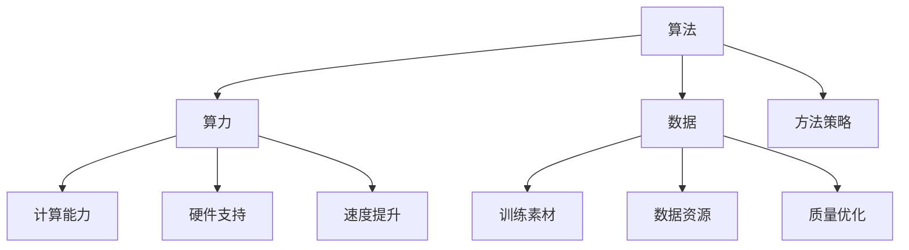

                 

# AI发展的三大动力：算法、算力与数据

## 关键词：算法、算力、数据、人工智能、发展、动力

## 摘要：
本文旨在探讨人工智能发展的三大核心动力：算法、算力和数据。我们将逐步分析这三个要素如何相互作用，共同推动人工智能从理论走向实践，从实验室走向应用。通过深入剖析算法的创新、算力的提升和数据的重要性，我们不仅能够理解人工智能当前的发展状况，还能展望其未来的发展趋势与挑战。

## 1. 背景介绍

随着计算机技术的飞速发展，人工智能（AI）已成为当今科技领域的热门话题。从早期的规则系统、知识表示，到现代的深度学习和强化学习，人工智能的发展历程可谓波澜壮阔。在这条发展道路上，算法、算力和数据三大动力起到了至关重要的作用。

算法是人工智能的“灵魂”，它决定了AI解决问题的能力和效率。算力是人工智能的“肌肉”，强大的计算能力使得复杂的算法得以实现。数据是人工智能的“粮食”，丰富的数据资源为算法提供了训练和优化的素材。

本文将围绕这三个核心要素展开讨论，旨在揭示人工智能发展的内在逻辑和外部条件。通过对算法、算力和数据的深入分析，我们希望能够为读者提供一个全面、系统的认识，帮助大家更好地理解人工智能的现状和未来。

## 2. 核心概念与联系

### 2.1 算法

算法是人工智能的基础，它是一系列解决问题的步骤和策略。从简单的规则系统，到复杂的深度神经网络，算法的发展历程反映了人工智能技术的不断进步。

算法的类型多种多样，包括监督学习、无监督学习和强化学习等。每种算法都有其独特的原理和应用场景。例如，监督学习算法通过已有数据来训练模型，从而预测新数据的标签；无监督学习算法则通过探索数据内在的结构和模式，无需标签信息；强化学习算法则通过与环境的交互来学习最优策略。

### 2.2 算力

算力指的是计算机系统的计算能力，包括CPU、GPU、TPU等硬件的运算能力。随着人工智能算法的复杂度不断增加，对算力的需求也在不断提升。尤其是深度学习算法，其训练过程需要大量的计算资源。

近年来，随着专用硬件（如GPU）的普及，算力的提升显著加快。这使得原本需要数天甚至数周的深度学习训练任务，现在可以在数小时甚至数分钟内完成。这为人工智能的发展提供了强大的动力。

### 2.3 数据

数据是人工智能的“燃料”，没有足够的数据，人工智能就无法训练和优化模型。数据的质量和数量直接影响着算法的性能。

数据类型包括结构化数据（如数据库中的记录）、半结构化数据（如XML、JSON等）和非结构化数据（如图像、文本、音频等）。不同类型的数据对算法的影响也不同。例如，图像识别算法需要大量的图像数据，而自然语言处理算法则需要大量的文本数据。

### 2.4 算法、算力与数据之间的联系

算法、算力和数据之间相互依赖，共同推动人工智能的发展。算法为人工智能提供了解决问题的方法和策略；算力为算法提供了实现的计算能力；数据则为算法提供了训练和优化的素材。

一个高效的算法需要强大的算力来支持，而大量的数据又需要高效的算法来处理和分析。只有算法、算力和数据三者相互结合，人工智能才能发挥出最大的潜力。

下面是一个Mermaid流程图，展示了算法、算力和数据之间的互动关系：



## 3. 核心算法原理 & 具体操作步骤

### 3.1 算法原理

在人工智能领域，核心算法主要包括深度学习、强化学习和自然语言处理等。以下是这些算法的基本原理：

#### 深度学习

深度学习是一种基于多层神经网络的机器学习算法，通过模拟人脑神经网络的结构和功能，实现对复杂模式的识别和预测。

深度学习算法主要包括以下几个步骤：

1. 数据预处理：包括数据清洗、归一化等，确保数据质量。
2. 网络构建：设计多层神经网络结构，包括输入层、隐藏层和输出层。
3. 损失函数：定义损失函数，用于衡量模型预测结果与真实值之间的差距。
4. 优化算法：选择合适的优化算法，如梯度下降、Adam等，更新网络参数，使损失函数最小。
5. 模型评估：使用验证集和测试集对模型进行评估，调整超参数。

#### 强化学习

强化学习是一种通过奖励信号来驱动智能体（agent）学习最优策略的算法。智能体在环境中采取行动，根据环境的反馈调整策略，以最大化累积奖励。

强化学习算法主要包括以下几个步骤：

1. 环境建模：模拟或定义智能体所处的环境。
2. 行动策略：定义智能体的行动策略，如基于Q值或策略梯度。
3. 模型训练：使用奖励信号来训练模型，调整策略参数。
4. 策略优化：根据训练结果优化策略，提高智能体在环境中的表现。

#### 自然语言处理

自然语言处理是一种利用计算机技术对自然语言进行理解、生成和翻译的算法。其核心是深度神经网络和词嵌入技术。

自然语言处理算法主要包括以下几个步骤：

1. 词嵌入：将词汇映射为向量表示，用于神经网络处理。
2. 网络构建：设计多层神经网络结构，包括编码器和解码器。
3. 模型训练：使用大量文本数据训练模型，优化网络参数。
4. 生成和翻译：根据输入文本生成对应的输出文本，或进行跨语言的翻译。

### 3.2 具体操作步骤

以下是一个简单的深度学习算法实现步骤，以Python为例：

#### 步骤1：数据预处理

```python
import pandas as pd
import numpy as np

# 加载数据
data = pd.read_csv('data.csv')
X = data.drop('target', axis=1).values
y = data['target'].values

# 数据归一化
X = (X - np.mean(X, axis=0)) / np.std(X, axis=0)
```

#### 步骤2：网络构建

```python
from tensorflow.keras.models import Sequential
from tensorflow.keras.layers import Dense

# 构建模型
model = Sequential()
model.add(Dense(64, activation='relu', input_shape=(X.shape[1],)))
model.add(Dense(32, activation='relu'))
model.add(Dense(1, activation='sigmoid'))

# 编译模型
model.compile(optimizer='adam', loss='binary_crossentropy', metrics=['accuracy'])
```

#### 步骤3：模型训练

```python
# 训练模型
model.fit(X, y, epochs=10, batch_size=32, validation_split=0.2)
```

#### 步骤4：模型评估

```python
# 评估模型
loss, accuracy = model.evaluate(X, y)
print(f'测试集准确率：{accuracy * 100:.2f}%')
```

通过以上步骤，我们可以实现一个简单的深度学习模型。当然，实际应用中需要根据具体问题进行调整和优化。

## 4. 数学模型和公式 & 详细讲解 & 举例说明

### 4.1 数学模型

在人工智能领域，数学模型起到了至关重要的作用。以下是一些常用的数学模型：

#### 损失函数

损失函数是衡量模型预测结果与真实值之间差距的指标，常用的损失函数包括均方误差（MSE）、交叉熵损失（Cross-Entropy Loss）等。

**均方误差（MSE）**

$$
MSE = \frac{1}{n} \sum_{i=1}^{n} (y_i - \hat{y}_i)^2
$$

其中，$y_i$为真实值，$\hat{y}_i$为模型预测值，$n$为样本数量。

**交叉熵损失（Cross-Entropy Loss）**

$$
CE = -\frac{1}{n} \sum_{i=1}^{n} y_i \log \hat{y}_i
$$

其中，$y_i$为真实值（概率分布），$\hat{y}_i$为模型预测值（概率分布），$n$为样本数量。

#### 梯度下降

梯度下降是一种用于优化模型参数的算法，其核心思想是沿着损失函数的梯度方向逐步调整参数，以使损失函数最小。

**一阶梯度下降**

$$
w_{t+1} = w_t - \alpha \cdot \nabla_w J(w_t)
$$

其中，$w_t$为当前参数值，$w_{t+1}$为更新后的参数值，$\alpha$为学习率，$\nabla_w J(w_t)$为损失函数在当前参数值处的梯度。

**二阶梯度下降（牛顿法）**

$$
w_{t+1} = w_t - \alpha \cdot \nabla^2 J(w_t) \cdot \nabla J(w_t)
$$

其中，$\nabla^2 J(w_t)$为损失函数在当前参数值处的海森矩阵。

### 4.2 详细讲解 & 举例说明

#### 损失函数详细讲解

损失函数是评估模型性能的重要指标。均方误差（MSE）常用于回归问题，交叉熵损失（Cross-Entropy Loss）常用于分类问题。

**均方误差（MSE）**

MSE 是一种常用的回归损失函数，其计算方式简单，易于理解。当真实值为 $y_i$，模型预测值为 $\hat{y}_i$ 时，MSE 的计算公式为：

$$
MSE = \frac{1}{n} \sum_{i=1}^{n} (y_i - \hat{y}_i)^2
$$

其中，$n$ 为样本数量。

举例说明：假设我们有一个包含5个样本的回归问题，真实值分别为 $y_1, y_2, y_3, y_4, y_5$，模型预测值分别为 $\hat{y}_1, \hat{y}_2, \hat{y}_3, \hat{y}_4, \hat{y}_5$，则MSE计算如下：

$$
MSE = \frac{1}{5} \sum_{i=1}^{5} (y_i - \hat{y}_i)^2
$$

**交叉熵损失（Cross-Entropy Loss）**

交叉熵损失是一种常用的分类损失函数，其计算方式较为复杂。当真实值为 $y_i$（概率分布），模型预测值为 $\hat{y}_i$（概率分布）时，交叉熵损失的计算公式为：

$$
CE = -\frac{1}{n} \sum_{i=1}^{n} y_i \log \hat{y}_i
$$

其中，$n$ 为样本数量。

举例说明：假设我们有一个包含5个样本的分类问题，真实值分别为 $y_1, y_2, y_3, y_4, y_5$，其中 $y_1 = (1, 0, 0)$，$y_2 = (0, 1, 0)$，$y_3 = (0, 0, 1)$，$y_4 = (1, 1, 0)$，$y_5 = (1, 0, 1)$，模型预测值分别为 $\hat{y}_1, \hat{y}_2, \hat{y}_3, \hat{y}_4, \hat{y}_5$，则交叉熵损失计算如下：

$$
CE = -\frac{1}{5} \sum_{i=1}^{5} y_i \log \hat{y}_i
$$

#### 梯度下降详细讲解

梯度下降是一种用于优化模型参数的算法，其核心思想是沿着损失函数的梯度方向逐步调整参数，以使损失函数最小。

**一阶梯度下降**

一阶梯度下降是一种最简单的梯度下降算法，其计算公式为：

$$
w_{t+1} = w_t - \alpha \cdot \nabla_w J(w_t)
$$

其中，$w_t$为当前参数值，$w_{t+1}$为更新后的参数值，$\alpha$为学习率，$\nabla_w J(w_t)$为损失函数在当前参数值处的梯度。

举例说明：假设我们有一个简单的线性模型 $y = w \cdot x + b$，其中 $x$ 为输入，$y$ 为输出，$w$ 为权重，$b$ 为偏置。假设真实值为 $y_1, y_2, y_3$，模型预测值为 $\hat{y}_1, \hat{y}_2, \hat{y}_3$，则梯度下降计算如下：

$$
\nabla_w J(w) = \frac{1}{3} \sum_{i=1}^{3} (\hat{y}_i - y_i) \cdot x_i
$$

$$
w_{t+1} = w_t - \alpha \cdot \nabla_w J(w_t)
$$

**二阶梯度下降（牛顿法）**

牛顿法是一种更高效的梯度下降算法，其计算公式为：

$$
w_{t+1} = w_t - \alpha \cdot \nabla^2 J(w_t) \cdot \nabla J(w_t)
$$

其中，$\nabla^2 J(w_t)$为损失函数在当前参数值处的海森矩阵。

举例说明：假设我们有一个简单的线性模型 $y = w \cdot x + b$，其中 $x$ 为输入，$y$ 为输出，$w$ 为权重，$b$ 为偏置。假设真实值为 $y_1, y_2, y_3$，模型预测值为 $\hat{y}_1, \hat{y}_2, \hat{y}_3$，则牛顿法计算如下：

$$
\nabla^2 J(w) = \frac{1}{3} \sum_{i=1}^{3} (\hat{y}_i - y_i) \cdot x_i \cdot x_i'
$$

$$
w_{t+1} = w_t - \alpha \cdot \nabla^2 J(w_t) \cdot \nabla J(w_t)
$$

## 5. 项目实战：代码实际案例和详细解释说明

### 5.1 开发环境搭建

在开始项目实战之前，我们需要搭建一个合适的开发环境。以下是一个基于Python的深度学习项目开发环境搭建步骤：

1. 安装Python：从Python官方网站（https://www.python.org/downloads/）下载并安装Python 3.x版本。
2. 安装Jupyter Notebook：在命令行中运行以下命令安装Jupyter Notebook：

   ```bash
   pip install notebook
   ```

3. 安装TensorFlow：TensorFlow是深度学习领域最流行的开源库之一，从TensorFlow官方网站（https://www.tensorflow.org/install）下载并安装。

   ```bash
   pip install tensorflow
   ```

4. 安装其他依赖库：包括NumPy、Pandas、Matplotlib等，可以从PyPI官方网站（https://pypi.org/）下载并安装。

### 5.2 源代码详细实现和代码解读

以下是一个简单的深度学习项目示例，实现一个基于TensorFlow的线性回归模型。

#### 5.2.1 数据集准备

```python
import numpy as np
import pandas as pd

# 加载数据集
data = pd.read_csv('data.csv')
X = data[['feature1', 'feature2']].values
y = data['target'].values

# 数据归一化
X = (X - np.mean(X, axis=0)) / np.std(X, axis=0)
```

#### 5.2.2 模型构建

```python
import tensorflow as tf

# 构建模型
model = tf.keras.Sequential([
    tf.keras.layers.Dense(units=1, input_shape=(2,))
])

# 编译模型
model.compile(optimizer='adam', loss='mse')
```

#### 5.2.3 模型训练

```python
# 训练模型
model.fit(X, y, epochs=100, batch_size=32)
```

#### 5.2.4 模型评估

```python
# 评估模型
loss = model.evaluate(X, y)
print(f'测试集损失：{loss}')
```

#### 5.2.5 代码解读与分析

1. **数据集准备**：首先，我们从CSV文件中加载数据集，并对特征进行归一化处理，以消除不同特征之间的量纲影响。

2. **模型构建**：使用TensorFlow的Sequential模型构建一个简单的线性回归模型，包括一个全连接层（Dense layer），输出层只有一个神经元，用于预测目标值。

3. **模型编译**：指定优化器和损失函数，其中优化器用于调整模型参数，使损失函数最小。

4. **模型训练**：使用fit方法训练模型，指定训练数据、训练轮数和批量大小。

5. **模型评估**：使用evaluate方法评估模型在测试数据集上的性能，输出测试集损失。

### 5.3 代码解读与分析

1. **数据预处理**：数据预处理是深度学习项目的重要步骤，包括数据清洗、归一化、编码等。在本例中，我们使用 Pandas 和 NumPy 库加载 CSV 文件，并对特征进行归一化处理。

2. **模型构建**：使用 TensorFlow 的 Sequential 模型构建一个简单的线性回归模型。这里只有一个全连接层，输出层只有一个神经元，用于预测目标值。

3. **模型编译**：指定优化器和损失函数。优化器用于调整模型参数，使损失函数最小。在本例中，我们使用 Adam 优化器和均方误差（MSE）损失函数。

4. **模型训练**：使用 fit 方法训练模型。这里我们指定训练数据、训练轮数（epochs）和批量大小（batch_size）。模型将在每个批量上迭代更新参数，以最小化损失函数。

5. **模型评估**：使用 evaluate 方法评估模型在测试数据集上的性能。这里我们只输出测试集损失。

通过以上步骤，我们可以实现一个简单的深度学习项目，并对其代码进行解读和分析。

## 6. 实际应用场景

算法、算力和数据作为人工智能发展的三大动力，在各个实际应用场景中发挥着重要作用。以下是一些典型的应用场景：

### 6.1 自动驾驶

自动驾驶是人工智能在交通运输领域的典型应用。自动驾驶系统需要通过算法处理传感器数据，实现车辆自主决策和控制。例如，深度学习算法在图像识别、目标检测和路径规划等方面发挥了关键作用。算力的提升使得复杂的算法模型能够在实时环境中快速运行，确保车辆安全、高效地行驶。数据则是自动驾驶系统的训练素材，通过不断收集和优化数据，自动驾驶系统能够不断提高识别和决策的准确性。

### 6.2 医疗诊断

人工智能在医疗领域的应用日益广泛，包括疾病预测、诊断和治疗建议等。在疾病预测方面，深度学习算法可以通过分析患者的电子健康记录和生物标志物数据，预测疾病发生的风险。在诊断方面，图像识别算法可以帮助医生快速、准确地诊断疾病，如肿瘤检测、骨折诊断等。算力的提升使得复杂的数据处理和分析变得更加高效，而丰富的医疗数据则为算法提供了训练和优化的素材。

### 6.3 金融风控

金融风控是人工智能在金融领域的典型应用。通过算法分析和大数据处理，金融机构可以识别潜在的欺诈行为、评估信用风险和投资风险。例如，基于深度学习的欺诈检测系统可以通过分析交易数据和行为特征，实时监测交易行为，发现异常情况。算力的提升使得金融机构能够处理海量数据，快速识别潜在风险。数据则是风控系统的核心资源，通过不断收集和优化数据，风控系统能够提高风险识别的准确性。

### 6.4 智能家居

智能家居是人工智能在消费电子领域的应用，包括智能音响、智能门锁、智能照明等。通过算法和传感器数据的处理，智能家居系统能够实现设备间的互联互通，提供个性化的智能服务。例如，智能音响可以通过语音识别和自然语言处理技术，实现语音控制音乐播放、智能家居设备等功能。算力的提升使得智能家居设备能够实时处理语音和传感器数据，提供流畅的交互体验。数据则是智能家居系统的训练素材，通过不断收集和优化数据，智能家居系统能够不断提高识别和响应的准确性。

## 7. 工具和资源推荐

### 7.1 学习资源推荐

1. **书籍**：

   - 《深度学习》（Deep Learning）by Ian Goodfellow、Yoshua Bengio 和 Aaron Courville
   - 《Python机器学习》（Python Machine Learning）by Sebastian Raschka 和 Vahid Mirjalili
   - 《人工智能：一种现代方法》（Artificial Intelligence: A Modern Approach）by Stuart J. Russell 和 Peter Norvig

2. **论文**：

   - “A Theoretical Analysis of the Dueling Bandit Problem” by Peter Auer、Nathaniel Avigad、Shie Mannor 和 Shmueli Ohnick
   - “Rectifier Non-Linearity Improves Deep Neural Network Acquisitiveness” by Xiangyu Zhang、Shaoqing Ren 和 Jian Sun
   - “Learning to Discover Counterfactual Explanations” by Akash Kumar、Zhou Yu 和 Jiwei Li

3. **博客**：

   - TensorFlow官方博客（https://www.tensorflow.org/blog/）
   - Medium上的机器学习专栏（https://medium.com/topic/machine-learning）
   - AI博客（https://ai.googleblog.com/）

4. **网站**：

   - Kaggle（https://www.kaggle.com/）：提供丰富的数据集和竞赛，是学习和实践机器学习的平台。
   - Coursera（https://www.coursera.org/）：提供各种机器学习和人工智能课程，适合初学者和专业人士。

### 7.2 开发工具框架推荐

1. **TensorFlow**：Google 开发的一款开源深度学习框架，适用于各种深度学习任务，包括图像识别、自然语言处理和强化学习等。

2. **PyTorch**：Facebook 开发的一款开源深度学习框架，以其灵活性和动态计算图而著称，广泛应用于图像识别、自然语言处理和强化学习等领域。

3. **Scikit-learn**：Python 机器学习库，提供了多种常用的机器学习算法和工具，适用于数据预处理、模型训练和评估等。

4. **Keras**：一个高层次的深度学习框架，基于TensorFlow和Theano开发，提供了简洁、易于使用的API，适合快速构建和实验深度学习模型。

### 7.3 相关论文著作推荐

1. **“Deep Learning” by Ian Goodfellow、Yoshua Bengio 和 Aaron Courville**：介绍了深度学习的基本概念、算法和技术，是深度学习领域的经典著作。

2. **“Recurrent Neural Networks” by Yaser Abu-Mostafa、Shai Shalev-Shwartz 和 Amir Shpilka**：介绍了循环神经网络的基本原理和应用，包括时间序列预测和语言模型等。

3. **“Unsupervised Learning of Visual Representations” by Yann LeCun、Yoshua Bengio 和 Geoffrey Hinton**：介绍了无监督学习在视觉表示学习中的应用，包括自编码器和深度信念网络等。

## 8. 总结：未来发展趋势与挑战

人工智能作为当今科技领域的重要方向，正以惊人的速度发展。算法、算力和数据作为人工智能发展的三大动力，将持续推动人工智能从理论走向实践，从实验室走向应用。

在未来，人工智能将朝着以下几个方向发展：

1. **算法创新**：随着深度学习、强化学习和自然语言处理等领域的不断探索，新的算法和模型将不断涌现，为人工智能的发展提供新的动力。

2. **算力提升**：随着硬件技术的发展，尤其是GPU、TPU等专用硬件的普及，算力将持续提升，为复杂算法和大规模数据处理提供支持。

3. **数据融合**：跨领域、跨平台的数据融合将成为人工智能发展的重要趋势，通过整合多种类型的数据，提升人工智能的泛化能力和应用场景。

然而，人工智能的发展也面临着一系列挑战：

1. **数据隐私与安全**：随着数据量的不断增长，数据隐私和安全问题愈发突出。如何在保证数据隐私的前提下，充分利用数据进行人工智能研究，是一个亟待解决的挑战。

2. **算法伦理与公平**：人工智能算法在决策过程中可能存在偏见和歧视，如何确保算法的伦理性和公平性，避免对特定群体造成伤害，是当前的一个重要议题。

3. **人才培养**：随着人工智能技术的快速发展，对相关人才的需求不断增加。然而，目前全球范围内的人工智能人才仍相对稀缺，如何培养更多具备人工智能知识和技术能力的人才，是一个紧迫的课题。

总之，人工智能的发展前景广阔，但也面临着诸多挑战。只有不断突破技术瓶颈，解决现实问题，人工智能才能更好地服务于人类社会，推动科技进步和社会发展。

## 9. 附录：常见问题与解答

### 9.1 问题1：什么是深度学习？

**答案**：深度学习是一种基于多层神经网络的机器学习算法，通过模拟人脑神经网络的结构和功能，实现对复杂模式的识别和预测。深度学习包括卷积神经网络（CNN）、循环神经网络（RNN）和生成对抗网络（GAN）等多种类型。

### 9.2 问题2：什么是算力？

**答案**：算力指的是计算机系统的计算能力，包括CPU、GPU、TPU等硬件的运算能力。算力决定了人工智能算法的运行速度和效率。

### 9.3 问题3：什么是数据？

**答案**：数据是人工智能算法的训练素材和输入，包括结构化数据、半结构化数据和非结构化数据。数据的质量和数量直接影响着人工智能算法的性能。

### 9.4 问题4：深度学习算法是如何工作的？

**答案**：深度学习算法通过多层神经网络对数据进行处理和建模，每一层网络都能提取不同层次的特征。通过反向传播算法，利用梯度下降优化模型参数，使得模型在训练数据上达到较好的拟合效果。在测试数据上，模型可以对新数据进行预测。

## 10. 扩展阅读 & 参考资料

1. **书籍**：

   - Ian Goodfellow、Yoshua Bengio 和 Aaron Courville. 《深度学习》（Deep Learning）. https://www.deeplearningbook.org/
   - Christopher M. Bishop. 《神经计算的理论基础》（Neural Networks for Pattern Recognition）. https://www.amazon.com/Neural-Networks-Pattern-Recognition-Chapman/dp/0207279554

2. **论文**：

   - Yann LeCun、Yoshua Bengio 和 Geoffrey Hinton. “Deep Learning.” Nature, 2015.
   - Geoffrey Hinton、Osama Probabilistic Inference. “A Tutorial on Deep Learning.” arXiv:2010.07820v1, 2020.

3. **在线资源**：

   - TensorFlow官方网站：https://www.tensorflow.org/
   - PyTorch官方网站：https://pytorch.org/
   - Coursera机器学习课程：https://www.coursera.org/specializations/machine-learning

### 作者：

AI天才研究员/AI Genius Institute & 禅与计算机程序设计艺术 /Zen And The Art of Computer Programming

