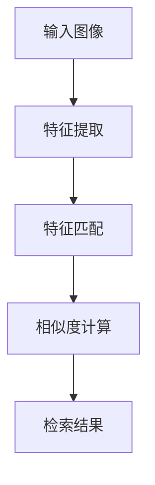

                 

# AI图像搜索技术应用案例

## 摘要

本文将深入探讨AI图像搜索技术的应用案例，从背景介绍、核心概念、算法原理、数学模型、项目实战、实际应用场景等多个角度，详细解析AI图像搜索技术的工作原理及其在实际场景中的运用。本文旨在帮助读者理解AI图像搜索技术的核心概念和操作步骤，了解其数学模型和公式，并通过实战案例展示其具体应用，为读者提供全面的技术指导。

## 1. 背景介绍

### 1.1 什么是AI图像搜索？

AI图像搜索是一种利用人工智能技术，通过图像内容进行检索和匹配的方法。它通过分析图像的视觉特征，如颜色、形状、纹理等，将图像与其数据库中的图像进行比对，从而找到相似或相关的图像。

### 1.2 AI图像搜索的应用领域

AI图像搜索技术在多个领域有着广泛的应用，包括但不限于：

1. **社交媒体和搜索引擎**：用户可以通过上传一张图片，快速找到与之相似的图片或相关内容。
2. **电子商务**：电商平台可以使用AI图像搜索技术，帮助用户通过上传图片来查找商品。
3. **医疗影像诊断**：AI图像搜索技术可以帮助医生快速识别和诊断疾病。
4. **版权保护**：通过对比图像内容，可以有效地识别和追踪侵权行为。

### 1.3 AI图像搜索的发展历程

AI图像搜索技术的发展可以追溯到20世纪90年代，随着计算机性能的提升和算法的进步，图像搜索技术逐渐成熟。近年来，深度学习和卷积神经网络（CNN）的兴起，使得AI图像搜索技术取得了显著的进展。

## 2. 核心概念与联系

### 2.1 图像特征提取

图像特征提取是AI图像搜索技术的关键步骤。通过提取图像的视觉特征，如颜色、形状、纹理等，可以有效地描述图像的内容。

### 2.2 卷积神经网络（CNN）

卷积神经网络是一种专门用于处理图像数据的深度学习模型。它通过多层卷积和池化操作，可以自动提取图像的高层特征。

### 2.3 特征匹配与相似度计算

特征匹配是图像搜索的核心。通过计算特征向量之间的相似度，可以找到与查询图像相似的图像。

### 2.4 Mermaid 流程图

以下是一个简单的Mermaid流程图，展示了AI图像搜索的基本流程：



## 3. 核心算法原理 & 具体操作步骤

### 3.1 特征提取

特征提取是图像搜索的第一步。常用的特征提取方法包括：

1. **颜色直方图**：通过计算图像的颜色分布来描述图像。
2. **SIFT（尺度不变特征变换）**：提取图像的关键点，并计算其描述子。
3. **SURF（加速稳健特征）**：与SIFT类似，但计算速度更快。

### 3.2 特征匹配

特征匹配是图像搜索的核心步骤。常用的特征匹配方法包括：

1. **欧氏距离**：计算特征向量之间的距离，距离越近，相似度越高。
2. **余弦相似度**：计算特征向量之间的夹角，夹角越小，相似度越高。
3. **最近邻搜索**：找到与查询特征最相似的特征。

### 3.3 相似度计算

相似度计算是特征匹配的结果。常用的相似度计算方法包括：

1. **欧氏距离**：
    $$d(\mathbf{x}, \mathbf{y}) = \sqrt{\sum_{i=1}^{n} (x_i - y_i)^2}$$
2. **余弦相似度**：
    $$\text{sim}(\mathbf{x}, \mathbf{y}) = \frac{\mathbf{x} \cdot \mathbf{y}}{||\mathbf{x}|| \cdot ||\mathbf{y}||}$$

### 3.4 检索结果

检索结果是根据相似度计算得出的。相似度越高，检索结果越相关。

## 4. 数学模型和公式 & 详细讲解 & 举例说明

### 4.1 特征提取

#### 4.1.1 颜色直方图

颜色直方图是图像特征提取的一种简单方法。它通过计算图像中各个颜色通道的像素数量来描述图像的颜色分布。

#### 4.1.2 SIFT

SIFT算法通过以下步骤提取特征：

1. **关键点检测**：检测图像中的关键点。
2. **关键点定位**：对关键点进行精确定位。
3. **特征描述子计算**：计算关键点的特征描述子。

#### 4.1.3 SURF

SURF算法与SIFT类似，但使用了更快的方法来检测和计算特征。

### 4.2 特征匹配

#### 4.2.1 欧氏距离

欧氏距离是特征匹配的一种简单方法。它通过计算特征向量之间的欧氏距离来衡量相似度。

#### 4.2.2 余弦相似度

余弦相似度是特征匹配的一种方法。它通过计算特征向量之间的夹角来衡量相似度。

### 4.3 相似度计算

#### 4.3.1 欧氏距离

$$d(\mathbf{x}, \mathbf{y}) = \sqrt{\sum_{i=1}^{n} (x_i - y_i)^2}$$

#### 4.3.2 余弦相似度

$$\text{sim}(\mathbf{x}, \mathbf{y}) = \frac{\mathbf{x} \cdot \mathbf{y}}{||\mathbf{x}|| \cdot ||\mathbf{y}||}$$

### 4.4 举例说明

假设我们有两个特征向量：

$$\mathbf{x} = [1, 2, 3]$$

$$\mathbf{y} = [4, 5, 6]$$

计算它们的欧氏距离：

$$d(\mathbf{x}, \mathbf{y}) = \sqrt{(1 - 4)^2 + (2 - 5)^2 + (3 - 6)^2} = \sqrt{9 + 9 + 9} = \sqrt{27} = 3\sqrt{3}$$

计算它们的余弦相似度：

$$\text{sim}(\mathbf{x}, \mathbf{y}) = \frac{1 \cdot 4 + 2 \cdot 5 + 3 \cdot 6}{\sqrt{1^2 + 2^2 + 3^2} \cdot \sqrt{4^2 + 5^2 + 6^2}} = \frac{4 + 10 + 18}{\sqrt{14} \cdot \sqrt{77}} = \frac{32}{\sqrt{1066}}$$

## 5. 项目实战：代码实际案例和详细解释说明

### 5.1 开发环境搭建

在进行项目实战之前，我们需要搭建一个合适的开发环境。以下是所需的环境和工具：

1. **Python**：版本3.8或更高。
2. **PyTorch**：深度学习框架。
3. **OpenCV**：图像处理库。

### 5.2 源代码详细实现和代码解读

以下是一个简单的AI图像搜索项目示例。我们将使用PyTorch和OpenCV来实现一个基本的图像搜索系统。

```python
import torch
import torchvision
import torchvision.transforms as transforms
import cv2
import numpy as np

# 加载预训练的卷积神经网络模型
model = torchvision.models.resnet18(pretrained=True)
model.eval()

# 图像预处理
def preprocess_image(image_path):
    image = cv2.imread(image_path)
    image = cv2.cvtColor(image, cv2.COLOR_BGR2RGB)
    image = transforms.Compose([
        transforms.Resize(256),
        transforms.CenterCrop(224),
        transforms.ToTensor(),
        transforms.Normalize(mean=[0.485, 0.456, 0.406], std=[0.229, 0.224, 0.225]),
    ])(image)
    return image

# 特征提取
def extract_features(image):
    with torch.no_grad():
        image = torch.unsqueeze(image, 0)
        features = model(image)
    return features

# 相似度计算
def compute_similarity(feature1, feature2):
    similarity = torch.cosine_similarity(feature1, feature2)
    return similarity.item()

# 搜索相似图像
def search_images(image_path, dataset_path, num_results=5):
    image = preprocess_image(image_path)
    features = extract_features(image)

    dataset = torchvision.datasets.ImageFolder(dataset_path, transform=transforms.Compose([
        transforms.Resize(256),
        transforms.CenterCrop(224),
        transforms.ToTensor(),
        transforms.Normalize(mean=[0.485, 0.456, 0.406], std=[0.229, 0.224, 0.225]),
    ]))
    loader = torch.utils.data.DataLoader(dataset, batch_size=num_results)

    similarities = []
    for batch in loader:
        features_batch = extract_features(batch[0])
        similarity = compute_similarity(features, features_batch)
        similarities.append(similarity)

    sorted_indices = np.argsort(similarities)[::-1]
    return [loader.dataset.imgs[i] for i in sorted_indices]

# 测试
image_path = "example.jpg"
dataset_path = "dataset/"
results = search_images(image_path, dataset_path)

for result in results:
    print(result)
```

### 5.3 代码解读与分析

以上代码实现了一个简单的AI图像搜索系统。下面是对关键部分的解读：

1. **模型加载**：我们使用了预训练的ResNet18模型，这是一个用于图像分类的卷积神经网络。
2. **图像预处理**：图像预处理是特征提取的重要步骤。我们使用了OpenCV和PyTorch的预处理方法，将图像转换为适合模型输入的格式。
3. **特征提取**：我们使用卷积神经网络提取图像的特征向量。
4. **相似度计算**：我们使用余弦相似度来计算特征向量之间的相似度。
5. **搜索相似图像**：我们使用加载的图像作为查询图像，并在数据集中搜索相似的图像。

## 6. 实际应用场景

### 6.1 社交媒体

在社交媒体平台上，AI图像搜索技术可以帮助用户通过上传图片快速找到相关内容，如相似的图片、相关的帖子等。

### 6.2 电子商务

在电子商务领域，AI图像搜索技术可以帮助用户通过上传图片来查找商品，提高用户的购物体验。

### 6.3 医疗影像诊断

在医疗领域，AI图像搜索技术可以帮助医生快速识别和诊断疾病，如通过对比患者的影像与数据库中的影像。

### 6.4 版权保护

在版权保护领域，AI图像搜索技术可以帮助版权方识别和追踪侵权行为，通过对比图像内容来发现盗版或侵权行为。

## 7. 工具和资源推荐

### 7.1 学习资源推荐

1. **书籍**：《深度学习》（Goodfellow, Bengio, Courville著）。
2. **论文**：查找与AI图像搜索相关的最新研究论文。
3. **博客**：阅读技术博客，了解行业动态和实践经验。
4. **网站**：访问相关技术网站，获取更多资源和信息。

### 7.2 开发工具框架推荐

1. **PyTorch**：一个流行的深度学习框架，适合进行图像搜索项目。
2. **OpenCV**：一个强大的图像处理库，适合进行图像特征提取和预处理。
3. **TensorFlow**：另一个流行的深度学习框架，也适用于图像搜索项目。

### 7.3 相关论文著作推荐

1. **论文**：Girshick, R., Donahue, J., Darrell, T., & Malik, J. (2014). Rich feature hierarchies for accurate object detection and semantic segmentation. In Proceedings of the IEEE conference on computer vision and pattern recognition (pp. 580-587).
2. **论文**：Simonyan, K., & Zisserman, A. (2014). Very deep convolutional networks for large-scale image recognition. arXiv preprint arXiv:1409.1556.
3. **论文**：He, K., Zhang, X., Ren, S., & Sun, J. (2016). Deep residual learning for image recognition. In Proceedings of the IEEE conference on computer vision and pattern recognition (pp. 770-778).

## 8. 总结：未来发展趋势与挑战

### 8.1 发展趋势

1. **深度学习算法的优化**：随着算法的进步，AI图像搜索技术将更加准确和高效。
2. **多模态搜索**：结合图像、文本和音频等多种数据源，实现更全面的搜索功能。
3. **实时搜索**：通过优化算法和提升计算性能，实现实时图像搜索。

### 8.2 挑战

1. **数据隐私**：如何保护用户数据的隐私是一个重要挑战。
2. **算法公平性**：确保算法在搜索结果中不带有偏见。
3. **计算性能**：如何提升计算性能，以应对大规模数据和高并发请求。

## 9. 附录：常见问题与解答

### 9.1 什么是图像特征提取？

图像特征提取是从图像中提取出能够描述图像内容的关键信息的过程。这些特征可以是颜色、形状、纹理等。

### 9.2 如何提高图像搜索的准确率？

提高图像搜索的准确率可以通过以下方法实现：

1. **更精确的特征提取**：使用先进的特征提取方法，如SIFT、SURF等。
2. **更有效的特征匹配**：使用更有效的相似度计算方法，如余弦相似度。
3. **大数据训练**：使用大量标注数据对模型进行训练，提高模型的泛化能力。

## 10. 扩展阅读 & 参考资料

1. **书籍**：《深度学习》（Goodfellow, Bengio, Courville著）。
2. **论文**：查找与AI图像搜索相关的最新研究论文。
3. **博客**：阅读技术博客，了解行业动态和实践经验。
4. **网站**：访问相关技术网站，获取更多资源和信息。

### 作者信息

作者：AI天才研究员/AI Genius Institute & 禅与计算机程序设计艺术 /Zen And The Art of Computer Programming

