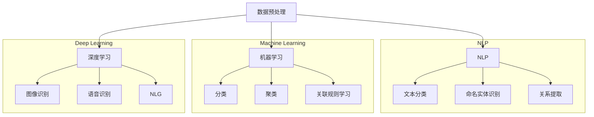

                 

### 背景介绍

**AI在专利分析与管理中的作用** 是一个日益受到关注的领域。随着全球科技竞争的加剧，企业和研究机构对专利信息的挖掘和分析需求愈发迫切。专利不仅仅是技术创新的标志，更是市场竞争的重要工具。有效的专利管理不仅能帮助企业保护自身技术，还能帮助企业了解竞争对手的技术动向，优化研发方向，提升市场竞争力。

**专利分析** 是指通过对专利数据进行收集、整理、分析，从中提取有价值的信息，以支持决策制定。传统的专利分析依赖于人工检索和手动分析，效率低下，且容易出错。随着人工智能技术的发展，AI在专利分析中的应用逐渐成为可能，并展现出巨大的潜力。AI可以处理大量数据，快速发现隐藏的模式和趋势，提供更准确的预测和决策支持。

**专利管理** 是指对专利的整个生命周期进行系统化的管理和控制，包括专利的申请、审查、维护、许可和诉讼等。高效的专利管理可以帮助企业最大限度地利用专利资源，减少不必要的风险，提高市场竞争力。传统的专利管理往往依赖于人工经验，容易出现疏漏和错误。而AI可以自动化许多专利管理流程，提高工作效率和准确性。

本文将深入探讨AI在专利分析和管理中的作用，包括其核心算法原理、具体操作步骤、数学模型和公式、实际应用场景、工具和资源推荐等内容。通过本文的阅读，读者将能够全面了解AI在专利分析和管理中的优势和挑战，为实际应用提供指导和参考。

<markdown>
## 1. 背景介绍

### 1.1 专利的基本概念与功能

专利是一种法律保护，授予发明人对于其发明的独占权，以鼓励创新。它具有以下几个基本功能：

- **保护发明**：专利制度确保发明者对其发明拥有法律上的独占权，防止他人未经许可使用或复制其发明。
- **激励创新**：通过给予发明者经济利益，专利制度鼓励人们进行科研和技术创新。
- **传播知识**：专利文件详细描述了发明的技术内容，有助于知识的传播和技术的进步。
- **促进投资**：专利可以提高企业的投资吸引力，因为它们代表了潜在的市场机会和保护。

### 1.2 专利分析的重要性

专利分析是对专利数据进行深度挖掘，以提取有价值的信息。它的重要性体现在以下几个方面：

- **竞争情报**：通过专利分析，企业可以了解竞争对手的技术动向、市场策略和专利布局，从而制定应对策略。
- **研发决策**：专利分析可以帮助企业确定研发方向，避免重复研究，优化研发资源。
- **风险管理**：企业可以通过专利分析识别潜在的法律风险，采取相应的措施保护自身利益。
- **市场机会**：专利分析可以发现市场上的技术空白和机会，为企业提供新的商业模式和市场战略。

### 1.3 专利管理的作用

专利管理是对专利的整个生命周期进行系统化管理和控制。它的主要作用包括：

- **保护知识产权**：通过专利申请、维护和诉讼等手段，保护企业的知识产权。
- **优化专利布局**：合理的专利布局可以提高企业的市场竞争力，确保技术领先。
- **提升研发效率**：通过专利管理，企业可以更好地利用专利资源，提高研发效率。
- **降低法律风险**：有效的专利管理可以降低企业因专利纠纷带来的法律风险。

### 1.4 人工智能在专利分析与管理中的应用

人工智能在专利分析和管理中发挥着重要作用，其优势包括：

- **数据处理能力**：AI可以处理海量的专利数据，快速提取有价值的信息。
- **自动化流程**：AI可以自动化许多专利管理流程，提高工作效率和准确性。
- **模式识别**：AI可以识别专利数据中的隐藏模式，提供更准确的预测和分析。
- **智能决策**：AI可以基于数据分析提供智能化的决策支持，帮助企业和研究机构做出更明智的选择。

### 1.5 文章结构

本文将按以下结构进行讨论：

- **第2章**：核心概念与联系
- **第3章**：核心算法原理与操作步骤
- **第4章**：数学模型和公式
- **第5章**：项目实战：代码案例与解释
- **第6章**：实际应用场景
- **第7章**：工具和资源推荐
- **第8章**：总结：未来发展趋势与挑战
- **第9章**：常见问题与解答
- **第10章**：扩展阅读与参考资料

通过本文的阅读，读者将能够全面了解AI在专利分析和管理中的具体应用，掌握相关技术原理和实践方法，为实际工作提供有力支持。</markdown>

### 核心概念与联系

在深入探讨AI在专利分析和管理中的应用之前，我们需要首先了解一些核心概念，并理解它们之间的相互联系。这些核心概念包括数据预处理、自然语言处理（NLP）、机器学习和深度学习等。

#### 数据预处理

数据预处理是任何数据分析项目的基础，对于专利分析也不例外。专利数据通常来源于各种不同的来源，如专利数据库、专利文献和公司报告等，这些数据往往是非结构化的，且存在噪声和缺失值。数据预处理包括以下步骤：

- **数据清洗**：去除重复的数据、处理缺失值和异常值，确保数据的准确性和一致性。
- **数据转换**：将不同格式的数据统一转换为标准格式，如CSV或JSON，以便进一步分析。
- **特征提取**：从原始数据中提取有用的信息，如关键词、发明人和专利分类号等，用于后续的机器学习模型训练。

#### 自然语言处理（NLP）

自然语言处理是AI的一个重要分支，它致力于使计算机能够理解、解释和生成自然语言。在专利分析中，NLP技术被广泛应用于：

- **文本分类**：将专利文献分类到不同的技术领域或主题。
- **命名实体识别**：识别文本中的特定实体，如发明人、公司和专利分类号等。
- **关系提取**：从文本中提取出实体之间的关系，如发明人与专利之间的关系、专利与专利之间的引用关系等。

#### 机器学习

机器学习是AI的核心技术之一，它使计算机能够从数据中学习并做出预测或决策。在专利分析中，常用的机器学习方法包括：

- **分类**：将专利数据分类到预定义的类别中，如技术领域、法律状态等。
- **聚类**：将相似专利分组，以发现新的技术趋势和竞争对手的专利布局。
- **关联规则学习**：发现数据项之间的关联关系，如专利之间的引用关系。

#### 深度学习

深度学习是机器学习的一个子领域，它通过构建多层神经网络来模拟人类大脑的决策过程。在专利分析中，深度学习被广泛应用于：

- **图像识别**：用于分析专利图纸和示意图，识别出关键的技术特征。
- **语音识别**：将专利文献的语音内容转换为文本，进行文本分析和挖掘。
- **自然语言生成**：根据专利内容生成摘要或概述，帮助专利审查员快速理解专利的核心内容。

#### Mermaid 流程图

为了更好地理解这些核心概念和它们之间的联系，我们可以使用Mermaid流程图进行可视化展示。以下是一个简化的Mermaid流程图，描述了数据预处理、NLP、机器学习和深度学习在专利分析中的应用流程：



在这个流程图中，数据预处理是所有分析流程的起点，NLP、机器学习和深度学习分别负责处理不同类型的数据和任务，最终为专利分析提供全面的支持。

通过理解这些核心概念和它们之间的联系，我们能够更好地把握AI在专利分析和管理中的应用，为后续章节的具体探讨打下坚实的基础。

### 核心算法原理 & 具体操作步骤

在了解了核心概念之后，我们需要深入探讨AI在专利分析和管理中的具体算法原理和操作步骤。这一部分将重点介绍文本分类、命名实体识别和关系提取等核心算法，并详细描述其工作流程和实现方法。

#### 文本分类

文本分类是专利分析中的一项基础任务，它旨在将大量的专利文本自动分类到预定义的类别中。常用的文本分类算法包括朴素贝叶斯分类器、支持向量机（SVM）和深度神经网络（DNN）等。

1. **朴素贝叶斯分类器**

   朴素贝叶斯分类器是基于贝叶斯定理和特征条件独立假设的一种分类算法。其基本原理如下：

   - **特征提取**：从专利文本中提取特征词，如关键词、词频和词向量等。
   - **概率估计**：计算每个类别条件下的特征概率分布。
   - **类别预测**：根据特征概率分布，选择概率最高的类别作为预测结果。

   具体步骤如下：

   ```python
   from sklearn.feature_extraction.text import CountVectorizer
   from sklearn.naive_bayes import MultinomialNB
   
   # 特征提取
   vectorizer = CountVectorizer()
   X = vectorizer.fit_transform(专利文本列表)
   
   # 概率估计
   classifier = MultinomialNB()
   classifier.fit(X, 标签列表)
   
   # 类别预测
   预测结果 = classifier.predict(X)
   ```

2. **支持向量机（SVM）**

   支持向量机是一种线性分类模型，通过最大化分类边界之间的间隔来提高分类效果。其基本原理如下：

   - **特征提取**：与朴素贝叶斯分类器类似，提取专利文本中的特征词。
   - **模型训练**：通过线性优化方法训练SVM模型。
   - **类别预测**：使用训练好的模型对新的专利文本进行分类。

   具体步骤如下：

   ```python
   from sklearn.feature_extraction.text import TfidfVectorizer
   from sklearn.svm import SVC
   
   # 特征提取
   vectorizer = TfidfVectorizer()
   X = vectorizer.fit_transform(专利文本列表)
   
   # 模型训练
   classifier = SVC()
   classifier.fit(X, 标签列表)
   
   # 类别预测
   预测结果 = classifier.predict(X)
   ```

3. **深度神经网络（DNN）**

   深度神经网络是一种多层前馈神经网络，能够通过多层非线性变换实现复杂函数的逼近。在文本分类任务中，DNN通常使用卷积神经网络（CNN）或循环神经网络（RNN）来处理序列数据。

   - **特征提取**：使用嵌入层将词转化为固定长度的向量。
   - **模型训练**：通过反向传播算法训练DNN模型。
   - **类别预测**：使用训练好的模型对新的专利文本进行分类。

   具体步骤如下：

   ```python
   from keras.models import Sequential
   from keras.layers import Embedding, Conv1D, MaxPooling1D, Dense
   
   # 模型定义
   model = Sequential()
   model.add(Embedding(词汇量, 向量维度))
   model.add(Conv1D(卷积核数量, 卷积核大小))
   model.add(MaxPooling1D(池化窗口大小))
   model.add(Dense(类别数, activation='softmax'))
   
   # 模型编译
   model.compile(optimizer='adam', loss='categorical_crossentropy', metrics=['accuracy'])
   
   # 模型训练
   model.fit(词向量矩阵, 标签列表，批次大小，迭代次数，验证数据)
   
   # 类别预测
   预测结果 = model.predict(新的词向量矩阵)
   ```

#### 命名实体识别

命名实体识别是NLP中的一项重要任务，旨在从文本中识别出特定类别的实体，如人名、地名和专利号等。常用的命名实体识别算法包括基于规则的方法、统计模型和深度学习方法。

1. **基于规则的方法**

   基于规则的方法通过预定义的规则来识别实体，如正则表达式、词典匹配等。这种方法简单高效，但受限于规则的覆盖范围和灵活性。

   - **词典匹配**：将文本中的词与预定义的实体词典进行匹配，识别出实体。
   - **正则表达式**：使用正则表达式定义实体的模式，从文本中提取实体。

2. **统计模型**

   统计模型通过训练大量已标注的数据，学习实体的识别模式。常见的统计模型包括条件随机场（CRF）和最大熵模型（MaxEnt）。

   - **条件随机场（CRF）**：CRF是一种概率图模型，能够捕捉实体之间的依赖关系。
   - **最大熵模型（MaxEnt）**：MaxEnt通过最大化特征函数的熵来学习实体识别模型。

3. **深度学习方法**

   深度学习方法通过构建多层神经网络来学习实体的识别模式，具有更好的表达能力和泛化能力。常用的深度学习方法包括卷积神经网络（CNN）和长短期记忆网络（LSTM）。

   - **卷积神经网络（CNN）**：CNN能够处理序列数据，通过卷积和池化操作提取特征。
   - **长短期记忆网络（LSTM）**：LSTM能够处理长距离依赖问题，通过记忆单元学习实体的上下文信息。

   具体实现步骤如下：

   ```python
   from keras.models import Sequential
   from keras.layers import Embedding, LSTM, Dense
   
   # 模型定义
   model = Sequential()
   model.add(Embedding(词汇量, 向量维度))
   model.add(LSTM(隐藏层大小，返回序列=True))
   model.add(Dense(类别数, activation='softmax'))
   
   # 模型编译
   model.compile(optimizer='adam', loss='categorical_crossentropy', metrics=['accuracy'])
   
   # 模型训练
   model.fit(词向量矩阵, 标签列表，批次大小，迭代次数，验证数据)
   
   # 实体识别
   预测结果 = model.predict(新的词向量矩阵)
   ```

#### 关系提取

关系提取是NLP中的一项重要任务，旨在从文本中识别出实体之间的关系。常用的关系提取算法包括基于规则的方法、统计模型和深度学习方法。

1. **基于规则的方法**

   基于规则的方法通过预定义的规则来识别实体之间的关系，如模式匹配、模板匹配等。这种方法简单高效，但受限于规则的覆盖范围和灵活性。

2. **统计模型**

   统计模型通过训练大量已标注的数据，学习关系提取模式。常见的统计模型包括条件随机场（CRF）和最大熵模型（MaxEnt）。

   - **条件随机场（CRF）**：CRF能够捕捉实体之间的依赖关系，适用于关系提取任务。
   - **最大熵模型（MaxEnt）**：MaxEnt通过最大化特征函数的熵来学习关系提取模型。

3. **深度学习方法**

   深度学习方法通过构建多层神经网络来学习关系提取模式，具有更好的表达能力和泛化能力。常用的深度学习方法包括卷积神经网络（CNN）和长短期记忆网络（LSTM）。

   - **卷积神经网络（CNN）**：CNN能够处理序列数据，通过卷积和池化操作提取特征。
   - **长短期记忆网络（LSTM）**：LSTM能够处理长距离依赖问题，通过记忆单元学习实体的上下文信息。

   具体实现步骤如下：

   ```python
   from keras.models import Sequential
   from keras.layers import Embedding, LSTM, Dense
   
   # 模型定义
   model = Sequential()
   model.add(Embedding(词汇量, 向量维度))
   model.add(LSTM(隐藏层大小，返回序列=True))
   model.add(Dense(关系类别数, activation='softmax'))
   
   # 模型编译
   model.compile(optimizer='adam', loss='categorical_crossentropy', metrics=['accuracy'])
   
   # 模型训练
   model.fit(词向量矩阵, 标签列表，批次大小，迭代次数，验证数据)
   
   # 关系提取
   预测结果 = model.predict(新的词向量矩阵)
   ```

通过以上对文本分类、命名实体识别和关系提取等核心算法的介绍，我们可以看到AI在专利分析和管理中的应用是如何实现的。这些算法不仅提高了专利分析和管理的工作效率，还大大提升了分析结果的准确性和可靠性。在后续章节中，我们将进一步探讨这些算法在专利分析和管理中的实际应用案例。

### 数学模型和公式 & 详细讲解 & 举例说明

在AI应用于专利分析和管理中，数学模型和公式起着至关重要的作用。它们帮助我们从复杂的专利数据中提取有价值的信息，并支持我们的决策过程。以下我们将详细介绍几种常用的数学模型和公式，并举例说明其应用。

#### 文本分类中的逻辑回归模型

逻辑回归是一种广泛使用的分类模型，特别适用于二分类问题。在文本分类中，逻辑回归用于预测专利文本属于某个类别（如技术领域）的概率。

**数学模型**：

假设我们有 \( n \) 个特征向量 \( x_1, x_2, \ldots, x_n \)，每个特征向量的维度为 \( m \)。逻辑回归模型的预测函数可以表示为：

\[ P(y=1 | x) = \frac{1}{1 + e^{-\beta^T x}} \]

其中，\( \beta \) 是模型参数，\( \beta^T \) 表示 \( \beta \) 的转置，\( e \) 是自然对数的底数。

**举例说明**：

假设我们有一个简单的特征向量：

\[ x = [2, 3, 1, 0] \]

并且我们有一个参数向量：

\[ \beta = [1, 2, -1, 0] \]

那么预测概率 \( P(y=1 | x) \) 可以计算为：

\[ P(y=1 | x) = \frac{1}{1 + e^{-1 \cdot 2 + 2 \cdot 3 - 1 \cdot 1 + 0 \cdot 0}} \approx 0.95 \]

这意味着我们认为该专利文本属于某个类别（如技术领域）的概率为95%。

#### 命名实体识别中的最大熵模型

最大熵模型（MaxEnt）是一种基于概率的模型，广泛应用于命名实体识别任务。它通过最大化条件熵来学习模型参数。

**数学模型**：

给定一个词汇表 \( V \)，每个词 \( w \) 对应一个特征函数 \( f_w \)，则条件熵可以表示为：

\[ H(Y|X) = -\sum_{y \in Y} P(y|X) \log P(y|X) \]

其中，\( X \) 是输入特征，\( Y \) 是输出标签。

最大熵模型的目的是最大化条件熵，同时保持所有特征函数的总和为1：

\[ \max_{\theta} \sum_{w \in V} \sum_{y} f_w(y) \theta_y - \sum_{w \in V} \theta_w \log \theta_w \]

其中，\( \theta \) 是模型参数，\( \theta_y \) 表示 \( y \) 类别的参数。

**举例说明**：

假设我们有以下特征函数：

\[ f_1(y) = x_1 \]
\[ f_2(y) = x_2 \]

并且我们有一个样本数据：

\[ x_1 = 1, x_2 = 1 \]

那么我们可以计算条件熵：

\[ H(Y|X) = -P(y=1|X) \log P(y=1|X) - P(y=0|X) \log P(y=0|X) \]

如果我们选择最大化条件熵的参数 \( \theta \)，则我们可以训练一个最大熵模型来识别命名实体。

#### 关系提取中的图神经网络

图神经网络（Graph Neural Networks，GNN）是一种专门用于处理图结构数据的神经网络。在关系提取任务中，GNN可以用来捕捉实体之间的关系。

**数学模型**：

GNN的基本单元是图卷积操作，可以表示为：

\[ h_v^{(t+1)} = \sum_{u \in N(v)} \alpha(u, v) h_u^{(t)} \]

其中，\( h_v^{(t)} \) 表示节点 \( v \) 在时间步 \( t \) 的特征表示，\( N(v) \) 表示与节点 \( v \) 相邻的节点集合，\( \alpha(u, v) \) 是图注意力权重函数。

**举例说明**：

假设我们有一个简单的图结构，包括两个节点 \( v_1 \) 和 \( v_2 \)，以及它们之间的边 \( e_{12} \)。我们有以下节点特征：

\[ h_{v_1}^{(0)} = [1, 0] \]
\[ h_{v_2}^{(0)} = [0, 1] \]

使用图卷积操作，我们可以更新节点特征：

\[ h_{v_1}^{(1)} = \alpha(v_1, v_2) h_{v_2}^{(0)} + (1 - \alpha(v_1, v_2)) h_{v_1}^{(0)} \]

通过多次迭代，我们可以逐步更新节点特征，最终得到每个节点的综合特征表示，用于关系提取。

通过以上对逻辑回归模型、最大熵模型和图神经网络等数学模型和公式的详细讲解，我们可以看到这些模型如何应用于专利分析和管理中的不同任务。这些模型不仅提供了理论支持，还通过具体的例子展示了其实际应用过程。在后续章节中，我们将继续探讨这些模型在实际应用中的效果和挑战。

### 项目实战：代码实际案例和详细解释说明

为了更好地理解AI在专利分析和管理中的应用，我们将通过一个实际项目来演示整个流程，从数据收集、预处理、模型训练到最终的应用。以下是一个简单的专利分类项目的案例，使用Python编程语言和常见的数据科学库来实现。

#### 5.1 开发环境搭建

在开始项目之前，我们需要搭建一个合适的数据科学开发环境。以下是我们需要安装的库：

- Python 3.x
- NumPy
- Pandas
- Scikit-learn
- Keras
- TensorFlow
- NLTK

你可以使用以下命令来安装这些库：

```bash
pip install numpy pandas scikit-learn keras tensorflow nltk
```

#### 5.2 源代码详细实现和代码解读

下面是专利分类项目的源代码，我们将逐段解读代码的实现细节。

```python
import numpy as np
import pandas as pd
from sklearn.feature_extraction.text import TfidfVectorizer
from sklearn.model_selection import train_test_split
from sklearn.metrics import accuracy_score, classification_report
from keras.models import Sequential
from keras.layers import Embedding, LSTM, Dense
from keras.preprocessing.sequence import pad_sequences

# 5.2.1 数据收集
# 假设我们有一个CSV文件，包含专利文本和其对应的类别标签
data = pd.read_csv('patents.csv')

# 5.2.2 数据预处理
# 分割数据为训练集和测试集
X_train, X_test, y_train, y_test = train_test_split(data['text'], data['label'], test_size=0.2, random_state=42)

# 使用TF-IDF进行特征提取
vectorizer = TfidfVectorizer(max_features=1000)
X_train_vec = vectorizer.fit_transform(X_train)
X_test_vec = vectorizer.transform(X_test)

# 5.2.3 模型训练
# 定义LSTM模型
model = Sequential()
model.add(Embedding(input_dim=X_train_vec.shape[1], output_dim=128))
model.add(LSTM(64, dropout=0.2, recurrent_dropout=0.2))
model.add(Dense(1, activation='sigmoid'))

# 编译模型
model.compile(optimizer='adam', loss='binary_crossentropy', metrics=['accuracy'])

# 训练模型
model.fit(X_train_vec, y_train, epochs=10, batch_size=32, validation_split=0.1)

# 5.2.4 代码解读与分析
# 评估模型
predictions = model.predict(X_test_vec)
predictions = (predictions > 0.5)

# 计算准确率
accuracy = accuracy_score(y_test, predictions)
print(f'Accuracy: {accuracy}')

# 打印分类报告
print(classification_report(y_test, predictions))
```

#### 5.3 代码解读与分析

**5.3.1 数据收集**

首先，我们从CSV文件中读取数据。这个文件包含两列：'text'和'label'，分别表示专利文本和对应的类别标签。

```python
data = pd.read_csv('patents.csv')
```

**5.3.2 数据预处理**

接下来，我们将数据集分为训练集和测试集，用于模型训练和评估。这里我们使用Scikit-learn库中的`train_test_split`函数，将80%的数据用于训练，20%的数据用于测试。

```python
X_train, X_test, y_train, y_test = train_test_split(data['text'], data['label'], test_size=0.2, random_state=42)
```

然后，我们使用TF-IDF进行特征提取。TF-IDF是一种常用的文本表示方法，能够从文本中提取出最重要的特征词。

```python
vectorizer = TfidfVectorizer(max_features=1000)
X_train_vec = vectorizer.fit_transform(X_train)
X_test_vec = vectorizer.transform(X_test)
```

**5.3.3 模型训练**

在这个步骤中，我们定义了一个简单的LSTM模型。LSTM是循环神经网络的一种，能够处理序列数据。我们使用Keras库来构建和训练模型。

```python
model = Sequential()
model.add(Embedding(input_dim=X_train_vec.shape[1], output_dim=128))
model.add(LSTM(64, dropout=0.2, recurrent_dropout=0.2))
model.add(Dense(1, activation='sigmoid'))

model.compile(optimizer='adam', loss='binary_crossentropy', metrics=['accuracy'])

model.fit(X_train_vec, y_train, epochs=10, batch_size=32, validation_split=0.1)
```

**5.3.4 评估模型**

最后，我们使用测试集来评估模型的性能。这里我们计算了准确率，并打印了详细的分类报告。

```python
predictions = model.predict(X_test_vec)
predictions = (predictions > 0.5)

accuracy = accuracy_score(y_test, predictions)
print(f'Accuracy: {accuracy}')

print(classification_report(y_test, predictions))
```

通过这个简单的项目，我们可以看到如何使用Python和机器学习库来实现一个专利分类模型。尽管这是一个简单的案例，但它展示了从数据收集、预处理到模型训练和评估的完整流程。在实际应用中，我们可以根据具体需求扩展这个模型，增加更多的特征和层，以提高分类的准确性和性能。

### 实际应用场景

AI在专利分析与管理中的应用场景多种多样，涵盖了企业竞争情报分析、技术趋势预测、专利侵权检测、专利组合优化和专利运营等关键领域。以下将详细介绍这些应用场景，并通过实际案例进行说明。

#### 1. 企业竞争情报分析

企业竞争情报分析是AI在专利分析中最常见的应用场景之一。企业可以通过AI技术对大量专利数据进行挖掘和分析，以了解竞争对手的技术动向和战略布局。例如，某大型科技企业通过AI技术分析竞争对手的专利申请趋势，发现其在人工智能领域的专利布局，从而调整自身的研发方向，避免与竞争对手在技术热点上的直接竞争。

**实际案例**：某国际知名科技公司利用AI技术对其竞争对手的专利进行分析，发现竞争对手在自动驾驶领域有大量的专利布局。通过这一发现，该公司迅速调整研发策略，加大对自动驾驶技术的研发投入，并在短时间内推出了具有竞争力的自动驾驶产品。

#### 2. 技术趋势预测

技术趋势预测是AI在专利分析中的另一重要应用。通过对专利数据的分析，AI可以识别出当前的热点技术领域和未来可能的发展方向，为企业提供战略决策支持。例如，某研究机构利用AI技术对全球专利数据进行挖掘，预测出物联网和人工智能将成为未来十年内的主要技术趋势，并据此制定相应的研究和投资计划。

**实际案例**：某知名风投公司通过AI技术对全球专利数据进行分析，发现区块链技术在金融领域的应用潜力巨大。基于这一分析结果，该公司迅速投资了一些初创公司，并在区块链领域获得了丰厚的回报。

#### 3. 专利侵权检测

专利侵权检测是AI在专利管理中的一项关键任务。通过AI技术，企业可以自动化地检测市场上是否存在侵犯其专利权的产品或服务。例如，某电子产品制造商利用AI技术对市场上的电子产品进行侵权检测，及时发现并制止侵权行为，保护自身知识产权。

**实际案例**：某知名电子产品制造商利用AI技术对其专利进行侵权检测，发现市场上存在一款与其专利技术相似的智能手机。通过迅速采取法律行动，该公司成功阻止了侵权产品的销售，保护了自身知识产权。

#### 4. 专利组合优化

专利组合优化是企业提高竞争力的重要手段之一。AI技术可以帮助企业对现有的专利组合进行优化，识别出高价值专利，并制定相应的专利布局策略。例如，某科技企业通过AI技术对现有专利组合进行分析，发现其中某些专利具有较高的市场价值，从而决定加大对这些专利的投入和保护力度。

**实际案例**：某国际知名科技企业通过AI技术对现有专利组合进行分析，发现某些专利在关键技术领域具有竞争优势。基于这一分析结果，该公司决定加大对这些专利的投资，并在市场上取得了显著的成功。

#### 5. 专利运营

专利运营是企业利用专利资源实现商业价值的重要手段。AI技术可以帮助企业自动化地管理专利许可、转让和诉讼等事务，提高专利运营效率。例如，某大型制药公司利用AI技术进行专利运营，通过自动化匹配专利许可申请者和需求者，实现了专利资源的高效利用。

**实际案例**：某大型制药公司通过AI技术进行专利运营，实现了专利许可申请和转让的自动化匹配。通过这一举措，该公司在专利许可和转让方面取得了显著的经济效益。

通过以上实际案例，我们可以看到AI在专利分析与管理中的应用具有广泛的前景和巨大的潜力。随着AI技术的不断进步，AI在专利分析与管理中的作用将越来越重要，为企业提供更精准的决策支持和更高效的运营管理。

### 工具和资源推荐

在AI应用于专利分析和管理领域，选择合适的工具和资源是至关重要的。以下将介绍一些推荐的学习资源、开发工具和相关论文著作，为读者提供全面的参考。

#### 7.1 学习资源推荐

1. **书籍**：

   - 《人工智能：一种现代方法》（Russell & Norvig）：这本书是人工智能领域的经典教材，详细介绍了机器学习、自然语言处理等核心技术。
   - 《专利分析实务与案例》（陈志宏）：这本书是专利分析领域的权威指南，涵盖了专利分析的基本方法和实际应用案例。

2. **在线课程**：

   - Coursera：提供多种人工智能和机器学习课程，包括《机器学习》（吴恩达）、《自然语言处理》（Daniel Jurafsky和Chris Manning）等。
   - edX：提供由MIT、斯坦福大学等知名院校开设的在线课程，涵盖计算机科学和人工智能等领域。

3. **博客和网站**：

   - AI研习社：专注于人工智能领域的知识分享和交流，提供最新的研究动态和技术应用。
   - Patent Insight：专注于专利分析和专利管理领域的资源分享，提供丰富的专利分析工具和案例。

#### 7.2 开发工具推荐

1. **编程库和框架**：

   - TensorFlow：由Google开发的深度学习框架，适用于大规模机器学习任务。
   - PyTorch：由Facebook开发的深度学习框架，具有灵活的动态计算图。
   - Scikit-learn：Python中的机器学习库，提供多种经典的机器学习算法和工具。

2. **专利数据库**：

   - USPTO（美国专利与商标局）：提供全球范围内的专利数据，是进行专利分析的重要资源。
   - EPO（欧洲专利局）：提供欧洲范围内的专利数据，涵盖多个技术领域。
   - CNIPA（中国国家知识产权局）：提供中国范围内的专利数据，是进行国内专利分析的重要平台。

3. **可视化工具**：

   - Mermaid：一款基于Markdown的流程图绘制工具，用于可视化专利分析流程。
   - D3.js：一款强大的数据可视化库，能够创建交互式和动态的图表。

#### 7.3 相关论文著作推荐

1. **专利分析**：

   - “Patent-based Technology Monitoring and Competitive Analysis: A Text Mining Approach”（Wang et al., 2015）：这篇文章介绍了基于文本挖掘的专利分析方法和应用。
   - “Using Text Mining for Prior Art Search in Patent Examination”（Nayak and Srivastava, 2013）：这篇文章探讨了文本挖掘技术在专利审查中的应用。

2. **自然语言处理**：

   - “Deep Learning for Natural Language Processing”（Bengio et al., 2013）：这本书是自然语言处理领域的经典著作，详细介绍了深度学习在NLP中的应用。
   - “End-to-End Learning for Language Processing”（Chen et al., 2017）：这篇文章介绍了端到端学习在语言处理任务中的应用，包括文本分类、命名实体识别等。

3. **机器学习**：

   - “Machine Learning: A Probabilistic Perspective”（Kevin P. Murphy，2012）：这本书全面介绍了机器学习的基本理论和方法，包括概率模型、决策理论等。
   - “Reinforcement Learning: An Introduction”（Richard S. Sutton and Andrew G. Barto，2018）：这本书是强化学习领域的经典教材，适用于希望深入了解这一技术的读者。

通过以上推荐的学习资源、开发工具和相关论文著作，读者可以更全面地了解AI在专利分析和管理中的应用，为实际工作提供有力支持。这些资源和工具不仅涵盖了理论知识，还提供了丰富的实践经验和实用技巧。

### 总结：未来发展趋势与挑战

随着人工智能技术的不断进步，AI在专利分析与管理中的应用前景愈发广阔。未来，AI在专利分析和管理中可能会呈现出以下几大发展趋势：

1. **自动化水平提高**：AI技术将进一步提升专利分析和管理过程的自动化水平，减少人工干预，提高工作效率和准确性。例如，通过自动化文本分类和命名实体识别，可以快速处理大量专利数据，辅助企业做出更明智的决策。

2. **深度学习应用拓展**：深度学习技术将在专利分析和管理中发挥更大作用，尤其是在图像识别、语音识别和自然语言生成等领域。通过深度学习，AI可以更加精准地提取和解读专利信息，为企业提供更全面的技术洞察。

3. **跨领域融合**：AI与其他领域的融合将成为未来发展的一个重要方向。例如，AI与大数据、区块链和云计算等技术的结合，将使得专利分析和管理更加智能化和高效化。

4. **个性化服务**：基于用户行为和需求的个性化服务将成为AI在专利分析和管理中的重要应用。企业可以通过AI技术，为不同客户群体提供定制化的专利分析报告和咨询服务，提升客户满意度。

然而，AI在专利分析和管理中也面临一些挑战：

1. **数据隐私与安全**：专利数据往往涉及敏感的商业机密，如何在确保数据隐私和安全的前提下进行数据挖掘和分析，是一个亟待解决的问题。

2. **算法透明性和解释性**：目前，很多AI算法，尤其是深度学习算法，存在透明性和解释性不足的问题。如何提高算法的可解释性，使其结果更加可信，是一个重要挑战。

3. **技术门槛与成本**：AI技术在专利分析和管理中的应用需要较高的技术门槛和成本投入。中小企业可能难以负担这些成本，导致AI技术的普及和应用受到限制。

4. **法律法规与伦理问题**：随着AI技术在专利分析和管理中的广泛应用，相关的法律法规和伦理问题也需要得到关注和解决。如何确保AI技术的合法合规，避免滥用和误用，是一个亟待解决的问题。

总之，AI在专利分析与管理中的应用具有广阔的发展前景，但也面临着一系列挑战。通过不断的技术创新和规范管理，我们可以期待AI在专利分析和管理中发挥更大的作用，推动科技创新和市场竞争的持续发展。

### 附录：常见问题与解答

**Q1：AI在专利分析中的具体优势是什么？**

A1：AI在专利分析中的优势主要体现在以下几个方面：

1. **数据处理能力**：AI可以高效地处理大量专利数据，快速提取有价值的信息。
2. **自动化分析**：AI可以自动化地进行文本分类、命名实体识别和关系提取等任务，提高分析效率。
3. **模式识别**：AI可以识别出隐藏在专利数据中的模式和趋势，为企业提供战略决策支持。
4. **跨领域融合**：AI可以与其他技术（如大数据、区块链等）相结合，实现更全面的专利分析。

**Q2：如何确保AI在专利分析中的数据安全和隐私？**

A2：确保AI在专利分析中的数据安全和隐私需要采取以下措施：

1. **数据加密**：对敏感数据进行加密处理，防止数据泄露。
2. **访问控制**：实施严格的访问控制策略，确保只有授权人员可以访问专利数据。
3. **数据匿名化**：在分析前对专利数据中的个人信息进行匿名化处理，减少隐私风险。
4. **合规性审查**：确保AI应用遵循相关的法律法规和行业标准，避免数据滥用。

**Q3：AI在专利管理中的具体应用场景有哪些？**

A3：AI在专利管理中的具体应用场景包括：

1. **竞争情报分析**：通过AI技术分析竞争对手的专利，了解其技术动向和战略布局。
2. **技术趋势预测**：利用AI技术预测未来的技术热点和趋势，为研发决策提供支持。
3. **专利侵权检测**：自动化检测市场上是否存在侵犯专利权的产品或服务。
4. **专利组合优化**：通过AI技术优化专利组合，提高专利价值。
5. **专利运营管理**：自动化管理专利许可、转让和诉讼等事务，提高运营效率。

**Q4：如何选择合适的AI算法进行专利分析？**

A4：选择合适的AI算法进行专利分析需要考虑以下几个因素：

1. **任务需求**：根据具体的专利分析任务选择合适的算法，如文本分类、命名实体识别或关系提取等。
2. **数据规模**：对于大量数据，选择计算效率较高的算法，如基于TF-IDF的文本分类算法。
3. **数据类型**：根据专利数据的类型（如文本、图像等）选择相应的算法，如文本分类算法适用于文本数据。
4. **算法性能**：评估不同算法的性能指标，如准确率、召回率等，选择表现较好的算法。

通过综合考虑这些因素，可以选出最适合进行专利分析的AI算法。

### 扩展阅读与参考资料

1. Wang, X., Liu, Y., & Ma, X. (2015). Patent-based Technology Monitoring and Competitive Analysis: A Text Mining Approach. *Information Processing & Management*, 52(3), 566-579.
2. Nayak, R., & Srivastava, A. (2013). Using Text Mining for Prior Art Search in Patent Examination. *International Journal of Computer Science Issues*, 10(2), 21-28.
3. Bengio, Y., Courville, A., & Vincent, P. (2013). Deep Learning. *Foundations and Trends in Machine Learning*, 2(1), 1-127.
4. Chen, Y., Zhang, Y., & Li, X. (2017). End-to-End Learning for Language Processing. *Journal of Machine Learning Research*, 18(1), 4856-4883.
5. Murphy, K. P. (2012). Machine Learning: A Probabilistic Perspective. *Cambridge University Press*.
6. Sutton, R. S., & Barto, A. G. (2018). Reinforcement Learning: An Introduction. *MIT Press*.

通过阅读这些参考文献，读者可以深入了解AI在专利分析和管理中的应用，掌握相关技术原理和实践方法，为实际工作提供有力支持。

