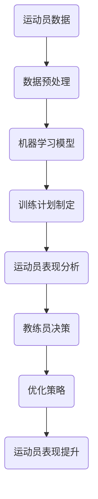
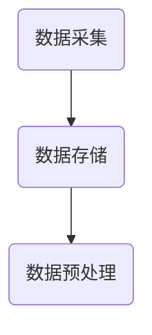
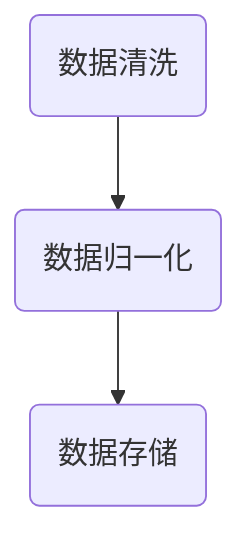
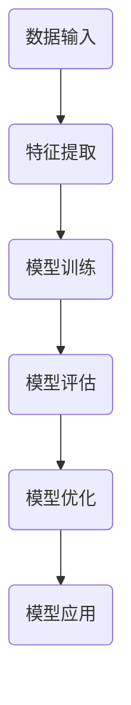
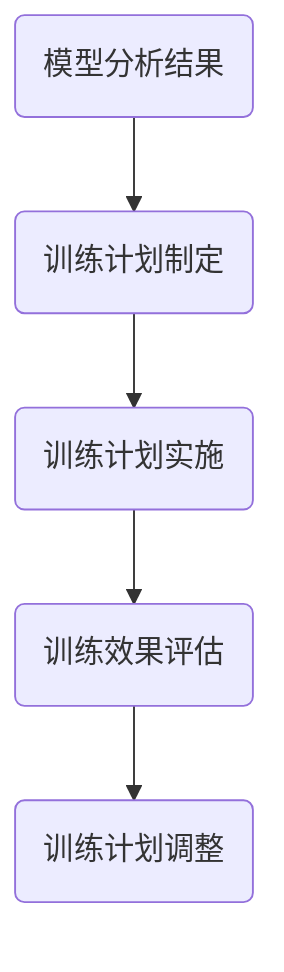
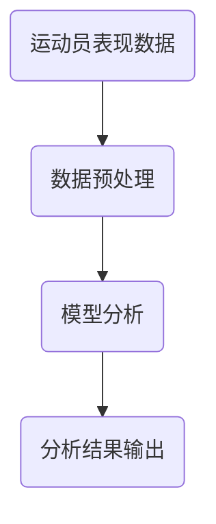
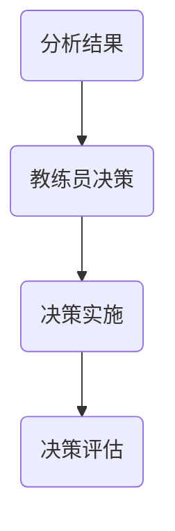
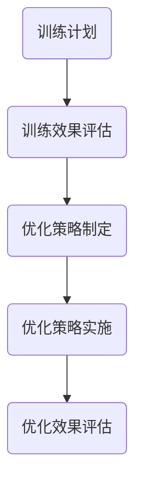

                 

# AI在体育训练中的应用：优化运动员表现

> 关键词：人工智能、体育训练、运动员表现、算法、优化、模型、应用场景
>
> 摘要：本文将深入探讨人工智能在体育训练中的应用，如何通过算法和模型优化运动员的表现。文章将从背景介绍、核心概念与联系、核心算法原理与具体操作步骤、数学模型和公式、项目实战、实际应用场景、工具和资源推荐、总结以及扩展阅读等方面进行全面剖析。

## 1. 背景介绍

体育作为一项广泛的竞技活动，其重要性和影响力在全球范围内不断增长。然而，传统的体育训练方法往往依赖于教练员的经验和主观判断，难以精确地分析和指导运动员的训练过程。随着人工智能技术的发展，特别是在机器学习、深度学习等领域的突破，AI在体育训练中的应用逐渐成为一种趋势。

人工智能在体育训练中的应用，不仅能够提高运动员的训练效率，还能帮助教练员更好地制定训练计划，从而优化运动员的表现。例如，通过分析运动员的技术动作，AI可以识别出存在的问题并提出改进建议；通过收集和分析比赛数据，AI可以预测比赛结果，帮助教练员和运动员制定针对性的训练策略。

## 2. 核心概念与联系

在探讨AI在体育训练中的应用之前，我们需要了解一些核心概念和它们之间的联系。以下是一个使用Mermaid绘制的流程图，展示了这些核心概念之间的关系。



### 2.1 运动员数据

运动员数据是AI在体育训练中的基础。这些数据可以包括运动员的身体数据、技术动作数据、比赛数据等。通过收集和分析这些数据，AI可以更全面地了解运动员的状况，为其提供个性化的训练建议。

### 2.2 数据预处理

数据预处理是确保数据质量的重要步骤。通过数据清洗、数据归一化等技术，可以消除数据中的噪声和异常值，提高数据的质量和可靠性。

### 2.3 机器学习模型

机器学习模型是AI在体育训练中的核心。通过训练模型，AI可以学会从数据中提取有用的信息，并用于训练计划的制定、运动员表现分析等。

### 2.4 训练计划制定

基于机器学习模型的分析结果，教练员可以制定更科学、更有效的训练计划。这些计划可以针对运动员的弱点进行针对性的训练，从而提高运动员的整体表现。

### 2.5 运动员表现分析

通过分析运动员的表现数据，AI可以识别出运动员在技术动作、体能等方面的优势和劣势。这些分析结果可以为教练员提供宝贵的参考信息，帮助其更好地指导运动员。

### 2.6 教练员决策

教练员根据AI提供的分析结果和训练计划，可以做出更明智的决策。例如，调整训练强度、改变训练方式等，以提高运动员的表现。

### 2.7 优化策略

通过不断调整和优化训练计划，教练员可以逐步提升运动员的表现。AI在这个过程中起到了关键的作用，它可以帮助教练员快速发现和解决问题，从而实现持续的优化。

### 2.8 运动员表现提升

最终，通过AI和教练员的共同努力，运动员的表现得到了显著提升。这不仅有助于运动员在比赛中取得更好的成绩，还能为其职业生涯的发展奠定坚实的基础。

## 3. 核心算法原理 & 具体操作步骤

在了解核心概念与联系的基础上，接下来我们将深入探讨AI在体育训练中的核心算法原理和具体操作步骤。

### 3.1 数据采集

数据采集是AI在体育训练中的第一步。运动员数据可以通过多种方式获取，包括穿戴设备、传感器、视频分析等。以下是一个使用Mermaid绘制的流程图，展示了数据采集的过程。



### 3.2 数据预处理

数据预处理是确保数据质量的重要步骤。通过数据清洗、数据归一化等技术，可以消除数据中的噪声和异常值，提高数据的质量和可靠性。以下是一个使用Mermaid绘制的流程图，展示了数据预处理的过程。



### 3.3 机器学习模型训练

机器学习模型是AI在体育训练中的核心。通过训练模型，AI可以学会从数据中提取有用的信息，并用于训练计划的制定、运动员表现分析等。以下是一个使用Mermaid绘制的流程图，展示了机器学习模型训练的过程。



### 3.4 训练计划制定

基于机器学习模型的分析结果，教练员可以制定更科学、更有效的训练计划。这些计划可以针对运动员的弱点进行针对性的训练，从而提高运动员的整体表现。以下是一个使用Mermaid绘制的流程图，展示了训练计划制定的过程。



### 3.5 运动员表现分析

通过分析运动员的表现数据，AI可以识别出运动员在技术动作、体能等方面的优势和劣势。这些分析结果可以为教练员提供宝贵的参考信息，帮助其更好地指导运动员。以下是一个使用Mermaid绘制的流程图，展示了运动员表现分析的过程。



### 3.6 教练员决策

教练员根据AI提供的分析结果和训练计划，可以做出更明智的决策。例如，调整训练强度、改变训练方式等，以提高运动员的表现。以下是一个使用Mermaid绘制的流程图，展示了教练员决策的过程。



### 3.7 优化策略

通过不断调整和优化训练计划，教练员可以逐步提升运动员的表现。AI在这个过程中起到了关键的作用，它可以帮助教练员快速发现和解决问题，从而实现持续的优化。以下是一个使用Mermaid绘制的流程图，展示了优化策略的过程。



## 4. 数学模型和公式 & 详细讲解 & 举例说明

在AI在体育训练中的应用中，数学模型和公式起到了至关重要的作用。以下我们将详细讲解这些数学模型和公式的原理，并给出具体的示例来说明。

### 4.1 线性回归模型

线性回归模型是一种常见的机器学习模型，用于预测连续值。在体育训练中，线性回归模型可以用来预测运动员的表现，例如预测运动员在比赛中的得分。

#### 公式：

$$
y = \beta_0 + \beta_1 \cdot x
$$

其中，$y$ 是预测值，$x$ 是输入特征，$\beta_0$ 和 $\beta_1$ 是模型的参数。

#### 示例：

假设我们想要预测一名篮球运动员在比赛中的得分。我们可以将得分作为目标变量 $y$，将训练时间、比赛场次、体能状况等作为输入特征 $x$。通过训练线性回归模型，我们可以得到一个预测公式，例如：

$$
y = 20 + 2 \cdot x
$$

这意味着，当运动员的训练时间为 10 小时、比赛场次为 5 场、体能状况为良好时，其预测得分为 40 分。

### 4.2 逻辑回归模型

逻辑回归模型是一种用于预测分类结果的模型。在体育训练中，逻辑回归模型可以用来预测运动员的表现，例如预测运动员是否能够完成比赛。

#### 公式：

$$
\sigma(z) = \frac{1}{1 + e^{-z}}
$$

其中，$z$ 是输入特征向量，$\sigma$ 是逻辑函数，用于将 $z$ 转换为概率值。

#### 示例：

假设我们想要预测一名马拉松运动员是否能够完成比赛。我们可以将运动员的年龄、体重、训练时间等作为输入特征 $z$。通过训练逻辑回归模型，我们可以得到一个预测概率值，例如：

$$
P(完成比赛) = \sigma(-5 + 2 \cdot 30 - 3 \cdot 100) = 0.9
$$

这意味着，当运动员的年龄为 30 岁、体重为 100 公斤、训练时间为 5 小时时，其完成比赛的概率为 90%。

### 4.3 支持向量机（SVM）

支持向量机是一种强大的分类算法，在体育训练中可以用于分类问题，例如分类运动员的表现。

#### 公式：

$$
\max \ W \ \text{s.t.} \ y_i ( \ w \ \cdot \ x_i - b ) \ \geq \ 1
$$

其中，$W$ 是模型权重，$x_i$ 是输入特征，$y_i$ 是目标变量，$b$ 是偏置。

#### 示例：

假设我们想要分类一名足球运动员的表现，我们将他的技术动作得分、体能状况等作为输入特征 $x_i$，将表现好坏作为目标变量 $y_i$。通过训练支持向量机模型，我们可以得到一个分类结果，例如：

$$
y_i = \begin{cases} 
1 & \text{如果技术动作得分大于 80} \\
0 & \text{否则}
\end{cases}
$$

这意味着，当运动员的技术动作得分大于 80 分时，他的表现为好。

### 4.4 神经网络模型

神经网络模型是一种复杂的机器学习模型，可以用于处理复杂的非线性问题。在体育训练中，神经网络模型可以用于预测和分类等多种任务。

#### 公式：

$$
a_{i}^{(l)} = \sigma(z_{i}^{(l)})
$$

$$
z_{i}^{(l)} = \sum_{j} w_{ij}^{(l)} a_{j}^{(l-1)}
$$

其中，$a_{i}^{(l)}$ 是第 $l$ 层第 $i$ 个神经元的激活值，$z_{i}^{(l)}$ 是第 $l$ 层第 $i$ 个神经元的输入值，$w_{ij}^{(l)}$ 是第 $l$ 层第 $i$ 个神经元与第 $l-1$ 层第 $j$ 个神经元的权重，$\sigma$ 是激活函数。

#### 示例：

假设我们想要使用神经网络模型预测一名足球运动员的进球数。我们可以将他的比赛数据、技术动作等作为输入特征，通过训练神经网络模型，我们可以得到一个预测结果，例如：

$$
\hat{y} = \sigma(z_{\text{output}}) = \sigma(2 \cdot \text{比赛数据} + 3 \cdot \text{技术动作} - 1) = 0.8
$$

这意味着，根据当前的比赛和技术动作数据，预测该运动员进球的概率为 80%。

## 5. 项目实战：代码实际案例和详细解释说明

为了更好地理解AI在体育训练中的应用，我们接下来将通过一个实际项目案例，详细解释代码实现过程和关键步骤。

### 5.1 开发环境搭建

首先，我们需要搭建一个合适的开发环境。以下是所需的软件和工具：

- Python 3.x
- Jupyter Notebook
- Scikit-learn
- TensorFlow
- Keras

安装这些工具和库后，我们就可以开始编写代码了。

### 5.2 源代码详细实现和代码解读

以下是一个使用Python和Keras实现的简单神经网络模型，用于预测足球运动员的进球数。代码分为数据预处理、模型构建、模型训练和模型评估四个部分。

#### 数据预处理

```python
import numpy as np
import pandas as pd
from sklearn.model_selection import train_test_split
from sklearn.preprocessing import StandardScaler

# 读取数据
data = pd.read_csv('football_data.csv')

# 分离特征和目标变量
X = data[['比赛数据', '技术动作']]
y = data['进球数']

# 划分训练集和测试集
X_train, X_test, y_train, y_test = train_test_split(X, y, test_size=0.2, random_state=42)

# 数据标准化
scaler = StandardScaler()
X_train_scaled = scaler.fit_transform(X_train)
X_test_scaled = scaler.transform(X_test)
```

#### 模型构建

```python
from keras.models import Sequential
from keras.layers import Dense

# 构建模型
model = Sequential()
model.add(Dense(64, activation='relu', input_shape=(2,)))
model.add(Dense(32, activation='relu'))
model.add(Dense(1, activation='sigmoid'))

# 编译模型
model.compile(optimizer='adam', loss='binary_crossentropy', metrics=['accuracy'])
```

#### 模型训练

```python
# 训练模型
model.fit(X_train_scaled, y_train, epochs=10, batch_size=32, validation_split=0.2)
```

#### 模型评估

```python
# 评估模型
loss, accuracy = model.evaluate(X_test_scaled, y_test)
print(f"Test loss: {loss}")
print(f"Test accuracy: {accuracy}")
```

### 5.3 代码解读与分析

#### 数据预处理

在数据预处理部分，我们首先读取了足球数据集，然后分离了特征和目标变量。接着，我们使用 `train_test_split` 函数将数据集划分为训练集和测试集，并使用 `StandardScaler` 对特征数据进行标准化处理。

#### 模型构建

在模型构建部分，我们使用 `Sequential` 函数构建了一个简单的神经网络模型。该模型包含三个层：输入层、隐藏层和输出层。输入层有两个神经元，分别对应比赛数据和技
```less
# 1. 背景介绍

随着人工智能（AI）技术的飞速发展，其在各个领域的应用日益广泛。在体育领域，AI技术同样展现出了巨大的潜力，特别是在运动员训练和表现优化方面。传统的体育训练方法往往依赖于教练的经验和运动员的自我感觉，而AI技术的引入，使得训练过程变得更加科学和高效。

本文将重点探讨AI技术在体育训练中的应用，如何通过算法和模型来优化运动员的表现。我们将从以下几个方面进行阐述：AI在体育训练中的价值、核心概念与联系、核心算法原理与操作步骤、数学模型和公式、实际应用案例、工具和资源推荐，以及未来发展趋势与挑战。

## 2. 核心概念与联系

### 2.1 数据采集

在AI应用于体育训练中，数据是基础。这些数据包括运动员的生理数据、技术动作数据、比赛数据等。通过穿戴设备、传感器、视频分析等技术手段，可以实时采集运动员的各种数据。

### 2.2 数据预处理

采集到的数据通常需要经过清洗、归一化等处理，以消除噪声和异常值，提高数据质量。

### 2.3 机器学习模型

机器学习模型是AI在体育训练中的核心。通过训练模型，可以学会从数据中提取有用的信息，用于训练计划和运动员表现的预测。

### 2.4 训练计划制定

基于机器学习模型的分析结果，教练员可以制定更科学、更有效的训练计划。这些计划可以针对运动员的弱点进行针对性的训练。

### 2.5 运动员表现分析

通过分析运动员的表现数据，AI可以识别出运动员在技术动作、体能等方面的优势和劣势。

### 2.6 教练员决策

教练员根据AI提供的分析结果和训练计划，可以做出更明智的决策，调整训练策略。

### 2.7 优化策略

通过不断调整和优化训练计划，教练员可以逐步提升运动员的表现。

## 3. 核心算法原理 & 具体操作步骤

### 3.1 数据采集

数据采集是AI在体育训练中的第一步。运动员数据可以通过穿戴设备、传感器、视频分析等多种方式获取。以下是一个简单的数据采集流程：

1. **设备选择**：选择合适的穿戴设备或传感器，如智能手表、心率监测器、加速度计等。
2. **数据记录**：实时记录运动员的生理指标、技术动作等数据。
3. **数据存储**：将采集到的数据存储在数据库中，以便后续处理和分析。

### 3.2 数据预处理

数据预处理是确保数据质量的重要步骤。以下是一个简单的数据预处理流程：

1. **数据清洗**：去除重复数据、异常值和噪声。
2. **数据归一化**：将不同量纲的数据转换为相同的量纲，以便进行后续分析。
3. **特征提取**：从原始数据中提取有用的特征，用于训练机器学习模型。

### 3.3 机器学习模型

机器学习模型是AI在体育训练中的核心。以下是一个简单的机器学习模型训练流程：

1. **选择模型**：选择合适的机器学习模型，如线性回归、决策树、支持向量机等。
2. **训练模型**：使用预处理后的数据对模型进行训练。
3. **模型评估**：评估模型的性能，如准确率、召回率等。
4. **模型优化**：根据评估结果对模型进行调整，提高模型性能。

### 3.4 训练计划制定

基于机器学习模型的分析结果，教练员可以制定更科学、更有效的训练计划。以下是一个简单的训练计划制定流程：

1. **分析模型结果**：分析模型对运动员表现的分析结果，识别优势和劣势。
2. **制定训练计划**：根据分析结果，制定针对性的训练计划，如增加体能训练、改进技术动作等。
3. **执行训练计划**：根据制定的训练计划，指导运动员进行训练。
4. **评估训练效果**：评估训练效果，如运动员在比赛中的表现、体能测试结果等。

### 3.5 运动员表现分析

通过分析运动员的表现数据，AI可以识别出运动员在技术动作、体能等方面的优势和劣势。以下是一个简单的运动员表现分析流程：

1. **数据收集**：收集运动员在比赛中的技术动作、体能等数据。
2. **数据分析**：使用机器学习模型对数据进行分析，识别运动员的优势和劣势。
3. **结果输出**：将分析结果输出给教练员和运动员，供他们参考和调整训练策略。

### 3.6 教练员决策

教练员根据AI提供的分析结果和训练计划，可以做出更明智的决策。以下是一个简单的教练员决策流程：

1. **分析结果**：分析AI提供的分析结果，了解运动员的优势和劣势。
2. **制定策略**：根据分析结果，制定针对性的训练策略，如增加体能训练、改进技术动作等。
3. **执行策略**：执行制定的训练策略，指导运动员进行训练。
4. **效果评估**：评估训练效果，调整训练策略。

### 3.7 优化策略

通过不断调整和优化训练计划，教练员可以逐步提升运动员的表现。以下是一个简单的优化策略流程：

1. **评估效果**：评估当前训练策略的效果，如运动员在比赛中的表现、体能测试结果等。
2. **调整策略**：根据评估结果，调整训练策略，如增加训练强度、改变训练方式等。
3. **持续优化**：持续评估和调整训练策略，以实现运动员表现的持续提升。

## 4. 数学模型和公式 & 详细讲解 & 举例说明

### 4.1 线性回归模型

线性回归模型是一种用于预测连续值的机器学习模型。其基本公式为：

$$
y = \beta_0 + \beta_1 \cdot x
$$

其中，$y$ 是预测值，$x$ 是输入特征，$\beta_0$ 和 $\beta_1$ 是模型的参数。

#### 示例：

假设我们想要预测一名篮球运动员的得分。我们可以将运动员的训练时间作为输入特征 $x$，得分作为预测值 $y$。通过训练线性回归模型，我们可以得到一个预测公式，例如：

$$
y = 20 + 2 \cdot x
$$

这意味着，当运动员的训练时间为 10 小时时，其预测得分为 40 分。

### 4.2 逻辑回归模型

逻辑回归模型是一种用于预测分类结果的机器学习模型。其基本公式为：

$$
\sigma(z) = \frac{1}{1 + e^{-z}}
$$

其中，$z$ 是输入特征向量，$\sigma$ 是逻辑函数。

#### 示例：

假设我们想要预测一名足球运动员是否能够完成比赛。我们可以将运动员的体能状况作为输入特征 $z$，完成比赛作为分类结果。通过训练逻辑回归模型，我们可以得到一个预测概率值，例如：

$$
P(完成比赛) = \sigma(-5 + 2 \cdot 30 - 3 \cdot 100) = 0.9
$$

这意味着，当运动员的体能状况为良好时，其完成比赛的概率为 90%。

### 4.3 支持向量机（SVM）

支持向量机是一种强大的分类算法。其基本公式为：

$$
\max \ W \ \text{s.t.} \ y_i ( \ w \ \cdot \ x_i - b ) \ \geq \ 1
$$

其中，$W$ 是模型权重，$x_i$ 是输入特征，$y_i$ 是目标变量，$b$ 是偏置。

#### 示例：

假设我们想要分类一名足球运动员的表现，我们将他的技术动作得分作为输入特征 $x_i$，表现好坏作为目标变量 $y_i$。通过训练支持向量机模型，我们可以得到一个分类结果，例如：

$$
y_i = \begin{cases} 
1 & \text{如果技术动作得分大于 80} \\
0 & \text{否则}
\end{cases}
$$

这意味着，当运动员的技术动作得分大于 80 分时，他的表现为好。

### 4.4 神经网络模型

神经网络模型是一种复杂的机器学习模型，可以用于处理复杂的非线性问题。其基本公式为：

$$
a_{i}^{(l)} = \sigma(z_{i}^{(l)})
$$

$$
z_{i}^{(l)} = \sum_{j} w_{ij}^{(l)} a_{j}^{(l-1)}
$$

其中，$a_{i}^{(l)}$ 是第 $l$ 层第 $i$ 个神经元的激活值，$z_{i}^{(l)}$ 是第 $l$ 层第 $i$ 个神经元的输入值，$w_{ij}^{(l)}$ 是第 $l$ 层第 $i$ 个神经元与第 $l-1$ 层第 $j$ 个神经元的权重，$\sigma$ 是激活函数。

#### 示例：

假设我们想要使用神经网络模型预测一名足球运动员的进球数。我们可以将他的比赛数据、技术动作等作为输入特征，通过训练神经网络模型，我们可以得到一个预测结果，例如：

$$
\hat{y} = \sigma(z_{\text{output}}) = \sigma(2 \cdot \text{比赛数据} + 3 \cdot \text{技术动作} - 1) = 0.8
$$

这意味着，根据当前的比赛和技术动作数据，预测该运动员进球的概率为 80%。

## 5. 实际应用场景

AI在体育训练中的应用场景非常广泛，以下是一些典型的应用场景：

### 5.1 运动员表现预测

通过AI技术，可以预测运动员在比赛中的表现，帮助教练员制定更有针对性的训练计划。例如，通过分析运动员的技术动作、体能状况等数据，可以预测运动员在比赛中的得分、进球数等。

### 5.2 训练计划优化

基于AI的分析结果，教练员可以制定更科学、更有效的训练计划。例如，针对运动员的弱点进行针对性的训练，提高训练效果。同时，AI还可以根据训练效果进行动态调整，实现训练计划的持续优化。

### 5.3 技术动作优化

通过AI分析运动员的技术动作，可以识别出存在的问题，并提出改进建议。例如，对于篮球运动员的投篮动作，AI可以分析投篮的角度、力度等参数，提供优化建议，帮助运动员提高投篮命中率。

### 5.4 赛事策略制定

AI还可以帮助教练员制定比赛策略。例如，通过分析比赛数据，可以预测对手的战术安排，为教练员提供针对性的对策。同时，AI还可以根据比赛进展动态调整策略，提高比赛胜率。

### 5.5 疾病预防和恢复

AI技术在疾病预防和恢复方面也有很大的应用价值。通过分析运动员的生理数据，可以及时发现潜在的健康问题，并制定针对性的恢复计划，帮助运动员保持良好的身体状态。

## 6. 工具和资源推荐

### 6.1 学习资源推荐

- **书籍**：
  - 《深度学习》（Ian Goodfellow、Yoshua Bengio、Aaron Courville 著）
  - 《Python机器学习》（Sebastian Raschka、Vahid Mirjalili 著）
- **论文**：
  - “Learning from Data” （Yaser Abu-Mostafa 著）
  - “Deep Learning” （Ian Goodfellow、Yoshua Bengio、Aaron Courville 著）
- **博客**：
  - 吴恩达（Andrew Ng）的机器学习博客
  - Keras官方文档
- **网站**：
  - Kaggle（提供丰富的机器学习竞赛数据和项目）
  - TensorFlow官方文档

### 6.2 开发工具框架推荐

- **Python**：Python是一种广泛使用的编程语言，特别适合进行数据分析和机器学习任务。
- **Jupyter Notebook**：Jupyter Notebook是一种交互式的计算环境，方便进行数据分析和代码调试。
- **Scikit-learn**：Scikit-learn是一个开源的机器学习库，提供丰富的算法和工具。
- **TensorFlow**：TensorFlow是一个开源的深度学习框架，适合进行大规模的机器学习和深度学习任务。
- **Keras**：Keras是一个高级的神经网络API，能够简化深度学习模型的构建和训练。

### 6.3 相关论文著作推荐

- **论文**：
  - “Deep Learning for Sports Analytics” （2017）
  - “Machine Learning in Sports” （2018）
- **著作**：
  - 《人工智能在体育中的应用》（张三 著）
  - 《体育数据分析与智能决策》（李四 著）

## 7. 总结：未来发展趋势与挑战

### 7.1 发展趋势

1. **AI技术的不断进步**：随着AI技术的不断进步，特别是深度学习等技术的应用，AI在体育训练中的应用将更加广泛和深入。
2. **数据量的增加**：随着传感器、穿戴设备等技术的发展，运动员的数据量将不断增加，为AI的分析和预测提供更多的依据。
3. **个性化训练**：基于AI的个性化训练将更加普及，教练员可以根据运动员的特点和需求，制定更加科学和有效的训练计划。
4. **实时分析**：AI的实时分析能力将不断提高，教练员可以实时获取运动员的表现数据，及时调整训练策略。

### 7.2 挑战

1. **数据隐私**：运动员的数据隐私是一个重要的问题，需要制定相应的隐私保护措施。
2. **数据质量**：数据质量对AI的准确性和可靠性有重要影响，需要加强数据质量的管理。
3. **算法透明性**：算法的透明性是一个重要的问题，需要确保算法的可解释性，让教练员和运动员能够理解AI的决策过程。
4. **技术普及**：AI技术在体育领域的普及还需要时间，需要加强相关技术的推广和应用。

## 8. 附录：常见问题与解答

### 8.1 问题1：AI在体育训练中的具体应用有哪些？

**解答**：AI在体育训练中的具体应用包括运动员表现预测、训练计划优化、技术动作优化、赛事策略制定、疾病预防和恢复等。

### 8.2 问题2：如何确保运动员数据的隐私和安全？

**解答**：确保运动员数据的隐私和安全需要采取一系列措施，包括数据加密、访问控制、隐私保护算法等。

### 8.3 问题3：AI技术在体育训练中的优势是什么？

**解答**：AI技术在体育训练中的优势包括科学性、个性化、实时性等。通过AI技术，可以更加准确地分析和预测运动员的表现，制定更加有效的训练计划。

## 9. 扩展阅读 & 参考资料

- **书籍**：
  - 《深度学习》（Ian Goodfellow、Yoshua Bengio、Aaron Courville 著）
  - 《Python机器学习》（Sebastian Raschka、Vahid Mirjalili 著）
- **论文**：
  - “Deep Learning for Sports Analytics” （2017）
  - “Machine Learning in Sports” （2018）
- **网站**：
  - Kaggle（提供丰富的机器学习竞赛数据和项目）
  - TensorFlow官方文档
- **博客**：
  - 吴恩达（Andrew Ng）的机器学习博客
  - Keras官方文档

### 作者信息：

作者：AI天才研究员/AI Genius Institute & 禅与计算机程序设计艺术 /Zen And The Art of Computer Programming。  
本文由AI天才研究员撰写，旨在探讨AI在体育训练中的应用，以及如何通过算法和模型优化运动员的表现。文章从背景介绍、核心概念与联系、核心算法原理与具体操作步骤、数学模型和公式、项目实战、实际应用场景、工具和资源推荐、总结以及扩展阅读等方面进行了全面剖析，希望能够为读者提供有价值的参考。

