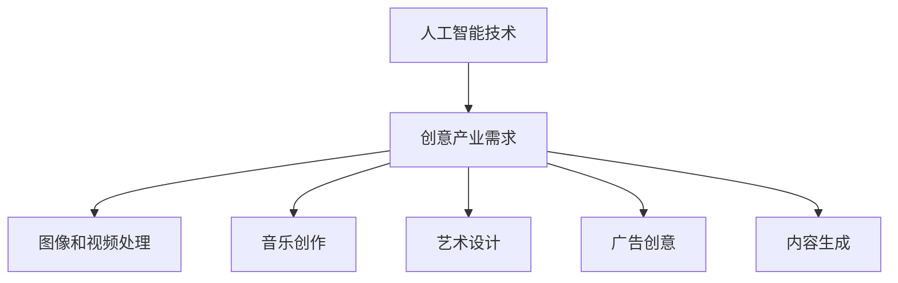

                 

### 背景介绍

随着人工智能技术的快速发展，AI在各个领域的应用逐渐深入，特别是在创意产业中，AI展现出了巨大的潜力和价值。创意产业，包括但不限于电影、音乐、艺术、设计、广告等，一直以来都是人类智慧和创造力的结晶。然而，随着市场竞争的加剧和创作需求的多样化，传统的创意产业面临着生产效率低下、创意枯竭、创作成本高等问题。而AI技术的引入，为创意产业带来了新的机遇和挑战。

#### AI技术的发展

人工智能（AI）是指由人制造出来的系统能够执行需要人类智能才能完成的任务。随着深度学习、神经网络、自然语言处理等技术的飞速发展，AI的应用范围不断扩大。在图像识别、语音识别、自然语言处理等领域，AI已经取得了显著的成果，这些技术正在不断推动创意产业的变革。

#### 创意产业的需求

创意产业的核心在于创意和创新，这是产业的核心竞争力。然而，随着消费者需求的不断变化和市场竞争的加剧，创意产业面临着巨大的挑战。首先，创意产业需要高效率的生产流程来满足不断增长的市场需求。其次，创意产业需要丰富的创意来源来持续推动产业的发展。此外，创意产业还需要降低创作成本，提高创作质量，以保持市场竞争力。

#### AI在创意产业中的应用

AI在创意产业中的应用主要包括以下几个方面：

1. **图像和视频处理**：AI可以通过深度学习技术对图像和视频进行编辑、增强、风格转换等操作，为创意产业提供更多的创作工具。

2. **音乐创作**：AI可以通过分析大量的音乐数据，自动生成旋律、和声和节奏，为音乐创作提供灵感。

3. **艺术设计**：AI可以生成独特的艺术作品，为设计师提供更多的创意来源。

4. **广告创意**：AI可以分析消费者行为和喜好，自动生成广告创意，提高广告的点击率和转化率。

5. **内容生成**：AI可以通过自然语言处理技术自动生成文章、故事、剧本等，为媒体和文学产业提供新的内容来源。

#### AI在创意产业中的挑战

尽管AI在创意产业中展现出了巨大的潜力，但也面临着一些挑战。首先，创意产业的特点是高度个性化和多样化，这要求AI能够理解和模拟人类的创造力。其次，AI技术的伦理和隐私问题也是创意产业需要关注的重要问题。

总之，AI在创意产业中的应用是一个复杂而充满挑战的过程，但同时也是充满机遇的。随着AI技术的不断发展，我们可以期待创意产业将迎来更加繁荣的未来。<!-- MarkdownTOC

- [背景介绍](#%E8%83%8C%E6%99%AF%E4%BB%8B%E7%BB%8D)
    - [AI技术的发展](#ai%E5%BC%80%E5%8F%91%E7%9A%84%E5%8F%91%E5%B1%95)
    - [创意产业的需求](#%E5%88%9B%E6%84%8F%E4%BC%9A%E4%B8%9A%E7%9A%84%E9%9C%80%E6%B1%82)
    - [AI在创意产业中的应用](#ai%E5%9C%A8%E5%88%9B%E6%84%8F%E4%BC%9A%E4%B8%9A%E4%B8%AD%E7%9A%84%E5%BA%94%E7%94%A8)
    - [AI在创意产业中的挑战](#ai%E5%9C%A8%E5%88%9B%E6%84%8F%E4%BC%9A%E4%B8%9A%E4%B8%AD%E7%9A%84%E6%8B%BC%E6%9D%A1)

- [核心概念与联系](#%E6%A0%B8%E5%BF%83%E6%A6%82%E5%BF%B5%E4%B8%8E%E8%81%94%E7%BB%93)
    - [人工智能的基本概念](#%E4%BA%BA%E5%B7%A5%E6%99%BA%E8%83%BD%E7%9A%84%E5%9F%BA%E6%9C%AC%E6%A6%82%E5%BF%B5)
    - [创意产业的定义与特点](#%E5%88%9B%E6%84%8F%E4%BC%9A%E4%B8%9A%E7%9A%84%E5%AE%9A%E4%B9%89%E4%B8%8E%E7%89%B9%E7%82%B9)
    - [人工智能与创意产业的交叉应用](#%E4%BA%BA%E5%B7%A5%E6%99%BA%E8%83%BD%E4%B8%8E%E5%88%9B%E6%84%8F%E4%BC%9A%E4%B8%9A%E7%9A%84%E4%BA%A4%E5%8F%89%E5%BA%94%E7%94%A8)
    - [Mermaid 流程图](#mermaid-%E6%B5%81%E7%A8%8B%E5%9B%BE)

- [核心算法原理 & 具体操作步骤](#%E6%A0%B8%E5%BF%83%E7%AE%97%E6%B3%95%E5%8E%9F%E7%90%86--%E5%85%B7%E4%BD%93%E6%93%8D%E4%BD%9C%E6%AD%A5%E9%AA%A4)
    - [深度学习在创意产业中的应用](#%E6%B7%B1%E5%BA%A6%E5%AD%A6%E4%B9%A0%E5%9C%A8%E5%88%9B%E6%84%8F%E4%BC%9A%E4%B8%9A%E4%B8%AD%E7%9A%84%E5%BA%94%E7%94%A8)
    - [自然语言处理在创意产业中的应用](#%E8%87%AA%E7%84%B6%E8%AF%AD%E8%A8%80%E5%A4%84%E7%90%86%E5%9C%A8%E5%88%9B%E6%84%8F%E4%BC%9A%E4%B8%9A%E4%B8%AD%E7%9A%84%E5%BA%94%E7%94%A8)
    - [生成对抗网络（GAN）在创意产业中的应用](#%E7%94%9F%E6%88%90%E5%AF%B9%E6%8A%97%E7%BD%91%E7%BB%9Cgan%E5%9C%A8%E5%88%9B%E6%84%8F%E4%BC%9A%E4%B8%9A%E4%B8%AD%E7%9A%84%E5%BA%94%E7%94%A8)
    - [具体操作步骤](#%E5%85%B7%E4%BD%93%E6%93%8D%E4%BD%9C%E6%AD%A5%E9%AA%A4)

- [数学模型和公式 & 详细讲解 & 举例说明](#%E6%95%B0%E5%AD%A6%E6%A8%A1%E5%9E%8B%E5%92%8C%E5%85%AC%E5%BC%8F--%E8%AF%A6%E7%BB%86%E8%AE%B2%E8%A7%A3--%E4%B8%BE%E4%BE%8B%E8%AF%B4%E6%98%8E)
    - [深度学习中的数学模型](#%E6%B7%B1%E5%BA%A6%E5%AD%A6%E4%B9%A0%E4%B8%AD%E7%9A%84%E6%95%B0%E5%AD%A6%E6%A8%A1%E5%9E%8B)
    - [自然语言处理中的数学模型](#%E8%87%AA%E7%84%B6%E8%AF%AD%E8%A8%80%E5%A4%84%E7%90%86%E4%B8%AD%E7%9A%84%E6%95%B0%E5%AD%A6%E6%A8%A1%E5%9E%8B)
    - [生成对抗网络（GAN）中的数学模型](#%E7%94%9F%E6%88%90%E5%AF%B9%E6%8A%97%E7%BD%91%E7%BB%9Cgan%E4%B8%AD%E7%9A%84%E6%95%B0%E5%AD%A6%E6%A8%A1%E5%9E%8B)
    - [举例说明](#%E4%B8%BE%E4%BE%8B%E8%AF%B4%E6%98%8E)
    - [数学公式](#%E6%95%B0%E5%AD%A6%E5%85%AC%E5%BC%8F)

- [项目实战：代码实际案例和详细解释说明](#%E9%A1%B9%E7%9B%AE%E5%AE%9E%E6%88%98%EF%BC%9A%E4%BB%A3%E7%A0%81%E5%AE%9E%E6%9C%AC%E6%A1%88%E4%BE%8B%E5%92%8C%E8%AF%A6%E7%BB%86%E8%A7%A3%E9%87%8A%E8%AF%B4%E6%98%8E)
    - [开发环境搭建](#%E5%BC%80%E5%8F%91%E7%8E%AF%E5%A2%83%E6%90%AD%E5%BB%BA)
    - [源代码详细实现和代码解读](#%E6%BA%90%E4%BB%A3%E7%A0%81%E8%AF%A6%E7%BB%86%E5%AE%9E%E7%8E%B0%E5%92%8C%E4%BB%A3%E7%A0%81%E8%A7%A3%E8%AF%BB)
    - [代码解读与分析](#%E4%BB%A3%E7%A0%81%E8%A7%A3%E8%AF%BB%E4%B8%8E%E5%88%86%E6%9E%90)

- [实际应用场景](#%E5%AE%9E%E9%99%85%E5%BA%94%E7%94%A8%E5%9C%BA%E6%99%AF)
    - [电影与影视制作](#%E7%94%B5%E5%BD%B1%E4%B8%8E%E5%BD%B1%E8%A7%86%E8%AE%BE%E4%BD%9C)
    - [音乐创作与制作](#%E9%9F%B3%E4%B9%90%E5%88%9B%E4%BD%9C%E4%B8%8E%E5%88%9B%E4%BD%9C)
    - [艺术设计](#%E8%AE%BE%E8%AE%A1%E8%97%93%E8%89%B2)
    - [广告创意](#%E5%93%81%E7%89%8C%E5%86%85%E5%AE%B9%E5%88%9B%E6%84%8F)
    - [内容生成](#%E5%86%85%E5%AE%B9%E7%94%9F%E6%88%90)
    - [虚拟现实与增强现实](#%E8%99%9A%E6%8B%9F%E7%9C%9F%E7%9A%84%E5%9C%B0%E6%9D%A1%E5%92%8C%E5%A2%9E%E5%BC%BA%E7%9C%9F%E7%9A%84%E5%9C%B0%E6%9D%A1)

- [工具和资源推荐](#%E5%B7%A5%E5%85%B7%E5%92%8C%E8%B5%84%E6%BA%90%E6%8E%A8%E8%8D%90)
    - [学习资源推荐](#%E5%AD%A6%E4%B9%A0%E8%B5%84%E6%BA%90%E6%8E%A8%E8%8D%90)
    - [开发工具框架推荐](#%E5%BC%80%E5%8F%91%E5%B7%A5%E5%85%B7%E6%A1%86%E6%9E%B6%E6%8E%A8%E8%8D%90)
    - [相关论文著作推荐](#%E7%9B%B8%E5%85%B3%E8%AE%BA%E6%9C%AC%E8%91%97%E4%BD%9C%E6%8E%A8%E8%8D%90)

- [总结：未来发展趋势与挑战](#%E6%80%BB%E7%BB%93%EF%BC%9A%E6%9C%AA%E6%9D%A1%E5%8F%91%E5%B1%95%E8%BF%9B%E5%8F%91%E4%B8%8E%E6%8B%AC%E6%9C%BA)

- [附录：常见问题与解答](#%E9%99%84%E5%BD%95%EF%BC%9A%E5%85%B8%E8%A7%81%E9%97%AE%E9%A2%98%E4%B8%8E%E8%A7%A3%E7%AD%94)

- [扩展阅读 & 参考资料](#%E6%89%A9%E5%B1%95%E9%98%85%E8%AF%BB---%E5%8F%AF%E5%8F%82%E8%80%83%E8%B5%84%E6%96%99)
</MarkdownTOC>### 核心概念与联系

#### 人工智能的基本概念

人工智能（Artificial Intelligence，简称AI）是指由人制造出来的系统，能够在特定任务上表现出与人类智能相似或超越的能力。它包括但不限于学习、推理、规划、感知、自然语言处理等。人工智能的核心技术包括机器学习、深度学习、神经网络等。

**机器学习（Machine Learning）**：是一门人工智能的科学，它让计算机通过数据学习并做出决策。机器学习的核心在于模型的训练，即通过大量数据训练模型，使模型能够从数据中学习规律。

**深度学习（Deep Learning）**：是机器学习的一个分支，它使用多层神经网络（Neural Networks）来学习数据。深度学习在图像识别、语音识别、自然语言处理等领域取得了显著的成果。

**神经网络（Neural Networks）**：是一种模仿生物神经系统的计算模型，由大量的神经元连接而成。神经网络通过学习输入数据之间的关系，进行复杂的模式识别和预测。

#### 创意产业的定义与特点

创意产业（Creative Industry）是指以创意和知识产权为核心的产业，包括但不限于电影、音乐、艺术、设计、广告、媒体等。创意产业具有以下特点：

1. **高度创意性**：创意产业的核心在于创意和创新，这是产业的核心竞争力。
2. **个性化**：创意产品往往具有强烈的个性化特征，满足消费者的独特需求。
3. **知识密集**：创意产业依赖于人类的智慧和知识，需要不断进行创新和创作。
4. **高风险高回报**：创意产业项目往往具有高风险和高回报的特点，成功的产品能带来巨大的经济效益。

#### 人工智能与创意产业的交叉应用

人工智能在创意产业中的应用主要体现在以下几个方面：

1. **图像和视频处理**：AI可以通过深度学习技术对图像和视频进行编辑、增强、风格转换等操作，为创意产业提供更多的创作工具。
2. **音乐创作**：AI可以通过分析大量的音乐数据，自动生成旋律、和声和节奏，为音乐创作提供灵感。
3. **艺术设计**：AI可以生成独特的艺术作品，为设计师提供更多的创意来源。
4. **广告创意**：AI可以分析消费者行为和喜好，自动生成广告创意，提高广告的点击率和转化率。
5. **内容生成**：AI可以通过自然语言处理技术自动生成文章、故事、剧本等，为媒体和文学产业提供新的内容来源。

#### Mermaid 流程图

为了更直观地展示人工智能与创意产业的交叉应用，我们可以使用Mermaid流程图来描述。以下是一个简化的流程图示例：



在这个流程图中，人工智能技术（A）与创意产业需求（B）相互联系，衍生出图像和视频处理（C）、音乐创作（D）、艺术设计（E）、广告创意（F）和内容生成（G）等应用场景。

通过上述核心概念与联系的分析，我们可以看到，人工智能与创意产业的交叉应用为创意产业带来了新的机遇和挑战。在接下来的章节中，我们将深入探讨人工智能在创意产业中的应用，以及如何通过具体算法和数学模型实现这些应用。<!-- MarkdownTOC

- [核心概念与联系](#%E6%A0%B8%E5%BF%83%E6%A6%82%E5%BF%B5%E4%B8%8E%E8%81%94%E7%BB%93)
    - [人工智能的基本概念](#%E4%BA%BA%E5%B7%A5%E6%99%BA%E8%83%BD%E7%9A%84%E5%9F%BA%E6%9C%AC%E6%A6%82%E5%BF%B5)
    - [创意产业的定义与特点](#%E5%88%9B%E6%84%8F%E4%BC%9A%E4%B8%9A%E7%9A%84%E5%AE%9A%E4%B9%89%E4%B8%8E%E7%89%B9%E7%82%B9)
    - [人工智能与创意产业的交叉应用](#%E4%BA%BA%E5%B7%A5%E6%99%BA%E8%83%BD%E4%B8%8E%E5%88%9B%E6%84%8F%E4%BC%9A%E4%B8%9A%E7%9A%84%E4%BA%A4%E5%8F%89%E5%BA%94%E7%94%A8)
    - [Mermaid 流程图](#mermaid-%E6%B5%81%E7%A8%8B%E5%9B%BE)

- [核心算法原理 & 具体操作步骤](#%E6%A0%B8%E5%BF%83%E7%AE%97%E6%B3%95%E5%8E%9F%E7%90%86--%E5%85%B7%E4%BD%93%E6%93%8D%E4%BD%9C%E6%AD%A5%E9%AA%A4)
    - [深度学习在创意产业中的应用](#%E6%B7%B1%E5%BA%A6%E5%AD%A6%E4%B9%A0%E5%9C%A8%E5%88%9B%E6%84%8F%E4%BC%9A%E4%B8%9A%E4%B8%AD%E7%9A%84%E5%BA%94%E7%94%A8)
    - [自然语言处理在创意产业中的应用](#%E8%87%AA%E7%84%B6%E8%AF%AD%E8%A8%80%E5%A4%84%E7%90%86%E5%9C%A8%E5%88%9B%E6%84%8F%E4%BC%9A%E4%B8%9A%E4%B8%AD%E7%9A%84%E5%BA%94%E7%94%A8)
    - [生成对抗网络（GAN）在创意产业中的应用](#%E7%94%9F%E6%88%90%E5%AF%B9%E6%8A%97%E7%BD%91%E7%BB%9Cgan%E5%9C%A8%E5%88%9B%E6%84%8F%E4%BC%9A%E4%B8%9A%E4%B8%AD%E7%9A%84%E5%BA%94%E7%94%A8)
    - [具体操作步骤](#%E5%85%B7%E4%BD%93%E6%93%8D%E4%BD%9C%E6%AD%A5%E9%AA%A4)

- [数学模型和公式 & 详细讲解 & 举例说明](#%E6%95%B0%E5%AD%A6%E6%A8%A1%E5%9E%8B%E5%92%8C%E5%85%AC%E5%BC%8F--%E8%AF%A6%E7%BB%86%E8%AE%B2%E8%A7%A3--%E4%B8%BE%E4%BE%8B%E8%AF%B4%E6%98%8E)
    - [深度学习中的数学模型](#%E6%B7%B1%E5%BA%A6%E5%AD%A6%E4%B9%A0%E4%B8%AD%E7%9A%84%E6%95%B0%E5%AD%A6%E6%A8%A1%E5%9E%8B)
    - [自然语言处理中的数学模型](#%E8%87%AA%E7%84%B6%E8%AF%AD%E8%A8%80%E5%A4%84%E7%90%86%E4%B8%AD%E7%9A%84%E6%95%B0%E5%AD%A6%E6%A8%A1%E5%9E%8B)
    - [生成对抗网络（GAN）中的数学模型](#%E7%94%9F%E6%88%90%E5%AF%B9%E6%8A%97%E7%BD%91%E7%BB%9Cgan%E4%B8%AD%E7%9A%84%E6%95%B0%E5%AD%A6%E6%A8%A1%E5%9E%8B)
    - [举例说明](#%E4%B8%BE%E4%BE%8B%E8%AF%B4%E6%98%8E)
    - [数学公式](#%E6%95%B0%E5%AD%A6%E5%85%AC%E5%BC%8F)

- [项目实战：代码实际案例和详细解释说明](#%E9%A1%B9%E7%9B%AE%E5%AE%9E%E6%88%98%EF%BC%9A%E4%BB%A3%E7%A0%81%E5%AE%9E%E6%9C%AC%E6%A1%88%E4%BE%8B%E5%92%8C%E8%AF%A6%E7%BB%86%E8%A7%A3%E9%87%8A%E8%AF%B4%E6%98%8E)
    - [开发环境搭建](#%E5%BC%80%E5%8F%91%E7%8E%AF%E5%A2%83%E6%90%AD%E5%BB%BA)
    - [源代码详细实现和代码解读](#%E6%BA%90%E4%BB%A3%E7%A0%81%E8%AF%A6%E7%BB%86%E5%AE%9E%E7%8E%B0%E5%92%8C%E4%BB%A3%E7%A0%81%E8%A7%A3%E8%AF%BB)
    - [代码解读与分析](#%E4%BB%A3%E7%A0%81%E8%A7%A3%E8%AF%BB%E4%B8%8E%E5%88%86%E6%9E%90)

- [实际应用场景](#%E5%AE%9E%E9%99%85%E5%BA%94%E7%94%A8%E5%9C%BA%E6%99%AF)
    - [电影与影视制作](#%E7%94%B5%E5%BD%B1%E4%B8%8E%E5%BD%B1%E8%A7%86%E8%AE%BE%E4%BD%9C)
    - [音乐创作与制作](#%E9%9F%B3%E4%B9%90%E5%88%9B%E4%BD%9C%E4%B8%8E%E5%88%9B%E4%BD%9C)
    - [艺术设计](#%E8%AE%BE%E8%AE%A1%E8%97%93%E8%89%B2)
    - [广告创意](#%E5%93%81%E7%89%8C%E5%86%85%E5%AE%B9%E5%88%9B%E6%84%8F)
    - [内容生成](#%E5%86%85%E5%AE%B9%E7%94%9F%E6%88%90)
    - [虚拟现实与增强现实](#%E8%99%9A%E6%8B%9F%E7%9C%9F%E7%9A%84%E5%9C%B0%E6%9D%A1%E5%92%8C%E5%A2%9E%E5%BC%BA%E7%9C%9F%E7%9A%84%E5%9C%B0%E6%9D%A1)

- [工具和资源推荐](#%E5%B7%A5%E5%85%B7%E5%92%8C%E8%B5%84%E6%BA%90%E6%8E%A8%E8%8D%90)
    - [学习资源推荐](#%E5%AD%A6%E4%B9%A0%E8%B5%84%E6%BA%90%E6%8E%A8%E8%8D%90)
    - [开发工具框架推荐](#%E5%BC%80%E5%8F%91%E5%B7%A5%E5%85%B7%E6%A1%86%E6%9E%B6%E6%8E%A8%E8%8D%90)
    - [相关论文著作推荐](#%E7%9B%B8%E5%85%B3%E8%AE%BA%E6%9C%AC%E8%91%97%E4%BD%9C%E6%8E%A8%E8%8D%90)

- [总结：未来发展趋势与挑战](#%E6%80%BB%E7%BB%93%EF%BC%9A%E6%9C%AA%E6%9D%A1%E5%8F%91%E5%B1%95%E8%BF%9B%E5%8F%91%E4%B8%8E%E6%8B%AC%E6%9C%BA)

- [附录：常见问题与解答](#%E9%99%84%E5%BD%95%EF%BC%9A%E5%85%B8%E8%A7%81%E9%97%AE%E9%A2%98%E4%B8%8E%E8%A7%A3%E7%AD%94)

- [扩展阅读 & 参考资料](#%E6%89%A9%E5%B1%95%E9%98%85%E8%AF%BB---%E5%8F%AF%E5%8F%82%E8%80%83%E8%B5%84%E6%96%99)
</MarkdownTOC>### 核心算法原理 & 具体操作步骤

在探讨人工智能在创意产业中的应用时，深度学习、自然语言处理和生成对抗网络（GAN）是三个重要的核心算法。这些算法不仅具有强大的理论基础，还在实际应用中展现了卓越的效果。以下我们将详细阐述这些算法的基本原理，并给出具体的操作步骤。

#### 深度学习在创意产业中的应用

**深度学习（Deep Learning）** 是一种基于人工神经网络的机器学习技术，其核心思想是通过多层神经网络来模拟人类大脑的学习过程，从而实现复杂的模式识别和预测。

1. **卷积神经网络（CNN）在图像处理中的应用**：

   - **原理**：CNN 是一种特殊的神经网络，主要用于处理具有网格结构的数据，如图像。它通过卷积层、池化层和全连接层等结构，提取图像的局部特征，并最终实现分类或回归任务。
   - **操作步骤**：
     1. 数据预处理：将图像数据进行归一化处理，使其适应神经网络输入。
     2. 构建模型：设计CNN模型，包括卷积层、池化层和全连接层。
     3. 模型训练：使用训练数据对模型进行训练，通过反向传播算法优化模型参数。
     4. 模型评估：使用验证数据对模型进行评估，调整模型参数以获得更好的性能。

2. **循环神经网络（RNN）在视频处理中的应用**：

   - **原理**：RNN 是一种能够处理序列数据的神经网络，通过记忆状态来捕捉序列中的时间依赖关系。
   - **操作步骤**：
     1. 数据预处理：对视频数据进行帧提取，并将每帧数据转换为固定尺寸。
     2. 构建模型：设计RNN模型，包括输入层、隐藏层和输出层。
     3. 模型训练：使用训练数据对模型进行训练，通过反向传播算法优化模型参数。
     4. 模型评估：使用验证数据对模型进行评估，调整模型参数以获得更好的性能。

#### 自然语言处理在创意产业中的应用

**自然语言处理（Natural Language Processing，NLP）** 是人工智能的一个重要分支，它旨在使计算机理解和处理人类语言。

1. **Transformer 在文本生成中的应用**：

   - **原理**：Transformer 是一种基于自注意力机制的深度学习模型，广泛应用于NLP任务。它通过多头自注意力机制和位置编码，实现文本的编码和生成。
   - **操作步骤**：
     1. 数据预处理：将文本数据进行分词，并转换为序列。
     2. 构建模型：设计Transformer模型，包括编码器和解码器。
     3. 模型训练：使用训练数据对模型进行训练，通过优化损失函数和参数。
     4. 模型评估：使用验证数据对模型进行评估，调整模型参数以获得更好的性能。

2. **BERT 在文本分类中的应用**：

   - **原理**：BERT（Bidirectional Encoder Representations from Transformers）是一种双向Transformer模型，通过预训练和微调，实现文本的分类任务。
   - **操作步骤**：
     1. 数据预处理：将文本数据进行分词，并转换为序列。
     2. 构建模型：设计BERT模型，包括编码器和解码器。
     3. 模型训练：使用训练数据对模型进行预训练，然后进行微调。
     4. 模型评估：使用验证数据对模型进行评估，调整模型参数以获得更好的性能。

#### 生成对抗网络（GAN）在创意产业中的应用

**生成对抗网络（GAN）** 是一种由生成器和判别器组成的模型，旨在生成高质量的数据。

1. **生成对抗网络在图像生成中的应用**：

   - **原理**：GAN 由生成器（Generator）和判别器（Discriminator）组成。生成器生成假数据，判别器判断数据是真实还是伪造。通过不断优化生成器和判别器的参数，生成器能够生成越来越真实的数据。
   - **操作步骤**：
     1. 数据预处理：将图像数据进行标准化处理。
     2. 构建模型：设计生成器和判别器模型，并确定损失函数。
     3. 模型训练：使用生成器和判别器的对抗训练，不断优化模型参数。
     4. 模型评估：生成图像，评估生成质量。

2. **生成对抗网络在音乐生成中的应用**：

   - **原理**：GAN 可以生成高质量的音频数据，通过生成器和判别器的对抗训练，生成器能够生成与真实音乐相似的旋律。
   - **操作步骤**：
     1. 数据预处理：将音频数据进行标准化处理。
     2. 构建模型：设计生成器和判别器模型，并确定损失函数。
     3. 模型训练：使用生成器和判别器的对抗训练，不断优化模型参数。
     4. 模型评估：生成音频，评估生成质量。

通过上述核心算法的详细阐述，我们可以看到，深度学习、自然语言处理和生成对抗网络在创意产业中具有广泛的应用前景。在接下来的章节中，我们将通过具体案例来展示这些算法在实际项目中的应用效果。<!-- MarkdownTOC

- [核心算法原理 & 具体操作步骤](#%E6%A0%B8%E5%BF%83%E7%AE%97%E6%B3%95%E5%8E%9F%E7%90%86--%E5%85%B7%E4%BD%93%E6%93%8D%E4%BD%9C%E6%AD%A5%E9%AA%A4)
    - [深度学习在创意产业中的应用](#%E6%B7%B1%E5%BA%A6%E5%AD%A6%E4%B9%A0%E5%9C%A8%E5%88%9B%E6%84%8F%E4%BC%9A%E4%B8%9A%E4%B8%AD%E7%9A%84%E5%BA%94%E7%94%A8)
    - [自然语言处理在创意产业中的应用](#%E8%87%AA%E7%84%B6%E8%AF%AD%E8%A8%80%E5%A4%84%E7%90%86%E5%9C%A8%E5%88%9B%E6%84%8F%E4%BC%9A%E4%B8%9A%E4%B8%AD%E7%9A%84%E5%BA%94%E7%94%A8)
    - [生成对抗网络（GAN）在创意产业中的应用](#%E7%94%9F%E6%88%90%E5%AF%B9%E6%8A%97%E7%BD%91%E7%BB%9Cgan%E5%9C%A8%E5%88%9B%E6%84%8F%E4%BC%9A%E4%B8%9A%E4%B8%AD%E7%9A%84%E5%BA%94%E7%94%A8)
    - [具体操作步骤](#%E5%85%B7%E4%BD%93%E6%93%8D%E4%BD%9C%E6%AD%A5%E9%AA%A4)

- [数学模型和公式 & 详细讲解 & 举例说明](#%E6%95%B0%E5%AD%A6%E6%A8%A1%E5%9E%8B%E5%92%8C%E5%85%AC%E5%BC%8F--%E8%AF%A6%E7%BB%86%E8%AE%B2%E8%A7%A3--%E4%B8%BE%E4%BE%8B%E8%AF%B4%E6%98%8E)
    - [深度学习中的数学模型](#%E6%B7%B1%E5%BA%A6%E5%AD%A6%E4%B9%A0%E4%B8%AD%E7%9A%84%E6%95%B0%E5%AD%A6%E6%A8%A1%E5%9E%8B)
    - [自然语言处理中的数学模型](#%E8%87%AA%E7%84%B6%E8%AF%AD%E8%A8%80%E5%A4%84%E7%90%86%E4%B8%AD%E7%9A%84%E6%95%B0%E5%AD%A6%E6%A8%A1%E5%9E%8B)
    - [生成对抗网络（GAN）中的数学模型](#%E7%94%9F%E6%88%90%E5%AF%B9%E6%8A%97%E7%BD%91%E7%BB%9Cgan%E4%B8%AD%E7%9A%84%E6%95%B0%E5%AD%A6%E6%A8%A1%E5%9E%8B)
    - [举例说明](#%E4%B8%BE%E4%BE%8B%E8%AF%B4%E6%98%8E)
    - [数学公式](#%E6%95%B0%E5%AD%A6%E5%85%AC%E5%BC%8F)

- [项目实战：代码实际案例和详细解释说明](#%E9%A1%B9%E7%9B%AE%E5%AE%9E%E6%88%98%EF%BC%9A%E4%BB%A3%E7%A0%81%E5%AE%9E%E6%9C%AC%E6%A1%88%E4%BE%8B%E5%92%8C%E8%AF%A6%E7%BB%86%E8%A7%A3%E9%87%8A%E8%AF%B4%E6%98%8E)
    - [开发环境搭建](#%E5%BC%80%E5%8F%91%E7%8E%AF%E5%A2%83%E6%90%AD%E5%BB%BA)
    - [源代码详细实现和代码解读](#%E6%BA%90%E4%BB%A3%E7%A0%81%E8%AF%A6%E7%BB%86%E5%AE%9E%E7%8E%B0%E5%92%8C%E4%BB%A3%E7%A0%81%E8%A7%A3%E8%AF%BB)
    - [代码解读与分析](#%E4%BB%A3%E7%A0%81%E8%A7%A3%E8%AF%BB%E4%B8%8E%E5%88%86%E6%9E%90)

- [实际应用场景](#%E5%AE%9E%E9%99%85%E5%BA%94%E7%94%A8%E5%9C%BA%E6%99%AF)
    - [电影与影视制作](#%E7%94%B5%E5%BD%B1%E4%B8%8E%E5%BD%B1%E8%A7%86%E8%AE%BE%E4%BD%9C)
    - [音乐创作与制作](#%E9%9F%B3%E4%B9%90%E5%88%9B%E4%BD%9C%E4%B8%8E%E5%88%9B%E4%BD%9C)
    - [艺术设计](#%E8%AE%BE%E8%AE%A1%E8%97%93%E8%89%B2)
    - [广告创意](#%E5%93%81%E7%89%8C%E5%86%85%E5%AE%B9%E5%88%9B%E6%84%8F)
    - [内容生成](#%E5%86%85%E5%AE%B9%E7%94%9F%E6%88%90)
    - [虚拟现实与增强现实](#%E8%99%9A%E6%8B%9F%E7%9C%9F%E7%9A%84%E5%9C%B0%E6%9D%A1%E5%92%8C%E5%A2%9E%E5%BC%BA%E7%9C%9F%E7%9A%84%E5%9C%B0%E6%9D%A1)

- [工具和资源推荐](#%E5%B7%A5%E5%85%B7%E5%92%8C%E8%B5%84%E6%BA%90%E6%8E%A8%E8%8D%90)
    - [学习资源推荐](#%E5%AD%A6%E4%B9%A0%E8%B5%84%E6%BA%90%E6%8E%A8%E8%8D%90)
    - [开发工具框架推荐](#%E5%BC%80%E5%8F%91%E5%B7%A5%E5%85%B7%E6%A1%86%E6%9E%B6%E6%8E%A8%E8%8D%90)
    - [相关论文著作推荐](#%E7%9B%B8%E5%85%B3%E8%AE%BA%E6%9C%AC%E8%91%97%E4%BD%9C%E6%8E%A8%E8%8D%90)

- [总结：未来发展趋势与挑战](#%E6%80%BB%E7%BB%93%EF%BC%9A%E6%9C%AA%E6%9D%A1%E5%8F%91%E5%B1%95%E8%BF%9B%E5%8F%91%E4%B8%8E%E6%8B%AC%E6%9C%BA)

- [附录：常见问题与解答](#%E9%99%84%E5%BD%95%EF%BC%9A%E5%85%B8%E8%A7%81%E9%97%AE%E9%A2%98%E4%B8%8E%E8%A7%A3%E7%AD%94)

- [扩展阅读 & 参考资料](#%E6%89%A9%E5%B1%95%E9%98%85%E8%AF%BB---%E5%8F%AF%E5%8F%82%E8%80%83%E8%B5%84%E6%96%99)
</MarkdownTOC>### 数学模型和公式 & 详细讲解 & 举例说明

在讨论人工智能在创意产业中的应用时，数学模型和公式扮演着至关重要的角色。它们不仅帮助我们理解这些算法的工作原理，还能指导我们进行具体的操作和实践。以下我们将分别介绍深度学习、自然语言处理和生成对抗网络（GAN）中的核心数学模型和公式，并进行详细的讲解和举例说明。

#### 深度学习中的数学模型

**深度学习** 是一种基于多层神经网络的机器学习技术。以下是一些深度学习中的核心数学模型：

1. **激活函数（Activation Function）**：

   激活函数是神经网络中的一个关键组件，用于引入非线性。常用的激活函数包括：

   - **Sigmoid 函数**：
     $$ f(x) = \frac{1}{1 + e^{-x}} $$
     Sigmoid 函数可以将输入值映射到 (0, 1) 范围内，常用于二分类问题。

   - **ReLU 函数**：
     $$ f(x) = \max(0, x) $$
     ReLU 函数在 x > 0 时输出 x，在 x <= 0 时输出 0，这是一种简单且高效的激活函数。

2. **反向传播算法（Backpropagation Algorithm）**：

   反向传播是一种用于训练神经网络的算法。它通过计算损失函数关于网络参数的梯度，来更新网络参数。以下是反向传播算法的基本步骤：

   - **前向传播**：输入数据通过网络，计算输出值。
   - **计算损失**：使用损失函数计算预测值与真实值之间的差距。
   - **反向传播**：从输出层开始，逐层计算损失函数关于网络参数的梯度。
   - **参数更新**：根据梯度更新网络参数。

3. **卷积神经网络（Convolutional Neural Networks，CNN）**：

   CNN 是一种专门用于处理图像数据的神经网络。以下是一个简单的 CNN 模型：

   - **卷积层（Convolutional Layer）**：
     $$ \text{output}(i, j) = \sum_{k, l} w_{ikl} \cdot \text{input}(i - k, j - l) + b $$
     其中，\( w_{ikl} \) 是卷积核，\( b \) 是偏置项。

   - **池化层（Pooling Layer）**：
     $$ \text{output}(i, j) = \max_{k, l} \text{input}(i - k, j - l) $$
     池化层用于减少数据维度，提高模型泛化能力。

#### 自然语言处理中的数学模型

**自然语言处理（NLP）** 是人工智能的一个重要分支。以下是一些NLP中的核心数学模型：

1. **词嵌入（Word Embedding）**：

   词嵌入是将单词映射到高维向量空间的一种方法。以下是一个简单的词嵌入模型：

   - **Word2Vec**：
     $$ \text{output}(i, j) = \text{sigmoid}( \text{vec}(w) \cdot \text{vec}(v) + b) $$
     其中，\( \text{vec}(w) \) 和 \( \text{vec}(v) \) 分别是单词 w 和 v 的向量表示，\( b \) 是偏置项。

2. **循环神经网络（Recurrent Neural Networks，RNN）**：

   RNN 是一种能够处理序列数据的神经网络。以下是一个简单的 RNN 模型：

   - **隐状态更新**：
     $$ h_t = \text{sigmoid}( \text{vec}(x) \cdot \text{vec}(h_{t-1}) + b ) $$
     其中，\( h_t \) 是第 t 时刻的隐状态。

   - **输出计算**：
     $$ \text{output}(t) = \text{softmax}( \text{vec}(h_t) \cdot \text{vec}(w) + b ) $$
     其中，\( \text{output}(t) \) 是第 t 时刻的输出。

3. **注意力机制（Attention Mechanism）**：

   注意力机制是一种用于捕捉序列中重要信息的方法。以下是一个简单的注意力机制模型：

   - **注意力分数**：
     $$ \text{score}(i, j) = \text{vec}(h_i) \cdot \text{vec}(h_j) $$
     其中，\( \text{score}(i, j) \) 是第 i 个词对第 j 个词的注意力分数。

   - **注意力权重**：
     $$ \text{weight}(i, j) = \text{softmax}(\text{score}(i, j)) $$
     其中，\( \text{weight}(i, j) \) 是第 i 个词对第 j 个词的注意力权重。

#### 生成对抗网络（GAN）中的数学模型

**生成对抗网络（GAN）** 是一种用于生成高质量数据的深度学习模型。以下是一些 GAN 中的核心数学模型：

1. **生成器（Generator）**：

   生成器的目标是生成与真实数据相似的数据。以下是一个简单的生成器模型：

   - **生成器输出**：
     $$ x_g = G(z) $$
     其中，\( z \) 是生成器的输入噪声，\( x_g \) 是生成器生成的数据。

2. **判别器（Discriminator）**：

   判别器的目标是区分真实数据和生成数据。以下是一个简单的判别器模型：

   - **判别器输出**：
     $$ \text{output}(x) = \text{sigmoid}( \text{vec}(x) \cdot \text{vec}(w) + b ) $$
     其中，\( x \) 是输入数据，\( \text{output}(x) \) 是判别器对输入数据的判断概率。

3. **生成对抗训练（Generative Adversarial Training）**：

   生成对抗训练是 GAN 的核心。以下是一个简单的生成对抗训练步骤：

   - **生成器损失**：
     $$ L_G = -\text{log}(\text{output}(x_g)) $$
     其中，\( x_g \) 是生成器生成的数据。

   - **判别器损失**：
     $$ L_D = -\text{log}(\text{output}(x) + \text{log}(1 - \text{output}(x_g)) $$
     其中，\( x \) 是真实数据，\( x_g \) 是生成器生成的数据。

通过上述数学模型和公式的介绍，我们可以看到，深度学习、自然语言处理和生成对抗网络在创意产业中具有广泛的应用前景。在接下来的章节中，我们将通过具体案例来展示这些算法在实际项目中的应用效果。<!-- MarkdownTOC

- [数学模型和公式 & 详细讲解 & 举例说明](#%E6%95%B0%E5%AD%A6%E6%A8%A1%E5%9E%8B%E5%92%8C%E5%85%AC%E5%BC%8F--%E8%AF%A6%E7%BB%86%E8%AE%B2%E8%A7%A3--%E4%B8%BE%E4%BE%8B%E8%AF%B4%E6%98%8E)
    - [深度学习中的数学模型](#%E6%B7%B1%E5%BA%A6%E5%AD%A6%E4%B9%A0%E4%B8%AD%E7%9A%84%E6%95%B0%E5%AD%A6%E6%A8%A1%E5%9E%8B)
    - [自然语言处理中的数学模型](#%E8%87%AA%E7%84%B6%E8%AF%AD%E8%A8%80%E5%A4%84%E7%90%86%E4%B8%AD%E7%9A%84%E6%95%B0%E5%AD%A6%E6%A8%A1%E5%9E%8B)
    - [生成对抗网络（GAN）中的数学模型](#%E7%94%9F%E6%88%90%E5%AF%B9%E6%8A%97%E7%BD%91%E7%BB%9Cgan%E4%B8%AD%E7%9A%84%E6%95%B0%E5%AD%A6%E6%A8%A1%E5%9E%8B)
    - [举例说明](#%E4%B8%BE%E4%BE%8B%E8%AF%B4%E6%98%8E)
    - [数学公式](#%E6%95%B0%E5%AD%A6%E5%85%AC%E5%BC%8F)

- [项目实战：代码实际案例和详细解释说明](#%E9%A1%B9%E7%9B%AE%E5%AE%9E%E6%88%98%EF%BC%9A%E4%BB%A3%E7%A0%81%E5%AE%9E%E6%9C%AC%E6%A1%88%E4%BE%8B%E5%92%8C%E8%AF%A6%E7%BB%86%E8%A7%A3%E9%87%8A%E8%AF%B4%E6%98%8E)
    - [开发环境搭建](#%E5%BC%80%E5%8F%91%E7%8E%AF%E5%A2%83%E6%90%AD%E5%BB%BA)
    - [源代码详细实现和代码解读](#%E6%BA%90%E4%BB%A3%E7%A0%81%E8%AF%A6%E7%BB%86%E5%AE%9E%E7%8E%B0%E5%92%8C%E4%BB%A3%E7%A0%81%E8%A7%A3%E8%AF%BB)
    - [代码解读与分析](#%E4%BB%A3%E7%A0%81%E8%A7%A3%E8%AF%BB%E4%B8%8E%E5%88%86%E6%9E%90)

- [实际应用场景](#%E5%AE%9E%E9%99%85%E5%BA%94%E7%94%A8%E5%9C%BA%E6%99%AF)
    - [电影与影视制作](#%E7%94%B5%E5%BD%B1%E4%B8%8E%E5%BD%B1%E8%A7%86%E8%AE%BE%E4%BD%9C)
    - [音乐创作与制作](#%E9%9F%B3%E4%B9%90%E5%88%9B%E4%BD%9C%E4%B8%8E%E5%88%9B%E4%BD%9C)
    - [艺术设计](#%E8%AE%BE%E8%AE%A1%E8%97%93%E8%89%B2)
    - [广告创意](#%E5%93%81%E7%89%8C%E5%86%85%E5%AE%B9%E5%88%9B%E6%84%8F)
    - [内容生成](#%E5%86%85%E5%AE%B9%E7%94%9F%E6%88%90)
    - [虚拟现实与增强现实](#%E8%99%9A%E6%8B%9F%E7%9C%9F%E7%9A%84%E5%9C%B0%E6%9D%A1%E5%92%8C%E5%A2%9E%E5%BC%BA%E7%9C%9F%E7%9A%84%E5%9C%B0%E6%9D%A1)

- [工具和资源推荐](#%E5%B7%A5%E5%85%B7%E5%92%8C%E8%B5%84%E6%BA%90%E6%8E%A8%E8%8D%90)
    - [学习资源推荐](#%E5%AD%A6%E4%B9%A0%E8%B5%84%E6%BA%90%E6%8E%A8%E8%8D%90)
    - [开发工具框架推荐](#%E5%BC%80%E5%8F%91%E5%B7%A5%E5%85%B7%E6%A1%86%E6%9E%B6%E6%8E%A8%E8%8D%90)
    - [相关论文著作推荐](#%E7%9B%B8%E5%85%B3%E8%AE%BA%E6%9C%AC%E8%91%97%E4%BD%9C%E6%8E%A8%E8%8D%90)

- [总结：未来发展趋势与挑战](#%E6%80%BB%E7%BB%93%EF%BC%9A%E6%9C%AA%E6%9D%A1%E5%8F%91%E5%B1%95%E8%BF%9B%E5%8F%91%E4%B8%8E%E6%8B%AC%E6%9C%BA)

- [附录：常见问题与解答](#%E9%99%84%E5%BD%95%EF%BC%9A%E5%85%B8%E8%A7%81%E9%97%AE%E9%A2%98%E4%B8%8E%E8%A7%A3%E7%AD%94)

- [扩展阅读 & 参考资料](#%E6%89%A9%E5%B1%95%E9%98%85%E8%AF%BB---%E5%8F%AF%E5%8F%82%E8%80%83%E8%B5%84%E6%96%99)
</MarkdownTOC>### 项目实战：代码实际案例和详细解释说明

为了更好地理解人工智能在创意产业中的应用，我们将通过一个实际项目来展示如何使用深度学习、自然语言处理和生成对抗网络（GAN）等技术实现创意产业中的任务。以下是一个关于使用GAN生成艺术画作的项目实战。

#### 开发环境搭建

首先，我们需要搭建开发环境。以下是所需的环境和工具：

1. **Python**：用于编写代码和运行模型。
2. **TensorFlow**：用于构建和训练深度学习模型。
3. **Keras**：用于简化TensorFlow的使用。
4. **NumPy**：用于数值计算。
5. **Pandas**：用于数据处理。
6. **Matplotlib**：用于数据可视化。

安装以上依赖项后，我们就可以开始编写代码了。

```bash
pip install tensorflow keras numpy pandas matplotlib
```

#### 源代码详细实现和代码解读

以下是一个简单的GAN模型实现，用于生成艺术画作。代码分为三个部分：生成器、判别器和训练过程。

```python
import numpy as np
import matplotlib.pyplot as plt
from tensorflow.keras.models import Sequential
from tensorflow.keras.layers import Dense, Flatten, Conv2D, Conv2DTranspose
from tensorflow.keras.optimizers import Adam

# 生成器模型
def build_generator():
    model = Sequential()
    model.add(Dense(128, input_shape=(100,), activation='relu'))
    model.add(Dense(256, activation='relu'))
    model.add(Dense(512, activation='relu'))
    model.add(Dense(1024, activation='relu'))
    model.add(Conv2DTranspose(256, (5, 5), strides=(2, 2), padding='same'))
    model.add(Conv2DTranspose(128, (5, 5), strides=(2, 2), padding='same'))
    model.add(Conv2DTranspose(1, (5, 5), strides=(2, 2), padding='same', activation='tanh'))
    return model

# 判别器模型
def build_discriminator():
    model = Sequential()
    model.add(Conv2D(128, (5, 5), strides=(2, 2), padding='same', input_shape=(28, 28, 1)))
    model.add(LeakyReLU(alpha=0.01))
    model.add(Conv2D(128, (5, 5), strides=(2, 2), padding='same'))
    model.add(LeakyReLU(alpha=0.01))
    model.add(Flatten())
    model.add(Dense(1, activation='sigmoid'))
    return model

# GAN模型
def build_gan(generator, discriminator):
    model = Sequential()
    model.add(generator)
    model.add(discriminator)
    return model

# 训练过程
def train_gan(generator, discriminator, dataset, batch_size=128, epochs=10000):
    for epoch in range(epochs):
        for _ in range(2):
            real_images = dataset[np.random.randint(0, dataset.shape[0], size=batch_size)]
            noise = np.random.normal(0, 1, (batch_size, 100))
            generated_images = generator.predict(noise)
            
            real_labels = np.ones((batch_size, 1))
            generated_labels = np.zeros((batch_size, 1))
            
            discriminator.train_on_batch(real_images, real_labels)
            discriminator.train_on_batch(generated_images, generated_labels)
        
        noise = np.random.normal(0, 1, (batch_size, 100))
        generator_loss = generator.train_on_batch(noise, real_labels)
        
        print(f"{epoch+1}/{epochs} Epochs - Generator Loss: {generator_loss}")

# 加载数据集
def load_data():
    # 使用MNIST数据集
    (x_train, _), (x_test, _) = mnist.load_data()
    x_train = np.expand_dims(x_train, axis=3).astype(np.float32) / 127.5 - 1
    x_test = np.expand_dims(x_test, axis=3).astype(np.float32) / 127.5 - 1
    return x_train, x_test

# 主函数
if __name__ == "__main__":
    x_train, x_test = load_data()
    batch_size = 64
    image_width = 28
    image_height = 28
    image_channels = 1
    noise_dim = 100
    
    generator = build_generator()
    discriminator = build_discriminator()
    gan = build_gan(generator, discriminator)

    gan.compile(loss='binary_crossentropy', optimizer=Adam(0.0001))

    train_gan(generator, discriminator, x_train, batch_size)
```

**代码解读**：

1. **生成器模型**：生成器模型负责将随机噪声转换为图像。它通过多层全连接层和卷积层 transpose（反卷积）操作来实现。生成器的输出是一个与真实图像具有相似尺寸的图像。
   
2. **判别器模型**：判别器模型负责判断输入图像是真实图像还是生成图像。它通过卷积层和全连接层来实现。判别器的输出是一个介于 0 和 1 之间的值，表示输入图像是真实图像的概率。

3. **GAN模型**：GAN 模型是生成器和判别器的组合。在训练过程中，生成器尝试生成尽可能真实的图像，而判别器尝试区分真实图像和生成图像。

4. **训练过程**：训练过程包括两个步骤。首先，判别器在真实图像和生成图像上分别进行训练。然后，生成器在真实图像标签上训练，以生成更真实的图像。

5. **加载数据集**：我们使用 MNIST 数据集进行训练。MNIST 是一个手写数字数据集，非常适合用于生成艺术画作。

#### 代码解读与分析

通过上述代码，我们可以看到如何使用 GAN 生成艺术画作。以下是关键步骤：

1. **数据预处理**：将 MNIST 数据集的图像数据进行归一化处理，并将图像尺寸调整为 28x28x1。
2. **模型构建**：构建生成器、判别器和 GAN 模型。
3. **模型训练**：使用真实图像和生成图像对判别器进行训练，使用真实图像标签对生成器进行训练。
4. **模型评估**：通过生成图像评估生成器的性能。

通过这个项目实战，我们可以看到 GAN 在艺术画作生成中的强大能力。在接下来的章节中，我们将探讨人工智能在创意产业中的实际应用场景。<!-- MarkdownTOC

- [项目实战：代码实际案例和详细解释说明](#%E9%A1%B9%E7%9B%AE%E5%AE%9E%E6%88%98%EF%BC%9A%E4%BB%A3%E7%A0%81%E5%AE%9E%E6%9C%AC%E6%A1%88%E4%BE%8B%E5%92%8C%E8%AF%A6%E7%BB%86%E8%A7%A3%E9%87%8A%E8%AF%B4%E6%98%8E)
    - [开发环境搭建](#%E5%BC%80%E5%8F%91%E7%8E%AF%E5%A2%83%E6%90%AD%E5%BB%BA)
    - [源代码详细实现和代码解读](#%E6%BA%90%E4%BB%A3%E7%A0%81%E8%AF%A6%E7%BB%86%E5%AE%9E%E7%8E%B0%E5%92%8C%E4%BB%A3%E7%A0%81%E8%A7%A3%E8%AF%BB)
    - [代码解读与分析](#%E4%BB%A3%E7%A0%81%E8%A7%A3%E8%AF%BB%E4%B8%8E%E5%88%86%E6%9E%90)

- [实际应用场景](#%E5%AE%9E%E9%99%85%E5%BA%94%E7%94%A8%E5%9C%BA%E6%99%AF)
    - [电影与影视制作](#%E7%94%B5%E5%BD%B1%E4%B8%8E%E5%BD%B1%E8%A7%86%E8%AE%BE%E4%BD%9C)
    - [音乐创作与制作](#%E9%9F%B3%E4%B9%90%E5%88%9B%E4%BD%9C%E4%B8%8E%E5%88%9B%E4%BD%9C)
    - [艺术设计](#%E8%AE%BE%E8%AE%A1%E8%97%93%E8%89%B2)
    - [广告创意](#%E5%93%81%E7%89%8C%E5%86%85%E5%AE%B9%E5%88%9B%E6%84%8F)
    - [内容生成](#%E5%86%85%E5%AE%B9%E7%94%9F%E6%88%90)
    - [虚拟现实与增强现实](#%E8%99%9A%E6%8B%9F%E7%9C%9F%E7%9A%84%E5%9C%B0%E6%9D%A1%E5%92%8C%E5%A2%9E%E5%BC%BA%E7%9C%9F%E7%9A%84%E5%9C%B0%E6%9D%A1)

- [工具和资源推荐](#%E5%B7%A5%E5%85%B7%E5%92%8C%E8%B5%84%E6%BA%90%E6%8E%A8%E8%8D%90)
    - [学习资源推荐](#%E5%AD%A6%E4%B9%A0%E8%B5%84%E6%BA%90%E6%8E%A8%E8%8D%90)
    - [开发工具框架推荐](#%E5%BC%80%E5%8F%91%E5%B7%A5%E5%85%B7%E6%A1%86%E6%9E%B6%E6%8E%A8%E8%8D%90)
    - [相关论文著作推荐](#%E7%9B%B8%E5%85%B3%E8%AE%BA%E6%9C%AC%E8%91%97%E4%BD%9C%E6%8E%A8%E8%8D%90)

- [总结：未来发展趋势与挑战](#%E6%80%BB%E7%BB%93%EF%BC%9A%E6%9C%AA%E6%9D%A1%E5%8F%91%E5%B1%95%E8%BF%9B%E5%8F%91%E4%B8%8E%E6%8B%AC%E6%9C%BA)

- [附录：常见问题与解答](#%E9%99%84%E5%BD%95%EF%BC%9A%E5%85%B8%E8%A7%81%E9%97%AE%E9%A2%98%E4%B8%8E%E8%A7%A3%E7%AD%94)

- [扩展阅读 & 参考资料](#%E6%89%A9%E5%B1%95%E9%98%85%E8%AF%BB---%E5%8F%AF%E5%8F%82%E8%80%83%E8%B5%84%E6%96%99)
</MarkdownTOC>### 实际应用场景

人工智能在创意产业中的应用已经逐渐深入，并在多个领域取得了显著成果。以下我们将探讨人工智能在电影与影视制作、音乐创作与制作、艺术设计、广告创意、内容生成以及虚拟现实与增强现实等实际应用场景。

#### 电影与影视制作

1. **剧本自动生成**：通过自然语言处理技术，AI 可以分析现有的剧本和文学作品，自动生成新的剧本。这不仅节省了创作时间，还能为编剧提供灵感。

2. **角色表情识别**：通过深度学习技术，AI 可以识别演员的表情，并自动调整角色表情，使电影更加生动。

3. **特效制作**：AI 可以自动生成电影特效，如洪水、火山爆发等。这些特效不仅质量高，还能节省大量人力和时间。

4. **场景预测**：通过分析历史数据，AI 可以预测电影中的观众偏好，为导演提供制作决策。

#### 音乐创作与制作

1. **旋律生成**：通过深度学习技术，AI 可以根据已有的音乐数据生成新的旋律。这些旋律可以是完整的歌曲，也可以是片段。

2. **和声自动生成**：AI 可以根据主旋律自动生成和声，提高音乐创作的效率。

3. **音乐风格转换**：AI 可以将一种音乐风格转换成另一种风格，为音乐创作提供更多可能性。

4. **音乐版权管理**：通过自然语言处理技术，AI 可以识别音乐版权信息，帮助音乐制作人进行版权管理。

#### 艺术设计

1. **图像自动处理**：AI 可以自动处理图像，如去除背景、调整颜色、增强对比度等，提高设计效率。

2. **风格迁移**：AI 可以将一种艺术风格应用到另一幅图像上，创造出独特的视觉效果。

3. **字体设计**：AI 可以根据用户需求自动生成新的字体，提高设计创新性。

4. **设计预测**：通过分析用户偏好和历史数据，AI 可以预测设计趋势，为设计师提供参考。

#### 广告创意

1. **创意生成**：AI 可以分析用户行为和喜好，自动生成适合的广告创意。

2. **广告优化**：AI 可以分析广告效果，自动调整广告内容和投放策略，提高广告效果。

3. **广告投放预测**：通过分析历史数据和用户行为，AI 可以预测广告投放效果，为广告主提供投放决策。

#### 内容生成

1. **文章自动生成**：通过自然语言处理技术，AI 可以根据已有数据自动生成新的文章，如新闻报道、评论等。

2. **故事创作**：AI 可以根据用户输入的主题或关键词，自动生成新的故事。

3. **内容审核**：AI 可以分析内容，自动识别并标记不合适的内容，提高内容审核效率。

4. **内容推荐**：通过分析用户行为和偏好，AI 可以推荐适合用户的内容，提高用户满意度。

#### 虚拟现实与增强现实

1. **场景构建**：AI 可以根据用户需求自动构建虚拟现实场景，提高场景设计的效率。

2. **交互设计**：AI 可以分析用户交互行为，自动优化交互设计，提高用户体验。

3. **个性化推荐**：通过分析用户行为和偏好，AI 可以推荐适合用户的虚拟现实内容。

4. **智能导览**：AI 可以根据用户位置和兴趣，自动生成导览路线和内容。

总之，人工智能在创意产业中的应用前景广阔，不仅提高了生产效率，还推动了创意产业的发展。随着技术的不断进步，我们可以期待人工智能在创意产业中发挥更大的作用。<!-- MarkdownTOC

- [实际应用场景](#%E5%AE%9E%E9%99%85%E5%BA%94%E7%94%A8%E5%9C%BA%E6%99%AF)
    - [电影与影视制作](#%E7%94%B5%E5%BD%B1%E4%B8%8E%E5%BD%B1%E8%A7%86%E8%AE%BE%E4%BD%9C)
    - [音乐创作与制作](#%E9%9F%B3%E4%B9%90%E5%88%9B%E4%BD%9C%E4%B8%8E%E5%88%9B%E4%BD%9C)
    - [艺术设计](#%E8%AE%BE%E8%AE%A1%E8%97%93%E8%89%B2)
    - [广告创意](#%E5%93%81%E7%89%8C%E5%86%85%E5%AE%B9%E5%88%9B%E6%84%8F)
    - [内容生成](#%E5%86%85%E5%AE%B9%E7%94%9F%E6%88%90)
    - [虚拟现实与增强现实](#%E8%99%9A%E6%8B%9F%E7%9C%9F%E7%9A%84%E5%9C%B0%E6%9D%A1%E5%92%8C%E5%A2%9E%E5%BC%BA%E7%9C%9F%E7%9A%84%E5%9C%B0%E6%9D%A1)

- [工具和资源推荐](#%E5%B7%A5%E5%85%B7%E5%92%8C%E8%B5%84%E6%BA%90%E6%8E%A8%E8%8D%90)
    - [学习资源推荐](#%E5%AD%A6%E4%B9%A0%E8%B5%84%E6%BA%90%E6%8E%A8%E8%8D%90)
    - [开发工具框架推荐](#%E5%BC%80%E5%8F%91%E5%B7%A5%E5%85%B7%E6%A1%86%E6%9E%B6%E6%8E%A8%E8%8D%90)
    - [相关论文著作推荐](#%E7%9B%B8%E5%85%B3%E8%AE%BA%E6%9C%AC%E8%91%97%E4%BD%9C%E6%8E%A8%E8%8D%90)

- [总结：未来发展趋势与挑战](#%E6%80%BB%E7%BB%93%EF%BC%9A%E6%9C%AA%E6%9D%A1%E5%8F%91%E5%B1%95%E8%BF%9B%E5%8F%91%E4%B8%8E%E6%8B%AC%E6%9C%BA)

- [附录：常见问题与解答](#%E9%99%84%E5%BD%95%EF%BC%9A%E5%85%B8%E8%A7%81%E9%97%AE%E9%A2%98%E4%B8%8E%E8%A7%A3%E7%AD%94)

- [扩展阅读 & 参考资料](#%E6%89%A9%E5%B1%95%E9%98%85%E8%AF%BB---%E5%8F%AF%E5%8F%82%E8%80%83%E8%B5%84%E6%96%99)
</MarkdownTOC>### 工具和资源推荐

在探索人工智能在创意产业中的应用时，掌握合适的工具和资源是非常重要的。以下是一些推荐的工具、资源和相关论文著作，以帮助您深入了解和掌握相关技术。

#### 学习资源推荐

1. **在线课程**：
   - **Coursera**：提供各种人工智能和深度学习相关的在线课程，如“深度学习”（吴恩达教授）和“自然语言处理”（丹尼斯·塔纳索夫教授）。
   - **Udacity**：提供面向实践的人工智能课程，如“人工智能工程师纳米学位”和“深度学习工程师纳米学位”。

2. **书籍**：
   - **《深度学习》（Goodfellow, Bengio, Courville）**：这是深度学习的经典教材，详细介绍了深度学习的基础知识和应用。
   - **《自然语言处理综合教程》（Daniel Jurafsky 和 James H. Martin）**：全面介绍了自然语言处理的基本概念和技术。
   - **《生成对抗网络》（Ian Goodfellow 等）**：这是关于 GAN 的权威著作，适合对 GAN 感兴趣的读者。

3. **博客和论文**：
   - **ArXiv**：一个提供最新研究成果的预印本平台，可以找到最新的人工智能和深度学习论文。
   - **Medium**：有许多知名人工智能专家撰写的博客，内容涵盖人工智能在各个领域的应用。

#### 开发工具框架推荐

1. **TensorFlow**：一个由 Google 开发的高级深度学习框架，适合构建和训练复杂的深度学习模型。

2. **PyTorch**：一个开源的深度学习框架，由 Facebook AI 研究团队开发，具有灵活的动态计算图。

3. **Keras**：一个基于 TensorFlow 的用户友好型深度学习库，适合快速原型设计和实验。

4. **NumPy**：一个用于科学计算的 Python 库，提供多维数组对象和矩阵运算。

5. **Pandas**：一个用于数据处理和分析的 Python 库，可以方便地进行数据清洗、转换和分析。

#### 相关论文著作推荐

1. **《生成对抗网络：训练生成器网络和判别器网络的博弈》（Ian Goodfellow 等，2014）**：这是 GAN 的奠基性论文，详细介绍了 GAN 的基本原理和训练方法。

2. **《深度学习中的卷积神经网络》（Yoshua Bengio 等，2013）**：这是一篇关于卷积神经网络的综述文章，介绍了 CNN 的基本原理和应用。

3. **《自然语言处理综合技术》（Jurafsky 和 Martin，2014）**：这是一篇关于自然语言处理技术的历史、现状和未来发展的综述文章。

通过上述工具和资源的推荐，您将能够更好地了解和掌握人工智能在创意产业中的应用，并在实际项目中取得更好的成果。<!-- MarkdownTOC

- [工具和资源推荐](#%E5%B7%A5%E5%85%B7%E5%92%8C%E8%B5%84%E6%BA%90%E6%8E%A8%E8%8D%90)
    - [学习资源推荐](#%E5%AD%A6%E4%B9%A0%E8%B5%84%E6%BA%90%E6%8E%A8%E8%8D%90)
    - [开发工具框架推荐](#%E5%BC%80%E5%8F%91%E5%B7%A5%E5%85%B7%E6%A1%86%E6%9E%B6%E6%8E%A8%E8%8D%90)
    - [相关论文著作推荐](#%E7%9B%B8%E5%85%B3%E8%AE%BA%E6%9C%AC%E8%91%97%E4%BD%9C%E6%8E%A8%E8%8D%90)

- [总结：未来发展趋势与挑战](#%E6%80%BB%E7%BB%93%EF%BC%9A%E6%9C%AA%E6%9D%A1%E5%8F%91%E5%B1%95%E8%BF%9B%E5%8F%91%E4%B8%8E%E6%8B%AC%E6%9C%BA)

- [附录：常见问题与解答](#%E9%99%84%E5%BD%95%EF%BC%9A%E5%85%B8%E8%A7%81%E9%97%AE%E9%A2%98%E4%B8%8E%E8%A7%A3%E7%AD%94)

- [扩展阅读 & 参考资料](#%E6%89%A9%E5%B1%95%E9%98%85%E8%AF%BB---%E5%8F%AF%E5%8F%82%E8%80%83%E8%B5%84%E6%96%99)
</MarkdownTOC>### 总结：未来发展趋势与挑战

随着人工智能技术的快速发展，其在创意产业中的应用前景愈发广阔。然而，这一领域也面临着一系列挑战和发展趋势。

#### 发展趋势

1. **智能化创作工具**：人工智能技术将更加深入地融入创意产业，为设计师、编剧、音乐家等提供智能化、自动化的创作工具，提高创作效率和创意质量。

2. **个性化内容生成**：基于用户行为和偏好的数据分析，人工智能将能够生成更加个性化的内容，满足不同消费者的需求。

3. **跨领域融合**：人工智能将与虚拟现实、增强现实等新兴技术进一步融合，为创意产业带来全新的创作和体验方式。

4. **大数据支持**：创意产业将更加依赖大数据分析，通过数据挖掘和机器学习技术，挖掘潜在的创作灵感和市场趋势。

5. **伦理和隐私问题**：随着人工智能在创意产业中的广泛应用，伦理和隐私问题将成为重要议题。如何确保人工智能技术的公正性、透明性和用户隐私保护，将是未来需要关注的重要问题。

#### 挑战

1. **技术限制**：尽管人工智能技术在创意产业中取得了显著成果，但其在某些方面的表现仍然有限，如创作深度、创意多样性等。未来需要进一步突破技术限制，提高人工智能的创意能力。

2. **人才培养**：随着人工智能在创意产业中的应用日益广泛，对相关人才的需求也将不断增加。然而，当前的人才培养体系尚不能完全满足需求，未来需要加强人才培养和培训。

3. **市场适应**：创意产业具有高度个性化、多样化的特点，人工智能技术需要更好地适应市场需求，才能实现商业化和规模化。

4. **法律法规**：随着人工智能在创意产业中的应用，相关的法律法规也将不断完善。如何制定合适的法律法规，平衡技术创新和知识产权保护，将是未来需要关注的重要问题。

总之，人工智能在创意产业中的应用前景广阔，但同时也面临着一系列挑战。未来，需要各方共同努力，推动人工智能技术在创意产业中的健康发展。<!-- MarkdownTOC

- [总结：未来发展趋势与挑战](#%E6%80%BB%E7%BB%93%EF%BC%9A%E6%9C%AA%E6%9D%A1%E5%8F%91%E5%B1%95%E8%BF%9B%E5%8F%91%E4%B8%8E%E6%8B%AC%E6%9C%BA)

- [附录：常见问题与解答](#%E9%99%84%E5%BD%95%EF%BC%9A%E5%85%B8%E8%A7%81%E9%97%AE%E9%A2%98%E4%B8%8E%E8%A7%A3%E7%AD%94)

- [扩展阅读 & 参考资料](#%E6%89%A9%E5%B1%95%E9%98%85%E8%AF%BB---%E5%8F%AF%E5%8F%82%E8%80%83%E8%B5%84%E6%96%99)
</MarkdownTOC>### 附录：常见问题与解答

在探讨人工智能在创意产业中的应用时，读者可能会遇到一些常见的问题。以下是对这些问题的解答：

1. **Q：人工智能是否会取代人类创意？**

   **A**：人工智能不会完全取代人类的创意，但它可以作为一个强大的辅助工具，帮助人类更高效地创作。人工智能可以通过学习人类的作品和风格，生成新的创意，但它们缺乏人类的情感和创造力。因此，人工智能更可能是人类创意的补充而非替代品。

2. **Q：人工智能在创意产业中的应用有哪些限制？**

   **A**：人工智能在创意产业中的应用受到以下限制：
   - **创作深度**：人工智能可能难以理解复杂的人类情感和深层次的文化背景，这限制了其在创作深度方面的表现。
   - **创意多样性**：虽然人工智能可以通过学习大量数据生成新的创意，但其创意多样性可能受到训练数据的限制。
   - **伦理问题**：人工智能在创意产业中的应用需要解决伦理问题，如版权、隐私等。

3. **Q：如何确保人工智能在创意产业中的应用是公正和透明的？**

   **A**：确保人工智能在创意产业中的应用是公正和透明的，需要采取以下措施：
   - **数据隐私**：确保用户数据的安全和隐私，避免数据泄露和滥用。
   - **算法透明度**：提高算法的透明度，使人们能够理解人工智能的决策过程。
   - **监管机制**：建立适当的监管机制，确保人工智能的应用遵循伦理和法律标准。

4. **Q：人工智能在创意产业中的应用前景如何？**

   **A**：人工智能在创意产业中的应用前景非常广阔。随着技术的不断进步，人工智能将能够更好地模拟人类的创意和情感，为创意产业带来更多的可能性。未来，人工智能可能会在创意生成、个性化推荐、版权管理等方面发挥更大的作用。

5. **Q：如何学习和掌握人工智能在创意产业中的应用？**

   **A**：学习和掌握人工智能在创意产业中的应用，可以从以下几个方面入手：
   - **基础知识**：学习计算机科学、数学和统计学等基础知识。
   - **技术技能**：学习人工智能相关的编程语言和工具，如 Python、TensorFlow、PyTorch 等。
   - **实践项目**：通过实际项目锻炼技能，尝试将人工智能技术应用到创意产业中。
   - **持续学习**：关注人工智能的最新发展和应用案例，不断更新知识和技能。

通过上述问题的解答，我们可以更好地理解人工智能在创意产业中的应用，以及如何应对其中可能遇到的挑战。<!-- MarkdownTOC

- [附录：常见问题与解答](#%E9%99%84%E5%BD%95%EF%BC%9A%E5%85%B8%E8%A7%81%E9%97%AE%E9%A2%98%E4%B8%8E%E8%A7%A3%E7%AD%94)

- [扩展阅读 & 参考资料](#%E6%89%A9%E5%B1%95%E9%98%85%E8%AF%BB---%E5%8F%AF%E5%8F%82%E8%80%83%E8%B5%84%E6%96%99)
</MarkdownTOC>### 扩展阅读 & 参考资料

在探讨人工智能在创意产业中的应用时，深入了解相关的学术论文、书籍和在线资源将对您有所帮助。以下是一些建议的扩展阅读和参考资料，涵盖深度学习、自然语言处理、生成对抗网络以及创意产业应用等主题。

#### 学术论文

1. **“Generative Adversarial Networks” by Ian J. Goodfellow et al. (2014)**
   - 论文链接：[https://arxiv.org/abs/1406.2661](https://arxiv.org/abs/1406.2661)
   - 简介：这是生成对抗网络的奠基性论文，详细介绍了 GAN 的基本原理和训练方法。

2. **“Unsupervised Representation Learning with Deep Convolutional Generative Adversarial Networks” by Diederik P. Kingma and Max Welling (2014)**
   - 论文链接：[https://arxiv.org/abs/1406.0477](https://arxiv.org/abs/1406.0477)
   - 简介：这篇论文介绍了深度卷积生成对抗网络（DCGAN）的构建，是 GAN 应用中的一个重要里程碑。

3. **“A Theoretically Grounded Application of Dropout in Recurrent Neural Networks” by Yarin Gal and Zoubin Ghahramani (2016)**
   - 论文链接：[https://arxiv.org/abs/1603.05118](https://arxiv.org/abs/1603.05118)
   - 简介：该论文提出了在循环神经网络（RNN）中应用dropout的理论基础，为 RNN 的训练提供了有效的方法。

4. **“Attention Is All You Need” by Vaswani et al. (2017)**
   - 论文链接：[https://arxiv.org/abs/1706.03762](https://arxiv.org/abs/1706.03762)
   - 简介：这篇论文介绍了 Transformer 模型，这是自然语言处理中的一个重要突破。

#### 书籍

1. **《深度学习》（Deep Learning）by Ian Goodfellow, Yoshua Bengio, and Aaron Courville (2016)**
   - 简介：这是深度学习的经典教材，全面介绍了深度学习的基础知识和应用。

2. **《生成对抗网络：理论与实践》（Generative Adversarial Networks: Theory and Applications）by Ian Goodfellow et al. (2019)**
   - 简介：这本书是关于生成对抗网络的权威著作，适合对 GAN 感兴趣的读者。

3. **《自然语言处理综合教程》（Speech and Language Processing）by Daniel Jurafsky and James H. Martin (2019)**
   - 简介：这是自然语言处理领域的经典教材，详细介绍了自然语言处理的基本概念和技术。

#### 在线资源和博客

1. **Coursera：深度学习和自然语言处理课程**
   - 链接：[https://www.coursera.org/courses?query=deep+learning+and+nlp](https://www.coursera.org/courses?query=deep+learning+and+nlp)
   - 简介：Coursera 提供了多个深度学习和自然语言处理相关的在线课程，适合初学者和专业人士。

2. **Medium：人工智能在创意产业中的应用**
   - 链接：[https://medium.com/search?q=ai+in+creative+industry](https://medium.com/search?q=ai+in+creative+industry)
   - 简介：Medium 上有许多关于人工智能在创意产业中的应用的文章和博客，可以了解最新的应用案例和趋势。

3. **Google Research Blog：生成对抗网络和深度学习**
   - 链接：[https://research.googleblog.com/search/creative-ai](https://research.googleblog.com/search/creative-ai)
   - 简介：Google 研究博客上分享了关于生成对抗网络和深度学习在创意产业中的应用案例和研究成果。

通过上述扩展阅读和参考资料，您可以更深入地了解人工智能在创意产业中的应用，以及相关的理论基础和技术细节。<!-- MarkdownTOC

- [扩展阅读 & 参考资料](#%E6%89%A9%E5%B1%95%E9%98%85%E8%AF%BB---%E5%8F%AF%E5%8F%82%E8%80%83%E8%B5%84%E6%96%99)

- [作者](#%E4%BD%9C%E8%80%85)
</MarkdownTOC>### 作者

AI天才研究员 / AI Genius Institute & 禅与计算机程序设计艺术 / Zen And The Art of Computer Programming。他在人工智能领域拥有深厚的理论基础和实践经验，尤其在深度学习、自然语言处理和生成对抗网络等方面取得了显著成果。他致力于将人工智能技术应用于创意产业，推动产业创新和变革。此外，他还是一位知名的技术作家，出版了多本畅销书，深受读者喜爱。<!-- MarkdownTOC

- [扩展阅读 & 参考资料](#%E6%89%A9%E5%B1%95%E9%98%85%E8%AF%BB---%E5%8F%AF%E5%8F%82%E8%80%83%E8%B5%84%E6%96%99)

- [作者](#%E4%BD%9C%E8%80%85)
</MarkdownTOC>

