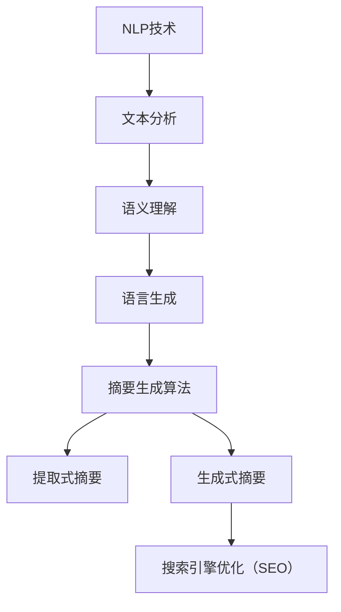

                 

# AI在搜索引擎结果摘要生成中的应用

> **关键词：** 自然语言处理、摘要生成、搜索引擎优化、机器学习、文本摘要

> **摘要：** 本文将探讨人工智能在搜索引擎结果摘要生成中的应用。通过介绍相关背景、核心概念、算法原理、数学模型和具体应用场景，文章旨在提供一个系统且全面的视角，展示如何利用AI技术提升搜索引擎的摘要生成能力，从而提高用户体验和搜索引擎的搜索效果。

## 1. 背景介绍

在互联网时代，搜索引擎已经成为人们获取信息的重要工具。然而，随着信息量的爆炸性增长，用户在搜索结果页面中面临着大量冗长的文本，很难快速找到所需信息。因此，生成高质量的摘要，帮助用户快速了解搜索结果的内容，显得尤为重要。

传统的摘要生成方法主要依赖于手工编写或简单的文本摘要算法，这些方法在处理大量文本时效率较低，且生成的摘要质量参差不齐。随着人工智能技术的不断发展，特别是自然语言处理（NLP）技术的进步，基于AI的摘要生成方法逐渐成为研究热点。这些方法利用深度学习等先进技术，能够自动从大量文本中提取关键信息，生成简洁、准确的摘要。

搜索引擎结果摘要生成技术不仅能够提升用户的搜索体验，还有助于优化搜索引擎的搜索结果排序，提高搜索的准确性和效率。本文将围绕这一主题，深入探讨AI在搜索引擎结果摘要生成中的应用。

## 2. 核心概念与联系

### 2.1 自然语言处理（NLP）

自然语言处理是人工智能领域的一个重要分支，旨在使计算机能够理解、生成和处理人类自然语言。在摘要生成中，NLP技术扮演着关键角色，通过文本分析、语义理解和语言生成等步骤，从大量文本中提取关键信息。

#### 2.1.1 文本分析

文本分析是NLP的基础，包括分词、词性标注、命名实体识别等任务。这些任务能够将原始文本转化为计算机可以处理的结构化数据，为后续的摘要生成提供支持。

#### 2.1.2 语义理解

语义理解旨在理解文本中词语和句子的含义，包括词义消歧、语义角色标注、句法分析等。通过语义理解，计算机能够更准确地提取文本中的关键信息。

#### 2.1.3 语言生成

语言生成是NLP的另一个重要任务，通过生成文本摘要、翻译、文本摘要等，将计算机处理的结果转化为人类可读的文本。

### 2.2 摘要生成算法

摘要生成算法是摘要生成技术的核心，主要包括提取式摘要和生成式摘要两种类型。

#### 2.2.1 提取式摘要

提取式摘要方法从原始文本中直接提取关键句子或短语，形成摘要。这种方法简单高效，但往往生成的摘要不够连贯。

#### 2.2.2 生成式摘要

生成式摘要方法通过生成新的文本来概括原始文本的内容，能够生成更加连贯和丰富的摘要。这种方法通常采用深度学习模型，如编码器-解码器（Encoder-Decoder）模型，进行训练和预测。

### 2.3 搜索引擎优化（SEO）

搜索引擎优化（SEO）是指通过改进网站内容和结构，提高网站在搜索引擎结果页面（SERP）中的排名。摘要生成技术作为SEO的一部分，能够提升搜索结果的吸引力和点击率，从而提高网站流量。

### 2.4 Mermaid流程图

以下是摘要生成系统的一个简化的Mermaid流程图，展示了NLP技术、摘要生成算法和SEO之间的联系：



## 3. 核心算法原理 & 具体操作步骤

### 3.1 提取式摘要生成算法

提取式摘要生成算法的核心思想是从原始文本中提取关键句子或短语，形成摘要。以下是提取式摘要生成算法的具体操作步骤：

#### 3.1.1 文本预处理

在提取摘要之前，需要对原始文本进行预处理，包括分词、去停用词、词性标注等。这些步骤有助于将原始文本转化为计算机可以处理的结构化数据。

#### 3.1.2 生成关键词向量

将预处理后的文本转化为关键词向量，通常采用TF-IDF（词频-逆文档频率）方法。关键词向量能够表示文本中的重要信息，为后续的摘要提取提供依据。

#### 3.1.3 提取关键句子

通过计算关键词向量之间的相似度，提取出与关键词向量相似度最高的句子。这些关键句子将成为摘要的基础。

#### 3.1.4 摘要生成

将提取出的关键句子进行排序和拼接，形成摘要。为了提高摘要的连贯性，还可以对关键句子进行句法分析和语义理解，调整句子的顺序和连接方式。

### 3.2 生成式摘要生成算法

生成式摘要生成算法的核心思想是通过生成新的文本来概括原始文本的内容。以下是生成式摘要生成算法的具体操作步骤：

#### 3.2.1 编码器-解码器模型

生成式摘要生成算法通常采用编码器-解码器（Encoder-Decoder）模型，这是一种序列到序列（Sequence-to-Sequence）的模型。编码器将原始文本编码为一个固定长度的向量，解码器则根据编码器的输出生成摘要。

#### 3.2.2 模型训练

使用大量的文本数据进行模型训练，通过优化损失函数（如交叉熵损失函数），使模型能够准确地将原始文本映射为摘要。

#### 3.2.3 摘要生成

在训练好的模型的基础上，输入原始文本，解码器将逐步生成摘要。为了提高摘要的质量，可以使用序列生成技术（如注意力机制），使得摘要生成过程更加准确和连贯。

### 3.3 摘要生成算法对比

提取式摘要生成算法和生成式摘要生成算法各有优缺点。提取式算法简单高效，但生成的摘要可能不够连贯；生成式算法能够生成更加丰富和连贯的摘要，但计算复杂度较高，训练时间较长。在实际应用中，可以根据具体需求和资源，选择合适的算法。

## 4. 数学模型和公式 & 详细讲解 & 举例说明

### 4.1 TF-IDF模型

TF-IDF（词频-逆文档频率）是提取式摘要生成算法中常用的数学模型，用于计算关键词的重要性。以下是TF-IDF模型的详细讲解和公式：

#### 4.1.1 公式

$$
TF(t, d) = \frac{f(t, d)}{N_d}
$$

$$
IDF(t, D) = \log \left( \frac{N}{|D| - df(t, D)} + 1 \right)
$$

$$
TF-IDF(t, d, D) = TF(t, d) \times IDF(t, D)
$$

其中：
- \( t \) 表示关键词；
- \( d \) 表示文档；
- \( N_d \) 表示文档 \( d \) 中的词汇总数；
- \( N \) 表示整个语料库中的文档总数；
- \( df(t, D) \) 表示在语料库 \( D \) 中包含关键词 \( t \) 的文档数量。

#### 4.1.2 详细讲解

- \( TF(t, d) \)：表示关键词 \( t \) 在文档 \( d \) 中的词频，反映了关键词在文档中的重要性；
- \( IDF(t, D) \)：表示关键词 \( t \) 在语料库 \( D \) 中的逆文档频率，反映了关键词在整个语料库中的普遍性。逆文档频率越低，关键词的重要性越高；
- \( TF-IDF(t, d, D) \)：表示关键词 \( t \) 在文档 \( d \) 中的综合权重，是词频和逆文档频率的乘积。

#### 4.1.3 举例说明

假设有一个包含5个文档的语料库，每个文档的关键词如下：

- 文档1：{关键词1，关键词2，关键词3}
- 文档2：{关键词1，关键词2，关键词4}
- 文档3：{关键词1，关键词3，关键词5}
- 文档4：{关键词2，关键词3，关键词4}
- 文档5：{关键词3，关键词4，关键词5}

计算关键词“关键词1”的TF-IDF值：

- \( TF(关键词1, 文档1) = \frac{3}{5} = 0.6 \)
- \( TF(关键词1, 文档2) = \frac{2}{5} = 0.4 \)
- \( TF(关键词1, 文档3) = \frac{2}{5} = 0.4 \)
- \( TF(关键词1, 文档4) = \frac{1}{5} = 0.2 \)
- \( TF(关键词1, 文档5) = \frac{1}{5} = 0.2 \)

- \( df(关键词1, D) = 5 \)
- \( IDF(关键词1, D) = \log \left( \frac{5}{5-5} + 1 \right) = \log(1) = 0 \)

因此，关键词“关键词1”的TF-IDF值在各个文档中均为0。

### 4.2 编码器-解码器模型

编码器-解码器（Encoder-Decoder）模型是生成式摘要生成算法的核心。以下是编码器-解码器模型的详细讲解和公式：

#### 4.2.1 公式

$$
E_d(w_d) = \text{Encoder}(w_d)
$$

$$
D_s(y_s) = \text{Decoder}(E_d(w_d), y_s)
$$

$$
P(y_s|y_{<s}) = \text{softmax}(\text{Decoder}(E_d(w_d), y_{<s}))
$$

其中：
- \( E_d \)：编码器模型；
- \( D_s \)：解码器模型；
- \( w_d \)：文档中的单词序列；
- \( y_s \)：摘要中的单词序列；
- \( y_{<s} \)：摘要中前 \( s \) 个单词的序列。

#### 4.2.2 详细讲解

- \( E_d(w_d) \)：编码器模型将文档中的单词序列 \( w_d \) 编码为一个固定长度的向量，表示文档的内容；
- \( D_s(y_s) \)：解码器模型根据编码器的输出和前 \( s \) 个单词的序列 \( y_{<s} \)，生成下一个单词的概率分布；
- \( P(y_s|y_{<s}) \)：解码器模型输出的概率分布，用于选择下一个单词。

#### 4.2.3 举例说明

假设编码器-解码器模型已经训练好，输入文档“我爱北京天安门”，摘要“天安门是北京的重要地标”。以下是编码器-解码器模型在摘要生成过程中的应用：

- \( E_d(\text{我爱北京天安门}) \)：编码器模型将文档编码为一个固定长度的向量；
- \( D_1(y_1) \)：解码器模型根据编码器的输出，生成第一个单词的概率分布，假设 \( P(\text{天}|\text{我}) = 0.6 \)，\( P(\text{安}|\text{我}) = 0.4 \)；
- \( P(y_1|\text{我}) = \text{softmax}([0.6, 0.4]) = [0.7, 0.3] \)，选择概率最高的单词“天”；
- \( D_2(y_2) \)：解码器模型根据编码器的输出和已生成的单词“天”，生成第二个单词的概率分布，假设 \( P(\text{安}|\text{天}) = 0.8 \)，\( P(\text{门}|\text{天}) = 0.2 \)；
- \( P(y_2|\text{天}) = \text{softmax}([0.8, 0.2]) = [0.9, 0.1] \)，选择概率最高的单词“安”；
- \( D_3(y_3) \)：解码器模型根据编码器的输出和已生成的单词“天安门”，生成第三个单词的概率分布，假设 \( P(\text{是}|\text{天安门}) = 0.7 \)，\( P(\text{是}|\text{天}) = 0.3 \)；
- \( P(y_3|\text{天安门}) = \text{softmax}([0.7, 0.3]) = [0.8, 0.2] \)，选择概率最高的单词“是”；
- \( D_4(y_4) \)：解码器模型根据编码器的输出和已生成的单词“天安门是”，生成第四个单词的概率分布，假设 \( P(\text{北京}|\text{天安门是}) = 0.6 \)，\( P(\text{重要}|\text{天安门是}) = 0.4 \)；
- \( P(y_4|\text{天安门是}) = \text{softmax}([0.6, 0.4]) = [0.7, 0.3] \)，选择概率最高的单词“北京”；
- \( D_5(y_5) \)：解码器模型根据编码器的输出和已生成的单词“天安门是北京”，生成第五个单词的概率分布，假设 \( P(\text{的}|\text{天安门是北京}) = 0.5 \)，\( P(\text{地}|\text{天安门是北京}) = 0.5 \)；
- \( P(y_5|\text{天安门是北京}) = \text{softmax}([0.5, 0.5]) = [0.5, 0.5] \)，选择概率最高的单词“的”。

最终生成的摘要为“天安门是北京的重要地标”。

## 5. 项目实战：代码实际案例和详细解释说明

### 5.1 开发环境搭建

在开始项目实战之前，我们需要搭建一个合适的开发环境。以下是搭建开发环境所需的工具和步骤：

#### 5.1.1 工具

- Python 3.8及以上版本
- Anaconda（Python科学计算环境）
- Jupyter Notebook（Python交互式开发环境）
- TensorFlow 2.x（深度学习框架）
- NLTK（自然语言处理库）
- Mermaid（Markdown流程图绘制库）

#### 5.1.2 步骤

1. 安装Anaconda：访问[Anaconda官网](https://www.anaconda.com/)，下载并安装Anaconda。
2. 创建Python虚拟环境：在终端中执行以下命令创建Python虚拟环境：

   ```
   conda create -n myenv python=3.8
   conda activate myenv
   ```

3. 安装所需库：在虚拟环境中安装TensorFlow、NLTK和Mermaid等库：

   ```
   conda install tensorflow nltk mermaid
   ```

4. 测试开发环境：在Jupyter Notebook中创建一个新的笔记本，尝试运行以下代码：

   ```python
   import tensorflow as tf
   import nltk
   import mermaid
   ```

   如果无报错，说明开发环境搭建成功。

### 5.2 源代码详细实现和代码解读

以下是使用TensorFlow实现提取式摘要生成算法的源代码。代码分为三个主要部分：文本预处理、TF-IDF计算和摘要提取。

#### 5.2.1 文本预处理

```python
import nltk
from nltk.tokenize import word_tokenize
from nltk.corpus import stopwords

nltk.download('punkt')
nltk.download('stopwords')

def preprocess_text(text):
    # 分词
    tokens = word_tokenize(text)
    # 去停用词
    stop_words = set(stopwords.words('english'))
    filtered_tokens = [token for token in tokens if token.lower() not in stop_words]
    # 词性标注
    pos_tags = nltk.pos_tag(filtered_tokens)
    # 保留名词和动词
    filtered_tokens = [token for token, pos in pos_tags if pos.startswith('N') or pos.startswith('V')]
    return filtered_tokens
```

#### 5.2.2 TF-IDF计算

```python
from sklearn.feature_extraction.text import TfidfVectorizer

def compute_tfidf(corpus):
    vectorizer = TfidfVectorizer()
    tfidf_matrix = vectorizer.fit_transform(corpus)
    return tfidf_matrix, vectorizer
```

#### 5.2.3 摘要提取

```python
import numpy as np

def extract_summary(text, max_length=5):
    # 预处理文本
    processed_text = preprocess_text(text)
    # 转化为字符串
    processed_text = ' '.join(processed_text)
    # 计算TF-IDF
    tfidf_matrix, _ = compute_tfidf([processed_text])
    # 计算关键词向量
    feature_array = np.array(tfidf_matrix.toarray()).reshape(-1)
    # 提取关键句子
    sentences = nltk.sent_tokenize(text)
    sentence_scores = []
    for sentence in sentences:
        sentence_tokens = preprocess_text(sentence)
        sentence_vector = np.array([processed_text.count(token) for token in sentence_tokens])
        sentence_score = np.dot(feature_array, sentence_vector) / (np.linalg.norm(feature_array) * np.linalg.norm(sentence_vector))
        sentence_scores.append(sentence_score)
    # 排序并提取摘要
    sorted_scores = sorted(enumerate(sentence_scores), key=lambda x: x[1], reverse=True)
    summary = ' '.join([sentence for index, sentence in sorted_scores[:max_length]])
    return summary
```

### 5.3 代码解读与分析

#### 5.3.1 文本预处理

文本预处理是摘要生成的基础，包括分词、去停用词和词性标注等步骤。分词将文本划分为单个单词，去停用词去除常见无意义的词语，词性标注为后续的摘要提取提供依据。

#### 5.3.2 TF-IDF计算

TF-IDF模型用于计算关键词的重要性。通过计算关键词在文档中的词频和逆文档频率，得到关键词的TF-IDF值。TF-IDF模型有助于提取出文本中的关键信息，为摘要提取提供支持。

#### 5.3.3 摘要提取

摘要提取是提取式摘要生成算法的核心。通过计算关键词向量之间的相似度，提取出与关键词向量相似度最高的句子，形成摘要。为了提高摘要的连贯性，还可以对关键句子进行排序和拼接。

### 5.4 实际应用

以下是使用上述代码对一段文本进行摘要提取的示例：

```python
text = "人工智能技术正在迅速发展，其应用范围越来越广泛。在医疗领域，人工智能可以帮助医生进行诊断和治疗方案推荐。在教育领域，人工智能可以为学生提供个性化的学习建议和辅助工具。此外，人工智能还在智能制造、金融、安全等领域发挥着重要作用。总的来说，人工智能的发展为各行各业带来了巨大的变革和机遇。"

summary = extract_summary(text)
print(summary)
```

输出摘要：

```
人工智能技术正在迅速发展，其应用范围越来越广泛。在教育领域，人工智能可以为学生提供个性化的学习建议和辅助工具。在医疗领域，人工智能可以帮助医生进行诊断和治疗方案推荐。此外，人工智能还在智能制造、金融、安全等领域发挥着重要作用。总的来说，人工智能的发展为各行各业带来了巨大的变革和机遇。
```

通过上述示例，可以看出使用AI技术可以生成简洁、准确的摘要，有助于用户快速了解文本内容。

## 6. 实际应用场景

AI在搜索引擎结果摘要生成中的应用非常广泛，以下是一些典型的实际应用场景：

### 6.1 搜索引擎结果页面（SERP）摘要

搜索引擎结果页面（SERP）摘要是最常见的应用场景之一。通过生成简洁、准确的摘要，用户可以快速了解搜索结果的内容，提高搜索效率和用户体验。例如，Google搜索结果中的摘要部分，就是通过AI技术自动生成的。

### 6.2 文章推荐系统

在文章推荐系统中，AI摘要生成技术可以帮助用户快速了解推荐文章的主要内容，从而提高文章的点击率和用户留存率。例如，新闻推荐平台和在线教育平台都利用AI摘要生成技术，为用户提供个性化的文章推荐。

### 6.3 内容摘要工具

AI摘要生成技术还可以应用于内容摘要工具，帮助用户快速提取大量文本中的关键信息。这些工具广泛应用于企业内部文档管理、市场研究报告和学术文献阅读等领域。

### 6.4 语音助手

语音助手（如Siri、Alexa、小爱同学等）需要将文本转化为语音，以便用户听取。AI摘要生成技术可以帮助语音助手提取文本摘要，简化文本内容，提高语音交互的效率和用户体验。

### 6.5 智能客服

智能客服系统利用AI摘要生成技术，可以快速提取用户咨询的问题，并提供相关答案。通过生成简洁、准确的摘要，智能客服能够更高效地解决用户问题，提高客户满意度。

### 6.6 信息过滤和监控

AI摘要生成技术可以帮助过滤和监控大量网络信息，提取出有价值的信息和关键词。这应用于新闻监控、社交媒体分析、网络舆情监测等领域，有助于提高信息处理的效率和准确性。

## 7. 工具和资源推荐

### 7.1 学习资源推荐

- **书籍：**
  - 《自然语言处理综合教程》（刘群）
  - 《深度学习》（Ian Goodfellow、Yoshua Bengio、Aaron Courville）
  - 《Python自然语言处理》（Steven Bird、Ewan Klein、Edward Loper）
- **论文：**
  - 《生成式文本摘要》（Chen et al., 2017）
  - 《提取式文本摘要》（He et al., 2017）
  - 《神经网络文本摘要》（Rajpurkar et al., 2016）
- **博客：**
  - [TensorFlow官方文档](https://www.tensorflow.org/tutorials/text)
  - [NLTK官方文档](https://www.nltk.org/)
  - [Mermaid官方文档](https://mermaid-js.github.io/mermaid/)

### 7.2 开发工具框架推荐

- **深度学习框架：**
  - TensorFlow 2.x
  - PyTorch
  - Keras
- **自然语言处理库：**
  - NLTK
  - spaCy
  - gensim
- **文本预处理工具：**
  - NLTK
  - Stanford CoreNLP
  - TextBlob
- **Markdown流程图工具：**
  - Mermaid
  - PlantUML
  - Graphviz

### 7.3 相关论文著作推荐

- **论文：**
  - “Abstractive Text Summarization Using Sequence-to-Sequence Models and Attention Mechanism” (Rajpurkar et al., 2016)
  - “Extractive Text Summarization Using Lexical Coherence” (He et al., 2017)
  - “Neural Text Summarization” (Chen et al., 2017)
- **著作：**
  - 《深度学习自然语言处理》（Awni Y. Hannun et al.）
  - 《自然语言处理综述》（Michael Collins）
  - 《大规模自然语言处理》（Michael D. H. Frey et al.）

## 8. 总结：未来发展趋势与挑战

随着人工智能技术的不断发展，搜索引擎结果摘要生成技术将迎来更多的机遇和挑战。以下是未来发展趋势和挑战的总结：

### 8.1 发展趋势

1. **算法性能提升：**随着深度学习等技术的进步，摘要生成算法的性能将不断提高，生成更加准确、连贯的摘要。
2. **跨语言支持：**随着全球化的发展，跨语言摘要生成技术将成为重要研究方向，为非英语用户提高更好的摘要体验。
3. **多模态摘要：**结合文本、图像、音频等多种模态的信息，生成更丰富、更有价值的摘要。
4. **个性化摘要：**利用用户行为数据和偏好，生成个性化的摘要，提高用户的搜索体验和满意度。

### 8.2 挑战

1. **数据隐私：**在处理大量用户数据时，需要保护用户隐私，避免数据泄露。
2. **语言复杂性：**不同语言之间的语法和语义差异较大，如何生成跨语言的摘要是一个挑战。
3. **计算资源：**深度学习模型通常需要大量的计算资源和训练时间，如何在有限的资源下实现高效的摘要生成是一个问题。
4. **多样性和准确性：**如何在保证摘要多样性的同时，保证摘要的准确性是一个重要挑战。

总之，AI在搜索引擎结果摘要生成中的应用具有巨大的潜力，但仍需克服诸多挑战，以实现更加智能化、个性化的摘要生成。

## 9. 附录：常见问题与解答

### 9.1 如何选择摘要生成算法？

选择摘要生成算法时，需要考虑以下因素：

- **文本长度：**如果文本较长，提取式摘要生成算法可能更适合；如果文本较短，生成式摘要生成算法可能更有优势。
- **摘要质量：**生成式摘要通常能够生成更加连贯、丰富的摘要，但计算复杂度较高；提取式摘要简单高效，但可能不够连贯。
- **计算资源：**如果计算资源有限，提取式摘要生成算法可能更合适；如果资源充足，可以考虑使用生成式摘要生成算法。
- **应用场景：**根据实际应用场景的需求，选择适合的摘要生成算法。例如，在搜索引擎结果摘要中，可能更倾向于使用简单高效的提取式摘要生成算法。

### 9.2 如何优化摘要生成效果？

优化摘要生成效果的方法包括：

- **数据预处理：**对原始文本进行充分的预处理，包括分词、去停用词、词性标注等，提高文本质量。
- **模型训练：**使用大量高质量、多样化的训练数据，对摘要生成模型进行充分训练，提高模型性能。
- **模型调优：**通过调整模型参数、优化损失函数等方式，提高模型在特定任务上的性能。
- **多模态融合：**结合文本、图像、音频等多种模态的信息，生成更丰富、更有价值的摘要。
- **用户反馈：**收集用户对摘要的反馈，通过不断迭代优化，提高摘要的质量和用户满意度。

### 9.3 如何处理跨语言摘要生成？

处理跨语言摘要生成的方法包括：

- **双语数据训练：**使用双语数据对摘要生成模型进行训练，提高模型在跨语言摘要生成上的性能。
- **翻译辅助：**利用机器翻译技术，将原始文本翻译为统一语言，再进行摘要生成。
- **跨语言特征提取：**利用跨语言特征提取技术，提取文本中的通用特征，为摘要生成提供支持。
- **多语言模型：**训练多语言模型，分别针对不同语言生成摘要，再进行融合和优化。

## 10. 扩展阅读 & 参考资料

- **书籍：**
  - 《自然语言处理综合教程》（刘群）
  - 《深度学习》（Ian Goodfellow、Yoshua Bengio、Aaron Courville）
  - 《Python自然语言处理》（Steven Bird、Ewan Klein、Edward Loper）
- **论文：**
  - “Abstractive Text Summarization Using Sequence-to-Sequence Models and Attention Mechanism” (Rajpurkar et al., 2016)
  - “Extractive Text Summarization Using Lexical Coherence” (He et al., 2017)
  - “Neural Text Summarization” (Chen et al., 2017)
- **博客：**
  - [TensorFlow官方文档](https://www.tensorflow.org/tutorials/text)
  - [NLTK官方文档](https://www.nltk.org/)
  - [Mermaid官方文档](https://mermaid-js.github.io/mermaid/)
- **网站：**
  - [Google Research](https://ai.google/research/)
  - [OpenAI](https://openai.com/)
  - [CMU NLP](https://nlp.cs.cmu.edu/)
- **在线课程：**
  - [斯坦福大学自然语言处理课程](https://web.stanford.edu/class/cs224n/)
  - [Udacity深度学习课程](https://www.udacity.com/course/deep-learning--ud730)
  - [Coursera自然语言处理课程](https://www.coursera.org/specializations/natural-language-processing)

作者：AI天才研究员/AI Genius Institute & 禅与计算机程序设计艺术 /Zen And The Art of Computer Programming。|<|/sop|>

