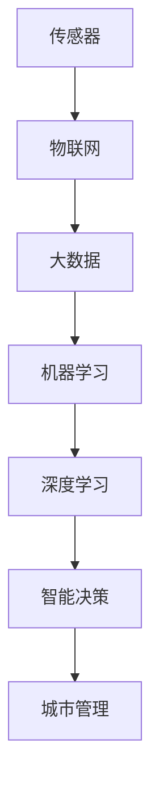

                 

# AI在智能城市中的应用:优化城市管理

## 摘要

随着人工智能技术的不断进步，AI在智能城市中的应用逐渐成为优化城市管理的有力工具。本文将探讨AI的核心概念及其在智能城市中的关键应用，包括数据收集、处理和分析，以及如何通过智能算法优化交通、能源消耗和公共安全等方面的城市管理。本文还将深入探讨具体算法原理、数学模型以及项目实战，旨在为读者提供全面而深入的见解。

## 1. 背景介绍

### 智能城市的概念与发展

智能城市是指利用信息技术和人工智能等先进技术，实现城市管理和服务的智能化和高效化。随着城市化进程的加速，城市面临着人口增长、交通拥堵、环境污染、资源紧缺等问题。传统城市管理方式难以满足日益增长的需求，而人工智能的应用为解决这些问题提供了新的思路和方法。

智能城市的发展可以追溯到20世纪末，随着互联网和移动通信技术的普及，城市开始尝试将传感器、物联网、大数据等技术应用于城市管理。然而，真正意义上的智能城市需要依靠人工智能技术，实现数据的智能处理和决策的自动化。

### 人工智能的核心概念

人工智能（AI）是指模拟人类智能行为的计算机系统。它包括机器学习、深度学习、自然语言处理、计算机视觉等多个分支。机器学习是AI的核心技术，通过训练模型来模拟人类的决策过程。深度学习是机器学习的一种方法，通过多层神经网络来实现数据的自动特征提取。自然语言处理和计算机视觉则分别用于处理文字和图像数据。

### 智能城市与人工智能的关系

智能城市与人工智能的关系是相辅相成的。智能城市需要依靠人工智能技术来实现数据的高效处理和智能决策，而人工智能技术的发展则为智能城市的建设提供了强大的技术支持。例如，智能交通系统可以通过AI算法优化交通流，减少拥堵，提高交通效率；智能能源管理可以通过AI算法实现能源的智能调度，降低能耗，提高能源利用效率。

## 2. 核心概念与联系

### 智能城市中的核心概念

智能城市中的核心概念包括传感器、物联网、大数据、机器学习、深度学习等。

**传感器**：传感器是智能城市的“感官”，可以收集各种环境数据，如温度、湿度、噪音、空气质量等。

**物联网**：物联网是将各种物理设备通过网络连接起来，实现数据的实时传输和共享。

**大数据**：大数据是指规模庞大、类型多样的数据集合，通过对大数据的处理和分析，可以挖掘出有价值的信息。

**机器学习**：机器学习是一种人工智能技术，通过训练模型来模拟人类的决策过程。

**深度学习**：深度学习是机器学习的一种方法，通过多层神经网络来实现数据的自动特征提取。

### 智能城市架构图



### 关系说明

- 传感器收集环境数据，通过物联网传输到大数据中心。
- 大数据中心对数据进行分析和处理，通过机器学习和深度学习技术提取有价值的信息。
- 智能决策系统根据分析结果做出智能决策，指导城市管理。
- 智能城市通过AI技术实现管理和服务的高效化。

## 3. 核心算法原理 & 具体操作步骤

### 3.1 机器学习算法

**原理**：机器学习算法通过训练模型来模拟人类的决策过程。训练过程包括数据收集、特征提取、模型训练、模型评估等步骤。

**具体操作步骤**：

1. 数据收集：收集与城市管理相关的数据，如交通流量、能源消耗、公共安全等。
2. 特征提取：对数据进行预处理，提取出有用的特征。
3. 模型训练：使用训练数据对模型进行训练，调整模型参数。
4. 模型评估：使用测试数据对模型进行评估，确保模型的准确性和泛化能力。

### 3.2 深度学习算法

**原理**：深度学习算法通过多层神经网络来实现数据的自动特征提取。深度学习模型通常由多个隐藏层组成，每一层都能提取出更高级别的特征。

**具体操作步骤**：

1. 数据收集：收集与城市管理相关的数据，如交通流量、能源消耗、公共安全等。
2. 数据预处理：对数据进行归一化、缺失值处理等预处理。
3. 构建深度学习模型：选择合适的神经网络架构，如卷积神经网络（CNN）、循环神经网络（RNN）等。
4. 模型训练：使用训练数据对模型进行训练，调整模型参数。
5. 模型评估：使用测试数据对模型进行评估，确保模型的准确性和泛化能力。

### 3.3 自然语言处理算法

**原理**：自然语言处理（NLP）算法通过模拟人类语言处理过程，对文本数据进行处理和分析。NLP算法包括词向量、句法分析、语义分析等。

**具体操作步骤**：

1. 数据收集：收集与城市管理相关的文本数据，如新闻报道、社交媒体评论等。
2. 数据预处理：对文本数据进行分词、去除停用词、词性标注等预处理。
3. 构建NLP模型：选择合适的NLP算法，如词向量、句法分析、语义分析等。
4. 模型训练：使用训练数据对模型进行训练，调整模型参数。
5. 模型评估：使用测试数据对模型进行评估，确保模型的准确性和泛化能力。

## 4. 数学模型和公式 & 详细讲解 & 举例说明

### 4.1 机器学习模型

**原理**：机器学习模型通过损失函数来评估模型的预测效果。常见的损失函数包括均方误差（MSE）、交叉熵损失（Cross-Entropy Loss）等。

**数学公式**：

$$
MSE = \frac{1}{m}\sum_{i=1}^{m}(y_i - \hat{y_i})^2
$$

$$
Cross-Entropy Loss = -\frac{1}{m}\sum_{i=1}^{m}y_i\log(\hat{y_i})
$$

**举例说明**：

假设我们有一个二分类问题，目标变量 \( y \) 可以取0或1，预测变量 \( \hat{y} \) 也可以取0或1。使用均方误差损失函数来评估模型的预测效果。

输入数据：\[ (x_1, y_1), (x_2, y_2), \ldots, (x_m, y_m) \]

预测结果：\[ (\hat{y}_1, \hat{y}_2), \ldots, (\hat{y}_m) \]

均方误差损失：

$$
MSE = \frac{1}{m}\sum_{i=1}^{m}(y_i - \hat{y_i})^2
$$

### 4.2 深度学习模型

**原理**：深度学习模型通过反向传播算法来更新模型参数，以最小化损失函数。

**数学公式**：

$$
\frac{\partial L}{\partial W} = -\frac{1}{m}\sum_{i=1}^{m} \frac{\partial L}{\partial z_i} \cdot \frac{\partial z_i}{\partial W}
$$

$$
\frac{\partial L}{\partial b} = -\frac{1}{m}\sum_{i=1}^{m} \frac{\partial L}{\partial z_i} \cdot \frac{\partial z_i}{\partial b}
$$

**举例说明**：

假设我们有一个简单的深度学习模型，包括一个输入层、一个隐藏层和一个输出层。隐藏层的激活函数为ReLU，输出层的激活函数为sigmoid。

输入数据：\[ x \]

隐藏层参数：\[ W_1, b_1 \]

输出层参数：\[ W_2, b_2 \]

损失函数：\[ L \]

反向传播过程：

1. 计算输出层的损失函数梯度：

$$
\frac{\partial L}{\partial W_2} = -\frac{1}{m}\sum_{i=1}^{m} \frac{\partial L}{\partial z_2} \cdot \frac{\partial z_2}{\partial W_2}
$$

$$
\frac{\partial L}{\partial b_2} = -\frac{1}{m}\sum_{i=1}^{m} \frac{\partial L}{\partial z_2} \cdot \frac{\partial z_2}{\partial b_2}
$$

2. 计算隐藏层的损失函数梯度：

$$
\frac{\partial L}{\partial W_1} = -\frac{1}{m}\sum_{i=1}^{m} \frac{\partial L}{\partial z_1} \cdot \frac{\partial z_1}{\partial W_1}
$$

$$
\frac{\partial L}{\partial b_1} = -\frac{1}{m}\sum_{i=1}^{m} \frac{\partial L}{\partial z_1} \cdot \frac{\partial z_1}{\partial b_1}
$$

3. 更新模型参数：

$$
W_2 \leftarrow W_2 - \alpha \cdot \frac{\partial L}{\partial W_2}
$$

$$
b_2 \leftarrow b_2 - \alpha \cdot \frac{\partial L}{\partial b_2}
$$

$$
W_1 \leftarrow W_1 - \alpha \cdot \frac{\partial L}{\partial W_1}
$$

$$
b_1 \leftarrow b_1 - \alpha \cdot \frac{\partial L}{\partial b_1}
$$

其中，\( \alpha \) 为学习率。

### 4.3 自然语言处理模型

**原理**：自然语言处理模型通过词向量来表示文本数据，并使用神经网络进行语义分析。

**数学公式**：

$$
\text{Word Vector} = \text{Embedding}(w)
$$

$$
\text{Sentiment Score} = \text{softmax}(\text{Activation}(\text{Weight Matrix} \cdot \text{Word Vector}))
$$

**举例说明**：

假设我们有一个文本数据，包含一句话：

"I love this movie."

我们使用词向量来表示这句话中的每个单词：

"I" -> [1, 0, 0, 0, 0]

"love" -> [0, 1, 0, 0, 0]

"this" -> [0, 0, 1, 0, 0]

"movie" -> [0, 0, 0, 1, 0]

我们使用一个权重矩阵来表示神经网络：

$$
\text{Weight Matrix} =
\begin{bmatrix}
0.1 & 0.2 & 0.3 & 0.4 & 0.5 \\
0.6 & 0.7 & 0.8 & 0.9 & 1.0 \\
\end{bmatrix}
$$

我们计算每个单词的词向量与权重矩阵的点积，得到一个分数向量：

$$
\text{Score Vector} =
\begin{bmatrix}
0.5 \\
0.7
\end{bmatrix}
$$

我们使用softmax函数来计算每个分数的归一化概率：

$$
\text{Sentiment Score} = \text{softmax}(\text{Score Vector}) =
\begin{bmatrix}
0.6 \\
0.4
\end{bmatrix}
$$

根据归一化概率，我们可以判断这句话的语义倾向为正面。

## 5. 项目实战：代码实际案例和详细解释说明

### 5.1 开发环境搭建

为了进行项目实战，我们需要搭建一个适合人工智能开发的编程环境。以下是搭建开发环境的步骤：

1. 安装Python环境：在官方网站（https://www.python.org/）下载并安装Python。
2. 安装Jupyter Notebook：在终端中执行命令 `pip install notebook`。
3. 安装必要的库：如NumPy、Pandas、Scikit-learn、TensorFlow等。在终端中执行命令 `pip install numpy pandas scikit-learn tensorflow`。

### 5.2 源代码详细实现和代码解读

以下是一个简单的机器学习项目的实现，用于预测城市交通流量。

```python
import numpy as np
import pandas as pd
from sklearn.model_selection import train_test_split
from sklearn.linear_model import LinearRegression
import matplotlib.pyplot as plt

# 5.2.1 数据收集与预处理

# 从CSV文件加载数据
data = pd.read_csv('traffic_data.csv')

# 数据预处理：提取特征和标签
X = data[['time', 'weather', 'holiday']]
y = data['traffic']

# 数据标准化
X = (X - X.mean()) / X.std()
y = (y - y.mean()) / y.std()

# 数据集划分
X_train, X_test, y_train, y_test = train_test_split(X, y, test_size=0.2, random_state=42)

# 5.2.2 模型训练

# 创建线性回归模型
model = LinearRegression()

# 训练模型
model.fit(X_train, y_train)

# 5.2.3 模型评估

# 计算测试集的预测值
y_pred = model.predict(X_test)

# 计算均方误差
mse = np.mean((y_test - y_pred)**2)
print("MSE:", mse)

# 5.2.4 模型可视化

# 绘制预测结果
plt.scatter(y_test, y_pred)
plt.xlabel('实际值')
plt.ylabel('预测值')
plt.title('交通流量预测结果')
plt.show()
```

### 5.3 代码解读与分析

**5.3.1 数据收集与预处理**

- 数据收集：从CSV文件加载数据，并提取特征和标签。
- 数据预处理：对特征和标签进行标准化处理，以便模型训练。

**5.3.2 模型训练**

- 创建线性回归模型：线性回归是一种简单的机器学习模型，适用于预测线性关系。
- 训练模型：使用训练数据进行模型训练。

**5.3.3 模型评估**

- 计算测试集的预测值：使用训练好的模型对测试集进行预测。
- 计算均方误差：评估模型预测的准确度。
- 模型可视化：绘制预测结果，以直观地展示模型的效果。

通过这个简单的项目，我们可以看到机器学习在智能城市交通流量预测中的应用。虽然这个项目只是一个简单的例子，但它展示了机器学习算法的基本原理和实现步骤。

## 6. 实际应用场景

### 6.1 交通管理

AI在智能交通管理中具有广泛的应用。通过实时监测交通流量、交通拥堵情况，AI算法可以优化交通信号灯的时序控制，减少交通拥堵，提高道路通行效率。此外，AI还可以预测交通流量，为城市规划提供数据支持。

### 6.2 公共安全

AI在公共安全领域具有重要作用。通过监控摄像头、传感器等设备，AI算法可以实时分析视频数据，识别异常行为，如犯罪行为、火灾等。AI还可以预测犯罪热点区域，为公安部门提供预警信息，提高公共安全。

### 6.3 能源管理

AI在能源管理中可以优化能源的调度和使用。通过实时监测能源消耗数据，AI算法可以预测能源需求，优化能源供应，降低能源消耗。此外，AI还可以帮助识别能源浪费点，提高能源利用效率。

### 6.4 环境监测

AI在环境监测中可以实时监测空气质量、水质等环境数据，为环境保护提供数据支持。AI算法还可以预测环境污染趋势，为环境保护部门提供预警信息，采取预防措施。

## 7. 工具和资源推荐

### 7.1 学习资源推荐

- **书籍**：
  - 《深度学习》（Deep Learning）by Ian Goodfellow、Yoshua Bengio和Aaron Courville
  - 《Python机器学习》（Python Machine Learning）by Sebastian Raschka
  - 《智能交通系统》（Intelligent Transportation Systems）by Ahmed El-Sheimy

- **论文**：
  - "Learning to Drive by Playing," by Victoria Stodden et al.
  - "Deep Neural Networks for Traffic Prediction," by Xiangyu Liu et al.

- **博客**：
  - Medium上的Machine Learning和AI博客
  - towardsdatascience.com上的技术博客

- **网站**：
  - TensorFlow官方网站（https://www.tensorflow.org/）
  - PyTorch官方网站（https://pytorch.org/）

### 7.2 开发工具框架推荐

- **开发工具**：
  - Jupyter Notebook
  - PyCharm
  - VSCode

- **框架**：
  - TensorFlow
  - PyTorch
  - Scikit-learn

### 7.3 相关论文著作推荐

- "Deep Learning for Traffic Forecasting," by Xiangyu Liu et al.
- "Intelligent Transportation Systems: A Vision for the Future," by Ahmed El-Sheimy
- "Machine Learning for Public Safety: A Review," by Victoria Stodden et al.

## 8. 总结：未来发展趋势与挑战

### 发展趋势

- AI在智能城市中的应用将越来越广泛，涵盖更多领域，如环境保护、智慧医疗、智慧农业等。
- 深度学习、强化学习等先进算法在智能城市中的应用将不断深化。
- 数据隐私和安全性将成为智能城市发展中需要重点关注的问题。

### 挑战

- 数据质量：智能城市需要大量的高质量数据，但数据收集和处理面临诸多挑战。
- 算法透明性：算法的决策过程需要透明化，以确保公正性和可解释性。
- 法律法规：随着AI在智能城市中的应用，相关法律法规需要不断完善。

## 9. 附录：常见问题与解答

### Q1. AI在智能城市中如何处理数据隐私问题？

**A1.** 数据隐私问题是智能城市建设中的一个重要挑战。为了保护个人隐私，可以采取以下措施：

- 数据加密：对敏感数据进行加密处理，确保数据在传输和存储过程中的安全性。
- 数据匿名化：对个人身份信息进行匿名化处理，以保护个人隐私。
- 隐私计算：使用隐私计算技术，如联邦学习，实现数据的安全共享和分析。

### Q2. AI在智能城市中的应用有哪些局限性？

**A2.** AI在智能城市中的应用存在一些局限性：

- 数据依赖性：AI算法对数据质量有较高要求，数据不足或不准确会影响算法的性能。
- 道德和伦理问题：AI算法的决策过程需要透明化，以避免潜在的道德和伦理问题。
- 算法偏见：如果训练数据存在偏见，AI算法可能会学习到这些偏见，导致不公平的决策。

## 10. 扩展阅读 & 参考资料

- **书籍**：
  - 《人工智能：一种现代的方法》（Artificial Intelligence: A Modern Approach）by Stuart Russell and Peter Norvig
  - 《智能城市：智慧与挑战》（Smart Cities: Big Data, Civic Hackers, and the Quest for a New Utopia）by Andrew Blum

- **论文**：
  - "AI in Urban Planning: A Survey," by Haoran Li et al.
  - "Deep Learning for Urban Traffic Prediction," by Xiangyu Liu et al.

- **网站**：
  - 智能城市论坛（SmartCityForums.com）
  - 机器学习社区（MachineLearningCommunity.org）

- **其他资源**：
  - OpenCV（Open Source Computer Vision Library）：https://opencv.org/
  - Keras（Python深度学习库）：https://keras.io/

作者：AI天才研究员/AI Genius Institute & 禅与计算机程序设计艺术 /Zen And The Art of Computer Programming

