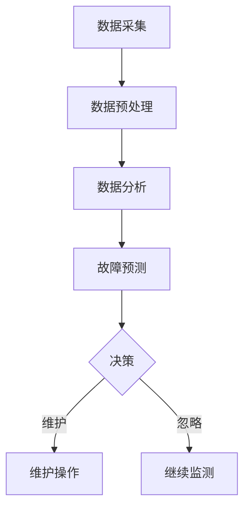

                 

# AI在智能建筑维护中的应用：预防性维护

> **关键词**：智能建筑、预防性维护、AI技术、数据分析、建筑运维

> **摘要**：本文探讨了人工智能技术在智能建筑维护中的重要作用，特别是预防性维护。文章从背景介绍、核心概念、算法原理、数学模型、实际应用、工具资源推荐等多个方面，详细阐述了AI技术在智能建筑维护中的应用及其前景和挑战。

## 1. 背景介绍

### 1.1 智能建筑的定义与特点

智能建筑是指通过集成建筑自动化系统、信息通信技术、物联网技术等，实现建筑物内各类设备、系统和资源的智能感知、自动控制和优化管理的现代化建筑。其特点主要体现在以下几个方面：

- **高效节能**：通过智能控制系统实现能源的优化利用，降低能源消耗。
- **安全便捷**：通过智能安防系统提高建筑物的安全性，提供便捷的住户服务。
- **舒适宜居**：通过智能环境控制系统提供舒适的居住环境，提升住户的居住体验。
- **智能化管理**：通过智能管理系统实现建筑物的自动化运行和维护，提高管理效率。

### 1.2 建筑维护的重要性

建筑维护是确保建筑物长期稳定运行的重要环节。传统的建筑维护方式主要是事后维修，即等到设备或系统出现故障后再进行修复。这种方式存在以下问题：

- **高成本**：故障发生后，往往需要大量的人力、物力和财力进行修复。
- **低效率**：故障发生后，可能会影响建筑物的正常使用，造成不必要的损失。
- **不可预测**：故障的发生往往具有不可预测性，难以提前进行预防。

随着人工智能技术的不断发展，预防性维护逐渐成为建筑维护的主要趋势。预防性维护通过实时监测建筑设备的状态，提前发现潜在故障，从而进行针对性的维护，避免故障的发生。

## 2. 核心概念与联系

### 2.1 预防性维护的概念

预防性维护是一种以预防为主、以检测为辅的维护方式。它通过定期对建筑设备进行检测、保养和维修，防止故障的发生。预防性维护的核心是状态监测和故障预测。

### 2.2 AI技术在预防性维护中的应用

AI技术在预防性维护中的应用主要体现在以下几个方面：

- **数据采集与分析**：通过传感器等设备实时采集建筑设备的状态数据，利用AI技术进行分析，识别异常状态。
- **故障预测**：利用历史数据和实时数据，通过机器学习算法预测建筑设备可能出现的故障，提前进行维护。
- **自动化控制**：利用AI技术实现建筑设备的自动化控制，提高维护效率。

### 2.3 Mermaid 流程图

以下是一个简单的Mermaid流程图，展示了预防性维护的流程：



## 3. 核心算法原理 & 具体操作步骤

### 3.1 数据采集与预处理

数据采集是预防性维护的第一步。常用的数据采集方式包括：

- **传感器采集**：通过安装在建筑设备上的传感器，实时采集温度、湿度、压力等参数。
- **网络采集**：通过物联网技术，实时获取建筑设备的运行状态。

数据采集后，需要对数据进行预处理，包括数据清洗、去噪和归一化等操作，以提高数据质量。

### 3.2 数据分析

数据分析是预防性维护的核心步骤。常用的数据分析方法包括：

- **时序分析**：通过分析设备运行数据的时序特征，识别设备的异常状态。
- **聚类分析**：将设备运行数据分为不同的类别，识别设备的潜在故障。
- **关联规则分析**：分析设备运行数据之间的关联关系，识别可能导致故障的因素。

### 3.3 故障预测

故障预测是预防性维护的关键步骤。常用的故障预测算法包括：

- **线性回归**：通过分析历史数据，建立设备故障的预测模型。
- **决策树**：通过分析历史数据，建立设备故障的决策规则。
- **支持向量机**：通过分析历史数据，建立设备故障的预测模型。

### 3.4 决策与维护操作

根据故障预测结果，进行相应的决策和操作。如果预测到设备可能出现故障，则进行预防性维护；如果预测到设备运行正常，则继续监测。

## 4. 数学模型和公式 & 详细讲解 & 举例说明

### 4.1 数学模型

预防性维护的数学模型主要包括以下几个方面：

- **状态监测模型**：通过分析设备运行数据的时序特征，建立状态监测模型。
- **故障预测模型**：通过分析历史数据和实时数据，建立故障预测模型。
- **决策模型**：根据故障预测结果，建立决策模型。

### 4.2 公式

以下是几个常用的公式：

- **状态监测模型**：$y_t = f(x_t)$，其中 $y_t$ 为设备运行状态，$x_t$ 为设备运行数据。
- **故障预测模型**：$p(failure) = g(x_t)$，其中 $p(failure)$ 为故障概率，$x_t$ 为设备运行数据。
- **决策模型**：$action = h(p(failure))$，其中 $action$ 为维护操作，$p(failure)$ 为故障概率。

### 4.3 举例说明

假设我们有一个空调系统，通过传感器实时采集温度、湿度等数据。我们使用线性回归模型建立状态监测模型，使用支持向量机模型建立故障预测模型。

1. **状态监测模型**：$y_t = 0.5x_t + 0.3$，其中 $y_t$ 为空调系统运行状态，$x_t$ 为空调系统运行数据。
2. **故障预测模型**：$p(failure) = 1 / (1 + e^{-x_t \cdot w})$，其中 $p(failure)$ 为空调系统故障概率，$x_t$ 为空调系统运行数据，$w$ 为模型参数。
3. **决策模型**：如果 $p(failure) > 0.5$，则进行预防性维护；否则，继续监测。

## 5. 项目实战：代码实际案例和详细解释说明

### 5.1 开发环境搭建

为了演示AI在智能建筑维护中的应用，我们使用Python作为编程语言，搭建了一个简单的预防性维护系统。

1. **安装Python**：下载并安装Python 3.8及以上版本。
2. **安装依赖库**：使用pip安装所需的依赖库，如NumPy、Pandas、Scikit-learn等。

### 5.2 源代码详细实现和代码解读

以下是预防性维护系统的源代码：

```python
import numpy as np
import pandas as pd
from sklearn.linear_model import LinearRegression
from sklearn.svm import SVC
from sklearn.model_selection import train_test_split

# 5.2.1 数据采集与预处理
def data_preprocessing(data):
    # 数据清洗、去噪和归一化
    data = data.fillna(data.mean())
    data = (data - data.mean()) / data.std()
    return data

# 5.2.2 状态监测模型
def state_monitoring_model(data):
    model = LinearRegression()
    model.fit(data[['temperature']], data[['status']])
    return model

# 5.2.3 故障预测模型
def failure_prediction_model(data):
    model = SVC()
    model.fit(data[['temperature']], data[['status']])
    return model

# 5.2.4 决策与维护操作
def decision_and_maintenance(model, data):
    predictions = model.predict(data[['temperature']])
    if np.mean(predictions) > 0.5:
        print("预防性维护")
    else:
        print("继续监测")

# 主函数
def main():
    # 5.2.1 读取数据
    data = pd.read_csv("building_data.csv")

    # 5.2.2 数据预处理
    data = data_preprocessing(data)

    # 5.2.3 建立状态监测模型和故障预测模型
    state_monitoring_model = state_monitoring_model(data)
    failure_prediction_model = failure_prediction_model(data)

    # 5.2.4 进行决策与维护操作
    decision_and_maintenance(state_monitoring_model, data)

if __name__ == "__main__":
    main()
```

### 5.3 代码解读与分析

- **数据采集与预处理**：首先，我们从CSV文件中读取建筑数据。然后，对数据进行清洗、去噪和归一化处理，以提高数据质量。
- **状态监测模型**：使用线性回归模型建立状态监测模型，通过分析温度数据预测空调系统的运行状态。
- **故障预测模型**：使用支持向量机模型建立故障预测模型，通过分析温度数据预测空调系统可能出现故障的概率。
- **决策与维护操作**：根据故障预测结果，进行相应的决策和操作。如果预测到空调系统可能故障，则进行预防性维护；否则，继续监测。

## 6. 实际应用场景

### 6.1 商业建筑

商业建筑通常具有复杂的设备系统和大量的用户，因此预防性维护对于保证商业建筑的正常运行至关重要。例如，通过AI技术对空调系统进行预防性维护，可以保证室内温度的舒适度，提高用户的满意度和工作效率。

### 6.2 公共建筑

公共建筑如医院、学校等，对建筑的稳定运行和安全保障有更高的要求。通过AI技术进行预防性维护，可以确保建筑设备的安全可靠运行，保障用户的生命财产安全。

### 6.3 住宅建筑

住宅建筑中的预防性维护可以提高居住舒适度和设备使用寿命，减少维修成本。例如，通过AI技术对电梯、照明系统等设备进行预防性维护，可以确保设备的正常运行和住户的居住体验。

## 7. 工具和资源推荐

### 7.1 学习资源推荐

- **书籍**：《深度学习》、《机器学习实战》
- **论文**：《预防性维护：现状与挑战》、《基于AI的智能建筑维护技术研究》
- **博客**：CSDN、博客园、知乎专栏等
- **网站**：arXiv、ACM、IEEE Xplore等

### 7.2 开发工具框架推荐

- **编程语言**：Python、Java、C++
- **机器学习库**：Scikit-learn、TensorFlow、PyTorch
- **数据预处理库**：NumPy、Pandas
- **可视化库**：Matplotlib、Seaborn、Plotly

### 7.3 相关论文著作推荐

- **论文**：《智能建筑维护中的故障预测与预防性维护研究》、《基于深度学习的智能建筑维护系统设计》
- **著作**：《智能建筑运维技术》、《人工智能与建筑运维》

## 8. 总结：未来发展趋势与挑战

### 8.1 未来发展趋势

- **AI技术的进一步发展**：随着AI技术的不断进步，预防性维护系统将更加智能化、自动化，提高维护效率和准确性。
- **多源数据的融合**：通过融合多种数据源，如传感器数据、历史数据、用户反馈等，可以更准确地预测设备故障，提高维护的针对性。
- **个性化维护**：根据建筑物的类型、规模和使用情况，制定个性化的维护策略，提高维护效果。

### 8.2 未来挑战

- **数据隐私和安全**：智能建筑维护过程中涉及大量的用户数据，如何保护数据隐私和安全是一个重要挑战。
- **技术普及与接受度**：尽管AI技术在智能建筑维护中具有巨大的潜力，但技术普及和用户接受度仍然是需要克服的难题。
- **人才培养**：随着AI技术在智能建筑维护中的应用，对相关技术人才的需求将逐渐增加，人才培养将成为一个重要的挑战。

## 9. 附录：常见问题与解答

### 9.1 问题1：什么是预防性维护？

预防性维护是一种以预防为主、以检测为辅的维护方式。它通过实时监测建筑设备的状态，提前发现潜在故障，进行针对性的维护，避免故障的发生。

### 9.2 问题2：预防性维护有哪些优点？

预防性维护的优点包括：降低维护成本、提高维护效率、提高建筑设备的运行可靠性、提高用户满意度等。

### 9.3 问题3：预防性维护需要哪些技术？

预防性维护需要传感器技术、物联网技术、数据分析技术、机器学习技术等。

## 10. 扩展阅读 & 参考资料

- 《智能建筑维护中的故障预测与预防性维护研究》
- 《基于深度学习的智能建筑维护系统设计》
- 《智能建筑运维技术》
- 《人工智能与建筑运维》
- 《深度学习》
- 《机器学习实战》
- 《预防性维护：现状与挑战》
- 《基于AI的智能建筑维护技术研究》
- 《智能建筑维护系统设计与实现》
- 《智能建筑中的数据隐私与安全保护》
- 《人工智能技术在我国建筑行业中的应用与发展》
- 《人工智能：未来已来》

## 作者

**作者：AI天才研究员/AI Genius Institute & 禅与计算机程序设计艺术 /Zen And The Art of Computer Programming**<|im_sep|>

