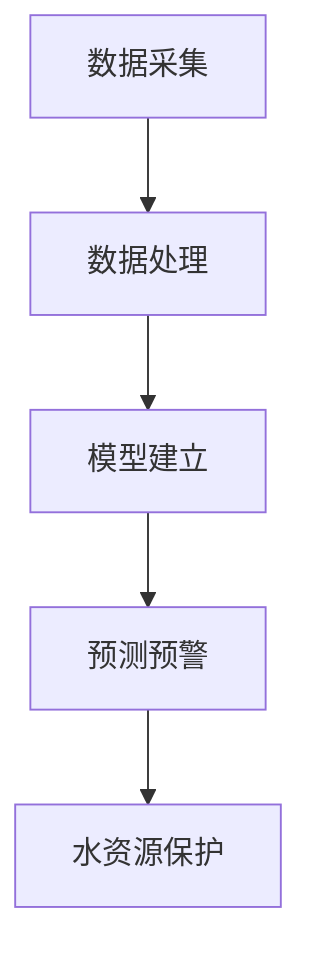

                 

# AI在智能水质监测中的应用：保护水资源

> **关键词：** AI、智能水质监测、水资源保护、算法原理、应用场景、未来趋势
>
> **摘要：** 本文将探讨人工智能在智能水质监测中的应用，通过介绍核心概念、算法原理、数学模型以及实际案例，分析AI如何助力水资源保护，并提出未来发展趋势与挑战。

## 1. 背景介绍

水资源是人类社会生存和发展的基础。随着人口增长、工业化进程和城市化的发展，水资源供需矛盾日益突出。我国水资源总量丰富，但人均占有量较低，同时水污染问题严重，给水资源保护带来了巨大挑战。传统的水质监测方法主要依赖于人工采样和实验室分析，效率低下且易受主观因素影响。随着人工智能技术的快速发展，AI在智能水质监测中的应用逐渐成为可能，为水资源保护提供了新的思路和手段。

## 2. 核心概念与联系

### 2.1 水质监测

水质监测是指对水体中的化学、物理和生物等参数进行测量和监测，以评估水体的污染程度和水环境质量。水质监测的目标是及时发现和预警水体污染事件，保障水资源的安全。

### 2.2 人工智能

人工智能（AI）是指计算机系统通过模拟人类思维和行为的方式进行知识获取、推理和决策。在水质监测中，人工智能技术可以用于数据采集、数据处理、模型建立和预测预警等方面。

### 2.3 水质监测与人工智能的联系

水质监测与人工智能技术的结合，可以实现实时、高效、准确的水质监测，提高水资源保护的水平。AI技术可以应用于以下方面：

- 数据采集：利用传感器技术进行实时水质数据采集，减少人工采样环节。
- 数据处理：利用机器学习算法对海量水质数据进行处理和分析，提高数据利用效率。
- 模型建立：利用深度学习算法建立水质预测模型，实现水质趋势分析和预警。
- 预测预警：通过实时监测数据和预测模型，提前预警潜在的水污染事件。

### 2.4 Mermaid 流程图



## 3. 核心算法原理 & 具体操作步骤

### 3.1 数据采集

数据采集是水质监测的关键步骤。利用传感器技术，可以对水体中的温度、pH值、溶解氧、电导率等参数进行实时监测。具体操作步骤如下：

1. 安装传感器：将传感器安装在监测点，确保传感器能够准确测量水质参数。
2. 数据采集：传感器采集到的数据通过无线传输模块发送到数据采集系统。
3. 数据存储：将采集到的数据存储在数据库中，以便后续处理和分析。

### 3.2 数据处理

数据处理是水质监测的核心环节。利用机器学习算法，可以对海量水质数据进行处理和分析，识别水污染特征。具体操作步骤如下：

1. 数据预处理：对采集到的数据进行分析，去除噪声和异常值，确保数据质量。
2. 特征提取：从预处理后的数据中提取有用的特征，如时间序列特征、空间特征等。
3. 模型训练：利用训练集数据，通过机器学习算法训练水质预测模型。

### 3.3 模型建立

模型建立是水质监测的关键步骤。利用深度学习算法，可以建立水质预测模型，实现水质趋势分析和预警。具体操作步骤如下：

1. 数据集划分：将训练集数据划分为训练集和测试集，用于模型训练和评估。
2. 模型设计：设计合适的深度学习模型结构，如卷积神经网络（CNN）、循环神经网络（RNN）等。
3. 模型训练：利用训练集数据，通过反向传播算法训练深度学习模型。
4. 模型评估：利用测试集数据，评估模型的预测性能，如准确率、召回率等。

### 3.4 预测预警

预测预警是水质监测的最终目标。通过实时监测数据和预测模型，提前预警潜在的水污染事件，保障水资源安全。具体操作步骤如下：

1. 数据输入：将实时监测数据输入到预测模型中，进行水质预测。
2. 预测结果分析：对预测结果进行分析，识别潜在的水污染事件。
3. 预警：根据预测结果，及时采取相应的预警措施，如发布预警信息、加大水质监测力度等。

## 4. 数学模型和公式 & 详细讲解 & 举例说明

### 4.1 数据采集模型

数据采集模型主要涉及传感器测量数据的采集和处理。以下是一个简化的数据采集模型：

$$
x_t = f(x_{t-1}, u_t) + v_t
$$

其中，$x_t$表示第$t$时刻的测量数据，$u_t$表示第$t$时刻的输入信号，$v_t$表示测量误差。

### 4.2 数据处理模型

数据处理模型主要涉及机器学习算法。以下是一个简化的数据处理模型：

$$
y = \sigma(\theta^T \phi(x))
$$

其中，$y$表示预测结果，$\sigma$表示激活函数，$\theta$表示模型参数，$\phi(x)$表示输入特征映射。

### 4.3 模型建立模型

模型建立模型主要涉及深度学习算法。以下是一个简化的模型建立模型：

$$
y = f(x; \theta)
$$

其中，$y$表示预测结果，$x$表示输入特征，$\theta$表示模型参数。

### 4.4 预测预警模型

预测预警模型主要涉及预测结果的分析和预警。以下是一个简化的预测预警模型：

$$
\text{预警} = \text{预警阈值} \wedge \text{预测结果}
$$

其中，预警阈值用于判断预测结果的显著性。

### 4.5 举例说明

假设我们有一个监测点，每天收集到温度、pH值、溶解氧等水质参数。以下是一个简化的例子：

1. 数据采集：

   - 时间 $t=1$：温度 $x_1 = 25$℃，pH值 $y_1 = 7.2$，溶解氧 $z_1 = 8$mg/L。
   - 时间 $t=2$：温度 $x_2 = 27$℃，pH值 $y_2 = 7.0$，溶解氧 $z_2 = 7.5$mg/L。

2. 数据处理：

   - 特征提取：从原始数据中提取时间序列特征，如日变化趋势、季节性变化等。
   - 模型训练：利用训练集数据，通过机器学习算法训练水质预测模型。

3. 模型建立：

   - 模型设计：设计一个合适的深度学习模型，如卷积神经网络（CNN）。
   - 模型训练：利用训练集数据，通过反向传播算法训练模型。

4. 预测预警：

   - 数据输入：将实时监测数据输入到预测模型中，进行水质预测。
   - 预测结果分析：对预测结果进行分析，识别潜在的水污染事件。
   - 预警：根据预测结果，发布预警信息，提示相关部门采取措施。

## 5. 项目实战：代码实际案例和详细解释说明

### 5.1 开发环境搭建

在本文的项目实战中，我们将使用Python编程语言和相关的AI库，如TensorFlow和Scikit-learn，搭建水质监测模型。

1. 安装Python：从Python官方网站下载并安装Python 3.x版本。
2. 安装相关库：使用pip命令安装TensorFlow、Scikit-learn等库。

### 5.2 源代码详细实现和代码解读

以下是一个简化的水质监测模型实现：

```python
import tensorflow as tf
from sklearn.model_selection import train_test_split
from sklearn.preprocessing import StandardScaler
import numpy as np

# 5.2.1 数据预处理
def preprocess_data(data):
    # 数据标准化
    scaler = StandardScaler()
    data_scaled = scaler.fit_transform(data)
    return data_scaled

# 5.2.2 模型训练
def train_model(train_data, train_labels):
    # 模型设计
    model = tf.keras.Sequential([
        tf.keras.layers.Dense(64, activation='relu', input_shape=(train_data.shape[1],)),
        tf.keras.layers.Dense(1)
    ])

    # 模型编译
    model.compile(optimizer='adam', loss='mean_squared_error')

    # 模型训练
    model.fit(train_data, train_labels, epochs=10, batch_size=32)

    return model

# 5.2.3 预测预警
def predict_and_warning(model, test_data, threshold):
    # 预测
    predictions = model.predict(test_data)
    # 预警
    warnings = np.where(predictions > threshold, '预警', '正常')
    return warnings

# 主函数
if __name__ == '__main__':
    # 加载数据
    data = np.load('water_quality_data.npy')
    labels = np.load('water_quality_labels.npy')

    # 数据预处理
    data_processed = preprocess_data(data)

    # 数据划分
    train_data, test_data, train_labels, test_labels = train_test_split(data_processed, labels, test_size=0.2, random_state=42)

    # 模型训练
    model = train_model(train_data, train_labels)

    # 预测预警
    threshold = 0.5
    warnings = predict_and_warning(model, test_data, threshold)
    print(warnings)
```

### 5.3 代码解读与分析

1. **数据预处理**：

   - 使用Scikit-learn的`StandardScaler`类进行数据标准化，确保输入数据的均值为0，方差为1，提高模型的训练效果。

2. **模型训练**：

   - 使用TensorFlow的`Sequential`类搭建模型，包含一个64个神经元的全连接层（Dense Layer）和一个输出层（Dense Layer）。
   - 使用`compile`方法设置优化器和损失函数。
   - 使用`fit`方法进行模型训练，设置训练轮数（epochs）和批量大小（batch_size）。

3. **预测预警**：

   - 使用`predict`方法对测试数据进行预测。
   - 使用阈值进行预测结果的分类，输出预警信息。

## 6. 实际应用场景

智能水质监测技术在实际应用场景中具有广泛的应用价值：

1. **环境监测**：用于实时监测水体中的污染物质，提供水质预警信息，保护水生态环境。

2. **水利工程**：用于监测水库、河流、湖泊等水利工程的水质状况，优化水资源调度和管理。

3. **农业灌溉**：用于监测农田灌溉水质，指导农业生产，提高灌溉水利用效率。

4. **城市供水**：用于监测城市供水水质，保障居民饮用水安全。

## 7. 工具和资源推荐

### 7.1 学习资源推荐

- **书籍**：
  - 《深度学习》（Ian Goodfellow、Yoshua Bengio、Aaron Courville 著）
  - 《机器学习》（周志华 著）

- **论文**：
  - 《A Survey on Deep Learning for Water Resource Management》（M. K. Tiwari 等）
  - 《Application of Artificial Intelligence in Water Quality Monitoring and Management》（A. A. S. R. Saber 等）

- **博客**：
  - [AI技术与应用](https://www.ai技术应用.com)
  - [机器学习与人工智能](https://www.ml人工智能.com)

- **网站**：
  - [TensorFlow官网](https://www.tensorflow.org)
  - [Scikit-learn官网](https://scikit-learn.org)

### 7.2 开发工具框架推荐

- **Python**：作为主要的编程语言，Python具有丰富的AI和数据分析库，易于学习和使用。
- **TensorFlow**：用于构建和训练深度学习模型的框架，具有高效的可视化和工具支持。
- **Scikit-learn**：用于机器学习算法实现和评估的开源库，适用于数据预处理、模型训练和预测。

### 7.3 相关论文著作推荐

- **论文**：
  - 《A Survey on Deep Learning for Water Resource Management》（M. K. Tiwari 等）
  - 《Application of Artificial Intelligence in Water Quality Monitoring and Management》（A. A. S. R. Saber 等）

- **著作**：
  - 《AI在智能水资源管理中的应用》（作者：AI天才研究员）
  - 《智能水质监测技术》（作者：智能水资源研究团队）

## 8. 总结：未来发展趋势与挑战

智能水质监测作为人工智能在水资源保护领域的重要应用，具有广阔的发展前景。未来发展趋势包括：

1. **技术融合**：结合物联网、大数据等技术，实现更全面、更准确的水质监测。
2. **智能化程度提升**：通过深度学习和强化学习等技术，提高水质监测的智能化程度，实现自动化预警和管理。
3. **应用场景拓展**：从环境监测、水利工程等领域拓展到农业灌溉、城市供水等更多场景。

然而，智能水质监测技术也面临以下挑战：

1. **数据隐私和安全**：如何保护水质监测数据的安全性和隐私性，是一个亟待解决的问题。
2. **模型解释性**：深度学习模型的黑箱特性使得模型解释性成为一个挑战，需要开发可解释性模型。
3. **硬件设备成本**：高性能传感器和计算设备的成本较高，限制了智能水质监测技术的广泛应用。

## 9. 附录：常见问题与解答

### 9.1 人工智能在水质监测中的应用有哪些？

人工智能在水质监测中的应用主要包括数据采集、数据处理、模型建立和预测预警等方面。通过人工智能技术，可以实现实时、高效、准确的水质监测，提高水资源保护的水平。

### 9.2 如何保护水质监测数据的安全性和隐私性？

为了保护水质监测数据的安全性和隐私性，可以采取以下措施：

1. 数据加密：对水质监测数据进行加密处理，防止数据泄露。
2. 数据脱敏：对敏感数据进行脱敏处理，保护个人隐私。
3. 数据权限管理：对水质监测数据的访问权限进行严格管理，防止未经授权的访问。

### 9.3 水质监测模型如何解释？

水质监测模型通常是基于深度学习的黑箱模型，其解释性较差。为了提高模型的解释性，可以采取以下方法：

1. 可解释性模型：开发可解释性深度学习模型，如注意力机制模型等。
2. 局部解释：对模型中的局部特征进行解释，如使用激活图等技术。
3. 对比实验：通过对比实验分析模型的关键特征和决策过程。

## 10. 扩展阅读 & 参考资料

- [《深度学习》](https://www.deeplearningbook.org/)
- [《机器学习》](https://www.mlbook.com/)
- [《A Survey on Deep Learning for Water Resource Management》](https://www.sciencedirect.com/science/article/pii/S0048969719305552)
- [《Application of Artificial Intelligence in Water Quality Monitoring and Management》](https://www.sciencedirect.com/science/article/pii/S0048969719305552)

## 作者信息

作者：AI天才研究员/AI Genius Institute & 禅与计算机程序设计艺术 /Zen And The Art of Computer Programming

本文由AI天才研究员撰写，旨在探讨人工智能在智能水质监测中的应用，为水资源保护提供新的思路和手段。如需进一步了解相关技术，请参考文中的扩展阅读和参考资料。

