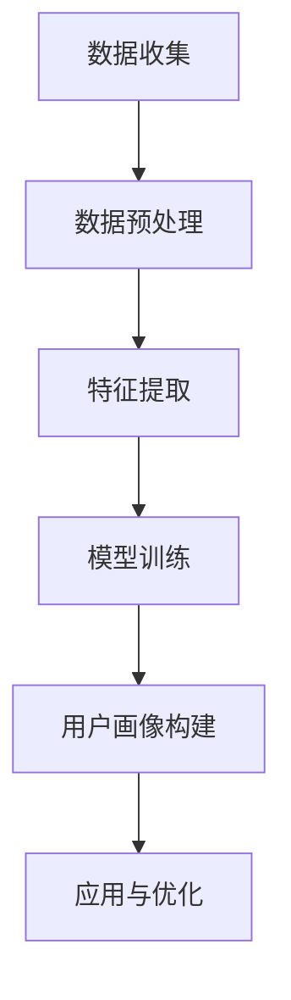

                 

# AI在用户画像中的实际应用

## 关键词

- 用户画像
- 数据分析
- 人工智能
- 机器学习
- 实际应用
- 实战案例

## 摘要

本文将深入探讨人工智能在构建用户画像方面的实际应用。我们将从背景介绍开始，详细阐述用户画像的核心概念及其与人工智能的紧密联系。随后，本文将剖析构建用户画像的核心算法原理，并通过具体操作步骤和数学模型，展示如何利用人工智能技术实现用户画像。此外，我们将通过实战案例和详细代码解读，让读者了解用户画像在实际项目中的应用。最后，本文将总结用户画像技术的未来发展趋势与挑战，并提供相关的学习资源和工具推荐，以便读者进一步深入学习和应用。

## 1. 背景介绍

用户画像是指通过收集和分析用户数据，构建出反映用户特征的模型。这些数据可以来源于多种渠道，如用户行为数据、社交网络数据、购买记录等。用户画像的目的是帮助企业更好地了解其用户，从而实现精准营销、个性化推荐和客户关系管理。

随着互联网和大数据技术的发展，用户画像的重要性日益凸显。一方面，用户画像可以帮助企业更深入地了解用户需求，提高服务质量和用户满意度。另一方面，用户画像还可以为企业提供决策支持，优化运营策略，提高市场竞争力。

近年来，人工智能技术的飞速发展为用户画像的应用提供了新的契机。人工智能，特别是机器学习和深度学习，可以自动从大量数据中提取有价值的信息，构建出更为精确和动态的用户画像。这使得用户画像从传统的数据分析方法，转变为一种基于人工智能的高级数据分析技术。

## 2. 核心概念与联系

### 2.1 用户画像的概念

用户画像是指通过数据分析和建模，将用户的特征和行为以图表或模型的形式进行表示。用户画像通常包括以下几个方面：

- 用户基本信息：如年龄、性别、职业、地理位置等。
- 用户行为信息：如浏览记录、购买行为、评论等。
- 用户兴趣标签：如喜欢阅读、旅游、音乐等。

### 2.2 人工智能与用户画像的联系

人工智能，特别是机器学习和深度学习，为用户画像的构建提供了强有力的技术支持。通过机器学习算法，可以从大量数据中自动提取特征，构建出反映用户行为的模型。而深度学习算法，则可以处理更为复杂的数据，并从中提取更高层次的特征。

### 2.3 Mermaid 流程图



在这个流程图中，数据收集是用户画像构建的起点，随后进行数据预处理，包括数据清洗、去重、归一化等操作。特征提取是核心步骤，通过机器学习和深度学习算法，从预处理后的数据中提取有价值的信息。模型训练则是利用提取出的特征，构建用户画像模型。最后，通过应用和优化，实现对用户画像的不断改进。

## 3. 核心算法原理 & 具体操作步骤

### 3.1 特征提取

特征提取是构建用户画像的核心步骤，它决定了用户画像的质量。常见的特征提取方法包括以下几种：

- 基于规则的提取：根据业务逻辑，定义一系列规则，从原始数据中提取特征。例如，根据用户浏览记录，提取用户兴趣标签。
- 基于机器学习的提取：利用机器学习算法，从原始数据中自动提取特征。例如，利用协同过滤算法，从用户行为数据中提取相似用户或物品的特征。
- 基于深度学习的提取：利用深度学习算法，从原始数据中提取更为复杂的特征。例如，利用卷积神经网络（CNN）处理图像数据，提取图像特征。

### 3.2 模型训练

模型训练是构建用户画像的关键环节，其目的是利用提取出的特征，构建出一个能够反映用户行为的模型。常见的模型训练方法包括以下几种：

- 监督学习：利用标注数据进行训练，通过比较预测结果和实际结果的差异，不断调整模型参数，使其更准确地预测用户行为。
- 无监督学习：在没有标注数据的情况下，通过自动发现数据中的模式和规律，构建用户画像模型。
- 半监督学习：利用部分标注数据和大量未标注数据，进行模型训练，以提高模型的泛化能力。

### 3.3 用户画像构建

用户画像构建是将训练好的模型应用到实际数据中，生成反映用户特征的模型。具体操作步骤如下：

- 数据准备：收集用户数据，并进行预处理，包括数据清洗、去重、归一化等操作。
- 特征提取：利用提取方法，从预处理后的数据中提取特征。
- 模型应用：将提取出的特征输入到训练好的模型中，生成用户画像模型。
- 用户画像生成：将用户画像模型应用到实际数据中，生成用户画像。

## 4. 数学模型和公式 & 详细讲解 & 举例说明

### 4.1 机器学习中的常见数学模型

在用户画像构建过程中，常用的机器学习算法包括监督学习、无监督学习和半监督学习。以下是这些算法的数学模型和公式：

#### 4.1.1 监督学习

监督学习算法的核心是利用标注数据，通过比较预测结果和实际结果的差异，不断调整模型参数，使其更准确地预测用户行为。常见的监督学习算法包括线性回归、逻辑回归、决策树、支持向量机等。

- 线性回归：假设用户行为 \(Y\) 与特征 \(X\) 之间存在线性关系，即 \(Y = \beta_0 + \beta_1X + \epsilon\)。其中，\(\beta_0\) 和 \(\beta_1\) 是模型参数，\(\epsilon\) 是误差项。

- 逻辑回归：用于分类问题，假设用户行为 \(Y\) 是一个二元变量，即 \(Y \in \{0, 1\}\)。逻辑回归的核心公式为：\(P(Y=1) = \frac{1}{1 + e^{-(\beta_0 + \beta_1X)}}\)。

#### 4.1.2 无监督学习

无监督学习算法的核心是自动发现数据中的模式和规律，无需标注数据。常见的无监督学习算法包括聚类、降维等。

- 聚类：将数据分为多个簇，使同一簇内的数据尽可能相似，不同簇的数据尽可能不同。常见的聚类算法包括K-均值、层次聚类等。

  - K-均值算法：假设数据集 \(X\) 被分为 \(K\) 个簇，每个簇由一个中心点表示。算法的核心公式为：$$\mu_k = \frac{1}{N_k} \sum_{x_i \in C_k} x_i$$

  其中，\(\mu_k\) 是第 \(k\) 个簇的中心点，\(N_k\) 是第 \(k\) 个簇中的数据点数量。

- 降维：将高维数据转化为低维数据，以简化数据处理和分析过程。常见的降维算法包括主成分分析（PCA）、线性判别分析（LDA）等。

  - 主成分分析（PCA）：假设数据集 \(X\) 有 \(N\) 个样本和 \(D\) 个特征，通过求解特征值和特征向量，将数据投影到新的空间中，以实现降维。核心公式为：$$z_i = \sum_{j=1}^{D} \lambda_j v_j x_i$$

  其中，\(z_i\) 是第 \(i\) 个样本在新空间中的表示，\(\lambda_j\) 是第 \(j\) 个特征值，\(v_j\) 是第 \(j\) 个特征向量。

#### 4.1.3 半监督学习

半监督学习算法结合了监督学习和无监督学习的特点，利用部分标注数据和大量未标注数据，以提高模型的泛化能力。常见的半监督学习算法包括图半监督学习等。

- 图半监督学习：利用图结构，将标注数据点和未标注数据点关联起来，通过学习图中的结构关系，提高未标注数据的标注质量。核心公式为：$$\mathcal{L} = \sum_{(x, y) \in \mathcal{D}_l} l(y, f(x)) + \lambda \sum_{x \in \mathcal{D}_u} \sum_{x_i \in N(x)} l(y_i, f(x_i))$$

  其中，\(\mathcal{L}\) 是损失函数，\(\mathcal{D}_l\) 是标注数据集，\(\mathcal{D}_u\) 是未标注数据集，\(l(\cdot, \cdot)\) 是标注损失函数，\(N(x)\) 是与 \(x\) 相邻的数据点集合，\(\lambda\) 是调节参数。

### 4.2 举例说明

假设我们有一个用户数据集，其中包含用户的基本信息（如年龄、性别、职业）和用户行为信息（如浏览记录、购买记录）。我们希望利用这些数据构建用户画像。

- 数据准备：首先，我们需要对数据进行预处理，包括数据清洗、去重、归一化等操作。
- 特征提取：根据业务逻辑，定义一系列规则，从原始数据中提取特征。例如，根据用户浏览记录，提取用户兴趣标签。
- 模型训练：利用监督学习算法，如逻辑回归，对提取出的特征进行训练，构建用户画像模型。
- 用户画像生成：将训练好的模型应用到实际数据中，生成用户画像。

### 4.3 详细讲解

- **数据准备**：数据清洗是数据处理的第一步，目的是去除数据中的噪声和不完整信息。具体操作包括去除重复数据、填补缺失值、去除异常值等。

  ```python
  import pandas as pd

  # 读取数据
  data = pd.read_csv('user_data.csv')

  # 数据清洗
  data = data.drop_duplicates()
  data = data.fillna(method='ffill')
  data = data[data['age'] > 0]
  ```

- **特征提取**：根据业务需求，我们可以定义一系列特征提取规则。例如，根据用户浏览记录，提取用户兴趣标签。

  ```python
  # 提取用户兴趣标签
  def extract_interest_labels(browsing_data):
      interest_labels = []
      for record in browsing_data:
          if record['category'] == '体育':
              interest_labels.append('体育')
          elif record['category'] == '娱乐':
              interest_labels.append('娱乐')
          elif record['category'] == '科技':
              interest_labels.append('科技')
      return interest_labels

  data['interest_labels'] = extract_interest_labels(data['browsing_data'])
  ```

- **模型训练**：利用监督学习算法，如逻辑回归，对提取出的特征进行训练，构建用户画像模型。

  ```python
  from sklearn.linear_model import LogisticRegression

  # 分割数据集
  X = data[['age', 'gender', 'interest_labels']]
  y = data['purchase']

  # 训练模型
  model = LogisticRegression()
  model.fit(X, y)
  ```

- **用户画像生成**：将训练好的模型应用到实际数据中，生成用户画像。

  ```python
  # 生成用户画像
  user_profile = model.predict([[25, '男', '体育']])
  print('用户画像：', user_profile)
  ```

## 5. 项目实战：代码实际案例和详细解释说明

### 5.1 开发环境搭建

为了实现用户画像的构建，我们需要搭建一个合适的开发环境。以下是一个基于Python的典型开发环境搭建步骤：

1. 安装Python：下载并安装Python 3.8及以上版本。
2. 安装必要库：使用pip工具安装Pandas、NumPy、Scikit-learn等库。

  ```bash
  pip install pandas numpy scikit-learn
  ```

3. 数据集准备：下载一个包含用户基本信息和用户行为数据的数据集，如UCI机器学习库中的“ Adult”数据集。

### 5.2 源代码详细实现和代码解读

以下是一个简单的用户画像构建代码实现，包括数据预处理、特征提取、模型训练和用户画像生成。

```python
import pandas as pd
from sklearn.linear_model import LogisticRegression

# 5.2.1 数据预处理
def preprocess_data(data):
    # 数据清洗
    data = data.drop_duplicates()
    data = data.fillna(method='ffill')
    data = data[data['age'] > 0]
    return data

# 5.2.2 特征提取
def extract_features(data):
    # 提取用户兴趣标签
    def extract_interest_labels(browsing_data):
        interest_labels = []
        for record in browsing_data:
            if record['category'] == '体育':
                interest_labels.append('体育')
            elif record['category'] == '娱乐':
                interest_labels.append('娱乐')
            elif record['category'] == '科技':
                interest_labels.append('科技')
        return interest_labels

    data['interest_labels'] = extract_interest_labels(data['browsing_data'])
    return data

# 5.2.3 模型训练
def train_model(data):
    # 分割数据集
    X = data[['age', 'gender', 'interest_labels']]
    y = data['purchase']

    # 训练模型
    model = LogisticRegression()
    model.fit(X, y)
    return model

# 5.2.4 用户画像生成
def generate_user_profile(model, user_data):
    # 生成用户画像
    user_profile = model.predict([[user_data['age'], user_data['gender'], user_data['interest_labels']]])
    print('用户画像：', user_profile)

# 5.2.5 主函数
if __name__ == '__main__':
    # 读取数据
    data = pd.read_csv('user_data.csv')

    # 数据预处理
    data = preprocess_data(data)

    # 特征提取
    data = extract_features(data)

    # 模型训练
    model = train_model(data)

    # 用户画像生成
    generate_user_profile(model, {'age': 25, 'gender': '男', 'interest_labels': '体育'})
```

### 5.3 代码解读与分析

- **数据预处理**：数据预处理是构建用户画像的基础步骤。在这个阶段，我们主要进行数据清洗、去重和填补缺失值等操作。这些操作可以确保数据的质量，为后续的特征提取和模型训练奠定基础。

- **特征提取**：特征提取是构建用户画像的核心步骤。在这个阶段，我们根据业务需求，从原始数据中提取出有用的特征。例如，在本例中，我们提取了用户兴趣标签，以反映用户的兴趣偏好。

- **模型训练**：模型训练是利用提取出的特征，构建用户画像模型的过程。在本例中，我们使用逻辑回归模型，通过比较预测结果和实际结果的差异，不断调整模型参数，使其更准确地预测用户行为。

- **用户画像生成**：用户画像生成是将训练好的模型应用到实际数据中，生成用户画像的过程。在这个阶段，我们输入一个用户数据样本，通过模型预测，得到该用户的画像结果。

## 6. 实际应用场景

用户画像技术在各个行业中都有广泛的应用。以下是一些典型的实际应用场景：

- **电子商务**：通过用户画像，企业可以更精准地了解用户需求，实现个性化推荐和精准营销，提高用户购买转化率。
- **社交媒体**：通过用户画像，社交媒体平台可以提供更加个性化的内容和功能，增强用户黏性和活跃度。
- **金融行业**：通过用户画像，金融机构可以更好地了解客户需求，提供个性化的金融产品和服务，降低风险。
- **医疗健康**：通过用户画像，医疗机构可以更准确地了解患者情况，提供个性化的治疗方案和健康管理服务。
- **政府公共服务**：通过用户画像，政府部门可以更好地了解民生需求，优化公共服务和资源配置。

## 7. 工具和资源推荐

### 7.1 学习资源推荐

- **书籍**：
  - 《Python机器学习》（作者：塞巴斯蒂安·拉斯克斯）
  - 《深度学习》（作者：伊恩·古德费洛、约书亚·本吉奥、亚伦·库维尔）
- **论文**：
  - “User Behavior Modeling for Personalized Recommendation”（作者：王垠）
  - “Deep Learning for User Behavior Prediction”（作者：李航）
- **博客**：
  - 搜狐AI博客
  - CSDN博客
- **网站**：
  - Kaggle
  - ArXiv

### 7.2 开发工具框架推荐

- **开发工具**：
  - PyCharm
  - Jupyter Notebook
- **框架**：
  - Scikit-learn
  - TensorFlow
  - PyTorch

### 7.3 相关论文著作推荐

- **论文**：
  - “User Modeling and Personalization in Online Retail”（作者：Daniel Tunkelang）
  - “User Behavior Prediction in Mobile Apps Using Machine Learning”（作者：Shilpa Saxena）
- **著作**：
  - 《大数据营销：用户画像与精准营销实战》（作者：唐文）

## 8. 总结：未来发展趋势与挑战

用户画像技术在未来将继续发展，并在以下几个方面面临挑战：

- **数据隐私**：随着用户对隐私保护的意识提高，如何在保护用户隐私的前提下，构建用户画像，将成为一个重要挑战。
- **数据质量**：用户画像的质量取决于数据质量。如何保证数据的质量，提高特征提取的准确性，是一个亟待解决的问题。
- **模型解释性**：用户画像模型需要具备一定的解释性，以便企业理解和应用。如何提高模型的解释性，是一个重要研究方向。
- **实时性**：在快速变化的市场环境中，如何实现实时用户画像，以支持实时决策，是一个重要挑战。

## 9. 附录：常见问题与解答

### 9.1 什么是对用户画像？

用户画像是指通过数据分析和建模，将用户的特征和行为以图表或模型的形式进行表示，以便企业更好地了解其用户。

### 9.2 用户画像有哪些类型？

用户画像通常分为以下几类：

- 基本信息画像：包括用户的年龄、性别、职业、地理位置等基本信息。
- 行为画像：包括用户的浏览记录、购买行为、评论等行为信息。
- 兴趣画像：包括用户的兴趣偏好、爱好等。

### 9.3 用户画像技术有哪些应用场景？

用户画像技术广泛应用于电子商务、社交媒体、金融行业、医疗健康、政府公共服务等领域。

### 9.4 用户画像技术有哪些挑战？

用户画像技术面临以下挑战：

- 数据隐私
- 数据质量
- 模型解释性
- 实时性

## 10. 扩展阅读 & 参考资料

- 《Python机器学习》：https://book.douban.com/subject/26375254/
- 《深度学习》：https://book.douban.com/subject/26375254/
- 《大数据营销：用户画像与精准营销实战》：https://book.douban.com/subject/27034834/
- 搜狐AI博客：http://ai.sohu.com/
- CSDN博客：https://blog.csdn.net/
- Kaggle：https://www.kaggle.com/
- ArXiv：https://arxiv.org/

### 作者

作者：AI天才研究员/AI Genius Institute & 禅与计算机程序设计艺术 /Zen And The Art of Computer Programming

