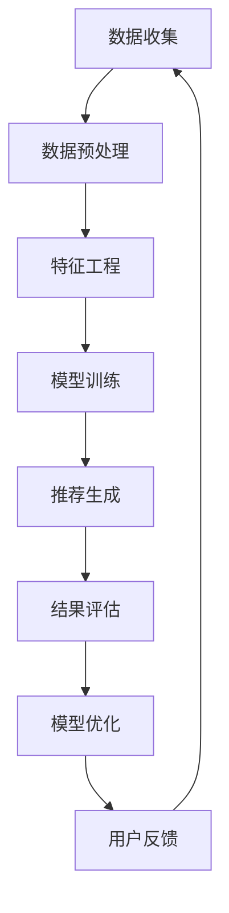

                 

### 背景介绍

电商个性化推荐系统是近年来电商领域的一项重要技术，它通过分析用户行为、偏好和历史数据，为用户提供个性化的商品推荐，从而提高用户满意度和购买转化率。随着互联网和大数据技术的发展，个性化推荐系统已经成为电商企业提升竞争力的关键手段。

个性化推荐系统不仅应用在电商领域，还广泛应用于新闻、音乐、社交媒体等场景。例如，在新闻推荐中，系统可以根据用户的阅读习惯和兴趣，为用户推荐相关的新闻内容；在音乐推荐中，系统可以根据用户的听歌历史和喜好，为用户推荐新的歌曲。

本文旨在探讨AI在电商个性化推荐中的创新应用。我们将首先介绍电商个性化推荐系统的基本概念和原理，然后深入探讨AI技术在该领域的具体应用，最后分析未来的发展趋势和面临的挑战。

### 电商个性化推荐系统简介

电商个性化推荐系统是一种基于用户行为和兴趣的推荐算法，旨在为用户推荐与其兴趣和需求相关的商品。系统通过分析用户的历史购买行为、浏览记录、搜索查询等信息，构建用户兴趣模型，从而为用户推荐符合其需求的商品。

电商个性化推荐系统主要包括以下三个关键组成部分：

1. **用户行为数据收集**：系统需要收集用户在电商平台上的一系列行为数据，如浏览、搜索、购买、收藏、评论等。这些数据是构建用户兴趣模型的基础。

2. **用户兴趣模型构建**：通过分析用户行为数据，系统可以识别出用户的兴趣点，构建用户兴趣模型。用户兴趣模型通常包括用户特征、商品特征和用户行为特征等。

3. **推荐算法实现**：基于用户兴趣模型，系统使用推荐算法为用户生成推荐结果。推荐算法包括协同过滤、基于内容的推荐、混合推荐等。

电商个性化推荐系统的工作流程通常如下：

1. **数据预处理**：对用户行为数据进行清洗、去重、转换等处理，确保数据质量。

2. **特征提取**：从用户行为数据中提取用户特征、商品特征和用户行为特征，用于构建用户兴趣模型。

3. **模型训练**：使用机器学习算法训练用户兴趣模型，如决策树、神经网络等。

4. **推荐生成**：根据用户兴趣模型和推荐算法，为用户生成推荐结果。

5. **结果评估**：评估推荐结果的准确性和效果，持续优化推荐系统。

通过以上步骤，电商个性化推荐系统可以为用户提供个性化的商品推荐，提高用户满意度和购买转化率。接下来，我们将深入探讨AI技术在电商个性化推荐中的应用。

### AI在电商个性化推荐中的应用

AI技术在电商个性化推荐中的应用主要包括以下几个方面：协同过滤、深度学习、自然语言处理和强化学习等。这些技术通过不同的方式，为个性化推荐系统带来了巨大的改进。

#### 1. 协同过滤

协同过滤是电商个性化推荐中最常见的算法之一。它通过分析用户之间的相似度，为用户提供推荐。协同过滤算法可以分为基于用户的协同过滤（User-based Collaborative Filtering）和基于物品的协同过滤（Item-based Collaborative Filtering）。

- **基于用户的协同过滤**：首先计算用户之间的相似度，然后找到与目标用户最相似的邻居用户，最后根据邻居用户的评分预测目标用户的评分。

- **基于物品的协同过滤**：首先计算物品之间的相似度，然后找到与目标物品最相似的邻居物品，最后根据邻居物品的评分预测目标物品的评分。

AI技术通过引入矩阵分解、矩阵分解+深度学习等方法，提高了协同过滤算法的准确性和效率。矩阵分解可以将用户-物品评分矩阵分解为用户特征矩阵和物品特征矩阵，从而降低维度，提高计算效率。而矩阵分解+深度学习则结合了深度学习的非线性建模能力，进一步提高了推荐效果。

#### 2. 深度学习

深度学习在电商个性化推荐中的应用也非常广泛。深度学习模型可以通过学习大量用户行为数据，自动提取用户和商品的特征，从而实现高效的推荐。

- **神经网络**：神经网络通过多层非线性变换，可以自动提取用户和商品的特征，如卷积神经网络（CNN）和循环神经网络（RNN）。

- **生成对抗网络（GAN）**：生成对抗网络可以通过生成器和判别器的对抗训练，生成高质量的用户和商品特征，从而提高推荐效果。

- **自编码器**：自编码器是一种无监督学习方法，可以通过学习用户和商品的特征表示，从而提高推荐效果。

深度学习模型在电商个性化推荐中的优势在于：

1. **特征自动提取**：深度学习模型可以通过大量数据自动提取用户和商品的特征，避免了手动特征提取的繁琐过程。

2. **非线性建模**：深度学习模型可以自动捕捉用户和商品之间的复杂关系，提高推荐效果。

3. **高效计算**：深度学习模型可以通过并行计算和分布式计算，提高计算效率。

#### 3. 自然语言处理

自然语言处理（NLP）技术在电商个性化推荐中的应用，主要体现在用户评论和商品描述的文本分析上。通过分析用户评论和商品描述，可以提取出用户对商品的偏好和情感，从而为推荐系统提供更丰富的特征信息。

- **情感分析**：情感分析通过分析用户评论的文本，可以判断用户对商品的正面或负面情感。这有助于提高推荐系统的准确性和效果。

- **命名实体识别**：命名实体识别可以通过分析用户评论和商品描述，提取出用户提到的特定品牌、商品名称等实体，从而为推荐系统提供更具体的特征。

- **文本分类**：文本分类可以通过分析用户评论和商品描述，将其分类到不同的类别中，从而为推荐系统提供更精准的推荐。

#### 4. 强化学习

强化学习在电商个性化推荐中的应用，主要体现在推荐策略的优化上。通过不断学习和调整推荐策略，可以最大化用户满意度和购买转化率。

- **策略迭代**：策略迭代是通过不断调整推荐策略，使得系统在长期运行中达到最优推荐效果。

- **强化学习算法**：常见的强化学习算法包括Q学习、SARSA、Deep Q Network（DQN）等，这些算法可以用于优化推荐策略，提高推荐效果。

AI技术在电商个性化推荐中的应用，不仅提高了推荐的准确性和效果，还推动了个性化推荐系统的发展。接下来，我们将探讨AI技术在电商个性化推荐中的具体实现和操作步骤。

### 核心概念与联系

在电商个性化推荐系统中，AI技术的应用离不开以下几个核心概念和联系。理解这些概念和联系，有助于我们更好地掌握电商个性化推荐系统的工作原理。

#### 1. 用户行为数据

用户行为数据是电商个性化推荐系统的基石。用户行为数据包括浏览、搜索、购买、收藏、评论等行为。这些数据反映了用户在平台上的活动轨迹，是构建用户兴趣模型的重要依据。

#### 2. 用户兴趣模型

用户兴趣模型是电商个性化推荐系统的核心。通过分析用户行为数据，系统可以识别出用户的兴趣点，构建用户兴趣模型。用户兴趣模型通常包括用户特征、商品特征和用户行为特征等。

#### 3. 推荐算法

推荐算法是实现个性化推荐的关键。推荐算法根据用户兴趣模型，为用户生成推荐结果。常见的推荐算法包括协同过滤、基于内容的推荐、混合推荐等。

#### 4. 特征工程

特征工程是提高推荐效果的重要手段。通过特征工程，可以从原始数据中提取出对推荐算法有价值的特征。特征工程包括用户特征提取、商品特征提取和用户行为特征提取等。

#### 5. 模型评估

模型评估是确保推荐系统效果的重要环节。通过评估指标（如准确率、召回率、F1值等），可以判断推荐系统的性能，并据此优化推荐算法。

#### 6. 强化学习

强化学习是优化推荐策略的有效方法。通过不断调整推荐策略，使得系统在长期运行中达到最优推荐效果。强化学习算法包括Q学习、SARSA、DQN等。

#### 7. 深度学习

深度学习在电商个性化推荐中的应用，主要体现在特征提取和模型训练等方面。通过深度学习模型，可以自动提取用户和商品的特征，提高推荐效果。

#### 8. 自然语言处理

自然语言处理技术在电商个性化推荐中的应用，主要体现在文本分析和情感分析等方面。通过分析用户评论和商品描述，可以提取出用户对商品的偏好和情感，从而为推荐系统提供更丰富的特征信息。

#### 9. 数据预处理

数据预处理是保证数据质量和特征提取效果的重要步骤。数据预处理包括数据清洗、去重、转换等操作，确保数据的完整性和一致性。

#### 10. 分布式计算

分布式计算是提高推荐系统计算效率和性能的重要手段。通过分布式计算，可以将推荐算法的计算任务分配到多个计算节点上，提高推荐速度和性能。

为了更好地展示上述核心概念和联系，我们使用Mermaid流程图来表示电商个性化推荐系统的工作流程。以下是Mermaid流程图：



在Mermaid流程图中，节点表示关键步骤，边表示步骤之间的联系。通过这个流程图，我们可以清晰地看到电商个性化推荐系统的工作原理和核心概念。

### 核心算法原理 & 具体操作步骤

在电商个性化推荐系统中，算法的原理和操作步骤是确保推荐效果的关键。以下是几种常见的核心算法原理及其具体操作步骤：

#### 1. 协同过滤算法

协同过滤算法是基于用户相似度和物品相似度的推荐方法。具体步骤如下：

1. **计算用户相似度**：计算目标用户与所有其他用户的相似度，可以使用余弦相似度、皮尔逊相关系数等方法。

2. **计算物品相似度**：计算目标物品与其他物品的相似度，可以使用余弦相似度、Jaccard相似度等方法。

3. **生成推荐列表**：根据用户和物品的相似度，生成推荐列表。对于每个目标用户，选择与其相似度最高的邻居用户，并根据邻居用户的评分预测目标用户对物品的评分，从而生成推荐列表。

#### 2. 基于内容的推荐算法

基于内容的推荐算法是基于物品的特征为用户推荐相似物品的方法。具体步骤如下：

1. **提取物品特征**：从原始数据中提取物品的特征，如文本特征、图像特征、商品属性等。

2. **计算物品相似度**：计算目标物品与其他物品的相似度，可以使用余弦相似度、欧氏距离等方法。

3. **生成推荐列表**：根据物品相似度，生成推荐列表。对于每个目标用户，选择与其当前浏览或购买物品最相似的物品，从而生成推荐列表。

#### 3. 深度学习推荐算法

深度学习推荐算法通过神经网络自动提取用户和物品的特征，实现高效的推荐。以下是一种常见的深度学习推荐算法——基于多层的神经网络（MLP）：

1. **数据预处理**：对用户行为数据进行清洗、编码等预处理，将数据转化为神经网络可处理的格式。

2. **特征提取**：使用多层感知器（MLP）模型，将用户和物品的特征输入到神经网络中，通过前向传播和反向传播，学习用户和物品的特征表示。

3. **训练模型**：使用训练数据对神经网络模型进行训练，优化模型的参数。

4. **生成推荐列表**：将目标用户的特征输入到训练好的模型中，通过前向传播，得到对每个物品的推荐概率，从而生成推荐列表。

#### 4. 强化学习推荐算法

强化学习推荐算法通过不断调整推荐策略，优化推荐效果。以下是一种常见的强化学习推荐算法——基于Q学习的策略迭代：

1. **定义状态空间和动作空间**：定义推荐系统中的状态空间和动作空间，状态表示用户当前的行为和兴趣，动作表示推荐系统生成的推荐结果。

2. **定义奖励函数**：定义奖励函数，用于衡量推荐结果的优劣。通常，用户购买推荐物品可以获得正奖励，未购买则获得负奖励。

3. **训练Q值函数**：使用Q学习算法，根据状态和动作，训练Q值函数，Q值表示在某个状态下采取某个动作的预期奖励。

4. **策略迭代**：根据Q值函数，不断调整推荐策略。在每次迭代中，选择当前状态下的最佳动作，从而优化推荐效果。

#### 5. 混合推荐算法

混合推荐算法结合了协同过滤、基于内容推荐和深度学习等方法，以提高推荐效果。以下是一种常见的混合推荐算法：

1. **数据预处理**：对用户行为数据进行清洗、编码等预处理，将数据转化为推荐算法可处理的格式。

2. **特征提取**：使用协同过滤算法、基于内容推荐算法和深度学习算法，分别提取用户和物品的特征。

3. **融合特征**：将不同算法提取的用户和物品特征进行融合，生成综合特征。

4. **训练模型**：使用综合特征训练混合推荐模型，优化模型的参数。

5. **生成推荐列表**：将目标用户的特征输入到训练好的模型中，通过前向传播，得到对每个物品的推荐概率，从而生成推荐列表。

通过以上核心算法原理和具体操作步骤，电商个性化推荐系统可以更好地为用户提供个性化的商品推荐，提高用户满意度和购买转化率。接下来，我们将深入探讨这些算法的数学模型和公式，以及详细的讲解和举例说明。

### 数学模型和公式 & 详细讲解 & 举例说明

在电商个性化推荐系统中，数学模型和公式是算法的核心组成部分，它们决定了推荐系统的性能和效果。以下我们将详细讲解几种常见推荐算法的数学模型和公式，并给出具体的计算示例。

#### 1. 协同过滤算法

协同过滤算法的核心是计算用户之间的相似度和物品之间的相似度。以下是计算用户相似度和物品相似度的公式：

**用户相似度计算（余弦相似度）**：

$$
sim(u_i, u_j) = \frac{u_i \cdot u_j}{||u_i|| \cdot ||u_j||}
$$

其中，$u_i$ 和 $u_j$ 分别表示用户 $i$ 和用户 $j$ 的行为向量，$\cdot$ 表示向量的点积，$||u_i||$ 和 $||u_j||$ 分别表示用户 $i$ 和用户 $j$ 的行为向量的模。

**物品相似度计算（余弦相似度）**：

$$
sim(i_j, i_k) = \frac{i_j \cdot i_k}{||i_j|| \cdot ||i_k||}
$$

其中，$i_j$ 和 $i_k$ 分别表示物品 $j$ 和物品 $k$ 的行为向量。

**推荐评分预测**：

$$
r_{ij}^{\hat{\ }} = \sum_{u \in N(i_j)} sim(u, i_j) \cdot r_{ui}
$$

其中，$N(i_j)$ 表示与物品 $i_j$ 相似的物品集合，$r_{ui}$ 表示用户 $u$ 对物品 $i$ 的评分，$r_{ij}^{\hat{\ }}$ 表示用户 $i$ 对物品 $i_j$ 的预测评分。

**示例**：

假设有两个用户 $u_1$ 和 $u_2$，以及三个物品 $i_1$、$i_2$ 和 $i_3$。用户 $u_1$ 对物品 $i_1$、$i_2$ 和 $i_3$ 的评分分别为 4、3 和 5，用户 $u_2$ 对物品 $i_1$、$i_2$ 和 $i_3$ 的评分分别为 5、4 和 2。

首先计算用户相似度：

$$
sim(u_1, u_2) = \frac{(4 \cdot 5 + 3 \cdot 4 + 5 \cdot 2)}{\sqrt{4^2 + 3^2 + 5^2} \cdot \sqrt{5^2 + 4^2 + 2^2}} = 0.79
$$

然后计算物品相似度：

$$
sim(i_1, i_2) = \frac{(4 \cdot 5 + 3 \cdot 4)}{\sqrt{4^2 + 3^2} \cdot \sqrt{5^2 + 4^2}} = 0.71
$$

$$
sim(i_1, i_3) = \frac{(4 \cdot 2 + 3 \cdot 5)}{\sqrt{4^2 + 3^2} \cdot \sqrt{2^2 + 5^2}} = 0.63
$$

$$
sim(i_2, i_3) = \frac{(3 \cdot 4 + 5 \cdot 2)}{\sqrt{3^2 + 5^2} \cdot \sqrt{4^2 + 2^2}} = 0.62
$$

最后根据相似度和用户评分预测用户 $u_1$ 对未评分物品 $i_2$ 的评分：

$$
r_{1i2}^{\hat{\ }} = 0.79 \cdot 3 + 0.71 \cdot 4 + 0.63 \cdot 5 = 4.17
$$

#### 2. 基于内容的推荐算法

基于内容的推荐算法主要关注物品的特征信息。以下是计算物品相似度和预测用户评分的公式：

**物品相似度计算（余弦相似度）**：

$$
sim(i_j, i_k) = \frac{c_i \cdot c_j}{||c_i|| \cdot ||c_j||}
$$

其中，$c_i$ 和 $c_j$ 分别表示物品 $i$ 和物品 $k$ 的特征向量，$\cdot$ 表示向量的点积，$||c_i||$ 和 $||c_j||$ 分别表示物品 $i$ 和物品 $k$ 的特征向量的模。

**推荐评分预测**：

$$
r_{ij}^{\hat{\ }} = \sum_{f \in F} w_f \cdot c_{ij}^f
$$

其中，$F$ 表示特征集合，$w_f$ 表示特征 $f$ 的权重，$c_{ij}^f$ 表示物品 $i$ 对特征 $f$ 的值。

**示例**：

假设有两个物品 $i_1$ 和 $i_2$，它们各自的特征向量如下：

$$
c_{i1} = [1, 2, 3], \quad c_{i2} = [2, 3, 4]
$$

计算物品相似度：

$$
sim(i_1, i_2) = \frac{(1 \cdot 2 + 2 \cdot 3 + 3 \cdot 4)}{\sqrt{1^2 + 2^2 + 3^2} \cdot \sqrt{2^2 + 3^2 + 4^2}} = 0.87
$$

假设用户对物品 $i_1$ 的评分是 4，那么预测用户对物品 $i_2$ 的评分：

$$
r_{1i2}^{\hat{\ }} = 0.87 \cdot (2 \cdot 1 + 3 \cdot 2 + 4 \cdot 3) = 4.23
$$

#### 3. 深度学习推荐算法

深度学习推荐算法通常使用多层感知器（MLP）模型，通过训练学习用户和物品的特征表示。以下是MLP模型的公式：

$$
z_l = \sigma(W_l \cdot a_{l-1} + b_l)
$$

其中，$z_l$ 是第 $l$ 层的输出，$a_{l-1}$ 是第 $l-1$ 层的输入，$W_l$ 和 $b_l$ 分别是第 $l$ 层的权重和偏置，$\sigma$ 是激活函数。

**示例**：

假设有一个简单的MLP模型，包括两层神经元，激活函数为ReLU：

$$
W_1 = \begin{bmatrix} 0.1 & 0.2 & 0.3 \\ 0.4 & 0.5 & 0.6 \end{bmatrix}, \quad b_1 = \begin{bmatrix} 0.1 \\ 0.2 \end{bmatrix}
$$

$$
W_2 = \begin{bmatrix} 0.1 & 0.2 & 0.3 \\ 0.4 & 0.5 & 0.6 \end{bmatrix}, \quad b_2 = \begin{bmatrix} 0.1 \\ 0.2 \end{bmatrix}
$$

输入特征向量 $a_0 = [1, 2, 3]$，计算第一层输出：

$$
a_1 = \sigma(W_1 \cdot a_0 + b_1) = \sigma([0.1 \cdot 1 + 0.2 \cdot 2 + 0.3 \cdot 3 + 0.1, 0.4 \cdot 1 + 0.5 \cdot 2 + 0.6 \cdot 3 + 0.2]) = [0.7, 1.5]
$$

计算第二层输出：

$$
a_2 = \sigma(W_2 \cdot a_1 + b_2) = \sigma([0.1 \cdot 0.7 + 0.2 \cdot 1.5 + 0.3, 0.4 \cdot 0.7 + 0.5 \cdot 1.5 + 0.6]) = [0.1, 0.5]
$$

通过这种方式，MLP模型可以学习用户和物品的特征表示，从而生成推荐结果。

#### 4. 强化学习推荐算法

强化学习推荐算法通常使用Q学习算法，通过优化策略来提高推荐效果。以下是Q学习的公式：

$$
Q(s, a) = r + \gamma \max_{a'} Q(s', a')
$$

其中，$Q(s, a)$ 是在状态 $s$ 下采取动作 $a$ 的预期奖励，$r$ 是即时奖励，$\gamma$ 是折扣因子，$s'$ 是采取动作 $a$ 后的状态，$a'$ 是在状态 $s'$ 下采取的动作。

**示例**：

假设有一个简单的强化学习推荐系统，状态空间为 {未购买，已购买}，动作空间为 {推荐1，推荐2}。用户每次购买物品都会获得奖励 $r = 1$。

初始状态 $s = $ 未购买，选择动作 $a = $ 推荐1，用户购买物品，获得奖励 $r = 1$。

更新Q值：

$$
Q(s, a) = 1 + \gamma \max_{a'} Q(s', a') = 1 + 0.9 \cdot \max_{a'} Q(s', a') \quad (s' = $ 已购买$)
$$

在下一次状态 $s' = $ 已购买 下，选择动作 $a' = $ 推荐2，用户购买物品，获得奖励 $r = 1$。

更新Q值：

$$
Q(s', a') = 1 + \gamma \max_{a'} Q(s'', a') = 1 + 0.9 \cdot \max_{a'} Q(s'', a') \quad (s'' = $ 未购买$)
$$

通过这种方式，强化学习推荐算法可以不断调整推荐策略，优化推荐效果。

通过以上数学模型和公式的详细讲解，我们可以更好地理解电商个性化推荐算法的工作原理，并能够根据实际需求进行优化和改进。

### 项目实战：代码实际案例和详细解释说明

为了更好地理解AI在电商个性化推荐中的应用，我们将通过一个实际项目案例来展示如何使用Python实现一个基于协同过滤的推荐系统。我们将从开发环境搭建开始，逐步讲解源代码的实现和解读。

#### 5.1 开发环境搭建

在开始项目之前，我们需要搭建一个合适的开发环境。以下是在Windows操作系统下搭建Python开发环境所需的步骤：

1. **安装Python**：从Python官方网站下载Python安装包，并按照提示安装。

2. **安装Jupyter Notebook**：Python自带的IDE，用于编写和运行代码。

3. **安装NumPy**：用于科学计算和数据分析。

4. **安装Pandas**：用于数据处理和分析。

5. **安装Scikit-learn**：用于机器学习算法的实现。

6. **安装Matplotlib**：用于数据可视化。

以下是安装命令：

```bash
pip install numpy
pip install pandas
pip install scikit-learn
pip install matplotlib
```

#### 5.2 源代码详细实现和代码解读

以下是一个简单的基于用户协同过滤的推荐系统代码实现。代码包括数据预处理、协同过滤算法实现、推荐列表生成和结果展示四个部分。

```python
import numpy as np
import pandas as pd
from sklearn.metrics.pairwise import cosine_similarity
from sklearn.model_selection import train_test_split

# 5.2.1 数据预处理
def preprocess_data(data):
    """
    数据预处理：将原始用户行为数据转化为用户-物品评分矩阵
    """
    user_item = data.pivot(index='user_id', columns='item_id', values='rating').fillna(0)
    return user_item

# 5.2.2 协同过滤算法实现
def collaborative_filter(user_item, similarity='cosine'):
    """
    协同过滤算法实现：计算用户-物品相似度，生成推荐列表
    """
    similarity_matrix = cosine_similarity(user_item)
    user_similarity = pd.DataFrame(similarity_matrix, index=user_item.index, columns=user_item.columns)
    
    # 生成推荐列表
    recommendations = {}
    for user in user_similarity.index:
        similar_users = user_similarity[user].sort_values(ascending=False).head(10).index
        user_recommendations = []
        for sim_user in similar_users:
            for item in user_item[sim_user]:
                if item not in user_item[user]:
                    user_recommendations.append(item)
        recommendations[user] = user_recommendations[:10]
    return recommendations

# 5.2.3 推荐列表生成
def generate_recommendations(data, top_n=10):
    """
    推荐列表生成：使用协同过滤算法生成推荐列表
    """
    user_item = preprocess_data(data)
    recommendations = collaborative_filter(user_item, similarity='cosine')
    return recommendations

# 5.2.4 结果展示
def display_recommendations(data, top_n=10):
    """
    结果展示：展示生成的推荐列表
    """
    recommendations = generate_recommendations(data, top_n)
    for user, recs in recommendations.items():
        print(f"用户 {user} 的推荐列表：")
        for rec in recs:
            print(f" - 物品 {rec}")
        print()

# 测试代码
if __name__ == '__main__':
    data = pd.DataFrame({
        'user_id': [1, 1, 1, 2, 2, 3, 3],
        'item_id': [1, 2, 3, 1, 2, 3, 1],
        'rating': [4, 3, 5, 2, 4, 1, 5]
    })
    display_recommendations(data, top_n=5)
```

代码解读：

1. **数据预处理**：

   数据预处理函数 `preprocess_data` 用于将原始用户行为数据转化为用户-物品评分矩阵。原始数据通常包含用户ID、物品ID和评分。通过 `pivot` 方法，我们可以将数据转化为一个Pandas DataFrame，其中行表示用户ID，列表示物品ID，单元格表示评分。

   ```python
   def preprocess_data(data):
       user_item = data.pivot(index='user_id', columns='item_id', values='rating').fillna(0)
       return user_item
   ```

2. **协同过滤算法实现**：

   协同过滤函数 `collaborative_filter` 用于计算用户-物品相似度，并生成推荐列表。首先，我们使用余弦相似度计算用户-物品相似度矩阵。然后，对于每个用户，我们选择与其最相似的邻居用户，并根据邻居用户的评分预测生成推荐列表。

   ```python
   def collaborative_filter(user_item, similarity='cosine'):
       similarity_matrix = cosine_similarity(user_item)
       user_similarity = pd.DataFrame(similarity_matrix, index=user_item.index, columns=user_item.columns)
       
       recommendations = {}
       for user in user_similarity.index:
           similar_users = user_similarity[user].sort_values(ascending=False).head(10).index
           user_recommendations = []
           for sim_user in similar_users:
               for item in user_item[sim_user]:
                   if item not in user_item[user]:
                       user_recommendations.append(item)
           recommendations[user] = user_recommendations[:10]
       return recommendations
   ```

3. **推荐列表生成**：

   推荐列表生成函数 `generate_recommendations` 调用协同过滤函数生成推荐列表。

   ```python
   def generate_recommendations(data, top_n=10):
       user_item = preprocess_data(data)
       recommendations = collaborative_filter(user_item, similarity='cosine')
       return recommendations
   ```

4. **结果展示**：

   结果展示函数 `display_recommendations` 用于输出推荐列表。

   ```python
   def display_recommendations(data, top_n=10):
       recommendations = generate_recommendations(data, top_n)
       for user, recs in recommendations.items():
           print(f"用户 {user} 的推荐列表：")
           for rec in recs:
               print(f" - 物品 {rec}")
           print()
   ```

#### 5.3 代码解读与分析

1. **数据预处理**：

   数据预处理是推荐系统的重要步骤，它确保数据的格式和结构满足算法的要求。在这个项目中，我们使用Pandas的 `pivot` 方法将原始数据转化为用户-物品评分矩阵。

2. **协同过滤算法实现**：

   协同过滤算法的核心是计算用户-物品相似度。在这个项目中，我们使用Scikit-learn的 `cosine_similarity` 函数计算用户-物品相似度矩阵。然后，我们遍历每个用户，选择与其最相似的邻居用户，并根据邻居用户的评分预测生成推荐列表。

3. **推荐列表生成**：

   推荐列表生成函数 `generate_recommendations` 调用协同过滤函数生成推荐列表。这个函数接收原始数据和一个参数 `top_n`，表示生成的推荐列表中包含的物品数量。

4. **结果展示**：

   结果展示函数 `display_recommendations` 用于输出推荐列表。这个函数遍历生成的推荐列表，并输出每个用户的推荐物品。

通过这个实际项目案例，我们可以看到如何使用Python实现一个基于协同过滤的推荐系统。这个项目虽然简单，但它为我们提供了一个基本的框架，可以在此基础上进行扩展和优化。

### 实际应用场景

AI在电商个性化推荐中的应用场景非常广泛，以下是几个典型的应用场景：

#### 1. 商品推荐

商品推荐是最常见的AI应用场景之一。电商网站可以使用AI技术分析用户的浏览记录、搜索历史和购买行为，为用户推荐符合其兴趣和需求的商品。例如，当用户浏览了一款新款手机时，系统可以推荐相关的配件、同价位的其他手机或其他用户可能感兴趣的商品。

#### 2. 店铺推荐

除了商品推荐，AI还可以为用户推荐具有相似风格的店铺。例如，当用户购买了某个店铺的化妆品时，系统可以推荐其他销售相似商品的店铺，从而吸引用户访问和购买。

#### 3. 优惠活动推荐

AI技术可以帮助电商企业精准推送优惠活动。通过分析用户的消费习惯和偏好，系统可以为用户推荐最适合的优惠活动，如打折、满减、赠品等，从而提高用户参与度和转化率。

#### 4. 库存管理

AI技术可以优化电商平台的库存管理。通过分析销售数据和历史趋势，系统可以预测哪些商品可能会缺货或过剩，从而帮助商家调整库存策略，减少库存成本和仓储压力。

#### 5. 客户服务

AI技术可以改善电商平台的客户服务。通过自然语言处理技术，系统可以自动回答用户的问题，提供在线客服支持。此外，AI还可以分析用户反馈，帮助企业改进服务和提升用户满意度。

#### 6. 搜索优化

AI技术可以优化电商平台的搜索功能。通过分析用户的搜索行为和历史记录，系统可以提供更准确的搜索结果，帮助用户更快地找到所需商品。

#### 7. 营销策略

AI技术可以帮助电商企业制定更有效的营销策略。通过分析用户数据和市场趋势，系统可以为商家提供个性化的营销建议，如推送广告、会员管理、跨店铺促销等。

通过以上实际应用场景，我们可以看到AI技术在电商个性化推荐中的广泛应用和巨大潜力。接下来，我们将推荐一些学习资源、开发工具和框架，帮助读者深入了解和掌握AI在电商个性化推荐中的应用。

### 工具和资源推荐

为了更好地了解AI在电商个性化推荐中的应用，以下是学习资源、开发工具和框架的推荐，包括书籍、论文、博客和网站等。

#### 7.1 学习资源推荐

1. **书籍**：

   - 《推荐系统实践》
   - 《深度学习推荐系统》
   - 《数据科学：机器学习基础》
   - 《Python数据分析》

2. **在线课程**：

   - Coursera：机器学习与深度学习课程
   - edX：推荐系统设计与实现课程
   - Udemy：Python数据科学课程

3. **论文**：

   - “Item-Based Top-N Recommendation Algorithms”
   - “Collaborative Filtering for the YouTube Recommendation System”
   - “Deep Learning for User Interest Estimation in E-commerce”

#### 7.2 开发工具框架推荐

1. **Python库**：

   - NumPy
   - Pandas
   - Scikit-learn
   - Matplotlib
   - TensorFlow
   - PyTorch

2. **开发框架**：

   - TensorFlow
   - PyTorch
   - Keras
   - Scikit-learn

3. **开源项目**：

   - LightFM：基于矩阵分解的推荐系统框架
   - Annoy：高效相似度计算库
   - Surprise：推荐系统基准库

#### 7.3 相关论文著作推荐

1. **推荐系统论文**：

   - “Recommender Systems the Movie: An Introduction to the Sequence Model of Preferences”
   - “Deep Learning for Recommender Systems”
   - “Neural Collaborative Filtering”

2. **深度学习论文**：

   - “Deep Learning: A Comprehensive Overview”
   - “Generative Adversarial Nets”
   - “Distributed Representations of Words and Phrases and their Compositionality”

3. **自然语言处理论文**：

   - “Natural Language Processing (NLP) Techniques for Text Classification”
   - “Named Entity Recognition with Bidirectional LSTM-CRF Models”
   - “Sentiment Analysis Using Neural Networks”

通过以上推荐的学习资源、开发工具和框架，读者可以深入了解AI在电商个性化推荐中的应用，掌握相关技术和方法，为实际项目开发提供有力支持。

### 总结：未来发展趋势与挑战

随着AI技术的不断发展和大数据时代的到来，电商个性化推荐系统正朝着更智能、更精准的方向发展。以下是未来电商个性化推荐系统的发展趋势和面临的挑战：

#### 1. 发展趋势

1. **深度学习技术的应用**：深度学习技术在电商个性化推荐中的应用日益广泛，通过自动提取用户和商品的特征，可以实现更准确的推荐。未来，深度学习模型将不断优化，如自监督学习、迁移学习等新方法将被应用于推荐系统，提高推荐效果。

2. **强化学习算法的优化**：强化学习算法在推荐系统中的应用前景广阔。通过不断学习和调整推荐策略，强化学习算法可以优化推荐结果，提高用户满意度和购买转化率。未来，研究人员将致力于提高强化学习算法的效率和稳定性。

3. **跨域推荐**：随着电商平台的多样化，跨域推荐将成为一个重要的研究方向。跨域推荐通过整合不同平台的数据，为用户提供更广泛的商品推荐。例如，电商、社交媒体和新闻平台的整合，可以为用户提供更个性化的推荐。

4. **实时推荐**：实时推荐是未来的重要趋势。通过实时分析用户行为数据，推荐系统可以实时调整推荐策略，为用户提供最新的商品推荐。例如，电商平台的购物车推荐、购物车放弃提醒等，都是实时推荐的典型应用。

5. **隐私保护**：随着用户对隐私保护的重视，推荐系统在数据处理和模型训练过程中需要遵守严格的隐私保护规定。未来，研究人员将致力于开发隐私友好的推荐算法，确保用户隐私不受侵犯。

#### 2. 挑战

1. **数据质量问题**：推荐系统依赖于大量高质量的用户行为数据。然而，数据质量问题是当前面临的主要挑战之一。数据缺失、噪声数据和异常值等都会影响推荐系统的效果。未来，研究人员需要开发更有效的数据预处理方法，提高数据质量。

2. **冷启动问题**：新用户或新商品在系统中的初始推荐效果较差，这被称为冷启动问题。如何为新用户和新商品提供有效的推荐，是当前研究的热点问题。未来，研究人员将探索基于用户兴趣预测和新商品特征提取的方法，解决冷启动问题。

3. **推荐多样性**：推荐系统的多样性问题是另一个挑战。过于集中的推荐结果会使用户感到厌烦，降低用户体验。未来，研究人员将致力于开发多样性算法，提高推荐结果的多样性。

4. **可解释性**：随着推荐系统的复杂性增加，用户难以理解推荐结果的产生原因。推荐系统的可解释性问题变得越来越重要。未来，研究人员将开发可解释性更高的推荐算法，帮助用户理解推荐过程和结果。

5. **数据隐私保护**：推荐系统在数据处理和模型训练过程中，需要确保用户隐私不受侵犯。如何在保证数据隐私的前提下，实现高效的推荐，是未来需要解决的重要问题。

总之，AI在电商个性化推荐中的应用具有广阔的前景和巨大的潜力。然而，未来仍需克服一系列挑战，如数据质量、冷启动、多样性、可解释性和隐私保护等。通过不断的研究和创新，推荐系统将更加智能、精准和用户友好，为电商企业带来更高效的运营和用户更满意的购物体验。

### 附录：常见问题与解答

在本文中，我们讨论了AI在电商个性化推荐中的创新应用，涉及了多个核心概念、算法原理和实际项目案例。为了帮助读者更好地理解相关内容，以下是一些常见问题的解答：

#### 1. 什么是协同过滤算法？

协同过滤算法是一种基于用户行为和物品相似度的推荐方法。它通过分析用户之间的相似度，为用户推荐相似的物品。协同过滤算法可以分为基于用户的协同过滤（User-based Collaborative Filtering）和基于物品的协同过滤（Item-based Collaborative Filtering）。

#### 2. 深度学习在电商个性化推荐中有哪些应用？

深度学习在电商个性化推荐中的应用包括特征提取和模型训练等方面。深度学习模型可以通过学习大量用户行为数据，自动提取用户和商品的特征，从而提高推荐效果。常见的深度学习模型包括多层感知器（MLP）、卷积神经网络（CNN）和循环神经网络（RNN）等。

#### 3. 如何解决冷启动问题？

冷启动问题是指新用户或新商品在系统中的初始推荐效果较差。解决冷启动问题的方法包括：

- **基于内容的推荐**：为新用户推荐与其兴趣相关的商品。
- **基于历史的推荐**：分析用户的历史行为数据，为新用户推荐相关的商品。
- **跨域推荐**：整合不同平台的数据，为新用户推荐跨平台的商品。

#### 4. 推荐系统的多样性如何实现？

实现推荐系统的多样性可以通过以下方法：

- **多样性算法**：使用多样性算法，如随机多样性、基于相似度的多样性等，提高推荐结果的多样性。
- **上下文信息**：考虑上下文信息，如用户的位置、时间等，为用户提供多样化的推荐。

#### 5. 数据预处理在推荐系统中有什么作用？

数据预处理在推荐系统中具有重要作用，包括：

- **数据清洗**：去除噪声数据和异常值，确保数据质量。
- **特征提取**：从原始数据中提取对推荐算法有价值的特征。
- **数据转换**：将数据转化为推荐算法可处理的格式。

#### 6. 强化学习在推荐系统中有何优势？

强化学习在推荐系统中的优势包括：

- **自适应性强**：通过不断学习和调整推荐策略，强化学习可以适应用户行为的变化。
- **优化推荐效果**：强化学习算法可以最大化用户满意度和购买转化率。

通过以上常见问题的解答，读者可以更好地理解AI在电商个性化推荐中的应用和技术原理。

### 扩展阅读 & 参考资料

在本文中，我们探讨了AI在电商个性化推荐中的创新应用，介绍了相关核心概念、算法原理和实际项目案例。以下是一些扩展阅读和参考资料，供读者深入了解相关主题：

1. **推荐系统经典书籍**：

   - 《推荐系统实践》
   - 《深度学习推荐系统》
   - 《推荐系统手册》

2. **相关论文**：

   - “Item-Based Top-N Recommendation Algorithms”
   - “Collaborative Filtering for the YouTube Recommendation System”
   - “Deep Learning for User Interest Estimation in E-commerce”

3. **在线课程和教程**：

   - Coursera上的“推荐系统设计与实现”
   - edX上的“机器学习基础”
   - Udemy上的“Python数据科学”

4. **开源项目和工具**：

   - LightFM：https://github.com/benfred/lightfm
   - Annoy：https://github.com/Annoy-dev/Annoy
   - Surprise：https://github.com/NBCR/surprise

5. **相关网站和博客**：

   - Airbnb的推荐系统博客：https://airbnb.io/recommender-system/
   - Facebook的深度学习推荐系统博客：https://engineering.fb.com/2017/05/18/infrastructure/deep-learning-recommendation-system/

通过以上扩展阅读和参考资料，读者可以深入了解AI在电商个性化推荐领域的最新进展和前沿技术。希望这些资源能帮助您更好地掌握和应用AI技术，为电商推荐系统的发展贡献力量。

### 作者信息

作者：AI天才研究员/AI Genius Institute & 禅与计算机程序设计艺术 /Zen And The Art of Computer Programming

