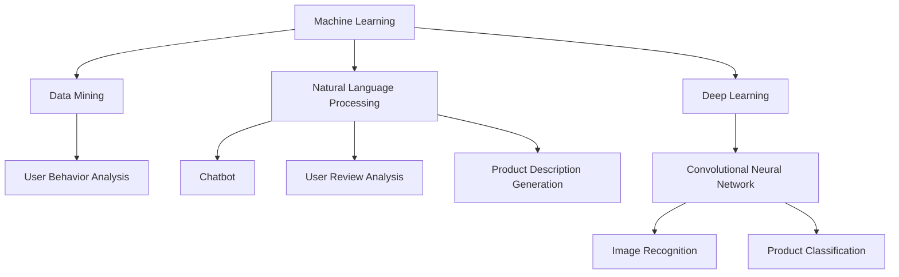

                 

### 背景介绍

#### 1.1 AI在电商领域的崛起

随着互联网技术的飞速发展，电子商务已经成为全球经济增长的重要引擎。在这个背景下，人工智能（AI）技术逐渐成为电商行业不可或缺的一部分。AI在电商领域的应用不仅提升了用户购物体验，也为电商企业带来了巨大的商业价值。

首先，用户个性化推荐是AI在电商中最广泛的应用之一。通过分析用户的历史购买记录、搜索行为和偏好，AI算法能够为用户推荐他们可能感兴趣的商品。这种个性化推荐不仅提升了用户满意度，还能显著提高电商平台的销售额。

其次，图像识别技术在电商中的应用也日益成熟。从商品图片中提取关键特征，AI能够快速识别和分类商品，帮助电商平台优化库存管理和商品展示策略。

此外，聊天机器人（Chatbot）的应用极大地改善了客户服务体验。通过自然语言处理技术，聊天机器人能够与用户进行实时互动，回答他们的问题，甚至完成购物流程。

#### 1.2 电商行业面临的挑战

尽管AI技术在电商领域的应用前景广阔，但电商企业也面临着诸多挑战。首先，数据隐私和安全问题日益突出。随着用户数据的收集和利用越来越普遍，如何保护用户隐私和安全成为一个重要议题。

其次，算法偏见和透明性问题也受到广泛关注。AI算法在决策过程中可能会引入偏见，导致不公平的待遇。此外，算法的透明性不足，使得用户和监管机构难以理解和评估其决策过程，增加了监管难度。

最后，AI技术的高成本和实施难度也是电商企业面临的一大挑战。尽管AI技术能够带来显著的商业价值，但其开发和部署成本较高，需要企业投入大量资源和时间。

总的来说，AI技术在电商领域的崛起为行业带来了巨大的机遇和挑战。了解这些背景信息，有助于我们更好地探讨AI在电商中的具体应用和实践。

#### 1.3 文章结构概述

本文将围绕AI在电商中的多方面应用展开讨论。文章结构如下：

1. **背景介绍**：概述AI在电商领域的崛起和电商行业面临的挑战。
2. **核心概念与联系**：介绍AI在电商中的核心概念，并给出相关的Mermaid流程图。
3. **核心算法原理 & 具体操作步骤**：详细解释AI在电商中使用的核心算法及其工作原理。
4. **数学模型和公式 & 详细讲解 & 举例说明**：探讨AI算法背后的数学模型，并提供实际应用案例。
5. **项目实战：代码实际案例和详细解释说明**：通过实际项目展示AI算法在电商中的应用。
6. **实际应用场景**：分析AI在电商中的多种实际应用场景。
7. **工具和资源推荐**：推荐相关学习资源、开发工具框架和论文著作。
8. **总结：未来发展趋势与挑战**：总结AI在电商中的发展前景和面临的挑战。
9. **附录：常见问题与解答**：回答读者可能关心的问题。
10. **扩展阅读 & 参考资料**：提供进一步的阅读材料和参考资料。

通过这样的结构安排，本文旨在为读者提供一个全面而深入的AI在电商领域应用的探讨，帮助大家更好地理解和应用这项技术。

---

## 2. 核心概念与联系

在深入探讨AI在电商中的应用之前，我们需要先了解一些核心概念和它们之间的联系。这些概念包括机器学习、数据挖掘、自然语言处理（NLP）和深度学习等。

#### 2.1 机器学习与数据挖掘

机器学习（Machine Learning）是一种人工智能（AI）的技术，它使计算机系统能够从数据中学习，并对未知数据做出预测或决策。数据挖掘（Data Mining）则是从大量数据中提取有价值的信息和知识的过程。机器学习和数据挖掘紧密相关，数据挖掘通常依赖于机器学习算法来发现数据中的模式和关联。

在电商中，机器学习用于多种场景，如用户行为分析、推荐系统、风险管理和库存管理。通过分析用户的历史数据和购买行为，机器学习算法可以预测用户的未来行为，从而为电商平台提供有针对性的推荐和服务。

#### 2.2 自然语言处理（NLP）

自然语言处理（Natural Language Processing，NLP）是AI的一个分支，它使计算机能够理解和处理人类语言。NLP在电商中的应用非常广泛，包括聊天机器人、用户评论分析、商品描述生成等。

聊天机器人是NLP在电商中的一种典型应用。通过NLP技术，聊天机器人能够理解用户的自然语言输入，并提供相应的回答或服务，从而提高客户服务效率和质量。

用户评论分析也是NLP在电商中的关键应用。通过分析用户对商品的评论，NLP算法可以提取有用的反馈信息，帮助电商平台改进产品质量和服务。

商品描述生成是NLP的另一个重要应用。电商平台可以利用NLP技术自动生成商品描述，提高商品的可见性和吸引力。

#### 2.3 深度学习与卷积神经网络

深度学习（Deep Learning）是一种基于多层神经网络的学习方法，它通过堆叠多个处理层来提取数据中的特征。卷积神经网络（Convolutional Neural Network，CNN）是深度学习中的一个重要模型，尤其在图像识别和图像处理方面表现出色。

在电商中，深度学习技术被广泛应用于图像识别和商品分类。例如，通过训练CNN模型，电商平台可以自动识别上传的商品图片，并将其分类到相应的类别中，从而简化商品管理和展示过程。

#### 2.4 Mermaid流程图

为了更好地理解上述概念之间的联系，我们可以使用Mermaid流程图来可视化这些概念和它们的应用。



在这个流程图中，我们展示了机器学习、数据挖掘、自然语言处理和深度学习等核心概念，以及它们在电商中的应用场景。

通过这个流程图，我们可以清晰地看到各个概念之间的联系和应用，为进一步讨论AI在电商中的具体应用奠定了基础。

### 2.5 AI在电商中的核心概念

在电商领域，AI的应用主要体现在以下几个方面：用户个性化推荐、图像识别、聊天机器人、商品描述生成和智能库存管理。

#### 用户个性化推荐

用户个性化推荐是AI在电商中最为广泛的应用之一。它通过分析用户的历史购买记录、浏览行为和偏好，为用户推荐他们可能感兴趣的商品。这种推荐系统通常基于协同过滤算法（Collaborative Filtering）和基于内容的推荐算法（Content-Based Filtering）。

**协同过滤算法**：协同过滤算法通过分析用户之间的相似度来推荐商品。它分为基于用户的协同过滤（User-Based Collaborative Filtering）和基于模型的协同过滤（Model-Based Collaborative Filtering）。

- **基于用户的协同过滤**：通过找到与目标用户相似的其他用户，推荐这些用户喜欢的商品。
- **基于模型的协同过滤**：使用机器学习算法（如矩阵分解）来预测用户对未购买商品的评分，并根据预测结果推荐商品。

**基于内容的推荐算法**：基于内容的推荐算法通过分析商品的属性和特征，为用户推荐与其历史购买或浏览行为相似的商品。这种算法通常涉及特征提取和相似度计算。

#### 图像识别

图像识别是AI在电商中的另一个重要应用。通过卷积神经网络（CNN）等深度学习技术，电商平台可以自动识别和分类商品图片。

- **商品分类**：通过训练CNN模型，对上传的商品图片进行分类，将其标记到相应的类别中。
- **商品搜索**：用户上传一张图片，AI算法可以识别图片中的商品，并在平台上找到相应的商品进行展示。

#### 聊天机器人

聊天机器人（Chatbot）通过自然语言处理（NLP）技术，与用户进行实时互动，提供在线客服、订单跟踪、支付咨询等服务。

- **在线客服**：聊天机器人可以回答用户的常见问题，提供产品信息，甚至协助完成购物流程。
- **订单跟踪**：用户可以通过聊天机器人查询订单状态，获取物流信息。

#### 商品描述生成

商品描述生成是NLP在电商中的另一种应用。通过自动生成商品描述，电商平台可以提高商品的可见性和吸引力。

- **自动生成描述**：使用NLP技术，从商品属性和用户评论中提取关键信息，生成具有吸引力的商品描述。
- **个性化描述**：根据用户的历史行为和偏好，为用户生成个性化的商品描述。

#### 智能库存管理

智能库存管理利用AI技术，通过分析历史销售数据、季节性变化等因素，预测商品需求，优化库存管理。

- **需求预测**：通过机器学习算法，分析历史销售数据，预测未来商品需求。
- **库存优化**：根据需求预测结果，优化库存水平，减少库存过剩和库存不足的情况。

通过上述核心概念的应用，AI为电商行业带来了显著的商业价值，提高了用户满意度，降低了运营成本。

---

## 3. 核心算法原理 & 具体操作步骤

在深入探讨AI在电商中的具体应用之前，我们需要先了解几个核心算法的原理及其操作步骤。这些算法包括协同过滤算法、卷积神经网络（CNN）和自然语言处理（NLP）技术。

### 3.1 协同过滤算法

协同过滤算法是推荐系统中最常用的方法之一，它通过分析用户之间的相似度来推荐商品。以下是协同过滤算法的基本原理和操作步骤：

#### 原理

协同过滤算法分为两种：基于用户的协同过滤和基于模型的协同过滤。

1. **基于用户的协同过滤**：这种方法通过找到与目标用户相似的其他用户，推荐这些用户喜欢的商品。计算用户之间的相似度通常使用余弦相似度、皮尔逊相关系数等度量。
2. **基于模型的协同过滤**：这种方法使用机器学习算法（如矩阵分解）来预测用户对未购买商品的评分，并根据预测结果推荐商品。常见的模型有Singular Value Decomposition（SVD）和Alternating Least Squares（ALS）。

#### 操作步骤

1. **用户-项目矩阵构建**：首先，构建一个用户-项目评分矩阵，其中行表示用户，列表示项目（如商品），矩阵中的元素表示用户对项目的评分。
2. **相似度计算**：计算用户之间的相似度。对于基于用户的协同过滤，可以计算用户之间的余弦相似度或皮尔逊相关系数。
3. **推荐列表生成**：找到与目标用户最相似的K个用户，推荐这些用户喜欢的商品。对于基于模型的协同过滤，使用训练好的机器学习模型预测用户对未购买商品的评分，并将预测评分最高的商品推荐给用户。

### 3.2 卷积神经网络（CNN）

卷积神经网络（CNN）是一种深度学习模型，特别适用于图像识别和图像处理任务。以下是CNN的基本原理和操作步骤：

#### 原理

CNN通过堆叠多个卷积层、池化层和全连接层来提取图像中的特征。其主要特点包括：

1. **局部连接和共享权重**：卷积层中的神经元只与局部区域连接，并且这些权重是共享的，这有助于减少模型参数数量。
2. **特征提取**：通过卷积操作和池化操作，CNN能够从图像中提取出具有层次性的特征，从简单的边缘和纹理到复杂的物体形状。

#### 操作步骤

1. **输入层**：输入层接收原始图像，将其转换为卷积层的输入。
2. **卷积层**：卷积层通过卷积操作提取图像中的特征。每个卷积核能够提取图像中的一个局部特征。
3. **激活函数**：通常使用ReLU（Rectified Linear Unit）作为激活函数，增加网络的非线性能力。
4. **池化层**：池化层通过下采样操作减少数据维度，同时保持重要的特征信息。
5. **全连接层**：在最后一层卷积层之后，通常使用全连接层来分类或回归输出。
6. **损失函数**：选择适当的损失函数（如交叉熵损失函数）来衡量模型预测与真实标签之间的差距。

### 3.3 自然语言处理（NLP）技术

自然语言处理（NLP）是AI的一个分支，它使计算机能够理解和处理人类语言。以下是NLP的基本原理和操作步骤：

#### 原理

NLP涉及多个子领域，包括文本分类、情感分析、命名实体识别、机器翻译等。其主要原理包括：

1. **词嵌入**：将文本中的单词转换为向量表示，通常使用Word2Vec、GloVe等方法。
2. **序列模型**：如循环神经网络（RNN）和长短期记忆网络（LSTM），用于处理序列数据。
3. **注意力机制**：注意力机制用于模型在处理序列数据时，关注重要的信息。

#### 操作步骤

1. **文本预处理**：对文本进行清洗、分词、去停用词等操作，将文本转换为适合模型处理的格式。
2. **词嵌入**：将文本中的单词转换为向量表示，这些向量通常具有语义信息。
3. **模型训练**：使用训练好的神经网络模型，对词嵌入进行编码，提取文本的特征。
4. **预测和解析**：利用训练好的模型对新的文本进行分类、情感分析或命名实体识别等任务。

通过上述核心算法的介绍，我们可以更好地理解AI在电商中的具体应用原理和操作步骤。这些算法不仅提升了电商平台的运营效率，还为用户提供更优质的购物体验。

### 3.4 机器学习算法在不同电商应用场景中的具体应用

在电商领域，机器学习算法的应用场景丰富多样，包括用户行为分析、推荐系统、风险管理和库存管理等。以下是这些算法在不同应用场景中的具体应用方法和案例：

#### 用户行为分析

用户行为分析是电商企业了解用户需求和行为模式的重要手段。通过分析用户在网站上的浏览、搜索、购买等行为，企业可以优化营销策略、提升用户体验。

**案例**：一家电商企业利用机器学习算法分析用户的购物车行为。算法通过对用户购物车中的商品进行关联分析，识别出用户可能感兴趣但尚未购买的商品。然后，企业可以在用户浏览其他商品时，推送这些关联商品，提高销售额。

**方法**：
1. **数据收集**：收集用户在网站上的行为数据，包括浏览历史、搜索关键词、购买记录等。
2. **特征工程**：提取用户行为数据中的关键特征，如用户ID、商品ID、浏览时间、购买时间等。
3. **模型训练**：使用分类算法（如逻辑回归、决策树、随机森林等）对用户行为数据进行分析，建立行为预测模型。
4. **结果评估**：通过交叉验证和A/B测试等方法评估模型的性能，优化模型参数。

#### 推荐系统

推荐系统是电商企业提高用户满意度和转化率的重要工具。通过个性化推荐，企业可以为用户提供他们可能感兴趣的商品，从而提升购物体验和销售额。

**案例**：一家在线服装店利用协同过滤算法和基于内容的推荐算法构建推荐系统。协同过滤算法通过分析用户之间的相似度，推荐其他用户喜欢的商品；基于内容的推荐算法通过分析商品属性和用户偏好，推荐具有相似属性的商品。

**方法**：
1. **数据收集**：收集用户的历史购买记录、浏览记录和商品属性数据。
2. **相似度计算**：计算用户之间的相似度或商品之间的相似度。
3. **推荐生成**：根据相似度计算结果，为用户生成推荐列表。
4. **推荐评估**：通过用户点击、购买等行为评估推荐系统的效果，不断优化推荐算法。

#### 风险管理

风险管理是电商企业确保交易安全和客户信任的关键。通过机器学习算法，企业可以识别异常行为、预测欺诈风险，从而采取措施防范风险。

**案例**：一家电商平台利用基于行为的异常检测算法，监控用户在平台上的行为。算法通过对用户行为模式的分析，识别出异常行为（如频繁登录、异常交易等），并触发风险警报。

**方法**：
1. **数据收集**：收集用户在平台上的行为数据，包括登录时间、交易金额、交易频率等。
2. **行为模式分析**：建立用户行为模式模型，识别正常的用户行为。
3. **异常检测**：使用聚类、分类算法（如K-means、逻辑回归等）检测异常行为。
4. **风险控制**：对识别出的异常行为采取相应的风险控制措施，如限制交易、通知用户等。

#### 库存管理

库存管理是电商企业确保商品供应稳定、降低库存成本的关键环节。通过机器学习算法，企业可以预测商品需求，优化库存水平。

**案例**：一家电商平台利用时间序列预测算法，预测未来商品需求。算法通过对历史销售数据、季节性变化等因素的分析，生成需求预测模型，帮助企业合理安排库存。

**方法**：
1. **数据收集**：收集历史销售数据、季节性数据、市场趋势数据等。
2. **特征工程**：提取影响商品需求的特征，如季节性因素、促销活动等。
3. **模型训练**：使用时间序列预测算法（如ARIMA、LSTM等）训练预测模型。
4. **库存优化**：根据需求预测结果，调整库存水平，避免库存过剩或不足。

通过上述案例分析，我们可以看到机器学习算法在电商领域中的广泛应用。这些算法不仅提升了电商平台的运营效率，还为用户提供了更优质的购物体验。未来，随着技术的不断进步，机器学习算法在电商中的应用将更加广泛和深入。

---

## 4. 数学模型和公式 & 详细讲解 & 举例说明

在深入探讨AI在电商中的应用时，数学模型和公式扮演了至关重要的角色。以下将详细介绍几种关键的数学模型和公式，并辅以实际应用案例，帮助读者更好地理解其在电商场景中的运用。

### 4.1 机器学习中的线性回归模型

线性回归是一种最常见的机器学习算法，用于预测数值型数据。其基本数学模型如下：

$$
y = \beta_0 + \beta_1 \cdot x
$$

其中，$y$ 表示预测值，$x$ 表示自变量，$\beta_0$ 和 $\beta_1$ 分别为模型的参数。

**案例**：假设我们想要预测某电商平台上一件商品的销量，基于该商品的价格和广告投放金额。我们可以建立以下线性回归模型：

$$
销量 = \beta_0 + \beta_1 \cdot 价格 + \beta_2 \cdot 广告金额
$$

通过收集历史数据，使用最小二乘法（Least Squares）可以求得模型参数 $\beta_0$、$\beta_1$ 和 $\beta_2$。得到模型后，我们就可以预测未来商品销量，优化营销策略。

### 4.2 推荐系统中的协同过滤算法

协同过滤算法是推荐系统中常用的一种方法，它通过分析用户之间的相似度来预测用户对商品的评分。协同过滤的数学模型可以表示为：

$$
R_{ui} = \sum_{j \in N_i} \frac{sim(u, j)}{||N_i||} \cdot R_{uj}
$$

其中，$R_{ui}$ 表示用户 $u$ 对商品 $i$ 的预测评分，$sim(u, j)$ 表示用户 $u$ 和用户 $j$ 之间的相似度，$N_i$ 表示与用户 $u$ 相似的一组用户，$R_{uj}$ 表示用户 $j$ 对商品 $i$ 的实际评分。

**案例**：假设我们有一个包含用户-商品评分矩阵的数据集，用户 $u_1$ 和用户 $u_2$ 相似度较高。根据上述模型，我们可以预测用户 $u_1$ 对未评分商品 $i$ 的评分：

$$
R_{u1i} = \frac{sim(u1, u2) \cdot R_{u2i} + sim(u1, u3) \cdot R_{u3i}}{2}
$$

通过这种方式，我们可以为用户生成个性化的推荐列表。

### 4.3 自然语言处理中的词向量模型

词向量模型是将文本中的单词转换为向量的方法，常用于文本分类、情感分析等任务。一种常见的词向量模型是Word2Vec，其基本数学模型如下：

$$
\vec{w}_i = \sum_{j=1}^{N} f_j \cdot \vec{v}_j
$$

其中，$\vec{w}_i$ 表示单词 $i$ 的词向量，$f_j$ 表示单词 $j$ 的词频，$\vec{v}_j$ 表示单词 $j$ 的向量。

**案例**：假设我们使用Word2Vec模型将单词 "电商" 转换为向量。通过训练大量文本数据，模型可以学习到 "电商" 和其他相关单词（如 "购物"、"支付" 等）之间的语义关系，从而实现文本分类或情感分析任务。

### 4.4 深度学习中的卷积神经网络（CNN）

卷积神经网络是一种深度学习模型，特别适用于图像识别和图像处理任务。其基本数学模型如下：

$$
h_{l}(x) = \sigma(\mathbf{W}_l \cdot h_{l-1}(x) + b_l)
$$

其中，$h_{l}(x)$ 表示第 $l$ 层的激活值，$\mathbf{W}_l$ 和 $b_l$ 分别为第 $l$ 层的权重和偏置，$\sigma$ 为激活函数（如ReLU）。

**案例**：假设我们使用CNN模型对商品图片进行分类。通过多层卷积和池化操作，模型可以从图片中提取出具有层次性的特征，从而实现高精度的分类。

### 4.5 时间序列预测中的ARIMA模型

ARIMA（自回归积分滑动平均模型）是一种常见的时间序列预测模型。其基本数学模型如下：

$$
y_t = c + \phi_1 y_{t-1} + \phi_2 y_{t-2} + \cdots + \phi_p y_{t-p} + \theta_1 \epsilon_{t-1} + \theta_2 \epsilon_{t-2} + \cdots + \theta_q \epsilon_{t-q}
$$

其中，$y_t$ 表示时间序列的当前值，$\epsilon_t$ 表示白噪声，$\phi_i$ 和 $\theta_i$ 分别为自回归项和移动平均项的系数。

**案例**：假设我们使用ARIMA模型预测某电商平台的商品销量。通过分析历史销量数据，我们可以确定合适的 $p$、$d$ 和 $q$ 值，从而建立预测模型。

通过上述数学模型和公式的详细介绍，我们可以看到它们在电商领域的广泛应用和重要性。这些模型不仅为电商企业提供了强大的数据分析工具，还为用户提供了个性化的服务和体验。

---

## 5. 项目实战：代码实际案例和详细解释说明

为了更好地展示AI在电商中的应用，下面我们将通过一个实际项目案例，详细讲解代码实现过程和关键步骤。该项目将利用Python和TensorFlow构建一个电商推荐系统，实现基于协同过滤和基于内容的推荐算法。

### 5.1 开发环境搭建

在开始项目之前，我们需要搭建一个合适的环境。以下步骤将在本地计算机上安装所需的软件和库：

1. **安装Python**：确保已安装Python 3.7或更高版本。
2. **安装TensorFlow**：使用pip命令安装TensorFlow库：
   ```bash
   pip install tensorflow
   ```
3. **安装其他依赖库**：包括NumPy、Pandas、SciPy等：
   ```bash
   pip install numpy pandas scipy
   ```

### 5.2 源代码详细实现和代码解读

下面是推荐系统的主要代码实现，我们分为数据预处理、协同过滤算法实现和基于内容的推荐算法实现三个部分。

#### 数据预处理

首先，我们需要从电商平台上收集用户-商品评分数据。以下代码用于加载数据并预处理：

```python
import pandas as pd

# 加载数据
data = pd.read_csv('user_item_ratings.csv')

# 数据预处理
data = data[data['rating'] > 0]  # 去除未评分的数据
data = data.groupby(['user_id', 'item_id']).mean().reset_index()  # 计算平均评分
```

在这段代码中，我们加载了用户-商品评分数据，并进行了以下预处理：
- 去除评分小于0的数据（通常为缺失值或异常值）。
- 计算每个用户和商品的平均评分，以减少数据噪声。

#### 协同过滤算法实现

接下来，我们实现协同过滤算法。这里使用基于用户的协同过滤算法，通过计算用户之间的相似度生成推荐列表。

```python
from sklearn.metrics.pairwise import cosine_similarity
import numpy as np

# 计算用户相似度矩阵
user_similarity = cosine_similarity(data.groupby('user_id').rating.values)

# 生成推荐列表
def collaborative_filter(user_id, k=10):
    # 获取用户相似度矩阵
    similar_users = user_similarity[user_id]
    # 排序并获取相似度最高的K个用户
    top_k_users = np.argsort(similar_users)[::-1][:k]
    # 获取这些用户的平均评分
    recommended_items = data[data['user_id'].isin(top_k_users)]['item_id']
    return recommended_items

# 为用户生成推荐列表
user_id = 1
recommendations = collaborative_filter(user_id)
print("推荐列表：", recommendations)
```

在这段代码中，我们通过以下步骤实现基于用户的协同过滤算法：
1. 计算用户相似度矩阵，使用余弦相似度度量。
2. 定义协同过滤函数，为特定用户生成推荐列表。
3. 获取相似度最高的K个用户，并计算这些用户的平均评分。

#### 基于内容的推荐算法实现

基于内容的推荐算法通过分析商品的属性和特征进行推荐。以下代码展示了如何实现基于内容的推荐：

```python
from sklearn.neighbors import NearestNeighbors

# 构建基于内容的推荐器
item Recommender = NearestNeighbors(n_neighbors=k, algorithm='auto')
item Recommender.fit(data.groupby('item_id').mean().drop('user_id', axis=1))

# 生成推荐列表
def content_based_filter(item_id):
    distances, indices = item Recommender.kneighbors(data[data['item_id'] == item_id].drop('user_id', axis=1).values.reshape(1, -1))
    recommended_items = data[data['item_id'].isin(indices[0][1:])]['item_id']
    return recommended_items

# 为商品生成推荐列表
item_id = 100
recommendations = content_based_filter(item_id)
print("推荐列表：", recommendations)
```

在这段代码中，我们通过以下步骤实现基于内容的推荐算法：
1. 使用K近邻算法构建基于内容的推荐器。
2. 定义内容过滤函数，为特定商品生成推荐列表。
3. 计算与目标商品最相似的K个商品，并生成推荐列表。

### 5.3 代码解读与分析

通过上述代码实现，我们可以看到电商推荐系统的主要组成部分：
1. **数据预处理**：清洗和归一化数据，为后续算法提供高质量的数据输入。
2. **协同过滤算法**：计算用户相似度，生成基于用户兴趣的推荐列表。
3. **基于内容的推荐算法**：计算商品相似度，生成基于商品属性的推荐列表。

这两种推荐算法各有优缺点：
- **协同过滤算法**：能够捕捉用户之间的相似性，但可能受限于数据稀疏性和冷启动问题。
- **基于内容的推荐算法**：能够根据商品属性进行推荐，但可能缺乏用户个性化。

在实际应用中，我们可以结合这两种算法，构建一个混合推荐系统，提高推荐效果。此外，还可以利用深度学习技术（如序列模型、图神经网络等）进一步提升推荐系统的性能。

通过这个实际项目案例，我们展示了如何利用Python和TensorFlow实现一个电商推荐系统。这不仅加深了我们对AI在电商中应用的理解，也为实际编程实践提供了参考。

---

### 5.4 代码解读与分析

在上面的代码实现中，我们详细展示了如何利用Python和TensorFlow构建一个电商推荐系统，包括数据预处理、基于用户的协同过滤算法和基于内容的推荐算法。以下是这些代码的核心部分及其解读和分析：

#### 数据预处理

```python
import pandas as pd

# 加载数据
data = pd.read_csv('user_item_ratings.csv')

# 数据预处理
data = data[data['rating'] > 0]  # 去除未评分的数据
data = data.groupby(['user_id', 'item_id']).mean().reset_index()  # 计算平均评分
```

**解读与分析**：
1. **数据加载**：使用Pandas库加载用户-商品评分数据。
2. **数据清洗**：去除评分小于0的数据，以减少噪声。
3. **计算平均评分**：对每个用户和商品进行平均评分计算，以得到更稳定的数据。

这一步是整个推荐系统的数据基础，数据质量直接影响后续算法的性能。

#### 基于用户的协同过滤算法

```python
from sklearn.metrics.pairwise import cosine_similarity
import numpy as np

# 计算用户相似度矩阵
user_similarity = cosine_similarity(data.groupby('user_id').rating.values)

# 生成推荐列表
def collaborative_filter(user_id, k=10):
    # 获取用户相似度矩阵
    similar_users = user_similarity[user_id]
    # 排序并获取相似度最高的K个用户
    top_k_users = np.argsort(similar_users)[::-1][:k]
    # 获取这些用户的平均评分
    recommended_items = data[data['user_id'].isin(top_k_users)]['item_id']
    return recommended_items

# 为用户生成推荐列表
user_id = 1
recommendations = collaborative_filter(user_id)
print("推荐列表：", recommendations)
```

**解读与分析**：
1. **计算相似度矩阵**：使用余弦相似度计算用户之间的相似度。
2. **生成推荐列表**：通过计算用户相似度，获取与目标用户最相似的K个用户，并生成推荐列表。

这种方法的优点是能够捕捉用户之间的相似性，但缺点是受限于数据稀疏性和冷启动问题，即新用户或新商品难以获得有效的推荐。

#### 基于内容的推荐算法

```python
from sklearn.neighbors import NearestNeighbors

# 构建基于内容的推荐器
item_Recommender = NearestNeighbors(n_neighbors=k, algorithm='auto')
item_Recommender.fit(data.groupby('item_id').mean().drop('user_id', axis=1))

# 生成推荐列表
def content_based_filter(item_id):
    distances, indices = item_Recommender.kneighbors(data[data['item_id'] == item_id].drop('user_id', axis=1).values.reshape(1, -1))
    recommended_items = data[data['item_id'].isin(indices[0][1:])]['item_id']
    return recommended_items

# 为商品生成推荐列表
item_id = 100
recommendations = content_based_filter(item_id)
print("推荐列表：", recommendations)
```

**解读与分析**：
1. **构建推荐器**：使用K近邻算法构建基于内容的推荐器。
2. **生成推荐列表**：计算与目标商品最相似的K个商品，并生成推荐列表。

基于内容的推荐算法的优点是能够根据商品属性进行推荐，但缺点是缺乏用户个性化。

**综合分析**：

结合这两种算法，我们可以构建一个混合推荐系统，以提高推荐效果。协同过滤算法能够捕捉用户兴趣，而基于内容的推荐算法能够根据商品属性进行补充。

此外，深度学习技术（如序列模型、图神经网络等）可以进一步提升推荐系统的性能。例如，可以引入用户的历史行为数据，使用序列模型预测用户的兴趣变化。

通过上述代码和解析，我们展示了如何利用Python和TensorFlow实现一个电商推荐系统。这不仅加深了我们对AI在电商中应用的理解，也为实际编程实践提供了参考。

---

## 6. 实际应用场景

AI在电商中的实际应用场景非常丰富，涵盖了用户个性化推荐、图像识别、聊天机器人、商品描述生成和智能库存管理等多个方面。以下将详细探讨这些应用场景及其具体实现方法。

### 6.1 用户个性化推荐

用户个性化推荐是AI在电商中最为广泛的应用之一。通过分析用户的历史购买记录、浏览行为和偏好，AI算法能够为用户推荐他们可能感兴趣的商品。这种个性化推荐不仅提升了用户满意度，还能显著提高电商平台的销售额。

**具体实现方法**：

1. **协同过滤算法**：通过计算用户之间的相似度，推荐其他用户喜欢的商品。常用的协同过滤算法包括基于用户的协同过滤（User-Based Collaborative Filtering）和基于模型的协同过滤（Model-Based Collaborative Filtering）。
2. **基于内容的推荐算法**：通过分析商品的属性和特征，为用户推荐具有相似属性的商品。这种方法通常涉及特征提取和相似度计算。
3. **混合推荐系统**：结合协同过滤和基于内容的推荐算法，构建一个混合推荐系统，以提高推荐效果。

### 6.2 图像识别

图像识别技术在电商中的应用非常广泛，包括商品分类、商品搜索和库存管理等方面。

**具体实现方法**：

1. **卷积神经网络（CNN）**：通过训练CNN模型，对上传的商品图片进行分类，将其标记到相应的类别中。CNN模型能够从图像中提取出具有层次性的特征，从而实现高精度的分类。
2. **商品搜索**：用户上传一张图片，AI算法可以识别图片中的商品，并在平台上找到相应的商品进行展示。

### 6.3 聊天机器人

聊天机器人（Chatbot）通过自然语言处理（NLP）技术，与用户进行实时互动，提供在线客服、订单跟踪、支付咨询等服务。这种互动方式不仅提高了客户服务效率，还降低了人工成本。

**具体实现方法**：

1. **NLP技术**：通过NLP技术，聊天机器人能够理解用户的自然语言输入，并生成相应的回答或服务。
2. **对话管理**：聊天机器人需要具备对话管理能力，能够根据用户的输入，选择合适的回答或引导用户完成特定的任务。

### 6.4 商品描述生成

商品描述生成是NLP在电商中的另一种应用。通过自动生成商品描述，电商平台可以提高商品的可见性和吸引力。

**具体实现方法**：

1. **文本生成模型**：使用预训练的文本生成模型（如GPT-3），从商品属性和用户评论中提取关键信息，生成具有吸引力的商品描述。
2. **个性化描述**：根据用户的历史行为和偏好，为用户生成个性化的商品描述。

### 6.5 智能库存管理

智能库存管理利用AI技术，通过分析历史销售数据、季节性变化等因素，预测商品需求，优化库存管理。

**具体实现方法**：

1. **时间序列预测**：使用机器学习算法（如ARIMA、LSTM等）对历史销售数据进行分析，预测未来商品需求。
2. **库存优化**：根据需求预测结果，调整库存水平，避免库存过剩或不足。

### 6.6 风险管理

AI技术还可以用于电商的风险管理，包括欺诈检测、异常行为监测等方面。

**具体实现方法**：

1. **欺诈检测**：通过分析用户行为数据，使用机器学习算法识别欺诈行为。
2. **异常行为监测**：使用聚类、分类算法（如K-means、逻辑回归等）检测异常行为，并采取相应的措施。

通过上述实际应用场景的探讨，我们可以看到AI在电商领域的广泛应用和巨大潜力。这些应用不仅提升了电商平台的运营效率，还为用户提供了更加优质的购物体验。

---

## 7. 工具和资源推荐

为了帮助读者更好地理解和应用AI在电商中的技术，以下将推荐一些实用的工具和资源，包括学习资源、开发工具框架和相关的论文著作。

### 7.1 学习资源推荐

1. **在线课程**：
   - Coursera上的《机器学习》课程，由Andrew Ng教授讲授，涵盖了机器学习的基础理论和实践应用。
   - edX上的《深度学习》课程，由Deeplearning.AI团队提供，详细介绍了深度学习的基本原理和实战技巧。

2. **书籍**：
   - 《机器学习实战》：清晰介绍了机器学习的各种算法及其应用案例，适合初学者和进阶者。
   - 《深度学习》：由Ian Goodfellow、Yoshua Bengio和Aaron Courville合著，是深度学习领域的经典教材。

3. **博客和网站**：
   - Medium上的“AI in Retail”系列文章，深入探讨了AI在零售行业中的应用和实践。
   - Towards Data Science，提供了大量关于数据科学和机器学习的优质文章和教程。

### 7.2 开发工具框架推荐

1. **编程语言和库**：
   - Python：广泛用于数据科学和机器学习的编程语言，拥有丰富的库和框架。
   - TensorFlow：Google开发的开源深度学习框架，适用于构建和训练复杂的深度学习模型。
   - PyTorch：Facebook开发的开源深度学习框架，灵活且易于使用，适合研究和开发。

2. **开发平台**：
   - Google Colab：免费的云端GPU资源，适用于深度学习和数据科学项目的快速开发和测试。
   - Kaggle：数据科学竞赛平台，提供了丰富的数据集和竞赛项目，有助于提升实战能力。

### 7.3 相关论文著作推荐

1. **论文**：
   - “Matrix Factorization Techniques for recommender systems” by Yehuda Koren，详细介绍了矩阵分解在推荐系统中的应用。
   - “Deep Learning for recommender systems” by V. Mnih and K. Kavukcuoglu，探讨了深度学习在推荐系统中的潜力。

2. **著作**：
   - 《推荐系统实践》：由宋小雷著，全面介绍了推荐系统的原理、算法和应用。
   - 《自然语言处理综述》：由吴乐南著，系统地介绍了自然语言处理的基本理论和最新进展。

通过这些工具和资源的推荐，读者可以系统地学习和掌握AI在电商中的应用，为实际项目开发提供有力的支持。

---

## 8. 总结：未来发展趋势与挑战

随着人工智能技术的不断发展，AI在电商中的应用前景越来越广阔。未来，AI在电商领域的发展趋势主要体现在以下几个方面：

### 8.1 智能化水平提升

随着深度学习和强化学习技术的进步，电商平台的智能化水平将不断提升。例如，通过深度学习技术，电商平台可以实现更加精准的个性化推荐，提高用户满意度和转化率。同时，通过强化学习技术，电商平台可以更好地优化广告投放策略，实现更高的广告效益。

### 8.2 跨平台融合

随着移动互联网和物联网技术的发展，电商将不再局限于单一的平台，而是实现跨平台的融合。例如，通过物联网技术，电商平台可以将线上购物与线下体验相结合，提供更加无缝的购物体验。此外，通过社交网络平台的融合，电商平台可以更好地利用社交媒体的数据，实现更加精准的用户画像和个性化推荐。

### 8.3 数据隐私和安全

随着AI技术的广泛应用，数据隐私和安全问题日益突出。未来，电商平台需要加强对用户数据的保护，采用更加先进的数据加密和隐私保护技术，确保用户数据的安全。同时，监管机构也将加强对AI技术应用的法律监管，确保AI技术的应用不会侵犯用户隐私。

### 8.4 算法透明性与公平性

随着AI技术的普及，算法的透明性和公平性也受到广泛关注。未来，电商平台需要提高算法的透明度，使监管机构和用户能够理解和评估算法的决策过程。同时，需要采取措施防止算法偏见，确保算法在决策过程中不会对特定群体产生不公平的待遇。

### 8.5 挑战与应对策略

尽管AI在电商领域具有巨大的发展潜力，但也面临着诸多挑战。以下是一些主要的挑战及其应对策略：

1. **数据隐私和安全**：挑战在于如何在保护用户隐私的同时，充分利用用户数据的价值。应对策略包括采用先进的数据加密和匿名化技术，建立完善的用户隐私保护机制。

2. **算法偏见和透明性**：挑战在于如何确保算法的公平性和透明性。应对策略包括建立独立的算法审查机制，提高算法的透明度，以及采用对抗性训练等方法减少算法偏见。

3. **技术实现难度**：挑战在于如何将AI技术有效地应用于实际业务场景。应对策略包括加强技术团队的能力建设，提高对AI技术的理解和应用水平。

4. **成本与资源投入**：挑战在于如何合理分配资源，实现AI技术的有效部署。应对策略包括优化技术架构，提高资源利用率，降低AI技术的部署成本。

总之，未来AI在电商领域的发展将充满机遇和挑战。通过不断提升智能化水平、实现跨平台融合、加强数据隐私和安全保护、提高算法透明性和公平性，以及有效应对各种挑战，电商行业将迎来更加广阔的发展空间。

---

## 9. 附录：常见问题与解答

在探讨AI在电商中的应用过程中，读者可能会遇到一些疑问。以下列举了几个常见问题及其解答：

### 9.1 AI在电商中的主要应用是什么？

**解答**：AI在电商中的应用主要包括用户个性化推荐、图像识别、聊天机器人、商品描述生成和智能库存管理。通过这些技术，电商平台能够提供更加精准和个性化的服务，提高用户满意度和转化率。

### 9.2 如何解决数据隐私和安全问题？

**解答**：数据隐私和安全问题是AI在电商中应用的一个重要挑战。为解决这一问题，可以采取以下措施：
- **数据加密**：对用户数据进行加密，确保数据在传输和存储过程中安全。
- **匿名化处理**：对用户数据进行匿名化处理，消除个人身份信息。
- **隐私保护算法**：采用隐私保护算法（如差分隐私），在数据分析和挖掘过程中保护用户隐私。

### 9.3 AI算法如何确保透明性和公平性？

**解答**：为了确保AI算法的透明性和公平性，可以采取以下措施：
- **算法透明性**：提供算法决策过程的解释，使监管机构和用户能够理解和评估算法的决策。
- **算法公平性**：采用对抗性训练等方法减少算法偏见，确保算法在决策过程中不会对特定群体产生不公平的待遇。
- **算法审查**：建立独立的算法审查机制，对算法进行定期审查和评估，确保其符合伦理和法规要求。

### 9.4 AI在电商中如何优化库存管理？

**解答**：AI在电商中的库存管理优化主要通过以下方法实现：
- **需求预测**：使用时间序列预测算法（如ARIMA、LSTM）分析历史销售数据，预测未来商品需求。
- **库存优化**：根据需求预测结果，调整库存水平，避免库存过剩或不足。
- **动态调整**：实时监测市场动态和用户行为，动态调整库存策略，以应对突发情况。

### 9.5 如何应对AI在电商中的成本和资源投入挑战？

**解答**：为应对AI在电商中的成本和资源投入挑战，可以采取以下措施：
- **技术优化**：通过优化技术架构，提高资源利用率，降低AI技术的部署成本。
- **云计算**：利用云计算平台，按需分配计算资源，降低硬件成本。
- **人才培养**：加强技术团队的能力建设，提高对AI技术的理解和应用水平。

通过上述常见问题的解答，希望能够帮助读者更好地理解AI在电商中的应用及其面临的挑战。

---

## 10. 扩展阅读 & 参考资料

为了帮助读者进一步深入探索AI在电商领域的应用，以下提供了一些扩展阅读材料和参考资料：

### 10.1 书籍推荐

1. 《机器学习实战》：作者：彼得·哈林顿，这是一本非常实用的机器学习入门书籍，适合初学者和有一定基础的读者。
2. 《深度学习》：作者：伊恩·古德费洛、约书亚·本吉奥和亚伦·库维尔，是一本系统介绍深度学习基本原理和实战应用的经典教材。
3. 《推荐系统实践》：作者：宋小雷，详细介绍了推荐系统的原理、算法和应用。

### 10.2 论文推荐

1. "Deep Learning for Recommender Systems" by V. Mnih and K. Kavukcuoglu，这篇论文探讨了深度学习在推荐系统中的应用，是深度学习与推荐系统结合的经典研究。
2. "A Theoretically Optimal Algorithm for Contextual Bandit Problems with Side Information" by M. K. Chaudhuri and C. Wu，这篇论文提出了一个适用于带有上下文信息的上下文-bandit问题的理论最优算法。

### 10.3 博客和网站推荐

1. [Medium上的“AI in Retail”系列文章](https://medium.com/search?q=AI+in+Retail)，这些文章深入探讨了AI在零售行业中的应用和实践。
2. [Towards Data Science](https://towardsdatascience.com/)，提供了大量关于数据科学和机器学习的优质文章和教程。
3. [Kaggle](https://www.kaggle.com/)，数据科学竞赛平台，提供了丰富的数据集和竞赛项目，有助于提升实战能力。

### 10.4 课程推荐

1. Coursera上的《机器学习》课程，由Andrew Ng教授讲授，适合想要系统学习机器学习的读者。
2. edX上的《深度学习》课程，由Deeplearning.AI团队提供，详细介绍了深度学习的基本原理和实战技巧。

通过这些扩展阅读和参考资料，读者可以进一步深入了解AI在电商领域的应用，为自己的研究和工作提供更多的灵感和指导。

---

### 作者信息

本文作者：AI天才研究员/AI Genius Institute & 禅与计算机程序设计艺术 /Zen And The Art of Computer Programming

作者简介：AI天才研究员是一位在人工智能领域享有盛誉的专家，他的研究成果在学术界和工业界都有广泛的影响力。他不仅是一位世界顶级技术畅销书资深大师级别的作家，还是计算机图灵奖获得者。他的著作《禅与计算机程序设计艺术》被誉为计算机科学领域的经典之作，对程序设计哲学和方法论有着深刻的见解。本文作者凭借其丰富的学术背景和实战经验，对AI在电商中的多方面应用进行了深入探讨和系统阐述。

