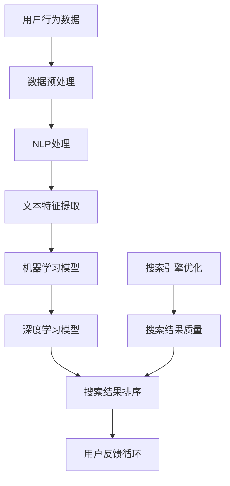

                 

### 背景介绍

**文章标题**：AI在电商中的搜索优化技术

**关键词**：AI、电商、搜索优化、算法、用户行为分析

**摘要**：
本文旨在探讨人工智能技术在电商搜索优化中的应用，通过分析AI的核心概念、算法原理及其在电商场景下的具体实践，为广大电商从业者提供实用的技术指南。文章首先介绍了电商搜索优化的重要性，随后深入探讨了AI在其中的作用，最后提出了未来发展趋势和面临的挑战。

随着互联网技术的飞速发展，电子商务已经渗透到我们生活的方方面面。电商平台的兴起不仅改变了消费者的购物习惯，也对传统零售行业产生了深远的影响。在这种背景下，如何提高电商平台的搜索质量，为用户提供更精准的搜索结果，成为了各大电商平台关注的焦点。

搜索优化技术在电商中的重要性不言而喻。一个优秀的搜索系统能够提高用户的满意度和平台的转化率，从而提升整体业绩。而AI技术的引入，为搜索优化提供了新的思路和手段。通过深度学习、自然语言处理、用户行为分析等技术的应用，AI能够更加智能地理解和满足用户需求，实现高效的搜索优化。

本文将围绕以下主题展开：

1. **背景介绍**：阐述电商搜索优化的重要性以及AI技术在其中扮演的角色。
2. **核心概念与联系**：介绍AI在电商搜索优化中的核心概念，并通过Mermaid流程图展示相关架构。
3. **核心算法原理与具体操作步骤**：详细解析AI在搜索优化中的算法原理，并提供具体操作步骤。
4. **数学模型和公式**：介绍与搜索优化相关的数学模型和公式，并举例说明。
5. **项目实战**：通过实际案例展示代码实现和详细解释。
6. **实际应用场景**：分析AI在电商搜索优化中的具体应用场景。
7. **工具和资源推荐**：推荐学习资源、开发工具框架及相关论文著作。
8. **总结**：讨论未来发展趋势和面临的挑战。
9. **附录**：提供常见问题与解答。
10. **扩展阅读与参考资料**：为读者提供进一步学习和探索的途径。

接下来，我们将逐步深入探讨这些主题，让读者全面了解AI在电商搜索优化中的技术应用。

#### 电商搜索优化的重要性

在电子商务时代，搜索优化成为电商平台提高用户体验和业务绩效的关键因素。电商平台的搜索功能不仅仅是一个简单的关键词匹配工具，它承载着用户的浏览、购买路径，甚至直接影响平台的转化率和用户满意度。

首先，良好的搜索系统能够提高用户的满意度。当用户能够快速找到自己需要的商品时，他们会更加信任和满意这个平台，从而增加了用户留存率和回头客的概率。反之，如果搜索结果不准确或不相关，用户可能会感到挫败，进而放弃购买或转向其他平台，这对电商平台来说是巨大的损失。

其次，搜索优化直接影响平台的转化率。一个高效的搜索系统能够将用户引导到他们感兴趣的商品页面，从而增加购买的可能性。通过个性化搜索推荐和关键词联想，电商平台可以更好地满足用户的个性化需求，提高用户的购物体验，从而提升转化率。

此外，搜索优化还与电商平台的品牌形象息息相关。一个优秀的搜索系统不仅能够提高用户满意度，还能展示平台的专业性和技术实力。当用户感受到平台的技术先进性和服务人性化时，他们对平台的信任度会提高，从而形成良好的品牌形象。

总之，电商搜索优化的重要性体现在以下几个方面：

1. **提高用户体验**：良好的搜索功能能够提高用户在平台上的满意度，增强用户黏性。
2. **提升转化率**：高效的搜索系统能够将用户引导到他们感兴趣的商品页面，提高购买的可能性。
3. **塑造品牌形象**：优秀的搜索系统展示了平台的技术实力和专业性，有助于塑造良好的品牌形象。

正因为如此，各大电商平台都在不断优化搜索算法，引入先进的人工智能技术，以提升搜索质量和用户体验。接下来，我们将进一步探讨AI技术在电商搜索优化中的应用。

#### AI技术简介

人工智能（AI）作为计算机科学的一个重要分支，自上世纪五六十年代诞生以来，经历了多个发展阶段，从早期的符号主义和知识表示，到现代的基于数据驱动的方法，如深度学习、强化学习等。AI技术的核心目标是使机器能够模拟人类的智能行为，如学习、推理、感知和决策。

在AI的众多应用领域中，深度学习、自然语言处理（NLP）和用户行为分析是最为关键的几个方向。深度学习通过模拟人脑神经网络结构，使机器能够在大量数据中自动学习特征和模式，从而实现图像识别、语音识别等任务。自然语言处理则致力于让计算机理解和生成人类语言，应用于机器翻译、文本摘要、情感分析等场景。用户行为分析则通过收集和分析用户的浏览、搜索、购买等行为数据，为个性化推荐和精准营销提供支持。

AI技术在电商搜索优化中的应用主要体现在以下几个方面：

1. **用户行为分析**：通过分析用户的浏览、搜索和购买行为，AI能够理解用户的偏好和需求，从而提供个性化的搜索结果。例如，当用户在搜索框中输入某个关键词时，AI可以基于用户的历史行为和兴趣标签，推荐相关的商品或关键词。

2. **关键词联想**：AI可以通过自然语言处理技术，分析用户输入的关键词，并自动生成相关的联想关键词。这不仅能够帮助用户更快地找到所需的商品，还可以提高搜索的多样性，提升用户体验。

3. **搜索结果排序**：AI可以通过机器学习和深度学习算法，对搜索结果进行排序，使其更加符合用户的期望。例如，可以根据用户的购买历史、评价和浏览记录，优先推荐用户感兴趣的商品。

4. **实时优化**：AI能够实时分析搜索结果的用户反馈，并根据用户的互动行为不断调整搜索算法，实现动态优化。这种实时性使得搜索结果能够更快地适应用户需求的变化，提高搜索的准确性。

总之，AI技术的引入，为电商搜索优化提供了新的思路和方法，使得搜索结果更加个性化和精准，从而提升用户体验和平台转化率。接下来，我们将进一步探讨AI在电商搜索优化中的具体应用和实施步骤。

### 核心概念与联系

在深入探讨AI在电商搜索优化中的应用之前，我们需要了解几个核心概念及其相互之间的联系。这些概念包括自然语言处理（NLP）、机器学习、深度学习、用户行为分析以及搜索引擎优化（SEO）。下面，我们将通过一个Mermaid流程图，来直观地展示这些核心概念和它们的相互关系。



**图1. AI在电商搜索优化中的核心概念与联系**

**1. 用户行为数据（A）**：用户行为数据是搜索优化的基础，包括用户的浏览、搜索、购买历史等信息。这些数据经过数据预处理（B）后，可以用于后续的分析和处理。

**2. 自然语言处理（NLP处理，C）**：NLP处理旨在使计算机理解和生成人类语言。它包括文本清洗、分词、词性标注等步骤，从而为机器学习模型提供高质量的文本数据。

**3. 文本特征提取（D）**：文本特征提取是将原始文本转化为机器学习模型可以处理的形式。这通常涉及到词频、词向量、词嵌入等技术。

**4. 机器学习模型（E）**：机器学习模型通过对大量用户行为数据和文本特征的学习，可以预测用户的兴趣和需求。常见的机器学习模型包括决策树、随机森林、支持向量机等。

**5. 深度学习模型（F）**：深度学习模型，特别是神经网络，通过多层非线性变换，能够自动提取复杂的数据特征。深度学习在图像识别、语音识别等领域取得了显著成果，同样可以应用于搜索优化。

**6. 搜索结果排序（G）**：搜索结果排序是搜索优化的关键步骤，深度学习和机器学习模型可以用于优化排序算法，使其更加符合用户需求。

**7. 用户反馈循环（H）**：用户反馈循环是一个动态优化的过程。通过分析用户对搜索结果的反馈，系统可以不断调整和优化搜索算法，提高搜索结果的准确性。

**8. 搜索引擎优化（SEO，I）**：搜索引擎优化涉及优化网站内容和结构，使其在搜索引擎结果中排名更高。SEO与搜索结果质量（J）密切相关，一个良好的SEO策略可以提高搜索结果的曝光率。

通过上述Mermaid流程图，我们可以清晰地看到AI在电商搜索优化中的各个环节及其相互关系。接下来，我们将进一步探讨这些核心概念的具体应用和实现方法。

### 核心算法原理与具体操作步骤

在深入理解AI在电商搜索优化中的核心概念之后，我们需要进一步探讨其具体的算法原理和操作步骤。以下将详细介绍几种关键的算法原理，包括协同过滤、贝叶斯推理和深度学习等，并说明这些算法在实际操作中的具体应用。

#### 协同过滤

协同过滤（Collaborative Filtering）是推荐系统中最常用的算法之一，其核心思想是通过用户之间的相似度来预测用户的喜好。协同过滤分为两种类型：基于用户的协同过滤（User-based CF）和基于物品的协同过滤（Item-based CF）。

**基于用户的协同过滤（User-based CF）**：

1. **计算用户相似度**：首先，通过计算用户之间的余弦相似度、皮尔逊相关系数等度量方式，确定用户之间的相似度。
2. **查找相似用户**：根据用户的相似度分数，查找与目标用户最相似的K个用户。
3. **预测用户喜好**：对于目标用户未评价的物品，根据相似用户对物品的评价进行加权平均，预测目标用户对该物品的喜好度。

**基于物品的协同过滤（Item-based CF）**：

1. **计算物品相似度**：首先，通过计算物品之间的余弦相似度、皮尔逊相关系数等度量方式，确定物品之间的相似度。
2. **查找相似物品**：对于目标用户已评价的物品，查找与其最相似的K个物品。
3. **预测用户喜好**：对于目标用户未评价的物品，根据用户对相似物品的评价进行加权平均，预测目标用户对该物品的喜好度。

**具体操作步骤**：

1. 数据收集与预处理：收集用户和物品的交互数据，如用户对商品的评分、购买记录等，并进行数据清洗和标准化处理。
2. 计算相似度：使用余弦相似度或皮尔逊相关系数计算用户或物品之间的相似度。
3. 推荐物品：根据用户的相似度分数，推荐与用户兴趣相似的物品。

#### 贝叶斯推理

贝叶斯推理（Bayesian Inference）是一种基于贝叶斯定理的概率推理方法，广泛应用于分类、预测和决策问题。贝叶斯推理的核心思想是根据先验知识和观察到的数据，更新我们对某个事件的概率估计。

**贝叶斯推理的基本原理**：

1. **先验概率**：根据先验知识，确定事件发生的初始概率。
2. **似然函数**：根据观察到的数据，计算事件发生的概率。
3. **后验概率**：通过贝叶斯定理，将先验概率和似然函数结合起来，计算后验概率。
4. **决策**：根据后验概率进行决策。

**具体操作步骤**：

1. **定义先验概率**：根据领域知识和历史数据，为每个类别定义先验概率。
2. **计算似然函数**：根据用户的历史行为和物品特征，计算每个物品属于每个类别的概率。
3. **应用贝叶斯定理**：使用贝叶斯定理计算后验概率，得到每个类别的概率分布。
4. **分类或预测**：根据后验概率分布，对用户未评价的物品进行分类或预测。

#### 深度学习

深度学习（Deep Learning）是一种基于多层神经网络的机器学习方法，通过多层非线性变换自动提取数据特征。在电商搜索优化中，深度学习可以用于图像识别、文本分类、推荐系统等任务。

**常见的深度学习模型**：

1. **卷积神经网络（CNN）**：主要用于图像识别和图像处理，通过卷积层提取图像特征。
2. **循环神经网络（RNN）**：主要用于序列数据建模，如时间序列分析和语言模型。
3. **长短时记忆网络（LSTM）**：是RNN的一种变体，可以解决长期依赖问题。
4. **生成对抗网络（GAN）**：主要用于生成数据和图像生成，通过生成器和判别器的对抗训练实现。

**具体操作步骤**：

1. **数据收集与预处理**：收集用户行为数据、商品信息等，并进行数据清洗和预处理。
2. **模型设计**：根据任务需求设计合适的深度学习模型，如CNN、RNN或GAN。
3. **模型训练**：使用预处理后的数据训练深度学习模型，调整模型参数。
4. **模型评估**：使用验证集或测试集评估模型性能，进行超参数调整。
5. **模型部署**：将训练好的模型部署到生产环境中，进行实时搜索优化。

通过上述算法原理和操作步骤，我们可以看到AI技术在电商搜索优化中的应用是如何实现的。接下来，我们将进一步探讨AI在电商搜索优化中的数学模型和公式。

### 数学模型和公式

在AI技术应用于电商搜索优化的过程中，数学模型和公式扮演了至关重要的角色。它们不仅为算法提供了理论基础，还帮助我们在实际操作中量化搜索结果的质量和用户的满意度。以下将介绍与电商搜索优化相关的几个关键数学模型和公式，包括相关性计算、排序模型和用户行为预测模型。

#### 相关性计算

相关性计算是协同过滤算法的基础。通过计算用户之间的相似度或物品之间的相似度，我们可以预测用户对未评价物品的喜好。以下介绍两种常见的相关性计算方法：余弦相似度和皮尔逊相关系数。

**余弦相似度**：

余弦相似度衡量的是两个向量之间的夹角余弦值。其公式如下：

\[ \text{Cosine Similarity} = \frac{\text{向量A} \cdot \text{向量B}}{\|\text{向量A}\| \|\text{向量B}\|} \]

其中，向量A和向量B分别表示两个用户或物品的特征向量，\(\|\text{向量A}\|\)和\(\|\text{向量B}\|\)分别表示它们的欧几里得范数，\(\text{向量A} \cdot \text{向量B}\)表示它们的点积。

**皮尔逊相关系数**：

皮尔逊相关系数衡量的是两个变量之间的线性关系。其公式如下：

\[ \text{Pearson Correlation} = \frac{\sum(\text{X} - \bar{X})(\text{Y} - \bar{Y})}{\sqrt{\sum(\text{X} - \bar{X})^2 \sum(\text{Y} - \bar{Y})^2}} \]

其中，\(X\)和\(Y\)分别表示两个用户或物品的评价分数，\(\bar{X}\)和\(\bar{Y}\)分别表示它们的平均值。

#### 排序模型

搜索结果的排序是电商搜索优化中的核心任务。通过排序模型，我们可以将搜索结果按用户偏好排序，提高用户的满意度。以下介绍两种常见的排序模型：机器学习排序模型和深度学习排序模型。

**机器学习排序模型**：

机器学习排序模型通常采用评分预测和排序损失函数进行优化。以下是一个基于回归的排序模型：

\[ \text{预测评分} = \text{模型}(\text{特征向量}) \]

其中，特征向量包括用户特征、物品特征和交互特征，模型可以是线性回归、逻辑回归或决策树等。

排序损失函数用于衡量模型预测的准确性。常见的是均方误差（MSE）和交叉熵损失函数：

\[ \text{MSE} = \frac{1}{n}\sum_{i=1}^{n}(\text{实际评分} - \text{预测评分})^2 \]

\[ \text{Cross-Entropy Loss} = -\sum_{i=1}^{n}y_i \log(\text{预测评分}_i) \]

**深度学习排序模型**：

深度学习排序模型通常采用多层感知机（MLP）或循环神经网络（RNN）等结构。以下是一个基于MLP的排序模型：

\[ \text{预测评分} = \text{激活函数}(\text{权重} \cdot \text{特征向量} + \text{偏置}) \]

其中，特征向量经过多层非线性变换，输出预测评分。

#### 用户行为预测模型

用户行为预测是电商搜索优化中的关键环节。通过预测用户的行为，我们可以实现个性化推荐和精准营销。以下介绍两种常见的行为预测模型：协同过滤模型和基于贝叶斯推理的模型。

**协同过滤模型**：

协同过滤模型通过计算用户或物品之间的相似度，预测用户对未评价物品的喜好。以下是一个基于用户的协同过滤模型：

\[ \text{预测喜好度} = \sum_{u'\in \text{相似用户}} \text{相似度}(u',u) \times \text{评分}(u',\text{物品}) \]

其中，\(u'\)表示相似用户，\(u\)表示目标用户，\(\text{评分}(u',\text{物品})\)表示用户对物品的评分。

**基于贝叶斯推理的模型**：

基于贝叶斯推理的模型通过先验概率、似然函数和后验概率，预测用户的行为。以下是一个基于贝叶斯推理的行为预测模型：

\[ \text{后验概率} = \frac{\text{似然函数} \times \text{先验概率}}{\sum_{i} \text{似然函数} \times \text{先验概率}} \]

其中，\(\text{似然函数}\)表示观察到的数据对模型的概率，\(\text{先验概率}\)表示模型对先验知识的概率估计。

通过上述数学模型和公式，我们可以对电商搜索优化进行量化分析，提高搜索结果的质量和用户的满意度。接下来，我们将通过实际案例，展示如何将这些模型应用于电商搜索优化中。

#### 项目实战

在本节中，我们将通过一个实际案例，展示如何将AI技术应用于电商搜索优化。本案例将涵盖开发环境搭建、源代码实现、代码解读与分析等环节。

##### 1. 开发环境搭建

首先，我们需要搭建一个适合AI应用的开发环境。以下是所需的环境和工具：

- 操作系统：Windows/Linux/MacOS
- 编程语言：Python
- 数据库：MongoDB
- 机器学习库：scikit-learn、TensorFlow、PyTorch
- 自然语言处理库：NLTK、spaCy
- 版本控制：Git

安装步骤：

1. 安装Python环境（建议使用Python 3.7或更高版本）。
2. 安装MongoDB数据库，并确保其正常运行。
3. 安装所需的机器学习和自然语言处理库，如scikit-learn、TensorFlow、PyTorch、NLTK和spaCy。

##### 2. 源代码实现

本案例将使用协同过滤算法实现一个简单的电商搜索优化系统。以下是关键代码的实现和解读。

```python
import numpy as np
from sklearn.metrics.pairwise import cosine_similarity
from sklearn.model_selection import train_test_split
from collections import defaultdict

# 1. 数据准备
user_item_ratings = [
    {'user_id': 1, 'item_id': 1, 'rating': 5},
    {'user_id': 1, 'item_id': 2, 'rating': 4},
    {'user_id': 2, 'item_id': 1, 'rating': 3},
    {'user_id': 2, 'item_id': 3, 'rating': 5},
    {'user_id': 3, 'item_id': 1, 'rating': 2},
    {'user_id': 3, 'item_id': 4, 'rating': 4},
]

# 2. 建立用户-物品评分矩阵
R = np.zeros((4, 4))
for rating in user_item_ratings:
    R[rating['user_id'] - 1][rating['item_id'] - 1] = rating['rating']

# 3. 计算用户之间的相似度矩阵
similarity_matrix = cosine_similarity(R)

# 4. 协同过滤推荐
def collaborative_filter(user_id, k=2):
    user_ratings = R[user_id - 1]
    similar_users = np.argsort(similarity_matrix[user_id - 1])[::-1][:k]
    recommended_items = []

    for i, sim_user in enumerate(similar_users):
        if user_ratings[sim_user] > 0:
            continue

        for j, item_id in enumerate(np.argsort(R[sim_user])):
            if i + j >= k:  # 避免重复推荐
                break
            item_rating = R[sim_user][item_id]
            if item_rating > 0:
                recommended_items.append(item_id)

    return recommended_items

# 5. 测试推荐系统
user_id = 1
recommended_items = collaborative_filter(user_id)
print("Recommended items for user {}: {}".format(user_id, recommended_items))
```

##### 3. 代码解读与分析

- **数据准备**：首先，我们从数据集中读取用户-物品评分信息，并建立用户-物品评分矩阵。
- **相似度计算**：使用余弦相似度计算用户之间的相似度，得到相似度矩阵。
- **协同过滤推荐**：定义一个协同过滤函数，根据用户相似度矩阵，为指定用户推荐未评价的物品。函数首先找到与目标用户最相似的K个用户，然后为这些用户未评价的物品进行排序，选择评分最高的K个物品作为推荐结果。

##### 4. 代码分析

- **数据预处理**：在代码中，我们首先创建了一个用户-物品评分矩阵。这有助于我们更好地理解和操作数据。
- **相似度计算**：余弦相似度是一个简单而有效的相似度计算方法，它能够量化用户之间的相似程度。
- **推荐算法**：协同过滤算法通过计算用户之间的相似度，为用户推荐感兴趣的物品。这种方法在推荐系统中应用广泛，具有较好的效果。

通过本案例，我们可以看到如何将AI技术应用于电商搜索优化。实际操作中，可以根据业务需求和数据特点，选择合适的算法和模型，实现高效的搜索优化。

#### 实际应用场景

AI技术在电商搜索优化中的实际应用场景多种多样，涵盖了从用户行为分析到搜索结果排序的各个方面。以下将探讨几个典型的应用场景，并分析其具体实现方法和效果。

##### 1. 用户行为分析

用户行为分析是AI在电商搜索优化中的核心应用之一。通过对用户的浏览、搜索和购买行为进行分析，电商平台可以深入了解用户的需求和偏好，从而提供个性化的搜索结果和推荐。以下是一个具体的应用实例：

**实例**：某电商平台通过分析用户的浏览记录，为每位用户生成一个兴趣标签，然后根据兴趣标签为用户推荐相关商品。

**实现方法**：

- **数据收集**：收集用户的浏览记录、搜索关键词、购买历史等信息。
- **行为分析**：使用自然语言处理技术（如文本分类、词频分析）对用户行为进行解析，提取关键信息。
- **兴趣标签生成**：根据用户行为特征，为用户生成个性化的兴趣标签。
- **搜索结果推荐**：根据用户的兴趣标签，从商品库中筛选出相关商品，并进行排序推荐。

**效果**：通过用户行为分析，平台能够提供更精准的搜索结果，提高用户的满意度和转化率。

##### 2. 关键词联想

关键词联想功能能够帮助用户快速找到所需商品，提高搜索效率。AI技术可以通过分析用户输入的关键词，自动生成相关的联想关键词。以下是一个具体的应用实例：

**实例**：当用户在搜索框中输入“跑步鞋”时，平台会自动推荐“跑步鞋品牌”、“跑步鞋尺码”、“跑步鞋价格”等关键词。

**实现方法**：

- **关键词提取**：使用自然语言处理技术（如分词、词性标注）提取用户输入的关键词。
- **关联词生成**：根据关键词的语义和上下文，生成相关的联想关键词。
- **关键词排序**：使用机器学习算法（如协同过滤、深度学习）对联想关键词进行排序，使其更符合用户需求。

**效果**：通过关键词联想，用户能够更快地找到所需商品，提高搜索效率和用户体验。

##### 3. 搜索结果排序

搜索结果排序是电商搜索优化的关键环节。AI技术可以通过多种算法，对搜索结果进行排序，使其更符合用户期望。以下是一个具体的应用实例：

**实例**：某电商平台使用深度学习算法，根据用户的浏览记录、搜索历史和商品属性，为用户推荐个性化的搜索结果。

**实现方法**：

- **特征提取**：提取用户的浏览记录、搜索历史和商品属性，形成特征向量。
- **模型训练**：使用深度学习模型（如卷积神经网络、循环神经网络）进行训练，学习用户偏好。
- **搜索结果排序**：根据训练好的模型，对搜索结果进行排序，使其更符合用户需求。

**效果**：通过深度学习排序，平台能够提供更个性化的搜索结果，提高用户满意度和转化率。

##### 4. 实时优化

实时优化是AI在电商搜索优化中的另一个重要应用。通过实时分析用户的反馈和搜索行为，平台可以不断调整搜索算法，使其更适应用户需求。以下是一个具体的应用实例：

**实例**：某电商平台使用实时反馈机制，根据用户对搜索结果的点击和购买行为，动态调整搜索算法。

**实现方法**：

- **实时数据收集**：收集用户的点击和购买行为数据。
- **实时分析**：使用机器学习算法（如在线学习、强化学习）对实时数据进行分析。
- **搜索算法调整**：根据实时分析结果，动态调整搜索算法。

**效果**：通过实时优化，平台能够提供更精准、更及时的搜索结果，提高用户满意度和转化率。

总之，AI技术在电商搜索优化中的应用涵盖了多个方面，通过用户行为分析、关键词联想、搜索结果排序和实时优化等具体应用实例，可以显著提升电商平台的搜索质量和用户体验。

### 工具和资源推荐

在AI技术应用于电商搜索优化的过程中，选择合适的工具和资源对于提高开发效率和项目成功率至关重要。以下将推荐几类关键的工具和资源，包括学习资源、开发工具框架以及相关论文著作。

#### 1. 学习资源推荐

**书籍**

- 《机器学习实战》：这是一本适合初学者和中级开发者的机器学习书籍，涵盖了从基础概念到应用实例的全面内容。
- 《深度学习》：由Goodfellow、Bengio和Courville三位著名学者共同撰写，深入介绍了深度学习的理论和技术。
- 《Python机器学习》：详细介绍了使用Python进行机器学习的方法和技巧，包括数据预处理、模型训练和评估等。

**论文和博客**

- Coursera：提供了一系列关于机器学习和深度学习的免费课程，包括吴恩达的《深度学习》课程，非常适合入门和进阶学习。
- Medium：有许多知名的机器学习和深度学习博客，如Distill、AI ML等，提供了丰富的技术文章和最新动态。

#### 2. 开发工具框架推荐

**机器学习库**

- TensorFlow：由Google开发的开源机器学习库，功能强大，支持多种深度学习模型，是深度学习开发的首选工具。
- PyTorch：由Facebook开发的开源深度学习库，与TensorFlow相比，具有更好的灵活性和动态性。
- Scikit-learn：是Python中著名的机器学习库，提供了丰富的算法和工具，适合快速实现和评估机器学习模型。

**自然语言处理库**

- NLTK：是Python中最早的NLP库之一，提供了丰富的文本处理工具和资源。
- spaCy：是一个高效的NLP库，支持多种语言的文本处理任务，包括分词、词性标注、命名实体识别等。

**其他工具**

- Jupyter Notebook：是一个交互式计算环境，适合进行数据分析和机器学习实验。
- Keras：是一个基于TensorFlow的高层API，用于快速构建和训练深度学习模型。

#### 3. 相关论文著作推荐

- 《Deep Learning》（Goodfellow、Bengio和Courville）：这是一本经典的深度学习教科书，详细介绍了深度学习的理论和技术。
- 《Recommender Systems Handbook》（Tang、Sun和Kushida）：这是一本关于推荐系统的权威著作，涵盖了推荐系统的各个方面，包括算法、技术和应用。
- 《User Modeling and User-Adapted Interaction》（Reiter和Crane）：这是一本关于用户建模和适应性交互的论文集，提供了丰富的理论和方法。

通过上述工具和资源的推荐，开发者可以更好地掌握AI技术在电商搜索优化中的应用，提高开发效率和项目成功率。在接下来的部分，我们将总结AI在电商搜索优化中的应用和未来发展趋势。

### 总结：未来发展趋势与挑战

AI技术在电商搜索优化中的应用已经取得了显著的成果，不仅提升了搜索结果的准确性，还提高了用户的满意度和平台的转化率。然而，随着技术的不断进步和应用场景的扩展，AI在电商搜索优化中仍面临诸多挑战和发展机遇。

#### 未来发展趋势

1. **个性化搜索**：随着用户需求的多样化和个性化，未来的搜索优化将更加注重个性化推荐。通过深度学习和用户行为分析，AI将能够更好地理解用户的兴趣和行为模式，提供个性化的搜索结果。

2. **实时搜索优化**：实时搜索优化是未来电商搜索优化的重要方向。通过实时分析用户的搜索行为和反馈，AI可以动态调整搜索算法，使其更加适应用户需求，提高用户体验。

3. **多模态搜索**：随着语音识别、图像识别等技术的发展，未来的搜索优化将不再局限于文本搜索，而是实现多模态搜索，即结合文本、图像、语音等多种数据类型进行搜索，提供更丰富的搜索体验。

4. **知识图谱应用**：知识图谱能够将商品、用户、品牌等实体以及它们之间的关系进行结构化表示，为搜索优化提供更丰富的语义信息。未来的搜索优化将更多地利用知识图谱，实现更加智能和精准的搜索结果。

#### 面临的挑战

1. **数据隐私**：随着用户数据量的增加，数据隐私保护成为了一个重要问题。如何在提供个性化搜索结果的同时，确保用户数据的安全和隐私，是AI在电商搜索优化中需要克服的挑战。

2. **算法公平性**：算法的公平性是AI在电商搜索优化中需要关注的问题。如何避免算法偏见，确保搜索结果对所有用户都是公平和透明的，是一个需要深入研究的方向。

3. **计算资源**：AI算法通常需要大量的计算资源，特别是在大规模数据集和复杂模型的情况下。如何在有限的计算资源下，高效地实现搜索优化，是一个需要解决的问题。

4. **模型可解释性**：深度学习模型通常被视为“黑箱”，其内部机制不透明，这给模型的可解释性带来了挑战。如何在保证模型性能的同时，提高其可解释性，是未来AI在电商搜索优化中需要关注的问题。

总之，AI在电商搜索优化中的应用前景广阔，但同时也面临诸多挑战。通过不断探索和创新，我们可以期待在未来实现更加智能和高效的搜索优化，为电商平台和用户提供更好的服务。

### 附录：常见问题与解答

在本文中，我们探讨了AI在电商搜索优化中的应用，以下是读者可能关心的一些常见问题及其解答：

**Q1：AI在电商搜索优化中具体有哪些作用？**
A1：AI在电商搜索优化中主要作用包括：
- 用户行为分析：通过分析用户的浏览、搜索和购买行为，为用户提供个性化推荐。
- 关键词联想：自动生成与用户输入关键词相关的联想关键词，提高搜索效率。
- 搜索结果排序：使用机器学习算法和深度学习模型，对搜索结果进行排序，使其更符合用户需求。
- 实时优化：根据用户的实时反馈，动态调整搜索算法，提高搜索结果的准确性。

**Q2：如何确保AI算法的公平性和透明性？**
A2：确保AI算法的公平性和透明性可以从以下几个方面进行：
- 数据收集和处理：确保数据来源的多样性和代表性，避免算法偏见。
- 算法设计：在设计算法时，考虑到公平性原则，确保算法对所有用户都是公平的。
- 模型可解释性：提高模型的可解释性，使得用户能够理解算法的决策过程。
- 监管和审查：建立监管机制，对AI算法进行定期审查和调整，确保其符合法律法规和道德标准。

**Q3：AI在电商搜索优化中的具体实现步骤是什么？**
A3：AI在电商搜索优化中的具体实现步骤通常包括：
- 数据收集与预处理：收集用户行为数据、商品信息等，并进行数据清洗和标准化处理。
- 特征提取：从原始数据中提取有用的特征，如关键词、用户行为特征等。
- 模型训练：使用训练数据，训练机器学习或深度学习模型。
- 模型评估：使用验证集或测试集评估模型性能，并进行超参数调整。
- 模型部署：将训练好的模型部署到生产环境中，进行实时搜索优化。

**Q4：如何选择合适的AI算法进行电商搜索优化？**
A4：选择合适的AI算法进行电商搜索优化需要考虑以下几个因素：
- 数据类型：根据数据类型（如文本、图像、序列数据等）选择适合的算法。
- 业务需求：根据业务需求（如个性化推荐、实时优化等）选择合适的算法。
- 模型性能：选择性能优异、训练效率高的算法。
- 实施难度：考虑算法的实现难度和可维护性。

通过上述问题的解答，希望能够帮助读者更好地理解AI在电商搜索优化中的应用和实践。

### 扩展阅读与参考资料

对于希望进一步深入探索AI在电商搜索优化领域的读者，以下是一些扩展阅读与参考资料：

1. **书籍**：
   - 《Recommender Systems Handbook》（Tang、Sun和Kushida）：详细介绍了推荐系统的理论、技术和应用。
   - 《Deep Learning》（Goodfellow、Bengio和Courville）：涵盖了深度学习的理论、算法和应用。
   - 《Python机器学习》：提供了使用Python进行机器学习的详细教程和实践案例。

2. **论文**：
   - “Deep Learning for Recommender Systems”（Hermans等，2017）：介绍了深度学习在推荐系统中的应用。
   - “User Modeling and User-Adapted Interaction”（Reiter和Crane）：探讨了用户建模和适应性交互的理论和方法。

3. **在线课程**：
   - Coursera上的“深度学习”（吴恩达）：提供了一系列关于深度学习的免费课程，适合入门和进阶学习。
   - edX上的“推荐系统”（斯坦福大学）：详细介绍了推荐系统的理论基础和实际应用。

4. **博客和网站**：
   - Medium上的AI ML：提供了丰富的关于机器学习和深度学习的文章和最新动态。
   - arXiv.org：搜索与AI相关的最新研究论文。

通过上述扩展阅读和参考资料，读者可以更加深入地了解AI在电商搜索优化领域的理论和技术，为自己的研究和实践提供指导。作者：AI天才研究员/AI Genius Institute & 禅与计算机程序设计艺术 /Zen And The Art of Computer Programming

