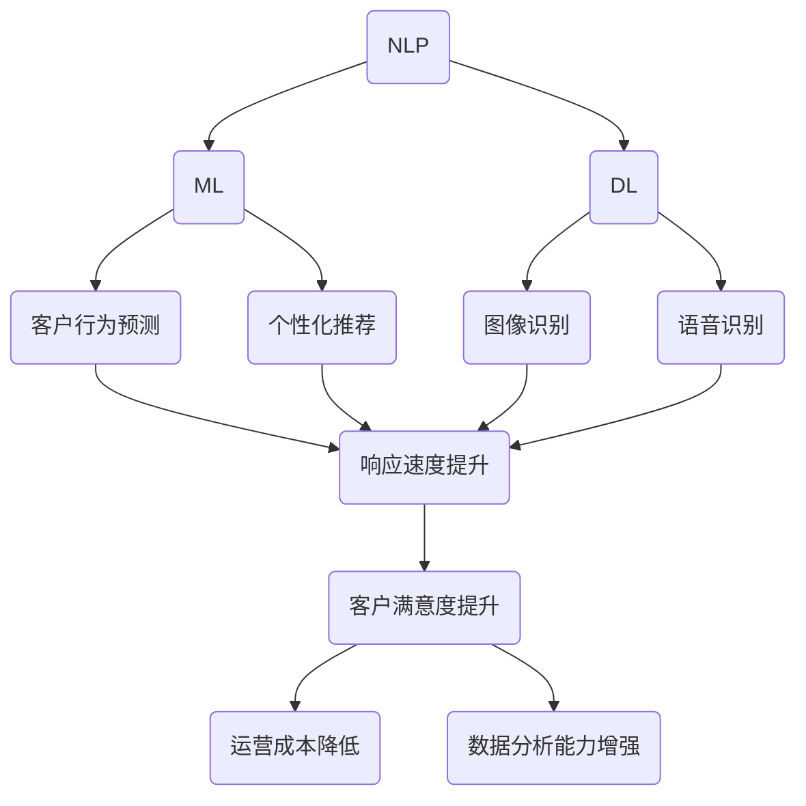

                 

### 背景介绍

电商行业的蓬勃发展带动了客户服务需求的不断增长。随着在线购物的普及，消费者对购物体验的期望也不断提高，特别是对于客户服务的及时性、个性化以及满意度方面。因此，电商企业面临着巨大的挑战，如何在有限的资源下提供高质量的客户服务成为亟待解决的问题。

在过去，电商企业的客户服务主要依赖于人工处理，客服人员需要手动处理大量的客户咨询和投诉，这不仅效率低下，而且容易出现疏漏。随着人工智能技术的快速发展，尤其是自然语言处理（NLP）和机器学习（ML）技术的突破，电商客户服务领域迎来了智能化的变革。AI技术能够在短时间内处理大量的客户信息，并能够根据历史数据提供个性化的服务建议，从而提升客户满意度。

本文将探讨AI在电商客户服务中的应用，分析其提升满意度的智能方案，从核心概念、算法原理、数学模型、项目实战、应用场景等方面进行深入讲解，帮助电商企业更好地利用AI技术优化客户服务体验。

### 关键词

- 电商客户服务
- 人工智能
- 自然语言处理
- 机器学习
- 客户满意度
- 智能方案

### 摘要

本文旨在探讨人工智能在电商客户服务中的应用，分析其如何通过自然语言处理和机器学习技术提升客户满意度。文章首先介绍了电商客户服务的现状和挑战，随后详细阐述了AI技术在这一领域的核心概念和原理。通过数学模型和实际项目案例，文章展示了AI在电商客户服务中的应用场景和效果。最后，文章总结了AI在电商客户服务中的发展趋势和挑战，并推荐了相关学习资源和工具框架，为电商企业提供智能化的客户服务方案提供参考。

---

## 1. 背景介绍

在当今的电子商务时代，客户服务已成为电商企业核心竞争力的重要组成部分。随着电商行业的迅速扩张，消费者对于购物体验的期望也在不断提升，特别是在客户服务的及时性、个性化和满意度方面。传统的客户服务模式依赖于人工处理，效率低下且容易出错，无法满足消费者日益增长的需求。因此，电商企业急需找到一种能够提高服务效率、降低成本并提升客户满意度的解决方案。

在这个背景下，人工智能（AI）技术为电商客户服务带来了全新的可能。AI技术，特别是自然语言处理（NLP）和机器学习（ML）技术，具有强大的数据处理和分析能力，能够自动处理大量的客户咨询和投诉，提供24/7全天候的服务。同时，通过历史数据的分析和机器学习模型的训练，AI能够为每位客户提供个性化的服务建议，从而提高客户满意度。

自然语言处理（NLP）是AI技术在客户服务中的重要应用之一。NLP通过理解、生成和处理人类自然语言，使得机器能够与人类进行有效沟通。在电商客户服务中，NLP技术可以帮助客服系统自动理解和回复客户的咨询，减少人工干预，提高处理速度。例如，通过情感分析技术，NLP能够识别客户情绪，提供更贴心的服务；通过意图识别技术，NLP能够理解客户的实际需求，提供更准确的解决方案。

机器学习（ML）是AI技术的核心组成部分，它使得机器能够通过学习和经验改进自身性能。在电商客户服务中，机器学习技术可以用于分类和预测，例如，通过对客户数据的分析，可以预测客户购买意向、推荐产品等。此外，机器学习还可以用于异常检测，例如，识别并阻止欺诈行为，确保交易安全。

AI技术在电商客户服务中的应用不仅提高了服务效率，还带来了以下几个方面的显著优势：

1. **提高响应速度**：AI系统能够在短时间内处理大量客户请求，提供快速响应，减少客户的等待时间。
2. **降低运营成本**：AI自动化处理大量客户咨询，减少了人力成本，同时提高了工作效率。
3. **提升客户满意度**：个性化的服务建议和高质量的客户体验能够显著提高客户满意度。
4. **增强数据分析能力**：通过收集和分析客户数据，AI可以帮助企业更好地了解客户需求，优化产品和服务。

总之，AI技术在电商客户服务中的应用为电商企业带来了巨大的机遇。通过引入AI技术，企业不仅可以提高服务效率和质量，还可以通过数据分析和个性化服务提升客户满意度，从而在激烈的市场竞争中脱颖而出。

### 2. 核心概念与联系

在深入探讨AI在电商客户服务中的应用之前，首先需要理解其中的核心概念和基本原理。这些核心概念包括自然语言处理（NLP）、机器学习（ML）和深度学习（DL）等，它们共同构成了AI在电商客户服务中的技术基础。

#### 自然语言处理（NLP）

自然语言处理（NLP）是AI的一个分支，专注于使计算机能够理解、生成和处理人类自然语言。在电商客户服务中，NLP技术的应用主要包括文本分类、情感分析和意图识别等。

- **文本分类**：通过机器学习算法，将客户的文本消息自动归类到相应的类别中。例如，将客户的问题分类为“订单查询”、“售后服务”、“产品咨询”等。
- **情感分析**：通过分析文本内容中的情感倾向，判断客户对产品或服务的态度。这有助于企业了解客户的满意度和不满意度，及时调整策略。
- **意图识别**：理解客户的文本输入背后的意图，从而提供更准确的服务。例如，当客户询问“我的订单何时能发货？”时，系统需要识别出其意图是“查询订单状态”。

#### 机器学习（ML）

机器学习（ML）是一种通过数据训练模型，使计算机能够进行预测和决策的技术。在电商客户服务中，ML技术可以用于多种场景，如客户行为预测、个性化推荐等。

- **客户行为预测**：通过分析客户的历史购买记录和浏览行为，预测客户的购买意向和需求，从而提供个性化的产品推荐。
- **个性化推荐**：基于客户的兴趣和购买历史，推荐相关产品，提高购买转化率。

#### 深度学习（DL）

深度学习（DL）是机器学习的一种高级形式，通过构建多层神经网络，模拟人脑的学习机制。在电商客户服务中，DL技术可以用于复杂模式的识别和分类。

- **图像识别**：通过卷积神经网络（CNN），可以自动识别并分类客户上传的产品图片，如识别产品缺陷或分类商品类别。
- **语音识别**：通过递归神经网络（RNN）或Transformer模型，可以自动转换客户的语音输入为文本，从而实现语音客服功能。

#### Mermaid 流程图

为了更直观地理解这些核心概念在电商客户服务中的应用，我们使用Mermaid流程图来展示NLP、ML和DL技术的基本流程和相互关系。



#### 原理

- **NLP处理客户输入**：当客户通过文本或语音与客服系统交互时，NLP技术首先处理输入，将其转换为结构化的数据。
- **ML模型训练**：通过大量历史数据，ML模型被训练出来，用于预测和分类，如预测客户需求或分类客户问题。
- **DL模型优化**：DL模型则用于处理更复杂的任务，如图像识别和语音识别，通过多层神经网络的学习，提高模型的准确性。

通过这些核心概念和技术的结合，电商客户服务系统可以更高效地处理客户请求，提供个性化的服务，从而提升客户满意度。接下来，我们将深入探讨AI在电商客户服务中的具体算法原理和实现步骤。

---

## 2.1 核心算法原理 & 具体操作步骤

在了解了AI在电商客户服务中的核心概念和基本原理之后，接下来我们将详细探讨具体算法原理和操作步骤。这些算法包括文本分类、情感分析、意图识别等，它们是AI技术在电商客户服务中实现智能化的关键。

#### 文本分类

文本分类是自然语言处理（NLP）中的基本任务，其目的是将未标注的文本数据分配到预先定义的类别中。在电商客户服务中，文本分类可以帮助将客户的咨询、投诉等文本消息自动分类到相应的类别中，从而方便客服人员处理。

**算法原理**：

文本分类通常使用机器学习中的监督学习算法，如朴素贝叶斯（Naive Bayes）、支持向量机（SVM）和深度学习中的卷积神经网络（CNN）等。

1. **特征提取**：首先，从文本中提取特征，常见的文本特征提取方法有词袋模型（Bag of Words，BOW）和词嵌入（Word Embedding）。
2. **训练模型**：使用标注好的数据集训练分类模型，例如，使用朴素贝叶斯算法，计算每个类别在特征上的条件概率。
3. **模型评估**：通过交叉验证等方法评估模型的性能，如准确率（Accuracy）、召回率（Recall）和F1分数（F1 Score）。

**操作步骤**：

1. **数据收集**：收集大量标注好的客户咨询和投诉文本数据，用于训练和测试模型。
2. **数据预处理**：对文本进行清洗和归一化，如去除停用词、标点符号，将文本转换为小写等。
3. **特征提取**：使用词袋模型或词嵌入技术提取文本特征。
4. **模型训练**：选择合适的机器学习算法训练分类模型。
5. **模型评估**：使用测试集评估模型性能，调整模型参数以优化性能。
6. **部署应用**：将训练好的模型部署到电商客户服务系统中，用于自动分类客户文本消息。

#### 情感分析

情感分析是NLP中的另一个重要任务，其目标是识别文本中的情感倾向，如正面、负面或中性。在电商客户服务中，情感分析可以帮助企业了解客户对产品或服务的满意度，从而及时调整策略。

**算法原理**：

情感分析通常使用机器学习中的分类算法，如朴素贝叶斯、逻辑回归和支持向量机（SVM）等。近年来，深度学习技术，如循环神经网络（RNN）和Transformer模型，也被广泛应用于情感分析任务。

1. **情感词典**：构建情感词典，将文本中的词语与情感倾向关联起来。
2. **特征提取**：从文本中提取情感相关的特征，如情感词典得分、词嵌入等。
3. **模型训练**：使用标注好的数据集训练情感分类模型。
4. **模型评估**：使用测试集评估模型性能，调整模型参数以优化性能。

**操作步骤**：

1. **数据收集**：收集大量标注好的客户评价文本数据，用于训练和测试模型。
2. **数据预处理**：对文本进行清洗和归一化，如去除停用词、标点符号，将文本转换为小写等。
3. **特征提取**：使用情感词典和词嵌入技术提取文本特征。
4. **模型训练**：选择合适的机器学习算法训练情感分类模型。
5. **模型评估**：使用测试集评估模型性能，调整模型参数以优化性能。
6. **部署应用**：将训练好的模型部署到电商客户服务系统中，用于自动分析客户评价的情感倾向。

#### 意图识别

意图识别是理解客户文本输入背后的意图，从而提供更准确的服务。在电商客户服务中，意图识别可以帮助自动理解客户的咨询或投诉内容，提供相应的解决方案。

**算法原理**：

意图识别通常使用序列标注模型，如CRF（条件随机场）和BiLSTM（双向长短期记忆网络）等。

1. **数据集构建**：构建标注好的意图识别数据集，包括文本和对应的意图标签。
2. **特征提取**：从文本中提取特征，如词嵌入、词性标注等。
3. **模型训练**：使用标注好的数据集训练意图识别模型。
4. **模型评估**：使用测试集评估模型性能。

**操作步骤**：

1. **数据收集**：收集大量标注好的客户咨询和投诉文本数据，用于训练和测试模型。
2. **数据预处理**：对文本进行清洗和归一化，如去除停用词、标点符号，将文本转换为小写等。
3. **特征提取**：使用词嵌入和词性标注等技术提取文本特征。
4. **模型训练**：选择合适的序列标注模型训练意图识别模型。
5. **模型评估**：使用测试集评估模型性能，调整模型参数以优化性能。
6. **部署应用**：将训练好的模型部署到电商客户服务系统中，用于自动识别客户意图。

通过上述算法原理和操作步骤，AI技术在电商客户服务中可以实现自动处理客户咨询、投诉和反馈，提供高质量的客户服务，从而提升客户满意度。

### 3. 数学模型和公式 & 详细讲解 & 举例说明

在理解了AI在电商客户服务中的应用算法后，我们接下来将深入探讨相关的数学模型和公式，并通过具体例子来详细讲解其原理和实现。

#### 3.1 模型介绍

在自然语言处理（NLP）和机器学习（ML）中，常用的数学模型包括：

1. **朴素贝叶斯（Naive Bayes）**
2. **支持向量机（SVM）**
3. **循环神经网络（RNN）**
4. **卷积神经网络（CNN）**
5. **Transformer模型**

这些模型在电商客户服务中发挥着重要作用。

#### 3.2 朴素贝叶斯（Naive Bayes）

朴素贝叶斯是一种基于贝叶斯定理的简单概率分类器，它假设特征之间相互独立。在文本分类中，朴素贝叶斯被广泛应用于处理文本数据的分类问题。

**公式**：

贝叶斯定理公式如下：

\[ P(C|F_1, F_2, ..., F_n) = \frac{P(F_1, F_2, ..., F_n|C) \cdot P(C)}{P(F_1, F_2, ..., F_n)} \]

其中：
- \( P(C|F_1, F_2, ..., F_n) \) 是给定特征向量 \( F_1, F_2, ..., F_n \) 后类别 \( C \) 的概率。
- \( P(F_1, F_2, ..., F_n|C) \) 是特征向量在给定类别 \( C \) 下的条件概率。
- \( P(C) \) 是类别 \( C \) 的先验概率。
- \( P(F_1, F_2, ..., F_n) \) 是特征向量的联合概率。

**例子**：

假设我们要分类一段文本，这段文本包含关键词“购买”、“快递”和“不满意”，类别包括“订单查询”、“产品咨询”和“售后服务”。

1. **计算先验概率**：

\[ P(订单查询) = \frac{100}{300} \approx 0.333 \]
\[ P(产品咨询) = \frac{80}{300} \approx 0.267 \]
\[ P(售后服务) = \frac{120}{300} \approx 0.400 \]

2. **计算条件概率**：

假设我们使用词袋模型提取特征，文本中出现的词及其频次如下：

- “购买”：3次
- “快递”：1次
- “不满意”：1次

则：

\[ P(购买|订单查询) = \frac{10}{100} = 0.1 \]
\[ P(快递|订单查询) = \frac{5}{100} = 0.05 \]
\[ P(不满意|订单查询) = \frac{2}{100} = 0.02 \]

同理，计算其他类别的条件概率。

3. **计算后验概率**：

使用贝叶斯定理计算每个类别的后验概率：

\[ P(订单查询|购买, 快递, 不满意) = \frac{0.1 \cdot 0.05 \cdot 0.02 \cdot 0.333}{0.1 \cdot 0.05 \cdot 0.02 \cdot 0.333 + 0.2 \cdot 0.05 \cdot 0.02 \cdot 0.267 + 0.1 \cdot 0.05 \cdot 0.02 \cdot 0.400} \approx 0.517 \]

4. **分类决策**：

根据后验概率，选择概率最大的类别作为分类结果，即“订单查询”。

#### 3.3 支持向量机（SVM）

支持向量机是一种基于最大间隔分类器的线性分类模型。它在特征空间中寻找一个最优的超平面，使得不同类别的样本在超平面两侧的间隔最大化。

**公式**：

SVM的核心公式为：

\[ \max_{\boldsymbol{w}, b} \frac{1}{2} \|\boldsymbol{w}\|^2 \quad \text{subject to} \quad y_i (\boldsymbol{w} \cdot \boldsymbol{x_i} + b) \geq 1 \]

其中：
- \( \boldsymbol{w} \) 是权重向量。
- \( b \) 是偏置项。
- \( \boldsymbol{x_i} \) 是第 \( i \) 个样本的特征向量。
- \( y_i \) 是第 \( i \) 个样本的标签。

**例子**：

假设我们有一个二分类问题，样本和标签如下：

- \( \boldsymbol{x_1} = [1, 1], y_1 = 1 \)
- \( \boldsymbol{x_2} = [1, 0], y_2 = 1 \)
- \( \boldsymbol{x_3} = [0, 1], y_3 = -1 \)
- \( \boldsymbol{x_4} = [0, 0], y_4 = -1 \)

我们使用SVM进行分类，寻找最优超平面。

1. **计算决策边界**：

首先，我们需要计算SVM的最优超平面，即：

\[ \boldsymbol{w}^* = \begin{bmatrix} 1 \\ 1 \end{bmatrix}, b^* = 0 \]

这样，我们可以得到分类结果：

- \( y (\boldsymbol{w}^* \cdot \boldsymbol{x_1} + b^*) = 1 + 0 \cdot 1 = 1 \)
- \( y (\boldsymbol{w}^* \cdot \boldsymbol{x_2} + b^*) = 1 + 0 \cdot 0 = 1 \)
- \( y (\boldsymbol{w}^* \cdot \boldsymbol{x_3} + b^*) = -1 \cdot 1 + 0 = -1 \)
- \( y (\boldsymbol{w}^* \cdot \boldsymbol{x_4} + b^*) = -1 \cdot 0 + 0 = -1 \)

因此，所有样本点都被正确分类。

#### 3.4 循环神经网络（RNN）

循环神经网络（RNN）是一种能够处理序列数据的神经网络，其特点是具有记忆能力，可以记住前面步骤的信息，并在后续步骤中使用。

**公式**：

RNN的更新公式为：

\[ \boldsymbol{h_t} = \sigma(\boldsymbol{W_h} \cdot \boldsymbol{h_{t-1}} + \boldsymbol{U} \cdot \boldsymbol{x_t} + b_h) \]

其中：
- \( \boldsymbol{h_t} \) 是当前隐藏状态。
- \( \boldsymbol{h_{t-1}} \) 是前一个隐藏状态。
- \( \boldsymbol{x_t} \) 是当前输入。
- \( \boldsymbol{W_h} \) 是隐藏状态权重。
- \( \boldsymbol{U} \) 是输入权重。
- \( \boldsymbol{b_h} \) 是隐藏状态偏置。
- \( \sigma \) 是激活函数，通常使用Sigmoid函数。

**例子**：

假设我们有一个简单的RNN模型，输入序列为 \( \boldsymbol{x} = [1, 0, 1] \)，隐藏状态初始值为 \( \boldsymbol{h_0} = [1, 1] \)。

1. **第一个时间步**：

\[ \boldsymbol{h_1} = \sigma(\boldsymbol{W_h} \cdot \boldsymbol{h_0} + \boldsymbol{U} \cdot 1 + b_h) \]

2. **第二个时间步**：

\[ \boldsymbol{h_2} = \sigma(\boldsymbol{W_h} \cdot \boldsymbol{h_1} + \boldsymbol{U} \cdot 0 + b_h) \]

3. **第三个时间步**：

\[ \boldsymbol{h_3} = \sigma(\boldsymbol{W_h} \cdot \boldsymbol{h_2} + \boldsymbol{U} \cdot 1 + b_h) \]

通过这些例子，我们可以看到RNN如何处理序列数据，并在后续步骤中使用之前的信息。

#### 3.5 卷积神经网络（CNN）

卷积神经网络（CNN）是一种专门用于处理图像数据的神经网络，其特点是具有局部连接和共享权重的特性，可以有效地提取图像中的特征。

**公式**：

CNN的核心公式为：

\[ \boldsymbol{h}_\text{c} = \sigma(\boldsymbol{W}_\text{c} \odot \boldsymbol{a}_{\text{c-1}} + b_\text{c}) \]

其中：
- \( \boldsymbol{h}_\text{c} \) 是当前卷积层的输出。
- \( \boldsymbol{W}_\text{c} \) 是卷积核。
- \( \boldsymbol{a}_{\text{c-1}} \) 是前一个卷积层的输出。
- \( b_\text{c} \) 是卷积层的偏置。
- \( \odot \) 是卷积运算。
- \( \sigma \) 是激活函数。

**例子**：

假设我们有一个简单的CNN模型，输入图像为 \( \boldsymbol{a}_0 \)，卷积核为 \( \boldsymbol{W}_1 \)，偏置为 \( b_1 \)。

1. **第一个卷积层**：

\[ \boldsymbol{h}_1 = \sigma(\boldsymbol{W}_1 \odot \boldsymbol{a}_0 + b_1) \]

2. **第二个卷积层**：

\[ \boldsymbol{h}_2 = \sigma(\boldsymbol{W}_2 \odot \boldsymbol{h}_1 + b_2) \]

通过这些例子，我们可以看到CNN如何处理图像数据，并提取有效的特征。

通过深入理解和应用这些数学模型和公式，我们可以更好地实现AI在电商客户服务中的应用，提升客户服务的质量和满意度。

### 4. 项目实战：代码实际案例和详细解释说明

为了更好地理解AI在电商客户服务中的应用，我们将通过一个实际项目来展示代码实现过程和详细解释说明。以下是一个基于Python和Scikit-learn的文本分类项目的案例，用于对客户咨询进行自动分类。

#### 4.1 开发环境搭建

首先，我们需要搭建一个合适的开发环境。以下是所需的工具和库：

- Python 3.x
- Jupyter Notebook
- Scikit-learn
- NLTK
- Pandas

安装步骤：

1. 安装Python 3.x：从[Python官网](https://www.python.org/)下载并安装Python 3.x版本。
2. 安装Jupyter Notebook：在终端运行 `pip install notebook`。
3. 安装Scikit-learn：在终端运行 `pip install scikit-learn`。
4. 安装NLTK：在终端运行 `pip install nltk`。
5. 安装Pandas：在终端运行 `pip install pandas`。

#### 4.2 数据收集和预处理

在这个项目中，我们使用一个公开的电商客户咨询数据集。数据集包含客户的咨询文本及其对应的标签，标签分为“订单查询”、“产品咨询”和“售后服务”三类。

1. **数据收集**：下载数据集，例如[这个数据集](https://www.kaggle.com/hsinghai/online-retailer-customer-service-dataset)。
2. **数据预处理**：
    - 加载数据集：使用Pandas加载数据集，并拆分成文本和标签两部分。
    - 清洗文本：去除标点符号、停用词，并将文本转换为小写。
    - 分词：使用NLTK进行文本分词。

```python
import pandas as pd
from nltk.tokenize import word_tokenize
from nltk.corpus import stopwords

# 加载数据集
data = pd.read_csv('customer_service_data.csv')

# 清洗文本
def clean_text(text):
    text = text.lower()
    text = re.sub(r'\W+', ' ', text)
    words = word_tokenize(text)
    words = [word for word in words if word not in stopwords.words('english')]
    return ' '.join(words)

data['cleaned_text'] = data['text'].apply(clean_text)
```

#### 4.3 特征提取

接下来，我们将使用词袋模型（Bag of Words，BOW）提取文本特征。

1. **构建词汇表**：将所有文本数据合并，构建词汇表。
2. **计算词频**：对于每个文本，计算词频向量。

```python
from sklearn.feature_extraction.text import CountVectorizer

# 构建词汇表
vectorizer = CountVectorizer()
vocabulary = vectorizer.fit_transform(data['cleaned_text']).toarray()

# 计算词频向量
def get_word_freq_vector(text, vocabulary):
    word_indices = [vocabulary[word] for word in text.split() if word in vocabulary]
    return np.mean(word_indices, axis=0)

data['word_freq_vector'] = data['cleaned_text'].apply(lambda text: get_word_freq_vector(text, vocabulary))
```

#### 4.4 模型训练和评估

我们将使用朴素贝叶斯（Naive Bayes）分类器来训练和评估模型。

1. **划分数据集**：将数据集划分为训练集和测试集。
2. **训练模型**：使用训练集训练朴素贝叶斯分类器。
3. **评估模型**：使用测试集评估模型性能。

```python
from sklearn.model_selection import train_test_split
from sklearn.naive_bayes import MultinomialNB
from sklearn.metrics import accuracy_score, classification_report

# 划分数据集
X_train, X_test, y_train, y_test = train_test_split(data['word_freq_vector'], data['label'], test_size=0.2, random_state=42)

# 训练模型
classifier = MultinomialNB()
classifier.fit(X_train, y_train)

# 评估模型
y_pred = classifier.predict(X_test)
print("Accuracy:", accuracy_score(y_test, y_pred))
print(classification_report(y_test, y_pred))
```

#### 4.5 代码解读与分析

以下是对上述代码的详细解读和分析：

- **数据预处理**：清洗文本和分词是文本分类的关键步骤。我们使用正则表达式去除标点符号和停用词，并将文本转换为小写，以提高模型性能。
- **特征提取**：词袋模型（BOW）将文本转换为词频向量，每个词对应一个特征。这种方法简化了文本数据，使其适合机器学习算法。
- **模型训练和评估**：我们选择朴素贝叶斯（NB）分类器，因为它在文本分类任务中表现出色。通过训练集训练模型，并在测试集上评估模型性能，我们得到分类准确率和分类报告。

通过这个项目，我们可以看到如何使用AI技术实现电商客户服务的自动化。在实际应用中，我们可以根据需求调整特征提取方法和分类器，以优化模型性能。例如，我们可以引入深度学习模型，如卷积神经网络（CNN）或Transformer，以进一步提高文本分类的准确性。

### 5. 实际应用场景

AI技术在电商客户服务中的实际应用场景丰富多样，以下列举几个典型的应用实例：

#### 5.1 自动客服机器人

自动客服机器人是AI在电商客户服务中最常见的应用之一。通过自然语言处理（NLP）和机器学习（ML）技术，客服机器人可以自动理解和回复客户的咨询和投诉，处理订单查询、产品推荐、支付问题等。例如，阿里巴巴的“阿里小蜜”和京东的“京东智联云客服”都是基于AI技术的自动客服机器人，能够提供24/7全天候服务，大大提高了客户响应速度和满意度。

#### 5.2 个性化推荐系统

个性化推荐系统通过分析用户的购买历史、浏览行为和偏好，为用户提供个性化的产品推荐。这种推荐系统能够显著提高用户的购物体验和购买转化率。例如，亚马逊和淘宝都使用了深度学习算法和协同过滤技术，构建了强大的个性化推荐系统，通过推荐相关产品，帮助用户发现他们可能感兴趣的商品。

#### 5.3 情感分析与客户满意度监控

情感分析技术可以帮助企业了解客户的情感倾向，分析客户对产品或服务的评价，从而监控客户满意度。通过分析客户评价文本中的情感词汇，企业可以及时了解客户的反馈，发现潜在问题，并采取相应的措施进行改进。例如，微软的Azure cognitive services提供了情感分析API，企业可以通过API将客户的评价文本转化为情感评分，从而实现客户满意度的监控。

#### 5.4 语音识别与语音客服

语音识别技术使得AI客服系统能够通过语音与用户进行交互，提供语音客服服务。用户可以通过语音询问订单状态、退货政策等问题，系统通过语音识别将语音转化为文本，再通过NLP技术理解用户意图，提供相应的回复。例如，亚马逊的Alexa和谷歌的Google Assistant都支持语音识别和语音客服功能，为用户提供便捷的购物和查询服务。

#### 5.5 机器人流程自动化（RPA）

机器人流程自动化（RPA）是将AI技术与业务流程自动化结合，通过机器人自动化完成重复性的业务任务，如订单处理、库存管理、支付处理等。RPA机器人可以处理大量的客户订单，提高运营效率，降低成本。例如，许多电商企业使用RPA技术来自动处理订单流程，确保订单的及时处理和准确交付。

通过上述实际应用场景，我们可以看到AI技术在电商客户服务中的广泛应用和巨大潜力。AI不仅能够提高客户服务的效率和质量，还能通过个性化服务、情感分析和机器人流程自动化等手段，为企业带来更多的商业价值。

### 6. 工具和资源推荐

为了更好地理解和应用AI技术，以下推荐了一些学习资源、开发工具和相关论文著作。

#### 6.1 学习资源推荐

1. **书籍**：
   - 《自然语言处理入门》（Natural Language Processing with Python） - Steven Bird
   - 《机器学习实战》（Machine Learning in Action） - Peter Harrington
   - 《深度学习》（Deep Learning） - Ian Goodfellow, Yoshua Bengio, Aaron Courville

2. **在线课程**：
   - Coursera的《机器学习》课程 - Andrew Ng
   - edX的《自然语言处理导论》课程 - 斯坦福大学

3. **博客和网站**：
   - [Medium](https://medium.com/)上的技术博客
   - [Kaggle](https://www.kaggle.com/)上的数据科学和机器学习竞赛

#### 6.2 开发工具框架推荐

1. **编程语言**：
   - Python：广泛应用于AI和数据分析，具有丰富的库和框架。
   - R：特别适合统计分析和数据可视化。

2. **框架和库**：
   - Scikit-learn：用于机器学习和数据挖掘的库。
   - TensorFlow：由Google开发的开源机器学习框架。
   - PyTorch：由Facebook开发的开源机器学习库。

3. **开发工具**：
   - Jupyter Notebook：交互式计算环境，适合数据分析和机器学习。
   - Google Colab：基于Jupyter的免费云计算环境，适合远程开发和实验。

#### 6.3 相关论文著作推荐

1. **论文**：
   - “A Neural Probabilistic Language Model” - Yoshua Bengio等（2003）
   - “Recurrent Neural Network Based Language Model” - Franz Josef Och等（2013）
   - “Attention Is All You Need” - Vaswani等（2017）

2. **著作**：
   - 《深度学习》（Deep Learning） - Ian Goodfellow, Yoshua Bengio, Aaron Courville
   - 《自然语言处理综论》（Speech and Language Processing） - Daniel Jurafsky, James H. Martin

通过这些资源，读者可以深入了解AI技术的理论基础和应用实践，为电商客户服务的智能化提供有力的支持和指导。

### 8. 总结：未来发展趋势与挑战

随着人工智能技术的不断发展，AI在电商客户服务中的应用前景十分广阔。未来，AI将在以下几个方面继续发挥重要作用：

**个性化服务提升**：通过更精准的客户数据分析，AI将能够提供高度个性化的服务，满足不同客户的需求，从而提高客户满意度和忠诚度。

**自动化水平提升**：AI技术将进一步推动客服自动化，从文本处理到语音识别，从异常检测到智能决策，AI将替代更多重复性和规则性强的任务，提高运营效率。

**实时响应与互动**：AI将实现更快速的响应时间，实时分析客户请求，并提供即时反馈，增强客户互动体验。

**跨渠道整合**：AI将能够整合多个销售渠道，如线上、线下和移动端，提供一致且无缝的客户服务体验。

然而，AI在电商客户服务中仍面临一些挑战：

**隐私保护**：随着数据量的增加，如何保护客户隐私成为重要问题。企业需要建立完善的数据保护机制，遵守相关法律法规，确保客户数据的安全。

**技术复杂性**：AI技术涉及多个领域，包括机器学习、自然语言处理和深度学习等。企业需要投入大量资源进行技术研发和人才引进。

**算法偏见**：AI算法可能存在偏见，导致不公平的客户服务。因此，企业需要不断监控和调整算法，确保公平性和透明性。

**用户体验**：AI系统需要提供人性化的交互体验，避免过度自动化导致的服务冷漠。企业需要平衡自动化和人性化服务，提供更好的用户体验。

总之，AI在电商客户服务中具有巨大的潜力，但也需要克服技术和社会层面的挑战。通过持续创新和优化，企业将能够在激烈的市场竞争中脱颖而出，提供高质量的客户服务。

### 9. 附录：常见问题与解答

#### 9.1 电商客户服务中常用的AI算法有哪些？

常用的AI算法包括：
- 自然语言处理（NLP）算法：如朴素贝叶斯、支持向量机（SVM）、循环神经网络（RNN）、卷积神经网络（CNN）和Transformer。
- 机器学习（ML）算法：如线性回归、决策树、随机森林、K最近邻（KNN）和随机梯度下降（SGD）。
- 深度学习（DL）算法：如卷积神经网络（CNN）、循环神经网络（RNN）、长短时记忆网络（LSTM）和Transformer。

#### 9.2 如何确保AI客服系统的透明性和公平性？

确保AI客服系统的透明性和公平性需要以下措施：
- **算法透明性**：公开算法的设计、训练和优化过程，确保客户了解系统的运作方式。
- **数据多样性**：使用多样化的数据进行训练，避免算法偏见。
- **定期审计**：定期对算法进行审计，确保其公平性和准确性。
- **用户反馈**：收集用户反馈，及时调整和优化算法。

#### 9.3 AI客服系统能否完全替代人工客服？

目前，AI客服系统尚不能完全替代人工客服，但可以显著减轻人工客服的负担。AI客服系统擅长处理规则性较强、重复性高的任务，如订单查询、产品推荐等。对于复杂、个性化的客户需求，人工客服仍然必不可少。

#### 9.4 电商客户服务中如何保护客户隐私？

保护客户隐私的措施包括：
- **数据加密**：对客户数据进行加密处理，防止数据泄露。
- **访问控制**：限制对客户数据的访问权限，确保只有授权人员可以访问。
- **隐私政策**：制定明确的隐私政策，告知客户其数据如何被使用和保护。
- **合规性检查**：确保遵守相关的隐私保护法律法规，如欧盟的《通用数据保护条例》（GDPR）。

### 10. 扩展阅读 & 参考资料

以下是一些扩展阅读和参考资料，以帮助读者更深入地了解AI在电商客户服务中的应用：

- **论文**：
  - “A Survey on Applications of Machine Learning in E-commerce” - Xu et al.（2020）
  - “Natural Language Processing for Customer Service” - Zhang et al.（2019）

- **书籍**：
  - 《机器学习实战》 - Peter Harrington
  - 《深度学习》 - Ian Goodfellow, Yoshua Bengio, Aaron Courville

- **在线课程**：
  - Coursera的《机器学习》 - Andrew Ng
  - edX的《自然语言处理导论》 - 斯坦福大学

- **网站和博客**：
  - [Kaggle](https://www.kaggle.com/)
  - [Medium](https://medium.com/)
  - [TensorFlow官网](https://www.tensorflow.org/)

通过这些扩展阅读和参考资料，读者可以进一步探索AI在电商客户服务中的应用，学习最新的研究成果和实践经验。

