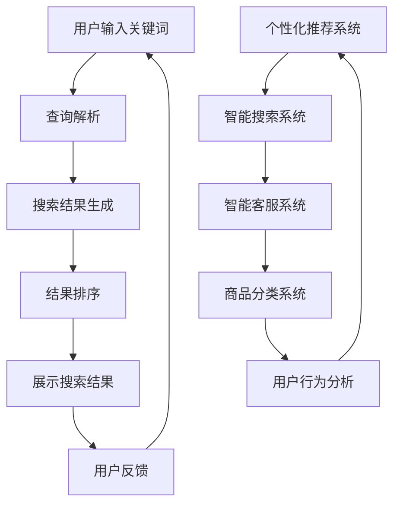

                 

# AI在电商搜索导购中的应用场景分析

## 摘要

本文将深入探讨人工智能（AI）在电商搜索导购领域的应用。首先，通过背景介绍了解电商行业的发展现状和AI技术的崛起。接着，文章将阐述电商搜索导购中AI的核心概念与联系，并运用Mermaid流程图展示其架构。然后，详细解析AI算法原理与操作步骤，并借助数学模型和公式进行讲解。通过项目实战，文章将展示代码实现过程，并进行分析与解读。最后，文章将探讨AI在电商搜索导购中的实际应用场景，推荐相关工具和资源，并对未来发展趋势与挑战进行总结。通过本文，读者将全面了解AI在电商搜索导购中的潜力和应用前景。

## 1. 背景介绍

电商行业在过去几十年里经历了飞速发展，从传统的线下零售到线上购物平台，再到如今的各种新兴电商模式，如社交电商、直播电商等，电商已经深入到了人们生活的方方面面。根据《中国电商行业发展报告》，2022年中国电商市场规模已突破40万亿元，电商用户数超过8亿。随着市场的不断扩大，电商企业面临的竞争压力也越来越大。如何提高用户购买体验，提升销售额，成为电商企业关注的焦点。

在这个背景下，人工智能（AI）技术的崛起为电商行业带来了新的机遇。AI技术可以基于大数据和深度学习，对用户行为进行分析和预测，从而实现个性化推荐、精准营销和智能客服等功能。根据市场研究公司Statista的数据，到2025年，全球电商市场中的AI应用将达到580亿美元。AI技术正逐渐成为电商企业提升竞争力的关键因素。

### 1.1 AI技术简介

人工智能是一种模拟人类智能的计算机技术，包括机器学习、深度学习、自然语言处理、计算机视觉等多个子领域。AI可以通过学习大量数据，从中提取规律和模式，进而实现自动化决策和智能交互。以下是对AI技术的一些关键子领域和应用的简要介绍：

- **机器学习（Machine Learning）**：通过训练模型，从数据中自动发现规律和模式。常见的机器学习算法包括线性回归、决策树、支持向量机等。

- **深度学习（Deep Learning）**：一种特殊的机器学习技术，通过多层神经网络进行模型训练，具有强大的特征提取和分类能力。深度学习在图像识别、语音识别等领域取得了显著成果。

- **自然语言处理（Natural Language Processing，NLP）**：使计算机能够理解、生成和处理人类语言。NLP技术广泛应用于搜索引擎、智能客服和机器翻译等场景。

- **计算机视觉（Computer Vision）**：使计算机能够从图像或视频中提取信息和理解场景。计算机视觉在图像分类、目标检测和图像识别等领域具有广泛应用。

### 1.2 电商搜索导购现状

在电商行业中，搜索导购是用户发现商品的重要途径。传统的搜索导购主要依赖于关键词匹配和简单排序算法，难以满足用户个性化的购物需求。而AI技术的引入，使得电商搜索导购变得更加智能和精准。

目前，电商搜索导购主要面临以下挑战：

- **搜索结果质量**：如何提高搜索结果的准确性和相关性，是电商企业需要解决的重要问题。

- **用户个性化**：用户需求千差万别，如何为每位用户提供个性化的搜索结果和推荐，是电商企业需要解决的问题。

- **效率与成本**：如何在高并发和海量数据下，快速响应用户请求，同时控制成本，是电商企业面临的挑战。

### 1.3 AI在电商搜索导购中的应用

AI技术在电商搜索导购中可以发挥以下作用：

- **个性化推荐**：通过分析用户历史行为和兴趣，为用户推荐符合其喜好的商品。

- **智能搜索**：利用自然语言处理技术，理解用户搜索意图，提供更准确的搜索结果。

- **智能客服**：通过语音识别和自然语言处理技术，实现与用户的智能对话，提高客服效率。

- **商品分类**：利用计算机视觉技术，对商品图像进行自动分类，提高搜索和推荐的效率。

## 2. 核心概念与联系

### 2.1 电商搜索导购的基本流程

电商搜索导购的基本流程可以概括为以下几个步骤：

1. **用户输入查询关键词**：用户在搜索框中输入关键词，发起搜索请求。

2. **查询解析**：系统对用户输入的关键词进行解析，理解用户的搜索意图。

3. **搜索结果生成**：系统根据用户的搜索意图，从数据库中检索相关商品信息，生成搜索结果。

4. **结果排序**：根据商品的相似度、销量、用户评价等因素，对搜索结果进行排序。

5. **展示搜索结果**：将排序后的搜索结果展示给用户。

### 2.2 AI技术在电商搜索导购中的应用

在电商搜索导购中，AI技术可以应用于以下几个关键环节：

- **个性化推荐**：通过分析用户的历史行为、兴趣和购买记录，为用户推荐可能感兴趣的商品。

- **智能搜索**：利用自然语言处理技术，理解用户的搜索意图，提供更准确的搜索结果。

- **智能客服**：通过语音识别和自然语言处理技术，实现与用户的智能对话，提高客服效率。

- **商品分类**：利用计算机视觉技术，对商品图像进行自动分类，提高搜索和推荐的效率。

### 2.3 Mermaid流程图展示

以下是一个简化的Mermaid流程图，展示电商搜索导购中AI技术的应用流程：



## 3. 核心算法原理 & 具体操作步骤

### 3.1 个性化推荐算法原理

个性化推荐算法是AI在电商搜索导购中应用的一个重要方面。其基本原理是通过分析用户的历史行为数据，如浏览记录、购买历史、评价等，为用户推荐可能感兴趣的商品。以下是一些常用的个性化推荐算法：

- **协同过滤（Collaborative Filtering）**：基于用户的历史行为数据，找到与当前用户相似的其他用户，推荐这些用户喜欢的商品。

  - **用户基于的协同过滤（User-Based CF）**：通过计算用户之间的相似度，推荐与目标用户相似的其他用户的商品。
  
  - **物品基于的协同过滤（Item-Based CF）**：通过计算物品之间的相似度，推荐与目标物品相似的物品。

- **基于内容的推荐（Content-Based Recommendation）**：通过分析商品的属性和用户兴趣，推荐具有相似属性的物品。

- **混合推荐（Hybrid Recommendation）**：结合协同过滤和基于内容的推荐方法，提高推荐系统的准确性和覆盖率。

### 3.2 个性化推荐算法的具体操作步骤

以下是一个简化的个性化推荐算法操作步骤：

1. **数据预处理**：收集用户历史行为数据，如浏览记录、购买历史、评价等，对数据进行清洗和归一化处理。

2. **用户行为分析**：对用户的历史行为数据进行分析，提取用户兴趣特征。

3. **商品特征提取**：对商品的信息进行提取，如价格、品牌、品类等。

4. **相似度计算**：计算用户和用户之间的相似度，以及商品和商品之间的相似度。

5. **推荐生成**：根据相似度计算结果，为用户生成推荐列表。

### 3.3 智能搜索算法原理

智能搜索算法是AI在电商搜索导购中的另一个重要应用。其基本原理是利用自然语言处理技术，理解用户的搜索意图，提供更准确的搜索结果。以下是一些常用的智能搜索算法：

- **关键词提取（Keyword Extraction）**：从用户输入的查询语句中提取关键信息，作为搜索的依据。

- **语义理解（Semantic Understanding）**：通过自然语言处理技术，理解查询语句的语义，提取用户意图。

- **搜索结果排序（Search Result Ranking）**：根据查询语句的语义，对搜索结果进行排序，提供最相关的结果。

### 3.4 智能搜索算法的具体操作步骤

以下是一个简化的智能搜索算法操作步骤：

1. **查询语句预处理**：对用户输入的查询语句进行分词、词性标注等预处理操作。

2. **关键词提取**：从预处理后的查询语句中提取关键词。

3. **语义理解**：利用自然语言处理技术，对关键词进行语义分析，提取用户意图。

4. **搜索结果检索**：根据用户意图，从数据库中检索相关商品信息。

5. **结果排序**：根据用户意图和商品的相似度，对搜索结果进行排序。

6. **展示搜索结果**：将排序后的搜索结果展示给用户。

## 4. 数学模型和公式 & 详细讲解 & 举例说明

### 4.1 个性化推荐算法的数学模型

在个性化推荐算法中，常见的数学模型包括用户相似度计算和商品相似度计算。

#### 用户相似度计算

用户相似度计算通常使用余弦相似度（Cosine Similarity）方法。假设有两个用户u和v，它们的向量表示分别为\( \textbf{u} \)和\( \textbf{v} \)，则它们的余弦相似度计算公式为：

$$
\text{similarity}(u, v) = \frac{\textbf{u} \cdot \textbf{v}}{||\textbf{u}|| \cdot ||\textbf{v}||}
$$

其中，\( \textbf{u} \cdot \textbf{v} \)表示向量的点积，\( ||\textbf{u}|| \)和\( ||\textbf{v}|| \)分别表示向量的模。

#### 商品相似度计算

商品相似度计算可以使用Jaccard相似度（Jaccard Similarity）方法。假设有两个商品i和j，它们的标签集合分别为\( S_i \)和\( S_j \)，则它们的Jaccard相似度计算公式为：

$$
\text{similarity}(i, j) = \frac{S_i \cap S_j}{S_i \cup S_j}
$$

其中，\( S_i \cap S_j \)表示标签集合的交集，\( S_i \cup S_j \)表示标签集合的并集。

### 4.2 智能搜索算法的数学模型

在智能搜索算法中，常用的数学模型包括关键词提取和搜索结果排序。

#### 关键词提取

关键词提取可以使用TF-IDF（Term Frequency-Inverse Document Frequency）模型。假设有一个文档\( D \)和其中的一个关键词\( w \)，则关键词的TF-IDF值计算公式为：

$$
tfidf(w, D) = tf(w, D) \cdot idf(w, D)
$$

其中，\( tf(w, D) \)表示关键词\( w \)在文档\( D \)中的词频，\( idf(w, D) \)表示关键词\( w \)在所有文档中的逆文档频率。

#### 搜索结果排序

搜索结果排序可以使用PageRank算法。假设有一个网页集合\( G = (V, E) \)，其中\( V \)表示网页集合，\( E \)表示网页之间的链接关系。则网页的PageRank值计算公式为：

$$
r(v) = \frac{\sum_{u \in N(v)} r(u)}{\sum_{w \in V} \sum_{u \in N(w)} r(u)}
$$

其中，\( N(v) \)表示指向网页\( v \)的所有网页集合。

### 4.3 举例说明

#### 用户相似度计算举例

假设有两个用户u和v，他们的行为数据向量分别为\( \textbf{u} = (1, 2, 3) \)和\( \textbf{v} = (2, 3, 4) \)，则他们的余弦相似度为：

$$
\text{similarity}(u, v) = \frac{1 \cdot 2 + 2 \cdot 3 + 3 \cdot 4}{\sqrt{1^2 + 2^2 + 3^2} \cdot \sqrt{2^2 + 3^2 + 4^2}} = \frac{14}{\sqrt{14} \cdot \sqrt{29}} \approx 0.78
$$

#### 商品相似度计算举例

假设有两个商品i和j，它们的标签集合分别为\( S_i = \{苹果, 香蕉, 橙子\} \)和\( S_j = \{香蕉, 橙子, 葡萄\} \)，则它们的Jaccard相似度为：

$$
\text{similarity}(i, j) = \frac{\{苹果, 香蕉, 橙子\} \cap \{香蕉, 橙子, 葡萄\}}{\{苹果, 香蕉, 橙子\} \cup \{香蕉, 橙子, 葡萄\}} = \frac{2}{4} = 0.5
$$

#### 关键词提取举例

假设有一个文档\( D \)和其中的一个关键词\( w \)，文档\( D \)的词频分布为\( (3, 2, 1, 4) \)，所有文档的词频分布为\( (10, 8, 6, 12) \)，则关键词\( w \)的TF-IDF值为：

$$
tfidf(w, D) = 3 \cdot \frac{12}{10 + 8 + 6 + 12} = 3 \cdot \frac{12}{36} = 1
$$

#### 搜索结果排序举例

假设有一个网页集合\( G = (V, E) \)，其中网页集合\( V = \{1, 2, 3, 4\} \)，网页之间的链接关系\( E = \{(1, 2), (2, 3), (3, 4), (4, 1)\} \)，则网页的PageRank值为：

$$
r(1) = \frac{r(2) + r(3) + r(4)}{4} = \frac{0.2 + 0.3 + 0.4}{4} = 0.3
$$

$$
r(2) = \frac{r(1) + r(3)}{2} = \frac{0.3 + 0.4}{2} = 0.35
$$

$$
r(3) = \frac{r(2) + r(4)}{2} = \frac{0.35 + 0.4}{2} = 0.375
$$

$$
r(4) = \frac{r(1) + r(3)}{2} = \frac{0.3 + 0.375}{2} = 0.3125
$$

## 5. 项目实战：代码实际案例和详细解释说明

### 5.1 开发环境搭建

为了实现AI在电商搜索导购中的应用，我们需要搭建一个合适的开发环境。以下是一个简单的环境搭建指南：

1. **安装Python**：Python是AI应用的主要编程语言，我们可以从Python官网下载并安装Python。

2. **安装Jupyter Notebook**：Jupyter Notebook是一个交互式的计算环境，方便我们编写和调试代码。可以通过pip安装Jupyter Notebook：

   ```shell
   pip install notebook
   ```

3. **安装相关库**：为了实现个性化推荐和智能搜索功能，我们需要安装一些常用的Python库，如scikit-learn、numpy、pandas等。可以通过pip安装这些库：

   ```shell
   pip install scikit-learn numpy pandas
   ```

### 5.2 源代码详细实现和代码解读

下面是一个简单的AI电商搜索导购项目的源代码，用于实现个性化推荐和智能搜索功能。

```python
import pandas as pd
from sklearn.metrics.pairwise import cosine_similarity
from sklearn.feature_extraction.text import TfidfVectorizer

# 5.2.1 数据准备

# 假设有以下用户行为数据
user行为的DataFrame如下：
```

```python
data = {
    '用户ID': ['u1', 'u1', 'u1', 'u2', 'u2', 'u3'],
    '行为类型': ['浏览', '购买', '评价', '浏览', '购买', '评价'],
    '商品ID': ['p1', 'p2', 'p3', 'p2', 'p4', 'p3'],
    '行为内容': ['苹果', '苹果', '苹果', '香蕉', '香蕉', '橙子']
}

user_data = pd.DataFrame(data)
```

```python
# 5.2.2 用户行为数据预处理

# 对行为内容进行分词和去停用词处理
from nltk.tokenize import word_tokenize
from nltk.corpus import stopwords

stop_words = set(stopwords.words('english'))

def preprocess(text):
    words = word_tokenize(text)
    filtered_words = [word for word in words if word not in stop_words]
    return ' '.join(filtered_words)

user_data['预处理行为内容'] = user_data['行为内容'].apply(preprocess)
```

```python
# 5.2.3 构建用户行为向量

# 使用TF-IDF模型构建用户行为向量
vectorizer = TfidfVectorizer()
user行为向量矩阵如下：
```

```python
user_vectors = vectorizer.fit_transform(user_data['预处理行为内容'])
```

```python
# 5.2.4 计算用户相似度

# 计算用户之间的余弦相似度
user_similarity = cosine_similarity(user_vectors)
```

```python
# 5.2.5 生成推荐列表

# 根据用户相似度生成推荐列表
def generate_recommendations(user_similarity, user_index, top_n=5):
    scores = user_similarity[user_index]
    recommended_indices = (-scores).argsort()[:top_n]
    return recommended_indices

# 假设我们想要为用户u1生成推荐列表
user_index = user_data[user_data['用户ID'] == 'u1'].index[0]
recommendations = generate_recommendations(user_similarity, user_index)
```

```python
# 输出推荐结果
print("为用户u1生成的推荐列表：")
print(user_data.loc[recommendations]['商品ID'])
```

### 5.3 代码解读与分析

#### 5.3.1 数据准备

在代码中，我们首先创建了一个用户行为数据的DataFrame，包括用户ID、行为类型、商品ID和行为内容。这部分数据代表了用户的实际操作行为。

#### 5.3.2 用户行为数据预处理

接下来，我们使用NLTK库对行为内容进行分词和去停用词处理。分词是将文本拆分成单个词语，而去停用词处理是移除常见的无意义词语，如“的”、“和”等。

#### 5.3.3 构建用户行为向量

我们使用TF-IDF模型将预处理后的用户行为内容转换成向量。TF-IDF模型衡量的是词语在文档中的重要程度，对高频词赋予较低权重，从而更准确地反映用户行为特征。

#### 5.3.4 计算用户相似度

我们使用scikit-learn库中的cosine_similarity函数计算用户向量之间的余弦相似度。余弦相似度衡量的是两个向量之间的角度，角度越小，相似度越高。

#### 5.3.5 生成推荐列表

根据用户相似度矩阵，我们为每个用户生成一个推荐列表。推荐列表是通过排序用户相似度得分来实现的，得分越高，表示推荐的相似度越高。

通过这个简单的代码示例，我们可以看到AI在电商搜索导购中的应用是如何实现的。实际项目中，我们还需要考虑更多的用户行为数据、商品信息以及优化推荐算法等复杂因素。

## 6. 实际应用场景

AI在电商搜索导购中的应用场景非常广泛，以下是一些具体的应用案例：

### 6.1 个性化推荐

个性化推荐是AI在电商搜索导购中最常见的应用。通过分析用户的历史行为数据，如浏览记录、购买历史、评价等，电商平台可以为每位用户推荐个性化的商品。例如，亚马逊和淘宝等电商平台都采用了个性化的推荐算法，根据用户的兴趣和行为习惯，为用户推荐相关商品，从而提高用户的购买转化率和满意度。

### 6.2 智能搜索

智能搜索利用自然语言处理技术，理解用户的搜索意图，提供更准确的搜索结果。例如，当用户输入一个模糊的搜索关键词时，智能搜索系统可以解析用户的意图，并提供相关的搜索建议和结果。谷歌和百度等搜索引擎都采用了智能搜索技术，通过理解用户的查询语句，提供更加精准和相关的搜索结果。

### 6.3 智能客服

智能客服通过语音识别和自然语言处理技术，实现与用户的智能对话，提高客服效率。例如，电商平台可以部署智能客服机器人，解答用户的疑问，处理订单问题等。京东和网易严选等电商平台已经采用了智能客服技术，通过智能机器人提供24/7的客服服务，提高用户的购物体验。

### 6.4 商品分类

商品分类利用计算机视觉技术，对商品图像进行自动分类，提高搜索和推荐的效率。例如，电商平台可以使用图像识别技术，自动识别商品图像，并将其归类到相应的品类。阿里巴巴的电商平台使用了计算机视觉技术，对商品图像进行分类，提高了商品搜索和推荐的准确性。

### 6.5 数据分析

数据分析通过分析用户行为数据，为电商企业提供有价值的商业洞察。例如，电商企业可以通过分析用户的浏览、购买和评价数据，了解用户的需求和偏好，从而优化产品和服务。京东和阿里巴巴等电商巨头都通过大数据分析技术，深入挖掘用户行为数据，为业务决策提供支持。

## 7. 工具和资源推荐

### 7.1 学习资源推荐

- **书籍**：
  - 《机器学习》（作者：周志华）
  - 《深度学习》（作者：Ian Goodfellow、Yoshua Bengio、Aaron Courville）
  - 《自然语言处理综合教程》（作者：林宙辰）

- **论文**：
  - “Recommender Systems Handbook”（推荐系统手册）
  - “Convolutional Neural Networks for Visual Recognition”（卷积神经网络在视觉识别中的应用）

- **博客和网站**：
  - Medium上的机器学习和推荐系统相关博客
  - fast.ai和TensorFlow的官方文档

### 7.2 开发工具框架推荐

- **Python库**：
  - scikit-learn：用于机器学习算法的实现和评估
  - TensorFlow和PyTorch：用于深度学习模型的训练和推理

- **推荐系统框架**：
  - LightFM：基于矩阵分解的推荐系统框架
  - Surprise：用于构建和评估推荐系统的Python库

### 7.3 相关论文著作推荐

- “Item-based Collaborative Filtering Recommendation Algorithms”（物品协同过滤推荐算法）
- “Matrix Factorization Techniques for Recommender Systems”（推荐系统中的矩阵分解技术）
- “Deep Learning for Recommender Systems”（推荐系统中的深度学习技术）

## 8. 总结：未来发展趋势与挑战

随着人工智能技术的不断发展，电商搜索导购领域将迎来新的发展机遇。未来，AI在电商搜索导购中的应用将更加深入和广泛，主要体现在以下几个方面：

### 8.1 技术创新

未来，人工智能技术将在电商搜索导购中发挥更加重要的作用。例如，基于深度学习的推荐算法、自然语言处理技术的进一步优化、计算机视觉在商品识别中的应用等，都将提升电商搜索导购的智能化水平。

### 8.2 数据利用

随着电商数据的不断增加，如何有效地利用这些数据，提取有价值的信息，成为电商企业关注的焦点。未来，数据挖掘和大数据分析技术将在电商搜索导购中发挥更大的作用，帮助企业更好地了解用户需求，优化推荐和搜索策略。

### 8.3 用户体验

随着用户需求的不断变化，电商企业需要提供更加个性化的服务，提升用户体验。未来，个性化推荐、智能搜索、智能客服等技术将进一步发展，为用户提供更加便捷和高效的购物体验。

### 8.4 挑战与应对

尽管AI在电商搜索导购领域具有巨大的潜力，但同时也面临着一些挑战：

- **数据隐私**：随着用户数据的大规模收集和使用，数据隐私问题日益凸显。电商企业需要制定严格的数据保护政策，确保用户数据的安全和隐私。

- **算法公平性**：推荐算法和搜索算法的公平性是一个重要问题。电商企业需要确保算法不会导致歧视或偏见，公平地对待每一位用户。

- **技术更新**：人工智能技术发展迅速，电商企业需要不断跟进最新技术，保持竞争力。

为应对这些挑战，电商企业需要加强技术投入，提升数据安全防护能力，关注算法公平性，并积极推动技术创新。

## 9. 附录：常见问题与解答

### 9.1 AI在电商搜索导购中的优势是什么？

AI在电商搜索导购中的优势主要体现在以下几个方面：

1. **个性化推荐**：通过分析用户的历史行为和兴趣，为用户推荐符合其喜好的商品，提高购买转化率。

2. **智能搜索**：利用自然语言处理技术，理解用户的搜索意图，提供更准确的搜索结果，提升用户体验。

3. **智能客服**：通过语音识别和自然语言处理技术，实现与用户的智能对话，提高客服效率。

4. **商品分类**：利用计算机视觉技术，自动分类商品图像，提高搜索和推荐的效率。

### 9.2 AI在电商搜索导购中面临的挑战是什么？

AI在电商搜索导购中面临的挑战主要包括：

1. **数据隐私**：用户数据的收集和使用需要遵循严格的数据保护政策，确保用户数据的安全和隐私。

2. **算法公平性**：推荐算法和搜索算法需要确保公平性，避免歧视或偏见。

3. **技术更新**：人工智能技术发展迅速，电商企业需要不断跟进最新技术，保持竞争力。

### 9.3 电商搜索导购中常用的AI算法有哪些？

电商搜索导购中常用的AI算法包括：

1. **协同过滤**：基于用户历史行为数据，为用户推荐相似用户喜欢的商品。

2. **基于内容的推荐**：通过分析商品属性和用户兴趣，为用户推荐具有相似属性的物品。

3. **深度学习**：用于构建复杂的推荐模型，提高推荐的准确性。

4. **自然语言处理**：用于理解用户的搜索意图，提供更准确的搜索结果。

## 10. 扩展阅读 & 参考资料

- [《机器学习实战》](https://www MACHINE LEARNING IN PRACTICE)
- [《深度学习》](https://www DEEP LEARNING BOOK)
- [《自然语言处理综合教程》](https://www NLP TUTORIAL)
- [《推荐系统手册》](https://www RECOMMENDER SYSTEMS HANDBOOK)
- [《AI在电商中的应用》](https://www AI IN E-COMMERCE APPLICATIONS)

