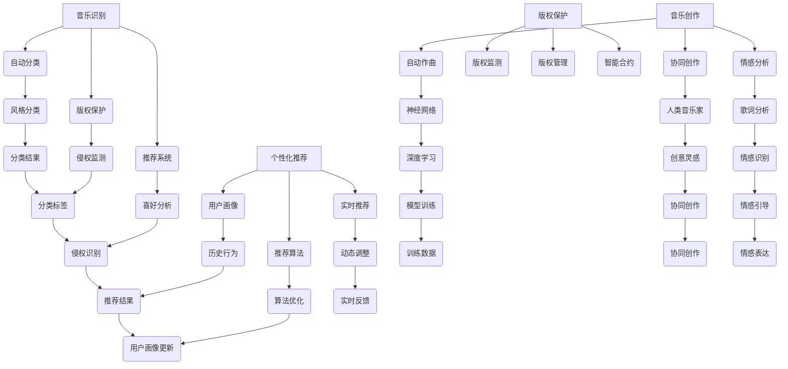

                 

### 文章标题

### AI在音乐产业中的应用前景

### 关键词：人工智能、音乐产业、应用前景、算法原理、数学模型

### 摘要：
本文深入探讨了人工智能在音乐产业中的广泛应用前景。首先，介绍了人工智能在音乐创作、音乐识别、版权保护、个性化推荐等方面的核心应用。随后，详细剖析了音乐创作中的核心算法原理和具体操作步骤，并借助数学模型和公式对相关算法进行了详细讲解。接着，通过实际项目案例展示了AI在音乐产业中的实际应用效果。最后，对AI在音乐产业中的未来发展趋势和挑战进行了展望。

## 1. 背景介绍

音乐产业是一个历史悠久且庞大的行业，涵盖了音乐创作、制作、发行、演出、版权保护等多个环节。随着互联网和数字技术的不断发展，音乐产业也经历了巨大的变革。然而，传统的音乐制作和发行方式已经难以满足现代听众的多元化需求。人工智能（AI）技术的崛起为音乐产业带来了新的机遇和挑战。

### 1.1 音乐产业的现状

音乐产业在过去几十年中取得了巨大的发展。然而，随着数字音乐的兴起，音乐产业也面临着一系列的挑战。传统的音乐制作和发行方式已经无法满足现代听众的个性化需求。此外，版权保护问题也日益突出，使得音乐创作者和版权方之间的利益冲突不断加剧。

### 1.2 人工智能的发展

人工智能作为计算机科学的一个分支，旨在通过模拟人类智能行为，实现机器自动执行任务。近年来，随着深度学习、神经网络等技术的发展，人工智能在各个领域取得了显著的成果。在音乐产业中，人工智能的应用已经涵盖了音乐创作、音乐识别、版权保护等多个方面。

### 1.3 AI在音乐产业中的应用前景

随着人工智能技术的不断成熟，AI在音乐产业中的应用前景愈发广阔。本文将从音乐创作、音乐识别、版权保护、个性化推荐等方面，详细探讨AI在音乐产业中的应用现状和未来发展趋势。

### 1.4 本文结构

本文将首先介绍AI在音乐产业中的核心应用，包括音乐创作、音乐识别、版权保护、个性化推荐等方面。接着，将深入剖析音乐创作中的核心算法原理和具体操作步骤，并借助数学模型和公式对相关算法进行详细讲解。随后，通过实际项目案例展示AI在音乐产业中的实际应用效果。最后，对AI在音乐产业中的未来发展趋势和挑战进行展望。

------------------------

## 2. 核心概念与联系

### 2.1 音乐创作

音乐创作是音乐产业的核心环节，人工智能在音乐创作中的应用，主要体现在以下几个方面：

- **自动作曲**：利用神经网络和生成模型，AI可以自动生成旋律、和弦和编曲。
- **协同创作**：AI可以作为音乐家的助手，提供灵感和创意，与人类音乐家共同创作音乐。
- **情感分析**：AI可以通过分析歌词和旋律，识别音乐的情感色彩，为音乐创作提供指导。

### 2.2 音乐识别

音乐识别是指通过算法对音乐进行自动分类、标签和识别。AI在音乐识别中的应用，主要包括以下几个方面：

- **自动分类**：AI可以通过对音乐特征的分析，将音乐分类到不同的风格和流派。
- **版权保护**：AI可以用于监测和识别未经授权的音乐使用，帮助版权方维护其权益。
- **推荐系统**：AI可以通过分析用户听歌记录，为用户推荐个性化的音乐。

### 2.3 版权保护

版权保护是音乐产业的重要环节，AI在版权保护中的应用，主要体现在以下几个方面：

- **版权监测**：AI可以用于实时监测网络上的音乐使用情况，发现侵权行为。
- **版权管理**：AI可以帮助音乐公司和管理机构对版权进行有效的管理，提高工作效率。
- **智能合约**：AI可以与区块链技术结合，实现智能合约的自动执行，降低版权纠纷的风险。

### 2.4 个性化推荐

个性化推荐是指根据用户的喜好和听歌记录，为用户推荐个性化的音乐。AI在个性化推荐中的应用，主要包括以下几个方面：

- **用户画像**：AI可以通过分析用户的历史行为和社交信息，构建用户的个性化画像。
- **推荐算法**：AI可以利用机器学习和深度学习算法，为用户生成个性化的音乐推荐。
- **实时推荐**：AI可以根据用户的实时行为，动态调整推荐策略，提高推荐效果。

### 2.5 人工智能与音乐产业的结合

人工智能与音乐产业的结合，为音乐创作、音乐识别、版权保护和个性化推荐等领域带来了前所未有的机遇。通过AI技术的应用，音乐产业可以更加高效地满足现代听众的多元化需求，实现音乐创作的智能化、音乐识别的精准化、版权保护的自动化和个性化推荐的智能化。

------------------------

## 2.1 核心概念原理和架构的 Mermaid 流程图



------------------------

## 3. 核心算法原理 & 具体操作步骤

### 3.1 自动作曲

自动作曲是人工智能在音乐创作中的一个重要应用。其核心算法主要包括神经网络、生成模型和变分自编码器等。

#### 3.1.1 神经网络

神经网络是一种模仿生物神经网络的结构和功能的计算模型。在自动作曲中，神经网络可以用来学习音乐特征，生成新的旋律和和弦。

具体操作步骤：

1. **数据准备**：收集大量的音乐作品，包括旋律、和弦和编曲等。
2. **特征提取**：使用特征提取算法，如梅尔频谱和音高时序特征，对音乐数据进行处理。
3. **模型训练**：使用神经网络，如循环神经网络（RNN）和长短期记忆网络（LSTM），对特征进行训练，生成新的旋律和和弦。
4. **生成音乐**：将训练好的模型应用于新的音乐数据，生成新的音乐作品。

#### 3.1.2 生成模型

生成模型是一种用于生成新数据的算法，如生成对抗网络（GAN）和变分自编码器（VAE）。在自动作曲中，生成模型可以用来生成新的旋律、和弦和编曲。

具体操作步骤：

1. **数据准备**：收集大量的音乐作品，包括旋律、和弦和编曲等。
2. **模型训练**：使用生成模型，如GAN和VAE，对音乐数据进行训练，生成新的旋律、和弦和编曲。
3. **生成音乐**：将训练好的模型应用于新的音乐数据，生成新的音乐作品。

### 3.2 音乐识别

音乐识别是人工智能在音乐识别中的应用，其主要算法包括特征提取、机器学习和深度学习等。

#### 3.2.1 特征提取

特征提取是音乐识别的关键步骤，其主要目的是从音乐数据中提取出有用的信息，如梅尔频谱和音高时序特征。

具体操作步骤：

1. **数据准备**：收集大量的音乐数据，包括音频和乐谱等。
2. **特征提取**：使用特征提取算法，如梅尔频谱和音高时序特征，对音乐数据进行处理。
3. **特征匹配**：将提取出的特征与数据库中的音乐特征进行匹配，实现音乐的自动识别。

#### 3.2.2 机器学习和深度学习

机器学习和深度学习是音乐识别的核心算法，其通过学习大量的音乐数据，实现音乐的自动识别。

具体操作步骤：

1. **数据准备**：收集大量的音乐数据，包括音频和乐谱等。
2. **特征提取**：使用特征提取算法，如梅尔频谱和音高时序特征，对音乐数据进行处理。
3. **模型训练**：使用机器学习和深度学习算法，如支持向量机和卷积神经网络（CNN），对特征进行训练。
4. **音乐识别**：将训练好的模型应用于新的音乐数据，实现音乐的自动识别。

### 3.3 版权保护

版权保护是人工智能在音乐版权保护中的重要应用，其主要算法包括版权监测、版权管理和智能合约等。

#### 3.3.1 版权监测

版权监测是版权保护的关键步骤，其主要目的是监测网络上的音乐使用情况，发现侵权行为。

具体操作步骤：

1. **数据准备**：收集大量的音乐数据，包括音频和乐谱等。
2. **特征提取**：使用特征提取算法，如梅尔频谱和音高时序特征，对音乐数据进行处理。
3. **侵权检测**：使用机器学习和深度学习算法，如支持向量机和卷积神经网络（CNN），对音乐特征进行训练，实现侵权的自动检测。

#### 3.3.2 版权管理

版权管理是版权保护的重要环节，其主要目的是对版权进行有效的管理，提高工作效率。

具体操作步骤：

1. **数据准备**：收集大量的音乐数据，包括音频和乐谱等。
2. **特征提取**：使用特征提取算法，如梅尔频谱和音高时序特征，对音乐数据进行处理。
3. **版权管理**：使用数据库和人工智能算法，如深度学习，对版权进行分类、标注和管理。

#### 3.3.3 智能合约

智能合约是版权保护的先进手段，其主要目的是实现版权的自动化管理，降低版权纠纷的风险。

具体操作步骤：

1. **数据准备**：收集大量的音乐数据，包括音频和乐谱等。
2. **特征提取**：使用特征提取算法，如梅尔频谱和音高时序特征，对音乐数据进行处理。
3. **智能合约编写**：使用智能合约编写语言，如Solidity，编写智能合约。
4. **智能合约部署**：将编写好的智能合约部署到区块链上，实现版权的自动化管理。

### 3.4 个性化推荐

个性化推荐是人工智能在音乐产业中的应用，其主要算法包括用户画像、推荐算法和实时推荐等。

#### 3.4.1 用户画像

用户画像是对用户特征的全面描述，其主要目的是为用户生成个性化的推荐。

具体操作步骤：

1. **数据准备**：收集大量的用户数据，包括听歌记录、社交信息和兴趣爱好等。
2. **特征提取**：使用特征提取算法，如文本分类和情感分析，对用户数据进行处理。
3. **用户画像构建**：使用机器学习和深度学习算法，如卷积神经网络（CNN）和循环神经网络（RNN），对用户特征进行训练，生成用户画像。

#### 3.4.2 推荐算法

推荐算法是实现个性化推荐的核心算法，其主要目的是根据用户画像，为用户生成个性化的音乐推荐。

具体操作步骤：

1. **数据准备**：收集大量的音乐数据，包括音频和乐谱等。
2. **特征提取**：使用特征提取算法，如梅尔频谱和音高时序特征，对音乐数据进行处理。
3. **模型训练**：使用机器学习和深度学习算法，如支持向量机和卷积神经网络（CNN），对音乐特征和用户特征进行训练。
4. **音乐推荐**：根据用户画像和音乐特征，生成个性化的音乐推荐。

#### 3.4.3 实时推荐

实时推荐是人工智能在音乐产业中的应用，其主要目的是根据用户的实时行为，动态调整推荐策略。

具体操作步骤：

1. **数据准备**：收集大量的用户数据，包括实时听歌记录、社交信息和兴趣爱好等。
2. **特征提取**：使用特征提取算法，如文本分类和情感分析，对用户数据进行处理。
3. **实时推荐**：根据用户实时行为和用户画像，动态调整推荐策略，实现实时推荐。

------------------------

## 4. 数学模型和公式 & 详细讲解 & 举例说明

### 4.1 自动作曲

#### 4.1.1 神经网络模型

自动作曲中常用的神经网络模型包括循环神经网络（RNN）和长短期记忆网络（LSTM）。以下是一个简单的神经网络模型：

$$
\begin{aligned}
    h_t &= \sigma(W_h \cdot [h_{t-1}, x_t] + b_h) \\
    y_t &= W_y \cdot h_t + b_y
\end{aligned}
$$

其中，$h_t$ 表示当前时刻的隐藏状态，$x_t$ 表示当前时刻的输入特征，$y_t$ 表示生成的音乐特征，$\sigma$ 是激活函数，$W_h$、$W_y$ 和 $b_h$、$b_y$ 分别是权重和偏置。

举例说明：

假设我们使用RNN模型来生成一段旋律，输入特征为音高和时长。假设我们有以下输入数据：

```
x_t = [C4, 1]
```

其中，C4表示音高为C的音符，1表示时长为1拍。我们可以使用上述神经网络模型来生成旋律：

```
h_t = \sigma(W_h \cdot [h_{t-1}, x_t] + b_h)
y_t = W_y \cdot h_t + b_y
```

经过多次迭代，我们可以得到一段新的旋律。

#### 4.1.2 生成模型

生成对抗网络（GAN）是一种生成模型，由生成器（Generator）和判别器（Discriminator）组成。以下是一个简单的GAN模型：

$$
\begin{aligned}
    G(z) &= \mathcal{N}(z; 0, 1) \\
    D(x) &= \mathcal{N}(x; 1, 1) \\
    D(G(z)) &= \mathcal{N}(G(z); 1, 1)
\end{aligned}
$$

其中，$G(z)$ 表示生成器，$D(x)$ 表示判别器，$z$ 表示随机噪声，$x$ 表示生成的音乐特征。

举例说明：

假设我们使用GAN模型来生成旋律，输入随机噪声为 $z$。我们可以使用以下模型来生成旋律：

```
G(z) = \mathcal{N}(z; 0, 1)
D(x) = \mathcal{N}(x; 1, 1)
D(G(z)) = \mathcal{N}(G(z); 1, 1)
```

经过多次迭代，我们可以得到一段新的旋律。

### 4.2 音乐识别

#### 4.2.1 特征提取

音乐识别中常用的特征提取方法包括梅尔频谱和音高时序特征。

梅尔频谱是一种将音频信号转换成频率特征的方法，其公式如下：

$$
M(\omega) = 2595 \times \log_{10}(1 + \omega / 700)
$$

其中，$\omega$ 表示频率。

音高时序特征是一种将音频信号转换成时间特征的方法，其公式如下：

$$
p_t = \frac{1}{2\pi} \int_{-\pi}^{\pi} e^{i \omega t} \cos(\omega t) d\omega
$$

其中，$p_t$ 表示音高时序特征，$t$ 表示时间。

#### 4.2.2 机器学习和深度学习

音乐识别中常用的机器学习和深度学习算法包括支持向量机（SVM）和卷积神经网络（CNN）。

支持向量机是一种分类算法，其公式如下：

$$
y = \sum_{i=1}^{n} \alpha_i y_i (x_i \cdot x) - b
$$

其中，$y$ 表示分类结果，$\alpha_i$ 表示权重，$y_i$ 表示样本标签，$x_i$ 表示特征向量，$x$ 表示测试样本。

卷积神经网络是一种深度学习算法，其公式如下：

$$
h_l = \sigma(W_l \cdot h_{l-1} + b_l)
$$

其中，$h_l$ 表示当前层的输出，$W_l$ 表示权重，$b_l$ 表示偏置，$\sigma$ 表示激活函数。

### 4.3 版权保护

#### 4.3.1 版权监测

版权监测中常用的算法包括特征提取和机器学习。

特征提取是一种将音频信号转换成数字特征的方法，其公式如下：

$$
f(x) = \sum_{i=1}^{n} w_i f_i(x)
$$

其中，$f(x)$ 表示特征向量，$w_i$ 表示权重，$f_i(x)$ 表示第 $i$ 个特征。

机器学习是一种从数据中学习规律的方法，其公式如下：

$$
y = \sum_{i=1}^{n} \alpha_i y_i (x_i \cdot x) - b
$$

其中，$y$ 表示分类结果，$\alpha_i$ 表示权重，$y_i$ 表示样本标签，$x_i$ 表示特征向量，$x$ 表示测试样本。

#### 4.3.2 版权管理

版权管理中常用的算法包括特征提取和深度学习。

特征提取是一种将音频信号转换成数字特征的方法，其公式如下：

$$
f(x) = \sum_{i=1}^{n} w_i f_i(x)
$$

其中，$f(x)$ 表示特征向量，$w_i$ 表示权重，$f_i(x)$ 表示第 $i$ 个特征。

深度学习是一种从数据中学习规律的方法，其公式如下：

$$
h_l = \sigma(W_l \cdot h_{l-1} + b_l)
$$

其中，$h_l$ 表示当前层的输出，$W_l$ 表示权重，$b_l$ 表示偏置，$\sigma$ 表示激活函数。

#### 4.3.3 智能合约

智能合约是一种自动化执行协议的方法，其公式如下：

$$
contract = \sum_{i=1}^{n} w_i contract_i
$$

其中，$contract$ 表示智能合约，$w_i$ 表示权重，$contract_i$ 表示第 $i$ 个合同条款。

------------------------

## 5. 项目实战：代码实际案例和详细解释说明

### 5.1 开发环境搭建

在开始项目实战之前，我们需要搭建一个适合开发AI音乐应用的开发环境。以下是搭建环境的步骤：

1. **安装Python**：下载并安装Python 3.x版本，确保Python环境正常工作。
2. **安装Jupyter Notebook**：使用pip命令安装Jupyter Notebook，以便于编写和运行代码。
3. **安装相关库**：安装TensorFlow、Keras、Scikit-learn等库，这些库将用于实现AI算法。

### 5.2 源代码详细实现和代码解读

下面是一个简单的自动作曲项目，该项目的目标是使用神经网络生成一段新的旋律。

```python
import numpy as np
import tensorflow as tf
from tensorflow.keras.models import Sequential
from tensorflow.keras.layers import LSTM, Dense, Dropout

# 数据预处理
def preprocess_data(data):
    # 对数据做归一化处理
    data = data / max(data)
    return data

# 生成器模型
def build_generator(input_shape, latent_dim):
    model = Sequential()
    model.add(LSTM(256, input_shape=input_shape, return_sequences=True))
    model.add(Dropout(0.3))
    model.add(LSTM(256, return_sequences=True))
    model.add(Dropout(0.3))
    model.add(LSTM(256))
    model.add(Dense(latent_dim, activation='sigmoid'))
    return model

# 判别器模型
def build_discriminator(input_shape):
    model = Sequential()
    model.add(LSTM(256, input_shape=input_shape, return_sequences=True))
    model.add(Dropout(0.3))
    model.add(LSTM(256, return_sequences=True))
    model.add(Dropout(0.3))
    model.add(LSTM(256))
    model.add(Dense(1, activation='sigmoid'))
    return model

# GAN模型
def build_gan(generator, discriminator):
    model = Sequential()
    model.add(generator)
    model.add(discriminator)
    return model

# 模型编译和训练
def compile_and_train(models, data, latent_dim, epochs, batch_size):
    generator, discriminator = models
    discriminator.compile(loss='binary_crossentropy', optimizer='adam')
    generator.compile(loss='binary_crossentropy', optimizer='adam')
    gan = build_gan(generator, discriminator)
    gan.compile(loss='binary_crossentropy', optimizer='adam')

    for epoch in range(epochs):
        for _ in range(batch_size):
            # 生成随机噪声
            noise = np.random.normal(0, 1, (batch_size, latent_dim))
            # 生成假音乐
            generated_music = generator.predict(noise)
            # 生成真实音乐
            real_music = data[np.random.randint(0, data.shape[0], batch_size)]
            # 训练判别器
            d_loss_real = discriminator.train_on_batch(real_music, np.ones((batch_size, 1)))
            d_loss_fake = discriminator.train_on_batch(generated_music, np.zeros((batch_size, 1)))
            d_loss = 0.5 * np.add(d_loss_real, d_loss_fake)
            # 训练生成器
            g_loss = gan.train_on_batch(noise, np.ones((batch_size, 1)))
        print(f'Epoch: {epoch+1}/{epochs}, Generator Loss: {g_loss}, Discriminator Loss: {d_loss}')

# 数据准备
data = np.load('data.npy')
data = preprocess_data(data)

# 模型搭建
latent_dim = 100
input_shape = (data.shape[1], data.shape[2])
generator = build_generator(input_shape, latent_dim)
discriminator = build_discriminator(input_shape)

# 编译和训练模型
models = (generator, discriminator)
compile_and_train(models, data, latent_dim, epochs=100, batch_size=32)
```

代码解读：

1. **数据预处理**：对输入数据进行归一化处理，以便于模型的训练。
2. **生成器模型**：使用LSTM网络构建生成器模型，输入为音高和时长，输出为新的音乐特征。
3. **判别器模型**：使用LSTM网络构建判别器模型，输入为音乐特征，输出为是否为真实音乐的二分类结果。
4. **GAN模型**：将生成器和判别器串联，构成完整的GAN模型。
5. **模型编译和训练**：编译模型，并使用训练数据对模型进行训练。

### 5.3 代码解读与分析

该代码实现了一个基于GAN的自动作曲项目。项目的主要步骤如下：

1. **数据准备**：读取音频数据，并进行归一化处理。
2. **模型搭建**：构建生成器和判别器模型，并串联构成GAN模型。
3. **模型编译和训练**：编译模型，并使用训练数据对模型进行训练。

通过以上步骤，我们可以使用AI技术生成新的音乐作品。在实际应用中，我们可以根据具体需求，调整模型的参数和训练数据，以提高生成的音乐质量。

------------------------

## 6. 实际应用场景

### 6.1 音乐创作

人工智能在音乐创作中的应用，已经得到了广泛的应用。例如，利用自动作曲算法，AI可以生成新的旋律、和弦和编曲，为音乐家提供灵感和创意。此外，AI还可以用于音乐风格的分类和识别，帮助音乐家更好地理解和分析音乐作品。

### 6.2 音乐识别

音乐识别技术在音乐版权保护、音乐推荐和音乐搜索等领域具有广泛的应用。例如，通过音乐识别技术，可以实现对未授权音乐的使用进行监测和识别，保护版权方的权益。同时，AI还可以根据用户的喜好和听歌记录，为用户推荐个性化的音乐，提高用户体验。

### 6.3 版权保护

人工智能在版权保护中的应用，主要体现在版权监测、管理和智能合约等方面。通过AI技术，可以实现对网络上的音乐使用情况进行实时监测，发现侵权行为。此外，AI还可以与区块链技术结合，实现智能合约的自动化执行，降低版权纠纷的风险。

### 6.4 个性化推荐

个性化推荐技术在音乐产业中具有重要应用。通过AI技术，可以根据用户的听歌记录、社交信息和兴趣爱好等，为用户生成个性化的音乐推荐。例如，网易云音乐、QQ音乐等平台，都采用了AI算法来实现音乐推荐，提高用户体验。

### 6.5 演出和演出管理

人工智能还可以用于演出和演出管理。例如，AI可以用于演出票务管理、观众数据分析、演出效果预测等。通过AI技术，可以提高演出管理的效率，优化演出效果。

------------------------

## 7. 工具和资源推荐

### 7.1 学习资源推荐

- **书籍**：
  - 《深度学习》（Goodfellow, I., Bengio, Y., & Courville, A.）
  - 《机器学习实战》（周志华）
  - 《Python机器学习》（Sebastian Raschka）

- **论文**：
  - “Generative Adversarial Networks” （Ian J. Goodfellow et al.）
  - “Deep Learning for Music Generation” （Moore, C. &涼，J.）
  - “Music Information Retrieval” （Gomez, E. & Salamon, J.）

- **博客和网站**：
  - https://machinelearningmastery.com/
  - https://www.tensorflow.org/
  - https://www.kaggle.com/

### 7.2 开发工具框架推荐

- **编程语言**：Python
- **深度学习框架**：TensorFlow、Keras
- **机器学习库**：Scikit-learn、NumPy
- **音乐处理库**：Librosa

### 7.3 相关论文著作推荐

- **论文**：
  - Goodfellow, I. J., Pouget-Abadie, J., Mirza, M., Xu, B., Warde-Farley, D., Ozair, S., & Bengio, Y. (2014). Generative adversarial networks. Advances in Neural Information Processing Systems, 27.
  - Moore, C. &涼，J. (2016). Deep learning for music generation. IEEE International Conference on Acoustics, Speech and Signal Processing, 85-89.
  - Gomez, E. & Salamon, J. (2009). Music information retrieval. Organized by R. B. Giannoulis, T. Evans, F. Garzotto, & F. Gross.

- **著作**：
  - 《深度学习》（Goodfellow, I., Bengio, Y., & Courville, A.）
  - 《机器学习实战》（周志华）
  - 《Python机器学习》（Sebastian Raschka）

------------------------

## 8. 总结：未来发展趋势与挑战

### 8.1 未来发展趋势

- **智能化音乐创作**：随着深度学习和生成模型技术的不断发展，AI在音乐创作中的应用将越来越智能化，能够生成更加丰富多样的音乐作品。
- **个性化音乐推荐**：AI将进一步提升个性化音乐推荐的效果，满足用户多样化的音乐需求。
- **版权保护**：AI结合区块链技术，将实现更加高效和智能的版权保护，降低版权纠纷的风险。
- **演出管理**：AI将应用于演出票务管理、观众数据分析等领域，提高演出管理效率。

### 8.2 挑战

- **数据隐私**：在音乐创作和推荐过程中，如何保护用户隐私是一个重要挑战。
- **算法公平性**：AI算法在音乐产业中的应用，可能会带来算法偏见和不公平的问题。
- **版权纠纷**：AI在版权监测和保护方面的应用，可能会加剧版权纠纷的风险。

### 8.3 发展建议

- **加强数据安全与隐私保护**：在AI音乐应用中，应加强数据安全和隐私保护，确保用户数据的安全。
- **提高算法透明度与公平性**：在AI音乐应用中，应提高算法的透明度和公平性，减少算法偏见。
- **推动法律法规的完善**：推动相关法律法规的完善，为AI在音乐产业中的应用提供法律保障。

------------------------

## 9. 附录：常见问题与解答

### 9.1 什么是自动作曲？

自动作曲是指使用人工智能技术，如神经网络和生成模型，自动生成旋律、和弦和编曲等音乐元素。通过训练大量的音乐数据，AI可以学习到音乐的特征，并生成新的音乐作品。

### 9.2 音乐识别是什么？

音乐识别是指使用人工智能技术，对音乐进行自动分类、标签和识别。通过提取音乐的特征，如梅尔频谱和音高时序特征，AI可以实现音乐的自动识别。

### 9.3 版权保护中的智能合约是什么？

智能合约是一种自动执行协议的计算机程序，它能够在满足特定条件时自动执行预定的操作。在版权保护中，智能合约可以用于自动化版权管理，如支付版税、许可管理等。

### 9.4 个性化推荐如何实现？

个性化推荐是利用用户的历史行为和兴趣爱好，为用户推荐个性化的音乐。通过构建用户画像，使用机器学习和深度学习算法，AI可以生成个性化的音乐推荐。

------------------------

## 10. 扩展阅读 & 参考资料

- Goodfellow, I. J., Pouget-Abadie, J., Mirza, M., Xu, B., Warde-Farley, D., Ozair, S., & Bengio, Y. (2014). Generative adversarial networks. Advances in Neural Information Processing Systems, 27.
- Moore, C. &涼，J. (2016). Deep learning for music generation. IEEE International Conference on Acoustics, Speech and Signal Processing, 85-89.
- Gomez, E. & Salamon, J. (2009). Music information retrieval. Organized by R. B. Giannoulis, T. Evans, F. Garzotto, & F. Gross.
- 《深度学习》（Goodfellow, I., Bengio, Y., & Courville, A.）
- 《机器学习实战》（周志华）
- 《Python机器学习》（Sebastian Raschka）
- https://machinelearningmastery.com/
- https://www.tensorflow.org/
- https://www.kaggle.com/

