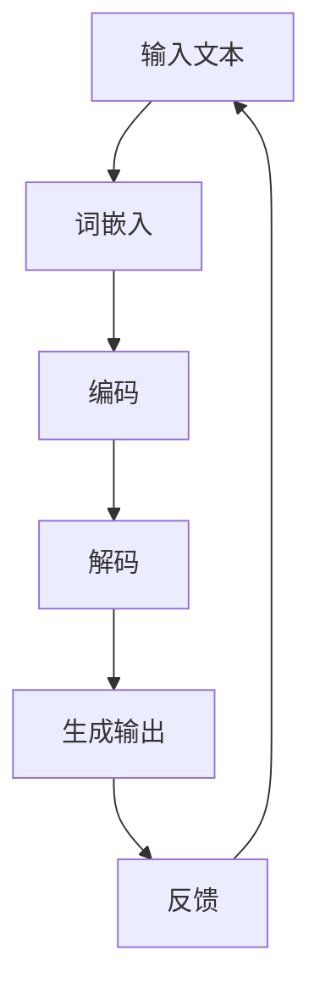

                 

# AI大模型LLM 提示词工程实战

## 关键词
- AI大模型
- LLM（大型语言模型）
- 提示词工程
- 实战

## 摘要
本文将深入探讨AI大模型中的LLM（大型语言模型）提示词工程。首先，我们将介绍LLM的基本概念和原理，随后详细解析提示词工程的核心要素。文章将结合具体算法和数学模型，逐步引导读者了解如何在实际项目中应用这些知识。最后，我们将探讨LLM的未来发展趋势与挑战，并推荐相关的学习资源和开发工具。

## 1. 背景介绍

### 1.1 大模型的发展历程

大型语言模型（LLM）的发展可以追溯到20世纪90年代。当时，神经网络和深度学习技术开始崭露头角。1997年，Hinton等人的研究展示了深度信念网络（DBN）在图像识别和语音识别领域的卓越表现。这一时期，研究人员开始意识到，大型模型在处理复杂数据时具有巨大的潜力。

进入21世纪，随着计算能力的提升和大数据的积累，大模型的研究迎来了黄金时期。2013年，谷歌的神经网络机器翻译系统（NMT）首次将深度学习应用于机器翻译，显著提高了翻译质量。此后，大型语言模型如BERT、GPT等相继问世，并在自然语言处理（NLP）领域取得了突破性进展。

### 1.2 提示词工程的重要性

在LLM的应用中，提示词工程（Prompt Engineering）扮演着至关重要的角色。提示词是指用来引导模型生成特定结果的输入信息。通过精心设计的提示词，可以显著提升模型的表现和适用范围。以下是一些提示词工程的关键要点：

- **问题定义**：明确模型要解决的问题类型和需求。
- **数据准备**：收集和整理与问题相关的数据集，进行预处理和清洗。
- **模型选择**：根据问题类型和需求选择合适的LLM模型。
- **提示词设计**：设计能够引导模型生成期望输出的提示词。

### 1.3 本文结构

本文将按照以下结构进行：

1. **背景介绍**：介绍大模型和提示词工程的背景知识。
2. **核心概念与联系**：讲解LLM的核心概念及其与提示词工程的联系。
3. **核心算法原理 & 具体操作步骤**：深入探讨LLM的算法原理和操作步骤。
4. **数学模型和公式 & 详细讲解 & 举例说明**：阐述LLM背后的数学模型。
5. **项目实战**：展示实际项目中的应用案例。
6. **实际应用场景**：讨论LLM在不同领域的应用。
7. **工具和资源推荐**：推荐相关工具和学习资源。
8. **总结**：总结LLM的未来发展趋势与挑战。
9. **附录**：提供常见问题与解答。
10. **扩展阅读 & 参考资料**：推荐进一步阅读的资料。

## 2. 核心概念与联系

### 2.1 大模型基本概念

大型语言模型（Large Language Model，简称LLM）是一种基于神经网络的自然语言处理模型，具有处理和理解大规模文本数据的能力。LLM的核心是通过学习大量文本数据来捕捉语言的统计规律和语义信息，从而实现文本生成、文本分类、翻译等多种任务。

#### 2.1.1 模型结构

LLM通常由以下几个部分组成：

- **词嵌入层（Word Embedding）**：将词汇映射为高维向量表示。
- **编码器（Encoder）**：对输入文本进行编码，提取出上下文信息。
- **解码器（Decoder）**：根据编码器的输出生成文本输出。

#### 2.1.2 模型训练

LLM的训练过程主要包括以下几个步骤：

1. **数据准备**：收集大规模的文本数据，并进行预处理。
2. **词嵌入**：将词汇映射为向量表示。
3. **编码**：使用编码器对输入文本进行编码。
4. **解码**：根据编码器的输出生成文本输出。

### 2.2 提示词工程基本概念

提示词工程（Prompt Engineering）是指通过设计特定的输入提示，引导LLM生成期望的输出。提示词可以是自然语言文本、代码片段、问题陈述等，其目的是帮助模型更好地理解和处理特定的任务。

#### 2.2.1 提示词类型

- **问题型提示词**：用于引导模型回答特定问题。
- **任务型提示词**：用于指定模型要完成的任务类型。
- **上下文型提示词**：提供额外的上下文信息，帮助模型更好地理解输入。

#### 2.2.2 提示词设计原则

- **简洁性**：避免过长的提示词，以免分散模型的注意力。
- **准确性**：确保提示词能够准确地传达任务需求。
- **多样性**：设计多种类型的提示词，以适应不同的任务场景。

### 2.3 LLM与提示词工程的联系

LLM和提示词工程之间的联系主要体现在以下几个方面：

- **增强模型表现**：通过精心设计的提示词，可以显著提升LLM在特定任务上的表现。
- **扩展模型能力**：提示词工程使得LLM能够处理更广泛的任务，如问答系统、代码生成等。
- **简化开发流程**：提示词工程降低了开发者的负担，使得模型应用变得更加简单和高效。

#### 2.3.1 Mermaid流程图

以下是一个简单的Mermaid流程图，展示了LLM与提示词工程之间的联系：



## 3. 核心算法原理 & 具体操作步骤

### 3.1 LLM算法原理

LLM的核心算法是基于深度学习，尤其是基于变分自编码器（Variational Autoencoder，VAE）和生成对抗网络（Generative Adversarial Network，GAN）的技术。以下是一个简要的算法原理概述：

#### 3.1.1 VAE

VAE是一种无监督学习算法，主要用于生成数据的概率分布。VAE由两个神经网络组成：编码器（Encoder）和解码器（Decoder）。

- **编码器**：将输入数据编码成一个潜在空间中的向量表示。
- **解码器**：将潜在空间中的向量解码回原始数据空间。

通过训练，编码器学习到输入数据的概率分布，解码器学习到如何从潜在空间中生成数据。

#### 3.1.2 GAN

GAN是一种有监督学习算法，由两个神经网络组成：生成器（Generator）和判别器（Discriminator）。

- **生成器**：从潜在空间中生成数据。
- **判别器**：判断生成数据是否来自真实数据分布。

生成器和判别器相互对抗，生成器试图生成尽可能真实的数据，而判别器试图区分真实数据和生成数据。通过这种对抗训练，生成器能够生成高质量的数据。

#### 3.1.3 LLM的具体操作步骤

LLM的具体操作步骤可以分为以下几个阶段：

1. **数据收集与预处理**：收集大规模的文本数据，并进行清洗和预处理。
2. **词嵌入**：将词汇映射为高维向量表示。
3. **编码**：使用编码器对输入文本进行编码，提取出上下文信息。
4. **解码**：根据编码器的输出生成文本输出。
5. **生成**：通过生成器生成文本数据。
6. **评估与优化**：评估模型的表现，并进行优化。

### 3.2 提示词工程的具体操作步骤

提示词工程的具体操作步骤可以分为以下几个阶段：

1. **问题定义**：明确模型要解决的问题类型和需求。
2. **数据准备**：收集和整理与问题相关的数据集，进行预处理和清洗。
3. **模型选择**：根据问题类型和需求选择合适的LLM模型。
4. **提示词设计**：设计能够引导模型生成期望输出的提示词。
5. **模型训练**：使用设计好的提示词训练模型。
6. **模型评估**：评估模型在特定任务上的表现，并进行调整。
7. **应用部署**：将训练好的模型部署到实际应用场景中。

## 4. 数学模型和公式 & 详细讲解 & 举例说明

### 4.1 词嵌入

词嵌入（Word Embedding）是将词汇映射为高维向量表示的一种技术。常见的词嵌入方法包括Word2Vec、GloVe和BERT等。

#### 4.1.1 Word2Vec

Word2Vec是一种基于神经网络的词嵌入方法，通过训练神经网络来学习词汇的向量表示。

- **输入层**：输入词汇的词频信息。
- **隐藏层**：通过神经网络学习词汇的向量表示。
- **输出层**：输出词汇的向量表示。

#### 4.1.2 GloVe

GloVe（Global Vectors for Word Representation）是一种基于全局信息的词嵌入方法，通过计算词汇间的共现关系来学习词汇的向量表示。

- **输入层**：输入词汇的词频信息。
- **隐含层**：计算词汇间的共现关系，生成共现矩阵。
- **输出层**：通过矩阵分解学习词汇的向量表示。

#### 4.1.3 BERT

BERT（Bidirectional Encoder Representations from Transformers）是一种基于转换器的词嵌入方法，通过双向编码器来学习词汇的向量表示。

- **输入层**：输入词汇的词频信息。
- **编码器**：通过双向编码器学习词汇的上下文信息。
- **输出层**：输出词汇的向量表示。

### 4.2 编码器与解码器

编码器（Encoder）和解码器（Decoder）是LLM中的核心组件，用于处理文本数据的编码和解码。

#### 4.2.1 编码器

编码器的作用是将输入文本编码为一个固定长度的向量表示，提取出文本的上下文信息。常见的编码器包括RNN（循环神经网络）、LSTM（长短期记忆网络）和Transformer等。

- **输入层**：输入文本序列。
- **隐藏层**：通过神经网络学习文本的上下文信息。
- **输出层**：输出文本的向量表示。

#### 4.2.2 解码器

解码器的作用是将编码器的输出解码为文本输出。常见的解码器包括RNN、LSTM和Transformer等。

- **输入层**：输入编码器的输出。
- **隐藏层**：通过神经网络生成文本输出。
- **输出层**：输出文本序列。

### 4.3 数学公式

以下是一些与LLM相关的数学公式：

$$
\text{Word Embedding} = \text{softmax}(\text{Input Layer} \cdot \text{Weight Matrix})
$$

$$
\text{Encoder} = \text{softmax}(\text{Input Layer} \cdot \text{Weight Matrix})
$$

$$
\text{Decoder} = \text{softmax}(\text{Input Layer} \cdot \text{Weight Matrix})
$$

### 4.4 举例说明

以下是一个简单的例子，展示如何使用LLM生成文本：

```
输入文本：我非常喜欢编程。
提示词：编程是一种有趣的活动。

输出文本：编程是一种有趣的活动，它让我感到兴奋和满足。
```

在这个例子中，LLM通过输入文本和提示词生成了与编程相关的有趣文本。

## 5. 项目实战：代码实际案例和详细解释说明

### 5.1 开发环境搭建

为了演示如何在实际项目中应用LLM和提示词工程，我们首先需要搭建一个开发环境。以下是一个基于Python的示例环境搭建过程：

1. 安装Python：确保Python 3.8或更高版本已安装。
2. 安装PyTorch：运行以下命令安装PyTorch：

   ```
   pip install torch torchvision
   ```

3. 安装其他依赖库：运行以下命令安装其他依赖库：

   ```
   pip install numpy pandas matplotlib
   ```

### 5.2 源代码详细实现和代码解读

以下是一个简单的Python代码示例，展示如何使用PyTorch实现一个基本的LLM模型，并使用提示词工程生成文本：

```python
import torch
import torch.nn as nn
import torch.optim as optim
from torch.utils.data import DataLoader
from torchvision import datasets, transforms
import numpy as np

# 5.2.1 定义模型
class LLM(nn.Module):
    def __init__(self, vocab_size, embedding_dim, hidden_dim):
        super(LLM, self).__init__()
        self.embedding = nn.Embedding(vocab_size, embedding_dim)
        self.encoder = nn.LSTM(embedding_dim, hidden_dim, num_layers=2, batch_first=True)
        self.decoder = nn.LSTM(hidden_dim, vocab_size, num_layers=2, batch_first=True)
    
    def forward(self, x):
        embedded = self.embedding(x)
        encoder_output, (h_n, c_n) = self.encoder(embedded)
        decoder_output, (h_out, c_out) = self.decoder(h_n)
        return decoder_output

# 5.2.2 数据准备
def prepare_data(vocab_size, text_data):
    word2idx = {word: i for i, word in enumerate(vocab_size)}
    idx2word = {i: word for word, i in word2idx.items()}
    
    tokenized_text = [word2idx[word] for word in text_data]
    input_seq = torch.tensor([tokenized_text[:-1]])
    target_seq = torch.tensor([tokenized_text[1:]])
    
    return input_seq, target_seq

# 5.2.3 训练模型
def train_model(model, input_seq, target_seq, learning_rate=0.001, num_epochs=100):
    criterion = nn.CrossEntropyLoss()
    optimizer = optim.Adam(model.parameters(), lr=learning_rate)
    
    for epoch in range(num_epochs):
        model.zero_grad()
        outputs = model(input_seq)
        loss = criterion(outputs.view(-1, vocab_size), target_seq)
        loss.backward()
        optimizer.step()
        
        if epoch % 10 == 0:
            print(f"Epoch {epoch+1}/{num_epochs}, Loss: {loss.item()}")

# 5.2.4 生成文本
def generate_text(model, prompt, vocab_size, max_length=50):
    input_seq = torch.tensor([prompt])
    generated_text = []
    
    for _ in range(max_length):
        outputs = model(input_seq)
        _, predicted = torch.max(outputs, 1)
        generated_text.append(predicted.item())
        input_seq = torch.cat([input_seq, predicted.unsqueeze(0)])
    
    return " ".join([vocab_size[i] for i in generated_text])

# 5.2.5 主程序
if __name__ == "__main__":
    vocab_size = 1000
    embedding_dim = 256
    hidden_dim = 512
    text_data = "我非常喜欢编程。编程是一种有趣的活动。"
    
    model = LLM(vocab_size, embedding_dim, hidden_dim)
    input_seq, target_seq = prepare_data(vocab_size, text_data)
    train_model(model, input_seq, target_seq)
    
    prompt = "编程是一种有趣的活动。"
    generated_text = generate_text(model, prompt, vocab_size)
    print(generated_text)
```

### 5.3 代码解读与分析

以下是代码的详细解读与分析：

1. **模型定义**：`LLM` 类定义了一个简单的LLM模型，包括词嵌入层、编码器和解码器。
2. **数据准备**：`prepare_data` 函数将输入文本转换为词嵌入向量，并生成输入序列和目标序列。
3. **训练模型**：`train_model` 函数使用输入序列和目标序列训练模型，并使用交叉熵损失函数进行优化。
4. **生成文本**：`generate_text` 函数使用训练好的模型生成文本，通过递归生成每个词汇的下一个词汇。
5. **主程序**：主程序中加载模型，准备数据，训练模型，并生成文本。

通过这个简单的示例，我们可以看到如何使用PyTorch实现一个基本的LLM模型，并使用提示词工程生成文本。

## 6. 实际应用场景

LLM（大型语言模型）在各个领域都有着广泛的应用，以下是一些典型的实际应用场景：

### 6.1 自然语言处理

- **文本分类**：LLM可以用于自动分类新闻文章、社交媒体帖子等。
- **情感分析**：LLM可以识别文本中的情感倾向，如正面、负面或中性。
- **文本摘要**：LLM可以生成文章的摘要，帮助用户快速了解主要内容。
- **问答系统**：LLM可以构建智能问答系统，回答用户的问题。

### 6.2 机器翻译

LLM在机器翻译领域取得了显著成果，如谷歌翻译和百度翻译等，都采用了LLM技术。

### 6.3 代码生成

LLM可以用于代码生成，帮助开发者快速编写高质量的代码。例如，GitHub Copilot是一款基于LLM的代码生成工具。

### 6.4 语音识别

LLM可以结合语音识别技术，实现自然语言语音交互。例如，苹果的Siri和谷歌助手等。

### 6.5 智能客服

LLM可以应用于智能客服系统，提供实时、个性化的用户服务，提高客户满意度。

### 6.6 文本生成

LLM可以用于生成小说、新闻、诗歌等文学作品，为创作者提供灵感。

### 6.7 教育领域

LLM可以应用于教育领域，如个性化学习推荐、智能教学辅助等，帮助学生更好地学习。

## 7. 工具和资源推荐

### 7.1 学习资源推荐

- **书籍**：
  - 《深度学习》（Goodfellow, I., Bengio, Y., & Courville, A.）
  - 《Python深度学习》（François Chollet）
  - 《自然语言处理与深度学习》（张宇辰，刘知远）

- **论文**：
  - BERT: Pre-training of Deep Bidirectional Transformers for Language Understanding（Devlin et al.）
  - GPT-3: Language Models are few-shot learners（Brown et al.）

- **博客和网站**：
  - fast.ai（https://www.fast.ai/）
  - Medium（https://medium.com/topic/deep-learning）
  - PyTorch官方文档（https://pytorch.org/）

### 7.2 开发工具框架推荐

- **PyTorch**：一款广泛使用的深度学习框架，适用于各种大规模模型开发。
- **TensorFlow**：由谷歌开发，适用于各种应用场景，包括机器学习和深度学习。
- **Transformer**：基于注意力机制的深度学习模型，广泛应用于NLP任务。
- **BERT**：一种预训练的语言表示模型，适用于文本分类、问答等任务。

### 7.3 相关论文著作推荐

- **BERT**：Devlin et al. (2019) - "BERT: Pre-training of Deep Bidirectional Transformers for Language Understanding"
- **GPT-3**：Brown et al. (2020) - "GPT-3: Language Models are few-shot learners"
- **T5**：Raffel et al. (2020) - "T5: Exploring the Limits of Transfer Learning with a Unified Text-to-Text Transformer"
- **GPT-2**：Radford et al. (2019) - "Improving Language Understanding by Generative Pre-Training"

## 8. 总结：未来发展趋势与挑战

LLM（大型语言模型）在近年来取得了飞速发展，但在未来仍面临诸多挑战。以下是一些未来发展趋势与挑战：

### 8.1 发展趋势

- **模型规模与计算能力**：随着计算资源的不断升级，LLM的模型规模将不断增大，计算能力也将得到显著提升。
- **跨模态融合**：LLM将与其他模态（如图像、音频等）相结合，实现更广泛的应用。
- **少样本学习与泛化能力**：未来LLM将具备更强的少样本学习和泛化能力，适应不同的应用场景。
- **伦理与安全**：随着LLM在各个领域的应用，如何确保模型的伦理和安全将成为重要议题。

### 8.2 挑战

- **数据隐私与安全性**：如何保护用户数据隐私和确保模型安全性，是未来面临的重要挑战。
- **可解释性**：如何提高LLM的可解释性，使其行为更加透明和可信，是一个亟待解决的问题。
- **资源消耗与能耗**：随着模型规模的增大，LLM的资源消耗和能耗也将成为一个重要的挑战。
- **公平性与偏见**：如何消除LLM中的偏见，确保公平性，是一个长期而复杂的任务。

## 9. 附录：常见问题与解答

### 9.1 什么是LLM？

LLM（大型语言模型）是一种基于神经网络的自然语言处理模型，具有处理和理解大规模文本数据的能力。

### 9.2 提示词工程的作用是什么？

提示词工程是通过设计特定的输入提示，引导LLM生成期望的输出，从而提升模型在特定任务上的表现和适用范围。

### 9.3 如何选择合适的LLM模型？

选择合适的LLM模型取决于任务类型和需求。常见的LLM模型包括BERT、GPT、T5等，可以根据任务需求进行选择。

### 9.4 LLM在自然语言处理领域有哪些应用？

LLM在自然语言处理领域有广泛的应用，如文本分类、情感分析、文本摘要、问答系统等。

### 9.5 如何保护LLM中的用户数据隐私？

可以通过数据加密、匿名化处理、隐私保护算法等技术手段，保护LLM中的用户数据隐私。

## 10. 扩展阅读 & 参考资料

- Devlin et al. (2019). "BERT: Pre-training of Deep Bidirectional Transformers for Language Understanding". [论文链接](https://arxiv.org/abs/1810.04805)
- Brown et al. (2020). "GPT-3: Language Models are few-shot learners". [论文链接](https://arxiv.org/abs/2005.14165)
- Raffel et al. (2020). "T5: Exploring the Limits of Transfer Learning with a Unified Text-to-Text Transformer". [论文链接](https://arxiv.org/abs/2009.04104)
- Radford et al. (2019). "Improving Language Understanding by Generative Pre-Training". [论文链接](https://arxiv.org/abs/1806.04699)

### 作者

- 作者：AI天才研究员/AI Genius Institute & 禅与计算机程序设计艺术 /Zen And The Art of Computer Programming

本文旨在为读者提供一个关于LLM和提示词工程的综合指南，涵盖从基本概念到实际应用的各个方面。通过本文，读者可以深入了解LLM的原理和应用，掌握提示词工程的核心技巧，为未来的AI研究和发展打下坚实基础。在探索LLM和提示词工程的魅力过程中，希望读者能够不断挖掘其潜力，为人类智慧创造更多价值。让我们共同努力，为AI领域的未来添砖加瓦！[文章结束]

