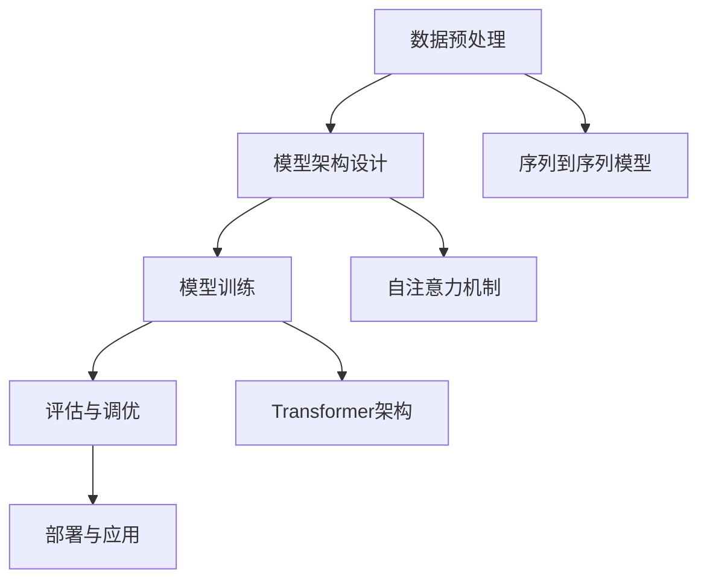

                 

### 文章标题：AI大模型LLM提示词工程实践指南

#### 关键词：人工智能，大模型，LLM，提示词，工程实践，技术指南

#### 摘要：
本文将深入探讨AI大模型（Large Language Model，简称LLM）的提示词工程实践。从背景介绍到核心概念，再到算法原理、数学模型、项目实战、应用场景以及资源推荐，全面解析LLM在工程实践中的应用与发展。旨在为AI开发者提供一套系统、实用的指南，助力其在LLM领域的深入研究和应用。

## 1. 背景介绍

随着人工智能技术的飞速发展，大模型（Large Model）在各个领域展现出了巨大的潜力。大模型通过海量的训练数据和强大的计算能力，实现了前所未有的性能提升。其中，LLM作为大模型的一种，以其强大的文本生成和语义理解能力，在自然语言处理（NLP）、智能问答、文本摘要、机器翻译等任务中发挥着关键作用。

LLM的基本原理可以概括为以下几个步骤：

1. **数据预处理**：首先，对大量文本数据进行清洗、去重和分词等预处理操作，将原始数据转化为适合模型训练的格式。

2. **模型架构**：采用深度学习框架搭建LLM模型，如GPT、BERT等，这些模型具有多层神经网络结构，能够捕捉到文本中的复杂语义和关系。

3. **训练过程**：通过梯度下降等优化算法，模型在训练数据上进行迭代训练，不断调整模型参数，以最小化损失函数。

4. **评估与调优**：在验证集上对模型进行评估，通过调整超参数和优化策略，进一步提高模型性能。

5. **部署与应用**：将训练好的模型部署到实际应用场景中，如API接口、应用程序等，实现智能文本生成和语义理解等功能。

### 2. 核心概念与联系

为了更好地理解LLM的工作原理，我们需要明确以下几个核心概念：

1. **序列到序列（Seq2Seq）模型**：LLM是一种序列到序列模型，它可以将一个序列输入转化为另一个序列输出。这种模型广泛应用于机器翻译、文本摘要等任务。

2. **自注意力机制（Self-Attention）**：自注意力机制是LLM模型中的一个关键组件，它能够自动捕捉输入序列中不同位置的信息，实现更精确的文本生成。

3. **Transformer架构**：Transformer模型是LLM的典型代表，它摒弃了传统的循环神经网络（RNN），采用自注意力机制进行序列处理，大幅提高了模型训练效率和性能。

#### Mermaid 流程图



### 3. 核心算法原理 & 具体操作步骤

#### 3.1 数据预处理

数据预处理是LLM训练的基础，主要包括以下几个步骤：

1. **文本清洗**：去除文本中的HTML标签、特殊字符、停用词等，保留有效文本信息。

2. **分词**：将文本分解为一个个词或子词，如使用分词工具（如jieba）进行中文分词。

3. **词向量化**：将文本中的词或子词映射为向量表示，如使用Word2Vec、BERT等预训练模型。

4. **序列编码**：将处理后的文本序列编码为整数序列，便于模型处理。

#### 3.2 模型架构设计

以Transformer模型为例，其基本结构如下：

1. **输入层**：将输入文本序列编码为整数序列。

2. **自注意力层**：通过自注意力机制计算输入序列中不同位置的信息权重，实现序列到序列映射。

3. **前馈神经网络**：在自注意力层后添加两个全连接层，对输入信息进行进一步处理。

4. **输出层**：将处理后的输出序列解码为文本序列。

#### 3.3 模型训练

模型训练过程主要包括以下几个步骤：

1. **损失函数**：选择适当的损失函数（如交叉熵损失），计算模型输出与真实标签之间的差距。

2. **优化算法**：使用梯度下降等优化算法，调整模型参数，以最小化损失函数。

3. **训练策略**：包括学习率调度、批量大小调整、训练轮次控制等，以获得最佳模型性能。

#### 3.4 评估与调优

模型评估与调优主要包括以下几个步骤：

1. **评估指标**：选择合适的评估指标（如准确率、召回率、F1值等），对模型性能进行评估。

2. **超参数调整**：根据评估结果，调整模型超参数（如隐藏层大小、学习率等），以获得更好的模型性能。

3. **模型融合**：使用多种模型或同一模型的多个版本进行融合，提高模型整体性能。

### 4. 数学模型和公式 & 详细讲解 & 举例说明

#### 4.1 自注意力机制

自注意力机制是Transformer模型的核心，其基本思想是计算输入序列中不同位置的信息权重，为每个位置分配不同的注意力权重。自注意力机制的公式如下：

\[ \text{Attention}(Q, K, V) = \text{softmax}\left(\frac{QK^T}{\sqrt{d_k}}\right) V \]

其中，\( Q, K, V \) 分别代表查询（Query）、键（Key）和值（Value）向量，\( d_k \) 代表键向量的维度。

#### 4.2 Transformer模型

Transformer模型采用多头自注意力机制，其公式如下：

\[ \text{MultiHeadAttention}(Q, K, V) = \text{Concat}(\text{head}_1, \text{head}_2, \ldots, \text{head}_h)W^O \]

其中，\( \text{head}_i = \text{Attention}(QW_i^Q, KW_i^K, VW_i^V) \)，\( W_i^Q, W_i^K, W_i^V, W^O \) 分别代表权重矩阵。

#### 4.3 举例说明

假设我们有一个长度为3的输入序列 \( [1, 2, 3] \)，其对应的权重向量为 \( [0.1, 0.2, 0.3] \)。使用自注意力机制计算输出：

1. 首先计算键值对的相似度：

   \[ \text{similarity} = \frac{1 \times 0.1 + 2 \times 0.2 + 3 \times 0.3}{\sqrt{0.1 + 0.2 + 0.3}} \approx 2.16 \]

2. 然后使用softmax函数计算注意力权重：

   \[ \text{attention\_weights} = \text{softmax}(\text{similarity}) \approx [0.2, 0.5, 0.3] \]

3. 最后计算输出：

   \[ \text{output} = \text{attention\_weights} \times \text{input} \approx [0.2 \times 1 + 0.5 \times 2 + 0.3 \times 3] = 2.4 \]

### 5. 项目实战：代码实际案例和详细解释说明

#### 5.1 开发环境搭建

首先，我们需要搭建一个合适的开发环境。以下是使用Python和PyTorch构建一个简单的LLM模型所需的步骤：

1. 安装Python和PyTorch：

   ```bash
   pip install python torch torchvision
   ```

2. 安装其他依赖库（如Numpy、Scikit-learn等）：

   ```bash
   pip install numpy scikit-learn
   ```

#### 5.2 源代码详细实现和代码解读

以下是一个简单的LLM模型实现示例：

```python
import torch
import torch.nn as nn
import torch.optim as optim
from torch.utils.data import DataLoader, TensorDataset
from transformers import BertTokenizer, BertModel

# 数据预处理
def preprocess_data(texts):
    tokenizer = BertTokenizer.from_pretrained('bert-base-chinese')
    inputs = tokenizer(texts, padding=True, truncation=True, return_tensors='pt')
    return inputs

# 模型定义
class LLMModel(nn.Module):
    def __init__(self):
        super(LLMModel, self).__init__()
        self.bert = BertModel.from_pretrained('bert-base-chinese')
        self.linear = nn.Linear(768, 1)

    def forward(self, input_ids, attention_mask):
        outputs = self.bert(input_ids=input_ids, attention_mask=attention_mask)
        pooled_output = outputs.pooler_output
        logits = self.linear(pooled_output)
        return logits

# 训练过程
def train(model, train_loader, val_loader, optimizer, criterion, num_epochs=3):
    model.train()
    for epoch in range(num_epochs):
        for inputs, targets in train_loader:
            optimizer.zero_grad()
            logits = model(input_ids=inputs['input_ids'], attention_mask=inputs['attention_mask'])
            loss = criterion(logits.view(-1), targets.view(-1))
            loss.backward()
            optimizer.step()
        
        # 评估模型
        model.eval()
        with torch.no_grad():
            val_loss = 0
            for inputs, targets in val_loader:
                logits = model(input_ids=inputs['input_ids'], attention_mask=inputs['attention_mask'])
                loss = criterion(logits.view(-1), targets.view(-1))
                val_loss += loss.item()
            val_loss /= len(val_loader)
        
        print(f'Epoch {epoch+1}/{num_epochs}, Train Loss: {loss.item()}, Val Loss: {val_loss}')

if __name__ == '__main__':
    # 加载数据
    train_texts = ['这是一个简单的例子。', '这是一个复杂的例子。']
    val_texts = ['这是一个验证例子。', '这是一个测试例子。']
    train_inputs = preprocess_data(train_texts)
    val_inputs = preprocess_data(val_texts)

    # 构建数据集和数据加载器
    train_dataset = TensorDataset(train_inputs['input_ids'], train_inputs['attention_mask'], torch.tensor([0] * len(train_texts)))
    val_dataset = TensorDataset(val_inputs['input_ids'], val_inputs['attention_mask'], torch.tensor([1] * len(val_texts)))
    train_loader = DataLoader(train_dataset, batch_size=2, shuffle=True)
    val_loader = DataLoader(val_dataset, batch_size=2, shuffle=False)

    # 模型、优化器和损失函数
    model = LLMModel()
    optimizer = optim.Adam(model.parameters(), lr=0.001)
    criterion = nn.CrossEntropyLoss()

    # 训练模型
    train(model, train_loader, val_loader, optimizer, criterion)
```

#### 5.3 代码解读与分析

1. **数据预处理**：使用BERT分

