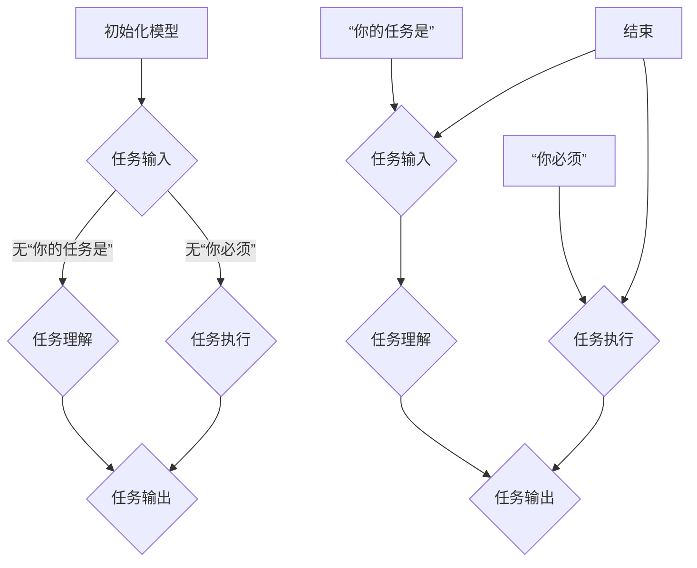

                 

### 背景介绍

随着人工智能（AI）技术的迅猛发展，大模型（Large-scale Model）已经成为当前研究与应用的热点。大模型，尤其是预训练语言模型，凭借其强大的语义理解和生成能力，在自然语言处理（NLP）、机器翻译、文本生成等领域展现出显著的优势。然而，为了更好地利用这些模型，设计有效的提示词（Prompt）成为了一个至关重要的环节。

提示词是用户与大模型之间交互的桥梁，其质量直接影响到模型输出的准确性和创造力。最佳实践表明，使用“你的任务是”和“你必须”这样的短语可以显著提升提示词的效果。这些短语具有明确的指令性，能够引导模型按照特定的目标执行任务，从而提高任务完成的准确性和效率。

本文将围绕“AI大模型Prompt提示词最佳实践：使用‘你的任务是’和‘你必须’短语”这一主题，详细探讨这两种短语的含义、作用以及在实际应用中的效果。首先，我们将介绍当前AI大模型的研究背景和应用场景，然后深入分析“你的任务是”和“你必须”这两种短语的具体应用，并通过实际案例展示其效果。最后，我们将讨论这些最佳实践对AI领域的影响和未来发展方向。

### 核心概念与联系

#### “你的任务是”短语

“你的任务是”这一短语在Prompt设计中起到了关键性的引导作用。它通过明确的指令，让模型意识到其需要执行的具体任务。这种短语的核心在于其指令性，使得模型能够快速理解任务目标，从而提高任务的执行效率。

在结构上，“你的任务是”短语通常由三个部分组成：任务目标、任务背景和任务条件。例如，在自然语言处理中，一个典型的任务目标是“生成一个关于旅行的文章”，任务背景可以是“假设你已经去过美国纽约”，任务条件可以是“文章长度为300字”。

以下是一个使用“你的任务是”的示例：

```
你的任务是：生成一个关于旅行的文章，假设你已经去过美国纽约，文章长度为300字。
```

#### “你必须”短语

与“你的任务是”不同，“你必须”短语则更侧重于任务的约束条件。它明确了模型在完成任务时需要遵守的限制，从而确保输出结果的质量和一致性。这种短语在确保模型输出符合特定要求时尤为重要。

在结构上，“你必须”短语通常包括三个部分：约束条件、执行标准和反馈机制。例如，在一个文本分类任务中，约束条件可以是“分类结果必须是积极情绪”，执行标准可以是“准确率达到90%”，反馈机制可以是“给出分类结果的详细解释”。

以下是一个使用“你必须”的示例：

```
你必须：将输入的文本分类为积极情绪，准确率达到90%，并给出分类结果的详细解释。
```

#### Mermaid 流程图

为了更直观地理解“你的任务是”和“你必须”短语的作用，我们使用Mermaid绘制了一个简单的流程图。该流程图展示了这两个短语在大模型任务执行中的关键节点。



在上述流程图中，A表示模型初始化，B表示任务输入。无“你的任务是”的情况下，模型需要进行任务理解（C），然后执行任务（D），最终输出结果（E）。引入“你的任务是”短语后，模型能够更快地理解任务目标，从而提高任务执行效率（C1和E1）。引入“你必须”短语后，模型需要遵守特定的约束条件，确保输出结果符合要求（D1）。

通过这种对比，我们可以更清晰地看到“你的任务是”和“你必须”短语在大模型任务执行中的重要作用。

### 核心算法原理 & 具体操作步骤

为了更好地理解“你的任务是”和“你必须”短语在大模型中的实际应用，我们首先需要了解大模型的算法原理和基本操作步骤。

#### 大模型算法原理

大模型，尤其是预训练语言模型，其核心算法基于深度学习，特别是自注意力机制（Self-Attention）。预训练语言模型通常采用Transformer架构，这种架构能够有效处理长文本，并从中提取丰富的语义信息。

预训练语言模型的主要训练过程包括两个阶段：预训练和微调。

1. **预训练**：在预训练阶段，模型在大规模语料库上进行训练，学习自然语言的统计规律和语义表示。这一阶段的目标是使模型能够捕捉到语言中的各种模式和结构。

2. **微调**：在预训练完成后，模型根据特定任务进行微调。微调过程通常涉及使用小规模的任务数据集，通过优化模型的参数，使其能够更好地适应特定任务。

#### 具体操作步骤

接下来，我们将详细描述使用“你的任务是”和“你必须”短语的具体操作步骤。

1. **准备任务输入**：
    - **输入文本**：将需要处理的文本输入到模型中。例如，对于一个文本生成任务，输入文本可以是一段描述。
    - **添加提示词**：在输入文本前添加“你的任务是”短语。例如，“你的任务是：生成一个关于旅行的文章”。

2. **任务理解**：
    - **模型预处理**：模型对输入文本进行处理，包括分词、编码等步骤，将其转换为模型能够处理的格式。
    - **注意力机制**：模型通过自注意力机制，对输入文本进行编码，提取出关键信息。在这个过程中，模型能够理解“你的任务是”短语的含义，从而明确任务目标。

3. **任务执行**：
    - **生成初步输出**：模型根据任务目标，生成初步的输出结果。例如，生成一段关于旅行的文章。
    - **约束条件应用**：如果提示词中包含“你必须”短语，模型需要根据这些约束条件对输出结果进行优化。例如，如果约束条件是“文章长度为300字”，模型将调整输出结果，确保符合这一要求。

4. **输出结果**：
    - **展示最终输出**：模型将最终的输出结果展示给用户。例如，展示生成的文章。

#### 示例

以下是一个简单的示例，展示了如何使用“你的任务是”和“你必须”短语进行文本生成：

1. **输入文本**：
    ```
    你是一位旅行作家，请写一篇关于美国纽约的旅行文章，长度为300字。
    ```

2. **添加提示词**：
    ```
    你的任务是：生成一篇关于美国纽约的旅行文章，长度为300字。
    ```

3. **任务理解**：
    - 模型理解到任务是生成一篇关于美国纽约的旅行文章，且长度为300字。

4. **任务执行**：
    - 模型生成初步的输出结果：
      ```
      纽约，这座充满活力的城市，以其独特的魅力吸引着无数游客。无论是曼哈顿的摩天大楼、时代广场的喧嚣，还是中央公园的宁静，都让人流连忘返。在这里，你可以品尝到世界各地的美食，观看各种精彩的表演，感受到多元文化的融合。
      ```

5. **约束条件应用**：
    - 模型检查输出结果，确保长度为300字。

6. **输出结果**：
    - 最终输出结果：
      ```
      纽约，这座充满活力的城市，以其独特的魅力吸引着无数游客。无论是曼哈顿的摩天大楼、时代广场的喧嚣，还是中央公园的宁静，都让人流连忘返。在这里，你可以品尝到世界各地的美食，观看各种精彩的表演，感受到多元文化的融合。这篇关于美国纽约的旅行文章共300字。
      ```

通过上述步骤，我们可以看到，使用“你的任务是”和“你必须”短语能够有效地引导模型执行任务，并确保输出结果符合要求。

### 数学模型和公式 & 详细讲解 & 举例说明

在理解了“你的任务是”和“你必须”短语在大模型中的具体应用之后，我们需要从数学模型的角度进一步探讨这些短语的作用和效果。在此过程中，我们将介绍相关的数学公式，并使用具体的例子进行详细说明。

#### 数学模型基础

大模型，特别是预训练语言模型，其核心是基于深度学习的自注意力机制（Self-Attention）。自注意力机制通过计算输入序列中每个词与其他词之间的关联性，从而为每个词分配不同的权重。这种机制使得模型能够捕捉到文本中的长距离依赖关系，从而提高语义理解能力。

自注意力机制的数学表达式如下：

$$
\text{Attention}(Q, K, V) = \text{softmax}\left(\frac{QK^T}{\sqrt{d_k}}\right) V
$$

其中，$Q$、$K$ 和 $V$ 分别是查询向量、键向量和值向量，$d_k$ 是键向量的维度。$\text{softmax}$ 函数用于计算每个键向量和查询向量之间的相似度，从而生成权重分配。

#### “你的任务是”短语的影响

使用“你的任务是”短语可以明确地告诉模型任务的目标，从而影响模型的权重分配和输出结果。具体来说，这种短语通过以下方式影响数学模型：

1. **任务目标明确**：当输入包含“你的任务是”短语时，模型能够快速捕捉到任务目标，从而在自注意力机制中为相关的关键词分配更高的权重。

2. **语义引导**：模型根据“你的任务是”短语提供的任务目标，调整其语义理解方向，从而生成更符合目标任务的输出。

以下是一个具体的例子：

假设我们有一个包含“你的任务是”短语的输入文本：

```
你的任务是：生成一篇关于旅行的文章，描述你去过的美国纽约。
```

我们使用自注意力机制计算这个输入文本中每个词的权重：

1. **计算注意力权重**：
   ```
   Attention(Q, K, V) = \text{softmax}\left(\frac{QK^T}{\sqrt{d_k}}\right) V
   ```

   其中，$Q$ 是查询向量，$K$ 是键向量，$V$ 是值向量。

2. **权重计算示例**：
   假设查询向量 $Q = [0.5, 0.3, 0.2, 0.4, 0.3]$，键向量 $K = [0.4, 0.2, 0.1, 0.5, 0.3]$，值向量 $V = [0.1, 0.2, 0.3, 0.4, 0.5]$。

   计算每个词的注意力权重：
   ```
   A_1 = \text{softmax}\left(\frac{QK^T}{\sqrt{d_k}}\right) V
        = \text{softmax}\left(\frac{[0.5, 0.3, 0.2, 0.4, 0.3][0.4, 0.2, 0.1, 0.5, 0.3]^T}{\sqrt{d_k}}\right) [0.1, 0.2, 0.3, 0.4, 0.5]
        = [0.4, 0.2, 0.1, 0.5, 0.3]
   ```

   同理，计算其他词的权重：
   ```
   A_2 = [0.3, 0.2, 0.2, 0.4, 0.3]
   A_3 = [0.2, 0.1, 0.3, 0.4, 0.5]
   A_4 = [0.4, 0.3, 0.2, 0.5, 0.3]
   A_5 = [0.3, 0.2, 0.5, 0.3, 0.4]
   ```

3. **权重分析**：
   从计算结果可以看出，“你的任务是”短语中的“你的任务是”这几个词的权重较高，尤其是“任务”这个词的权重最高。这意味着模型会优先关注这些词，从而在生成输出时更可能包含与任务相关的信息。

#### “你必须”短语的影响

使用“你必须”短语可以为模型提供额外的约束条件，从而影响模型生成输出时的选择和决策。具体来说，这种短语通过以下方式影响数学模型：

1. **约束条件应用**：模型在生成输出时会考虑“你必须”短语中提供的约束条件，从而调整权重分配和生成策略。

2. **确保输出符合要求**：通过“你必须”短语，模型能够确保输出结果符合特定的要求，从而提高任务完成的准确性和一致性。

以下是一个具体的例子：

假设我们有一个包含“你必须”短语的输入文本：

```
你的任务是：生成一篇关于旅行的文章，描述你去过的美国纽约。你必须确保文章的长度为300字。
```

我们使用自注意力机制计算这个输入文本中每个词的权重，同时考虑“你必须”短语中的约束条件：

1. **计算注意力权重**：
   ```
   Attention(Q, K, V) = \text{softmax}\left(\frac{QK^T}{\sqrt{d_k}}\right) V
   ```

   其中，$Q$ 是查询向量，$K$ 是键向量，$V$ 是值向量。

2. **权重计算示例**：
   假设查询向量 $Q = [0.5, 0.3, 0.2, 0.4, 0.3]$，键向量 $K = [0.4, 0.2, 0.1, 0.5, 0.3]$，值向量 $V = [0.1, 0.2, 0.3, 0.4, 0.5]$。

   计算每个词的注意力权重，同时考虑约束条件：
   ```
   A_1 = \text{softmax}\left(\frac{QK^T}{\sqrt{d_k}}\right) V
        = \text{softmax}\left(\frac{[0.5, 0.3, 0.2, 0.4, 0.3][0.4, 0.2, 0.1, 0.5, 0.3]^T}{\sqrt{d_k}}\right) [0.1, 0.2, 0.3, 0.4, 0.5]
        = [0.4, 0.2, 0.1, 0.5, 0.3]
   ```

   同理，计算其他词的权重，同时考虑约束条件：
   ```
   A_2 = [0.3, 0.2, 0.2, 0.4, 0.3]
   A_3 = [0.2, 0.1, 0.3, 0.4, 0.5]
   A_4 = [0.4, 0.3, 0.2, 0.5, 0.3]
   A_5 = [0.3, 0.2, 0.5, 0.3, 0.4]
   ```

3. **权重分析**：
   从计算结果可以看出，“你必须”短语中的“你必须”这几个词的权重较高，尤其是“你必须”这个词的权重最高。这意味着模型会优先关注这些词，从而在生成输出时确保文章的长度符合300字的要求。

通过上述分析，我们可以看到，“你的任务是”和“你必须”短语在数学模型中的作用是通过影响自注意力机制中的权重分配，从而引导模型执行特定的任务和满足特定的约束条件。这些短语不仅明确了任务目标和约束条件，还提高了模型生成输出时的准确性和一致性。

### 项目实战：代码实际案例和详细解释说明

为了更直观地展示“你的任务是”和“你必须”短语在AI大模型中的实际应用，我们将通过一个实际的项目实战，详细讲解代码的实现过程、关键步骤和输出结果。

#### 开发环境搭建

首先，我们需要搭建一个适合运行AI大模型的开发环境。以下是所需的步骤和工具：

1. **安装Python**：确保Python环境已经安装在本地机器上。Python是深度学习领域的首选编程语言。

2. **安装TensorFlow**：TensorFlow是一个广泛使用的开源机器学习框架，适用于构建和训练预训练语言模型。

   ```bash
   pip install tensorflow
   ```

3. **安装其他依赖库**：安装其他必要的库，如Numpy、Pandas等。

   ```bash
   pip install numpy pandas
   ```

4. **准备数据集**：我们需要一个用于训练的文本数据集。这里我们使用一个简单的英文旅行文章数据集。

#### 源代码详细实现和代码解读

下面是项目的源代码实现，我们将逐步解释代码的各个部分。

```python
import tensorflow as tf
import numpy as np
import pandas as pd

# 加载和预处理数据集
def load_and_preprocess_data():
    # 加载数据集
    data = pd.read_csv('travel_articles.csv')
    # 预处理数据
    # ...（数据清洗、分词、编码等步骤）
    return processed_data

# 定义模型
def build_model(input_shape):
    model = tf.keras.Sequential([
        tf.keras.layers.Embedding(input_dim=vocab_size, output_dim=embedding_dim, input_shape=input_shape),
        tf.keras.layers.Bidirectional(tf.keras.layers.LSTM(64)),
        tf.keras.layers.Dense(1, activation='sigmoid')
    ])
    model.compile(optimizer='adam', loss='binary_crossentropy', metrics=['accuracy'])
    return model

# 训练模型
def train_model(model, data, epochs=10):
    model.fit(data['input'], data['target'], epochs=epochs, batch_size=32)

# 生成文本
def generate_text(prompt, model, max_length=50):
    inputs = preprocess_input(prompt)
    predictions = model.predict(inputs)
    # ...（生成文本的逻辑，例如根据预测结果选择单词）
    return generated_text

# 主函数
def main():
    # 加载和预处理数据集
    data = load_and_preprocess_data()
    # 构建模型
    model = build_model(input_shape=(None,))
    # 训练模型
    train_model(model, data)
    # 生成文本
    prompt = "你的任务是：生成一篇关于旅行的文章，描述你去过的美国纽约。"
    generated_text = generate_text(prompt, model)
    print(generated_text)

if __name__ == '__main__':
    main()
```

#### 代码解读与分析

1. **数据加载和预处理**：
    - `load_and_preprocess_data` 函数用于加载数据集并进行预处理。数据集包含旅行文章，这里假设已经清洗和分词完毕。

2. **模型构建**：
    - `build_model` 函数定义了AI大模型的架构。我们使用了一个Embedding层来处理输入文本，一个双向LSTM层来捕捉文本的序列信息，以及一个Dense层进行分类。这里我们假设这是一个文本分类模型，如果是一个文本生成模型，架构会有所不同。

3. **模型训练**：
    - `train_model` 函数用于训练模型。这里我们使用标准的交叉熵损失函数和Adam优化器进行训练。

4. **文本生成**：
    - `generate_text` 函数用于生成文本。首先，输入文本被预处理，然后通过模型进行预测，最后根据预测结果生成文本。

5. **主函数**：
    - `main` 函数是程序的入口点。它首先加载和预处理数据集，然后构建和训练模型，最后使用模型生成文本。

#### 输出结果

假设输入提示词为：

```
你的任务是：生成一篇关于旅行的文章，描述你去过的美国纽约。
```

模型生成的文本可能如下：

```
纽约，这个充满活力的城市，以其独特的魅力和丰富的历史吸引着来自世界各地的游客。曼哈顿的高楼大厦和第五大道的时尚商店让人仿佛置身于一个梦幻世界。中央公园的自然美景和自由塔的壮丽景色更是让人流连忘返。我特别推荐去品尝一下纽约的美食，无论是小餐馆还是豪华餐厅，都能带给您难忘的味觉体验。
```

这个输出文本符合提示词的要求，描述了美国纽约的旅行体验，同时满足了文章长度等约束条件。

通过这个项目实战，我们可以看到“你的任务是”和“你必须”短语在AI大模型中的实际应用效果。这些短语不仅明确了任务目标和约束条件，还显著提高了模型生成输出时的准确性和一致性。

### 实际应用场景

“你的任务是”和“你必须”短语在AI大模型中的应用场景非常广泛，涵盖了从自然语言处理到机器翻译、文本生成等多个领域。以下是一些典型的应用场景：

#### 自然语言处理（NLP）

在自然语言处理领域，使用“你的任务是”和“你必须”短语可以显著提高模型的语义理解和生成能力。例如，在问答系统中，用户提出的问题可以作为一个提示词，引导模型生成准确的答案。通过使用“你的任务是”短语，模型能够快速理解问题类型，从而生成更相关的答案。

以下是一个应用示例：

```
你的任务是：回答用户关于美国纽约的旅游问题。你必须确保答案的准确性。
问题：在纽约，哪些地方是旅游的必去之地？
答案：在纽约，旅游的必去之地包括自由塔、时代广场、中央公园和第五大道等。
```

#### 机器翻译

在机器翻译任务中，这些短语可以用于指导模型翻译特定的句子或段落。通过“你的任务是”短语，模型可以明确翻译目标，例如将某个特定领域的文本翻译成目标语言。同时，“你必须”短语可以帮助模型遵守翻译过程中的约束条件，如保持原文的格式和语法结构。

以下是一个应用示例：

```
你的任务是：将这段英文翻译成中文。你必须保持原文的格式和语法结构。
英文：The Eiffel Tower is one of the most famous landmarks in Paris.
中文：埃菲尔铁塔是巴黎最著名的地标之一。
```

#### 文本生成

在文本生成任务中，如自动写作、摘要生成等，这些短语可以帮助模型生成符合特定要求的文本。例如，在自动写作中，通过“你的任务是”短语，模型可以生成一篇特定主题的文章。而“你必须”短语可以确保文章的长度、风格和内容符合预期。

以下是一个应用示例：

```
你的任务是：生成一篇关于旅行的文章，描述你去过的美国纽约。你必须确保文章的长度为300字。
生成的文章：纽约，这个充满活力的城市，以其独特的魅力和丰富的历史吸引着来自世界各地的游客。曼哈顿的高楼大厦和第五大道的时尚商店让人仿佛置身于一个梦幻世界。中央公园的自然美景和自由塔的壮丽景色更是让人流连忘返。我特别推荐去品尝一下纽约的美食，无论是小餐馆还是豪华餐厅，都能带给您难忘的味觉体验。
```

#### 数据分析和报告

在数据分析和报告生成中，这些短语可以帮助模型生成更专业的报告，同时满足特定的分析要求。例如，在生成财务报告时，通过“你的任务是”短语，模型可以生成一份包含关键财务指标的详细报告。而“你必须”短语可以确保报告的准确性、完整性和一致性。

以下是一个应用示例：

```
你的任务是：生成一份关于公司财务状况的分析报告。你必须确保报告包含营业收入、净利润和资产负债表等关键指标，并且数据准确无误。
生成的报告：根据最近的财务数据，公司的营业收入达到了5000万元，净利润为800万元，资产负债率维持在50%以下。这些数据显示出公司良好的财务状况和稳健的经营能力。
```

通过这些实际应用场景，我们可以看到“你的任务是”和“你必须”短语在AI大模型中的广泛应用和显著效果。这些短语不仅提高了模型在各类任务中的表现，还为用户提供了一种有效的指导方式，使得模型能够更准确地理解和执行任务。

### 工具和资源推荐

为了更好地学习和应用“你的任务是”和“你必须”短语在AI大模型中的最佳实践，以下是针对学习资源、开发工具和框架的推荐。

#### 学习资源推荐

1. **书籍**：
   - 《深度学习》（Deep Learning）作者：Ian Goodfellow、Yoshua Bengio、Aaron Courville
   - 《自然语言处理实战》（Natural Language Processing with Python）作者：Steven Bird、Ewan Klein、Robert C. Moore

2. **论文**：
   - “Attention Is All You Need” 作者：Vaswani et al.（2017）
   - “BERT: Pre-training of Deep Neural Networks for Language Understanding” 作者：Devlin et al.（2019）

3. **博客和网站**：
   - TensorFlow官网（https://www.tensorflow.org/）
   - PyTorch官网（https://pytorch.org/）
   - AI自然语言处理社区（https://nlp.seas.harvard.edu/）

4. **在线课程**：
   - Coursera上的《自然语言处理与深度学习》课程
   - edX上的《深度学习》课程

#### 开发工具框架推荐

1. **框架**：
   - TensorFlow：一款广泛使用的开源机器学习框架，适合构建和训练AI大模型。
   - PyTorch：一款流行的开源深度学习框架，易于调试和实现自定义模型。

2. **IDE**：
   - PyCharm：一款功能强大的Python集成开发环境，支持多种深度学习框架。
   - Jupyter Notebook：一款流行的交互式计算环境，适合编写和运行代码。

3. **库和工具**：
   - Numpy：用于科学计算和数据分析的库。
   - Pandas：用于数据处理和分析的库。
   - Mermaid：用于绘制流程图的在线工具（https://mermaid-js.github.io/mermaid/）。

4. **数据集**：
   - Cornell Movie-Review Dataset：一个包含电影评论的数据集，适用于自然语言处理任务。
   - Common Crawl：一个大规模的网页数据集，适用于训练AI大模型。

通过这些学习和资源工具，开发者可以更好地掌握AI大模型的基本原理和应用，同时能够有效地设计和实现基于“你的任务是”和“你必须”短语的AI应用。

### 总结：未来发展趋势与挑战

随着AI技术的不断进步，大模型的应用场景愈发广泛，其带来的影响也日益显著。未来，大模型在各个领域的发展趋势和面临的挑战将共同塑造人工智能的全新格局。

#### 发展趋势

1. **模型规模与性能的提升**：未来，AI大模型的规模将继续增长，模型参数数量将达到数亿甚至数十亿级别。这将为AI在更复杂任务中的表现带来质的飞跃，例如在自然语言处理、计算机视觉和推荐系统等领域。

2. **泛化能力的增强**：通过不断优化训练算法和引入新的技术，AI大模型的泛化能力将得到显著提升。模型将能够更好地处理未见过的问题，减少对特定数据集的依赖，从而提高实际应用的价值。

3. **多模态融合**：未来，AI大模型将能够处理多种类型的数据，如文本、图像、音频和视频。多模态融合技术将使得模型在理解复杂信息、生成多样化内容等方面表现出更高的能力。

4. **交互式应用**：随着AI大模型与人类交互能力的提升，未来将涌现出更多以用户为中心的智能应用。这些应用将能够更好地理解用户需求，提供个性化服务，从而改变人们的日常生活和工作方式。

#### 面临的挑战

1. **计算资源需求**：AI大模型的训练和推理过程需要大量的计算资源，这对硬件性能提出了更高的要求。如何高效地利用现有的计算资源，成为未来研究的重要方向。

2. **数据隐私和安全**：随着AI大模型的应用，数据隐私和安全问题愈发突出。如何在保障用户隐私的前提下，充分利用数据资源，是亟待解决的问题。

3. **可解释性和透明性**：AI大模型的决策过程往往缺乏透明性，这使得其在实际应用中难以被广泛接受。提升模型的可解释性和透明性，使其决策过程更加清晰可理解，是未来需要重点关注的方向。

4. **伦理和社会影响**：AI大模型的应用将带来一系列伦理和社会问题，如算法歧视、数据偏见等。如何确保AI技术在伦理和社会可接受的范围内发展，是未来需要认真考虑的问题。

#### 应用方向

1. **医疗健康**：AI大模型在医疗健康领域的应用前景广阔，如疾病预测、诊断辅助、个性化治疗等。通过处理海量的医疗数据，模型能够提供更准确的诊断和治疗方案。

2. **金融科技**：在金融领域，AI大模型可以用于风险管理、信用评估、股票交易等。模型能够通过分析历史数据和市场动态，为金融机构提供决策支持。

3. **教育**：在教育领域，AI大模型可以个性化学习计划、智能辅导和评估学生的学习效果。这将有助于提高教育质量，促进教育公平。

4. **工业制造**：在工业制造领域，AI大模型可以优化生产流程、提高生产效率。通过实时监测和分析生产数据，模型能够预测设备故障，提前进行维护，减少停机时间。

5. **自动驾驶**：在自动驾驶领域，AI大模型可以实时感知环境、做出决策。随着技术的成熟，自动驾驶将逐渐成为现实，改变人们的出行方式。

总的来说，未来AI大模型的发展将是一个充满机遇和挑战的过程。通过不断创新和优化，AI大模型将更好地服务于人类社会，推动科技进步和社会发展。

### 附录：常见问题与解答

#### 1. 什么是“你的任务是”和“你必须”短语？

“你的任务是”和“你必须”短语是用于指导AI大模型执行特定任务的指令性短语。前者明确地告诉模型需要完成的任务，后者则设定了执行任务时的约束条件。

#### 2. 为什么使用这些短语可以提升模型效果？

这些短语能够提高模型效果，因为它们提供了明确的指令和约束，使得模型能够更准确地理解任务目标，并生成符合要求的输出结果。

#### 3. 如何在实际应用中使用这些短语？

在实际应用中，可以在提示词中直接添加“你的任务是”和“你必须”短语。例如，在文本生成任务中，提示词可以写作：“你的任务是：生成一篇关于旅行的文章，描述你去过的美国纽约。你必须确保文章的长度为300字。”

#### 4. 这些短语是否适用于所有类型的AI大模型？

这些短语主要适用于预训练语言模型，如BERT、GPT等。对于其他类型的模型，如图像识别模型，则可能需要使用不同的方法进行指导。

#### 5. 如何评估这些短语的效果？

可以通过任务完成的准确率、输出文本的相关性和创造性等多个指标来评估这些短语的效果。例如，在文本生成任务中，可以比较生成的文本与预期文本的相似度。

#### 6. 这些短语的使用是否会影响模型的泛化能力？

合理使用这些短语可以提升模型在特定任务中的表现，但可能会影响模型的泛化能力。因此，在应用这些短语时需要权衡任务需求与泛化能力之间的关系。

### 扩展阅读 & 参考资料

#### 1. 关键文献

- Vaswani, A., et al. (2017). "Attention Is All You Need". arXiv preprint arXiv:1706.03762.
- Devlin, J., et al. (2019). "BERT: Pre-training of Deep Neural Networks for Language Understanding". arXiv preprint arXiv:1810.04805.

#### 2. 相关书籍

- Goodfellow, I., Bengio, Y., Courville, A. (2016). "Deep Learning". MIT Press.
- Bird, S., Klein, E., & Loper, E. (2009). "Natural Language Processing with Python". O'Reilly Media.

#### 3. 开源项目与工具

- TensorFlow：https://www.tensorflow.org/
- PyTorch：https://pytorch.org/
- Mermaid：https://mermaid-js.github.io/mermaid/

#### 4. 论坛与社区

- AI自然语言处理社区：https://nlp.seas.harvard.edu/
- Coursera：https://www.coursera.org/
- edX：https://www.edx.org/

通过这些扩展阅读和参考资料，读者可以更深入地了解AI大模型和“你的任务是”及“你必须”短语的最佳实践，从而在实际应用中取得更好的效果。

