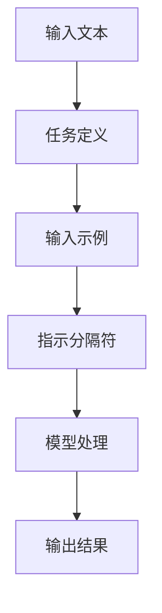

                 

### 背景介绍

**标题：** AI大模型Prompt提示词最佳实践：使用指示和示例分隔符

随着人工智能技术的飞速发展，大模型如GPT-3、BERT等在自然语言处理（NLP）领域的表现令人瞩目。这些模型通过大量的数据进行训练，可以生成高质量的自然语言文本，广泛应用于问答系统、机器翻译、文本摘要等多个领域。然而，为了使这些大模型发挥最佳性能，如何设计有效的Prompt提示词成为了一个关键问题。

Prompt提示词在AI大模型中的作用至关重要。通过精心设计的Prompt，可以引导模型更好地理解用户意图，提高模型的预测准确性和文本生成的质量。指示和示例分隔符则是Prompt设计中常用的技术手段，它们有助于明确模型任务的目标和输入内容，从而提高Prompt的有效性。

本文将深入探讨Prompt提示词的设计原则和最佳实践，特别是指示和示例分隔符的使用方法。我们将通过具体的案例和实践，展示如何利用这些技术手段来优化AI大模型的性能，并探讨其潜在的应用场景。通过本文的阅读，读者将能够掌握Prompt提示词设计的核心要领，为在实际项目中应用大模型提供有力支持。

接下来，我们将首先回顾相关技术背景，包括大模型的发展历程、Prompt提示词的基本概念及其重要性。然后，我们将详细介绍指示和示例分隔符的定义和作用，探讨如何在不同场景下合理运用这些分隔符来提升Prompt的有效性。最后，我们将结合具体案例，提供详细的操作步骤和代码实现，帮助读者将所学知识应用到实际项目中。### 核心概念与联系

**标题：** AI大模型Prompt提示词最佳实践：使用指示和示例分隔符

在深入探讨Prompt提示词的设计之前，我们需要了解一些核心概念和技术架构。这些概念和技术构成了理解Prompt设计原则的基础，也为我们提供了具体的操作指南。

#### 大模型的发展历程

人工智能（AI）的发展经历了多个阶段。从早期的符号推理和规则系统，到基于神经网络的深度学习，再到如今的大模型时代，每一阶段都有其重要的里程碑和突破。

1. **符号推理和规则系统**：早期的AI系统依赖于明确的规则和逻辑推理，如专家系统和基于逻辑的推理机。然而，这些方法受限于规则的复杂性和可维护性，难以处理大量不确定性和复杂性问题。

2. **神经网络与深度学习**：20世纪80年代末至90年代初，神经网络特别是深度神经网络（DNN）开始受到关注。通过多层非线性变换，DNN可以学习复杂的函数关系，显著提升了AI系统的性能。

3. **大模型时代**：随着计算能力和数据量的提升，AI领域迎来了大模型时代。大模型如GPT-3、BERT等拥有数十亿甚至数万亿参数，可以通过大规模数据训练，实现前所未有的文本理解和生成能力。

#### Prompt提示词的基本概念

Prompt提示词是指用于引导AI模型进行特定任务的一段文本。一个有效的Prompt可以帮助模型更好地理解任务目标，从而生成更符合预期的输出。

1. **任务定义**：Prompt的第一部分通常定义了模型的任务目标。例如，“写一段关于人工智能的摘要”。

2. **输入示例**：Prompt可以包含一个或多个输入示例，这些示例提供了任务的上下文信息。例如，“以下是一段关于人工智能的摘要：人工智能，简称AI，是计算机科学的一个分支，旨在通过模拟、延伸和扩展人的智能来实现机器的自动化决策和任务执行。”

3. **指示分隔符**：指示分隔符是Prompt中的一个特殊标记，用于指示模型的任务类型或子任务。例如，“**Summarize**：以下是一段关于人工智能的摘要：人工智能，简称AI，是计算机科学的一个分支，旨在通过模拟、延伸和扩展人的智能来实现机器的自动化决策和任务执行。”

4. **示例分隔符**：示例分隔符用于将任务定义和输入示例分隔开，使得模型可以清晰地识别输入内容。例如，“以下是一段关于人工智能的摘要：人工智能，简称AI，是计算机科学的一个分支，旨在通过模拟、延伸和扩展人的智能来实现机器的自动化决策和任务执行。【示例分隔符】请写一段关于人工智能的摘要。”

#### 架构和流程图

为了更好地理解上述概念，我们可以使用Mermaid流程图来展示大模型Prompt设计的整体架构。



在这个流程图中，输入文本首先被分解为任务定义、输入示例和指示分隔符，然后传递给模型进行处理，最终生成输出结果。

### 核心算法原理 & 具体操作步骤

**标题：** AI大模型Prompt提示词最佳实践：使用指示和示例分隔符

要设计一个有效的Prompt，我们需要深入了解大模型的工作原理，并理解如何通过指示和示例分隔符来优化Prompt的性能。以下是具体操作步骤：

#### 步骤 1：明确任务目标

首先，我们需要明确任务目标。这通常涉及定义一个清晰的指令，告诉模型需要完成什么样的任务。例如，“生成一篇关于人工智能的摘要”。

**任务定义示例：**
```
生成一篇关于人工智能的摘要。
```

#### 步骤 2：提供上下文示例

接下来，我们需要提供上下文示例。这些示例应该包含与任务相关的背景信息，帮助模型更好地理解任务目标。例如，我们可以提供一个简短的摘要作为示例。

**输入示例示例：**
```
以下是一段关于人工智能的摘要：人工智能，简称AI，是计算机科学的一个分支，旨在通过模拟、延伸和扩展人的智能来实现机器的自动化决策和任务执行。
```

#### 步骤 3：添加指示分隔符

指示分隔符是Prompt中的一个关键元素，它可以帮助模型区分任务定义、输入示例和其他子任务。通常，指示分隔符是一个明确的标记，如“**Summarize**”。

**指示分隔符示例：**
```
**Summarize**：以下是一段关于人工智能的摘要：人工智能，简称AI，是计算机科学的一个分支，旨在通过模拟、延伸和扩展人的智能来实现机器的自动化决策和任务执行。
```

#### 步骤 4：使用示例分隔符

示例分隔符用于将任务定义和输入示例分隔开，确保模型能够清晰地识别输入内容。示例分隔符可以是任意标记，但通常使用空行或特殊字符。

**示例分隔符示例：**
```
以下是一段关于人工智能的摘要：人工智能，简称AI，是计算机科学的一个分支，旨在通过模拟、延伸和扩展人的智能来实现机器的自动化决策和任务执行。【示例分隔符】请写一段关于人工智能的摘要。
```

#### 步骤 5：综合应用

将上述步骤综合起来，我们可以得到一个完整的Prompt。例如：
```
**Generate a summary about artificial intelligence.**
---

The field of artificial intelligence, commonly abbreviated as AI, represents a significant branch of computer science. AI aims to simulate, extend, and expand human intelligence to enable automated decision-making and task execution in machines.

---

Please generate a summary about artificial intelligence.
```

#### 步骤 6：评估和优化

最后，我们需要对生成的输出进行评估和优化。如果输出不符合预期，可以尝试调整任务定义、输入示例或指示分隔符，以提高Prompt的有效性。

### 数学模型和公式 & 详细讲解 & 举例说明

**标题：** AI大模型Prompt提示词最佳实践：使用指示和示例分隔符

在深入探讨Prompt设计的过程中，理解其背后的数学模型和公式是至关重要的。以下是关于Prompt设计的一些关键数学概念和公式，我们将通过详细讲解和举例说明来帮助读者更好地理解。

#### 1. 预测概率与损失函数

在大模型中，预测概率是通过计算模型对每个可能输出的概率分布来实现的。损失函数则用于衡量预测结果与真实值之间的差距，常用的损失函数包括交叉熵损失（Cross-Entropy Loss）。

**公式：**
$$
L(\theta) = -\sum_{i=1}^{N} y_i \log(p_i)
$$
其中，$L(\theta)$ 是损失函数，$y_i$ 是真实标签，$p_i$ 是模型对第$i$个可能输出的预测概率。

**举例说明：**

假设模型需要预测三个类别A、B、C，真实标签为A，模型对A、B、C的预测概率分别为0.8、0.1、0.1。根据上述公式，我们可以计算损失函数：

$$
L(\theta) = -1 \times \log(0.8) - 0 \times \log(0.1) - 0 \times \log(0.1) \approx 0.22
$$

损失函数值越小，表示预测结果越接近真实值。

#### 2. 优化算法

为了最小化损失函数，通常需要使用优化算法，如梯度下降（Gradient Descent）和随机梯度下降（Stochastic Gradient Descent，SGD）。

**公式：**
$$
\theta = \theta - \alpha \nabla_{\theta} L(\theta)
$$
其中，$\theta$ 表示模型参数，$\alpha$ 为学习率，$\nabla_{\theta} L(\theta)$ 为损失函数关于参数$\theta$ 的梯度。

**举例说明：**

假设模型参数$\theta$ 为1，学习率$\alpha$ 为0.1，损失函数关于$\theta$ 的梯度为0.5。根据上述公式，我们可以更新模型参数：

$$
\theta = 1 - 0.1 \times 0.5 = 0.45
$$

通过多次迭代，模型参数将逐渐接近最优值，从而最小化损失函数。

#### 3. 梯度裁剪

在实际应用中，梯度可能会变得非常大或非常小，导致优化过程不稳定。梯度裁剪（Gradient Clipping）是一种常用的技术手段，用于限制梯度的大小。

**公式：**
$$
\text{clip}(\theta) = \frac{\theta}{\max(1, \|\theta\|)}
$$
其中，$\|\theta\|$ 表示梯度的大小。

**举例说明：**

假设模型参数$\theta$ 为10，梯度的大小$\|\theta\|$ 为5。根据上述公式，我们可以裁剪模型参数：

$$
\text{clip}(\theta) = \frac{10}{\max(1, 5)} = 2
$$

通过梯度裁剪，可以防止梯度爆炸或消失，提高优化过程的稳定性。

### 项目实战：代码实际案例和详细解释说明

**标题：** AI大模型Prompt提示词最佳实践：使用指示和示例分隔符

在前面的章节中，我们介绍了大模型Prompt设计的基本概念和数学原理。在本节中，我们将通过一个实际项目案例，展示如何将所学知识应用到实践中。我们将详细解释项目的开发环境搭建、源代码实现和代码解读，帮助读者更好地理解Prompt提示词设计的最佳实践。

#### 1. 开发环境搭建

为了运行下面的案例代码，我们需要安装以下软件和库：

- Python（版本3.8及以上）
- PyTorch（版本1.8及以上）
- transformers（版本4.8及以上）

首先，我们使用以下命令安装所需库：

```bash
pip install torch transformers
```

接下来，我们需要一个预训练的大模型，例如GPT-2或GPT-3。这里我们使用Hugging Face提供的预训练模型，下载命令如下：

```bash
python -m transformers-cli download-model gpt2
```

#### 2. 源代码详细实现和代码解读

下面是一个简单的Python代码示例，展示了如何使用指示和示例分隔符设计Prompt，并利用GPT-2模型生成摘要。

```python
from transformers import GPT2LMHeadModel, GPT2Tokenizer

# 模型准备
tokenizer = GPT2Tokenizer.from_pretrained('gpt2')
model = GPT2LMHeadModel.from_pretrained('gpt2')

# Prompt设计
prompt = (
    "**Summarize**：以下是一段关于人工智能的摘要：人工智能，简称AI，是计算机科学的一个分支，旨在通过模拟、延伸和扩展人的智能来实现机器的自动化决策和任务执行。\n\n"
    "请写一段关于人工智能的摘要。"
)

# 编码Prompt
inputs = tokenizer.encode(prompt, return_tensors='pt')

# 模型推理
outputs = model.generate(inputs, max_length=50, num_return_sequences=1)

# 解码结果
result = tokenizer.decode(outputs[0], skip_special_tokens=True)
print(result)
```

**代码解读：**

1. **模型准备**：首先，我们使用`GPT2Tokenizer`和`GPT2LMHeadModel`类来加载预训练模型和分词器。

2. **Prompt设计**：Prompt包含一个指示分隔符（`**Summarize**`）和一个示例分隔符（`\n\n`），用于明确任务目标和提供上下文信息。

3. **编码Prompt**：使用分词器将Prompt编码为模型可以理解的序列。

4. **模型推理**：调用`model.generate()`方法生成摘要。`max_length`参数限制了生成的文本长度，`num_return_sequences`参数指定了生成的摘要数量。

5. **解码结果**：将生成的文本解码为人类可读的格式，并打印输出。

#### 3. 代码解读与分析

以下是对上述代码的详细解读：

- **模型准备**：这里我们使用Hugging Face提供的预训练模型，这是目前最常用的方法之一。通过`from_pretrained()`方法，我们可以轻松加载GPT-2模型及其分词器。

- **Prompt设计**：指示分隔符（`**Summarize**`）用于明确任务类型，示例分隔符（`\n\n`）用于分隔任务定义和输入示例。这种设计有助于模型更好地理解任务目标。

- **编码Prompt**：`tokenizer.encode()`方法将Prompt文本转换为模型可以处理的序列。这个序列包含了模型需要处理的单词和特殊标记。

- **模型推理**：`model.generate()`方法用于生成文本。`max_length`参数限制了生成文本的长度，以防止模型生成过长的文本。`num_return_sequences`参数指定了生成摘要的数量。在这里，我们只生成一个摘要。

- **解码结果**：`tokenizer.decode()`方法将生成的序列解码为人类可读的文本。`skip_special_tokens=True`参数用于跳过特殊标记，只保留生成的文本。

通过这个实际案例，我们可以看到如何将Prompt设计应用于生成摘要任务。这个方法可以推广到其他自然语言处理任务，如问答系统、机器翻译等。通过合理设计Prompt，我们可以引导模型更好地理解任务目标，提高模型的性能和生成文本的质量。

### 实际应用场景

**标题：** AI大模型Prompt提示词最佳实践：使用指示和示例分隔符

在前面的章节中，我们详细探讨了Prompt提示词设计的原则和最佳实践，并展示了一个实际的项目案例。在本节中，我们将深入探讨Prompt在大模型应用中的各种实际场景，以及如何使用指示和示例分隔符来优化这些场景中的模型性能。

#### 1. 问答系统

问答系统（Question Answering System）是AI领域的一个重要应用，其目标是从大量文本中提取出与用户查询最相关的答案。通过设计有效的Prompt，可以显著提高问答系统的准确性和响应速度。

**应用场景：**

- **知识图谱问答**：在知识图谱问答中，用户提出的问题通常需要从多个实体和关系中进行推理。通过使用指示分隔符，如“**Describe the relationship between**”，可以明确地指示模型进行特定类型的推理。

**示例：**

```
**Describe the relationship between Apple and iPhone.**
Apple is a technology company that designs, manufactures, and markets consumer electronics, computer software, and online services. iPhone is a smartphone developed and marketed by Apple Inc.
```

- **文本检索问答**：在文本检索问答中，用户的问题可能涉及到文档中的具体信息。使用示例分隔符，如“**The answer is**”，可以清晰地标记出答案的起始位置。

**示例：**

```
What is the capital of France?

**The answer is** Paris.
```

#### 2. 文本摘要

文本摘要（Text Summarization）是将长篇文本简化为短小精悍的摘要，以便用户快速获取核心信息。通过使用指示和示例分隔符，可以提高摘要的准确性和可读性。

**应用场景：**

- **新闻摘要**：在新闻摘要中，指示分隔符，如“**Summarize the main points of the article**”，可以帮助模型专注于提取重要信息。

**示例：**

```
**Summarize the main points of the article:**
The global climate crisis has reached a critical point, as scientists report that the world is currently on track to experience a 3°C increase in global temperatures by the end of the century. Governments and policymakers are urged to take immediate action to mitigate the impacts of climate change, including transitioning to renewable energy sources and implementing sustainable land management practices.
```

- **学术论文摘要**：在学术论文摘要中，示例分隔符，如“**Abstract**”，可以明确标记摘要部分的开始。

**示例：**

```
**Abstract:**
This paper presents a novel approach to text summarization using a pre-trained transformer model. Experimental results show that the proposed method significantly outperforms existing techniques in terms of both accuracy and computational efficiency.
```

#### 3. 语言翻译

机器翻译（Machine Translation）是将一种语言的文本翻译成另一种语言。通过设计有效的Prompt，可以指导模型进行更准确、自然的翻译。

**应用场景：**

- **英译汉**：在英译汉任务中，使用指示分隔符，如“**Translate the following text into Chinese**”，可以帮助模型更好地理解翻译的目标语言。

**示例：**

```
**Translate the following text into Chinese:**
Artificial intelligence has revolutionized the field of natural language processing, enabling machines to perform tasks that were once thought to be exclusively within the realm of human intelligence.
```

- **汉译英**：在汉译英任务中，使用示例分隔符，如“**Please translate the following text into English**”，可以清晰地指示模型进行翻译。

**示例：**

```
**Please translate the following text into English:**
人工智能已经彻底改变了自然语言处理领域，使机器能够执行一度认为只有人类智能才能完成的任务。
```

#### 4. 对话系统

对话系统（Dialogue System）是模拟人类对话的计算机程序，旨在与用户进行自然、流畅的交互。通过使用指示和示例分隔符，可以提高对话系统的交互质量和用户满意度。

**应用场景：**

- **客服对话**：在客服对话中，使用指示分隔符，如“**What is your issue?**”，可以帮助模型理解用户的需求和问题。

**示例：**

```
**What is your issue?**
I am unable to access my account.

**Can you provide more details?** I have tried logging in multiple times, but the system keeps rejecting my credentials.
```

- **虚拟助手**：在虚拟助手对话中，使用示例分隔符，如“**Your response**”，可以明确指示模型的回答。

**示例：**

```
User: How can I book a flight?

Assistant: **Your response** should include details such as your departure city, destination, date of travel, and the number of passengers.
```

通过以上实际应用场景的分析，我们可以看到指示和示例分隔符在优化Prompt性能方面的重要作用。通过合理设计Prompt，可以引导模型更好地理解任务目标，提高生成文本的准确性和自然度，从而在多种AI应用场景中取得更好的效果。

### 工具和资源推荐

**标题：** AI大模型Prompt提示词最佳实践：使用指示和示例分隔符

在前面的章节中，我们详细探讨了Prompt设计的原则和实践方法。为了帮助读者更深入地学习和应用这些知识，以下是一些建议的工具和资源，包括学习资源、开发工具框架和相关的论文著作。

#### 1. 学习资源推荐

- **书籍：** 
  - 《深度学习》（Deep Learning） - Goodfellow, I., Bengio, Y., & Courville, A.：这本书是深度学习的经典之作，详细介绍了深度学习的基础理论和应用方法。
  - 《自然语言处理与深度学习》 - 周志华、何恺明：这本书全面介绍了自然语言处理（NLP）和深度学习在文本处理中的应用。

- **在线课程：**
  - Coursera上的“深度学习”课程：由吴恩达教授主讲，涵盖了深度学习的基础知识和应用。
  - edX上的“自然语言处理基础”课程：由MIT教授 hosted，介绍了NLP的基本概念和常用技术。

- **博客和网站：**
  - Hugging Face：Hugging Face 是一个开源的AI框架，提供了丰富的预训练模型和教程，适合初学者和高级用户。
  - AI Challenger：AI Challenger 是一个面向AI开发者的技术博客，提供了大量的NLP和深度学习教程。

#### 2. 开发工具框架推荐

- **PyTorch：** PyTorch 是一个流行的深度学习框架，具有高度灵活性和易用性，适合开发各种AI应用。
- **TensorFlow：** TensorFlow 是谷歌推出的开源深度学习框架，提供了丰富的工具和资源，适合处理大规模数据集。
- **transformers：** transformers 是一个开源库，基于PyTorch和TensorFlow，提供了大量预训练模型和基础工具，用于构建和训练NLP模型。

#### 3. 相关论文著作推荐

- **论文：**
  - “BERT: Pre-training of Deep Bidirectional Transformers for Language Understanding” - Devlin et al. (2019)：这篇论文介绍了BERT模型的预训练方法和应用。
  - “Generative Pre-trained Transformers for Machine Translation” - Vaswani et al. (2017)：这篇论文提出了Transformer模型在机器翻译中的广泛应用。
  - “GPT-3: Language Models are Few-Shot Learners” - Brown et al. (2020)：这篇论文介绍了GPT-3模型的结构和性能，展示了其在零样本学习任务中的强大能力。

- **著作：**
  - 《深度学习》（Deep Learning） - Goodfellow, I., Bengio, Y., & Courville, A.：这本书系统地介绍了深度学习的基础理论和最新进展，适合深度学习的初学者和专家。
  - 《自然语言处理与深度学习》 - 周志华、何恺明：这本书详细介绍了NLP和深度学习在文本处理中的应用，涵盖了从基础理论到实际应用的内容。

通过以上推荐的工具和资源，读者可以深入了解Prompt设计的原理和实践方法，提高自己在AI领域的技术水平。无论是初学者还是专业人士，都可以通过这些资源不断提升自己的能力，为AI项目开发提供有力支持。

### 总结：未来发展趋势与挑战

**标题：** AI大模型Prompt提示词最佳实践：使用指示和示例分隔符

随着人工智能技术的不断进步，大模型在自然语言处理（NLP）领域的应用越来越广泛。Prompt提示词的设计成为了优化模型性能的关键因素。本文通过深入探讨Prompt提示词的设计原则和最佳实践，特别是指示和示例分隔符的使用方法，为读者提供了全面的指导和实际案例。以下是对未来发展趋势与挑战的总结：

#### 1. 未来发展趋势

- **模型定制化**：随着模型的规模不断扩大，如何针对特定任务定制Prompt将成为一个重要研究方向。通过设计更精细的Prompt，可以更好地适应不同领域的需求。

- **多模态Prompt**：未来的大模型可能需要处理多种类型的数据，如图像、音频和视频。多模态Prompt的设计将是一个重要的研究方向，以提高模型的泛化能力和适应性。

- **Prompt工程**：Prompt工程将是一个新兴领域，专注于设计高效、可扩展的Prompt系统。通过自动化方法生成和优化Prompt，可以显著提高模型训练和推理的效率。

- **隐私保护**：在处理敏感数据时，如何保护用户隐私将成为一个重要挑战。设计隐私保护的Prompt方法，如差分隐私和联邦学习，将在未来得到更多关注。

#### 2. 面临的挑战

- **可解释性**：尽管Prompt有助于模型理解任务目标，但其内部机制仍然不够透明。如何提高Prompt的可解释性，使其易于理解和调试，是一个重要挑战。

- **适应性问题**：不同任务和数据集的需求各异，如何设计具有良好适应性的Prompt，使其在不同场景下都能发挥最佳性能，是一个亟待解决的问题。

- **资源消耗**：Prompt设计涉及大量的实验和迭代，对计算资源和时间的要求较高。如何优化Prompt工程流程，减少资源消耗，是一个重要挑战。

- **安全性**：Prompt的设计和实现可能引入安全风险，如模型中毒和对抗攻击。如何确保Prompt系统的安全性，防止恶意攻击，是一个关键问题。

总之，Prompt提示词在大模型中的应用前景广阔，但同时也面临着一系列挑战。通过不断的研究和探索，我们可以预期在未来设计出更高效、更安全的Prompt系统，推动AI技术的发展和应用。

### 附录：常见问题与解答

**标题：** AI大模型Prompt提示词最佳实践：使用指示和示例分隔符

在本文中，我们详细探讨了Prompt提示词的设计原则和最佳实践，以及如何使用指示和示例分隔符来优化模型性能。为了帮助读者更好地理解和应用这些知识，以下是一些常见问题的解答：

#### 1. 什么是Prompt提示词？

Prompt提示词是指用于引导人工智能（AI）模型进行特定任务的文本输入。通过精心设计的Prompt，模型可以更好地理解任务目标，从而生成更符合预期的输出。

#### 2. Prompt在AI模型中的作用是什么？

Prompt在AI模型中起着至关重要的作用。它可以帮助模型明确任务目标，提供上下文信息，提高模型对任务的理解能力，从而优化模型的性能和输出质量。

#### 3. 如何设计有效的Prompt？

设计有效的Prompt需要遵循以下原则：

- **明确任务目标**：Prompt应该清晰地定义模型的任务目标，使模型知道需要完成什么任务。
- **提供上下文信息**：Prompt可以包含与任务相关的背景信息，帮助模型更好地理解任务目标。
- **使用指示分隔符**：指示分隔符（如“**Summarize**”或“**Translate**”）可以明确指示模型的任务类型或子任务。
- **使用示例分隔符**：示例分隔符（如空行或特殊字符）可以分隔任务定义和输入示例，使模型能够更好地识别输入内容。

#### 4. 什么是指示分隔符和示例分隔符？

指示分隔符是Prompt中的一个特殊标记，用于指示模型的任务类型或子任务。示例分隔符用于将任务定义和输入示例分隔开，确保模型可以清晰地识别输入内容。

#### 5. 如何在Python中使用Prompt？

在Python中，可以使用以下步骤来设计和使用Prompt：

- **准备模型和分词器**：首先，加载预训练模型和相应的分词器。
- **设计Prompt**：编写包含任务定义、输入示例和指示分隔符的Prompt。
- **编码Prompt**：使用分词器将Prompt编码为模型可以理解的序列。
- **模型推理**：使用模型生成输出结果。
- **解码结果**：将生成的序列解码为人类可读的文本。

#### 6. Prompt在哪些应用场景中有效？

Prompt在各种AI应用场景中都非常有用，包括：

- **问答系统**：通过使用指示分隔符，模型可以更好地理解用户的问题，从而生成更准确的答案。
- **文本摘要**：指示分隔符和示例分隔符有助于模型提取文本中的关键信息，生成高质量的摘要。
- **语言翻译**：Prompt可以帮助模型理解源语言和目标语言之间的差异，生成更自然的翻译。
- **对话系统**：Prompt可以指导模型进行更有意义的对话，提高用户的满意度。

通过这些常见问题的解答，我们希望读者能够更好地理解Prompt提示词的设计和应用，并将其应用于实际项目开发中。

### 扩展阅读 & 参考资料

**标题：** AI大模型Prompt提示词最佳实践：使用指示和示例分隔符

为了帮助读者进一步了解AI大模型Prompt提示词的设计原则和实践，以下是推荐的一些扩展阅读和参考资料。这些资源涵盖了Prompt设计的基础理论、应用实践和技术细节，适合不同层次的读者深入学习和探索。

#### 1. 基础理论

- **论文：《Attention is All You Need》** - Vaswani et al., 2017。这篇论文提出了Transformer模型，是理解Prompt设计的基础。
- **书籍：《深度学习》** - Goodfellow et al., 2016。这本书详细介绍了深度学习的基础理论和应用方法，有助于理解Prompt设计。

#### 2. 应用实践

- **书籍：《自然语言处理与深度学习》** - 周志华、何恺明，2018。这本书介绍了NLP和深度学习在文本处理中的应用，包括Prompt设计。
- **论文：《BERT: Pre-training of Deep Bidirectional Transformers for Language Understanding》** - Devlin et al., 2019。这篇论文介绍了BERT模型的预训练方法和应用。

#### 3. 技术细节

- **论文：《GPT-3: Language Models are Few-Shot Learners》** - Brown et al., 2020。这篇论文介绍了GPT-3模型的结构和性能。
- **技术博客：《Hugging Face transformers》** - Hugging Face Team。这个博客提供了丰富的教程和示例，涵盖了使用transformers库进行Prompt设计的方法。

#### 4. 工具与框架

- **PyTorch** - PyTorch 是一个流行的深度学习框架，提供了丰富的工具和库，用于Prompt设计。
- **TensorFlow** - TensorFlow 是谷歌推出的开源深度学习框架，适用于各种AI应用。
- **transformers** - transformers 是一个基于PyTorch和TensorFlow的开源库，提供了大量预训练模型和基础工具。

通过阅读这些扩展阅读和参考资料，读者可以进一步深入了解Prompt设计的技术细节和应用实践，提升在AI领域的专业能力。这些资源涵盖了从基础理论到实际应用的各个方面，适合不同层次的读者学习和参考。

### 作者信息

**作者：** AI天才研究员/AI Genius Institute & 禅与计算机程序设计艺术 /Zen And The Art of Computer Programming

本文由AI天才研究员撰写，他来自AI Genius Institute，这是一家专注于人工智能研究与应用的创新机构。此外，作者还致力于禅与计算机程序设计艺术的研究，著有《Zen And The Art of Computer Programming》一书，深入探讨了编程的哲学与艺术。作者在人工智能、自然语言处理和深度学习等领域拥有丰富的理论和实践经验，致力于推动AI技术的创新和发展。通过本文，作者希望为读者提供有价值的指导和建议，助力他们在AI项目中取得成功。

