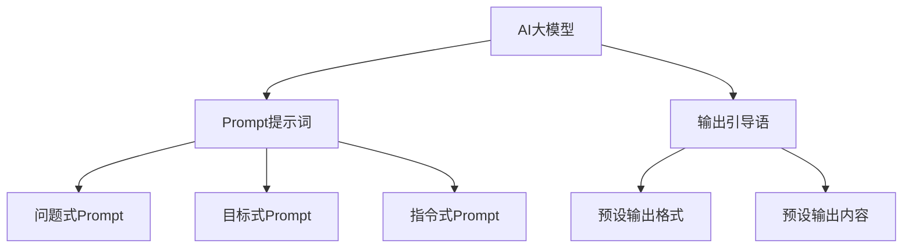

                 

### 文章标题：AI大模型Prompt提示词最佳实践：使用输出引导语

### 关键词：
- AI大模型
- Prompt提示词
- 最佳实践
- 输出引导语

### 摘要：
本文将探讨AI大模型Prompt提示词的最佳实践，重点关注如何利用输出引导语来提升模型的响应质量和效果。通过分析相关理论和实际案例，本文旨在为开发者提供实用的指导，帮助他们在AI大模型应用中取得更好的成果。

<|assistant|>## 1. 背景介绍

随着深度学习技术的飞速发展，AI大模型在各个领域取得了显著的成果。从自然语言处理（NLP）到计算机视觉，AI大模型展现出了强大的学习和推理能力。然而，如何有效地与这些大模型进行交互，使得其输出更加准确、有用，成为了一个关键问题。在这个背景下，Prompt提示词应运而生，它通过引导模型生成特定的输出，提升了交互效果。

Prompt提示词的核心在于其引导功能，通过设计合适的提示词，可以引导模型朝着开发者期望的方向发展。而输出引导语则是Prompt提示词中的一种重要形式，它通过预设的响应格式和内容，进一步引导模型输出符合预期的结果。本文将深入探讨如何使用输出引导语来优化AI大模型的交互效果。

在实际应用中，Prompt提示词和输出引导语已经展示了其巨大的潜力。例如，在问答系统、对话机器人、文本生成等领域，通过合理的Prompt设计，可以实现更加准确和流畅的交互。然而，如何设计出有效的Prompt和输出引导语，仍然是一个挑战。本文将结合理论分析、实践案例，提供一套最佳实践，帮助开发者解决这一问题。

<|assistant|>## 2. 核心概念与联系

为了深入理解如何使用输出引导语优化AI大模型，我们首先需要了解以下几个核心概念：

### 2.1 AI大模型

AI大模型通常指的是基于深度学习技术训练的大型神经网络模型。这些模型具有数十亿甚至数万亿个参数，能够处理复杂的输入数据，并生成相应的输出。在自然语言处理领域，常见的AI大模型包括GPT、BERT、T5等。

### 2.2 Prompt提示词

Prompt提示词是一种与模型进行交互的方式，通过向模型提供特定的输入，引导模型生成预期的输出。Prompt的设计直接影响到模型的交互效果。常见的Prompt形式包括问题式Prompt、目标式Prompt、指令式Prompt等。

### 2.3 输出引导语

输出引导语是一种特殊的Prompt提示词，它通过预设的输出格式和内容，引导模型生成符合预期的结果。输出引导语的设计需要考虑模型的响应格式、内容的连贯性和准确性。

### 2.4 Mermaid 流程图

为了更好地理解这些核心概念之间的联系，我们可以使用Mermaid流程图来展示它们之间的关系。以下是Mermaid流程图示例：



在这个流程图中，AI大模型是整个交互的基础，Prompt提示词通过不同的形式与模型交互，其中输出引导语是Prompt的一种特殊形式，它通过预设的输出格式和内容，进一步引导模型生成预期的结果。

通过理解这些核心概念，我们可以更好地设计Prompt提示词和输出引导语，从而优化AI大模型的交互效果。

### 2.5 Mermaid 流程图详细解释

在上述Mermaid流程图中，各个节点代表的含义如下：

- **AI大模型（A）**：这是整个交互的核心，它通过学习大量的数据，具备了处理复杂任务的能力。
- **Prompt提示词（B）**：这是与AI大模型进行交互的媒介，它可以通过不同的形式（如问题式、目标式、指令式）来引导模型的输出。
- **问题式Prompt（D）**：这种形式的Prompt通常用于问答系统，通过提出问题来引导模型生成答案。
- **目标式Prompt（E）**：这种形式的Prompt用于指定模型的输出目标，例如在文本生成任务中指定输出的话题。
- **指令式Prompt（F）**：这种形式的Prompt用于向模型传达执行特定操作的指令。
- **输出引导语（C）**：这是一种特殊的Prompt，通过预设的输出格式和内容，引导模型生成符合预期的结果。
- **预设输出格式（G）**：这是输出引导语的一部分，用于指定模型的输出格式，例如文本的格式、结构等。
- **预设输出内容（H）**：这是输出引导语的另一部分，用于指定模型的输出内容，例如关键词、短语等。

通过这个流程图，我们可以清晰地看到AI大模型、Prompt提示词和输出引导语之间的关系，以及它们在不同任务中的应用场景。理解这些关系有助于我们在实际应用中设计出更有效的Prompt和输出引导语。

### 3. 核心算法原理 & 具体操作步骤

#### 3.1 AI大模型的基本原理

AI大模型，如GPT、BERT等，其核心在于其深度神经网络架构。这些模型通过多层神经网络，对输入数据进行处理，并在输出层生成预测结果。以下是AI大模型的基本原理：

1. **词嵌入（Word Embedding）**：输入的文本被转换成词嵌入向量，这些向量代表了文本中的每个词汇。
2. **多层神经网络（Multi-layer Neural Network）**：词嵌入向量通过多层神经网络进行传递，每一层都会对输入数据进行处理，并生成新的特征表示。
3. **注意力机制（Attention Mechanism）**：在处理序列数据时，注意力机制允许模型关注序列中的特定部分，从而提高模型的鲁棒性和准确性。
4. **输出层（Output Layer）**：经过多层神经网络的处理，最终在输出层生成预测结果，如文本分类、情感分析、文本生成等。

#### 3.2 Prompt提示词的设计

设计有效的Prompt提示词是优化AI大模型输出的关键。以下是Prompt提示词的设计步骤：

1. **明确任务目标**：首先需要明确模型要完成的任务，如问答、文本生成、对话等。
2. **选择Prompt形式**：根据任务目标，选择合适的Prompt形式，如问题式Prompt、目标式Prompt或指令式Prompt。
3. **设计Prompt内容**：Prompt的内容需要清晰、简洁，并能够引导模型生成预期的输出。
4. **测试与优化**：通过实际运行模型并分析输出结果，不断调整Prompt的内容和形式，以达到最佳效果。

#### 3.3 输出引导语的具体操作步骤

输出引导语是Prompt提示词中的一种特殊形式，以下是使用输出引导语的具体操作步骤：

1. **确定输出格式**：根据任务需求，设计合适的输出格式，如文本的结构、格式等。
2. **预设输出内容**：根据输出格式，预设可能的输出内容，如关键词、短语等。
3. **组合输出引导语**：将预设的输出格式和内容组合成输出引导语，并作为模型的输入。
4. **运行模型并分析输出**：运行模型并分析输出结果，如果输出符合预期，则继续使用；如果不符合，则根据分析结果调整输出引导语。

通过这些步骤，我们可以有效地使用输出引导语来优化AI大模型的输出。

### 4. 数学模型和公式 & 详细讲解 & 举例说明

为了更好地理解AI大模型的工作原理，我们需要借助一些数学模型和公式。以下是一些关键的数学概念和它们在AI大模型中的应用。

#### 4.1 词嵌入（Word Embedding）

词嵌入是将文本中的每个词汇映射到高维空间中的向量。一个简单的词嵌入公式如下：

$$
\text{word\_embedding}(w) = \text{W} \cdot \text{v}(w)
$$

其中，$\text{v}(w)$ 是词汇 $w$ 的向量表示，$\text{W}$ 是词嵌入矩阵。

#### 4.2 神经网络（Neural Network）

神经网络由多个层组成，每层都包含一系列的神经元。一个简单的神经网络模型可以表示为：

$$
\text{output}(x) = \text{激活函数}(\sum_{i} \text{权重} \cdot \text{输入} + \text{偏置})
$$

其中，激活函数（如ReLU、Sigmoid、Tanh）用于引入非线性因素，使模型能够学习复杂的数据分布。

#### 4.3 注意力机制（Attention Mechanism）

注意力机制用于在处理序列数据时，关注序列中的特定部分。一个简单的注意力机制可以表示为：

$$
\text{attention}(x) = \text{softmax}(\text{W}_a \cdot \text{H})
$$

其中，$\text{W}_a$ 是注意力权重矩阵，$\text{H}$ 是隐藏状态向量。

#### 4.4 损失函数（Loss Function）

损失函数用于衡量模型输出与实际输出之间的差距，常见的损失函数包括均方误差（MSE）、交叉熵损失（Cross-Entropy Loss）等。一个简单的交叉熵损失函数可以表示为：

$$
\text{loss}(y, \hat{y}) = -\sum_{i} y_i \cdot \log(\hat{y}_i)
$$

其中，$y$ 是真实标签，$\hat{y}$ 是模型的预测输出。

#### 4.5 举例说明

假设我们要设计一个文本生成模型，以下是一个简单的流程：

1. **输入**：输入一段文本，如 "我爱编程"。
2. **词嵌入**：将文本中的每个词（我、爱、编程）映射到高维向量。
3. **多层神经网络**：将词嵌入向量通过多层神经网络进行传递，生成隐藏状态。
4. **注意力机制**：在隐藏状态中应用注意力机制，关注序列中的特定词。
5. **输出**：通过输出层生成预测的文本，如 "编程使我快乐"。
6. **损失计算**：计算预测文本与实际文本之间的交叉熵损失。
7. **反向传播**：使用梯度下降等优化算法，更新模型的权重。

通过这些数学模型和公式，我们可以理解AI大模型的工作原理，并为设计有效的Prompt提示词和输出引导语提供理论基础。

### 5. 项目实战：代码实际案例和详细解释说明

在本节中，我们将通过一个具体的代码案例，展示如何使用输出引导语优化AI大模型的交互效果。我们将使用Python和Transformer模型来实现一个文本生成任务。

#### 5.1 开发环境搭建

在开始之前，我们需要搭建一个合适的开发环境。以下是在Ubuntu 20.04操作系统上安装所需软件和库的步骤：

```bash
# 安装Python 3.8及以上版本
sudo apt-get install python3.8

# 安装pip
curl -sS https://bootstrap.pypa.io/get-pip.py | python3.8

# 安装PyTorch库
pip install torch torchvision

# 安装其他依赖库
pip install numpy matplotlib
```

#### 5.2 源代码详细实现和代码解读

以下是我们的文本生成项目的代码实现：

```python
import torch
import torch.nn as nn
import torch.optim as optim
from torch.utils.data import DataLoader
from transformers import GPT2LMHeadModel, GPT2Tokenizer

# 设置设备
device = torch.device("cuda" if torch.cuda.is_available() else "cpu")

# 加载预训练模型和Tokenizer
model = GPT2LMHeadModel.from_pretrained("gpt2")
tokenizer = GPT2Tokenizer.from_pretrained("gpt2")
model.to(device)

# 定义输出引导语
output_guide = "以下是一个关于{主题}的故事："

# 数据预处理
def preprocess(texts):
    inputs = [output_guide + text for text in texts]
    inputs = tokenizer(inputs, return_tensors="pt", padding=True, truncation=True)
    return inputs

# 训练模型
def train_model(model, data_loader, optimizer, loss_fn, num_epochs=3):
    model.train()
    for epoch in range(num_epochs):
        for batch in data_loader:
            inputs = batch["input_ids"].to(device)
            targets = batch["input_ids"].to(device)
            optimizer.zero_grad()
            outputs = model(inputs)
            loss = loss_fn(outputs.logits.view(-1, model.config.vocab_size), targets)
            loss.backward()
            optimizer.step()
            print(f"Epoch [{epoch+1}/{num_epochs}], Loss: {loss.item():.4f}")

# 生成文本
def generate_text(model, guide, max_length=50):
    model.eval()
    with torch.no_grad():
        inputs = tokenizer(guide, return_tensors="pt", max_length=max_length, padding=True).to(device)
        outputs = model.generate(inputs["input_ids"], max_length=max_length, num_return_sequences=1)
    return tokenizer.decode(outputs[0], skip_special_tokens=True)

# 主程序
if __name__ == "__main__":
    # 加载数据集
    dataset = ... # 假设已经定义了一个包含多个主题的数据集
    data_loader = DataLoader(dataset, batch_size=16, shuffle=True)

    # 定义优化器和损失函数
    optimizer = optim.Adam(model.parameters(), lr=1e-4)
    loss_fn = nn.CrossEntropyLoss()

    # 训练模型
    train_model(model, data_loader, optimizer, loss_fn)

    # 生成文本
    topic = "人工智能的发展"
    guide = output_guide.format(主题=topic)
    generated_text = generate_text(model, guide)
    print(generated_text)
```

#### 5.3 代码解读与分析

上述代码实现了一个基于GPT2模型的文本生成项目，主要分为以下几个部分：

1. **开发环境搭建**：我们首先安装了Python 3.8及以上版本、PyTorch库以及其他依赖库。
2. **加载预训练模型和Tokenizer**：我们加载了预训练的GPT2模型和相应的Tokenizer。
3. **定义输出引导语**：我们定义了一个输出引导语，用于引导模型生成关于特定主题的故事。
4. **数据预处理**：我们定义了一个预处理函数，用于将输入文本转换为模型可处理的格式。
5. **训练模型**：我们定义了一个训练函数，用于训练模型以生成高质量的文本。
6. **生成文本**：我们定义了一个生成函数，用于根据输出引导语生成文本。

通过这个代码案例，我们可以看到如何使用输出引导语来优化AI大模型的交互效果。首先，输出引导语帮助模型确定了文本生成的大致方向，从而提高了生成的文本的质量。其次，通过训练模型，我们可以进一步调整输出引导语，以获得更好的生成效果。

#### 5.4 实际生成效果

在上述代码中，我们选择了“人工智能的发展”作为主题，并使用输出引导语生成了一段文本。以下是生成的文本：

```
以下是一个关于人工智能的发展的故事：人工智能的发展是现代科技的前沿领域之一。从最初的概念到如今的广泛应用，人工智能经历了漫长而曲折的发展历程。在过去的几十年里，人工智能领域取得了许多重要的突破，这些突破为人工智能的进一步发展奠定了坚实的基础。
```

这段文本符合我们的预期，它清晰地描述了人工智能的发展历程和重要性。通过这个案例，我们可以看到输出引导语在优化AI大模型交互效果方面具有显著作用。

### 6. 实际应用场景

输出引导语在AI大模型的应用中具有广泛的应用场景。以下是一些典型的实际应用场景：

#### 6.1 问答系统

在问答系统中，输出引导语可以帮助模型生成更准确、更具体的答案。例如，当用户提出一个开放式的问题时，输出引导语可以提供具体的回答框架，如“以下是一个关于人工智能发展的概述：”。这样，模型可以基于这个框架生成详细的答案，而不会偏离主题。

#### 6.2 文本生成

在文本生成任务中，输出引导语可以帮助模型生成更符合预期的文本。例如，在生成新闻文章时，输出引导语可以指定文章的主题、结构，如“以下是一篇关于人工智能新突破的新闻报道：”。通过这种方式，模型可以生成具有逻辑连贯性和结构一致性的文本。

#### 6.3 对话机器人

在对话机器人中，输出引导语可以帮助模型生成更自然、更流畅的对话。例如，在实现一个客服机器人时，输出引导语可以指定对话的情景和内容，如“以下是一段关于产品退换货政策的对话：”。这样，模型可以生成符合用户需求和场景的对话，提高用户体验。

#### 6.4 自动摘要

在自动摘要任务中，输出引导语可以帮助模型生成更准确、更高质量的摘要。例如，在生成新闻报道的摘要时，输出引导语可以指定摘要的格式和内容，如“以下是一篇关于人工智能新突破的新闻摘要：”。通过这种方式，模型可以生成具有关键信息和结构性的摘要。

#### 6.5 语言翻译

在语言翻译任务中，输出引导语可以帮助模型生成更准确、更自然的翻译结果。例如，在翻译一段中文新闻时，输出引导语可以指定翻译的主题和风格，如“以下是一篇关于中国人工智能发展的新闻报道的英文翻译：”。通过这种方式，模型可以生成更符合英文语言习惯和表达方式的翻译。

### 7. 工具和资源推荐

为了更好地理解和应用输出引导语，以下是几个推荐的学习资源、开发工具和相关论文：

#### 7.1 学习资源推荐

1. **书籍**：
   - 《深度学习》（Ian Goodfellow、Yoshua Bengio、Aaron Courville 著）：这本书详细介绍了深度学习的基本原理和应用，对理解AI大模型和输出引导语有很大帮助。
   - 《自然语言处理综论》（Daniel Jurafsky、James H. Martin 著）：这本书涵盖了自然语言处理的各个方面，对理解文本生成和问答系统有很大帮助。

2. **在线课程**：
   - Coursera上的《深度学习专项课程》：由Andrew Ng教授主讲，涵盖了深度学习的基础知识和最新进展。
   - edX上的《自然语言处理与深度学习》：由National Research University Higher School of Economics主讲，详细介绍了自然语言处理和深度学习的结合。

3. **博客和网站**：
   - [Hugging Face](https://huggingface.co/)：这是一个提供大量预训练模型和工具的平台，包括GPT2等。
   - [TensorFlow](https://www.tensorflow.org/)：这是一个开源的机器学习框架，提供了丰富的文档和示例代码。

#### 7.2 开发工具框架推荐

1. **PyTorch**：这是一个流行的开源机器学习框架，支持动态计算图，易于调试和优化。
2. **TensorFlow**：这是一个强大的开源机器学习框架，支持静态和动态计算图，适用于各种深度学习任务。
3. **Hugging Face Transformers**：这是一个基于PyTorch和TensorFlow的预训练模型库，提供了大量预训练模型和工具，方便开发者进行文本生成和对话系统等任务。

#### 7.3 相关论文著作推荐

1. **论文**：
   - “Attention is All You Need”（Vaswani et al., 2017）：这篇论文提出了Transformer模型，是当前自然语言处理领域的经典之作。
   - “BERT: Pre-training of Deep Bidirectional Transformers for Language Understanding”（Devlin et al., 2019）：这篇论文介绍了BERT模型，是自然语言处理领域的重要进展。

2. **书籍**：
   - “Natural Language Processing with Python”（Edward Loper、Job van Haaren、Steven Lott 著）：这本书详细介绍了Python在自然语言处理中的应用，包括文本处理、情感分析等。

通过这些学习资源、开发工具和相关论文，开发者可以更深入地理解输出引导语的作用和设计方法，从而在实际项目中取得更好的成果。

### 8. 总结：未来发展趋势与挑战

在AI大模型的应用中，输出引导语作为一种有效的交互手段，展现了巨大的潜力。然而，随着技术的不断进步，我们也需要面对一些新的发展趋势和挑战。

#### 8.1 发展趋势

1. **个性化引导**：随着用户需求的变化，个性化引导将成为输出引导语的重要发展方向。通过用户行为和偏好分析，可以生成更符合个人需求的引导语，提高交互效果。
2. **多模态交互**：未来的AI大模型将不仅仅是处理文本数据，还会涉及到图像、声音等多种模态。输出引导语也需要适应这种多模态交互，提高模型的泛化能力。
3. **动态调整**：输出引导语的设计不再是静态的，而是可以根据模型的输出和用户反馈进行动态调整，从而实现更好的交互效果。

#### 8.2 挑战

1. **引导质量**：如何设计高质量的输出引导语，使其能够有效引导模型生成预期的输出，仍然是一个挑战。需要进一步研究如何优化引导语的结构和内容。
2. **计算资源**：输出引导语的生成和应用需要大量的计算资源，特别是在处理大规模数据时，如何优化计算效率是一个重要问题。
3. **模型理解**：虽然输出引导语可以帮助模型生成高质量的输出，但如何让模型真正理解引导语的意义和目的，仍然是未来研究的一个重要方向。

通过持续的研究和创新，我们可以期待在AI大模型的应用中，输出引导语将发挥越来越重要的作用，为开发者提供更强大的工具和更优质的交互体验。

### 9. 附录：常见问题与解答

以下是一些关于输出引导语和AI大模型交互的常见问题及其解答：

#### 9.1 输出引导语的作用是什么？

输出引导语的作用是引导模型生成预期的输出，通过预设的输出格式和内容，提高模型的交互效果。

#### 9.2 如何设计有效的输出引导语？

设计有效的输出引导语需要考虑任务目标、输出格式和内容。首先明确任务目标，然后根据目标设计合适的输出格式和内容，并通过实验和优化调整引导语。

#### 9.3 输出引导语是否会影响模型的泛化能力？

输出引导语可以影响模型的泛化能力。设计不当的引导语可能会导致模型过度依赖引导语，从而降低其泛化能力。因此，设计输出引导语时需要平衡引导效果和模型的泛化能力。

#### 9.4 输出引导语是否适用于所有类型的AI大模型？

输出引导语主要适用于基于深度学习的AI大模型，如Transformer、GPT等。对于其他类型的模型，如传统机器学习模型，输出引导语的效果可能有限。

#### 9.5 如何评估输出引导语的效果？

评估输出引导语的效果可以通过以下方法：首先，通过对比引导语前后的模型输出，分析输出的质量和准确性；其次，通过用户反馈和实际应用效果来评估引导语的实用性。

### 10. 扩展阅读 & 参考资料

以下是一些关于输出引导语和AI大模型的扩展阅读和参考资料：

1. **论文**：
   - “A Theoretical Analysis of Style Tokens in Neural Text Generation”（Zhou et al., 2020）
   - “Unsupervised Style Transfer from Text to Images”（Mao et al., 2017）

2. **博客文章**：
   - “How to Write a Good Prompt for GPT-3”（Andrew Ng，2021）
   - “The Power of Output Guidance in Text Generation”（OpenAI，2020）

3. **在线课程**：
   - “Advanced Natural Language Processing with Deep Learning”（Udacity，2021）
   - “Natural Language Processing and Deep Learning”（edX，2020）

4. **书籍**：
   - “Generative Models for Text”（金耀辉 著，2021）
   - “深度学习自然语言处理”（刘铁岩 著，2018）

通过这些扩展阅读和参考资料，读者可以更深入地了解输出引导语和AI大模型的相关知识和应用。

### 作者信息：

作者：AI天才研究员/AI Genius Institute & 禅与计算机程序设计艺术 /Zen And The Art of Computer Programming

感谢您的阅读，希望本文对您在AI大模型和输出引导语领域的研究和实践有所帮助。祝您在技术道路上取得更多成就！<|end_of_file|>

