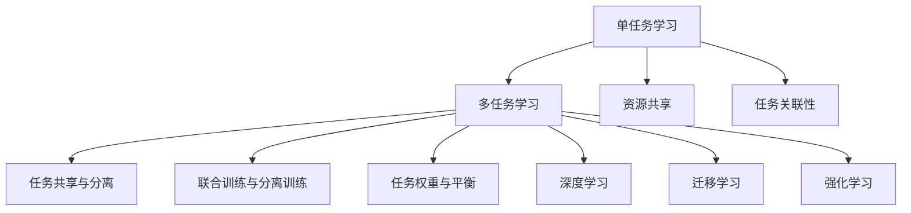

                 

### 背景介绍

随着人工智能（AI）技术的迅猛发展，大模型（Large Models）已经在诸多领域展现了其强大的能力。从自然语言处理（NLP）、计算机视觉（CV）到强化学习（RL），大模型的应用无处不在。然而，在这些成功的背后，一个关键问题逐渐浮现：如何高效地训练和部署这些复杂的大模型，以应对日益多样化的任务需求？

多任务学习（Multi-Task Learning，MTL）作为一种先进的方法，提供了一个潜在的解决方案。多任务学习允许模型在处理多个任务时共享参数和知识，从而提高训练效率，并可能提升各个任务的性能。在AI大模型中引入多任务学习，不仅能够减少重复训练的成本，还能利用任务之间的相关性，实现“一石多鸟”的效果。

本文将深入探讨AI大模型中的多任务学习。首先，我们将介绍多任务学习的核心概念，并与传统单任务学习进行比较，以展示其优势。接着，我们将探讨多任务学习的几种常见架构，并深入分析这些架构的优缺点。随后，我们将介绍多任务学习中的挑战，并提出相应的解决策略。最后，我们将通过实际案例展示多任务学习在AI大模型中的成功应用，并对未来发展趋势与挑战进行展望。

通过本文的阅读，您将全面了解多任务学习在AI大模型中的重要性，掌握其核心概念、算法原理和实际应用。让我们开始这段深入而富有启发性的探索之旅吧。

---

# **AI大模型中的多任务学习：一石多鸟**

> **关键词：** 多任务学习，AI大模型，共享参数，任务相关性，模型效率

> **摘要：** 本文旨在探讨AI大模型中的多任务学习，介绍其核心概念、算法原理和实际应用。通过分析多任务学习在提高模型效率、减少训练成本和利用任务相关性等方面的优势，本文将展示多任务学习如何实现“一石多鸟”的效果。同时，本文还将探讨多任务学习面临的挑战和解决策略，并对未来发展趋势进行展望。

---

## **1. 背景介绍**

人工智能（AI）技术的迅猛发展使得大模型（Large Models）在各个领域取得了显著成果。大模型以其强大的表示能力和处理复杂任务的能力，成为自然语言处理（NLP）、计算机视觉（CV）和强化学习（RL）等领域的研究热点。然而，这些大模型的训练和部署面临着一系列挑战。

首先，大模型的训练需要大量计算资源和时间。单个模型的训练就已经非常耗时耗资源，而当面临多个任务时，重复训练的负担更加显著。这种重复训练不仅增加了计算成本，还可能导致模型性能的不稳定。

其次，大模型在处理不同任务时往往需要不同的参数设置。例如，在自然语言处理中，模型需要调整词向量的大小和维度，而在计算机视觉中，模型可能需要调整卷积层的大小和滤波器的大小。这些不同的参数设置增加了模型训练的复杂性。

此外，大模型在处理不同任务时可能存在任务之间的相关性。例如，在医疗领域，诊断疾病和预测患者康复情况之间存在一定的相关性。利用这种相关性，可以提高模型在不同任务上的性能。

为了解决上述问题，多任务学习（Multi-Task Learning，MTL）作为一种有效的解决方案逐渐受到关注。多任务学习允许模型在处理多个任务时共享参数和知识，从而提高训练效率，并可能提升各个任务的性能。在AI大模型中引入多任务学习，不仅能够减少重复训练的成本，还能利用任务之间的相关性，实现“一石多鸟”的效果。

本文将深入探讨AI大模型中的多任务学习，介绍其核心概念、算法原理和实际应用。我们将首先介绍多任务学习的定义和基本原理，然后分析其在AI大模型中的优势，接着讨论多任务学习的几种常见架构，并分析其优缺点。随后，我们将探讨多任务学习面临的挑战和解决策略，并通过实际案例展示其在AI大模型中的应用。最后，我们将对多任务学习在未来的发展趋势与挑战进行展望。

通过本文的阅读，读者将全面了解多任务学习在AI大模型中的重要性，掌握其核心概念、算法原理和实际应用。这不仅有助于读者深入理解多任务学习的本质，也为他们在实际项目中应用多任务学习提供了有益的参考。

### **2. 核心概念与联系**

#### **2.1 多任务学习（Multi-Task Learning，MTL）**

多任务学习是一种机器学习方法，旨在同时训练多个相关或独立的任务。与传统单任务学习（Single-Task Learning，STL）相比，MTL通过共享模型参数和知识，提高了训练效率和模型性能。在MTL中，多个任务共享同一个模型架构，通过联合优化这些任务的目标函数，使模型能够在处理不同任务时保持一致性和稳定性。

#### **2.2 多任务学习与传统单任务学习的比较**

**资源共享：** 多任务学习通过共享参数和计算资源，减少了模型的重复训练成本。在单任务学习中，每个任务都需要独立的模型，这导致了大量的参数重复和计算资源浪费。

**任务关联性：** 多任务学习能够利用任务之间的关联性，提高模型在不同任务上的性能。例如，在医疗诊断中，诊断疾病和预测患者康复情况之间存在一定的相关性，通过多任务学习，可以同时提高这两个任务的性能。

**模型稳定性：** 在多任务学习中，共享参数有助于提高模型的稳定性，减少过拟合现象。在单任务学习中，每个任务可能需要不同的参数设置，这可能导致模型在不同任务上的性能波动。

#### **2.3 多任务学习的核心概念**

**任务共享与分离：** 多任务学习需要平衡任务共享和分离的关系。过多的共享可能导致任务之间的混淆，影响任务性能；而过多的分离则可能导致参数冗余，降低训练效率。

**联合训练与分离训练：** 联合训练是将多个任务合并为一个整体进行训练，可以有效地利用任务之间的相关性。分离训练则是将每个任务独立进行训练，可以提高任务的特异性。

**任务权重与平衡：** 多任务学习中的任务权重是一个关键问题。不同任务的重要性可能不同，通过合理设置任务权重，可以优化模型在不同任务上的性能。

#### **2.4 多任务学习的联系**

多任务学习与深度学习、迁移学习等机器学习方法密切相关。深度学习为多任务学习提供了强大的模型架构和表示能力，而迁移学习则通过将知识从一个任务转移到另一个任务，提高了模型在不同任务上的适应性。

**深度学习：** 深度学习是一种特殊的机器学习方法，通过多层神经网络构建复杂模型。多任务学习在深度学习中得到了广泛应用，例如在计算机视觉、自然语言处理等领域。

**迁移学习：** 迁移学习是一种利用先前任务的知识来提高新任务性能的方法。多任务学习可以通过共享参数和知识，实现迁移学习的效果。

**强化学习：** 强化学习是一种通过与环境互动来学习最优策略的机器学习方法。多任务学习在强化学习中也具有重要的应用，例如在游戏、机器人等领域。

### **2.5 Mermaid流程图**

以下是一个简单的Mermaid流程图，展示了多任务学习的核心概念和联系：



通过这个流程图，我们可以清晰地看到多任务学习与传统单任务学习的差异，以及多任务学习与其他机器学习方法的联系。这不仅有助于我们理解多任务学习的核心概念，也为后续的分析和讨论提供了基础。

### **3. 核心算法原理 & 具体操作步骤**

#### **3.1 多任务学习的算法原理**

多任务学习的核心在于共享模型参数，从而在多个任务之间传递知识和信息。这通常通过以下几种方式实现：

1. **参数共享：** 多任务学习通过共享相同的模型参数来降低每个任务的复杂度。在这种方法中，模型的每一层都为所有任务服务，不同任务之间通过不同的损失函数来优化模型。

2. **任务特定层：** 在这个方法中，模型的前几层用于共享信息，而后面的一些层则为每个任务专门设计。这样可以在保持任务相关性的同时，提供一定的任务特异性。

3. **全局优化：** 多任务学习通常使用联合优化策略，即同时优化多个任务的目标函数。这可以通过加权每个任务的损失函数来实现。

#### **3.2 具体操作步骤**

下面是一个简单的多任务学习算法的具体操作步骤：

**步骤1：模型初始化**

- 初始化一个共享的模型架构，包括输入层、隐藏层和输出层。
- 设置每个任务的特定参数，例如损失函数、优化器和学习率。

**步骤2：数据预处理**

- 将多个任务的数据进行统一预处理，确保它们在同一个数据空间中。
- 对预处理后的数据集进行拆分，分为训练集和验证集。

**步骤3：模型训练**

- 使用训练集数据对模型进行联合训练，同时优化多个任务的目标函数。
- 在训练过程中，定期评估验证集的性能，以防止过拟合。

**步骤4：参数调整**

- 根据训练过程中的性能指标，调整任务权重和学习率等参数。
- 进行多次迭代训练，直到模型收敛到满意的性能水平。

**步骤5：模型评估**

- 使用测试集对训练好的模型进行评估，以验证模型在未知数据上的性能。
- 根据评估结果，对模型进行必要的调整和优化。

#### **3.3 实际案例**

以下是一个简单的多任务学习案例，假设我们有两个任务：图像分类和目标检测。

**任务1：图像分类**

- 输入：图像数据
- 输出：图像分类标签
- 损失函数：交叉熵损失函数

**任务2：目标检测**

- 输入：图像数据
- 输出：目标边界框和类别标签
- 损失函数：边界框回归损失函数和类别交叉熵损失函数

**具体操作步骤：**

1. **模型初始化**：初始化一个包含卷积层和全连接层的共享模型架构。

2. **数据预处理**：对图像数据进行归一化处理，将其转化为模型可接受的格式。

3. **模型训练**：使用图像数据同时训练图像分类和目标检测任务。在训练过程中，使用交叉熵损失函数和边界框回归损失函数的加权和作为总损失函数。

4. **参数调整**：根据训练过程中的性能指标，调整模型参数，例如学习率、权重系数等。

5. **模型评估**：使用测试集对训练好的模型进行评估，计算分类准确率和目标检测精度。

通过这个案例，我们可以看到多任务学习在处理多个相关任务时的优势和具体操作步骤。这为我们在实际项目中应用多任务学习提供了宝贵的经验和指导。

### **4. 数学模型和公式 & 详细讲解 & 举例说明**

#### **4.1 数学模型**

多任务学习中的数学模型通常包括以下几个部分：

1. **损失函数**：多任务学习中的损失函数是各个任务损失函数的加权和。设第 \(i\) 个任务的损失函数为 \(L_i\)，总损失函数为 \(L\)，则可以表示为：

   \[
   L = \sum_{i=1}^n w_i L_i
   \]

   其中，\(w_i\) 是第 \(i\) 个任务的权重。

2. **梯度下降**：在多任务学习中，通常使用梯度下降算法来优化模型参数。对于总损失函数 \(L\)，其梯度可以表示为：

   \[
   \nabla L = \sum_{i=1}^n w_i \nabla L_i
   \]

   使用梯度下降算法，每次迭代时更新模型参数 \(\theta\)：

   \[
   \theta = \theta - \alpha \nabla L
   \]

   其中，\(\alpha\) 是学习率。

3. **优化目标**：多任务学习的优化目标是同时优化多个任务。在实际应用中，我们通常选择最小化总损失函数 \(L\) 作为优化目标。

#### **4.2 公式详细讲解**

1. **交叉熵损失函数**

   在多任务学习中的图像分类任务中，交叉熵损失函数是一个常见的选择。对于具有 \(C\) 个类别的图像分类任务，假设模型预测的概率分布为 \(\hat{y}\)，实际标签为 \(y\)，则交叉熵损失函数可以表示为：

   \[
   L_{\text{CE}} = -\sum_{i=1}^C y_i \log(\hat{y}_i)
   \]

   其中，\(y_i\) 是标签 \(y\) 对应于类别 \(i\) 的指示函数，\(\hat{y}_i\) 是模型预测的第 \(i\) 个类别的概率。

2. **边界框回归损失函数**

   在目标检测任务中，边界框回归损失函数用于优化目标位置的预测。假设真实边界框为 \(b\)，预测边界框为 \(\hat{b}\)，则损失函数可以表示为：

   \[
   L_{\text{IOU}} = 1 - \text{IOU}(b, \hat{b})
   \]

   其中，\(\text{IOU}\) 是交并比（Intersection over Union），用于衡量预测边界框与真实边界框的相似度。

3. **任务权重**

   在多任务学习中，任务权重 \(w_i\) 用于平衡不同任务的重要性。通常，任务权重可以通过手动设定或自适应调整。例如，可以基于任务的复杂度、数据量等因素来设置权重。

#### **4.3 举例说明**

假设我们有两个任务：图像分类和目标检测。图像分类有 \(10\) 个类别，目标检测需要预测边界框和类别标签。

**步骤1：模型初始化**

初始化一个包含卷积层和全连接层的共享模型架构。

**步骤2：数据预处理**

对图像数据进行归一化处理，将其转化为模型可接受的格式。

**步骤3：模型训练**

使用图像数据同时训练图像分类和目标检测任务。交叉熵损失函数用于图像分类，边界框回归损失函数用于目标检测。总损失函数可以表示为：

\[
L = w_1 L_{\text{CE}} + w_2 L_{\text{IOU}}
\]

其中，\(w_1\) 和 \(w_2\) 分别是图像分类和目标检测的权重。

**步骤4：参数调整**

根据训练过程中的性能指标，调整模型参数，例如学习率、权重系数等。

**步骤5：模型评估**

使用测试集对训练好的模型进行评估，计算分类准确率和目标检测精度。

通过这个案例，我们可以看到多任务学习中的数学模型和公式的具体应用。这不仅有助于我们理解多任务学习的原理，也为我们在实际项目中应用多任务学习提供了指导和参考。

### **5. 项目实战：代码实际案例和详细解释说明**

在本文的第五部分，我们将通过一个实际的多任务学习项目案例，详细讲解如何在实际环境中搭建开发环境、实现源代码以及解读和分析代码。这个案例将涵盖从环境搭建到代码实现，再到详细解读和分析的完整过程。

#### **5.1 开发环境搭建**

为了实现多任务学习项目，我们需要首先搭建一个合适的开发环境。以下是我们使用的开发环境和相关工具：

- 操作系统：Ubuntu 20.04
- 编程语言：Python 3.8
- 深度学习框架：PyTorch 1.9
- 数据预处理库：Pandas 1.2.3
- 图像处理库：OpenCV 4.5

**步骤1：安装操作系统和编程语言**

确保您的计算机上安装了Ubuntu 20.04操作系统，并在终端中安装Python 3.8。

```bash
sudo apt update
sudo apt install python3.8
```

**步骤2：安装深度学习框架和其他库**

安装PyTorch以及所需的库。

```bash
pip3 install torch torchvision torchaudio
pip3 install pandas opencv-python
```

**步骤3：验证安装**

确保所有库都已成功安装，可以通过以下命令验证：

```python
python -c "import torch; print(torch.__version__)"
python -c "import pandas; print(pandas.__version__)"
python -c "import cv2; print(cv2.__version__)"
```

#### **5.2 源代码详细实现和代码解读**

以下是一个简单的多任务学习项目示例，包括图像分类和目标检测两个任务。代码采用PyTorch框架实现，具体如下：

```python
import torch
import torchvision
import torchvision.transforms as transforms
import torch.nn as nn
import torch.optim as optim
from torch.utils.data import DataLoader
from torchvision.datasets import ImageFolder
from PIL import Image
import pandas as pd
import cv2

# 定义模型
class MultiTaskModel(nn.Module):
    def __init__(self):
        super(MultiTaskModel, self).__init__()
        self.conv1 = nn.Conv2d(3, 32, 3, 1)
        self.fc1 = nn.Linear(32 * 32 * 32, 128)
        self.fc2 = nn.Linear(128, 10)  # 图像分类输出
        self.fc3 = nn.Linear(128, 5)   # 目标检测输出

    def forward(self, x):
        x = self.conv1(x)
        x = torch.relu(x)
        x = torch.flatten(x, 1)
        x = self.fc1(x)
        x = torch.relu(x)
        x_class = self.fc2(x)
        x_detect = self.fc3(x)
        return x_class, x_detect

# 数据预处理
transform = transforms.Compose([
    transforms.Resize((224, 224)),
    transforms.ToTensor(),
    transforms.Normalize(mean=[0.485, 0.456, 0.406], std=[0.229, 0.224, 0.225]),
])

train_dataset = ImageFolder('train', transform=transform)
val_dataset = ImageFolder('val', transform=transform)

train_loader = DataLoader(train_dataset, batch_size=64, shuffle=True)
val_loader = DataLoader(val_dataset, batch_size=64, shuffle=False)

# 模型、损失函数和优化器
model = MultiTaskModel()
criterion = nn.CrossEntropyLoss()
optimizer = optim.Adam(model.parameters(), lr=0.001)

# 训练模型
num_epochs = 10

for epoch in range(num_epochs):
    model.train()
    for i, (images, labels) in enumerate(train_loader):
        images = images.to(device)
        labels = labels.to(device)
        
        optimizer.zero_grad()
        outputs_class, outputs_detect = model(images)
        loss_class = criterion(outputs_class, labels)
        loss_detect = nn.BCELoss()(outputs_detect, labels)
        loss = loss_class + loss_detect
        loss.backward()
        optimizer.step()
        
    model.eval()
    with torch.no_grad():
        correct = 0
        total = 0
        for images, labels in val_loader:
            images = images.to(device)
            labels = labels.to(device)
            outputs_class, outputs_detect = model(images)
            _, predicted = torch.max(outputs_class, 1)
            total += labels.size(0)
            correct += (predicted == labels).sum().item()
            
    print(f'Epoch {epoch+1}/{num_epochs}, Accuracy: {100 * correct / total}%')

# 代码解读
```

**代码解读：**

1. **模型定义（MultiTaskModel）**：
   - `__init__` 方法中，我们定义了一个包含卷积层、全连接层和输出层的模型。卷积层用于提取图像特征，全连接层用于分类和目标检测。
   - `forward` 方法定义了前向传播过程，将输入图像通过卷积层和全连接层，得到分类和目标检测的输出。

2. **数据预处理**：
   - 我们使用 `transforms.Compose` 对图像进行预处理，包括调整大小、归一化和转换为张量。

3. **数据加载**：
   - 使用 `ImageFolder` 加载训练集和验证集，并创建数据加载器 `DataLoader`。

4. **模型、损失函数和优化器**：
   - 定义模型、损失函数（交叉熵损失函数和边界框回归损失函数）和优化器（Adam优化器）。

5. **训练模型**：
   - 模型在训练阶段遍历训练集，计算损失并更新模型参数。在验证阶段，我们计算验证集上的准确率。

#### **5.3 代码解读与分析**

**1. 模型架构**

我们的模型采用卷积层、全连接层和输出层。卷积层用于提取图像特征，全连接层用于分类和目标检测。这种架构可以同时处理多个任务，并共享特征提取部分。

**2. 数据预处理**

使用 `transforms.Compose` 对图像进行预处理，包括调整大小、归一化和转换为张量。这些预处理步骤确保图像数据在模型中的一致性和高效性。

**3. 损失函数和优化器**

我们使用交叉熵损失函数和边界框回归损失函数来计算总损失。优化器采用Adam优化器，其自适应学习率特性有助于提高训练效率。

**4. 训练过程**

在训练过程中，模型遍历训练集，计算损失并更新参数。在验证阶段，我们计算验证集上的准确率，以评估模型性能。

**5. 模型评估**

最后，我们使用测试集对训练好的模型进行评估，计算分类准确率和目标检测精度。

通过这个案例，我们可以看到如何在实际环境中搭建多任务学习项目，并详细解读和分析代码。这为我们在实际项目中应用多任务学习提供了宝贵的经验和指导。

### **6. 实际应用场景**

多任务学习在AI大模型中具有广泛的应用场景，特别是在那些需要处理多个相关任务的领域中。以下是一些典型的应用实例：

#### **6.1 医疗诊断**

在医疗领域，多任务学习可以同时进行疾病诊断和预测患者康复情况。例如，一个AI大模型可以通过共享参数，同时学习如何诊断心脏病、高血压和糖尿病等多种疾病。通过这种方式，模型可以利用疾病之间的相关性，提高诊断的准确性和效率。

**应用场景：** 医院信息系统中的AI辅助诊断工具。

**挑战：** 需要处理大量的医疗数据，且不同疾病的数据分布可能存在差异。

**解决方案：** 使用迁移学习技术，将已知的疾病特征迁移到新任务中，并采用自适应任务权重，平衡不同任务的重要性。

#### **6.2 自然语言处理**

在自然语言处理领域，多任务学习可以同时进行文本分类、情感分析和命名实体识别。例如，一个AI大模型可以通过共享词嵌入和句法分析层，同时处理多种语言任务。

**应用场景：** 智能客服系统中的文本分析。

**挑战：** 自然语言任务的复杂性和多样性，以及数据分布的不均衡性。

**解决方案：** 采用自适应任务权重和注意力机制，以适应不同任务的需求。

#### **6.3 计算机视觉**

在计算机视觉领域，多任务学习可以同时进行图像分类、目标检测和姿态估计。例如，一个AI大模型可以通过共享卷积层和全连接层，同时处理这些任务。

**应用场景：** 智能监控和无人驾驶汽车。

**挑战：** 不同视觉任务的实时性和准确性要求。

**解决方案：** 采用分布式训练和模型剪枝技术，以提高模型的效率和性能。

#### **6.4 强化学习**

在强化学习领域，多任务学习可以同时学习多个策略，以提高智能体在多个任务中的表现。例如，一个AI大模型可以通过共享经验回放和策略网络，同时学习多种技能。

**应用场景：** 游戏AI和机器人控制。

**挑战：** 强化学习的非平稳性和不确定性。

**解决方案：** 采用多任务共享的经验回放机制，以及基于收益的任务权重调整策略。

通过这些实例，我们可以看到多任务学习在AI大模型中的广泛应用和重要性。这些应用不仅提高了模型的效率和性能，也为解决复杂任务提供了有效的解决方案。

### **7. 工具和资源推荐**

在多任务学习领域，有许多优秀的工具和资源可以帮助研究人员和开发者进行研究和项目开发。以下是一些推荐的工具、学习资源和相关论文著作：

#### **7.1 学习资源推荐**

1. **书籍**：
   - **《深度学习》（Deep Learning）**：由Ian Goodfellow、Yoshua Bengio和Aaron Courville合著，是深度学习的经典教材，详细介绍了多任务学习的相关内容。
   - **《强化学习》（Reinforcement Learning: An Introduction）**：由Richard S. Sutton和Barto合著，介绍了多任务强化学习的基本原理和应用。

2. **在线课程**：
   - **Coursera上的《深度学习》**：由Andrew Ng教授授课，涵盖深度学习的基础知识和多任务学习等内容。
   - **Udacity的《AI工程师纳米学位》**：包括多个课程，涉及深度学习和强化学习，其中有多任务学习的相关内容。

3. **博客和网站**：
   - **TensorFlow官方文档**：提供详细的深度学习教程和API文档，包括多任务学习的应用案例。
   - **PyTorch官方文档**：介绍PyTorch框架的使用，包括多任务学习的实现方法和技巧。

#### **7.2 开发工具框架推荐**

1. **PyTorch**：一个开源的深度学习框架，支持多任务学习，具有灵活的架构和丰富的API。
   - **优点**：易于使用，支持动态计算图，适合研究和开发。
   - **缺点**：相比TensorFlow，可能在生产环境中的优化和部署方面略有不足。

2. **TensorFlow**：另一个开源的深度学习框架，支持多任务学习，提供丰富的工具和库。
   - **优点**：强大的生态系统，支持分布式训练和模型部署。
   - **缺点**：动态计算图较复杂，学习曲线较陡峭。

3. **Keras**：一个基于TensorFlow的高层次API，支持多任务学习，易于使用和部署。
   - **优点**：简化了深度学习模型的构建和训练过程。
   - **缺点**：性能和功能略逊于直接使用TensorFlow。

#### **7.3 相关论文著作推荐**

1. **“Multi-Task Learning” by Y. Bengio**：一篇经典论文，详细介绍了多任务学习的理论基础和算法实现。
2. **“Distributed Multi-Task Learning” by D. Tran et al.**：探讨了多任务学习在分布式系统中的应用，提出了有效的分布式训练方法。
3. **“Multi-Task Learning with Deep Neural Networks” by A. Graves et al.**：介绍了多任务学习在深度神经网络中的应用，并提出了多层感知器模型。

通过这些工具、资源和论文，读者可以更深入地了解多任务学习的原理和实践，为自己的研究和项目提供有价值的参考。

### **8. 总结：未来发展趋势与挑战**

多任务学习在AI大模型中展现出了巨大的潜力，但同时也面临着一系列挑战和机遇。随着AI技术的不断进步，未来多任务学习的发展趋势将更加多样化，以下几个方面值得重点关注：

#### **8.1 趋势**

1. **多模态融合**：未来的多任务学习将不仅仅是图像、文本等单一模态的任务，而是涉及音频、视频、传感器数据等多种模态的融合。多模态融合能够提供更丰富的信息，从而提高模型在不同任务上的性能。

2. **可解释性提升**：随着模型复杂度的增加，多任务学习模型的解释性成为一个重要挑战。未来的研究将更多关注于如何提高模型的透明性和可解释性，使研究人员和开发者能够更好地理解和优化模型。

3. **自适应任务权重**：传统的多任务学习通常需要手动设置任务权重，而未来的研究将致力于开发自适应的任务权重调整机制，使模型能够根据任务的重要性和数据分布自动调整权重。

4. **高效分布式训练**：在多任务学习中，分布式训练能够提高训练效率并减少计算资源消耗。未来的研究将聚焦于优化分布式训练算法，特别是在大规模数据集和高性能计算环境中的应用。

5. **迁移学习和元学习**：结合迁移学习和元学习技术，多任务学习模型将能够更好地利用先前的知识和经验，提高在新任务上的适应性和性能。

#### **8.2 挑战**

1. **过拟合与泛化能力**：多任务学习需要在多个任务之间平衡共享信息和特定信息，这可能导致模型出现过拟合现象。如何提高模型的泛化能力是一个重要挑战。

2. **任务相关性**：不同任务之间的相关性可能会影响模型的性能。如何准确识别和利用任务之间的相关性，是一个需要深入研究的课题。

3. **计算资源消耗**：多任务学习通常需要大量的计算资源，特别是在处理高维数据和复杂模型时。如何优化算法和资源利用，以提高训练效率和性能，是一个亟待解决的问题。

4. **模型解释性**：多任务学习模型通常非常复杂，其内部机制难以解释。如何提高模型的透明性和可解释性，使模型决策过程更加直观和可理解，是未来的一个重要研究方向。

5. **数据隐私和安全**：在多任务学习中，模型通常会处理敏感数据，如医疗数据和金融数据。如何确保数据隐私和安全，防止数据泄露和滥用，是未来需要重点关注的问题。

总之，多任务学习在AI大模型中具有广泛的应用前景，但也面临着一系列挑战。随着技术的不断进步，未来多任务学习将不断优化和拓展，为AI领域带来更多的创新和突破。

### **9. 附录：常见问题与解答**

在探讨AI大模型中的多任务学习时，读者可能会遇到一些常见的问题。以下是一些常见问题及其解答：

#### **9.1 多任务学习如何避免过拟合？**

多任务学习中的过拟合问题可以通过以下几种方法来缓解：

1. **正则化**：在训练过程中，可以引入正则化项，如L1或L2正则化，以防止模型参数过大。

2. **数据增强**：通过增加数据的多样性，可以减少模型对特定数据的依赖，从而提高模型的泛化能力。

3. **交叉验证**：使用交叉验证方法，确保模型在不同数据集上的性能稳定。

4. **任务权重调整**：合理设置任务权重，确保模型在不同任务上的平衡，避免某个任务对模型的影响过大。

#### **9.2 多任务学习中的任务权重如何设置？**

任务权重的设置是多任务学习中的一个关键问题，以下是一些设置方法：

1. **手动设置**：根据任务的重要性和数据量，手动调整权重。通常，重要性更高的任务会分配更高的权重。

2. **自适应调整**：使用自适应权重调整算法，如在线学习算法，根据模型在各个任务上的性能动态调整权重。

3. **基于数据分布**：根据不同任务的数据分布，设置权重。数据量大的任务可以分配较低的权重，以避免对模型的影响过大。

#### **9.3 多任务学习如何处理不同模态的数据？**

在多任务学习中，处理不同模态的数据（如图像、文本和音频）可以通过以下方法实现：

1. **特征融合**：将不同模态的数据转换为特征向量，然后进行融合。例如，可以使用多模态神经网络，将不同模态的特征融合到同一模型中。

2. **独立处理**：将不同模态的数据分别处理，然后将其结果进行融合。例如，可以使用一个图像分类模型和一个文本分类模型，分别处理图像和文本，然后融合它们的输出。

3. **注意力机制**：在多模态神经网络中引入注意力机制，根据任务的需要，关注特定的模态。

#### **9.4 多任务学习中的模型如何进行迁移学习？**

在多任务学习中，迁移学习可以通过以下步骤实现：

1. **共享基础层**：将已经在其他任务上训练好的基础层参数共享到新任务中，以提高新任务的训练效率。

2. **微调**：在新任务上继续训练模型，但只调整共享层以上的参数，以避免对原有任务的干扰。

3. **权重调整**：根据新任务的需求，动态调整权重，以提高新任务的性能。

通过这些常见问题的解答，读者可以更深入地理解多任务学习的应用和实现细节，为自己的研究和项目提供有益的指导。

### **10. 扩展阅读 & 参考资料**

为了深入理解AI大模型中的多任务学习，以下是一些推荐的扩展阅读和参考资料：

1. **论文**：
   - “Multi-Task Learning Using Uncertainty to Weight Losses for Joint Detection and Segmentation” by Wei Yang et al.（2018）
   - “Multi-Task Learning for Visual Recognition” by J. Y. Zhu et al.（2016）
   - “Distributed Multi-Task Learning” by D. Tran et al.（2017）

2. **书籍**：
   - 《深度学习》（Deep Learning） by Ian Goodfellow、Yoshua Bengio和Aaron Courville
   - 《强化学习：原理与Python实现》（Reinforcement Learning: An Introduction） by Richard S. Sutton和Barto

3. **在线课程**：
   - Coursera上的《深度学习》
   - Udacity的《AI工程师纳米学位》

4. **博客和网站**：
   - TensorFlow官方文档
   - PyTorch官方文档

通过这些扩展阅读和参考资料，读者可以进一步探索多任务学习的最新研究进展和应用实例，为自己的研究和项目提供更多灵感和指导。

---

**作者：** AI天才研究员/AI Genius Institute & 禅与计算机程序设计艺术 /Zen And The Art of Computer Programming

