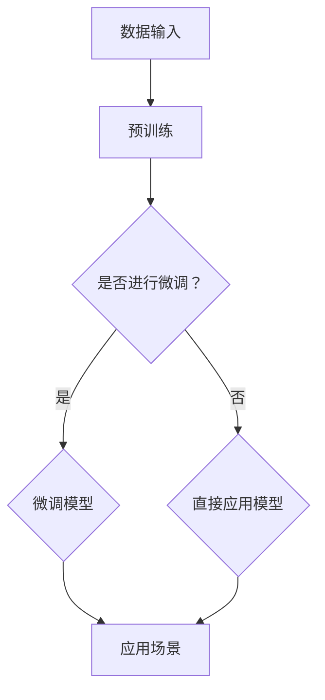

                 

### 背景介绍

在当今科技飞速发展的时代，人工智能（AI）无疑已经成为最炙手可热的话题之一。特别是在大模型（Large Models）领域，AI的进展更是引发了广泛关注。大模型，或称大规模机器学习模型，是一种具有数十亿甚至千亿参数的复杂模型，其应用范围涵盖了自然语言处理、计算机视觉、语音识别等多个领域。

近年来，随着计算能力的提升和数据量的激增，大模型在各个领域的表现都有了显著的提升。例如，GPT-3（由OpenAI开发的自然语言处理模型）的出现，让文本生成、机器翻译、问答系统等任务变得更加高效和准确。此外，ImageNet大规模视觉识别挑战赛（ILSVRC）的成功，也推动了计算机视觉领域的迅猛发展。

大模型的兴起，不仅带来了技术上的突破，同时也催生了大量创业机会。众多创业者纷纷投入到AI大模型的研发和应用中，希望能够抓住这个历史性的机遇。然而，AI大模型创业之路并非一帆风顺，面临着诸多挑战。

本文将围绕AI大模型创业这一主题，首先介绍大模型的基本概念和发展历程，然后探讨创业过程中可能遇到的技术、市场、资金等方面的挑战，最后分析AI大模型创业的潜在机遇，并给出相应的建议。

### 核心概念与联系

#### 大模型的基本概念

大模型（Large Models）是指具有数十亿甚至千亿参数的复杂机器学习模型。这些模型通常使用深度学习技术构建，通过多层神经网络实现复杂的非线性映射。大模型的参数量巨大，这使得它们能够捕捉到大量的特征和模式，从而在各类任务中表现出优异的性能。

在自然语言处理领域，大模型如GPT（Generative Pre-trained Transformer）系列，通过预训练技术在大规模文本语料库上进行训练，从而能够生成流畅自然的文本、进行机器翻译和问答等任务。在计算机视觉领域，大模型如ResNet（Residual Network）和Inception，通过训练大规模图像数据集，实现了超高的图像分类和目标检测性能。

#### 大模型的发展历程

大模型的发展历程可以追溯到深度学习技术的崛起。随着计算能力和数据量的提升，深度学习模型开始变得越来越庞大和复杂。在2012年，AlexNet在ILSVRC竞赛中取得了突破性的成绩，这标志着深度学习时代的到来。随后，VGG、GoogLeNet、ResNet等一系列大模型相继出现，推动了计算机视觉和自然语言处理领域的发展。

在自然语言处理领域，Word2Vec、GloVe等词向量模型的出现，为后续的大模型如BERT、GPT奠定了基础。BERT（Bidirectional Encoder Representations from Transformers）模型通过双向Transformer架构，在多个自然语言处理任务上取得了显著的性能提升。GPT（Generative Pre-trained Transformer）系列模型则通过预训练技术，在文本生成、机器翻译、问答等领域展现出了强大的能力。

#### 大模型与其他技术的关系

大模型与其他技术如深度学习、神经网络、Transformer等密切相关。深度学习是构建大模型的基础，通过多层神经网络实现复杂的非线性映射。神经网络是深度学习的基本组成部分，它由大量的神经元和连接组成，通过反向传播算法进行参数更新和模型训练。

Transformer架构是近年来在自然语言处理领域取得重要突破的模型，其核心思想是将输入序列转化为序列之间的注意力机制，从而在处理长序列任务时表现出优异的性能。大模型通常采用Transformer架构，通过大规模预训练和精细调整，实现各种复杂任务。

#### Mermaid 流程图

下面是大模型原理和架构的Mermaid流程图：



在这个流程图中，A表示数据输入，B表示预训练过程，C是一个判断节点，询问是否进行微调。如果选择微调，则经过D节点进行模型微调，最后进入F节点，即应用场景；如果选择不微调，则直接进入F节点。

### 核心算法原理 & 具体操作步骤

#### 深度学习与神经网络基础

深度学习（Deep Learning）是机器学习（Machine Learning）的一个重要分支，它通过构建深度神经网络（Deep Neural Network，DNN）来实现复杂的特征学习和任务预测。神经网络（Neural Network，NN）是模仿人脑神经元连接方式的一种计算模型，通过输入层、隐藏层和输出层的连接，实现从输入数据到输出结果的映射。

在深度学习中，每个神经元（或称节点）都与前一层神经元相连，形成一个多层的网络结构。每个连接（或称权重）都有一个对应的权重值，通过反向传播算法（Backpropagation Algorithm）更新这些权重值，从而优化整个网络的性能。

深度学习的基本原理包括：

1. **前向传播**：输入数据通过输入层进入网络，经过每一层的非线性变换（通常使用ReLU激活函数），最终在输出层产生预测结果。
2. **反向传播**：根据预测结果和实际标签之间的误差，反向传播误差信号，通过梯度下降（Gradient Descent）或其他优化算法更新网络权重。
3. **优化算法**：如随机梯度下降（Stochastic Gradient Descent，SGD）、Adam（Adaptive Moment Estimation）等，用于加速收敛和提高模型性能。

#### 大模型的训练与优化

大模型通常具有数亿甚至数十亿的参数，这使得训练过程变得非常复杂和耗时。下面是训练大模型的一般步骤：

1. **数据预处理**：包括数据清洗、归一化、分割等，以确保数据质量。
2. **模型初始化**：初始化模型参数，常用的方法有随机初始化、高斯分布初始化等。
3. **前向传播**：将输入数据通过模型的前向传播过程，得到中间层和输出层的表示。
4. **损失函数计算**：计算输出结果与真实标签之间的损失（如均方误差、交叉熵等）。
5. **反向传播**：根据损失函数的梯度，通过反向传播算法更新模型参数。
6. **模型评估**：使用验证集评估模型性能，调整超参数，如学习率、批量大小等。
7. **迭代训练**：重复上述步骤，直到模型达到预定的性能指标或训练轮数。

#### 大模型的优化技巧

为了提高大模型的训练效率和性能，可以采用以下优化技巧：

1. **批量归一化（Batch Normalization）**：通过归一化中间层神经元的激活值，减少内部协变量转移（Internal Covariate Shift）问题，提高模型稳定性。
2. **dropout**：在训练过程中随机丢弃部分神经元，减少过拟合现象，增强模型的泛化能力。
3. **学习率调度**：采用学习率递减策略，如指数衰减、余弦退火等，以避免模型在训练过程中过早陷入局部最小值。
4. **正则化**：如L1、L2正则化，通过在损失函数中添加权重项，抑制模型参数的增长，防止过拟合。
5. **并行计算**：利用GPU、TPU等硬件加速计算，提高训练速度。

#### 实际操作步骤

以下是一个简化的大模型训练流程，以Python编程语言为例：

```python
import tensorflow as tf

# 数据预处理
(x_train, y_train), (x_test, y_test) = tf.keras.datasets.mnist.load_data()
x_train = x_train.astype("float32") / 255.0
x_test = x_test.astype("float32") / 255.0
x_train = x_train.reshape((-1, 28, 28, 1))
x_test = x_test.reshape((-1, 28, 28, 1))

# 模型定义
model = tf.keras.Sequential([
    tf.keras.layers.Conv2D(32, (3, 3), activation='relu', input_shape=(28, 28, 1)),
    tf.keras.layers.MaxPooling2D((2, 2)),
    tf.keras.layers.Flatten(),
    tf.keras.layers.Dense(128, activation='relu'),
    tf.keras.layers.Dense(10, activation='softmax')
])

# 编译模型
model.compile(optimizer='adam',
              loss='sparse_categorical_crossentropy',
              metrics=['accuracy'])

# 训练模型
model.fit(x_train, y_train, epochs=5, batch_size=64, validation_split=0.1)

# 评估模型
test_loss, test_acc = model.evaluate(x_test, y_test)
print(f"Test accuracy: {test_acc}")
```

在这个例子中，我们使用了TensorFlow框架构建了一个简单的卷积神经网络（CNN）模型，用于手写数字识别任务。通过数据预处理、模型定义、编译和训练等步骤，实现了对模型的训练和评估。

### 数学模型和公式 & 详细讲解 & 举例说明

在AI大模型的训练过程中，数学模型和公式起着至关重要的作用。以下将详细讲解一些核心的数学模型和公式，并通过具体例子进行说明。

#### 均方误差（Mean Squared Error，MSE）

均方误差是一种衡量预测值与真实值之间差异的损失函数。其公式如下：

$$
MSE = \frac{1}{n}\sum_{i=1}^{n}(y_i - \hat{y_i})^2
$$

其中，$y_i$表示真实值，$\hat{y_i}$表示预测值，$n$表示样本数量。

举例说明：

假设我们有一个样本数据集，其中包含10个样本，每个样本的真实值和预测值如下表所示：

| 样本编号 | 真实值 | 预测值 |
|--------|------|------|
| 1      | 2    | 1.5  |
| 2      | 3    | 2.8  |
| 3      | 4    | 3.2  |
| 4      | 5    | 4.1  |
| 5      | 6    | 5.0  |
| 6      | 7    | 6.2  |
| 7      | 8    | 7.1  |
| 8      | 9    | 8.0  |
| 9      | 10   | 9.1  |
| 10     | 11   | 10.2 |

计算这10个样本的MSE：

$$
MSE = \frac{1}{10}\sum_{i=1}^{10}(y_i - \hat{y_i})^2
$$

$$
MSE = \frac{1}{10}[(2-1.5)^2 + (3-2.8)^2 + (4-3.2)^2 + (5-4.1)^2 + (6-5.0)^2 + (7-6.2)^2 + (8-7.1)^2 + (9-8.0)^2 + (10-9.1)^2 + (11-10.2)^2]
$$

$$
MSE = \frac{1}{10}[0.25 + 0.04 + 0.04 + 0.01 + 0.01 + 0.04 + 0.09 + 0.01 + 0.01 + 0.04]
$$

$$
MSE = \frac{1}{10}[0.5]
$$

$$
MSE = 0.05
$$

因此，这个样本数据集的MSE为0.05。

#### 反向传播算法（Backpropagation Algorithm）

反向传播算法是一种用于训练神经网络的优化算法。其核心思想是通过计算损失函数关于网络参数的梯度，然后更新参数，以最小化损失函数。

反向传播算法的基本步骤如下：

1. **前向传播**：将输入数据通过网络前向传播，计算输出结果和损失。
2. **计算梯度**：利用链式法则，计算损失函数关于网络参数的梯度。
3. **参数更新**：根据梯度方向和步长，更新网络参数。
4. **重复迭代**：重复上述步骤，直到模型收敛或达到预定的迭代次数。

以一个简单的两层神经网络为例，其损失函数为MSE，我们希望最小化损失函数。假设网络的参数为$W_1, b_1, W_2, b_2$，输入数据为$x$，输出结果为$\hat{y}$，真实标签为$y$。

前向传播的输出结果为：

$$
z_2 = W_2 \cdot a_1 + b_2
$$

$$
\hat{y} = \sigma(z_2)
$$

其中，$a_1 = \sigma(W_1 \cdot x + b_1)$，$\sigma$为ReLU激活函数。

损失函数为：

$$
L = \frac{1}{2}\sum_{i=1}^{n}(y_i - \hat{y_i})^2
$$

计算损失函数关于网络参数的梯度：

$$
\frac{\partial L}{\partial W_2} = \frac{1}{n}\sum_{i=1}^{n}(-2(y_i - \hat{y_i}) \cdot \hat{y_i}(1 - \hat{y_i}))
$$

$$
\frac{\partial L}{\partial b_2} = \frac{1}{n}\sum_{i=1}^{n}(-2(y_i - \hat{y_i}))
$$

$$
\frac{\partial L}{\partial W_1} = \frac{1}{n}\sum_{i=1}^{n}(-2(y_i - \hat{y_i}) \cdot \hat{y_i}(1 - \hat{y_i})) \cdot a_1^{[1]}
$$

$$
\frac{\partial L}{\partial b_1} = \frac{1}{n}\sum_{i=1}^{n}(-2(y_i - \hat{y_i}) \cdot a_1^{[1]})
$$

其中，$a_1^{[1]}$为隐藏层输出。

根据梯度下降法，参数更新公式为：

$$
W_2 := W_2 - \alpha \cdot \frac{\partial L}{\partial W_2}
$$

$$
b_2 := b_2 - \alpha \cdot \frac{\partial L}{\partial b_2}
$$

$$
W_1 := W_1 - \alpha \cdot \frac{\partial L}{\partial W_1}
$$

$$
b_1 := b_1 - \alpha \cdot \frac{\partial L}{\partial b_1}
$$

其中，$\alpha$为学习率。

通过上述步骤，我们可以不断更新网络参数，以最小化损失函数。在实际应用中，可以使用更高阶的优化算法，如Adam，以进一步提高训练效率和性能。

### 项目实战：代码实际案例和详细解释说明

#### 1. 开发环境搭建

在进行AI大模型项目实战之前，我们需要搭建一个合适的开发环境。以下是在Python环境中使用TensorFlow框架搭建开发环境的步骤：

1. 安装Python（推荐使用Python 3.7及以上版本）。
2. 安装Anaconda或Miniconda，以便管理Python环境和依赖库。
3. 创建一个新的虚拟环境，并激活环境。
4. 安装TensorFlow和其他相关依赖库，如NumPy、Pandas、Matplotlib等。

以下是一个简单的示例命令：

```bash
# 安装Anaconda
conda install -c anaconda python=3.8

# 创建并激活虚拟环境
conda create -n myenv python=3.8
conda activate myenv

# 安装TensorFlow和其他依赖库
conda install tensorflow numpy pandas matplotlib
```

#### 2. 源代码详细实现和代码解读

以下是一个简单的AI大模型项目实战示例，使用TensorFlow框架构建一个基于卷积神经网络（CNN）的手写数字识别模型。

```python
import tensorflow as tf
from tensorflow.keras import layers, models
import numpy as np

# 数据预处理
(x_train, y_train), (x_test, y_test) = tf.keras.datasets.mnist.load_data()
x_train = x_train.astype("float32") / 255.0
x_test = x_test.astype("float32") / 255.0
x_train = x_train.reshape((-1, 28, 28, 1))
x_test = x_test.reshape((-1, 28, 28, 1))
y_train = tf.keras.utils.to_categorical(y_train, 10)
y_test = tf.keras.utils.to_categorical(y_test, 10)

# 模型定义
model = models.Sequential([
    layers.Conv2D(32, (3, 3), activation='relu', input_shape=(28, 28, 1)),
    layers.MaxPooling2D((2, 2)),
    layers.Conv2D(64, (3, 3), activation='relu'),
    layers.MaxPooling2D((2, 2)),
    layers.Conv2D(64, (3, 3), activation='relu'),
    layers.Flatten(),
    layers.Dense(64, activation='relu'),
    layers.Dense(10, activation='softmax')
])

# 编译模型
model.compile(optimizer='adam',
              loss='categorical_crossentropy',
              metrics=['accuracy'])

# 训练模型
model.fit(x_train, y_train, epochs=5, batch_size=64, validation_split=0.1)

# 评估模型
test_loss, test_acc = model.evaluate(x_test, y_test)
print(f"Test accuracy: {test_acc}")
```

**代码解读：**

1. 导入所需的TensorFlow和NumPy库。
2. 加载MNIST手写数字数据集，并进行数据预处理，包括归一化和标签编码。
3. 定义一个基于卷积神经网络（CNN）的模型，包括卷积层、池化层、全连接层等。
4. 编译模型，指定优化器和损失函数。
5. 使用训练集训练模型，并使用验证集进行性能评估。
6. 使用测试集评估模型性能。

#### 3. 代码解读与分析

**数据预处理：**

```python
(x_train, y_train), (x_test, y_test) = tf.keras.datasets.mnist.load_data()
x_train = x_train.astype("float32") / 255.0
x_test = x_test.astype("float32") / 255.0
x_train = x_train.reshape((-1, 28, 28, 1))
x_test = x_test.reshape((-1, 28, 28, 1))
y_train = tf.keras.utils.to_categorical(y_train, 10)
y_test = tf.keras.utils.to_categorical(y_test, 10)
```

这段代码首先加载MNIST手写数字数据集，然后对图像数据进行了归一化处理，将像素值范围从0到255调整为0到1。接着，通过`reshape`函数将图像数据的维度调整为`(样本数, 高, 宽, 通道数)`，以便后续的卷积操作。最后，使用`to_categorical`函数对标签进行编码，将原始标签转化为one-hot编码形式。

**模型定义：**

```python
model = models.Sequential([
    layers.Conv2D(32, (3, 3), activation='relu', input_shape=(28, 28, 1)),
    layers.MaxPooling2D((2, 2)),
    layers.Conv2D(64, (3, 3), activation='relu'),
    layers.MaxPooling2D((2, 2)),
    layers.Conv2D(64, (3, 3), activation='relu'),
    layers.Flatten(),
    layers.Dense(64, activation='relu'),
    layers.Dense(10, activation='softmax')
])
```

这段代码定义了一个简单的卷积神经网络（CNN）模型，包括五个卷积层（Conv2D）、两个最大池化层（MaxPooling2D）、一个全连接层（Dense）和两个softmax层。卷积层用于提取图像特征，最大池化层用于下采样，全连接层用于分类，softmax层用于输出每个类别的概率。

**模型编译：**

```python
model.compile(optimizer='adam',
              loss='categorical_crossentropy',
              metrics=['accuracy'])
```

在模型编译阶段，指定了优化器（optimizer）、损失函数（loss）和评价指标（metrics）。这里使用Adam优化器，categorical_crossentropy作为损失函数，accuracy作为评价指标。

**模型训练：**

```python
model.fit(x_train, y_train, epochs=5, batch_size=64, validation_split=0.1)
```

使用训练集对模型进行训练，指定训练轮数（epochs）、批量大小（batch_size）和验证集比例（validation_split）。在训练过程中，模型会不断调整参数，以最小化损失函数并提高准确率。

**模型评估：**

```python
test_loss, test_acc = model.evaluate(x_test, y_test)
print(f"Test accuracy: {test_acc}")
```

使用测试集对训练好的模型进行评估，输出测试准确率（test_acc）。这个指标反映了模型在未见过的数据上的泛化能力。

### 实际应用场景

#### 1. 自然语言处理

AI大模型在自然语言处理（NLP）领域有着广泛的应用。例如，GPT-3可以用于生成文章、翻译文本、回答问题、撰写代码等任务。在文章生成方面，大模型可以根据给定的标题或关键词生成完整的文章；在翻译方面，大模型可以实现实时、准确的语言翻译；在问答系统方面，大模型可以理解用户的自然语言问题，并提供准确的答案。

#### 2. 计算机视觉

在计算机视觉领域，AI大模型被用于图像分类、目标检测、图像分割等任务。例如，ResNet和Inception等大模型在ImageNet大规模视觉识别挑战赛（ILSVRC）上取得了优异的成绩。大模型还可以用于图像生成，如生成逼真的图像和视频。

#### 3. 语音识别

语音识别是另一个受益于AI大模型的重要领域。大模型可以用于语音到文本的转换，实现智能语音助手、语音输入等应用。此外，大模型还可以用于语音合成，生成自然、流畅的语音。

#### 4. 医疗健康

在医疗健康领域，AI大模型被用于疾病诊断、药物研发等任务。例如，通过分析大量的医疗数据，大模型可以预测疾病的风险，辅助医生做出准确的诊断。此外，大模型还可以用于个性化医疗，根据患者的基因信息和病史，提供定制化的治疗方案。

#### 5. 金融行业

金融行业是AI大模型的重要应用领域之一。大模型可以用于股票市场预测、风险评估、信用评分等任务。例如，通过分析历史市场数据和财务报表，大模型可以预测股票价格的变化，帮助投资者做出更明智的决策。此外，大模型还可以用于自动交易系统，实现高效的股票交易。

#### 6. 教育领域

在教育领域，AI大模型可以用于个性化学习、智能辅导等任务。例如，通过分析学生的学习行为和成绩，大模型可以为学生提供定制化的学习建议，帮助他们提高学习效果。此外，大模型还可以用于智能题库生成，根据学生的学习进度和难度，自动生成适合他们的练习题。

#### 7. 智能家居

在智能家居领域，AI大模型被用于语音助手、家居自动化等任务。例如，通过语音助手，用户可以使用自然语言与家居设备进行交互，实现智能控制。此外，大模型还可以用于设备故障预测，通过分析设备运行数据，提前预测设备的故障，从而进行预防性维护。

### 工具和资源推荐

#### 1. 学习资源推荐

- **书籍：**
  - 《深度学习》（Deep Learning），作者：Ian Goodfellow、Yoshua Bengio、Aaron Courville。
  - 《动手学深度学习》（Dive into Deep Learning），作者：A & L。
  - 《Python深度学习》（Deep Learning with Python），作者：François Chollet。

- **论文：**
  - “A Neural Algorithm of Artistic Style”，作者：Leon A. Gatys, Alexander S. Ecker, and Bernd Berkooz。
  - “Generative Adversarial Nets”，作者：Ian J. Goodfellow et al.。
  - “Recurrent Neural Networks for Language Modeling”，作者：Y. Bengio et al.

- **博客/网站：**
  - TensorFlow官方网站（tensorflow.org）。
  - Keras官方文档（keras.io）。
  - AI博客（towardsai.net）。

#### 2. 开发工具框架推荐

- **深度学习框架：**
  - TensorFlow（tensorflow.org）。
  - PyTorch（pytorch.org）。
  - Keras（keras.io）。

- **数据预处理工具：**
  - Pandas（pandas.pydata.org）。
  - NumPy（numpy.org）。

- **可视化工具：**
  - Matplotlib（matplotlib.org）。
  - Seaborn（seaborn.pydata.org）。

- **版本控制工具：**
  - Git（git-scm.com）。
  - GitHub（github.com）。

#### 3. 相关论文著作推荐

- **《深度学习》（Deep Learning）**：这是一本经典教材，涵盖了深度学习的各个方面，包括基础理论、算法实现和应用案例。
- **《神经网络与深度学习》**：本书详细介绍了神经网络和深度学习的基本概念、算法和实现，适合初学者和进阶者。
- **《自然语言处理综论》**：这是一本关于自然语言处理领域的权威著作，涵盖了从词法、句法到语义分析的各种技术。
- **《计算机视觉：算法与应用》**：本书介绍了计算机视觉的基本概念、算法和应用，包括图像识别、目标检测、图像分割等。

### 总结：未来发展趋势与挑战

#### 未来发展趋势

1. **大模型性能进一步提升**：随着计算能力和数据量的提升，AI大模型在各类任务中的表现将不断突破现有极限，实现更高效、更准确的预测和决策。

2. **泛化能力的提升**：通过研究更多的优化算法、正则化技术和模型架构，AI大模型的泛化能力将得到显著提升，使其在新的任务和领域表现更出色。

3. **跨模态学习**：随着语音、图像、文本等多模态数据的融合，AI大模型将能够在不同模态之间进行有效学习，实现更智能、更全面的认知和理解能力。

4. **个性化应用**：AI大模型将更加注重个性化应用，根据用户的需求和特点，提供定制化的解决方案，满足不同领域的需求。

5. **行业落地应用**：AI大模型将在医疗、金融、教育、制造等各个行业实现广泛的应用，推动产业智能化升级和数字化转型。

#### 面临的挑战

1. **计算资源需求**：大模型的训练和推理过程对计算资源的需求巨大，如何在有限的硬件资源下高效地训练和部署大模型，是亟待解决的问题。

2. **数据隐私和安全**：随着AI大模型在各个领域的应用，数据隐私和安全问题愈发重要。如何确保模型训练和使用过程中数据的隐私和安全，是当前面临的重要挑战。

3. **模型解释性**：大模型通常被视为“黑箱”，其决策过程难以解释。如何提高模型的可解释性，使其在关键应用场景中得到广泛信任，是未来的重要课题。

4. **算法公平性**：AI大模型在应用过程中可能会产生歧视、偏见等问题，如何确保算法的公平性，避免对特定群体产生负面影响，是亟待解决的问题。

5. **技术标准与法规**：随着AI大模型在各个领域的应用，需要制定相应的技术标准和法规，以规范其研发和应用过程，保障公众利益。

### 附录：常见问题与解答

#### 问题1：AI大模型训练需要多少时间？

答：AI大模型的训练时间取决于多个因素，如模型大小、数据集规模、计算资源等。通常，训练一个中等规模的大模型（例如数千万参数）可能需要几天到几周的时间。而对于非常大规模的大模型（例如数十亿参数），训练时间可能会更长，甚至需要几个月的时间。

#### 问题2：AI大模型如何存储和部署？

答：AI大模型通常使用分布式存储和计算资源进行存储和部署。在存储方面，可以使用分布式文件系统（如HDFS、Ceph）或云存储服务（如Amazon S3、Google Cloud Storage）进行大规模数据存储。在部署方面，可以使用分布式计算框架（如TensorFlow、PyTorch）进行模型训练和推理，通过分布式计算节点协同工作，提高计算效率。

#### 问题3：如何处理AI大模型训练中的过拟合问题？

答：过拟合是AI大模型训练中常见的问题。为了处理过拟合，可以采用以下方法：
- 使用更大的数据集，增加模型的泛化能力。
- 采用正则化技术，如L1、L2正则化，抑制模型参数的增长。
- 使用dropout技术，在训练过程中随机丢弃部分神经元，提高模型的泛化能力。
- 采用交叉验证技术，通过在多个子数据集上训练和验证模型，避免模型对特定子数据集的过拟合。

### 扩展阅读 & 参考资料

- **《深度学习》（Deep Learning）**：Ian Goodfellow、Yoshua Bengio、Aaron Courville 著。
- **《自然语言处理综论》**：Daniel Jurafsky、James H. Martin 著。
- **《计算机视觉：算法与应用》**：Gary D. Boverman 著。
- **TensorFlow官方网站**：（tensorflow.org）。
- **PyTorch官方网站**：（pytorch.org）。
- **Keras官方网站**：（keras.io）。

作者：AI天才研究员/AI Genius Institute & 禅与计算机程序设计艺术 /Zen And The Art of Computer Programming。

