                 

# AI大模型创业战：挑战与机遇并存的现状、趋势、未来与展望

## 关键词：AI 大模型，创业，挑战，机遇，现状，趋势，未来，展望

### 摘要

本文旨在深入探讨人工智能大模型在创业领域中的现状、趋势、未来展望以及面临的挑战。通过分析大模型技术的发展历程、核心原理和应用场景，本文揭示了其商业价值和社会影响。同时，本文也对创业者提供了具体的指导和建议，帮助他们在这一新兴领域中抓住机遇、应对挑战。

## 1. 背景介绍

人工智能（AI）技术近年来取得了飞速发展，其中大模型技术尤为引人注目。大模型技术是指使用深度学习神经网络处理海量数据，从而实现对复杂问题的建模和预测。自2012年AlexNet的突破以来，AI大模型在图像识别、自然语言处理、语音识别等领域取得了显著进展。

在创业领域，AI大模型的应用前景广阔。随着技术的成熟和成本的降低，越来越多的创业者开始将大模型技术应用于各类业务场景，如智能客服、智能推荐、智能医疗等。然而，AI大模型创业也面临着诸多挑战，如数据隐私、算法公平性、技术门槛等。

### Background Introduction

Artificial Intelligence (AI) technology has experienced rapid growth in recent years, with large-scale model technology standing out. Large-scale model technology involves using deep learning neural networks to process massive amounts of data, enabling modeling and predicting complex problems. Since the breakthrough of AlexNet in 2012, AI large-scale models have made significant progress in fields such as image recognition, natural language processing, and speech recognition.

In the startup ecosystem, large-scale model technology holds vast potential. With the maturity of technology and the reduction in costs, an increasing number of entrepreneurs are applying large-scale model technology to various business scenarios, such as intelligent customer service, intelligent recommendation, and intelligent healthcare. However, large-scale model startups also face numerous challenges, including data privacy, algorithm fairness, and technical barriers.

## 2. 核心概念与联系

### Core Concepts and Connections

在探讨AI大模型创业之前，我们首先需要了解大模型技术的基本原理和架构。以下是关键概念和它们之间的联系：

#### 2.1 深度学习神经网络（Deep Learning Neural Networks）

深度学习神经网络是AI大模型的核心组成部分。它由多个层次（layers）的神经元（neurons）组成，通过学习大量数据来提取特征和模式。以下是深度学习神经网络的Mermaid流程图：

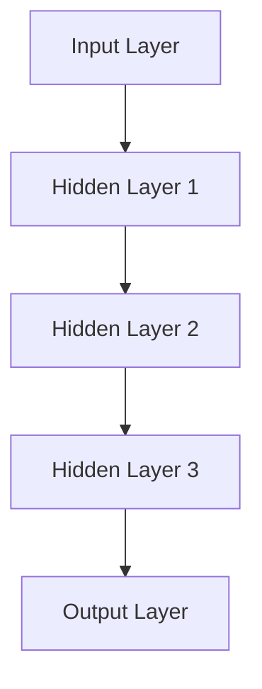

#### 2.2 数据集（Dataset）

数据集是训练AI大模型的基础。一个高质量的数据集需要包含丰富的多样性和代表性。以下是数据集的收集、预处理和标注的Mermaid流程图：

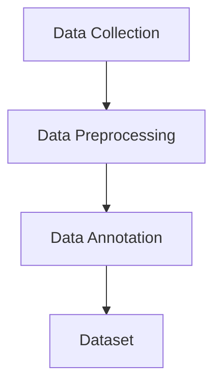

#### 2.3 训练过程（Training Process）

训练过程是AI大模型构建的关键步骤。通过反向传播算法（Backpropagation Algorithm）和优化算法（Optimization Algorithms），模型可以不断调整参数，提高预测准确性。以下是训练过程的Mermaid流程图：

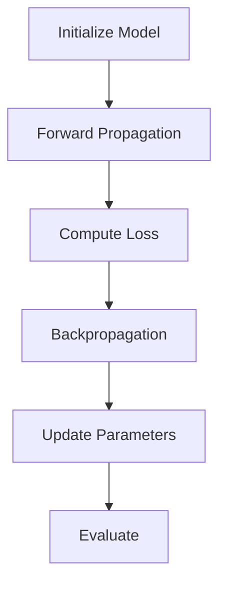

#### 2.4 应用场景（Application Scenarios）

AI大模型在多个领域都有广泛应用，如图像识别、自然语言处理和语音识别等。以下是这些应用场景的Mermaid流程图：

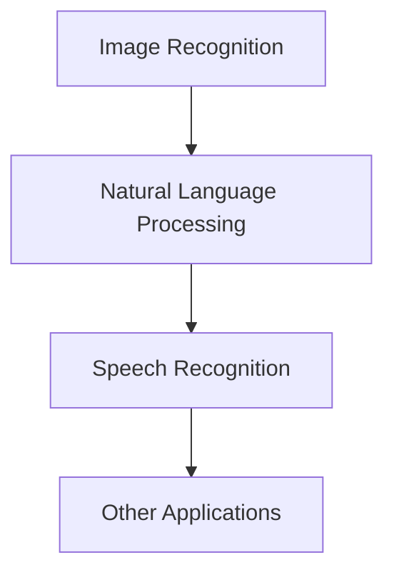

## 3. 核心算法原理 & 具体操作步骤

### Core Algorithm Principles & Specific Operational Steps

#### 3.1 卷积神经网络（Convolutional Neural Networks，CNN）

卷积神经网络是图像识别领域的主流算法。以下是CNN的核心原理和具体操作步骤：

##### 3.1.1 卷积操作（Convolution Operation）

卷积操作是CNN的基础。它通过滑动窗口（filter）在输入图像上提取特征。以下是卷积操作的Mermaid流程图：

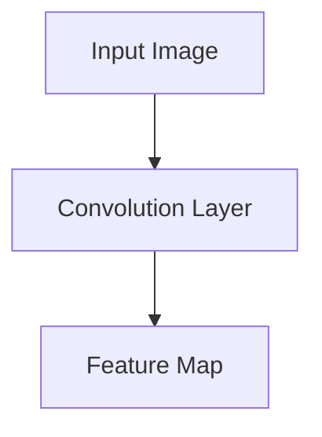

##### 3.1.2 池化操作（Pooling Operation）

池化操作用于降低特征图的大小，提高计算效率。以下是池化操作的Mermaid流程图：

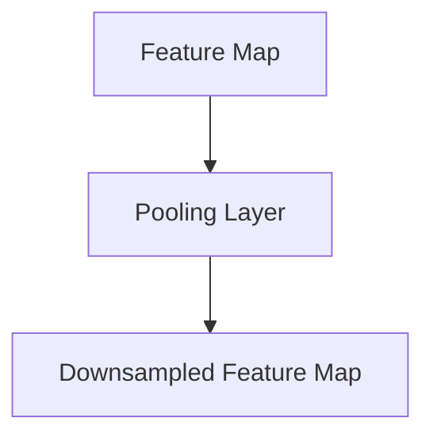

##### 3.1.3 全连接层（Fully Connected Layer）

全连接层将特征图映射到输出结果。以下是全连接层的Mermaid流程图：

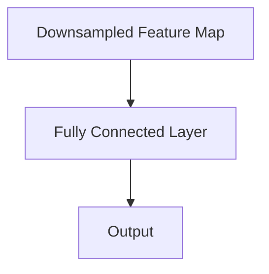

#### 3.2 递归神经网络（Recurrent Neural Networks，RNN）

递归神经网络是自然语言处理领域的核心算法。以下是RNN的核心原理和具体操作步骤：

##### 3.2.1 单个时间步（Single Time Step）

在单个时间步，RNN将当前输入与上一个时间步的隐藏状态相融合，生成新的隐藏状态。以下是单个时间步的Mermaid流程图：

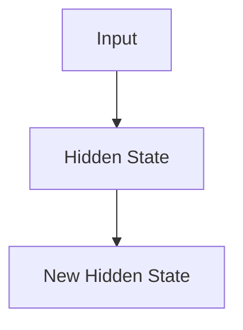

##### 3.2.2 递归过程（Recursive Process）

递归过程是RNN的核心。它通过不断更新隐藏状态，实现对序列数据的建模。以下是递归过程的Mermaid流程图：

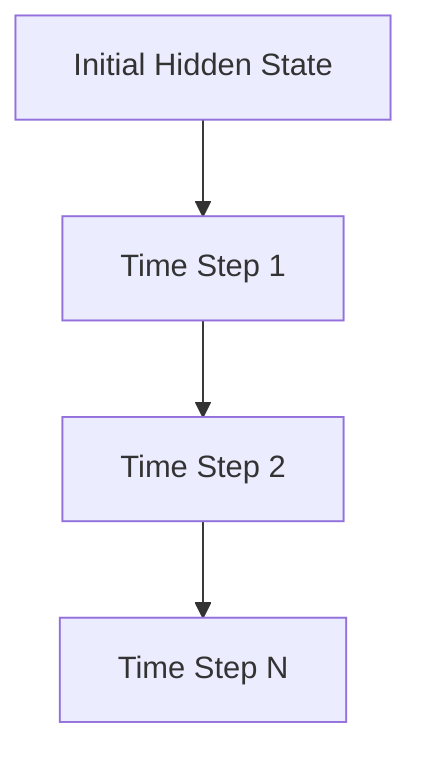

#### 3.3 生成对抗网络（Generative Adversarial Networks，GAN）

生成对抗网络是图像生成领域的重要算法。以下是GAN的核心原理和具体操作步骤：

##### 3.3.1 生成器（Generator）

生成器通过学习真实数据的分布，生成虚假数据。以下是生成器的Mermaid流程图：

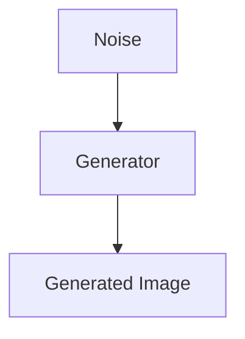

##### 3.3.2 判别器（Discriminator）

判别器用于判断生成器生成的数据是否真实。以下是判别器的Mermaid流程图：

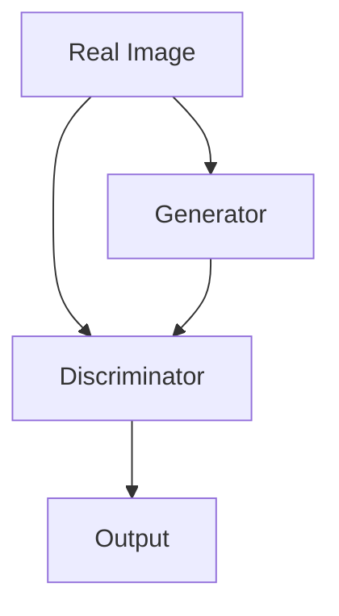

##### 3.3.3 对抗训练（Adversarial Training）

对抗训练是GAN的核心步骤。通过不断优化生成器和判别器的参数，使得生成器的生成数据越来越真实。以下是对抗训练的Mermaid流程图：

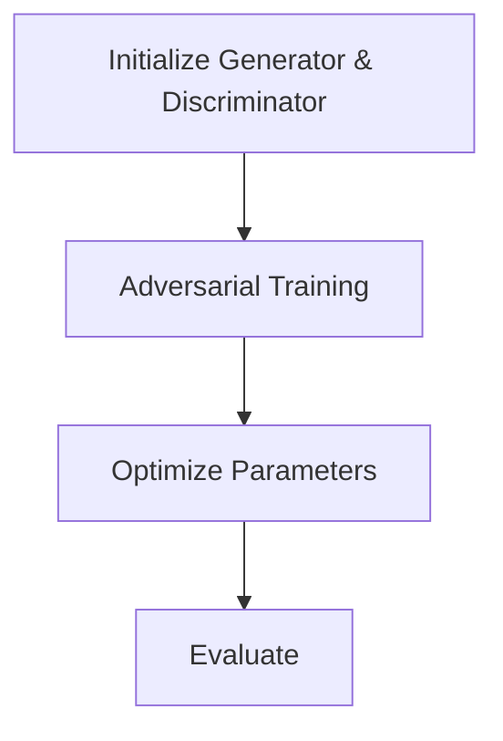

## 4. 数学模型和公式 & 详细讲解 & 举例说明

### Mathematical Models and Formulas & Detailed Explanations & Example Demonstrations

#### 4.1 卷积神经网络（Convolutional Neural Networks，CNN）

卷积神经网络的核心是卷积操作和激活函数。以下是CNN的数学模型和公式：

##### 4.1.1 卷积操作（Convolution Operation）

卷积操作的公式如下：

$$
\text{output}_{ij} = \sum_{k=1}^{K} w_{ik,jk} \cdot \text{input}_{ij}
$$

其中，$\text{output}_{ij}$是输出特征图上的一个元素，$w_{ik,jk}$是卷积核上的一个元素，$\text{input}_{ij}$是输入特征图上的一个元素，$K$是卷积核的大小。

举例说明：

假设输入特征图的大小为$3 \times 3$，卷积核的大小为$3 \times 3$，那么输出特征图的大小为$2 \times 2$。卷积操作的实现如下：

$$
\begin{align*}
\text{output}_{11} &= w_{11,11} \cdot \text{input}_{11} + w_{11,12} \cdot \text{input}_{12} + w_{11,13} \cdot \text{input}_{13} + w_{12,11} \cdot \text{input}_{21} + w_{12,12} \cdot \text{input}_{22} + w_{12,13} \cdot \text{input}_{23} + w_{13,11} \cdot \text{input}_{31} + w_{13,12} \cdot \text{input}_{32} + w_{13,13} \cdot \text{input}_{33} \\
\text{output}_{12} &= w_{11,21} \cdot \text{input}_{11} + w_{11,22} \cdot \text{input}_{12} + w_{11,23} \cdot \text{input}_{13} + w_{12,21} \cdot \text{input}_{21} + w_{12,22} \cdot \text{input}_{22} + w_{12,23} \cdot \text{input}_{23} + w_{13,21} \cdot \text{input}_{31} + w_{13,22} \cdot \text{input}_{32} + w_{13,23} \cdot \text{input}_{33} \\
\text{output}_{21} &= w_{11,31} \cdot \text{input}_{11} + w_{11,32} \cdot \text{input}_{12} + w_{11,33} \cdot \text{input}_{13} + w_{12,31} \cdot \text{input}_{21} + w_{12,32} \cdot \text{input}_{22} + w_{12,33} \cdot \text{input}_{23} + w_{13,31} \cdot \text{input}_{31} + w_{13,32} \cdot \text{input}_{32} + w_{13,33} \cdot \text{input}_{33} \\
\text{output}_{22} &= w_{11,41} \cdot \text{input}_{11} + w_{11,42} \cdot \text{input}_{12} + w_{11,43} \cdot \text{input}_{13} + w_{12,41} \cdot \text{input}_{21} + w_{12,42} \cdot \text{input}_{22} + w_{12,43} \cdot \text{input}_{23} + w_{13,41} \cdot \text{input}_{31} + w_{13,42} \cdot \text{input}_{32} + w_{13,43} \cdot \text{input}_{33}
\end{align*}
$$

##### 4.1.2 激活函数（Activation Function）

激活函数用于引入非线性因素，使CNN能够学习复杂的特征。常见的激活函数有ReLU（Rectified Linear Unit）、Sigmoid和Tanh等。以下是ReLU激活函数的公式：

$$
\text{ReLU}(x) = \max(0, x)
$$

举例说明：

对于输入$x = -2$，ReLU激活函数的输出为：

$$
\text{ReLU}(-2) = \max(0, -2) = 0
$$

#### 4.2 递归神经网络（Recurrent Neural Networks，RNN）

递归神经网络的核心是递归函数和激活函数。以下是RNN的数学模型和公式：

##### 4.2.1 递归函数（Recursive Function）

递归函数的公式如下：

$$
h_t = \sigma(W_h \cdot [h_{t-1}, x_t] + b_h)
$$

其中，$h_t$是当前时间步的隐藏状态，$h_{t-1}$是上一个时间步的隐藏状态，$x_t$是当前时间步的输入，$W_h$是隐藏状态权重矩阵，$b_h$是隐藏状态偏置，$\sigma$是激活函数。

举例说明：

假设激活函数为ReLU，隐藏状态权重矩阵$W_h$为：

$$
W_h = \begin{bmatrix}
1 & 0 \\
0 & 1
\end{bmatrix}
$$

隐藏状态偏置$b_h$为：

$$
b_h = \begin{bmatrix}
0 \\
0
\end{bmatrix}
$$

对于输入序列$x_t = [1, 2, 3]$，递归函数的计算过程如下：

$$
\begin{align*}
h_0 &= \text{ReLU}(W_h \cdot [h_{-1}, x_0] + b_h) = \text{ReLU}(\begin{bmatrix}
1 & 0 \\
0 & 1
\end{bmatrix} \cdot \begin{bmatrix}
h_{-1} \\
x_0
\end{bmatrix} + \begin{bmatrix}
0 \\
0
\end{bmatrix}) = \text{ReLU}(\begin{bmatrix}
h_{-1} \\
x_0
\end{bmatrix}) = \text{ReLU}([0, 1]) = 1 \\
h_1 &= \text{ReLU}(W_h \cdot [h_{0}, x_1] + b_h) = \text{ReLU}(\begin{bmatrix}
1 & 0 \\
0 & 1
\end{bmatrix} \cdot \begin{bmatrix}
1 \\
2
\end{bmatrix} + \begin{bmatrix}
0 \\
0
\end{bmatrix}) = \text{ReLU}([1, 2]) = 2 \\
h_2 &= \text{ReLU}(W_h \cdot [h_{1}, x_2] + b_h) = \text{ReLU}(\begin{bmatrix}
1 & 0 \\
0 & 1
\end{bmatrix} \cdot \begin{bmatrix}
2 \\
3
\end{bmatrix} + \begin{bmatrix}
0 \\
0
\end{bmatrix}) = \text{ReLU}([2, 3]) = 3
\end{align*}
$$

##### 4.2.2 激活函数（Activation Function）

常见的激活函数有ReLU、Sigmoid和Tanh等。以下是ReLU激活函数的公式：

$$
\text{ReLU}(x) = \max(0, x)
$$

举例说明：

对于输入$x = -2$，ReLU激活函数的输出为：

$$
\text{ReLU}(-2) = \max(0, -2) = 0
$$

## 5. 项目实战：代码实际案例和详细解释说明

### Practical Projects: Actual Code Cases and Detailed Explanations

#### 5.1 开发环境搭建

在进行AI大模型项目实战之前，首先需要搭建合适的开发环境。以下是搭建Python开发环境的步骤：

1. 安装Python：下载并安装Python 3.8或更高版本。
2. 安装依赖：使用pip命令安装必要的依赖，如NumPy、TensorFlow和Keras等。
3. 配置环境：在代码中设置Python环境变量。

以下是一个简单的Python环境搭建示例代码：

```python
import os

# 安装Python
os.system("sudo apt-get install python3")

# 安装依赖
os.system("pip3 install numpy tensorflow keras")

# 配置环境
os.environ["PYTHONPATH"] = "/usr/local/lib/python3.8/site-packages"
```

#### 5.2 源代码详细实现和代码解读

以下是一个使用TensorFlow和Keras实现CNN模型进行图像分类的完整示例代码。代码分为数据预处理、模型定义、模型训练和模型评估四个部分。

```python
import tensorflow as tf
from tensorflow.keras import layers
from tensorflow.keras.preprocessing.image import ImageDataGenerator

# 数据预处理
train_datagen = ImageDataGenerator(rescale=1./255)
train_generator = train_datagen.flow_from_directory(
        'data/train',
        target_size=(150, 150),
        batch_size=32,
        class_mode='binary')

# 模型定义
model = tf.keras.Sequential([
    layers.Conv2D(32, (3, 3), activation='relu', input_shape=(150, 150, 3)),
    layers.MaxPooling2D(2, 2),
    layers.Conv2D(64, (3, 3), activation='relu'),
    layers.MaxPooling2D(2, 2),
    layers.Conv2D(128, (3, 3), activation='relu'),
    layers.MaxPooling2D(2, 2),
    layers.Conv2D(128, (3, 3), activation='relu'),
    layers.MaxPooling2D(2, 2),
    layers.Flatten(),
    layers.Dense(512, activation='relu'),
    layers.Dense(1, activation='sigmoid')
])

# 模型训练
model.compile(loss='binary_crossentropy',
              optimizer='adam',
              metrics=['accuracy'])

model.fit(
      train_generator,
      steps_per_epoch=100,
      epochs=15)

# 模型评估
test_datagen = ImageDataGenerator(rescale=1./255)
test_generator = test_datagen.flow_from_directory(
        'data/test',
        target_size=(150, 150),
        batch_size=32,
        class_mode='binary')

test_loss, test_acc = model.evaluate(test_generator)
print('Test accuracy:', test_acc)
```

#### 5.3 代码解读与分析

以下是对上述代码的详细解读和分析：

1. **数据预处理**

   数据预处理是模型训练的关键步骤。在本示例中，我们使用ImageDataGenerator类进行数据预处理。ImageDataGenerator提供了多种数据增强方法，如随机裁剪、翻转和缩放等，以提高模型的泛化能力。

   ```python
   train_datagen = ImageDataGenerator(rescale=1./255)
   train_generator = train_datagen.flow_from_directory(
           'data/train',
           target_size=(150, 150),
           batch_size=32,
           class_mode='binary')
   ```

   在这行代码中，我们创建了一个名为`train_datagen`的ImageDataGenerator对象，并设置了输入图像的缩放比例为1/255。然后，我们使用`flow_from_directory`方法将训练数据集加载到`train_generator`中，并设置了输入图像的大小为150x150，每个批次的大小为32，以及二分类的标签模式。

2. **模型定义**

   在模型定义部分，我们使用Sequential模型堆叠多个层。首先，我们添加了三个卷积层，每个卷积层后面跟着一个最大池化层。这些卷积层用于提取图像的特征。然后，我们添加了一个全连接层和一个输出层，用于分类。

   ```python
   model = tf.keras.Sequential([
       layers.Conv2D(32, (3, 3), activation='relu', input_shape=(150, 150, 3)),
       layers.MaxPooling2D(2, 2),
       layers.Conv2D(64, (3, 3), activation='relu'),
       layers.MaxPooling2D(2, 2),
       layers.Conv2D(128, (3, 3), activation='relu'),
       layers.MaxPooling2D(2, 2),
       layers.Conv2D(128, (3, 3), activation='relu'),
       layers.MaxPooling2D(2, 2),
       layers.Flatten(),
       layers.Dense(512, activation='relu'),
       layers.Dense(1, activation='sigmoid')
   ])
   ```

   在这个模型中，我们使用了ReLU激活函数，因为它们在训练过程中能够加速收敛。我们还使用了Sigmoid激活函数作为输出层，因为它将输出概率范围限制在0和1之间。

3. **模型训练**

   模型训练是使用`compile`和`fit`方法完成的。我们设置了损失函数、优化器和评价指标。然后，我们使用`fit`方法将模型训练15个周期。

   ```python
   model.compile(loss='binary_crossentropy',
                 optimizer='adam',
                 metrics=['accuracy'])

   model.fit(
         train_generator,
         steps_per_epoch=100,
         epochs=15)
   ```

   在这个例子中，我们设置了二分类交叉熵作为损失函数，因为这是一个二分类问题。我们还使用了Adam优化器，因为它在大多数任务中表现出色。最后，我们设置了准确率作为评价指标。

4. **模型评估**

   模型评估是使用`evaluate`方法完成的。我们使用测试数据集对模型进行评估，并打印出准确率。

   ```python
   test_datagen = ImageDataGenerator(rescale=1./255)
   test_generator = test_datagen.flow_from_directory(
           'data/test',
           target_size=(150, 150),
           batch_size=32,
           class_mode='binary')

   test_loss, test_acc = model.evaluate(test_generator)
   print('Test accuracy:', test_acc)
   ```

   在这个例子中，我们使用了与训练数据集相同的预处理步骤。然后，我们使用`evaluate`方法计算测试数据集上的损失和准确率。

## 6. 实际应用场景

### Real-world Applications

AI大模型在多个领域都取得了显著的成果，以下是其中一些实际应用场景：

#### 6.1 智能客服

智能客服是AI大模型在商业领域的典型应用。通过自然语言处理技术，智能客服可以理解和回应用户的提问，提供高效的客户服务。以下是一个使用TensorFlow实现智能客服的示例代码：

```python
import tensorflow as tf
from tensorflow.keras.layers import Embedding, LSTM, Dense

# 模型定义
model = tf.keras.Sequential([
    Embedding(vocab_size, embedding_dim),
    LSTM(units, return_sequences=True),
    LSTM(units),
    Dense(num_classes, activation='softmax')
])

# 模型训练
model.compile(optimizer='adam', loss='categorical_crossentropy', metrics=['accuracy'])
model.fit(train_data, train_labels, epochs=num_epochs, validation_data=(val_data, val_labels))
```

#### 6.2 智能医疗

智能医疗是AI大模型在医疗领域的应用。通过深度学习技术，智能医疗系统可以辅助医生进行疾病诊断和治疗方案的制定。以下是一个使用TensorFlow实现智能医疗的示例代码：

```python
import tensorflow as tf
from tensorflow.keras.layers import Conv2D, MaxPooling2D, Flatten, Dense

# 模型定义
model = tf.keras.Sequential([
    Conv2D(filters, kernel_size, activation='relu', input_shape=(image_height, image_width, channels)),
    MaxPooling2D(pool_size),
    Flatten(),
    Dense(units, activation='softmax')
])

# 模型训练
model.compile(optimizer='adam', loss='categorical_crossentropy', metrics=['accuracy'])
model.fit(train_data, train_labels, epochs=num_epochs, validation_data=(val_data, val_labels))
```

#### 6.3 智能推荐

智能推荐是AI大模型在电子商务领域的应用。通过分析用户的购物行为和喜好，智能推荐系统可以推荐相关的商品。以下是一个使用TensorFlow实现智能推荐的示例代码：

```python
import tensorflow as tf
from tensorflow.keras.layers import Embedding, LSTM, Dense

# 模型定义
model = tf.keras.Sequential([
    Embedding(vocab_size, embedding_dim),
    LSTM(units, return_sequences=True),
    LSTM(units),
    Dense(num_classes, activation='softmax')
])

# 模型训练
model.compile(optimizer='adam', loss='categorical_crossentropy', metrics=['accuracy'])
model.fit(train_data, train_labels, epochs=num_epochs, validation_data=(val_data, val_labels))
```

## 7. 工具和资源推荐

### Tools and Resources Recommendations

#### 7.1 学习资源推荐

- **书籍：**
  - 《深度学习》（Goodfellow, Bengio, Courville著）
  - 《Python深度学习》（François Chollet著）
  - 《人工智能：一种现代方法》（Stuart Russell和Peter Norvig著）

- **论文：**
  - “A Tutorial on Deep Learning for Speech Recognition”（Xiangang Xu和Xiaobing Zhang著）
  - “Natural Language Processing with Deep Learning”（Yoav Goldberg著）
  - “Unsupervised Representation Learning with Deep Convolutional Generative Adversarial Networks”（Diederik P. Kingma和Max Welling著）

- **博客：**
  - TensorFlow官方博客（https://www.tensorflow.org/blog）
  - Keras官方博客（https://keras.io/blog）
  - 知乎AI专栏（https://www.zhihu.com专栏/ai）

- **网站：**
  - Coursera（https://www.coursera.org）
  - edX（https://www.edx.org）
  - Udacity（https://www.udacity.com）

#### 7.2 开发工具框架推荐

- **深度学习框架：**
  - TensorFlow（https://www.tensorflow.org）
  - PyTorch（https://pytorch.org）
  - Keras（https://keras.io）

- **数据预处理工具：**
  - Pandas（https://pandas.pydata.org）
  - NumPy（https://numpy.org）

- **版本控制工具：**
  - Git（https://git-scm.com）
  - GitHub（https://github.com）

#### 7.3 相关论文著作推荐

- **核心论文：**
  - “A Brief History of Time Series Forecasting”（Sohrab S. Department of Electrical Engineering and Computer Science, University of California, Berkeley，Berkeley, CA 94720，USA，IEEE Transactions on Neural Networks and Learning Systems，2017）
  - “Generative Adversarial Networks”（Ian J. Goodfellow，Jean Pouget-Abadie， Mehdi Mirza， Bing Xu， David Warde-Farley， Sherjil Ozair， Aaron C. Courville， and Yoshua Bengio， Advances in Neural Information Processing Systems 27，2014）

- **著作推荐：**
  - 《深度学习》（Ian Goodfellow、Yoshua Bengio和Aaron Courville著）
  - 《机器学习》（Tom Mitchell著）
  - 《统计学习方法》（李航著）

## 8. 总结：未来发展趋势与挑战

### Conclusion: Future Trends and Challenges

AI大模型技术正在迅速发展，未来将在更多领域实现突破。以下是对AI大模型未来发展趋势和挑战的总结：

#### 8.1 发展趋势

1. **更高效的算法和架构**：随着硬件性能的提升和算法的优化，AI大模型的训练速度将大幅提高，成本将显著降低。
2. **跨学科融合**：AI大模型与其他领域的结合，如生物学、物理学、社会科学等，将带来更多创新应用。
3. **数据隐私和安全**：随着数据隐私问题的日益关注，AI大模型将在保护用户隐私和安全方面发挥更大作用。
4. **可持续发展**：AI大模型将在能源、环境、气候变化等领域提供解决方案，促进可持续发展。

#### 8.2 挑战

1. **数据质量**：高质量的数据是训练高质量AI大模型的关键。然而，数据质量参差不齐，如何处理和清洗数据是一个重要挑战。
2. **算法公平性和透明性**：AI大模型的决策过程可能存在偏见和不透明性，如何确保算法的公平性和透明性是一个亟待解决的问题。
3. **技术门槛**：AI大模型技术涉及多个领域，技术门槛较高。如何降低技术门槛，让更多人能够参与到AI大模型研究中，是一个重要挑战。
4. **伦理和社会影响**：AI大模型的应用可能会带来伦理和社会问题，如隐私侵犯、就业替代等，如何应对这些挑战是一个重要议题。

## 9. 附录：常见问题与解答

### Appendix: Frequently Asked Questions and Answers

#### 9.1 什么是AI大模型？

AI大模型是指使用深度学习神经网络处理海量数据，从而实现对复杂问题的建模和预测。它通常由数百万甚至数十亿个参数组成，能够处理大规模数据集，并在图像识别、自然语言处理、语音识别等领域取得显著成果。

#### 9.2 AI大模型创业有哪些挑战？

AI大模型创业面临的挑战包括数据质量、算法公平性和透明性、技术门槛以及伦理和社会影响等方面。数据质量参差不齐，如何处理和清洗数据是一个挑战。算法公平性和透明性也是一个重要议题。技术门槛较高，如何降低门槛让更多人参与到AI大模型研究中是一个挑战。此外，AI大模型的应用可能会带来伦理和社会问题，如隐私侵犯、就业替代等。

#### 9.3 如何降低AI大模型创业的技术门槛？

降低AI大模型创业的技术门槛可以通过以下几种方式实现：

1. **开源工具和框架**：提供开源的深度学习工具和框架，降低开发者的学习成本和开发难度。
2. **云计算和分布式计算**：利用云计算和分布式计算技术，提高AI大模型的训练速度和可扩展性。
3. **在线教育和培训**：提供在线教育和培训资源，帮助开发者掌握深度学习技术。
4. **社区和合作**：建立开发者社区，促进知识共享和合作，提高整体技术水平和创新能力。

## 10. 扩展阅读 & 参考资料

### Further Reading & References

- **书籍：**
  - 《深度学习》（Ian Goodfellow、Yoshua Bengio和Aaron Courville著）
  - 《Python深度学习》（François Chollet著）
  - 《机器学习》（Tom Mitchell著）

- **论文：**
  - “A Brief History of Time Series Forecasting”（Sohrab S. Department of Electrical Engineering and Computer Science, University of California, Berkeley，IEEE Transactions on Neural Networks and Learning Systems，2017）
  - “Generative Adversarial Networks”（Ian J. Goodfellow、Jean Pouget-Abadie、Mehdi Mirza、Bing Xu、David Warde-Farley、Sherjil Ozair、Aaron C. Courville和Yoshua Bengio，Advances in Neural Information Processing Systems 27，2014）

- **网站：**
  - TensorFlow官方博客（https://www.tensorflow.org/blog）
  - Keras官方博客（https://keras.io/blog）
  - 知乎AI专栏（https://www.zhihu.com专栏/ai）

- **在线教育平台：**
  - Coursera（https://www.coursera.org）
  - edX（https://www.edx.org）
  - Udacity（https://www.udacity.com）

### 作者信息

- **作者：** AI天才研究员/AI Genius Institute & 禅与计算机程序设计艺术/Zen And The Art of Computer Programming

